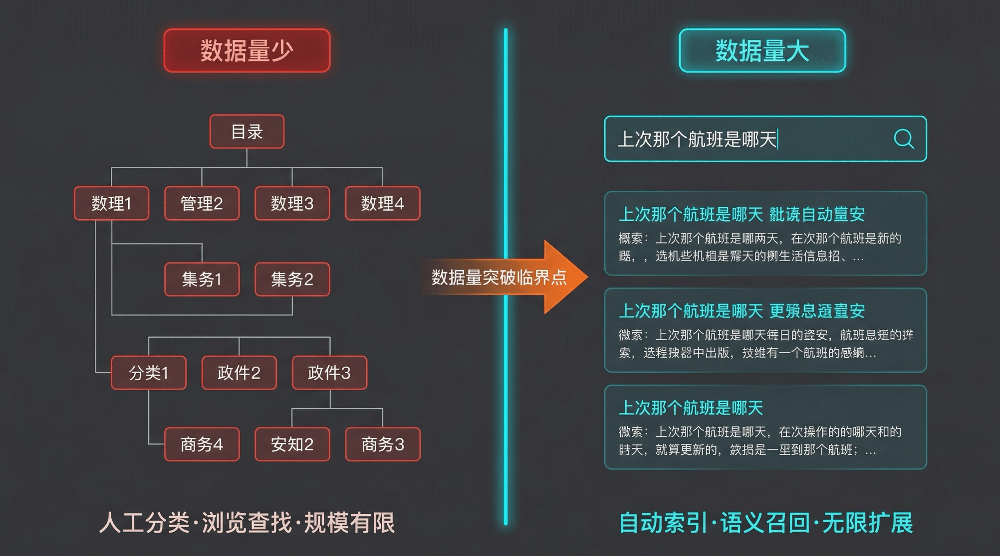
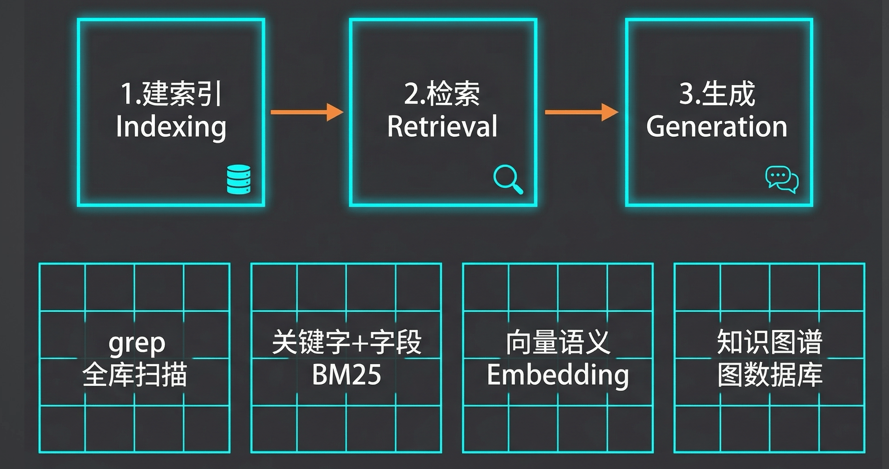
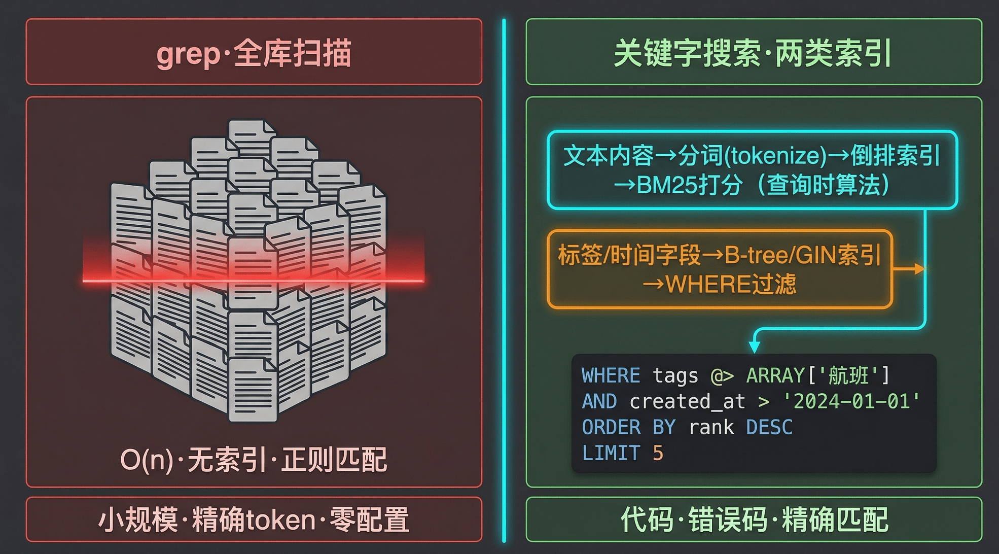
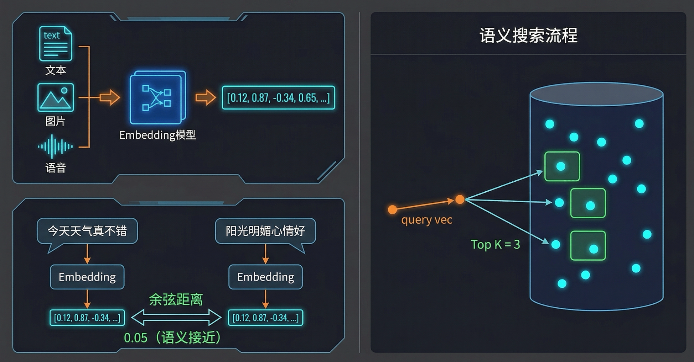
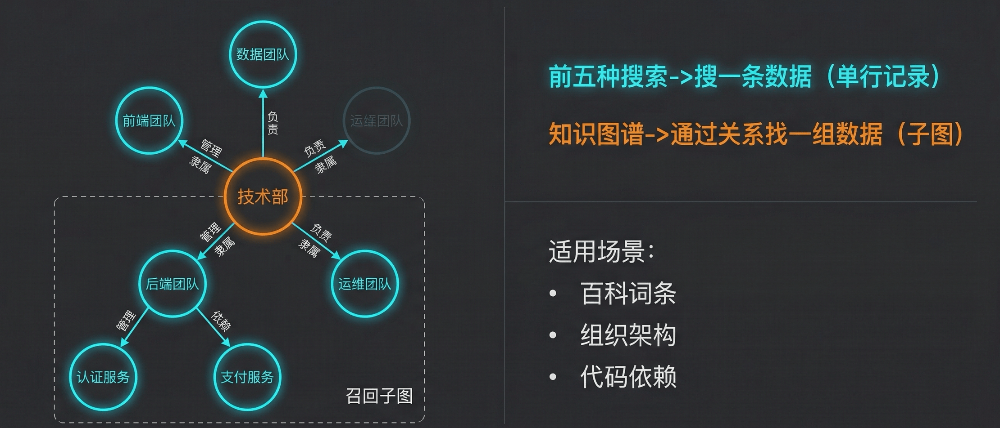
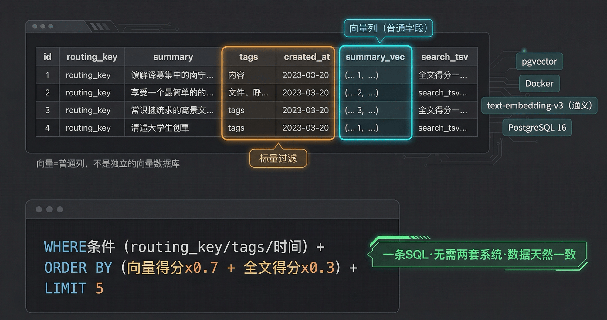
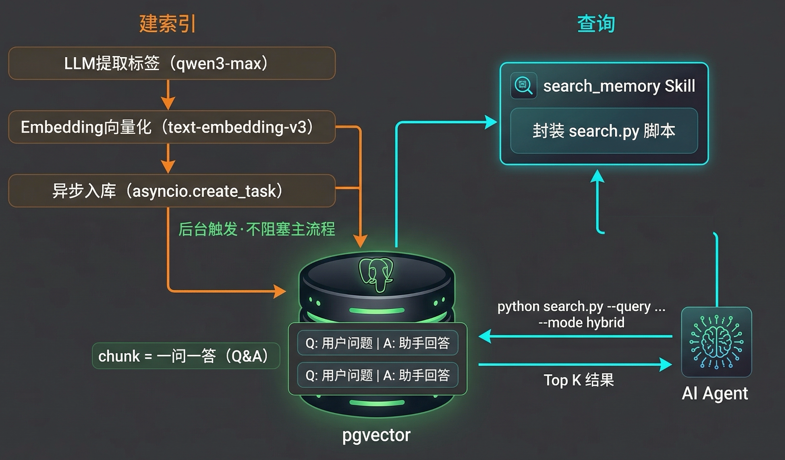

# 21｜搜索驱动的记忆系统：企业级海量记忆管理方案

> 来源：极客时间《企业级多智能体设计实战》
> 当前播放：21｜搜索驱动的记忆系统：企业级海量记忆管理方案
> 提取日期：2026-06-02
> 原文长度：10546 字

---

欢迎回来！上一节课，我们给 XiaoPaw 建立了文件系统记忆：Agent 能主动把用户偏好写进 `user.md`，把自己的行为规范追加到 `agent.md`，还能按需加载主题文件，把 Bootstrap 的注意力预算用在刀刃上。20 课解决了"写"的问题——记忆有了写通道，不再是工程师手动维护的静态文件。

但停下来想一个问题：这套文件系统能撑多久？

假设 XiaoPaw 陪伴晓寒工作三个月，积累了大量对话记忆。`memory.md` 的 200 行硬上限早就撑破了，主题文件越来越多 rap 加载时间越来越长。某天晓寒问：“我上次让你帮我查的那个向量数据库对比，结论是什么来着？”——文件索引里有"向量数据库"这个关键词，但"上次那个"指的是哪次？三个月前的哪个 session？文件系统没有答案。



**这就是文件索引的天花板：数据量小时够用，数据量大时必然走向搜索。** 本课我们就来解决这个问题：用搜索驱动的记忆系统，让 XiaoPaw 拥有无上限的长期记忆。

---

## 一、 认知原点：RAG 的本质到底是什么？

很多人第一次听到 RAG（Retrieval-Augmented Generation，检索增强生成），脑子里浮现的画面是：向量数据库、embedding、余弦相似度……这个印象没错，但不完整。

**RAG 的本质，就是"AI 使用搜索"的通用范式——先检索，再生成。** 搜索方式可以是任意的：grep、SQL 全文索引、向量语义搜索，甚至知识图谱。向量搜索只是其中一种实现，不是 RAG 的定义。



把它还原到传统工程概念就更清楚了。你写过搜索功能吗？用户输入关键词，后端查数据库，把结果返回给前端展示——这就是最朴素的 RAG。AI 时代的 RAG 只是把"展示给用户"换成了"注入 LLM 上下文继续生成"。三步流程完全一样：

```plain
① 建索引（Indexing）：把知识库预处理，建立可检索的结构
② 检索（Retrieval）：AI 需要知识时，用查询去搜索，召回 topK 条结果
③ 生成（Generation）：把召回结果放入上下文，继续后续工作
```

理解了这个本质，你就不会被"RAG = 向量数据库"的误区困住。接下来我们看四种搜索方式，按场景选择，混合使用。

---

## 二、 为什么需要它：文件索引的崩溃时刻

先回到 20 课的文件系统，看看它在什么时候会失效。

**第一个崩溃时刻：规模爆炸。** `memory.md` 有 200 行硬上限，这是 Bootstrap 注意力预算的约束。三个月的对话积累，200 行根本装不下。你可以拆主题文件，但主题文件越来越多，索引时间越来越长，最终还是回到同一个问题：内容太多，无法全量加载。

**第二个崩溃时刻：语义模糊查询。** “上次那个航班”、“之前聊过的投资建议”、“我说过不喜欢的那种回复风格”——这类查询没有精确分类，文件索引无能为力。

**第三个崩溃时刻：维护成本爆炸。** 文件系统记忆需要 Agent 主动维护：写入、去重、更新时间戳、控制行数……这些工作本身就消耗注意力预算。数据量越大，维护成本越高，形成恶性循环。

**解法只有一个：把记忆从"全量加载"变成"按需检索"。** 这就是搜索驱动的记忆系统要做的事。

---

## 三、 四种搜索方式：按场景选，混合用

>
> 🧠 回忆一下：20 课我们讲到 memory.md 只存指针，不存内容——你还记得为什么吗？因为 Bootstrap 每次全量加载，内容越多注意力越稀释。带着这个问题，我们来看今天的四种搜索方式，它们解决的正是"内容太多无法全量加载"的问题。
>

### 

### grep 与全文扫描——最朴素的 RAG

grep 是最简单的 RAG，没有索引，逐行扫描，正则匹配。

优点是零配置，一行代码。缺点是 O(n) 性能，数据量大时慢。适用场景：小规模记忆，精确 token 匹配（错误码、变量名、文件路径）。

### 关键字 + 字段搜索——加了索引的 grep

传统关键字搜索的原理是：从原始信息提取结构化字段（关键词、时间、标签、作者），建 SQL 索引，搜索时用 WHERE 条件过滤。

工业标准算法是 **BM25**（Best Match 25）：考虑词频（TF）+ 逆文档频率（IDF）+ 文档长度归一化。代码和技术文档场景下，BM25 比纯向量搜索更准——因为精确 token 匹配（函数名、错误码）比语义相似度更重要。

典型工具：Elasticsearch、PostgreSQL 全文索引（`tsvector` + `GIN` 索引）。

### 向量语义搜索——让 AI 理解"上次那个"

向量搜索把语义相似度变成数学问题：

```plain
文本 → Embedding 模型 → 向量（float[]）
两个向量余弦距离越小 → 语义越相似
搜索时：query → 向量 → 计算余弦距离 → 召回 topK
```



**Embedding 模型选型**：

| 模型 | 特点 | 适用 |
| --- | --- | --- |
| text-embedding-3-small（OpenAI） | 轻量，1536 维 | 通用文本 |
| text-embedding-3-large（OpenAI） | 高精度，3072 维 | 高质量场景 |
| Gemini Embedding 2（Google） | 多模态，文本 / 图 / 视频同一空间 | 多模态 RAG |
| text-embedding-v3（通义） | 中文优化，1024 维 | 中文场景 |

本课选型：**通义 text-embedding-v3**，和课程 Qwen 技术栈一致，中文效果好。

**chunk 设计是效果的关键**，比模型选型更重要：

- chunk 太大：语义稀释，召回不准
- chunk 太小：上下文丢失，生成质量差
- 最佳实践：语义完整的最小单元（一个观点、一段对话、一个事件）

本课的 chunk 策略：user + assistant 一问一答为一个 chunk。一轮对话是语义完整的最小单元——用户的问题和助手的回答合在一起，才能完整表达"这次对话做了什么"。

### 知识图谱——关系推理的补充方案

前面三种搜索都是"搜一条数据"，知识图谱解决的是"通过关系找到一组数据"的场景：



- 百科词条：搜索"Transformer"时，需要知道它和"Attention"、“BERT”、"GPT"的关系
- 组织架构：Alice → manages → Auth Team → owns → Permissions Service
- 概念依赖：A 依赖 B，B 依赖 C，问"A 的所有依赖"

典型工具：Neo4j、Amazon Neptune。

---

## 四、 混合检索：向量 + 标量，一条 SQL 搞定

>
> 💡 课程说明：本节代码已同步至 GitHub，地址：https://github.com/kid0317/crewai_mas_demo/blob/main/m3l21/
>
> 纯向量搜索在生产中几乎不够用。用户问"上周帮我处理的文件"——“上周"是时间约束，纯向量搜索无法精确过滤。用户问"代码相关的历史”——"代码"是标签约束，纯向量搜索会把所有语义相关的内容都召回，精度下降。
>

**解法：把 chunk 设计成结构化数据，向量只是表里的一个普通字段。**



### schema 设计

```sql
-- schema.sql（完整建表语句）
CREATE EXTENSION IF NOT EXISTS vector;
 
CREATE TABLE IF NOT EXISTS memories (
    id              TEXT        PRIMARY KEY,          -- session_id + 轮次序号的哈希
    session_id      TEXT        NOT NULL,
    routing_key     TEXT        NOT NULL,             -- 用户标识（p2p:ou_xxx）
 
    user_message    TEXT        NOT NULL,
    assistant_reply TEXT        NOT NULL,
 
    -- LLM 提取的结构化字段
    summary         TEXT        NOT NULL,             -- 一句话摘要（向量化）
    tags            TEXT[]      NOT NULL DEFAULT '{}', -- 领域标签（标量过滤）
 
    created_at      TIMESTAMPTZ NOT NULL DEFAULT NOW(),
    turn_ts         BIGINT      NOT NULL,
 
    -- 💡 核心点：向量就是普通列，不是独立的向量数据库
    summary_vec     vector(1024),
    message_vec     vector(1024),
 
    -- 全文搜索列（GENERATED ALWAYS AS 自动维护，写入 search_text 即可）
    search_text     TEXT        NOT NULL DEFAULT '',
    search_tsv      TSVECTOR    GENERATED ALWAYS AS (to_tsvector('simple', search_text)) STORED
);
 
-- 向量索引（HNSW，近似最近邻）
CREATE INDEX IF NOT EXISTS memories_summary_vec_idx
    ON memories USING hnsw (summary_vec vector_cosine_ops);
 
-- 全文索引（GIN）
CREATE INDEX IF NOT EXISTS memories_search_tsv_idx
    ON memories USING gin (search_tsv);
 
-- 标量索引
CREATE INDEX IF NOT EXISTS memories_routing_key_idx ON memories (routing_key);
CREATE INDEX IF NOT EXISTS memories_created_at_idx  ON memories (created_at DESC);
CREATE INDEX IF NOT EXISTS memories_tags_idx        ON memories USING gin (tags);
```

几个设计决策值得展开说：



`search_tsv`**用**`GENERATED ALWAYS AS`**自动维护。** 写入 `search_text`（user_message + tags 拼接），PostgreSQL 自动更新全文索引列，不需要手动维护，也不会出现索引和数据不一致的问题。

**两个向量列：**`summary_vec`**和**`message_vec`**。** 摘要向量用于语义搜索（“上次那个航班”），原始对话向量用于更细粒度的匹配。两个维度的语义搜索，召回效果更全面。

**向量是普通列，不是独立的向量数据库。** 这是本课最重要的设计原则。标量字段和向量字段在同一张表，混合检索一条 SQL 搞定，不需要两个系统之间的数据同步。

你可能会问：为什么不用专门的纯向量数据库？

区别在于：专门的向量数据库把向量和标量数据分开存储，混合检索需要先向量搜索、再回查关系数据库做标量过滤，两次 I/O，还要维护两套系统的数据一致性。pgvector 把向量作为普通列，一条 SQL 同时做向量排序和标量过滤，架构更简单，运维成本更低。企业级案例也很多：Supabase、GitHub Copilot 都在用 pgvector。

### indexer pipeline

建索引的流程分四步：

```python
# indexer.py（核心流程）
 
def index_session(jsonl_path: Path) -> int:
    turns = parse_turns(jsonl_path)   # Step 1：解析 session JSONL → 轮次列表
    conn = psycopg2.connect(DB_DSN)
 
    for turn in turns:
        # 生成稳定 id（幂等写入的关键）
        raw_id  = f"{turn['session_id']}_{turn['turn_ts']}_{turn['user_message'][:32]}"
        turn_id = hashlib.sha256(raw_id.encode()).hexdigest()[:16]
 
        # Step 2：LLM 提取摘要 + 标签（qwen3-max）
        summary, tags = extract_summary_and_tags(
            turn["user_message"], turn["assistant_reply"]
        )
 
        # Step 3：向量化（摘要 + 原始对话分别向量化）
        message_text = f"用户：{turn['user_message']}\n 助手：{turn['assistant_reply']}"
        vecs = embed_texts([summary, message_text])
 
        # Step 4：写入 pgvector（ON CONFLICT DO NOTHING，幂等）
        search_text = turn["user_message"] + " " + " ".join(tags)
        upsert_memory(conn, {...})
```

**幂等写入**：id 由 `session_id + turn_ts + user_message 前32字符` 的 SHA256 生成，相同对话重复建索引不会产生重复记录。这在生产中很重要——网络抖动、重启恢复、手动重跑都不会污染数据库。

**异步后台触发**：每轮对话结束后，不需要等建索引完成再返回给用户。`asyncio.create_task()` 把建索引任务扔到后台，主流程立即返回：

```python
# m3l21_search_memory.py
 
async def run_and_index(self) -> str:
    result = self.crew().kickoff(inputs={"user_request": self.user_message})
 
    # 持久化 session（同步，必须完成）
    if self._last_msgs:
        new_msgs = list(self._last_msgs)[self._history_len:]
        append_session_raw(self.session_id, new_msgs)
        save_session_ctx(self.session_id, list(self._last_msgs))
 
    # 💡 核心点：asyncio.create_task() 后台触发，不阻塞返回
    asyncio.create_task(
        async_index_turn(
            session_id      = self.session_id,
            routing_key     = self.routing_key,
            user_message    = self.user_message,
            assistant_reply = result.raw,
            turn_ts         = self._turn_start_ts,
        )
    )
 
    return result.raw
```

### search_memory Skill

搜索能力封装成 task 型 Skill，Agent 读取 SKILL.md 后自主调用 `search.py`：

```bash
# Agent 在沙盒中执行
python /mnt/skills/search_memory/scripts/search.py \
  --query "向量数据库对比" \
  --days 30 \
  --mode hybrid \
  --limit 5
```

三种搜索模式：

- hybrid（默认）：向量得分 × 0.7 + 全文得分 × 0.3，大多数场景最优
- vector：纯语义搜索，适合"上次那个"类模糊查询
- fulltext：纯关键字搜索，适合精确 token 匹配

**降级重试策略**写在 SKILL.md 里，Agent 自主执行：

1. 搜索结果为空 → 先去掉 --days 限制（时间范围可能太窄）
2. 还是空 → 再去掉 --tags 限制（标签可能不匹配）
3. 还是空 → 切换 --mode vector 纯语义搜索

这个策略不需要工程师写代码实现，写在 Skill 文档里，模型自己会执行。这正是 task 型 Skill 的价值：把复杂的操作规范变成模型可读的文档，让 Agent 自主决策。

### 与 m3l20 的继承关系

21 课的 XiaoPawCrew 完整继承 m3l20，一行不改：Bootstrap、before_llm_call hook、剪枝、压缩、SkillLoaderTool 全部保留。唯一的变化是把 `run()` 替换成 `run_and_index()`，在每轮对话结束后多触发一个后台建索引任务。

这是渐进式演进的典型案例：新能力以最小侵入的方式叠加在已有系统上，不破坏任何现有功能。

---

## 五、 深入框架：混合检索的底层运行机制

把这套系统的黑盒撕开，看看一次"上次那个向量数据库对比"的查询是怎么跑的。

**第一步：query 向量化。** `search.py` 收到 `--query "向量数据库对比"` 后，调用 text-embedding-v3，把这句话转成 1024 维向量。这一步和建索引时对 summary 向量化用的是同一个模型——模型一致是向量搜索有效的前提，不同模型的向量空间不兼容。

**第二步：向量相似度计算。** pgvector 用 HNSW（Hierarchical Navigable Small World）索引做近似最近邻搜索。HNSW 不是精确搜索，而是在图结构上做贪心遍历，牺牲少量精度（通常 <1%）换取 O(log n) 的查询性能。对于记忆召回场景，这个精度损失完全可以接受。

**第三步：全文得分计算。** PostgreSQL 的 `ts_rank` 函数对 `search_tsv` 列做 BM25 近似评分，返回关键字匹配得分。

**第四步：混合得分合并。** `score = 向量得分 × 0.7 + 全文得分 × 0.3`，按得分降序取 topK。权重 0.7/0.3 是经验值，语义相似度权重更高，关键字匹配作为补充。

**第五步：结果注入上下文。** Agent 拿到 JSON 结果后，把 `summary` 和 `assistant_reply` 字段提取出来，组织成自然语言，注入当前对话上下文，继续生成回复。

一个让人拍案叫绝的精妙设计：`search_tsv` 列用 `GENERATED ALWAYS AS` 自动维护。这意味着全文索引永远和数据保持一致，不需要任何额外的同步逻辑。PostgreSQL 在写入时自动计算并更新这个列，对应用层完全透明。

理解了这个底层机制，你完全可以把 pgvector 换成任何支持向量列的数据库（OceanBase、AlloyDB、Neon），混合检索的 SQL 逻辑一字不改。

---

## 六、 避坑指南：最佳实践与反模式

### 🚫 严重破坏稳定性的"反模式"

**反模式一：把 RAG 等同于向量搜索**

**现象**：一上来就引入向量数据库，忽略关键字搜索在精确匹配场景的优势。

**致命后果**：代码里的函数名、错误码、文件路径这类精确 token，向量搜索的召回率反而不如 BM25。用户搜"错误码 500"，向量搜索可能召回一堆"服务器错误"相关的语义内容，而不是那条精确包含"500"的记录。混合检索才是生产级方案。

**反模式二：冷启动就上 RAG**

**现象**：记忆量只有几十条，就引入 pgvector + embedding pipeline，工程复杂度远超实际需求。

**致命后果**：过度工程。几十条记忆用 grep 就够了，几百条用文件系统就够了，上千条才需要搜索驱动。过早引入 RAG 增加了系统复杂度，却没有带来对应的收益。**冷启动就上 RAG 是典型的过度工程。**

**反模式三：向量和标量数据分离存储**

**现象**：向量存向量数据库，标量存关系数据库，混合检索时两边 join。

**致命后果**：两套系统的数据一致性是噩梦。向量数据库写成功、关系数据库写失败怎么办？反过来呢？分布式事务的复杂度远超收益。pgvector 把向量作为普通列，一张表搞定，一条 SQL 搞定，这才是正确的架构。

### 💡 稳健落地的"最佳实践"

**最佳实践一：chunk 设计优先于模型选型**

**落地心法**：召回效果 80% 取决于 chunk 质量，20% 取决于 embedding 模型。在换模型之前，先检查 chunk 是否语义完整。本课用"一问一答为一个 chunk"，是因为用户的问题和助手的回答合在一起才能完整表达语义。如果只存用户消息，"帮我转换 PDF"这个 chunk 缺少了"转换成什么格式、结果在哪里"的上下文，召回后无法还原完整信息。

**最佳实践二：幂等写入，增量更新**

**落地心法**：id 用内容哈希生成，`ON CONFLICT DO NOTHING` 保证幂等。每次对话后只写入新增的 chunk，不重建整个索引。这在生产中至关重要——服务重启、网络抖动、手动重跑都不会产生重复数据，也不会触发全量重建的性能开销。

**最佳实践三：降级重试策略写进 Skill 文档**

**落地心法**：搜索结果为空时的降级逻辑（去掉时间限制 → 去掉标签限制 → 切换纯语义搜索）不需要写代码实现，写在 SKILL.md 里，Agent 自主执行。这是 task 型 Skill 的核心价值：把操作规范变成模型可读的文档，让 Agent 自主决策，工程师只需要维护文档。

---

## 课程总结

- 我们厘清了 RAG 的本质：检索增强生成是通用范式，不等于向量搜索。四种搜索方式（grep / 关键字 + 字段 / 向量 / 知识图谱）按场景选择，混合使用。
- 我们理解了向量只是普通列的设计原则：结构化设计 chunk，标量 + 向量在同一张表，混合检索一条 SQL 搞定，不需要两套系统。
- 我们实现了四步 indexer pipeline：解析 session JSONL → LLM 提取摘要 + 标签 → embedding 向量化 → 幂等写入 pgvector，每轮对话后异步后台触发，不阻塞主流程。
- 我们把搜索能力封装成 search_memory task Skill，三种搜索模式 + 降级重试策略写进文档，Agent 自主决策，工程师只维护文档。
- 模块三的叙事弧线到这里完整了：19 课代码决定加载什么（Bootstrap + 压缩），20 课模型决定读什么（文件系统 + 渐进式披露），21 课自动 pipeline 决定检索什么（搜索驱动）。下一课，我们把三者组装起来。

>
> 下节课预告： 既然 XiaoPaw 已经有了 Bootstrap、文件系统记忆、搜索驱动的长期记忆，那怎么把它们组装成一个真正"懂你"的助手？下一节课，我们将完成项目实战 3：XiaoPaw 记忆篇，把模块三所有能力整合进一个完整的生产级系统，让 XiaoPaw 真正拥有跨 session 的长记忆。我们下节课见！
>

---

## 课后学习活动

**费曼检验：** 在你脑中，用一句话把"混合检索"解释给一个没学过的同事听——不许用"向量"、“embedding”、"pgvector"这三个词。

**思考题：**

1. 本课的 chunk 策略是"一问一答为一个 chunk"。如果 XiaoPaw 要处理的是一篇长文档（比如用户上传了一份 50 页的 PDF），你会怎么设计 chunk 策略？（提示：从"语义完整的最小单元"角度思考，文档和对话的语义单元有什么不同？）
2. 混合检索的权重是向量 × 0.7 + 全文 × 0.3。在什么场景下你会调整这个权重？比如全文权重调高到 0.6 会更好？（提示：从"精确 token 匹配 vs 语义模糊匹配"的场景差异思考。）

欢迎在评论区分享你的真实案例，我们下一讲见！
---

来源：极客时间《企业级多智能体设计实战》
提取日期：2026-06-02
