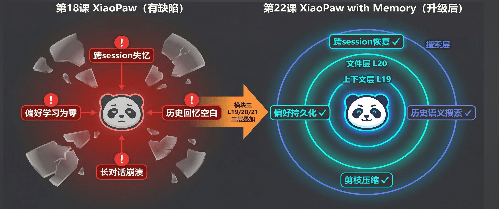
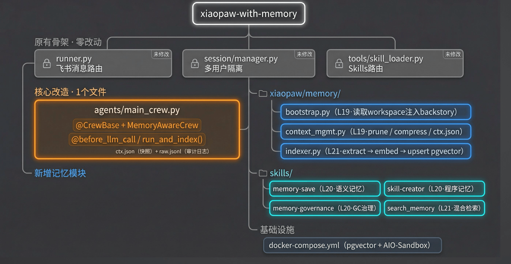
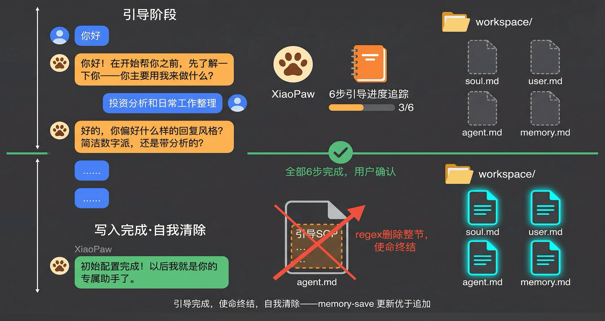
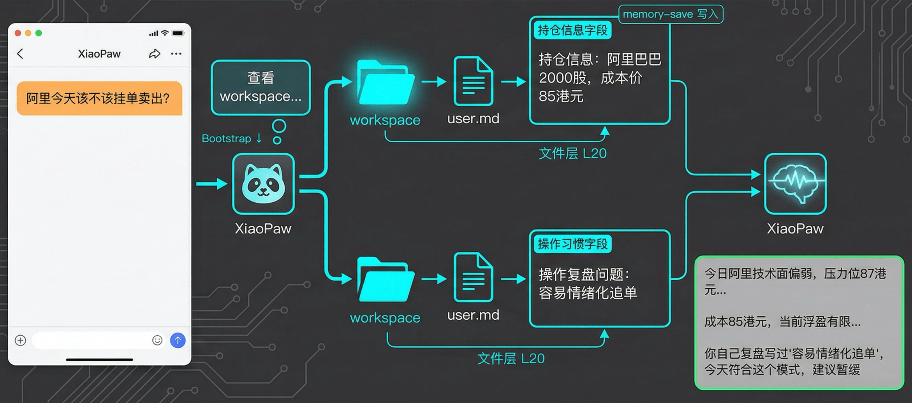
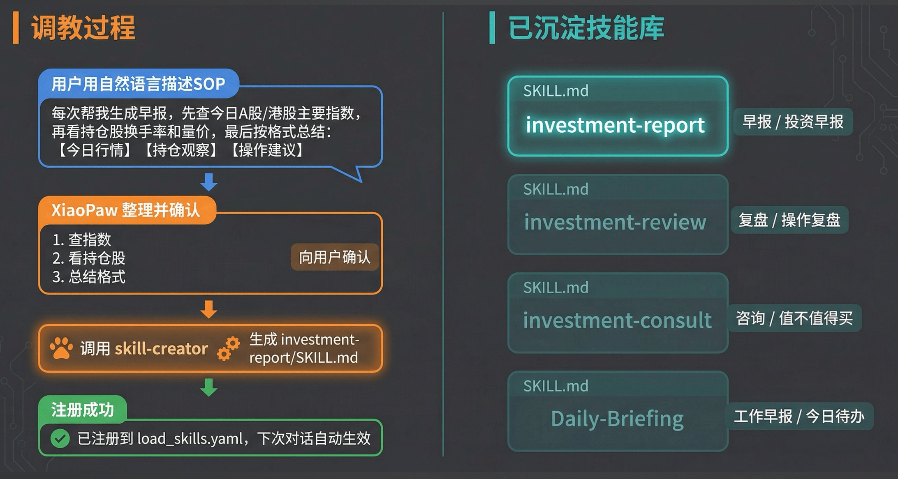
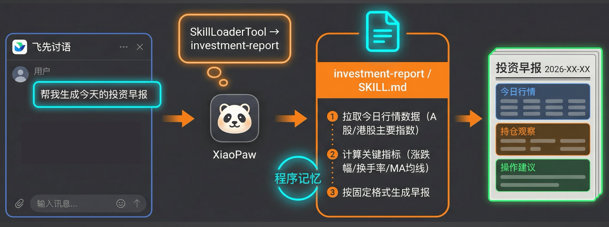
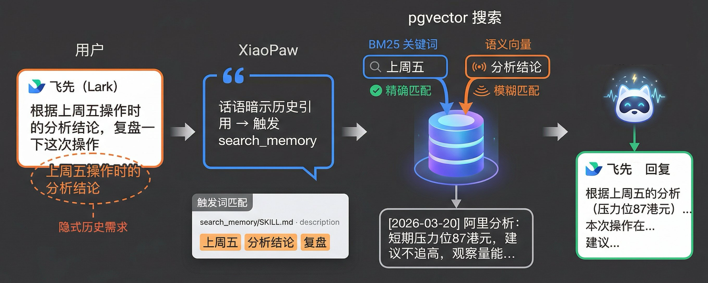
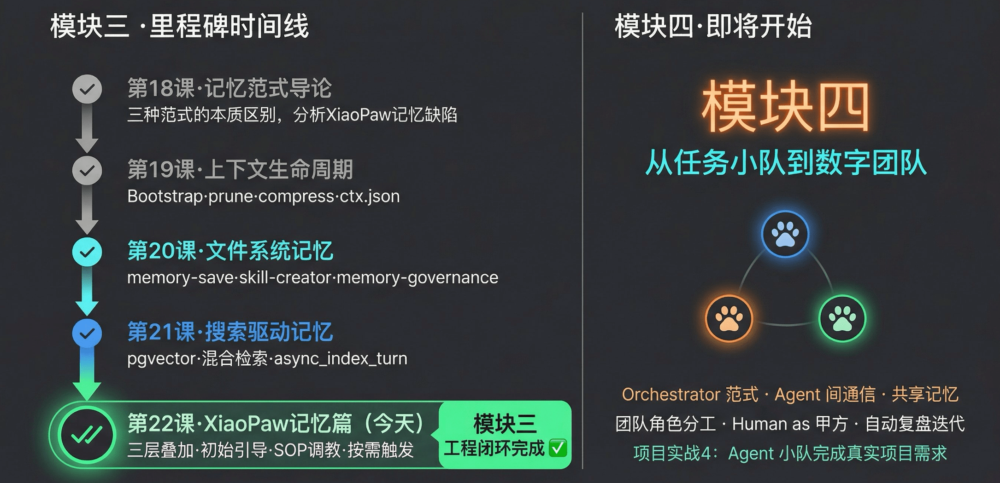

# 22｜项目实战3：XiaoPaw记忆篇：打造懂你的长记忆助手

> 来源：极客时间《企业级多智能体设计实战》
> 当前播放：22｜项目实战3：XiaoPaw记忆篇：打造懂你的长记忆助手
> 提取日期：2026-06-02
> 原文长度：15323 字

---

欢迎回来！上一节课，我们给 XiaoPaw 建立了搜索驱动的记忆系统——用 pgvector 把每一轮对话向量化入库，让 Agent 能精准召回几个月前的某次分析结论。至此，三层记忆的最后一块拼图落地了。

但学完 19、20、21 课，你心里可能有一个问题：**这三层能力，怎么在一个真实产品里协同工作？** 光懂原理不够，还得看得见、用得上。这就是今天这节课要做的事：我们把 L19 上下文层、L20 文件层、L21 搜索层全部集成进来，把 XiaoPaw 从一个工具升级成一个**真正懂你的长记忆助手**。

这是模块三的收官实战。把它跑通之后，你就拥有了一个可以真正交付的、带完整记忆系统的 AI 助手工程模板。

---

## 一、需求分析：模块三开篇留的坑，今天来填

还记得第 18 课吗？我们当时拿 XiaoPaw 做解剖，找出了它最致命的四个记忆缺陷。



从图里可以看到，左边那只茫然的小爪子有四个硬伤：

- 跨 session 失忆：你昨天跟它说的所有话，今天重启之后全忘。每次对话都是从陌生人开始。
- 长对话崩溃：聊太久了，token 超限，直接报错。工具越强大，这个问题越刺眼。
- 偏好学习为零：你说了一百遍"别用表格"，它下次还用。没有持久化写通道，说再多都白说。
- 历史回忆空白：问"我上次那个投资分析结论是什么"，一问三不知。当时就算跟它聊过，它也完全想不起来。

我们用了三节课分别解决这四个问题：19 课用 `ctx.json` + prune + compress 解决了跨 session 失忆和长对话崩溃；20 课用 `memory-save` 解决了偏好写入；21 课用 pgvector 解决了历史语义回忆。

今天，我们把这三层能力全部集成，让右边那只发光的小爪子从图纸变成代码。

---

## 二、架构设计：骨架没动，长出了记忆系统

在动手之前，先看整体改动量——这对你评估后续改造自己的项目很有参考价值。



架构图传递了一个重要信号：**原有骨架一行代码没动。** 飞书消息路由（`runner.py`）、多用户 session 隔离（`session/manager.py`）、Skills 路由（`tools/skill_loader.py`）——这三个核心模块全部锁着不动。

真正的改动集中在四个地方：

**① 核心改造：**`agents/main_crew.py`**这 1 个文件**

加了两个关键装饰：`@before_llm_call` 钩子和 `run_and_index()` 方法。前者在每轮 LLM 调用前执行上下文管理（L19 的 prune/compress/ 恢复），后者在每轮结束后持久化 `ctx.json` 并建立向量索引（L21 的 embed + upsert）。

**② 新增记忆模块：**`xiaopaw/memory/`

三个文件，分别对应三层记忆：

- bootstrap.py：L19，读取 workspace 注入 backstory
- context_mgmt.py：L19，prune / compress / ctx.json 管理
- indexer.py：L21，extract → embed → upsert 到 pgvector

**③ 新增 Skills：**`skills/`

四个 Skill 文件，全部通过自然语言写成 `.md`，无需改代码：

- memory-save（L20，语义记忆写入）
- skill-creator（L20，程序记忆沉淀）
- memory-governance（L20，记忆 GC 治理）
- search_memory（L21，混合检索历史对话）

**④ 基础设施：**`docker-compose.yml`

在原来 AIO-Sandbox 的基础上，增加一个 pgvector 容器。启动时自动执行 schema SQL，把 21 课定义的记忆表结构建好。

这个改动量说明了一件事：记忆系统是"长出来的"，不是"侵入进去的"。好的工程设计留了扩展空间，后来加的东西只需要挂上去，不需要动骨架。

---

## 三、初始引导：从空白到有灵魂

产品化一个 AI 助手，第一个要解决的问题是：**第一次启动时怎么办？**

没有引导，workspace 是空的——`soul.md` 没有名字，`user.md` 没有用户背景，`agent.md` 没有行为规范，`memory.md` 一片空白。一个什么都不知道的助手，谈什么懂你？

过去处理"首次启动"的方式是在代码里加判断逻辑，写一堆 `if is_first_time` 的分支。但 XiaoPaw 采用了一个更优雅的方式：**把引导程序写进**`agent.md`**本身。**



具体机制是这样的：

在 `workspace-init/agent.md` 里，内置了一段"初始引导 SOP"，用进度列表跟踪完成状态：

```plain
# 初始引导 SOP（agent.md 内置）
 
引导进度（每步完成后调用 memory-save 更新打勾）：
- [ ] ① 起名        — 介绍自己，问是否改名
- [ ] ② 主要用途    — 让用户用自己的话描述
- [ ] ③ 回复风格    — 根据用途推理 3 个候选，用户选择
- [ ] ④ 用户信息    — 聚焦问 1-2 个最关键背景
- [ ] ⑤ 禁忌        — 问有没有特别不想看到的
- [ ] ⑥ SOP 调教    — 提出 1 个核心 SOP 草案，确认后调用 skill-creator 沉淀
```

**触发时机完全由对话决定。** 不是程序判断"第一次启动"，而是 Agent 自己在对话中发现引导节存在，自然开始或继续引导。用户随时可以打断去做别的事，下次 session 回来，XiaoPaw 会提醒继续——因为进度列表里的 `[x]` 和 `[ ]` 就是断点记录。引导可以跨 session 分多次完成，不会重复。

**自我清除机制是这套设计的点睛之笔。** 六步全部完成后，XiaoPaw 会调用 `memory-save`，用 Python regex 脚本把整个引导节从 `agent.md` 里删掉。引导完成，不留痕迹，也不再消耗后续每次 session 的 token 预算。

你可能会问：为什么写在 `agent.md` 里而不是代码里？

因为引导逻辑是 Agent 的行为规范，不是程序流程。写在 `agent.md` 里，用户可以随时调整引导的步骤和问法；写在代码里，逻辑就固化了。更重要的是，这六步完成后，所有信息都通过 `memory-save` 写进了 `soul.md`、`user.md`、`agent.md` 的对应字段——而 `bootstrap.py` 每次 session 启动都会把这四个文件注入 backstory。

**一次引导，永久生效。这就是 L20 写通道和 L19 读通道形成闭环的具体机制。**

---

## 四、演示一：持仓和习惯，memory-save 早就帮你记好了

引导完成之后，XiaoPaw 已经知道了你是谁、你用它做什么。现在来看第一个实际使用场景：每天早上问一句"阿里今天该不该挂单卖出？"



用户只说了一句话，没有给任何背景信息。但 XiaoPaw 拿到这句话之后，第一件事是查看 workspace——这是 `bootstrap.py` 在 session 启动时就注入进来的内容。

它从 `user.md` 里找到了两块关键信息（两条青色路径同时走）：

- 持仓信息字段：持仓信息：阿里巴巴 2000 股，成本价 85 港元 ——这是某次聊天时，你随口说了持仓，XiaoPaw 判断这是需要长期记住的事实，调用 memory-save 写进去的。
- 操作习惯字段：操作复盘问题：容易情绪化追单 ——这是某次复盘时，你自己总结的操作教训，同样通过 memory-save 写入。

两条路径汇合，XiaoPaw 有了足够的上下文，再配合实时行情工具，给出了一个"精准刺"级别的回答：

>
> 今日阿里技术面偏弱，压力位 87 港元……成本 85 港元，当前浮盈有限……你自己复盘写过"容易情绪化追单"，今天符合这个模式，建议暂缓。
>

这个体验的关键不是 AI 有多聪明，而是**你过去说过的话，它全记着**。`memory-save` 是写通道，`bootstrap.py` 是读通道，两者加在一起，就是"懂你"的工程实现。

---

## 五、演示二：聊天调教 SOP，一句话触发早报

文件层解决了"记住事实"的问题。现在来看另一种记忆：**程序记忆——记住你的工作流程。**

假如你每天早上都要生成一份投资早报。最笨的方式是每次手动写步骤，或者写一段死板的脚本。XiaoPaw 的方式是：用聊天调教，把 SOP 沉淀成 Skill。



整个调教过程分四步：

1. 用户用自然语言描述 SOP：“每次帮我生成早报，先查今日 A 股 / 港股主要指数，再看持仓股换手率和量价，最后按格式总结：【今日行情】【持仓观察】【操作建议】”
2. XiaoPaw 整理并向用户确认：把 SOP 结构化成编号步骤，展示给用户确认没有遗漏
3. 调用 skill-creator：基于确认好的 SOP，生成标准格式的 investment-report/SKILL.md，写明触发词、描述、步骤和约束
4. 注册到 load_skills.yaml：下次对话自动生效，SkillLoaderTool 能路由到这个 Skill

调教一次，终身可用。你可以用同样的方式沉淀任意多个 Skill：操作复盘、价值投资咨询、工作日待办……每沉淀一个，你的 XiaoPaw 就多一项可靠的程序记忆。

调教完成之后，早报使用起来是什么感受？



用户只发了一句话：“帮我生成今天的投资早报”。这句话触发了 `SkillLoaderTool`，路由到 `investment-report/SKILL.md`，按照当时调教好的三步流程——① 拉取行情数据，② 计算关键指标，③ 按格式生成——输出一份完整的早报。

**SOP 已沉淀为程序记忆，用户每次只需要一句话。** 这就是 20 课"skill-creator"在实际产品里的使用方式。

---

## 六、演示三：它知道去哪找——按需触发历史语义搜索

前两个演示用的都是文件层（L20）。现在来看搜索层（L21）出场的时刻。

“根据上周五操作时的分析结论，复盘一下这次操作。”



这句话里没有说"帮我搜索"，也没有说"查一下记录"。但 XiaoPaw 识别出了其中的**隐式历史需求**——“上周五”、“分析结论”、"复盘"这三个词，是 `search_memory/SKILL.md` 的触发词。description 写清楚了：“当用户提及过去的操作、结论、分析，或者要求复盘回顾时，触发本 Skill。”

触发之后，搜索走两条路同时进行：

- BM25 关键词路：精确匹配"上周五"这个时间词，召回时间区间内的对话
- 语义向量路：把"分析结论"向量化，在 pgvector 里找语义相近的对话片段

两路结果合并，找到了那条对话：`[2026-03-20] 阿里分析：短期压力位 87 港元，建议不追高，观察量能……`

拿到这段历史记忆，XiaoPaw 结合当时的操作结果，给出了一份真正有上下文的复盘建议。

**用户没说"去搜"——description 让它知道什么时候该搜。** 这是 21 课"混合检索"在产品里真正发挥作用的地方。

---

## 七、工程实现：代码逐层拆解

>
> 💡 课程说明：完整代码见 https://github.com/kid0317/xiaopaw-with-memory ，包含集成测试 tests/integration/，覆盖初始引导、早报生成、历史搜索共 11 个端到端测试用例（全部 PASS）。
>

产品演示看完了，现在来看代码。改动比你想象的要少——我们逐层拆开，看每层加了什么。

### 7.1 初始引导：`workspace-init/agent.md` 内置 6 步 SOP

这是整个引导机制的核心文件。你不需要写任何代码，只需要在 `agent.md` 里用自然语言把 SOP 写清楚：

```markdown
## 初始引导 SOP（首次配置专用）
 
> **CRITICAL**：只要本节存在，每次 session 开始时检查「引导进度」，
> 从未完成的步骤继续。全部完成并确认后，调用 memory-save（target=agent）
> 将本节整体移除，完成自我清除。
 
### 引导进度（每步完成后用 memory-save 更新此列表）
 
- [ ] ① 起名
- [ ] ② 主要用途
- [ ] ③ 回复风格
- [ ] ④ 用户信息
- [ ] ⑤ 禁忌
- [ ] ⑥ SOP 调教
```

每步完成后，XiaoPaw 调用 `memory-save`，用 `str_replace` 把 `[ ]` 改为 `[x]`，进度就跨 session 持久化了。全部完成后，调用 `memory-save` 执行一段 Python regex 脚本，把整个引导节从 `agent.md` 里删掉：

```python
import re, pathlib
p = pathlib.Path('/workspace/agent.md')
content = p.read_text()
# 删除从 section 标题行到下一个 '---' 分隔线之前的所有内容
new_content = re.sub(
    r'## 初始引导 SOP（首次配置专用）.*?(?=^---|\Z)',
    '',
    content,
    flags=re.DOTALL | re.MULTILINE,
)
p.write_text(new_content.strip() + '\n')
```

注意这里用 regex 而不是 `str_replace`——因为引导过程中每步都修改了 `[ ]` 的状态，原始文本已经不存在，`str_replace` 会匹配失败。regex 按 section 标题删整节，是更稳健的做法。

---

### 7.2 核心改造：`MemoryAwareCrew` @CrewBase 类

`agents/main_crew.py` 是唯一被改动的原有文件。改动的核心是从原来的函数式构造方式升级为 `@CrewBase` 类，以便绑定 `@before_llm_call` 钩子。

>
> 🧠 回忆一下：@before_llm_call 只能绑定在 @CrewBase 装饰的类上，手动构造的 Crew 实例无法注册钩子。这是 19 课的结论。
>

```python
from crewai.hooks import LLMCallHookContext, before_llm_call
from crewai.project import CrewBase, agent, crew, task
 
from xiaopaw.memory.bootstrap import build_bootstrap_prompt
from xiaopaw.memory.context_mgmt import (
    load_session_ctx, save_session_ctx, append_session_raw,
    prune_tool_results, maybe_compress,
)
from xiaopaw.memory.indexer import async_index_turn
 
@CrewBase  # 💡 核心点：@CrewBase 才能绑定 @before_llm_call hook
class MemoryAwareCrew:
 
    @agent
    def orchestrator(self) -> Agent:
        cfg = dict(_load_yaml(_CONFIG_DIR / "agents.yaml")["orchestrator"])
        # 💡 核心点：用 build_bootstrap_prompt() 动态覆盖静态 YAML backstory
        cfg["backstory"] = build_bootstrap_prompt(self._workspace_dir)
        ...
```

`@before_llm_call`**钩子**——每轮 LLM 调用前拦截，做三件事：

```python
@before_llm_call
def before_llm_hook(self, context: LLMCallHookContext) -> bool | None:
    if not self._session_loaded:
        self._restore_session(context)  # ① 首次：从 ctx.json 恢复历史
        self._session_loaded = True
 
    self._last_msgs = context.messages  # 保存引用，run_and_index 后用
 
    prune_tool_results(context.messages, keep_turns=self._prune_keep_turns)  # ② 剪枝
    maybe_compress(context.messages, context)                                 # ③ 压缩
    return None
```

`run_and_index()`——每轮结束后的持久化 + 异步建索引：

```python
async def run_and_index(self) -> str:
    result = await self.crew().akickoff(inputs={...})
 
    # ① 持久化 ctx.json + raw.jsonl
    if self._last_msgs:
        new_msgs = list(self._last_msgs)[self._history_len:]
        append_session_raw(self.session_id, new_msgs, ctx_dir=self._ctx_dir)
        save_session_ctx(self.session_id, list(self._last_msgs), ctx_dir=self._ctx_dir)
 
    assistant_reply = result.pydantic.reply  # ② 提取 reply
 
    # ③ 异步建索引，不阻塞主流程返回
    if self._db_dsn:
        _task = asyncio.create_task(   # 💡 必须持有引用，防止 Python GC 取消任务
            async_index_turn(
                session_id      = self.session_id,
                user_message    = self.user_message,
                assistant_reply = assistant_reply,
                turn_ts         = self._turn_start_ts,
                db_dsn          = self._db_dsn,
            )
        )
 
    return assistant_reply
```

三件事组合起来就是 19、21 课能力在 Crew 层面的完整挂载。

---

### 7.3 `bootstrap.py`：读 workspace，构建 backstory

```python
def build_bootstrap_prompt(workspace_dir: Path) -> str:
    """从 workspace 读取 4 个文件，构建 XML 标签式 backstory。"""
    parts: list[str] = []
 
    # soul / user / agent 三个文件完整注入
    for fname, tag in [
        ("soul.md",  "soul"),
        ("user.md",  "user_profile"),
        ("agent.md", "agent_rules"),
    ]:
        path = workspace_dir / fname
        if path.exists():
            content = path.read_text(encoding="utf-8").strip()
            parts.append(f"<{tag}>\n{content}\n</{tag}>")
 
    # memory.md 限制 200 行防膨胀：只是导航索引，不是内容仓库
    memory_path = workspace_dir / "memory.md"
    if memory_path.exists():
        lines = memory_path.read_text(encoding="utf-8").splitlines()[:200]
        parts.append(f"<memory_index>\n{chr(10).join(lines)}\n</memory_index>")
 
    return "\n\n".join(parts)
```

`soul.md` / `user.md` / `agent.md` 完整注入，`memory.md` 截取前 200 行——这是 20 课"memory 只写指针"规范在工程层面的体现。Bootstrap 每次 session 启动都重建 backstory，所以引导写入的内容"下次就生效"。

---

### 7.4 `context_mgmt.py`：上下文三把剪刀

上下文不加控制会无限膨胀，拖慢推理、撑爆 token 限制。这里有三把剪刀：

**第一把：prune（剪枝）**——把过时的 tool result 替换为占位符：

```python
def prune_tool_results(messages: list[dict], keep_turns: int = 10) -> None:
    """超出 keep_turns 的 tool 消息内容替换为 [已剪枝]。"""
    user_indices = [i for i, m in enumerate(messages) if m.get("role") == "user"]
    if len(user_indices) <= keep_turns:
        return
 
    cutoff_idx = user_indices[-keep_turns]
    for i in range(cutoff_idx):
        if messages[i].get("role") == "tool":
            messages[i]["content"] = "[已剪枝]"  # 💡 保留结构，只清空内容
```

为什么不直接删除 tool 消息？因为 `tool_call_id` 链路必须完整，直接删会让 Qwen/OpenAI 格式校验报错，保留消息结构但清空内容才是安全做法。

**第二把：compress（压缩）**——超过上下文使用率阈值时，把旧消息摘要化：

```python
def maybe_compress(messages, context, fresh_keep_turns=10, compress_threshold=0.45):
    """超过 45% 上下文使用率时：保留 system + 最近 10 轮，旧消息分块摘要。"""
    approx_tokens = sum(len(str(m.get("content", ""))) // 2
                        for m in messages if m.get("role") != "system")
    if approx_tokens / model_limit < compress_threshold:
        return  # 未超阈值
 
    # 旧消息分块，用 qwen3-turbo 摘要后以 <context_summary> system 消息插回
    old_msgs   = non_system[:cutoff]
    fresh_msgs = non_system[cutoff:]
    summary_msgs = [
        {"role": "system",
         "content": f"<context_summary>\n{_summarize_chunk(chunk)}\n</context_summary>"}
        for chunk in chunk_by_tokens(old_msgs)
    ]
    messages.clear()
    messages.extend(system_msgs + summary_msgs + fresh_msgs)
```

**第三把：ctx.json 持久化**——两份存储各有职责：

```python
# ctx.json：覆盖写，跨 session 快速恢复用的压缩快照
save_session_ctx(session_id, messages, ctx_dir)
 
# raw.jsonl：追加写，完整审计日志，调试用
append_session_raw(session_id, new_msgs, ctx_dir)
 
---
```

### 7.5 `indexer.py`：每轮异步建索引（L21）

每轮对话结束后，`run_and_index()` 用 `asyncio.create_task()` 触发这个函数，不阻塞主流程返回：

```python
async def async_index_turn(session_id, routing_key, user_message,
                            assistant_reply, turn_ts, db_dsn) -> None:
    if not db_dsn:
        return  # db_dsn 未配置，静默跳过
 
    await asyncio.get_running_loop().run_in_executor(
        None, _index_single_turn,   # 💡 同步 DB 操作放线程池，不阻塞 event loop
        session_id, routing_key, user_message, assistant_reply, turn_ts, db_dsn,
    )
 
def _index_single_turn(...):
    # 生成幂等 id（SHA256 前 16 位）
    turn_id = hashlib.sha256(f"{session_id}_{turn_ts}_{user_message[:32]}".encode()).hexdigest()[:16]
 
    conn = _connect_db(db_dsn)
    summary, tags = extract_summary_and_tags(user_message, assistant_reply)  # 💡 调 LLM 提取摘要
    vecs = embed_texts([summary, f"用户：{user_message}\n 助手：{assistant_reply}"])  # 双向量化
 
    upsert_memory(conn, {
        "id":          turn_id,
        "summary":     summary,
        "tags":        tags,
        "summary_vec": vecs[0],   # 摘要向量
        "message_vec": vecs[1],   # 原始对话向量
        "search_text": user_message + " " + " ".join(tags),  # 供 GIN 全文索引
        ...
    })  # ON CONFLICT DO NOTHING — 幂等写入
```

每轮存两个向量：`summary_vec`（摘要语义）和 `message_vec`（原始对话语义），分别用于不同的搜索场景。

---

### 7.6 四个新增 Skill 文件

Skills 全部是 `.md` 文件，无需改代码。这里只看关键设计点。

`memory-save`——语义记忆写通道，核心在"五种写入目标"的分工：

```yaml
---
name: memory-save
description: >
  当用户表达偏好、习惯、纠正 Agent 行为、确认重要决策时，
  主动（不等用户说"记住"）触发此 skill，将信息持久化到 workspace。
 ---

```

| target | 写到哪里 | 存什么 |
| --- | --- | --- |
| soul | /workspace/soul.md | XiaoPaw 自身设置（名字、人设） |
| user | /workspace/user.md | 用户偏好、习惯、个人信息 |
| agent | /workspace/agent.md | Agent 行为规范的增量更新 |
| memory_index | /workspace/memory.md | 新增主题索引条目（只写指针） |
| topic | /workspace/memory_.md | 某主题的详细内容 |

写入前有一套"准入控制"：检查 Utility（三个月后还有价值吗）、Confidence（对话中有直接证据吗）、Novelty（是否已有相同内容）——三关都过才写入，防止记忆腐化。

`skill-creator`——程序记忆写通道，关键是"注册到 yaml"这一步：

```markdown
## Saving to the sandbox (project-specific)
 
1. 将 SKILL.md 写入 `/mnt/skills/{skill-name}/SKILL.md`
2. 将技能名追加到 `/mnt/skills/load_skills.yaml`：
```

yaml

skills:

```elm
  - investment-report   # ← 新增这一行
```

```plain
3. 确认写入成功
```

`load_skills.yaml` 是 XiaoPaw 的 Skill 白名单，只有注册进去的 Skill，`SkillLoaderTool` 才能加载。`skill-creator` 在 Anthropic 原版基础上增加了这一步，这是把"创建 Skill"变成"可用 Skill"的关键环节。

`search_memory`——搜索层触发的核心是 description 的触发词设计：

```yaml
description: >
  当需要回忆任何历史对话内容时，主动触发——不需要用户说"去搜索"，
  只要话语中隐含对历史信息的依赖，就立即触发：
  - 用户引用过去的结论（"上次你说的"、"之前的分析"、"上周五操作时的结论"）
  - 用户要求复盘、回顾、对比上次
  - 回答"该不该 XX"类决策问题且背景未在当前对话出现
 
```

触发后，调用 `scripts/search.py`，混合检索的核心 SQL 是：

```python
# 混合搜索：向量得分 × 0.7 + 全文得分 × 0.3
SELECT
    id, summary, user_message, assistant_reply, tags, created_at,
    (
        0.7 * (1 - (summary_vec <=> %(query_vec)s::vector))  -- 💡 余弦相似度转得分
        + 0.3 * ts_rank(search_tsv, plainto_tsquery('simple', %(tsquery)s))
    ) AS score
FROM memories
ORDER BY score DESC
LIMIT %(limit)s
```

搜索结果为空时，按顺序放宽条件重试：先去掉时间限制，再去掉标签过滤，最后切换纯语义模式——三级降级保证召回率。

---

### 7.7 环境启动

```bash
# 1. 启动两个容器（pgvector + AIO-Sandbox）
docker-compose -f pgvector-docker-compose.yaml up -d
docker-compose -f sandbox-docker-compose.yaml up -d
 
# 2. 初始化 workspace（首次运行）
cp -r workspace-init data/workspace
 
# 3. 启动 XiaoPaw
python -m xiaopaw.main
 
# 4. 运行集成测试（可选验证）
python3 -m pytest tests/integration/test_lesson22_cases.py -v -s
```

pgvector 容器启动时会自动执行 `schema.sql`，把记忆表和向量索引建好，无需手动操作。

---

## 课程总结

- 我们梳理了模块三四大缺陷与三层记忆的对应关系，明确了 22 课的升级目标
- 我们理解了 workspace 的本质是 Agent 的可迁移状态容器，以及"骨架零改动、记忆长出来"的工程设计思路
- 我们实现了初始引导机制——用 agent.md 内置 6 步 SOP，进度持久化跨 session，完成后自我清除，形成一次引导永久生效的闭环
- 我们演示了三层记忆在真实产品中的协同：L20 文件层记住持仓与习惯，L20 skill-creator 把 SOP 沉淀为程序记忆，L21 搜索层按需召回历史分析结论
- 我们完成了模块三的工程闭环——从理解范式到落地产品，XiaoPaw 从一个工具变成了一个懂你的伙伴



模块三到这里正式收官。回看一下这段路：18 课建立范式认知，19 课管理上下文生命周期，20 课打通文件层写通道，21 课建立搜索驱动的记忆系统，22 课把三层能力集成进一个真实可交付的产品。每一课都不是独立的知识点，而是在为今天的收官做准备。

>
> 下节课预告： 既然一个 XiaoPaw 已经有记忆、有工具、有 SOP，那如果让多个 XiaoPaw 分工协作呢？下一节课，我们进入模块四——从任务小队到数字团队，看看 Orchestrator 如何调度 Agent 小队，完成一个人搞不定的真实项目需求。我们下节课见！
>

---

## 课后思考

>
> 用一句话把"XiaoPaw 的三层记忆"解释给一个没学过这门课的朋友听——不许用"向量数据库"、“上下文”、"pgvector"这些术语。
>

**思考题（模块三交错练习）：**

以下四个问题，每一个对应模块三的一节课。不按顺序——你能分别指出它们各自依赖哪节课的哪个机制吗？

1. XiaoPaw 重启之后还记得你的名字，靠的是什么？
2. "帮我生成今天早报"只需要一句话，SOP 是什么时候、怎么写进去的？
3. 你问了一个超长问题，XiaoPaw 没有报 token 超限，它偷偷干了什么？
4. "上周五那次分析"它能找到，而你的文件系统记忆里根本没有单独存，靠的是什么？

提示：从"写通道 / 读通道"和"三层记忆各司其职"的角度思考，答案就清晰了。

欢迎在评论区分享你的真实案例，我们下一讲见！
---

来源：极客时间《企业级多智能体设计实战》
提取日期：2026-06-02
