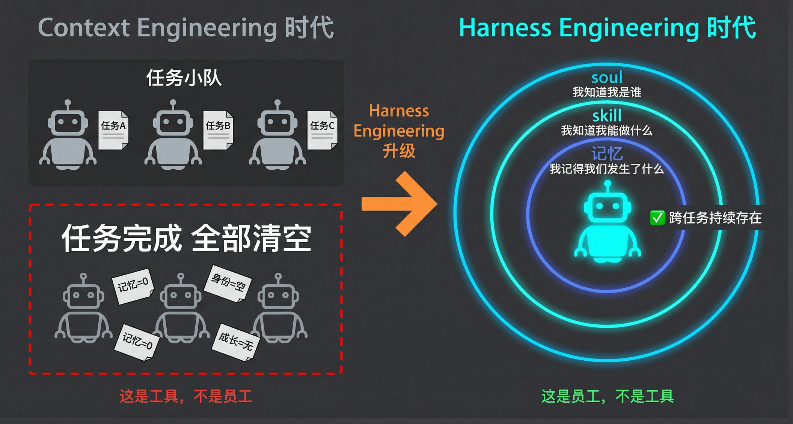
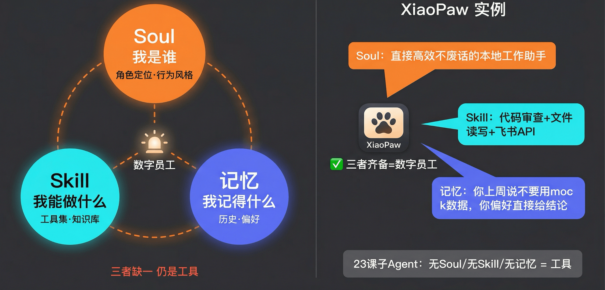
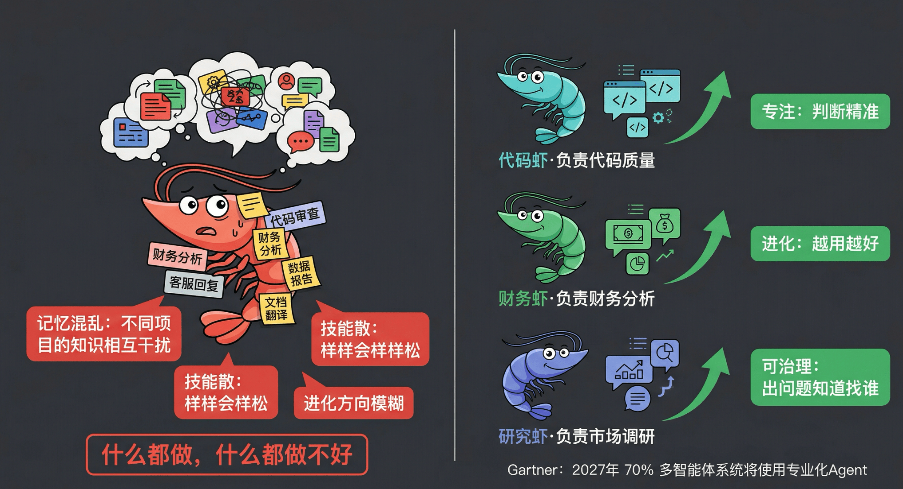
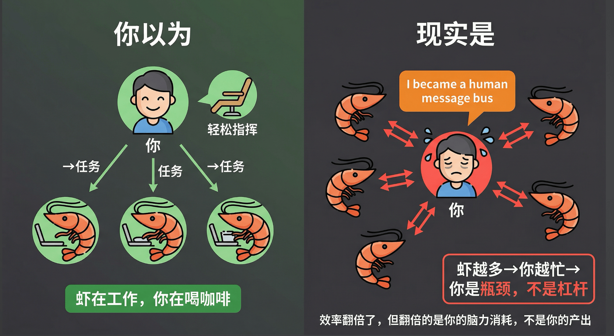
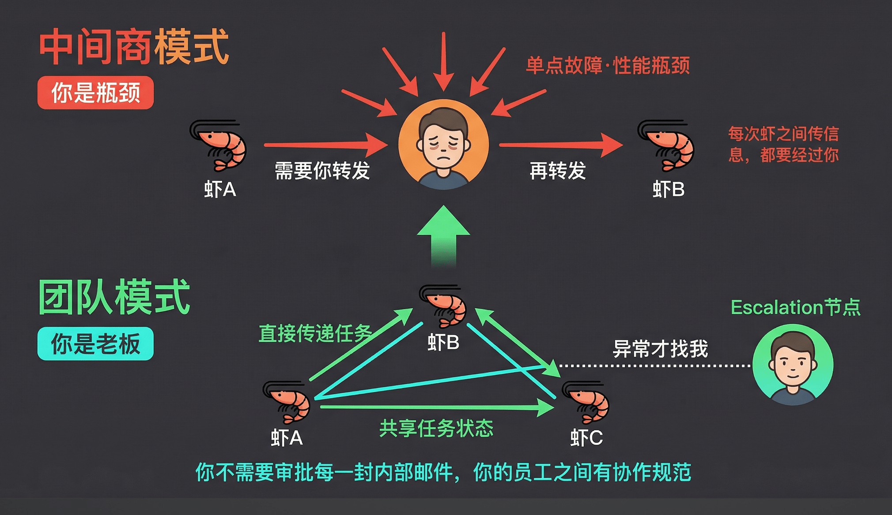
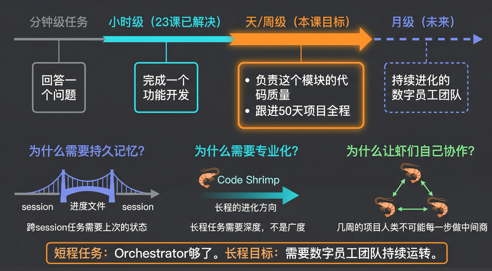

# 24｜认知升级：从任务列表到数字团队

> 来源：极客时间《企业级多智能体设计实战》
> 当前播放：24｜认知升级：从任务列表到数字团队
> 提取日期：2026-06-02
> 原文长度：5358 字

---

欢迎回到第 24 节课！

上节课，我们完成了 Orchestrator 范式的实战演练——一个主 Agent 把复杂任务拆分成若干子任务，调度一群子 Agent 并行执行，最后汇总结果，整个过程行云流水。但课结束之前，我留下了一个没有正面回答的问题：**那群完成任务后立刻消散的子 Agent，到底是什么？**

它们完成了任务，随即消散。下次再叫，又是一张白纸。没有名字，没有记忆，不知道自己上次做过什么，也不知道你是谁。Orchestrator 范式解决了"如何分工做事"，但没有回答"做事的是谁"。

这节课，我们要做一次认知框架的升级。**答案，会直接决定你接下来搭建系统的思路。**

---

## 一、从工具到员工：Harness Engineering 的升级

任务完成就解散——这就是 Context Engineering 时代 multi-agent 的核心逻辑。不管是单 Agent 还是多 Agent，不管是工作流还是 Orchestrator，所有的事情都围绕一个核心：**完成任务**。子 Agent 被分配子任务，任务结束，子 Agent 清空消失。只有主 Agent 还留在那里，带着自己的记忆和工具。



这些子 Agent，不是员工，是工具。**工具：无身份、无记忆、无成长。你每次叫它，它都是一张白纸——你雇到的不是员工，是精灵。**

到了 Harness Engineering 时代，发生了什么升级？不是模型更聪明了，而是 **multi-agent 管理的对象升级了**。

Context Engineering 时代，multi-agent 做的事情是任务分割 + 上下文隔离——解决 Context Rot 的问题，让多个 Agent 分担上下文压力。这是工程技巧层面的优化。

Harness Engineering 时代，multi-agent 管理的对象升级到了 Agent 的完整运行环境：soul + skill + 记忆 + 环境基础设施。Agent 不再只是"会调用工具的 LLM"，而是被组织起来、有持久身份的运行单元。**这不是"更聪明的 Agent"，是"Agent 有了身份"。**

---

## 二、Soul + Skill + 记忆：缺一不可

有了持久身份的 Agent，就是数字员工。那数字员工具体是什么？

**一个完整的数字员工，必须同时具备三样东西。**



**Soul（灵魂）**——回答"我是谁"。角色定位、价值观、行为风格。Soul 不是一段系统提示词那么简单，它是 Agent 决策时的底层准则。一个财务 Agent 的 Soul，决定了它在面对模糊指令时是偏向谨慎还是激进，是优先合规还是优先效率。有了 Soul，Agent 的行为才可预期、可信任。

**Skill（技能）**——回答"我能做什么"。专属工具集、知识库、操作规程。Skill 不等于"会用工具"，而是针对特定领域深度定制的能力组合。一个代码审查 Agent 的 Skill，包含它熟悉的语言规范、它知道优先检查什么，以及它处理不同严重程度问题的规程。

**记忆（Memory）**——回答"我记得什么"。工作历史、上下文积累、偏好学习。记忆让 Agent 跨 session 保持连贯。它记得你上周说过"不要用 mock 数据"，记得你的项目偏好是直接给结论不要铺垫，记得上次某个决策是基于什么做出的。

**三者缺一不可，缺任何一个，那个 Agent 就还是工具：**

- 无 Soul → 没有方向的执行者，你给什么它做什么，但你不给它就卡住
- 无 Skill → 空有意愿无能力，什么都会点但什么都不精
- 无记忆 → 每次重头来，你们之间建立的每一点默契，下次都要重新建立

回忆一下第 22 课的 XiaoPaw。Soul = “我是你的本地工作助手，直接、高效、不废话”；Skill = 代码审查工具 + 文件读写 + 飞书 API；记忆 = Bootstrap 记忆 + 文件记忆 + pgvector 搜索。**XiaoPaw 是这门课第一个完整的数字员工**——它同时具备这三样。23 课的子 Agent 呢？一样都没有。这就是"工具"和"员工"的分水岭。

---

## 三、为什么养不同的"虾员工"

好，我们现在有了 XiaoPaw 这样一个完整的数字员工。下一个很自然的想法是：**既然 AI 这么强，为什么不只养一只通用的超级 Agent，让它什么都能做？**



这个模式我把它叫做"通用虾"。你在养一只什么水域都能适应的虾。但你不会用同一只虾既养在淡水又养在海水里——**它会适应不了，什么都做不好。**

通用 Agent 有三个结构性问题，注意，这不是模型智力问题，而是架构问题：

**记忆混乱（Memory Pollution）**：一个 Agent 同时服务代码项目和财务分析，两个领域的知识、偏好、历史决策混在一起。你告诉它"这个项目不要用 Mock 数据"，它下次在另一个项目里可能还是会回避 Mock，因为它不区分这条记忆属于哪个上下文。

**技能不聚焦（Skill Dilution）**：样样会，样样松。当服务场景边界极宽，Skill 配置必然宽泛——工具太多，知识库太泛，操作规程互相冲突。专注代码审查的 Agent，知识库只需要最新语言规范和团队代码风格指南；通用 Agent 的知识库，只能是面向所有场景的最小公约数。

**无法定向进化（Cannot Evolve）**：这是最容易被忽视的。真正的数字员工越用越好，在特定场景里积累记忆、迭代 Skill。而通用 Agent 进化方向模糊——你很难说"让它在代码审查上变得更好"，因为它同时还要在财务分析上变得更好，两个方向相互稀释。

我自己现在养了七八只虾。有专门负责写代码的，有负责投资分析的，有负责儿童心理的，有负责商业分析的，有专门做运营营销的。每只虾掌握的技能、积累的记忆完全不同。当我需要治理某一领域，我只需要治理那只虾就好了。代码就管代码，财务就管财务，研究就专门负责研究。

专业化分工带来三个具体价值：

1. 专注：每只虾只管自己领域，上下文干净，判断精准
2. 进化：针对特定场景积累记忆 + 迭代 Skill，越用越好
3. 可治理：角色边界清晰，行为可预期，出问题知道找谁——你知道财务虾只做财务，它不会跑去改你的代码库

Gartner 在 2024 年的报告里预测，到 2027 年，70% 以上的企业级多智能体系统将采用专业化 Agent 架构，而非通用 Agent。行业已经在用脚投票了。

---

## 四、Agent 越多，你越忙：你成了消息总线

好，我们现在养了一只代码虾、一只财务虾、一只研究虾。每只虾效率都很高，你也用得很顺手。

然后你发现了一个问题：**你比以前更忙了。**



这不是笑话，这是真实发生在很多工程师身上的事，也是我自己亲身经历过的。我前一段时间甚至神经衰弱，睡不着觉——养了这么多虾，反而更累了。为什么？

过去的工作模式，大部分时间你不需要高强度动脑——很多时候都在做执行，脑力消耗不会那么重，重要决策有限。但现在不一样，七八只虾，每只虾你一个消息扔出去，隔个五六分钟就给你回消息。你在等某只虾的时候，还要并行地指挥其他虾。每次回复虾，你都必须用大脑飞速运转——先消化它给你的大篇报告，找出问题，给指令，再推进。**虽然整体效率翻倍了，但翻倍的是你的脑力消耗，不是你的产出。**

X.com 上有个工程师说了一句话，让我印象非常深刻：

>
> “I became a human message bus.”
>

你成了一条人肉消息总线。虾 A 产出了什么，需要你判断要不要传给虾 B；虾 C 遇到了问题，需要你做决策然后回答它；虾 D 完成了任务，需要你检查质量然后转发给虾 E。

出了什么问题？你把自己设计成了系统架构里的**中心节点**。

想一想你熟悉的软件架构：如果所有服务都必须通过一个中央节点才能通信，那个节点就是单点故障，也是性能瓶颈。**虾越多你越忙，说明你是瓶颈，不是杠杆。**

---

## 五、数字员工团队：让虾员工们自己协作

解法不复杂，但需要一次思维方式的转变。



你现在的模式是"中间商模式"：每次虾之间传信息，都要经过你。

```plain
虾 A 产出结果 → 你（判断 / 决策 / 转发）→ 虾 B 接收任务
```

这就是那个单点故障、性能瓶颈的结构。要解决它，必须升级到"团队模式"：

```plain
虾 A 产出结果 → 虾 B 直接接收（你在旁边，出异常才介入）
```

这个升级的关键是什么？**你的角色从"中间商"变成"老板"。**

你不需要审批每一封内部邮件——你的员工之间有协作规范，自己处理大多数事。你的职责，从"每一步都在场"变成了"只在出问题时出现"。

这个新角色叫做 **Escalation 节点**：当某个 Agent 遇到超出它权限的异常，才上报给你处理；日常运转，你不必介入。你从指挥官变成老板——设定方向和边界，团队自己运转，异常才找你。

这才是"数字员工团队"的本质——**从一张任务列表，到有协作关系、有角色分工、有直接通信的团队。**

要让虾们自己协作，有三个前提：

- 清晰的角色边界：每只虾知道自己负责什么、不负责什么，不产生职责混乱
- 可信的 Agent 身份：Agent 之间能验证彼此的 Soul 和能力，才能建立委托关系
- 共享的任务状态：多个 Agent 协作一个任务，需要共同的"任务进展"视图

这三个前提，从下节课开始，我们会逐一实现。

---

## 六、从几小时到几周：数字员工团队的真正意义

你可能会问：专业化分工、Agent 间直接协作、Escalation 机制……这一切工程投入，到底是为了什么？

这个问题，是本节课最重要的一张底牌。



我们来看一条时间轴。

最早你和 ChatGPT 聊天，做的是分钟级的任务——一个问题扔出去，马上得到回答。到了上节课的 Orchestrator 范式，我们解决了小时级的任务——一套完整的开发 SOP，一个 Agent 跑完整个流程。这是已经解决的。

那如果我给的命题不是"帮我开发一个功能"，而是：

>
> 你来负责这个模块接下来 3 个月的代码质量。
>
> 你跟进这个 50 天的项目全程，每周给我进度和风险分析。
>

这类任务，从几小时跨越到几周，跨越多个 session，中间涉及的领域太多——产品调研、市场分析、开发、测试、上线、运维部署……一个超级 Agent 带着一堆 subAgent 搞不定，因为每个领域都需要一个深度积累的专业 Agent 才能真正做好。

**这才是数字员工团队真正想要承接的目标：长程任务。**

现在回头看，每一个设计决策都在指向这个目标：

- 为什么需要持久记忆？ 跨 session 的任务需要上次的状态——“上周我们发现了这个性能问题，这周我来跟进修复进展。”
- 为什么需要专业化？ 长程任务需要深度，不是广度。跟进代码质量 3 个月的 Agent，必须对代码规范有深度积累。
- 为什么让虾们自己协作？ 几周的项目，人类不可能每一步都做中间商。否则你省下来的时间，又全部还回去了。

短程任务，用 23 课的 Orchestrator 就够了——召之即来，挥之即去，用完就散。我们花这么多力气搭建数字员工团队，是为了本质上不同的工程命题：**让 AI 持续运转，承接以周为单位的任务，像员工一样工作，而不是像工具一样被调用。**

这也是 OPC（One Person Company）的必经路径——你真的想一个人运营一家公司，你一定不是靠中间商模式，你一定是要形成甲方模式：只做老板，给一个模糊的大方向，团队自主运转，你收结果。

---

## 课程总结

- 认知升级完成：Harness Engineering 时代，multi-agent 从任务的解决方案，进化到了组织团队。Agent 不再只是工具，而是有 soul + skill + 记忆的数字员工。
- 专业化是必要的：通用 Agent 有记忆混乱、技能不聚焦、无法定向进化三个结构性缺陷。专业化分工带来专注、进化、可治理三重价值。
- 人类必须从中间商变成老板：虾越多你越忙，说明你是瓶颈。团队模式下虾们直接协作，你只做 Escalation 节点。
- 长程任务是真正目标：整个模块四的目标是让数字员工团队持续运转，承接天级、周级的任务，而不是一次性短程工单。

>
> 下节课预告：新范式定义完毕，从概念到落地。下节课我们进入实现层，回答第一个工程问题：多个 Agent 之间如何分工？团队角色体系如何设计？行为规范如何约定？从下节课开始，我们一步步构建它。
>

---

## 课末学习活动

**费曼检验**

>
> 用一句话把"数字员工团队"解释给一个从没学过 AI 的同事听——不许用 Agent、soul、multi-agent 这些词。
>

**思考题**

1. 你现在的工作中，有没有某个重复性的、跨越多天的任务，可以被一个专业化的数字员工接管？它需要什么样的 soul、skill 和记忆？
2. “Agent 之间直接协作，不需要人类做中间商”——这个设计有没有风险？在什么情况下，你反而应该让人类保留在协作链路中？（提示：从任务的不可逆性和权限边界角度思考）

欢迎在评论区分享你的真实案例，我们下一讲见！
---

来源：极客时间《企业级多智能体设计实战》
提取日期：2026-06-02
