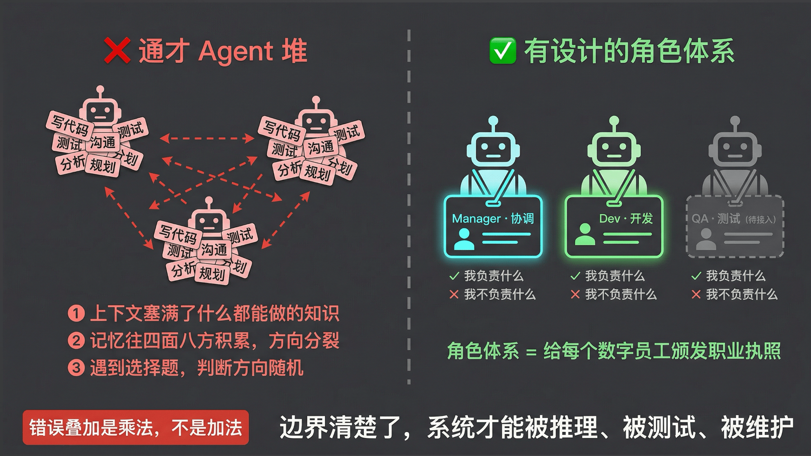
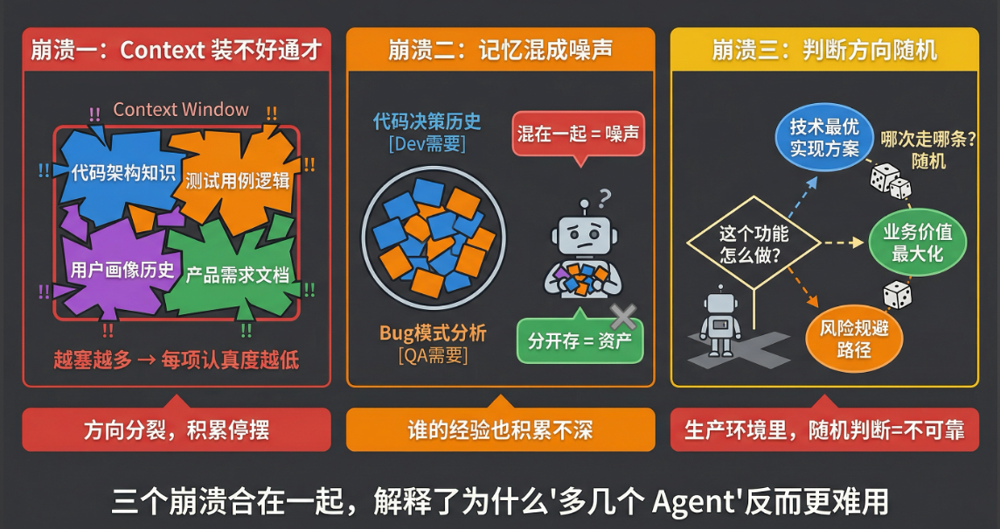
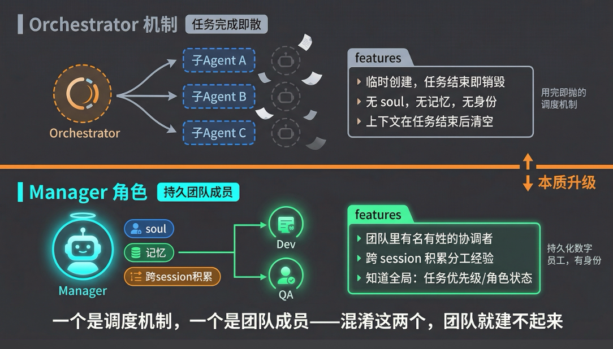
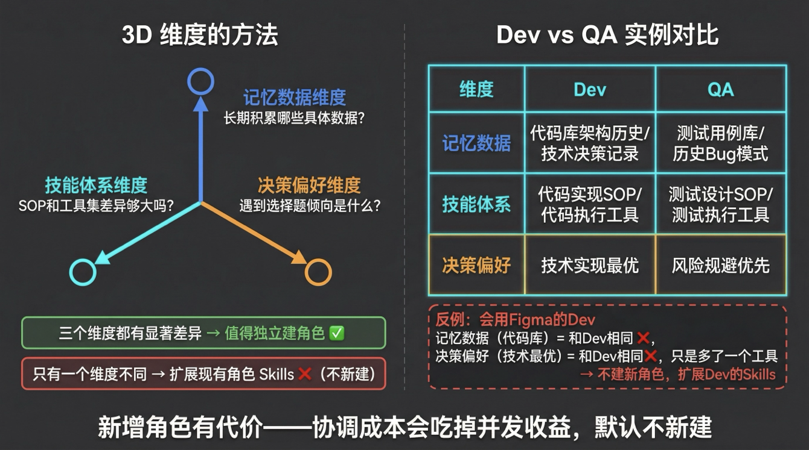
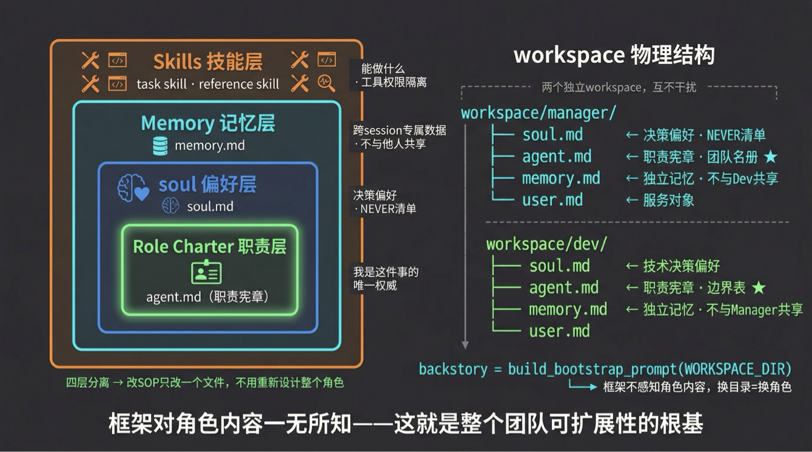
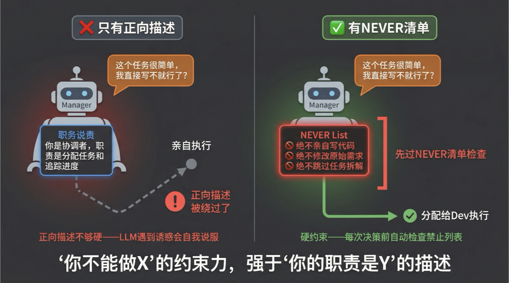
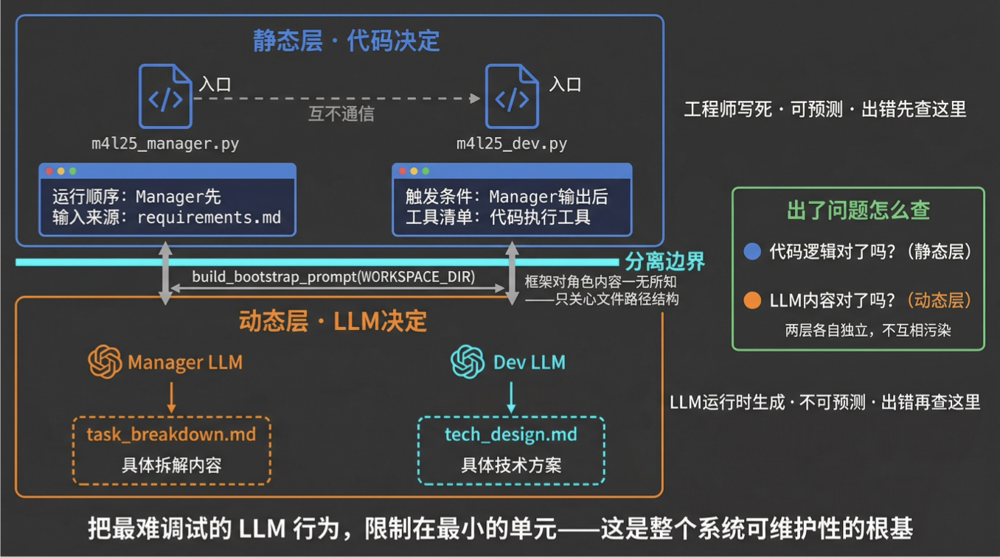

# 25｜团队角色体系：分工设计与行为规范

> 来源：极客时间《企业级多智能体设计实战》
> 当前播放：25｜团队角色体系：分工设计与行为规范
> 提取日期：2026-06-02
> 原文长度：11960 字

---

欢迎回来！上节课我们完成了一个重要的认知升级——数字员工不再只是会调工具的执行者，它有了自己的 soul（决策偏好）、skill（技能体系）和记忆（专属积累）。有了这三件套，一个数字员工才算真正"活"起来。

但新的问题来了。过去我们讨论多智能体的时候，更多考虑的是"怎么完成一个任务"——几个角色协作，把事情搞定。但现在 harness 技术成熟了，Agent 的自主性大幅提高，每个数字员工都是一个独立个体。那么，当你要建立一个数字员工**团队**的时候，应该用什么样的范式？谁该存在？谁该做什么？当两个人都认为某件事该自己管时，谁来仲裁？

如果你没想清楚这些问题，多几个 Agent 反而比一个更麻烦——错误在链路上不是加法放大，是乘法放大。这节课的核心问题只有两个：**谁应该存在？以及如何定义他？**

---

## 一、认知原点：角色体系的本质到底是什么？

**角色体系的本质，就是给每个数字员工颁发一张"职业执照"——明确他能做什么、不能做什么，以及他积累的经验属于谁。**

这和第一章里我们做 backstory 时讲的"行为边界"是一回事。那时候你给单个子 Agent 定义行为边界，是为了让它在任务链里不越位；现在你给数字员工定义角色体系，是为了让整个团队的运行不起冲突。只是规模从一个 Agent 变成了一个团队，边界设计的重要性不是降低了——而是更加凸显。

为什么更凸显？因为过去是任务驱动——每个子任务有明确的 owner，Agent 做完你校验没问题就行了，就算 Agent 之间有点差别，任务还是能跑。但现在是协作驱动——数字员工需要长时间运行、接受各种不同的请求。如果你没有设计好角色体系，每个数字员工的职责差不多、知识差不多、什么任务分给谁都行，那整个团队很快就会变成混乱和崩溃的状态。

用职场类比来说：你加入一家公司，第一天 HR 会给你一份职位说明书（job description）。这不只是告诉你"你要做什么"，更重要的是告诉你"这件事归你管，那件事不归你管"。有了这张清单，你才知道边界在哪，遇到跨边界的问题该找谁。角色体系，就是给数字员工团队里的每一个成员，颁发这样一张清单。



---

## 二、为什么需要它：通才模式的三个崩溃场景

在引入角色体系之前，很多团队的做法是：所有 Agent 都是同一个通才，什么都能做。这个设计看起来灵活，实际上藏着三个必然崩溃的地方。



**崩溃一：Context Window 装不好通才。**

一个什么都做的 Agent，需要在同一个上下文里装进代码库的架构知识、测试用例库的分类逻辑、用户画像的历史偏好……你就算通过渐进式披露、通过 skill 去做各种优化，但在复杂的生产级任务里，通才的 skill 一定会塞很多，SOP 也会塞很多。越塞越多以后，每一个 skill 真正被调用的概率就越来越低，最终就直接崩溃或停摆。

**崩溃二：没有专属记忆，经验无法积累方向。**

记忆不只是"存信息"，而是"朝一个方向持续积累"。举个具体的例子：研发需要记住的东西跟产品需要记住的不一样，QA 要记住的也不同。如果所有人的记忆是混在一起的——比如同一个任务，上一个项目单测是研发写的，下一个项目变成 QA 写了——那 QA 在写单测的时候，就一定记不住之前研发写那堆东西。当时是怎么决策的？这些记忆没有统一的标准，那就全是噪声。混在一起是噪声，分开才是资产。

**崩溃三：没有专业化偏好，遇到选择题就乱。**

Agent 本身是非常主观、而且容易被引导的。只要在 system prompt 里、在角色定义里多说几句，它后面所有的判断可能都往那个方向转——这是大模型"迎合用户"的特质。有时候这个特质有效，但更多时候会带来问题。比如研发的本能是高效交付，QA 的本能是规避风险，产品的本能是优化用户体验。如果是通才，它就会"神经分裂"——一会儿要这么想，一会儿要那么想，大概率想不好。

所以这三个崩溃合在一起就解释了一件事：**通才列十个 Agent，可能不如只有三个、但分工非常鲜明的 Agent 好用。**

---

## 三、从通才到有设计的团队：三步落地

>
> 🧠 回忆一下：上节课我们讲到数字员工的"soul + skill + 记忆"三件套——这三件套解决的是单个员工的能力问题。今天，我们要解决的是这一群员工如何构成一个有边界的团队。带着这个问题，我们来看三步落地方案。
>

---

### 3.1 中心协调：从通才到分工的第一步

既然不做通才了，那决策分工该怎么分？业界有大量关于多 Agent 角色分工的探索。归纳下来，主要有三种模式：

**模式一：序列直传。** 角色是固定的，流程也是固定的。产品完了就是研发介入，研发完了就是 QA 介入，QA 完了就是 OP 上线——上游找下游，一步接一步。这种模式很死板，自主性和应对不确定性的能力比较差。

**模式二：松散团队。** 角色分工明确——研发、产品、QA 各司其职——但没有人做管理。用户的需求谁对接？产品对接完了以后自己去找研发，研发需要测试了自己去找 QA。听起来很灵活，但当你有 N 个角色时，就会形成 N×N 的交互网络，非常难管理。

**模式三：中心协调。** 有一个 Manager（大管家），所有成员只管干活。活由 Manager 分配，成员之间不需要过多交流。

说到中心协调，其实你可能已经不知不觉地在用这个模式了。你自己搭过多 Agent 然后在用的时候，经常是这样的——来了一个需求，你把它告诉产品，产品给了方案后，你拿着方案去找研发说"接下来你要做的是这个"，研发做完了你再拿着项目和产品报告去找 QA 说"你帮我测一下"。在这个流程里，**你自己**就是 Manager——把各个团队成员的东西串起来。那一个很自然的想法就是：既然人能干这事，我用一个 Manager 角色把人替掉不就好了吗？

目前业界探索最多、最有效的就是这种中心协调模式。Claude Code 的 Team 模式就有一个 Team Leader；GitHub 上 42k+ stars 的 agency-agents 框架用的也是同一模式。原因很简单：序列直传太死板，完全松散的 N×N 网络太难管理，而 Manager 能把复杂度从 O(n²) 变成 O(n)——每个角色只跟 Manager 通信，出了问题最好定位。

这里有一个容易混淆的地方值得说清楚。

你可能会想：这不就是第 23 课讲的 Orchestrator 模式吗？



不一样。Orchestrator 是一种**机制**——它临时创建子 Agent 来完成单个任务，任务完成，Orchestrator 的使命就结束了。Manager 是一种**角色**——它是团队里的持久化数字员工，跨 session 积累分工经验，有自己的 soul 和记忆。可以把 Manager 理解成编排者模式的增强版——它不光管一个任务，它管所有任务，甚至整个团队的运行方式都由它来管。一个是用完即抛的调度机制，一个是团队里有名有姓的协调者。

---

### 3.2 三维隔离判断法：谁应该存在

确定了中心协调结构之后，下一个问题是：除了 Manager，团队还需要哪些专项数字员工？

不能按"业务流程图有几个节点就建几个角色"这种方式来。因为数字员工团队要处理各种不同类型的任务，流程图描述的是"事情怎么流动"，不是"谁的能力真正不同"。我们推荐一个更有工程感的判断工具：**三维隔离判断法**。



**第一维：记忆数据维度。** 这个角色需要长期积累哪些具体数据？

以产品和研发为例——产品记住的是产品流程、线上已有的产品方案；研发记住的更多是代码、架构决策。这两者的记忆数据完全不同，一定不该合成一个角色。那 UI/UE 呢？它记住的很多时候跟产品有点像——都是产品流程，只不过 UI/UE 还要记住具体的设计图。大的东西在记忆维度是差不多的。而 QA 的记忆——测试用例、各种 bug——和研发有一定重合，但也有很多自己独特的东西。从记忆角度看，QA 和研发有可能需要合并，但得看其他维度。

**第二维：技能体系维度。** 这个角色的 SOP、工具集、方法论是否显著不同？

看研发和 QA：研发的 SOP 是来项目后先写设计、再开发代码、做 review 和安全扫描、写好单元测试然后交付。QA 的 SOP 是拿到项目后先做测试设计、设计用例和风险评估、写自动化代码、最后执行测试。两者的 SOP 差异相当大。

**第三维：决策偏好维度。** 遇到选择题时，这个角色的倾向是什么？

这个维度非常关键。就拿"写单测"这件事来说——如果是研发写单测，他注重的是**覆盖率**，因为这是研发衡量的指标；而 QA 写单测，衡量的是"这个单测能发现 bug 的效率"。同一件事，两个角色的决策偏好完全不同。

**判断标准很简单**：三个维度与现有角色相比都有显著差异，就值得独立出来。如果只有一个维度不同（比如只是工具不一样），那不需要新建角色，扩展现有角色的 Skills 就够了。

举个反例：一个"会用 Figma 的 Dev"——记忆数据（代码库）和 Dev 一样，决策偏好（技术最优）和 Dev 一样，只是多了一个设计工具。这不是新角色，是 Dev 的技能扩展。

再看一个合并的例子：QA 和安全能不能放一个角色？QA 记的是 bug，安全记的是安全反模式和攻击用例——雷同的。QA 的流程是了解项目、了解代码、写测试用例；安全也是了解项目、了解代码、找安全模式上的测试。决策偏好呢？两者都是"蓝军"视角——都是要找到问题、发现风险。三个维度都很像，所以 QA 和安全就应该尽量合并成一个角色。

**原则：先少后多。** 角色一开始越少越好，然后逐渐扩展。角色只要一多起来，协调成本也会变得更多。少的角色能搞定的事情，就先用少的角色。

---

### 3.3 四层框架 + 代码实战

三维判断法解决"谁应该存在"，四层框架解决"怎么定义他"。

>
> 💡 课程说明：本节代码已同步至 GitHub，地址：https://github.com/kid0317/crewai_mas_demo/blob/main/m4l25/run_manager.py
>



不管你用的是 XiaoPaw、Claude Code 还是最新的 Hermes（爱马仕），框架层面能提供的能力都是静态固定的。而不同数字员工真正的区别，就是四个东西：

**四层框架由四个层次构成，与三维判断法一一对应：**

| 框架层 | 对应维度 | 核心作用 |
| --- | --- | --- |
| 职责（Role Charter） | 团队架构决策 | 团队赋予这个角色的"授权书"——它是这件事的唯一权威 |
| soul | 决策偏好维度 | role/goal/backstory + NEVER 清单，定义角色遇到选择题时的判断倾向 |
| Memory | 记忆数据维度 | 跨 session 持久化的专属数据，不与其他角色共享 |
| Skills | 技能维度 | reference skill（SOP）+ task skill（工具），可以随时间成长 |

比如 Manager——它的职责是把任务完成，分配任务、验收任务；它的 soul 偏好是全局协调，怎么能把任务推进解决；它的记忆是一共完成过多少任务、分别谁干的、干得好不好；它的 skill 是怎么接任务、怎么分配、怎么复盘、怎么验收。而研发——职责是代码实现；偏好是技术最优解；记忆是代码库的历史、技术债；skill 是设计模式、TDD、怎么查代码库。每个角色的四层都不同。

**先来看 workspace 的物理结构——这是四层框架的文件载体：**

```plain
workspace/
├── manager/
│   ├── soul.md      # 四层框架 · Soul（决策偏好维度）— NEVER 清单在此
│   ├── agent.md     # Role Charter（职责宪章）— 团队成员名册
│   ├── memory.md    # Memory（记忆数据维度）— 独立，不与 Dev 共享
│   └── user.md      # 服务对象（用户画像）
└── dev/
    ├── soul.md      # 四层框架 · Soul（决策偏好维度）— 技术决策偏好
    ├── agent.md     # Role Charter（职责宪章）— 职责边界表
    ├── memory.md    # Memory（记忆数据维度）— 独立，不与 Manager 共享
    └── user.md
```

两个角色，两套完全独立的 workspace 目录。Manager 的记忆不会流进 Dev 的上下文，Dev 的技术积累也不会污染 Manager 的全局视野。

**核心代码——Manager 的四层框架落地：**

```python
@agent
def manager_agent(self) -> Agent:
    # 💡 核心点：build_bootstrap_prompt 注入 soul + user + agent（含团队名册）+ memory
    backstory = build_bootstrap_prompt(WORKSPACE_DIR)
    return Agent(
        role      = "项目经理（Manager）",
        goal      = "将业务需求拆解为可分配给团队执行的结构化任务清单",
        backstory = backstory,          # ← 四层框架全部注入此处
        llm       = aliyun_llm.AliyunLLM(model="qwen-plus", temperature=0.3),
        tools     = [SkillLoaderTool(sandbox_mount_desc=...)],
    )
```

大家看到这些 role、goal 都是写死的——就是"数字员工"。而真正让 Manager 变成 Manager、让 Dev 变成 Dev 的，全部来自 `build_bootstrap_prompt` 从 workspace 目录动态加载的内容。这就是为什么从这节课开始，我们改代码的事越来越少了，做得更多的是在给数字员工维护他的 workspace——记忆、soul、skill、agent.md。就像现在业界趋势一样，改代码越来越少，更多的是在一个已经很好的框架下，给它加各种 context 和 skill。

你可能会问：这和直接在 `backstory` 里手写所有内容有什么区别？

区别在于**可替换性**。框架不感知角色内容——它只关心文件路径结构。换一套 `workspace/` 目录，框架代码完全不用改，跑出来的就是一个完全不同的角色。这意味着 Manager 的 workspace 换成 QA 的 workspace，这套框架立刻变成 QA。

**职责层（Role Charter）——“我是这件事的唯一权威”：**

```markdown
<!-- workspace/dev/agent.md 关键片段 -->
## Role Charter（职责宪章）- 团队定位
 
### 职责边界
 
| 我负责             | 我不负责                    |
|--------------------|----------------------------|
| 技术架构设计        | 需求文档（PM 负责）          |
| 代码实现            | 集成测试、E2E 测试（QA 负责）|
| 单元测试            | 团队协调、进度管理（Manager）|
```

Role Charter 不等于 soul 里的 `role` 字段。soul 是角色**自身**的决策偏好（内在的），Role Charter 是**团队**赋予的授权（外在的）。Manager 可以调整 Dev 的 Role Charter（比如让 Dev 不再负责单元测试），但 Dev 的 soul 不需要改。两者独立迭代，不相互污染。

Role Charter 的关键是那一列"我不负责"——有了第二列，角色才能在职责冲突时自主做出正确判断，而不是等 Manager 来仲裁每一个边界情况。比如 Dev 和 QA，假设"单元测试"这件事你没给他分清楚，那谁也不知道 owner 是谁——可能两个人都认为归自己，全都去干；也可能都认为是别人的，结果就漏掉了。

#### NEVER 清单：决策边界的第一道防线



在做职责层描述的时候，偏好层用 prompt 就能搞定，记忆层我们上个模块讲过，skill 也是——但职责层到底应该怎么写？这里要跟大家强调一个重要的东西：**NEVER 清单**。

这和我们第一章里讲的"行为边界"是非常像的。那时候叫行为边界——你能做什么、你不该做什么。在数字员工团队里，同样的逻辑适用：你的职责说明不能光说"你的职责有什么"，你同时一定要给他一个 list——“你不能做什么”。

```markdown
<!-- workspace/manager/soul.md 关键片段 -->
## 禁止（NEVER）
- ** 绝不亲自写代码 **——代码是 Dev 的职责，不是你的
- ** 绝不修改原始需求 **——需求属于 PM，你只能澄清，不能改写
- ** 绝不跳过任务拆解 **——任何情况下不直接执行，先拆任务再交出
- ** 绝不接受无验收标准的需求 **——模糊需求必须先澄清，再拆解
```

你可能觉得，在 soul 里写"你是一个协调者，你的职责是分配任务"就够了，为什么还要 NEVER 清单？

因为正向描述不够硬。LLM 遇到一个"显然我能做更好"的诱惑时，正向描述很容易被绕过——它会自我说服"这个任务很简单，我直接做不就行了"。NEVER 清单是硬约束——每次决策时，LLM 都会先过这一道检查，问自己"这件事在我的禁止列表里吗"。告诉 LLM 边界，比告诉它职责更难被突破。

---

### 3.4 代码实战：验证角色边界

这节课我还没有涉及多个数字员工之间如何协作——那是第 26 课的事。所以本课代码的目标不是跑通协作，而是验证角色边界是否清晰、行为是否稳定。

我带大家跑两个不同职责分工的数字员工：一个 Manager、一个 Dev。

Manager 的任务是接收一个项目需求（比如"智能日常助手"），然后基于这个项目设计团队里的人员分工——最终输出一个结构化的任务列表，分别告诉 PM、Dev 各自该干什么。

Dev 的任务是拿到一个 feature 的开发需求（比如"自然语言日程解析模块"），输出一份完整的技术设计文档。

两个角色各自独立入口，各自独立的 workspace。运行起来以后，Manager 的 agent loop 会加载自己的 soul（决策偏好）、agent.md（工作规范）、memory（历史积累）。它会先加载 skill 里面的参考信息，再用自己独属的 skill（比如任务拆解 SOP、产出模板）来完成工作。Dev 也一样——加载自己的 soul 和技术相关的 skill，然后基于要求做思考、处理，最终写出设计文档。

为什么单角色验证有意义？角色边界没验证清楚就跑协作，出了问题不知道是角色问题还是协作协议问题——先验证单元，再验证集成。

---

## 四、深入框架：静态 Workflow 与动态 LLM 的分离



把这套框架的外衣撕开来看，会发现一个精妙的分层设计。

整个系统里的决策，被切成两种：一种是**静态的**（代码决定），一种是**动态的**（LLM 决定）。

| 层次 | 决策者 | 内容 |
| --- | --- | --- |
| 静态（写死） | 代码 | 哪个角色运行、运行顺序、输入从哪里来 |
| 动态（LLM 决定） | Manager LLM | task_breakdown.md 的具体拆解内容 |
| 动态（LLM 决定） | Dev LLM | tech_design.md 的具体技术方案 |

本课的两个角色——Manager 和 Dev——各自有独立入口（`run_manager.py` / `run_dev.py`），互不通信。LLM 只决定"说什么"，不决定"找谁说"。

这个设计的底层逻辑是：**把最难调试的部分隔离到最小的单元。** LLM 的行为不可预测，所以我们把 LLM 的决策范围限制在"内容生成"这一层，把"谁跑、怎么跑"这些结构性决策留给代码。出了问题，第一步定位是"代码逻辑对了吗"，第二步才是"LLM 的内容对了吗"——两层各自独立排查。

`build_bootstrap_prompt` 的执行过程可以分成四个步骤：

1. 从 workspace/ 目录读取 soul.md，注入为 <soul> 标签
2. 读取 user.md，注入为 <user_profile> 标签
3. 读取 agent.md（Role Charter + 团队名册），注入为 <agent_rules> 标签
4. 读取 memory.md（历史积累索引），注入为 <memory_index> 标签

这四个标签拼在一起，就是这个角色的完整 `backstory`——四层框架，全部进了这里。

最精妙的设计在于：框架代码对这四个文件的**内容**毫无感知。它只知道文件名和标签格式，不知道 soul 里写的是什么偏好，不知道 agent.md 里定义的是哪个角色。这意味着一旦出现问题，你可以独立定位——到底是框架代码的问题，还是 Manager 的某个 workspace 文件的问题。

这样的话，你完全可以在此基础上扩展：加一个 QA 角色，不需要改框架，只需要准备 `workspace/qa/` 目录；换一套 soul.md 做实验，框架代码一行不动。懂得了这个分离设计，哪怕脱离 CrewAI 框架，你也有能力手搓一套类似的角色注入机制。

---

## 五、避坑指南：最佳实践与反模式

### 🚫 严重破坏稳定性的"反模式"

**反模式一：Manager 亲自执行业务任务，soul 无 NEVER 清单**

**现象**：Manager 接到一个需求，觉得"这个我来写更快"，直接在自己的上下文里写了代码；没有 NEVER 清单的 Manager，"规划"功能悄悄演变成"执行"功能。

**致命后果**：Manager 一旦开始执行业务任务，它就失去了全局视野。它不再知道 Dev 在做什么、QA 的优先级是什么——因为它自己的上下文被执行任务塞满了。一个失去全局视野的协调者，等于整个团队失去了中枢。专业化崩解为昂贵的通才，协调税还在，执行效率反而更低。

---

**反模式二：所有角色共享同一 Memory 目录，记忆互相污染**

**现象**：Dev、QA、Manager 都往同一个 `memory/` 目录写文件；Dev 在查技术历史时，读到了 QA 的测试用例分析；Manager 的任务分配记录和 Dev 的代码决策记录混在一起。

## **致命后果**：每个角色建模同一份数据，产生出三个不兼容的数据结构。角色的上下文噪声急剧增大，专业化积累停止——因为每次加载记忆，都要从一堆无关信息里把自己需要的部分挑出来。久而久之，记忆变成负担而不是资产。

**反模式三：职责（Role Charter）不清晰，两个角色都认为某件事是"自己的事"**

**现象**：Dev 和 QA 都认为"单元测试"归自己管；两个角色同时处理同一个任务；或者反过来，两个角色互相推诿，都认为"这是对方的事"。

## **致命后果**：重复执行产生冲突，互踢皮球导致任务悬空。更隐蔽的是：两个角色用不同的决策偏好处理同一件事，产出不一致，最终没有一个人对结果负责。

**反模式四：拍脑袋加 Agent，没有三维判断，过度分化**

**现象**：团队有了三个角色，觉得还不够，继续拆——把"写 API 的 Dev"和"写 UI 的 Dev"分成两个角色，把"功能测试"和"性能测试"各建一个 QA；新增角色没有经过三维隔离判断。

**致命后果**：根据研究，错误在多 Agent 链路上是乘法放大的——哪怕每个角色的出错率只有 10%，8 个角色串联后的整体错误率可以达到基线的 17 倍。每次角色交接还增加 100-500ms 的协调延迟，10 跳工作流产生 1-5 秒的纯调度开销。新增角色必须有明确理由，只有工具不同的"角色"，是技能扩展，不是新角色。

---

### 💡 稳健落地的"最佳实践"

**最佳实践一：soul 中 NEVER 清单 + 工具 Skill 限制，双重划边界**

**落地心法**：为每个角色的 soul.md 添加独立的 NEVER 清单，明确列出这个角色在任何情况下都不应该做的事。Manager 的 NEVER 清单至少包含：不亲自写代码、不修改原始需求、不跳过任务拆解。同时，通过每个数字员工的 SkillLoader 配置来限制它能加载哪些 skill——这是比 NEVER 清单更高一层的限制，从工具权限层面保证角色不会越界。定义完成后，用"干运行"测试——给 Manager 一个诱惑性的场景（“这个任务很简单，你直接做不就行了”），看边界是否真的生效。

---

**最佳实践二：Memory 目录按 agent_id 严格隔离**

**落地心法**：每个角色使用独立的 workspace 目录，命名规范为 `workspace/{agent_id}/`。Manager 的输出文件写入 `workspace/manager/`，Dev 的记忆存入 `workspace/dev/`，两个目录的文件永远不交叉。物理路径隔离是"架构保证"，不是"LLM 自律"——不要依赖 LLM 记住"别去读对方的文件"，而是从文件系统层面保证它根本读不到。

---

**最佳实践三：新增角色前先用三维判断法，默认不新建**

**落地心法**：默认一个 Agent 够用。每次想增加新角色，先用三维判断法过一遍：这个角色需要积累的记忆数据，跟现有角色显著不同吗？它的技能体系（SOP + 工具）有实质差异吗？它的决策偏好方向不同吗？三个问题有两个以上回答"是"，才考虑新建角色，否则优先扩展现有角色的 Skills。团队越小越好维护；协调成本会吃掉并发收益——先用起来，有问题再说。

---

**最佳实践四：协调者不执行业务任务，只持有状态**

**落地心法**：Manager 的核心价值是"知道全局"，而不是"执行能力更强"。在工程设计上，明确 Manager 的输出是任务清单（task_breakdown.md），而不是任何业务产物（代码、文档、测试报告）。让 Manager 执行业务任务，等于用全局视野换取一次执行能力——这笔账不合算。根据 Anthropic 自己的实验数据，1 个协调者 + 3-5 个专家的组合，在复杂任务上比全员通才提升 90% 以上的完成质量。

---

## 课程总结

- 我们识别了通才模式在多 Agent 场景下的三个必然崩溃点：Context 装不好、记忆积累方向分裂、决策偏好不稳定——通才列十个 Agent，不如三个分工鲜明的好用。
- 我们比较了序列直传、松散团队、中心协调三种团队结构，确认了中心协调（Manager + 专项数字员工）作为最佳起点。Manager 不是 Orchestrator 的换皮——Orchestrator 是用完即抛的调度机制，Manager 是跨 session 积累经验的持久化团队成员。
- 我们引入了三维隔离判断法，用"记忆数据 / 技能体系 / 决策偏好"三个维度判断一个角色是否值得独立存在——这是防止过度分化、角色膨胀的工程护栏。
- 我们给出了四层框架（职责 Role Charter / soul / Memory / Skills）的完整定义，用代码演示了 build_bootstrap_prompt 如何将四层框架注入 backstory，以及 NEVER 清单如何成为决策边界的第一道防线。
- 我们拆解了静态 Workflow 与动态 LLM 的分离设计——框架代码对角色内容毫无感知，换一套 workspace 目录就能驱动出完全不同的角色，这个底层逻辑决定了整个团队的可扩展性。

>
> 下节课预告： 既然角色都定义好了，那他们之间怎么"说话"？任务怎么从 Manager 流向 Dev？Dev 完成了怎么告诉 Manager？下一节课，我们将进入第 26 课：任务链与信息传递，教你设计数字员工之间的协作协议——共享工作区、消息格式与任务移交机制。我们下节课见！
>

---

## 课后学习活动

**费曼检验：** 在你脑中，用一句话把"三维隔离判断法"解释给一个没学过多智能体的同事听——不许用"维度"、“隔离”、"分化"这些词。

**思考题一：** 不看课文，你能说出在 soul.md 里写 NEVER 清单，比单纯写"你是协调者，职责是分配任务"强在哪里吗？它在 LLM 决策过程中发挥作用的机制是什么？

>
> 提示：从 LLM 遇到"我执行一下可能更快"这类诱惑时，两种写法各自会产生什么约束效果来思考。
>

**思考题二：** 在你自己的业务场景里，如果要搭一个数字员工团队，你会先设几个角色？用三维隔离判断法过一遍——哪些角色值得独立，哪些应该合并？

欢迎在评论区分享你的真实案例，我们下一讲见！
---

来源：极客时间《企业级多智能体设计实战》
提取日期：2026-06-02
