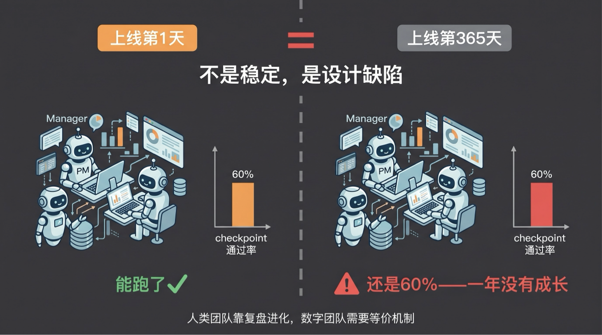
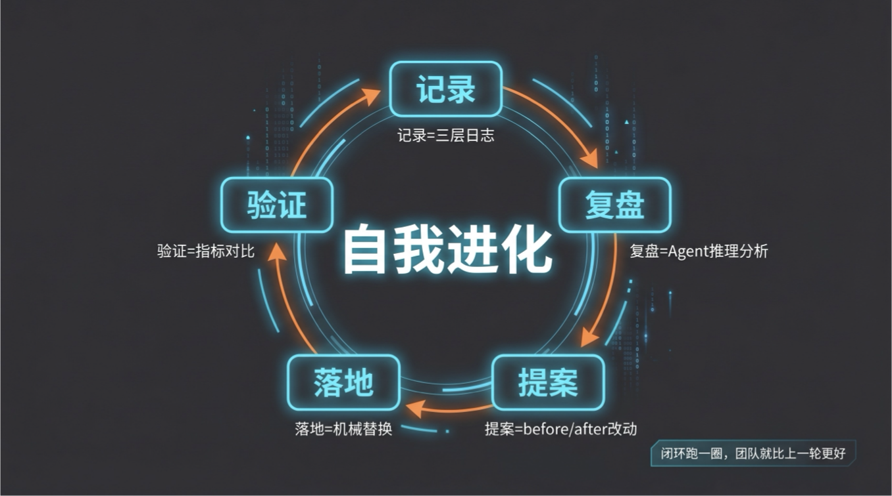
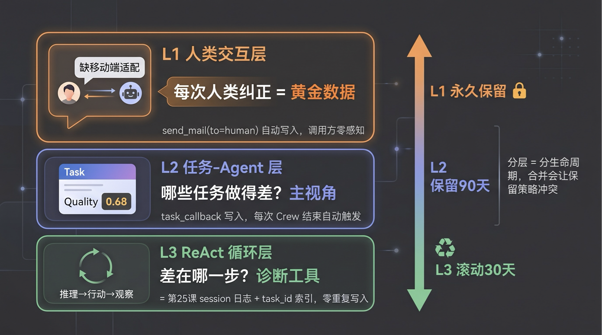
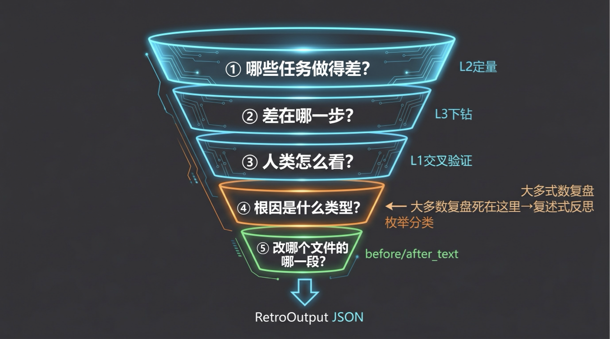
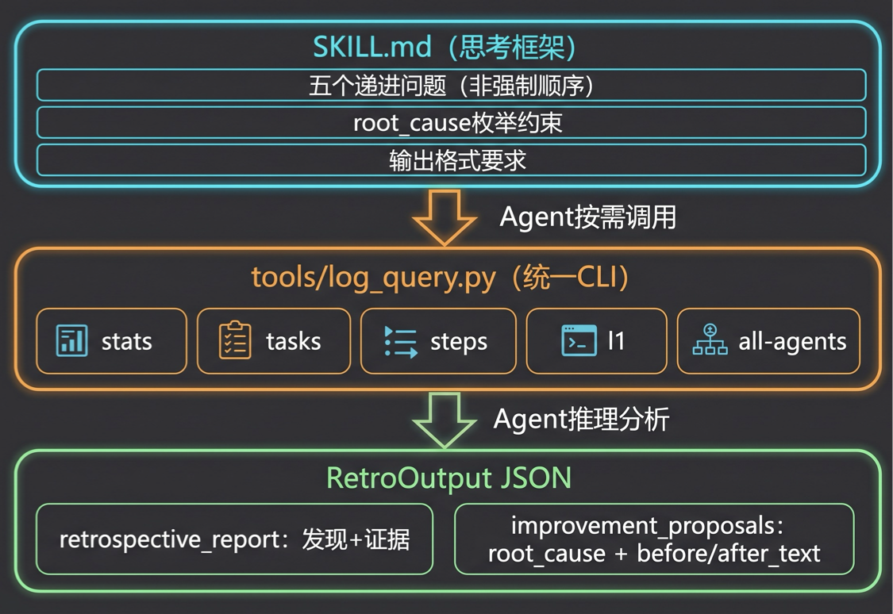
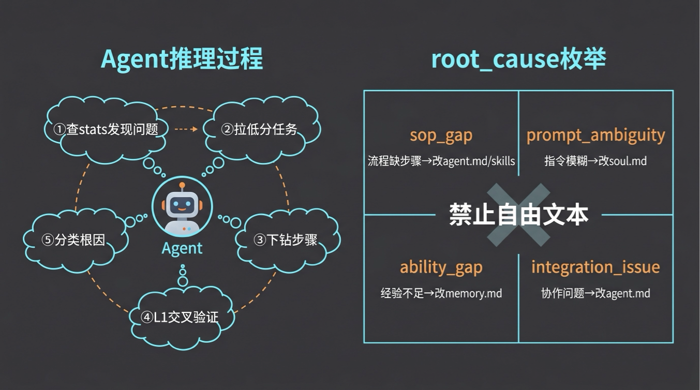
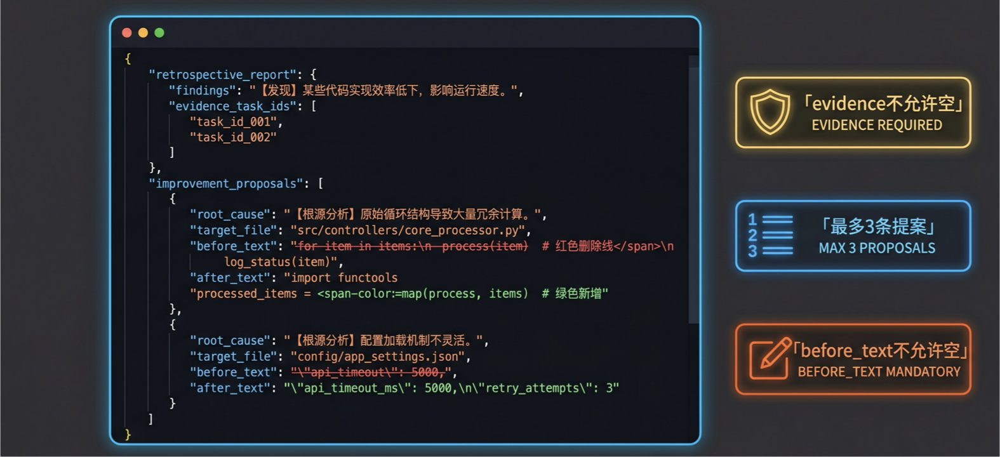
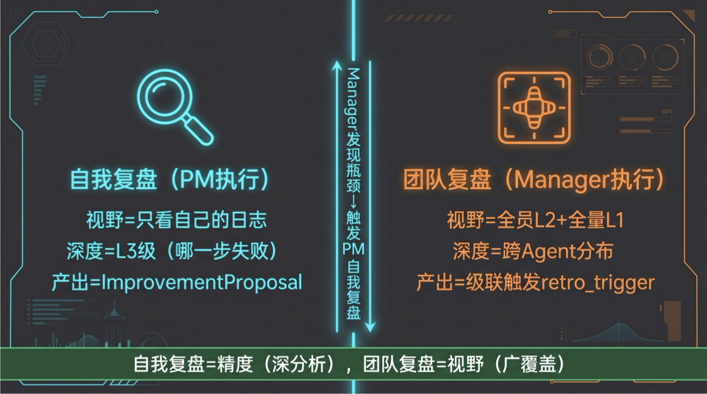
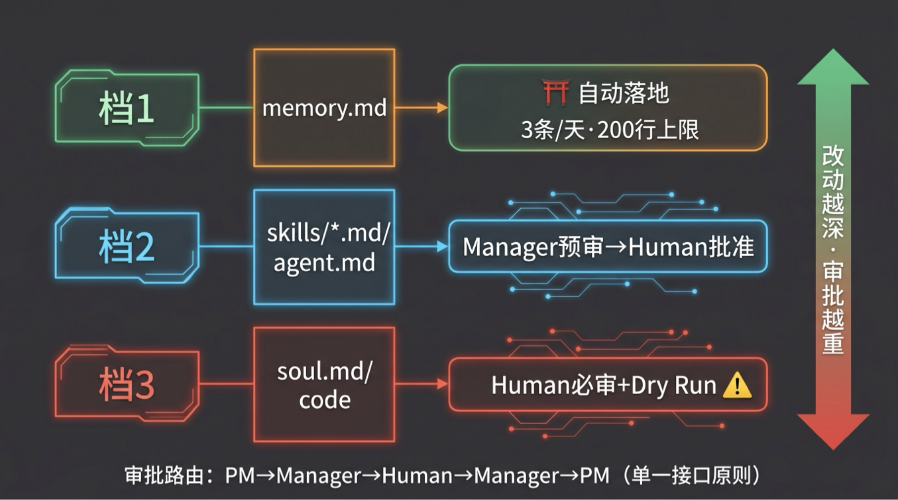
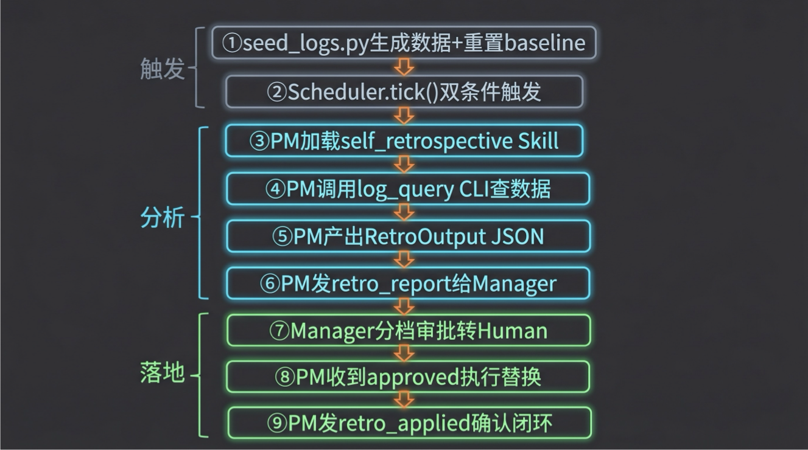

# 28｜数字员工的自我进化：让 Agent 团队越用越好

> 来源：极客时间《企业级多智能体设计实战》
> 当前播放：28｜数字员工的自我进化：让 Agent 团队越用越好
> 提取日期：2026-06-02
> 原文长度：15536 字

---

欢迎回来！上一节课，我们给数字员工团队装上了"人类介入"机制——在关键节点设置 checkpoint，让人类可以在必要时接管。此刻，我们的团队已经能自主运行、遇到问题会停下来请示人类，听起来很完整了。

但我想问你一个问题：如果一个团队运行一年，第一天的工作质量和第三百六十五天的工作质量完全一样——你会怎么评价这个团队？答案很清楚：它没有在成长。对人类团队来说，这是危险信号；对数字团队来说，这是**设计缺陷**。



今天是模块四的最后一课。我们要让数字团队从"能跑"变成"越用越好"——建立一套完整的自我进化机制。这套机制的核心不是日志怎么写、不是提案怎么落地，而是**怎么做复盘**——怎么从一堆运行数据里找到"到底该改哪一行"。

---

## 一、认知原点：自我进化到底是什么？



**数字团队的自我进化，本质就是人类团队复盘文化的工程化版本。**

一个优秀的人类团队做完项目后会开复盘会，回顾哪些决策是对的、哪些步骤走了弯路、下次遇到类似情况该怎么办——然后把结论写进操作手册、改进流程、更新协作规范。

数字团队做的是同一件事，只是用工程手段替代了人的记忆和判断：

- 记录：用结构化日志取代人类的记忆
- 复盘：Agent 定期回看执行记录，定位失败根因
- 提案：把改进方案写成结构化文档，附带具体证据
- 落地：经人类审批后，机械地更新 soul / SOP / Skill 文件
- 验证：检查改进后指标是否真的上升

这五步构成一个闭环。闭环跑一圈，团队就比上一轮更好。

你可能会问：这五步里，哪一步最难？

答案是复盘。记录和落地都是工程基础设施，看代码就懂。但"怎么从上千条日志里找到’到底该改哪一行’"——这是方法论问题，也是今天的主菜。

---

## 二、为什么需要自我进化：跑起来只是及格线

团队上线了，能完成任务了——这只是及格线。没有自我进化机制时，三件事必然发生：

**1. 同样的错误反复出现**

PM Agent 每次生成设计文档都忘了检查移动端适配，第一次 checkpoint 被退回了，人类加了备注"注意移动端"。第二次又忘了。第三次还是——因为那条人类反馈从来没有被写进 PM 的 SOP，它像便利贴一样贴在对话历史里，等上下文窗口一刷新，就永远消失了。

**2. 工具调用路径越来越冗余，但没人知道**

系统上线之初，某个工具调用需要绕一个弯，因为当时另一个 API 还没接好。后来 API 接好了，但 Agent 的 Skill 没更新——它还是在绕弯，每次多消耗几秒和若干 token。没有日志记录具体执行路径，这个效率损耗永远不会被发现。

**3. 协作设计的问题被误归因给个体**

Manager 直觉上觉得 Dev Agent “做得不好”，但实际上是 PM 和 Dev 之间的交接文档格式定义不清晰——Dev 每次收到的信息不完整，只能反复询问澄清。没有结构化的协作分析，这类"是协作设计的问题，不是某个人的问题"的系统性缺陷，很难被发现。

为什么不直接靠人类观察来发现这些问题？因为数字团队一天可能完成数百个任务，靠人工逐条检查是不现实的。真正的解法，是让系统自己把"值得关注的信号"提炼出来，再交给人类决策。

---

## 三、三层日志：复盘的原料

>
> 🧠 回忆一下：第 25 课我们讲了 DigitalWorkerCrew 的 session 日志（append_session_raw），第 26 课建立了共享工作区和三态邮箱，第 27 课在 human.json 里设置了人类介入通道。今天的日志系统直接建立在这三课的基础上。
>

>
> 💡 课程说明：本节代码已同步至 GitHub，地址：https://github.com/kid0317/crewai_mas_demo/blob/main/m4l28/
>
> 复盘需要原料，原料就是日志。但不是随便一种日志——我们需要按用途和生命周期分三层：
>



| 层级 | 记录什么 | 核心用途 | 写入方式 | 保留策略 |
| --- | --- | --- | --- | --- |
| L1 人类交互层 | 每次人类纠正 | 黄金数据——Agent 判断偏差的最直接信号 | send_mail(to=human) 内自动追加 | 永久保留 |
| L2 任务 -Agent 层 | 每个任务一条摘要（含质量分） | 定位"哪些任务做得差" | task_callback hook 自动写 | 保留 90 天 |
| L3 ReAct 循环层 | Agent 内部每步推理 | 定位"差在哪一步" | 复用第 25 课 session 日志 | 滚动 30 天 |

L2 的 `result_quality` 怎么打分？

打分维度有很多种：旁路 LLM 拿到任务的输入输出后判断完成质量、统计 ReAct 循环中迭代次数和工具调用错误率、或者直接从 checkpoint 结果映射。最简单也最可靠的起步做法是第三种：人类批准 → 0.85，退回 → 0.4——不需要额外 LLM 调用、不需要复杂评估链，和 L1（人类纠正）天然一致。代码里是一个 `quality_scorer` 注入口（`task_callback` 的可选参数），你可以按业务需求替换评分逻辑，但**起步建议用 checkpoint 映射，零额外调用、零幻觉风险**。

三层里最值钱的是 **L1**——每一次人类纠正都是黄金数据。Agent 自己觉得做得挺好，但人类说：不对，移动端方案呢——这条纠正比 Agent 自己的 10 条分析都有价值。

为什么不合并成一层，按字段过滤就行？因为三层的**生命周期完全不同**：L1（人类纠正）稀缺宝贵，永久保留；L3（ReAct 细节）量最大，3 个月前的推理步骤对今天的复盘毫无用处。合并会让保留策略冲突——清了 L3 把 L1 也丢了，留了 L1 把 L3 存爆了。

**L1 的写入是自动的**——在第 27 课的 `send_mail()` 里加一行判断：凡是发给 `to="human"` 的消息，就自动追加一份 L1 日志。调用方完全不感知，这是 AOP（面向切面编程）在 Agent 场景的典型落地。

```python
# tools/mailbox_ops.py（第 28 课对第 27 课唯一的改动）
def send_mail(mailbox_dir, to, from_, type_, subject, content) -> str:
    # ... 原有写入逻辑不变 ...
    # 💡 核心点：to=human 时自动写 L1 日志，调用方零感知
    if to == "human":
        _write_l1_log(mailbox_dir, message)
    return msg_id
```

**L3 不需要另建**——第 25 课的 `DigitalWorkerCrew` 已经在每次 kickoff 后把完整的 LLM 消息序列写到 `sessions/<session_id>_raw.jsonl`。这就是 L3 数据。本课只加一个 **task_id 索引**（`sessions/index.jsonl`），让复盘能按任务切片回放，不重复建 callback、不漂移 schema。

---

## 四、复盘方法论：从"出了问题"到"改哪一行"



### 4.1 复盘失败的两个层次

大多数人——包括 Agent——的复盘止步于两个层次：

- 第一层：只知道"出了问题"。“PM 的质量分偏低”。然后呢？就没有然后了。
- 第二层：复述式反思。“下次生成设计文档时要注意移动端适配”——听起来像根因分析，但其实只是把失败过程重新描述了一遍。下次遇到不同类型的问题，这句话毫无帮助。

Reflexion 论文（NeurIPS 2023）对此有精确的诊断：**犯错的 Agent 在评估自己的错误时，倾向于合理化而不是纠正**——因为产生错误判断的偏好本身就在那里。Retroformer（ICLR 2024）进一步发现：自由文本反思会系统性地产生"复述式反思"，需要**结构化约束**来打破这个循环。

### 4.2 有效复盘的五个递进问题

有效复盘像漏斗：从上千条日志开始，一步步收窄，直到精确到"改这个文件的这一段"。这个漏斗有五层，每一层回答一个递进问题：

| 问题 | 数据源 | 输出 |
| --- | --- | --- |
| ① 哪些任务做得差？ | L2 定量 | 最差的 N 条任务 |
| ② 差在哪一步？ | L3 下钻 | 具体失败的 ReAct 步骤 |
| ③ 人类怎么看？ | L1 交叉验证 | 人类纠正记录 |
| ④ 根因是什么类型？ | 枚举分类 | 4 种根因之一 |
| ⑤ 改哪个文件的哪一段？ | 精确改动 | before/after_text 锚点替换 |

大多数复盘死在第 ④ 步——知道"出了问题"，但不知道"根因是什么类型"。于是写出"下次注意移动端"这样的复述式反思，然后什么都没改。

第 ④ 步的解法是**逼 Agent 做分类思考**：`root_cause` 必须从枚举中选——`sop_gap`（SOP 缺步骤）/ `prompt_ambiguity`（提示词模糊）/ `ability_gap`（能力不足）/ `integration_issue`（集成问题）。枚举的目的不是穷尽所有原因，而是打破"复述式反思"的惯性，逼 Agent 把问题归到一个可操作的类别里。

这套枚举的设计方法叫**以终为始**：先想清楚“我最终能改什么”，再反推根因分类。回想第 25 课的数字员工五层定义——soul、SOP、agent、memory、skill——决定一个数字员工是好是坏的全在这些 .md 文件里。那么复盘的根因分类，就应该直接映射到这些文件：

| 枚举值 | 含义 | 改动对象 |
| --- | --- | --- |
| sop_gap | 流程缺步骤 | agent.md / skills/*.md |
| prompt_ambiguity | 指令模糊 | soul.md |
| ability_gap | 经验不足 | memory.md |
| integration_issue | 协作问题 | agent.md 协作部分 |

Agent 一旦完成归因，就立刻知道要改哪个文件——从发现问题到定位改动的路径是确定的，不需要再做一轮"这个根因对应哪种改动"的推理。

---

## 五、自我复盘实战：用真实数据走一遍完整分析链

光讲方法论容易空洞，我们用课程代码里预置的真实数据（`seed_logs.py`）走一遍完整的自我复盘流程。



### 5.1 核心架构：Skill = 思考框架，CLI = 数据查询，Agent = 推理

在展开之前，先明确一个关键设计：**复盘不是脚本流水线**。

```plain
┌──────────────────────────────────────────────────────────────┐
│  self_retrospective/SKILL.md（思考框架）                       │
│  - 五个递进问题（非强制顺序）                                  │
│  - root_cause 枚举约束                                        │
│  - 输出格式要求（RetroOutput JSON）                           │
└──────────────────────┬───────────────────────────────────────┘
                       │ Agent 按需调用
                       ▼
┌──────────────────────────────────────────────────────────────┐
│  tools/log_query.py（统一 CLI，纯数据查询）                    │
│  stats / tasks / steps / l1 / all-agents                     │
└──────────────────────┬───────────────────────────────────────┘
                       │ Agent 推理分析
                       ▼
┌──────────────────────────────────────────────────────────────┐
│  RetroOutput JSON（结构化产出）                                │
│  - retrospective_report: 发现 + 证据                         │
│  - improvement_proposals: root_cause + before/after_text     │
└──────────────────────────────────────────────────────────────┘
```

**SKILL.md 只告诉 Agent “要思考什么”，不规定"先查什么再查什么"**。Agent 自己判断需要哪些数据、按什么顺序查、查到什么程度够了。这是 Skill 和 Script 的本质区别——Script 规定动作序列，Skill 提供思考框架。

### 5.2 场景：PM 过去一周运行了 8 个任务

`seed_logs.py` 模拟了"团队已运行一周"的场景：PM 执行了 8 个任务，其中 3 个产品设计文档任务被 checkpoint 退回，质量分偏低。

下面模拟 PM Agent 加载 `self_retrospective` Skill 后的推理过程——注意这不是固定管线，而是 Agent 根据数据逐步深入的分析：



**Agent 思考 ①：先看整体统计，了解大盘**

```bash
python3 tools/log_query.py stats --agent-id pm --days 7
# → {"task_count": 8, "avg_quality": 0.68, "failure_count": 3, "human_correction_count": 3}
```

PM 8 条任务，平均质量 0.68，3 条失败，3 次人类纠正。有问题——需要下钻。

**Agent 思考 ②：哪些任务做得差？拉低分任务列表**

```bash
python3 tools/log_query.py tasks --agent-id pm --days 7 --sort quality_asc --limit 3
# → {"tasks": [
#      {"task_id": "t006", "result_quality": 0.38, "task_desc": "用户注册设计迭代（移动端）"},
#      {"task_id": "t001", "result_quality": 0.40, "task_desc": "用户登录功能产品设计文档"},
#      {"task_id": "t003", "result_quality": 0.42, "task_desc": "产品设计文档 v2（用户登录）"}
#   ]}
```

三条最差的全是**设计文档**类任务。模式出现了。

**Agent 思考 ③：差在哪一步？下钻 ReAct 步骤**

```bash
python3 tools/log_query.py steps --task-id t001 --agent-id pm
# → {"task_id": "t001", "step_count": 3, "steps": [
#      {"step_idx": 0, "thought": "读取需求文档...", "action": "read_requirements"},
#      {"step_idx": 1, "thought": "开始撰写产品规格文档", "action": "write_document"},
#      {"step_idx": 2, "thought": "文档完成，发送完成通知", "action": "send_mail"}
#   ]}
```

只有 3 步：读需求 → 生成文档 → 提交。**没有"检查移动端适配"这一步**——它从来没出现在 Agent 的执行路径里。

**Agent 思考 ④：人类怎么看？交叉验证 L1**

```bash
python3 tools/log_query.py l1 --days 7 --keyword "移动端"
# → {"count": 2, "records": [
#      {"subject": "设计文档退回：t001", "content": "缺少移动端适配方案"},
#      {"subject": "设计文档退回：t006", "content": "未考虑桌面端 / 移动端差异"}
#   ]}
```

人类退回理由指向同一个问题：**缺移动端适配**。L1（人类纠正）验证了 L2/L3 的发现。

**Agent 思考 ⑤：分类根因**

到这里画面完整了。现在 Agent 必须回答：root_cause 是什么？

如果是自由文本，LLM 大概率写：下次生成设计文档时要注意移动端适配——这是**复述失败**，不是根因。

SKILL.md 的枚举约束逼 Agent 做分类思考：这不是 `ability_gap`（PM 不是不会写移动端方案），而是 `sop_gap`——**product_design Skill 里根本没有"检查移动端"这一步**。Agent 忠实地按 Skill 执行，Skill 缺了，Agent 就不会做。

### 5.3 最终产出：RetroOutput



分析完成后，Agent 产出一份结构化的 `RetroOutput` JSON：

```json
{
  "retrospective_report": {
    "agent_id": "pm",
    "period": "2026-04-14 ~ 2026-04-20",
    "summary": "设计文档任务质量偏低，根因是 product_design Skill 缺少移动端检查步骤",
    "findings": [{
      "pattern": "3/8 任务被退回，全是设计文档类，退回原因均为缺少移动端适配",
      "evidence_task_ids": ["t001", "t003", "t006"]
    }]
  },
  "improvement_proposals": [{
    "root_cause": "sop_gap",
    "target_file": "skills/product_design/SKILL.md",
    "current_behavior": "Skill 只写了'读需求→写文档'，未提及多端适配",
    "proposed_change": "在写作原则中增加移动端适配检查步骤",
    "before_text": "1. ** 需求来源 **：从 `/mnt/shared/needs/requirements.md` 读取原始需求",
    "after_text": "1. ** 需求来源 **：从 `/mnt/shared/needs/requirements.md` 读取原始需求\n2. ** 多端检查 **：如需求涉及用户界面，必须明确桌面端 / 移动端差异并分别设计",
    "expected_improvement": "设计文档 checkpoint 通过率从 62% 提升至 85%+",
    "evidence": ["t001", "t003", "t006"]
  }]
}
```

注意 `before_text` / `after_text` 的设计：**Agent 读目标文件的当前内容，找到要改的那段原文作为锚点，写出改后的完整文本**。这个思路和 Cursor、Claude Code 等 AI coding 工具一致——LLM 产出"改什么"的意图（上下文锚点 + 替换文本），执行侧做精确匹配和替换。

三个关键约束：

- evidence 不允许空——人类审批时应点开日志 ID 查原始记录，而不是盲信 Agent 的分析。犯错的 Agent 对自己的错误会合理化，evidence 是独立于分析的原始数据。
- 一次最多 3 条提案——聚焦最重要的改进，不贪多。超过 3 条说明 Agent 在发散而不是聚焦。
- before_text 不允许空——逼 Agent 读文件、找到精确位置。不能说"加个移动端检查"就完了，必须指向具体哪段文字。

---

## 六、团队复盘：自我复盘看不到的视野



自我复盘精度高——能下钻到具体哪个 ReAct 步骤失败。但它**视野窄**，只看自己的日志。

团队复盘由 Manager 执行，看的是**L1 全量 + 所有 Agent 的 L2 聚合**——它能发现自我复盘看不到的东西：

- 跨 Agent 的模式：也许不只 PM 有移动端问题，也许是 SOP 模板本身缺了这一步
- 协作设计问题：PM 和 Dev 之间的交接失败率最高，不是某个人的问题，是交接格式定义不清
- 瓶颈识别：PM 平均质量 0.68，Manager 平均 0.88——PM 是瓶颈

Manager 发现瓶颈 Agent 后，不做 L3 级深分析——那是 Agent 自己擅长的。Manager 做的是**级联触发**：发 `retro_trigger` 邮件给 PM，让 PM 启动自我复盘。各做各擅长的：**自我复盘 = 精度（L3 深分析），团队复盘 = 视野（跨 Agent 分布）**。

团队复盘还有一个重要产出：**周报发给人类**。不只发改进提案等审批，也发完整的团队运行状况——哪些指标在改善、哪些还在恶化、上周批准的改进效果如何。人类对数字团队的信任，不是来自"系统一直没出问题"，而是来自"系统能主动告诉我它在哪里有问题、在怎么改"。

---

## 七、三档 HITL 审批：改动越深，审批越重

复盘产出了提案，提案要落地。但落地之前必须过一道关——**人类审批**。



为什么不能让 Agent 自己落地？因为 **soul 一旦改错，Agent 所有后续判断都会跟着偏——包括它下一次复盘对自己的评价**。这是无法自我纠正的漂移。目标漂移的研究（Goal Drift, 2025）也证实了这一点：Agent 通过累积交互逐渐偏离初始目标，无需任何显式覆盖。

但不分档的审批也不行——memory 级小改也走 3 天审批，Human 会绝望放弃；soul 级大改自动落地，系统就地失控。解法是按**改动影响深度**分三档：

| 档位 | 改动对象 | HITL 方式 | 示例 |
| --- | --- | --- | --- |
| 档 1 | memory | 自动落地 + 硬闸门（3 条 / 天, 200 行上限） | memory.md 加一条"遇到空字段主动问甲方" |
| 档 2 | skill / SOP | Manager LLM 预审 + Human 批准 | product_design 加一步"检查移动端适配" |
| 档 3 | soul / code | Human 必审 + 强制 Dry Run | 调整 PM 的风格偏好、修改代码逻辑 |

档 1 的自动不是放权：`3 条/天` 是硬闸门（防止一天自动改 50 条 memory），`200 行上限` 对齐第 20 课的 bootstrap 记忆设计。超过闸门就降级到档 2。

审批走邮箱闭环路由：**PM → Manager → Human → Manager → PM**。延续第 27 课的单一接口原则——PM 不直接联系 Human，Human 只有一个对接人（Manager）。

---

## 八、代码实践框架：旁路系统，只加文件不改架构

整套进化机制是**旁路的**——Manager 和 PM 该怎么跑还怎么跑，复盘是在它们跑完之后分析日志。



第 27 课的代码零改动（除 `mailbox_ops.py` 加了 L1 自动写入一行），所有新增能力都是新文件：

```plain
m4l28/
├── tools/
│   ├── mailbox_ops.py                   # ⚡ L1 一行改动（to=human 时自动写 L1）
│   ├── log_ops.py                       # 三层日志读写 Python 库
│   └── log_query.py                     # ⚡ 统一日志查询 CLI（Agent 通过 bash 调用）
├── schemas.py                           # RetroOutput + ImprovementProposal
├── tools/proposal_ops.py               # 提案分档 + 闸门校验
├── scheduler.py                         # 双条件触发（24h 间隔 + ≥5 条任务）
├── seed_logs.py                         # 演示数据生成 + 工作区 baseline 重置
├── baselines/                           # PM 文件基准版本（seed_logs 重置源）
├── workspace/pm/skills/
│   └── self_retrospective/SKILL.md      # ⚡ 纯思考框架（无脚本）
└── workspace/manager/skills/
    ├── team_retrospective/SKILL.md      # ⚡ 团队复盘思考框架
    └── review_proposal/SKILL.md         # ⚡ 审批流程框架
```

注意这里**没有 scripts/ 目录**。Skill 只是 SKILL.md 一个文件——思考框架。查数据的能力由统一的 `log_query.py` CLI 提供，Agent 通过 bash 按需调用。

端到端数据流路径：

```plain
seed_logs.py（生成 7 天模拟数据 + 重置工作区文件）
    ↓
Scheduler.tick()（24h 间隔 + ≥5 条任务 → 发 retro_trigger 邮件）
    ↓
PM 加载 self_retrospective Skill（思考框架）
    ↓
PM 调用 log_query CLI 查数据 → LLM 推理分析
    ↓
PM 产出 RetroOutput JSON → 发 retro_report 邮件给 Manager
    ↓
Manager 加载 review_proposal Skill → 按 target_file 分档
    ↓
Manager 转 Human 审批 → 发 retro_approved/rejected 邮件给 PM
    ↓
PM 收到 approved → 机械执行 before_text → after_text 替换
    ↓
PM 发 retro_applied 确认邮件 → 闭环完成
```

**分工的核心原则：LLM 负责看和想，机械操作负责做**。Agent 分析日志、发现模式、分类根因、写出 before/after_text——这些是 LLM 擅长的语义理解和推理。但真正的文件替换是纯字符串匹配——找到 `before_text`，替换为 `after_text`。简单、确定、可验证。

落地侧不需要专门的 Skill，PM 的 `agent.md` 里直接描述机械流程：读文件 → 找锚点 → 替换 → 写回。如果 `before_text` 在目标文件中找不到（文件已被其他改动修改过），PM 发 `retro_apply_failed` 邮件给 Manager 报错——不硬改，不猜测。

---

## 九、深入框架：为什么这样分层

把这套机制的外衣撕开，看看底层设计逻辑。

### 9.1 学术根基

从学术角度，本课是 **Reflexion 模式（NeurIPS 2023）的异步批次版本**：不更新模型权重，而是通过结构化反思生成"经验"，再把经验写回 soul/SOP 文件——下次 Agent 运行时，改进后的 SOP 就是新的行为约束。

但 Reflexion 论文也指出了核心局限：**犯同样错误的 Agent 在评估自己时倾向于合理化**。我们的工程应对是三道防线：

1. root_cause 枚举约束——打破"复述式反思"的惯性
2. L1 交叉验证——用人类纠正信号覆盖 Agent 自评偏差
3. evidence 强制非空——让人类审批时有能力绕过 Agent 分析，直接看原始数据

这三道防线的共同目标只有一个：**Agent 负责发现改进点，Human 负责决定要不要改**。打破这条线，系统就从工程坍缩成赌博。

### 9.2 为什么 Skill 不规定调用顺序

传统做法是把复盘写成脚本管线：`step1_stats.py → step2_filter.py → step3_drill.py → ...`——Agent 变成流水线操作工，丧失了判断力。

我们的 `self_retrospective/SKILL.md` 只提供**五个问题**，不规定调用顺序。为什么？

- 场景不同，路径不同。如果 Agent 上周全部任务质量都高，第 ① 步就结束了——不需要下钻。如果 L1 有大量纠正记录，可能先看 L1 再回头看 L2 更高效。
- Agent 的判断力是资产。你不会给一个优秀的人类分析师一张"先做 A 再做 B"的流程图——你给他目标和数据源，让他自己决定怎么查。SKILL.md 提供的是思考框架，不是操作手册。
- 工具层只做数据查询。log_query.py 不帮你排序选 top-k（除非你主动传 --sort/--limit）。工具不做判断，判断留给 Agent。

### 9.3 关键的工程分层

| 任务 | 谁做 | 为什么 |
| --- | --- | --- |
| 看日志、发现模式、分类根因 | LLM（Agent 推理） | LLM 擅长理解语义、做判断 |
| 提供数据 | log_query.py CLI | 纯查询，输出 JSON，不做判断 |
| 写出 before/after_text | LLM（Agent 产出） | LLM 读文件内容，写出锚点 + 替换文本 |
| 审批 | Human（或 Manager LLM 预审） | 防止自我纠正失效的最后一道闸 |
| 机械执行文本替换 | PM Agent（收到 approved 后） | 纯字符串匹配替换，找不到就报错 |

注意和 Cursor/Claude Code 等 AI coding 工具的相似性：**LLM 产出"改什么"的意图（before/after_text），执行侧做精确 apply**。LLM 不需要手写 unified diff（行号必偏移）、不需要算 SHA256（必编造）、不需要理解 git 操作。它只做自己擅长的事：读懂语义、做出判断。

懂得这个分层，你可以把本课机制移植到任何 LLM 框架——它不依赖 CrewAI，核心是结构化日志 + 思考框架 Skill + 结构化提案 + 分档 HITL + 机械替换。

---

## 十、避坑指南：最佳实践与反模式

### 🚫 严重破坏稳定性的反模式

**反模式 1：复述式反思代替根因分析**

`root_cause` 用自由文本而不是枚举，LLM 几乎总会写出“下次要注意移动端”这样的复述。Reflexion 论文的实验证实：犯错的 Agent 倾向合理化而不是纠正。**解法：root_cause 必须从枚举中选，枚举逼出真正的分类思考。**

**反模式 2：Agent 自动落地 soul/SOP 改进**

最危险的反模式。soul 一旦改错，Agent 的所有判断都会跟着偏——包括它下一次复盘时对自己的评价。研究表明即便良性微调也能使安全拒绝率降低 70%（Safety Alignment Collapse, EMNLP 2025）。**自动落地只能用在档 1（memory），且必须加硬闸门。**

**反模式 3：样本不足强行复盘**

基于 2-3 条任务的推断噪声极大。设定 `min_tasks=5`，不足直接跳过。更危险的是：低质量提案一旦通过审批，可能会把正常行为判断为"问题"，优化掉本来正确的东西。

**反模式 4：自动审查误报侵蚀信任**

提案太多、误报太高（有研究显示约 12.5% 误报率），团队逐渐停止审查——审批形同虚设。**控制提案数量和质量，比控制审批流程更重要。**

**反模式 5：补丁累积导致文件膨胀**

每一轮复盘都往 soul / SOP / Skill 文件里打补丁。模型在复盘时倾向于“加规则”而不是“改规则”——半年后你的 product_design SKILL.md 从 20 行膨胀到 200 行，充满了互相矛盾的约束，最终不可治理。**长期运行需要定期“小重构”：整理数字员工的 soul / SOP / agent 文件，合并重复规则、删除过时补丁，保持文件精简。**

---

### 💡 稳健落地的最佳实践

**最佳实践 1：提案必须附 Evidence**

`evidence` 强制非空，至少 1 条日志 ID。人类审批时应养成习惯：点开日志 ID 查原始记录，而不是直接信任 Agent 的分析摘要。**建立信任的关键：让人类随时可验证 Agent 的判断。**

**最佳实践 2：基于上下文匹配而非行号**

生成改动时用上下文锚点匹配替代 diff 行号。OpenAI 为 GPT-4.1 专门推荐"避免行号，清晰提供待替换代码及替换内容"。`ImprovementProposal` 的 `before_text` / `after_text` 就是这个思路的落地——Agent 给锚点和替换文本，执行侧做精确匹配。

**最佳实践 3：思考框架引导而非脚本管线**

把复盘做成 Skill（思考框架）而不是脚本流水线。SKILL.md 给 Agent 问题和约束，不规定调用顺序——Agent 自己判断怎么查数据、怎么分析。研究表明结构化引导“显著减少 LLM 幻觉，同时保持每一步的灵活性”（Flow-of-Action, ACM 2025）。**关键区别：Skill 提供该想什么，不规定该做什么。**

**最佳实践 4：设置最大迭代限制 + 优雅退出**

复盘循环必须有退出条件——防止“烧掉 $300 API 额度却什么都没返回”的无限循环。默认限制反思轮次（如 3 轮），附带显式退出：样本不足跳过、连续 2 次无改进则停止。

**最佳实践 5：变更历史分条保留，支持单条回退**

每条改进提案落地后，保留改前版本（`before_text`）和改后版本（`after_text`），按提案粒度分条存储——不要合并到一个大 diff 里。发现某条改进效果不好时，只回退那一条，不影响其他已验证的改进。这和 git 的“每个 commit 做一件事”原则一致：**粒度越细，回退越安全**。

---

## 总结

- 我们定义了数字团队自我进化的本质——人类复盘文化的工程化版本，核心是五步闭环：记录 → 复盘 → 提案 → 落地 → 验证。
- 我们设计了三层日志系统：L1（人类纠正，黄金数据，永久保留）、L2（任务摘要，定位瓶颈）、L3（复用第 25 课 session 日志 + task_id 索引，零重复写入）。
- 我们建立了复盘的三层架构：Skill = 思考框架（五个递进问题 + root_cause 枚举）、CLI = 数据查询（log_query.py 统一入口）、Agent = 推理分析（LLM 看数据、发现模式、产出 before/after_text 改动）。核心方法论是五个递进问题的漏斗模型——从上千条日志收窄到精确的文件锚点替换。
- 我们建立了三档 HITL 审批（memory 自动 + 闸门 / skill/SOP Manager 预审 +Human 批准 / soul/code Human 必审 +Dry Run），把 Human 的稀缺注意力匹配到改动的影响深度。
- 至此，模块四完整收官：角色设计（25）→ 任务流转（26）→ 人类介入（27）→ 自我进化（28）——数字员工团队从"能跑"到"越用越好"的完整工程架构。

>
> 下节课预告： 既然角色、流转、介入、进化四大机制都就位了，那把它们拉在一起会怎样？下一节课——第 29 课项目实战，我们把 25-28 课的所有机制组装成一个完整的数字员工团队，end-to-end 地跑一遍。我们下节课见！
>

---

## 课末学习活动

>
> 费曼检验：用一句话把"Agent 自我复盘"解释给一个没学过的同事听——不许用"日志"、“复盘”、"schema"这些词。
>

**思考题**：

本课的 `self_retrospective` Skill 用了 4 种 root_cause 枚举（sop_gap / prompt_ambiguity / ability_gap / integration_issue）。但这个枚举是为本课的演示场景设计的——在你自己的业务场景中：

1. 这 4 种 root_cause 够用吗？你的场景需要增加哪些类型？
2. 如果增加太多枚举值，Agent 的分类准确性会不会下降？你会怎么平衡"覆盖面"和"分类精度"？

提示：从“每个枚举值是否指向一个明确的改进方向”角度思考——如果两个枚举值指向同一种改进，它们就应该合并。

欢迎在评论区分享你的真实案例，我们下一讲见！
---

来源：极客时间《企业级多智能体设计实战》
提取日期：2026-06-02
