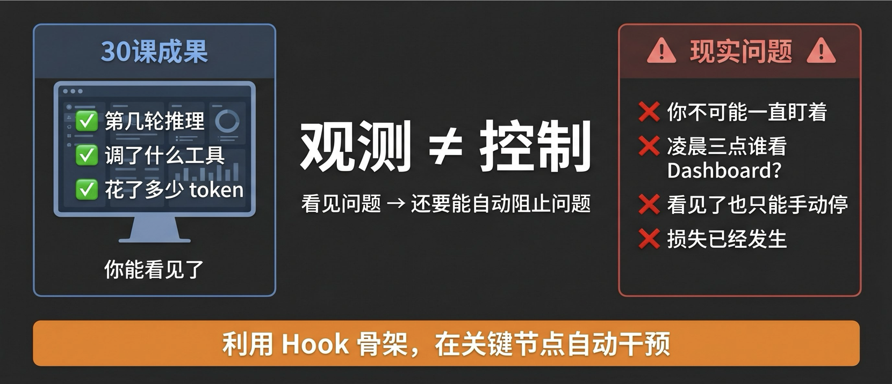
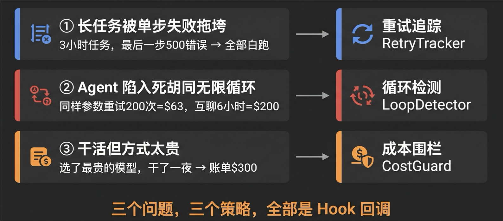
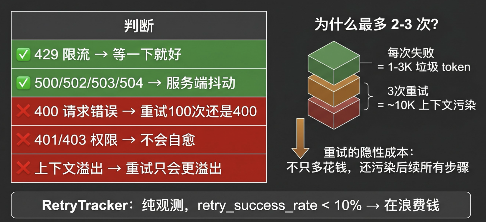
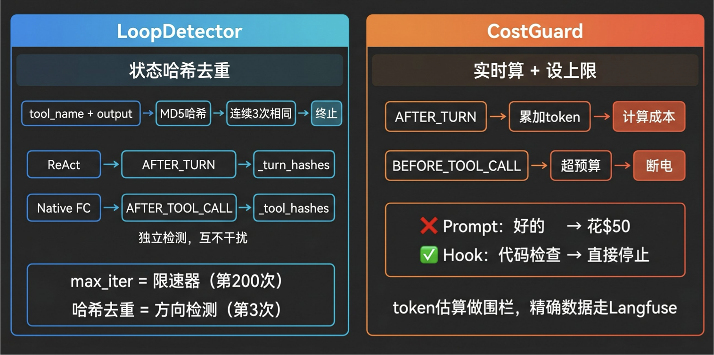
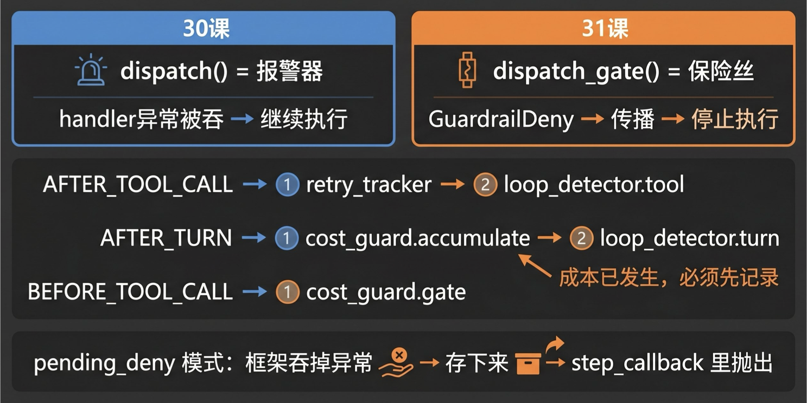

# 31｜可靠性：重试、循环控制与成本围栏

> 来源：极客时间《企业级多智能体设计实战》
> 当前播放：31｜可靠性：重试、循环控制与成本围栏
> 提取日期：2026-06-02
> 原文长度：13626 字

---

欢迎回来！上节课我们搭好了可观测性的地基——Hook 骨架 + Langfuse 全链路追踪。现在你能看见 Agent 的每一步了：第几轮推理、调了什么工具、花了多少 token。



但这里有个问题：**你不可能一直盯着 Dashboard。** Agent 凌晨三点触发了一个任务，你不在；周末跑了一批数据处理，你不看。就算你看了，看见 Agent 第 47 轮还在重复搜索——然后呢？你能做的只是手动停掉它，但损失已经发生了。

观测解决的是看见的问题。但真正让 Agent 变得可靠的，不是看见，而是**自动干预**。利用上节课搭好的 Hook 骨架，在关键节点上挂载策略——不是记录日志，而是在问题发生的那一刻就拦截。这节课我们做的就是这件事：在 30 课的 Hook 骨架上插入三个可靠性策略，让系统自己保护自己。

---

## 一、三个痛点，三个策略

>
> 💡 课程说明：本节代码已同步至 GitHub，地址：https://github.com/kid0317/crewai_mas_demo/blob/main/m5l31/
>

在给出方案之前，先看看 Agent 在生产环境里最常遇到的三个可靠性问题。它们分别指向我们今天要实现的三个策略。



需要提前说明的是：**课程中的三个痛点是通用痛点**——所有 Agent 系统都会遇到。但你在自己的业务里，一定要发现自己的痛点。比如金融场景，Agent 在工具请求中发出了用户身份证号，你可能就要立刻拦住它；代码场景，Agent 提交的代码没过单测，你也要在 Hook 层拦截。这些业务专属的护栏策略，同样可以用我们今天搭的框架来实现——写一个策略类，挂到 Hook 上就行。

**痛点一：长任务被单步失败拖垮。** 你的 Agent 执行一个三小时的复杂任务——调用了上百次模型，做了几十次工具调用。到最后一步，某个 API 返回了 500 错误。整个任务失败，前面三小时全白跑。问题是，这个 500 错误可能只是服务端的瞬态抖动——等 2 秒再试一次就好了。但你的 Agent 不会重试，它直接报告失败。**一个长任务会成百次调用模型，任意一次的偶发失败都会拖垮整体成功率。** 这指向我们的第一个策略：**重试**。

**痛点二：Agent 陷入死胡同无限循环。** Agent 在推理过程中遇到了一个它解决不了的问题，但它不知道自己解决不了——它反复用同样的参数调同一个工具，每次得到同样的结果，然后再试一次。它可能循环 200 次才被 `max_iter` 硬性截断。相同参数重复 200 次花了 $63、两个 Agent 互聊六小时花了 $200——这些都是真实发生的事故。**Agent 没有"记住自己已经试过"的机制，同样的输入大概率产生同样的输出。** 这指向我们的第二个策略：**循环检测**。

**痛点三：Agent 真的在干活，但方式太贵。** Agent 没有循环，确实在有效推进任务。但它选择的方式有问题——用了最贵的模型、加载了过多的上下文、做了不必要的深度搜索。它干了一夜，第二天早上你发现账单 $300。它做完了事情，但成本完全不可接受。**Agent 的成本不可预测性是结构性的——同一个任务可能 3 步也可能 17 步。** 这指向我们的第三个策略：**成本围栏**。

三个问题，三个策略。下面逐个展开。

---

## 二、重试：什么时候该重试，什么时候不该

重试本身在工程上很简单——等一下再试一次。**Agent 场景下，难的不是"怎么重试"，而是"该不该重试"。** 错误的重试比不重试更贵。



### 可重试 vs 不可重试

| 错误类型 | 该重试吗 | 原因 |
| --- | --- | --- |
| 429 限流 | ✅ 该重试 | 瞬态，等一下就好 |
| 500/502/503/504 服务端错误 | ✅ 该重试 | 服务端抖动，大概率自愈 |
| 400 请求错误 | ❌ 不该重试 | 请求本身有问题，重试 100 次还是 400 |
| 401/403 权限错误 | ❌ 不该重试 | 权限问题不会自愈 |
| 上下文溢出 | ❌ 不该重试 | 重试只会更溢出——错误信息本身也塞进上下文 |

这个判断才是重试策略的核心。如果你不区分错误类型，一律重试，结果就是：400 错误重试了 3 次，每次都失败，还往上下文里塞了 3K 垃圾 token。

### Agent 场景为什么最多 2-3 次

不只是因为第 4 次大概率也不行——更重要的是，**每次失败的错误信息都会留在上下文里**。一次失败的报错信息通常 1-3K token，三次重试就多了将近 10K 垃圾 token。上下文越脏，后续推理质量越差。重试有隐性成本：不只是多花一次调用的钱，还污染了后续所有步骤的上下文。

### RetryTracker：观测重试效果

重试本身不是在 Hook 层做的——重试是调度层的事情，框架自己会处理。Hook 能帮你做的是**重试的追踪和观测**：哪些工具在反复失败？重试成功率多少？该不该调整重试策略？

我们的 `RetryTracker` 是纯观测的——它不决定"要不要重试"（这是框架的事），它记录"重试了几次、成功了没有"：

```python
# reliability/retry_tracker.py
class RetryTracker:
    def __init__(self, max_retries: int = 3):
        self._failures: dict[str, int] = {}       # 每个工具的连续失败次数
        self._total_retries = 0
        self._successful_retries = 0
 
    def after_tool_handler(self, ctx):
        tool = ctx.tool_name
        if not ctx.success:
            prev = self._failures.get(tool, 0)
            self._failures[tool] = prev + 1
            if prev > 0:                           # 💡 第一次失败不算"重试"
                self._total_retries += 1
            if self._failures[tool] >= self._max_retries:
                self._emit_warning(tool)           # 连续失败达上限 → 告警
        else:
            if self._failures.get(tool, 0) > 0:
                self._successful_retries += 1      # 💡 失败后成功 = 重试成功
            self._failures[tool] = 0               # 重置计数
```

注意第一次失败不计为"重试"——第一次是"初始故障"，第二次才是"重试"。这样 `retry_success_rate = successful_retries / total_retries` 才有意义。如果这个数字低于 10%，说明你在浪费钱重试不可恢复的错误——该减少重试次数或改进错误分类。

---

## 三、循环检测：Agent 最贵的 Bug 是无限循环



为什么 Agent 特别容易循环？因为 **LLM 没有"记住自己已经试过"的机制**。同样的输入大概率产生同样的输出，于是同样的失败反复发生。你的 Agent 用完全一样的参数重试了 200 多次，$63。`max_iter=200` 确实能救它，但你已经浪费了 197 次的钱。

### 状态哈希去重

核心方案很直观：对每一步的 `tool_name + output` 做哈希，连续匹配达到阈值（默认 3 次）即判定为循环并终止。

```python
# reliability/loop_detector.py
class LoopDetector:
    def __init__(self, threshold: int = 3):
        self._threshold = threshold
        self._tool_hashes: list[str] = []      # 💡 工具调用路径
        self._turn_hashes: list[str] = []      # 💡 推理轮次路径
 
    def _check_loop(self, hashes: list[str], state: str, ctx):
        h = hashlib.md5(state.encode()).hexdigest()[:16]
        hashes.append(h)
        if len(hashes) >= self._threshold:
            recent = hashes[-self._threshold:]
            if len(set(recent)) == 1:          # 连续 N 个哈希完全相同
                raise GuardrailDeny(
                    f"Loop detected: identical state repeated "
                    f"{self._threshold} consecutive times"
                )
```

你可能会问：这和 CrewAI 自带的 `max_iter` 有什么区别？

`max_iter`**是限速器，哈希去重是方向检测。** `max_iter=200`，但 200 次里可能只有 3 次是重复——其余 197 次是有效推进。哈希去重在第 3 次重复就发现了"你在兜圈子"。两者不矛盾：**哈希去重是精准检测，**`max_iter`**是最后防线，双保险。**

### 为什么需要两个独立的哈希列表

你可能注意到了 `_tool_hashes` 和 `_turn_hashes` 两个列表。这跟 CrewAI 的两种执行路径有关：

- ReAct 模式：每次工具调用后触发 step_callback（对应 AFTER_TURN）
- 原生 function calling 模式：只在最终回答时触发 step_callback——中间的工具调用不触发

如果只在 AFTER_TURN 里检测循环，原生 FC 路径下工具连续循环调用 10 次你都发现不了。所以循环检测必须**双路径覆盖**：`after_turn_handler` 检测推理循环，`after_tool_handler` 检测工具调用循环。两条线各自独立计数，互不干扰。

---

## 四、成本围栏：在 Agent Loop 里实时算账

Agent 的成本不可预测性是结构性的——1 个用户动作触发 3 到 30+ 个 LLM 调用，团队预估和实际差 3-5 倍不是估不准，是 Agent 路径本身非确定性。

你在 System Prompt 里写"请控制成本不超过 $10"。Agent 非常配合："好的我会注意控制成本的"。然后花了 $50。因为**它根本不知道每次调用花了多少钱**——成本控制必须在 Hook 层用代码实现，不能靠 Agent 自觉。

### CostGuard：实时算、设上限

```python
# reliability/cost_guard.py
MODEL_PRICES = {
    "qwen-plus":  {"input": 0.80,  "output": 2.00},
    "qwen-turbo": {"input": 0.30,  "output": 0.60},
    "qwen-max":   {"input": 2.40,  "output": 9.60},
    "gpt-4o":     {"input": 2.50,  "output": 10.00},
    "gpt-4o-mini": {"input": 0.15, "output": 0.60},
}
 
class CostGuard:
    def __init__(self, budget_usd: float = 1.0, model: str = ""):
        self._budget = budget_usd
        self._model = model or os.environ.get("AGENT_MODEL", "qwen-plus")
        self._total_input_tokens = 0
        self._total_output_tokens = 0
        self._estimated_cost = 0.0
 
    # 💡 AFTER_TURN: 每轮推理后累加 token，计算成本
    def after_turn_handler(self, ctx):
        self._total_input_tokens += ctx.input_tokens
        self._total_output_tokens += ctx.output_tokens
        self._estimated_cost = self._calculate_cost()
        self._emit_cost_update(ctx)                   # 实时输出成本日志
        if self._estimated_cost >= self._budget:
            raise GuardrailDeny(
                f"Budget exceeded: ${self._estimated_cost:.4f} >= limit ${self._budget:.2f}"
            )
 
    # 💡 BEFORE_TOOL_CALL: 工具调用前检查预算
    def before_tool_handler(self, ctx):
        if self._estimated_cost >= self._budget:
            raise GuardrailDeny(...)
```

双重检查：推理完查一次（AFTER_TURN），工具调用前再查一次（BEFORE_TOOL_CALL）。token 数据来自适配层的粗估——中文大约 1 个字 = 1.5 个 token，代码里用 `max(1, len(text) * 2 // 3)` 做统一估算。粗估够用，精确计费走 Langfuse。

---

## 五、代码实战：从策略到 Hook 的工程落地

>
> 🧠 回忆一下：上节课我们讲了 dispatch() 是 fire-and-forget——handler 异常被吞掉，不影响执行。但可靠性策略需要的是阻断能力——检测到循环就停、超预算就拒绝。这就是这节要解决的核心工程问题。
>

### 5.1 dispatch_gate：从报警器到保险丝



30 课的 `dispatch()` 是报警器——响了不影响执行。可靠性策略需要的是保险丝——触发就断电。

方案：在 HookRegistry 上新增一个 `dispatch_gate()` 方法，**唯一的区别是**`GuardrailDeny`**异常会向上传播**：

```python
# hook_framework/registry.py
 
class GuardrailDeny(Exception):
    """可靠性策略拒绝当前操作时抛出。"""
    def __init__(self, reason: str):
        self.reason = reason
        super().__init__(reason)
 
class HookRegistry:
    # 30 课已有 dispatch()
 
    # 💡 核心点：GuardrailDeny 传播，其他异常吞掉
    def dispatch_gate(self, event_type, context):
        for handler in self._handlers[event_type]:
            try:
                handler(context)
            except GuardrailDeny:
                raise                    # 保险丝：传播
            except Exception as e:
                print(f"handler error: {e}", file=sys.stderr)
```

为什么不直接让 `dispatch()` 也传播异常？因为**观测 handler 和策略 handler 混用同一个 registry**。Langfuse handler 网络超时抛异常，你不希望 Agent 因此停下来。只有策略 handler 主动抛出的 `GuardrailDeny` 才应该阻断执行。

### 5.2 pending_deny：绕过框架的异常吞噬

这里有一个实际的框架约束：CrewAI 的 `@before_tool_call` 和 `@after_tool_call` 内部用 `except Exception: pass` 吞掉了所有异常。你在 handler 里抛 `GuardrailDeny`，CrewAI 直接吃掉，Agent 继续运行。

解决方案是 **pending_deny 模式**：

```python
# hook_framework/crew_adapter.py
class CrewObservabilityAdapter:
    def __init__(self, registry, session_id=""):
        # ...
        self._pending_deny: GuardrailDeny | None = None
 
    def install_global_hooks(self):
        @before_tool_call
        def _before_tool(context):
            if self._pending_deny:
                return False               # 已有 deny → 直接阻止
            try:
                registry.dispatch_gate(EventType.BEFORE_TOOL_CALL, ...)
            except GuardrailDeny as e:
                self._pending_deny = e     # 💡 存下来，不抛出（会被吞掉）
                return False               # 用 CrewAI 原生机制阻止工具调用
            return None
```

工作流程：handler 抛 `GuardrailDeny` → 适配层 catch 住、存到 `_pending_deny`、返回 `False` → CrewAI 原生阻止工具 → 下一次 `step_callback` 触发时真正 raise。

为什么在 `step_callback` 里 raise？因为 `step_callback` 是通过 `Crew(step_callback=...)` 传入的普通回调——不在 CrewAI 的 try/except 保护范围内。

```python
    def make_step_callback(self):
        def callback(step):
            try:
                registry.dispatch_gate(EventType.AFTER_TURN, ...)
            finally:
                self._current_turn_has_llm = False
                self._pending_input_tokens = 0
 
            pending = self._pending_deny
            self._pending_deny = None          # 💡 无条件清除
            if pending:
                raise pending                  # 在安全的上下文中抛出
        return callback
```

两个关键细节：try/finally 确保状态重置；无条件清除 `_pending_deny` 防止残留。**当框架吞掉你的异常时，你需要找到另一个不被保护的出口。** 这是处理框架约束的通用思路。

### 5.3 策略声明式注册：hooks.yaml strategies 段

三个策略怎么注册到 HookRegistry 上？不是写代码手动注册——而是在 `hooks.yaml` 里用 `strategies` 段声明式加载。**列表顺序就是执行顺序，顺序影响行为。**

```yaml
# shared_hooks/hooks.yaml（下半部分，31 课新增）
# ⚠️ 顺序敏感：列表顺序 = 执行顺序
# 💡 cost_guard 必须在 loop_detector 之前——已发生的成本必须先记录
strategies:
  - class: retry_tracker.RetryTracker
    config:
      max_retries: 3
    hooks:
      AFTER_TOOL_CALL: after_tool_handler
 
  - class: cost_guard.CostGuard
    config:
      budget_usd: 1.0
    hooks:
      AFTER_TURN: after_turn_handler
      BEFORE_TOOL_CALL: before_tool_handler
 
  - class: loop_detector.LoopDetector
    config:
      threshold: 3
    hooks:
      AFTER_TOOL_CALL: after_tool_handler
      AFTER_TURN: after_turn_handler
```

和 30 课的 `hooks` 段（无状态函数）不同，`strategies` 段加载的是**有状态的类实例**。HookLoader 读到 `class: cost_guard.CostGuard` 后，用 `config` 里的参数调用构造函数，创建一个实例，然后把 `hooks` 里声明的实例方法注册到对应事件上。同一个 CostGuard 实例的 `after_turn_handler`（累加成本）和 `before_tool_handler`（检查预算）共享 `_estimated_cost` 状态——这就是为什么需要"有状态类"而不是"无状态函数"。

关键决策：**AFTER_TURN 上 cost_guard 在 loop_detector 之前。** 因为 `dispatch_gate` 在第一个 `GuardrailDeny` 处就停止后续 handler。如果循环检测先执行并 deny，成本记录被跳过——已发生的成本必须先记录。

### 5.4 端到端演示

`demo.py` 把所有组件串在一起：

```bash
# 正常运行——观测 + 策略全部在线
python3 demo.py
python3 demo.py "为一个短链接服务产出技术设计文档"
 
# 低预算模式——几轮推理后触发成本围栏
COST_GUARD_BUDGET=0.001 python3 demo.py
```

核心结构：**HookLoader.load_two_layers() 一次性加载 30 课的观测 hooks 和 31 课的策略 hooks。** 两者共用同一个 HookRegistry、同一套 EventType、同一份 `hooks.yaml`——上半部分是 `hooks` 段（无状态函数），下半部分是 `strategies` 段（有状态类）。同一条管道，两种加载方式。

和 30 课的 demo.py 比，唯一的结构差异是执行区多了 `try/except GuardrailDeny`：策略触发时不是程序崩溃，而是优雅拦截、输出原因、打印度量数据。**在不改 Agent 代码的前提下，通过 hooks.yaml 声明式增加可靠性保障。**

执行结束后，每个策略暴露 `get_metrics()` 方法输出度量数据。这些数据驱动后续调参——`retry_success_rate` 太低就减少重试次数，`loop_detections` 频繁就降低阈值，`deny_count` 太多就调整预算或任务复杂度。**护栏和 Agent 一样需要可观测性：Agent 的可观测性让你看见问题，护栏的可观测性让你确认问题被解决了。**

---

## 六、避坑指南：最佳实践与反模式

### 🚫 严重破坏可靠性的"反模式"

**1. 靠 Prompt 控制成本：Agent 说"好的"然后超支 5 倍**

**现象**：System Prompt 里写"请控制成本不超过 $10"，Agent 回复"好的我会注意控制成本"。实际花费 $50。**致命后果**：Agent 没有成本感知能力，它不知道每次调用花了多少钱。Prompt 层面的成本控制就像跟员工说"注意节约"但不给预算表——态度很好，执行为零。**成本控制必须在 Hook 层用代码实现，不能靠 Agent 自觉。**

**2. 只设 max_iter 不做状态去重：200 次无效循环才停下来**

**现象**：设了 `max_iter=200` 作为安全网。Agent 从第 3 次开始就在重复，但一直到第 200 次才被停下来。**致命后果**：197 次无效推理，每次都在烧 token。`max_iter` 是最后防线，不是检测机制——它不关心"内容是不是重复的"，只关心"次数够了没有"。**状态哈希去重在第 3 次就能发现循环，省下 197 次的成本。**

**3. 所有错误都重试：不可恢复错误白白浪费 token**

**现象**：不区分错误类型，400/401/403 也重试。每次都失败，还往上下文里塞 1-3K 垃圾 token。**致命后果**：三次无效重试 = ~10K 上下文污染，后续推理质量急剧下降。**区分可重试（429/5xx 瞬态）vs 不可重试（4xx 永久），只对瞬态错误重试。**

**4. 用请求数限流而不用 token：成本差几百倍**

**现象**：不管是循环次数控制还是成本围栏，都用"请求次数"而非 token 计量。设了"最多 50 次请求"就觉得安全了。**致命后果**：Agent 的每次请求 token 量天差地别——一次简单的工具调用和一次带几万上下文的推理，成本可以差几百倍。用请求数做限流和成本控制没有任何实际意义。**所有限流和成本围栏都应该换算到 token——包括 Agent 的整体限流，因为服务器能扛多少也取决于 token 总量，而不是请求数。**

### 💡 稳健落地的"最佳实践"

**1. 先记录再判断：成本累加必须在循环检测之前**

**落地心法**：AFTER_TURN 事件上，cost_guard.accumulate 的注册顺序必须在 loop_detector 之前。`dispatch_gate` 在第一个 GuardrailDeny 处就停止后续 handler。如果循环检测先执行并 deny，成本累加被跳过——已发生的成本必须先记录，然后才能做拦截判断。

**2. 度量驱动调参：跑一周数据再定阈值**

**落地心法**：不要拍脑袋定阈值。先用宽松阈值（重试 3 次、循环 5 次、大预算）跑一周，收集 `retry_success_rate`、`loop_detections`、`budget_utilization` 数据。数据告诉你：第 3 次重试成功率 2%（改成 2 次）、2 次重复就足够判定循环（阈值从 5 降到 2）。

**3. 启用重试前确保工具幂等性**

**落地心法**：有副作用的操作（支付、发消息、写数据库）在启用重试前必须实现幂等键。金融工具超时后重试 = 双重扣款。非幂等工具不启用自动重试，或加幂等键后再启用。更进一步说，**只要是给模型用的工具，都建议做成幂等的**——模型的不确定性会导致它不知道多少次调用同一个工具，幂等是你唯一的安全网。

**4. token 估算用粗估就够，精确计费走 Langfuse**

**落地心法**：护栏场景不需要精确到每个 token 的计算——那需要调用 tokenizer API，成本太高。生产上的做法是粗估：中文按字符数 × 1.5，英文按字符数 × 1.2，大差不差。我们代码里用 `max(1, len(text) * 2 // 3)` 做统一估算，精度足够做围栏决策——差 10-20% 不影响"$0.50 的预算是否用完了"这种判断。**最终的精确计费，异步在 Langfuse 里完成**——观测层做精确，护栏层做快速。

---

## 课程总结

- 我们从三个生产痛点出发——单步失败拖垮长任务、无限循环烧钱、成本失控——引出了三个对应的可靠性策略。
- 我们理解了 Agent 场景下重试的核心不是"怎么重试"而是“什么时候该重试”——区分可重试的瞬态错误和不可重试的永久错误，最多 2-3 次，因为每次重试都有上下文污染的隐性成本。
- 我们实现了状态哈希去重的循环检测——双路径覆盖 ReAct 和原生 FC，配合 max_iter 做双保险。哈希去重第 3 次就发现循环，max_iter 是最后防线。
- 我们实现了实时成本围栏——代码层硬停止，不靠 Agent 自觉。粗估 token 做围栏决策，精确计费走 Langfuse。
- 我们在代码实战中理解了 dispatch_gate（报警器→保险丝）和 pending_deny 模式（绕过框架异常吞噬），并用 hooks.yaml 的 strategies 段实现了声明式加载——新增策略只需写一个 .py 文件加一段 YAML 声明。

今天讲的三个策略是通用护栏——重试、循环、成本，所有 Agent 系统都会遇到。但你的业务一定有**自己独特的护栏需求**：金融场景要拦截用户身份证号等敏感信息泄露，编程场景要保证单测必须通过才能提交，客服场景要检测情绪升级……这些策略同样用 Hook 框架落地——写一个策略类，在 `hooks.yaml` 里声明，完成。

现在你的 Agent 不会无限循环，不会烧钱。但这一切有个前提：**Agent 是善意的，用户输入是正常的。** 如果有人在 Prompt 里注入恶意指令？如果 Agent 尝试执行危险操作？可靠性保证你的 Agent 不会"蠢死"，但不能保证它不会"被骗"。**下一节课，我们加安全——沙箱、权限网关与身份认证**，让系统不只是可靠，而且安全。我们下节课见！

---

## 课末学习活动

**费曼检验**：在你脑中，用一句话把"哈希去重和 max_iter 的区别"解释给一个没学过的同事听——不许用专业术语。

**思考题 1（精细质询）**：为什么 `pending_deny` 要在 `step_callback` 里抛出，而不是在 `@before_tool_call` 里直接抛出？如果直接抛出，会发生什么？

**思考题 2（知识迁移）**：在你自己的业务场景里，Agent 最容易遇到的可靠性问题是哪一类（重试、循环、还是成本）？你会怎么设置初始阈值？（提示：从"最坏情况下损失多少"的角度思考）

欢迎在评论区分享你的真实案例，我们下一讲见！
---

来源：极客时间《企业级多智能体设计实战》
提取日期：2026-06-02
