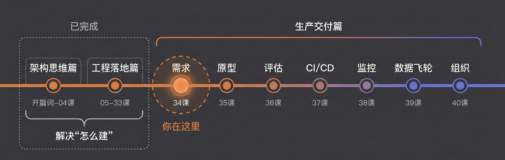
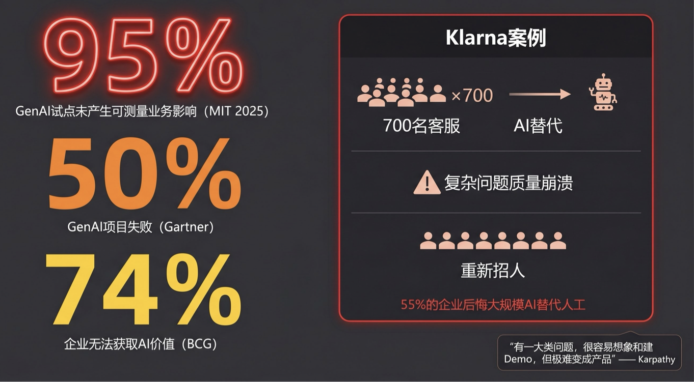
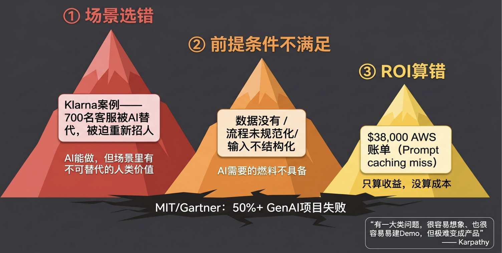
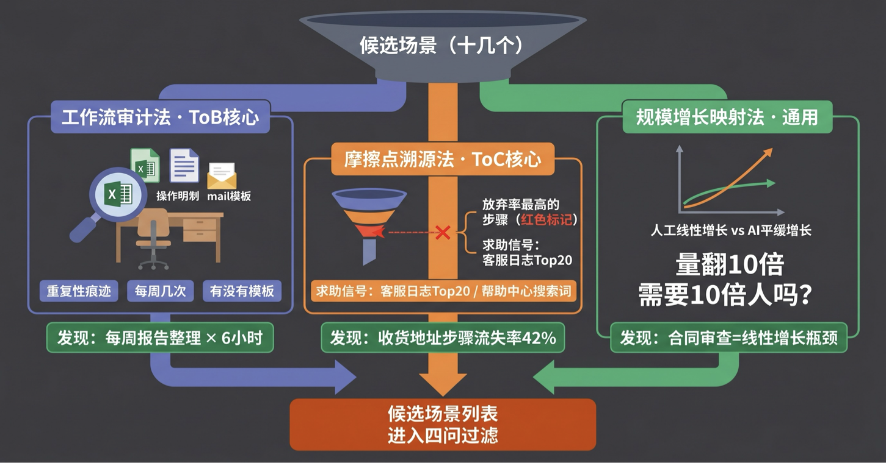
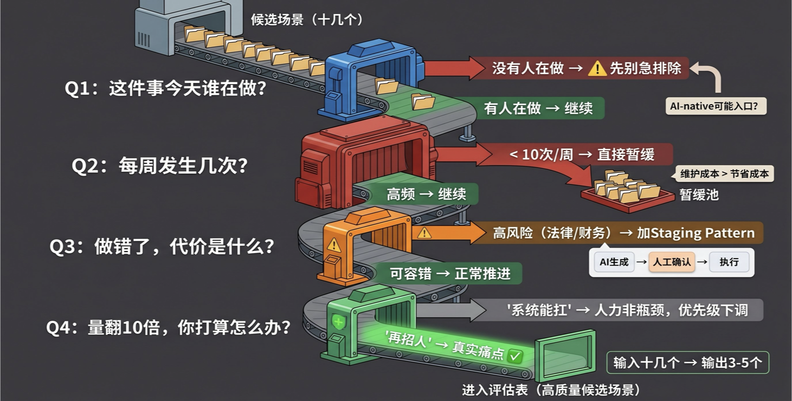
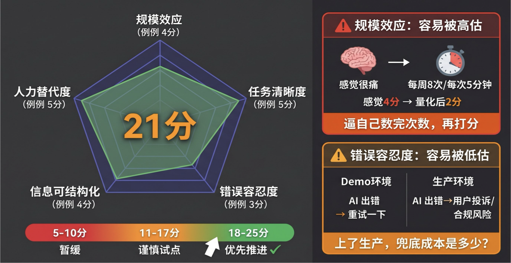
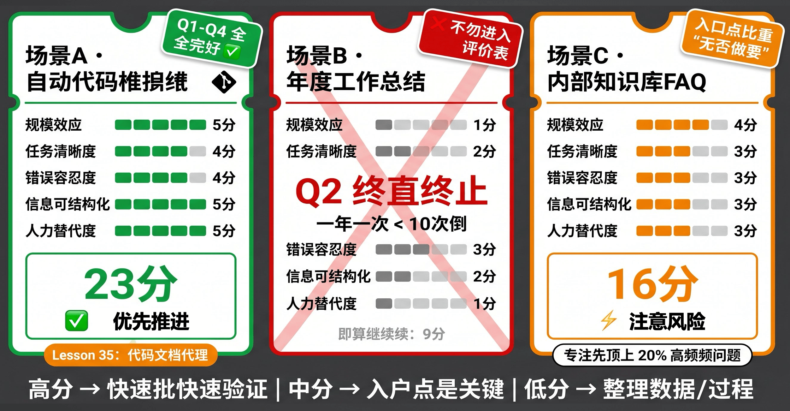
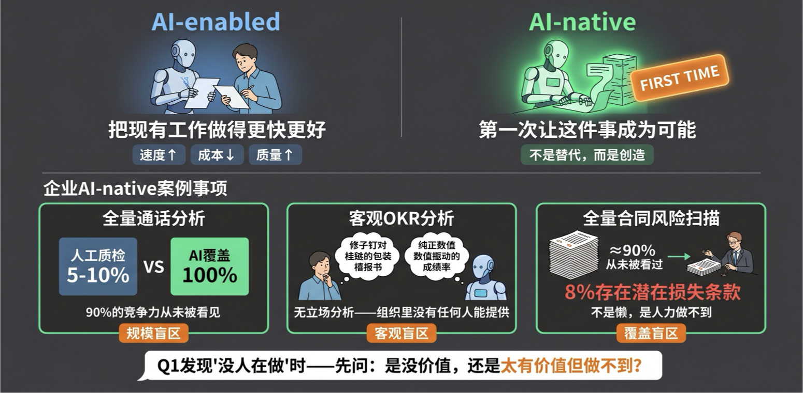

# 34｜需求边界：如何使用 AI 适用性评估表识别高 ROI 场景？

> 来源：极客时间《企业级多智能体设计实战》
> 当前播放：34｜需求边界：如何使用 AI 适用性评估表识别高 ROI 场景？
> 提取日期：2026-06-02
> 原文长度：11920 字

---

欢迎回来！

在过去的三十三节课里，我们做了一件了不起的事情。

从第 5 课的施工蓝图开始，我们一砖一瓦地搭建了一套企业级多智能体系统。模块一到三，XiaoPaw 从零起步，获得了工具能力，长出了记忆；模块四，它从独行侠变成了能协作的数字团队；模块五，我们给它穿上了装甲——Guardrails、可靠性围栏、沙箱隔离，一套完整的安全防护体系。到第 33 课结束，这套系统已经生产就绪，能跑、能扛、能管。

工程落地篇，收官。

但我在关掉代码编辑器之后，想了一个问题：**这套系统，我们该拿它去跑什么场景？**

这是一个在工程落地篇里几乎不需要回答的问题——因为我们有 XiaoPaw 这条故事线，每一课的场景都是预设好的。但在真实的企业里，这是每个 AI 工程师或架构师每天都要面对的根本问题：**我们公司有十几个业务方都在说自己需要 AI，优先级怎么排？哪些场景值得投入？哪些只是看起来适合、做完是一地鸡毛？**

这就是生产交付篇要解决的第一个问题。

注意，我刻意把这个问题放在"会建系统"之后讲，是有原因的。你必须先真正吃透 Multi-Agent 的能力边界，才能准确判断哪个场景适合它。一个从没动手做过 MAS 的人，他对 AI 能力的认知是模糊的，评估出来的结论也是模糊的。你不一样——你现在有底气做这个判断了。

生产交付篇将覆盖 AI 项目从立项到组织进化的完整生命周期：



今天，我们来建立第一块拼图：**需求挖掘三法 + 四问过滤器 + AI 适用性评估表**。评估表不是什么高深的模型，就是一张表，五个维度，25 分制，10 分钟让你得出一个可以对业务方说清楚的立项结论。

但在给你这张表之前，我们先要搞清楚一件事：**为什么大多数 AI 项目失败，不是因为技术不够好？**

---

## 一、 认知原点：AI 项目失败的真相

你可能听过很多 AI 项目失败的故事，但我猜大多数人的直觉归因是：模型不够准、幻觉太多、工程不成熟……

**这个归因错了。**



这不是个别公司的运气问题，而是行业级别的系统性失败。看看这些数据：

- MIT NANDA Initiative（2025）：95% 的企业 GenAI 试点未能产生可测量的业务影响
- Gartner（2025）：50% 的 GenAI 项目失败
- BCG（2024）：74% 的企业无法从 AI 中获取和扩展价值，60% 产生零实质价值
- RAND（2024）：80% 以上的 AI 项目无法实现有意义的生产部署

这些数字不是来自创业公司，是 IBM、沃尔玛、摩根大通这些有足够资源、足够技术能力的大企业。问题不在技术，在哪？



最典型的案例，来自 Klarna。

2024 年，Klarna 宣布用 AI 客服替代了 700 名人工客服，AI 把解决时间从 11 分钟压缩到 2 分钟。这听起来是巨大的成功。但故事没有结束——几个月后，他们开始重新招聘人工客服。原因是：复杂案例的处理质量大幅下降，客户投诉上升，用户在遇到困难时明确要求"给我转人工"。有调查显示，**55% 的企业在大规模 AI 替代人工之后，对结果感到后悔**。

**Klarna 的问题是技术问题吗？** 不是。2 分钟解决简单问题，技术上完全做到了。真正的问题是：**客服工作里有一半是"情感劳动"**——用户打电话，有时候不只是为了解决问题，他们需要被听见、被理解。这不是 AI 能替代的部分。这是**场景选错了**，不是技术选错了。

再来看另一个反面。Andrej Karpathy 曾经说过一句话，我觉得是对 Demo 陷阱最精准的描述：

>
> “有一大类问题，很容易想象、也很容易建 Demo，但极难变成产品。自动驾驶就是典型：绕着街区 Demo 很容易，做成产品需要十年。”
>
> AI 应用里到处都是这样的陷阱。一个看起来很顺滑的 Demo，在边界情况来袭的时候会原形毕露——而边界情况，在产品里永远比你预想的要多。
>

还有一个 ChatBI 的例子。去年很多公司做"对话式数据分析"，想象很美好：“所有业务数据的分析，我让 AI 帮我来干”。但很多项目失败，不是因为 AI 能力不足，而是因为**前提条件不满足**——你想做 ChatBI，你企业里的数据准备好了吗？很多公司想分析的那个数，可能**根本不存在**，或者是质量很差的噪声数据。同样语义的东西存了无数份，数据沉淀流程和存储方式都有问题。在这些前提下直接上 AI，几乎不可能成功。

第三类失败是 **ROI 算错了**。去年大家讲的故事是"AI 成本会大幅下降"，所以很多人冲进去说"先不管 ROI，我先干"。但现实是，现在用 Agent、用复杂方案，上下文和 Token 使用是大幅上升的，AI 使用成本其实也在上升。很多团队因为一次 prompt caching miss，收到了 38,000 美元的 AWS Bedrock 账单。当你的 AI Token 成本比一个人的工资还贵的时候，这个项目的 ROI 就有问题。

所以，**"AI 适用性评估"不是技术评审，是场景审查**。今天这课的核心工具不是代码，是一张表。

---

## 二、 如何发现 AI 场景：需求挖掘三法

在给你评估表之前，我还要解决一个更前置的问题：**候选场景从哪来？**

很多团队的做法是等——等业务方提 AI 需求。听起来很合理，但有一个根本性的问题：**业务方不知道 AI 能做什么，他们提的需求往往是幻想，而不是真实场景**。你会遇到两种极端：要么"帮我用 AI 做一个 ChatGPT"，要么"这件事好像 AI 能做？"——两个都没法直接转化成有价值的落地方案。

正确的做法是主动扫描。有三种方法，覆盖了 ToB 和 ToC 的主要场景。



---

### 方法一：工作流审计法（ToB 核心方法）

工作流审计的核心原则很简单：**不要看系统文档，去看人实际在做什么。**

系统文档写的是"应该怎么做"，人实际做的是"真正发生了什么"。两者之间，往往是最有价值的 AI 机会。

怎么扫描？找重复性痕迹：

- 桌面上摆着大量的 Excel 模板
- 每周五有"必须发的汇报邮件"
- 操作手册里有"第 3 步：把 A 系统的数据复制到 B 系统"
- 会议记录里的"老规矩"、“跟上次一样处理”

有一个 X/Twitter 上流传的工程师经验，我觉得说得非常到位：

>
> “Stop waiting for tickets. Start auditing workflows. Walk into any business, identify the workflows bleeding time and money, decompose them to inputs, outputs, edge cases.”
>
> 这就是工作流审计法的精髓。你不是在找"AI 功能"，你是在找"正在流血的工作流"。找到了，再问三个问题：这件事每周做几次？有没有现成的模板？做错了怎么处理？答案往往就能告诉你 AI 介入的价值和风险。
>

---

### 方法二：摩擦点溯源法（ToC 核心方法）

ToC 产品的场景扫描，数据是你最好的向导。找两类信号：

**断点信号**：用户在哪个步骤的放弃率最高？漏斗的哪一层最薄？如果用户在"填写收货地址"这一步大量流失，原因可能是表单太复杂，AI 自动填写可能是答案。

**求助信号**：客服日志里频率最高的 Top 20 条问题是什么？用户在帮助中心搜了什么关键词？用户愿意为哪些事情花钱找人代劳？这些"求助行为"背后，藏着真正的摩擦点。

**关键问题是：** 用户为什么在这里放弃了？他下一步会去哪里寻求帮助？摩擦点的背面，往往就是 AI 的机会点。

---

### 方法三：规模增长映射法（ToB/ToC 通用）

这是最好的优先级过滤器，只用问一个问题：

**“如果业务量翻 10 倍，这件事需要 10 倍的人吗？”**

- 答案是"是" → 人力随业务线性增长 → 这是真实的规模瓶颈，AI 可能是答案
- 答案是"否" → 要么已有规模效应（技术系统扛），要么问题本身不依赖人力

举个对比：合同审查翻 10 倍，需要 10 倍的法务或审查人员——这是真实的人力瓶颈；邮件发送翻 10 倍，不需要 10 倍的人——已经有系统在扛了。

**方法三的核心价值是排序。** 候选场景可能有很多，最值得投入的，是那些"人力随业务增长"的场景——因为那是一个持续增长的痛点，早晚要解决。

---

## 三、 需求挖掘四问：5 分钟完成第一轮过滤

三法扫描出来的候选场景可能有十几个。全部进评估表太费时间，也没有必要——很多场景在五分钟的对话里就能排除。



这四个问题，顺序很重要：

| 问题 | 问什么 | 答案说明什么 |
| --- | --- | --- |
| Q1：这件事今天谁在做？ | 确认有真实的人力投入 | 没有人在做 → 先别急着排除，见下方说明 |
| Q2：每周（或每天）发生几次？ | 规模效应预判 | < 10 次 / 周 → 直接进暂缓，不用打完整评估表 |
| Q3：做错了，代价是什么？ | 错误容忍度预判 | 代价是法律责任 / 财务损失 → 需要特殊设计（后面详述） |
| Q4：如果量翻 10 倍，你打算怎么办？ | 确认人力瓶颈是否真实 | 说"再招人" → 痛点真实；说"系统能扛" → 人力不是瓶颈 |

**Q1 防止幻想场景**——没有人在做这件事，通常说明没有真实的人力成本被承担，AI 的替代价值为零。但注意"通常"两个字，这里有一个特殊情况，我们留到这课最后专门讲。

**Q2 是最快的过滤器**——如果一件事每周发生不到 10 次，你的 AI 系统的维护成本（模型更新、提示词迭代、边界 case 处理）大概率会超过它节省的时间。这不是说绝对不做，而是在资源有限的情况下，优先级应该排到后面。

**Q3 是风险预警**——它不是否决项，而是设计信号。如果做错了代价极高（法律责任、财务损失、安全事故），这个场景可以做，但必须加入"暂存模式"（Staging Pattern）：AI 生成 → 人工确认 → 再执行，而不是直接自动化。

**Q4 往往是最诚实的问题**——当你问"量翻 10 倍你怎么办"，说"再招人"的，是真的感觉到瓶颈了；说"其实现在也不是问题，只是觉得 AI 应该能做"的，往往没有真实痛点。

四问的操作方式也很务实：

- ToB：和业务负责人做 30 分钟访谈，四问走完，候选场景基本可以排序
- ToC：结合产品数据回答——Q1 从系统日志看，Q2 从埋点数据看，Q3 从客服记录看，Q4 从增长预测看

---

## 四、 AI 适用性评估表：5 维度量化打分

通过四问筛选的场景，才进评估表。**评估表的本质，是把"感觉上的痛点"变成可以协商的数字**。

表格分为 5 个维度，每个维度 1-5 分，满分 25 分。每个维度的分级标准如下：



**① 规模效应** — 任务频率 × 单次时长 = 实际规模。感觉再痛，也要量化出来。

| 分值 | 判断标准 | 典型场景 |
| --- | --- | --- |
| 1 分 | 极低频：< 10 次 / 周，单次 < 5 分钟 | 年度战略汇报整理、一次性数据迁移 |
| 2 分 | 低频：10-50 次 / 周，或单次 5-15 分钟 | 周例会纪要、月度报告汇总 |
| 3 分 | 中频：50-100 次 / 周，或单次 15-30 分钟 | 每日客服工单约 50 条、日报整理 |
| 4 分 | 高频：每日百条 +，或单次 30-60 分钟 | 每次代码提交触发审查、批量合同初审 |
| 5 分 | 极高频：持续处理 / 实时流 / 规模随业务线性增长 | 全量通话质检、PR 触发文档更新、实时交易风控 |

**② 任务清晰度** — 能否写出 SOP？能否量化验收标准？任务越清晰，AI 越容易做对。

| 分值 | 判断标准 | 典型场景 |
| --- | --- | --- |
| 1 分 | 完全依赖直觉 / 情感 / 关系，规则无法言说 | 客户关系维护、CEO 风格写作、谈判博弈 |
| 2 分 | 有大方向但规则说不清，大量例外 | 品牌文案创意、复杂投诉处理（每单独特） |
| 3 分 | 主干流程清晰，但 20%+ 的例外需要人判断 | 客服 FAQ（80% 有模板，20% 需酌情）、采购审批 |
| 4 分 | 能写成完整 SOP，例外少且可列举穷举 | 发票信息提取、简历初筛、代码注释生成 |
| 5 分 | 输入 / 输出 / 验收标准全部可量化，零歧义 | 数据格式转换、合规性 checklist 核查、SQL 结果生成报表 |

**③ 错误容忍度** — 不是问"AI 会不会出错"（它一定会），而是问"出错了，代价是什么"。

| 分值 | 判断标准 | 典型场景 |
| --- | --- | --- |
| 1 分 | 零容错：出错直接导致法律 / 财务 / 安全后果 | 医疗诊断建议、合同最终定稿、信贷直接放款 |
| 2 分 | 极低容错：出错造成显著业务损失或合规风险 | 对外报价单、监管合规申报、对外公告发布 |
| 3 分 | 中等容错：有人工复核环节，出错成本可控 | 对外邮件草稿（发前有人审）、月度财务报告初稿 |
| 4 分 | 高容错：出错能快速发现和修正，影响范围小 | 内部工作文档、代码建议（开发者审核后采纳） |
| 5 分 | 极高容错：出错可忽略，可重试 / 撤销 / 人工完全兜底 | 内部 brainstorm 整理、测试环境代码、标签分类（抽样校验） |

**④ 信息可结构化** — 不管模型多强，输入是垃圾，输出一定是垃圾。

| 分值 | 判断标准 | 典型场景 |
| --- | --- | --- |
| 1 分 | 信息在人脑 / 口语 / 隐性经验中，根本无法采集 | 老员工"感觉这个客户有问题"、电话谈判中的情绪感知 |
| 2 分 | 严重碎片化：散落在多系统 / 多格式，整合成本极高 | 跨部门协作记录（邮件 /IM/ 线下散落）、纸质历史档案 |
| 3 分 | 主要信息可获取，但预处理工作量大 | PDF 合同（内容在但需 OCR+ 结构化提取）、格式不统一的客服记录 |
| 4 分 | 数据来源清晰，格式基本一致，少量清洗工作 | CRM 销售数据（字段清晰但有空值）、代码仓库 diff |
| 5 分 | 有标准接口 / 格式，直接可用，无需预处理 | 数据库查询、API 响应、标准化表单、Git 提交记录 |

**⑤ 人力替代度** — AI 解决的不是"不方便"，而是"人力真的不够用"。

| 分值 | 判断标准 | 典型场景 |
| --- | --- | --- |
| 1 分 | 无瓶颈：目前几分钟搞定，没有规模压力 | 每月一次的报销单确认、偶发的格式转换 |
| 2 分 | 轻微瓶颈：偶尔有点慢，但不影响业务进展 | 日报整理每天 20 分钟（不舒服但能接受） |
| 3 分 | 明显瓶颈：当前还撑得住，但已经接近极限 | 法务团队每周审合同需 3 天、客服已高强度但投诉率勉强可控 |
| 4 分 | 严重瓶颈：人力是业务增长的明显限制因素 | 客服全员饱和仍有大量积压、数据分析报告排队等 3 天 |
| 5 分 | 极限瓶颈：增加人手也无法解决，只有 AI 才能实现规模 | 全量通话质检（物理上无法用人力 100% 覆盖）、实时毫秒级风控 |

**评分区间的含义：**

- 18-25 分：优先推进 — 五个维度都已具备，条件成熟，建议立项
- 11-17 分：谨慎试点 — 有短板，先从最高分维度切入，建立最小验证集
- 5-10 分：暂缓 — 前提条件不具备，先解决最低分的维度（通常是数据质量或流程规范化）

有两个维度最容易打错分，要特别注意：

**规模效应容易被高估。** "感觉很痛"≠高频×长时。必须量化：这件事每周真的发生几次？每次真的需要多少分钟？很多人在这里凭感觉给了 4 分，逼自己数完次数之后发现是 2 分。这个"逼自己量化"的过程本身，就是评估表最大的价值之一。

**错误容忍度容易被低估。** Demo 的时候，AI 出错了你只是重试一下；上了生产，AI 出错可能意味着用户投诉、数据错误、甚至合规风险。在打这一分之前，先想清楚：“AI 错了，谁来兜底？兜底的成本是多少？”

---

## 五、 场景演练：同一张表，三种结论

我们拿三个具体场景来走一遍完整流程，感受评估表在实际使用中的手感。



---

### 场景 A：代码文档自动维护（架构拆解课贯穿案例）

**四问结果：** 开发团队人工维护（Q1 ✓）/ 每次 PR 合并都需要更新（Q2：高频）/ 文档有错不影响生产代码（Q3：低风险）/ 文档量随代码库增长线性增加（Q4：真实瓶颈）

**打分：**

| 规模效应 | 任务清晰度 | 错误容忍度 | 信息可结构化 | 人力替代度 | 总分 |
| --- | --- | --- | --- | --- | --- |
| 5 | 4 | 4 | 5 | 5 | 23 分 → 优先推进 |

**决策说明：** git commit 触发是天然的自动化入口，代码变更是结构化输入，文档质量可以通过 diff 和人工抽查评估。三个关键前提全部满足。下一节课的架构拆解方法论，会把这个 23 分的评估结论作为贯穿案例，带你走完"从需求到设计方案"的完整推导。

---

### 场景 B：AI 辅助撰写年度工作总结

**四问结果：** 每位员工自己写（Q1 ✓）/ 一年一次（**Q2：直接暂缓**）

**四问 Q2 就应该终止对话。** 不需要进评估表。

一年一次的任务，哪怕 AI 做得再好，你的 AI 系统需要维护：提示词调整、边界情况处理、版本更新……这些持续成本，远超一年省下来的那几个小时。

为了完整性，假设我们继续打分：

| 规模效应 | 任务清晰度 | 错误容忍度 | 信息可结构化 | 人力替代度 | 总分 |
| --- | --- | --- | --- | --- | --- |
| 1 | 2 | 3 | 2 | 1 | 9 分 → 暂缓 |

**决策说明：** 这是一个"看起来适合 AI"的场景——大模型确实能写文章。但频率决定了 ROI。如果你的团队有 500 人，一年用一次，单次节省 1 小时，全年节省了 500 小时；但如果你的 AI 系统每月需要工程师花 20 小时维护，ROI 已经穿底了。

---

### 场景 C：内部知识库 FAQ 自动问答

**四问结果：** HR/IT 人员兼职回答（Q1 ✓）/ 每天 100+ 次（Q2：高频）/ 答错了员工会再追问（Q3：中等）/ 员工翻倍，问题量也翻倍（Q4：真实）

**打分：**

| 规模效应 | 任务清晰度 | 错误容忍度 | 信息可结构化 | 人力替代度 | 总分 |
| --- | --- | --- | --- | --- | --- |
| 4 | 3 | 3 | 3 | 3 | 16 分 → 谨慎试点 |

**决策说明：** 16 分意味着有价值，但有短板。最低分是任务清晰度、错误容忍度、信息结构化，全是 3 分——这提示我们：不要全量铺开，先从**最高频的 20% 问题**（比如报销流程、请假规定）做试点，这部分问题标准化程度最高、信息最容易整理、出错影响最小。验证准确率和用户接受度之后，再逐步扩展覆盖范围。

---

**三个场景的规律总结：**

>
> 分数越高，越应该快速推进、快速验证；分数在中间，切入点的选择比"做不做"更重要；分数很低的场景，重点不是"怎么做 AI"，而是"先把数据和流程整理好"。
>

---

## 六、 扩展视野：AI-enabled 与 AI-native

现在，我要回到第三节留下的那个悬念——Q1 的"特殊情况"。



我们说，Q1 用来过滤"没有人在做的事"，理由是：没有人在做 → 没有真实的人力成本 → AI 替代价值为零。这个逻辑绝大多数时候是对的，但有一类场景是例外：**不是没有价值，而是太有价值了、但过去人力上根本做不到，所以也一直没有人做。**

这引出了今天课里最后一个、也是最值得你带回公司思考的视角。

在云计算时代，有两种企业走向了截然不同的未来：**Cloud-enabled**（把现有系统搬到云上）和 **Cloud-native**（从第一行代码开始就为云而设计）。两者起步看起来相似，但几年后的结果天壤之别——Cloud-native 企业的弹性、成本和迭代速度，是 Cloud-enabled 企业根本追不上的。

AI 时代，同样的分叉正在发生。

**AI-enabled** 是用 AI 让现有工作做得更快更好——这是三法和评估表覆盖的领域，也是今天大多数企业正在做的事情。

**AI-native** 是问一个更根本的问题：**有哪些有价值的事情，因为人类的内在局限，从来就没有人真正完整地做过？不是没动力做，而是物理上、认知上根本做不到？**

三个企业级例子：

**① 销售通话全量分析。** 质检团队人工抽听，覆盖率通常只有 5-10%。谁是顶级销售靠口耳相传，最重要的竞争力藏在那 90% 没人听过的通话里。AI 可以处理 100%，提炼出顶级销售员在客户提出异议时的下一句话、在客户准备放弃时的挽回节奏。这不是替代质检员，而是**第一次让"大规模管理销售话术"这件事真正成为可能**。

**② 客观的 OKR 分析。** 把所有业务线的目标、过程数据、最终达成情况全部交给 AI 分析，得到的结论和下属向上汇报时的版本是两件完全不同的事。汇报永远是被精心包装过的；AI 没有这个动机，也没有需要保护的关系。这种"无立场的组织分析"——**在一个组织里，从来没有任何人能提供**。

**③ 全量合同风险扫描。** 法务只审查大合同，中小合同直接盖章，不是因为懒，而是人力做不到。某金融机构的试点结果：AI 扫描出的中小合同里，8% 存在可量化的潜在损失条款。这些合同从来没有人看过——一直存在的风险，第一次被看见。

---

这三个例子背后的共同特征：**那个业务数据一直存在，那个判断一直需要，但从来没有人完整地做过。AI 不是替代了一个已有的角色，而是第一次让这个角色成为可能。**

回到 Q1。当你在用三法扫描业务时，发现某件"没有人在做"的事，不要立刻用 Q1 排除它——先问自己：是"没有价值所以没人做"，还是**“太有价值了但从来做不到所以没人做”**？

后者，就是 AI-native 的入口。

今天的评估表和三法，覆盖了 AI-enabled 这半张地图。AI-native 这半张地图，需要的不是更好的扫描工具，而是一个不同的提问方式——**“如果这件事能做了，会发生什么？”**

---

## 七、 避坑指南：最佳实践与反模式

### 🚫 严重破坏 ROI 的"反模式"

**1. Demo 成功即立项**

某公司的 LLM 客服在测试环境表现优异，直接上线。两周后 A/B 测试数据出来：这套系统带来的损失，是人工客服的 12 倍，被迫下线。

**现象：** Demo 选了最好的用例；产品会遇到所有用例。边界情况的密度决定了产品质量，而 Demo 看不到边界情况。

**致命后果：** 上线后踩边界情况，用户体验崩塌，系统被迫下线，已投入的工程成本归零，团队信心受损。

**行动准则：** 上线前必须设计好"AI 失败时的降级路径"——AI 出错了，用户会看到什么、被引导去哪里，而不是假设 Demo = 产品。

---

**2. 不理解人类工作流就自动化**

MIT 研究发现，企业 AI 试点失败的根本原因，往往是"没有理解要替换的人类工作流"。业务流程里有大量"不成文的规则"——比如"这个客户要特殊对待"、“这种情况要先打个电话再走流程”——AI 扫描不到，也替代不了。

**现象：** AI 完美执行了流程文档，但产出结果不被业务方接受。

**致命后果：** 投入大量工程资源，产品上线后发现核心场景无法覆盖，需要大规模重做。

**行动准则：** 自动化之前，先花一天"影子跟踪"——跟着一线员工看他们实际怎么做这件事，把那些不在文档里的隐性知识找出来。

---

**3. 低频场景强行自动化**

ToB 落地经验告诉我们：少 Skill、覆盖高频场景，比多 Skill、覆盖长尾场景，产生的业务价值大得多。AI 系统有持续的维护成本——模型更新、提示词迭代、边界 case 处理。

**现象：** 十几个 AI 场景同时上线，每个场景月均使用 5 次，维护远比使用消耗更多人力。

**致命后果：** 投入产出严重失衡，低频场景回报周期极长，很可能在 ROI 转正之前就被砍掉了。

**行动准则：** 四问第二问"每周几次"——低于 10 次，直接暂缓，不用进评估表。把资源留给高频场景。

---

**4. 忽略 Token 成本的 ROI 计算**

一个简单的 prompt caching miss，导致了 38,000 美元的 AWS Bedrock 账单。这不是极端案例，这是没有成本模型的必然后果。

**现象：** 立项时只计算"节省了多少人力时间"，API 成本、维护成本、出错处理成本全部被忽略。

**致命后果：** 上线后发现 AI 成本超出预算数倍，被迫大幅缩减调用频率，严重影响用户体验。

**行动准则：** 立项前必须做成本模型——假设月调用量 X 次，每次 Y token，算出月均成本，再和节省的人力成本对比，得出 ROI 转正的时间线。

---

### 💡 稳健落地的"最佳实践"

**1. 从"最枯燥、最机械"的任务开始**

最高 ROI 的 AI 场景往往是最无聊的：上传文档 → 提取关键字段 → 识别缺失信息 → 生成摘要 → 路由到人工审核 → 生成报告。结构化、高频、低风险——这类任务 AI 最容易做好，人力解放最明显。

**落地心法：** 让团队列出"最不想做的五件重复工作"，排在第一的往往就是最好的 AI 场景入口。选它，不要选那个"看起来最酷炫"的。

---

**2. 把团队 Best Practice 固化为 AI 工作流**

最有经验的工程师在做 Code Review 时，脑子里有一份隐形的检查清单——他会看什么、问什么、重点盯哪些地方。GitHub Copilot code review 的成功，本质上就是把这份隐形清单变成了 AI 的显式检查逻辑。

**落地心法：** 设计 AI 工作流之前，先问"我们团队最有经验的人在做什么——能把这个经验写成规则吗？"能写成规则的，才有被 AI 高质量复现的可能。

---

**3. 事件触发的后台 Agent，而非"再开个聊天窗口"**

最高 ROI 的 AI 场景，往往不是对话窗口，而是在正确时机自动触发的自动化流程：git push 触发文档更新、文件上传触发信息提取、定时触发周报汇总。用户不需要主动操作，AI 在后台完成工作。

**落地心法：** 设计场景时问"用户需要主动触发吗？"——如果需要，思考能否改成事件自动触发。需要用户主动触发的 AI 功能，使用频率会随时间快速下降。

---

**4. 三维 ROI，不只是"省了多少时间"**

最好的 AI 场景，不只是节省时间，而是在节省的时间里做出更好的决策。一个实用的 ROI 公式：

>
> AI ROI = 节省时间 × 判断质量提升 ÷ 运营成本
>
> 只计算"省了多少时间"，会低估真正的价值。一个自动生成周报摘要的 AI，节省的 2 小时如果被用来做客户访谈，产生的价值是复利式的。
>

**落地心法：** 评估 ROI 时加第三维——这件事自动化之后，团队能把省出来的时间花在哪个更高价值的地方？

---

## 课程总结

我们今天完成了生产交付篇的第一个核心工具的建立。回顾关键结论：

- 我们了解到，AI 项目失败的第一原因不是技术，而是选题——用正确的技术解决了错误的问题。Klarna 的案例和 MIT 的研究共同指向同一个根因：没有理解要替换的人类工作流。
- 我们掌握了三种主动挖掘 AI 需求的方法：ToB 用工作流审计（找"正在流血的工作流"），ToC 用摩擦点溯源（找用户求助信号），通用用规模增长映射（找"量翻 10 倍需要 10 倍人"的瓶颈）。
- 我们建立了需求挖掘四问作为快速过滤器，在 5 分钟内排除不值得深度评估的场景——特别是 Q2（每周几次）和 Q4（量翻 10 倍怎么办），往往能直接揭示需求的真实价值。
- 我们交付了 AI 适用性评估表：5 个维度、25 分制，18 分以上优先推进，11-17 分谨慎试点，10 分以下暂缓，并通过三个演练场景看到了它在实际使用中的手感。
- 我们通过 4 个反模式 + 4 个最佳实践，建立了"不踩坑"的操作直觉。
- 我们扩展了视野：今天的框架覆盖的是 AI-enabled 场景——用 AI 把现有工作做得更快更好。还有一类更高价值的 AI-native 场景，它的特征是"从来没有人做过，不是因为没价值，而是因为人力上根本做不到"。识别它的方法不是更好的扫描工具，而是换一个提问方式。

---

**最后，一个重要的定位澄清：**

今天的评估表回答的是"**该不该做**"——这是立项前的决策。它和第 4 课的 C.U.P. 三维评估模型是串联关系，不是竞争关系：

```plain
评估表确认场景值得做（18-25 分）
         ↓
C.U.P. 决定用什么架构（Prompt / Workflow / Agent / Multi-Agent）
         ↓
工程落地篇（第 5-33 课）开始动手
```

当年我们在架构思维篇学 C.U.P.，是为了"确定要做 AI 之后，选哪种架构"；今天的评估表，是更前置的一步——**“这个场景值不值得做 AI”**。两张表配合使用，才是完整的 AI 项目立项工具箱。

>
> 下节课预告： 既然我们已经有了一套评估框架，接下来就该回答第二个问题：怎么设计？ 下一节课，我们将交付一套产品原型设计方法论——从"我们需要 AI 做 X"出发，走完三问决策、画出 I/O 接口原型、规划 Ground Truth 积累路径，一直到产出一个可以动手验证的 Demo 方案。我们下节课见！
>

---

## 课后思考

**费曼检验：**

>
> 用一句话，向一个不懂 AI 的产品经理解释：为什么我们需要一张评估表，而不是直接凭经验判断这个场景值不值得做 AI？
>
> 思考题：
>

1. 回想你所在团队（或你熟悉的业务场景）里，用"需求挖掘三法"扫描一遍：有没有"人力随业务线性增长"的瓶颈场景？试着用四问快速过滤一下，它能通过 Q1 和 Q2 吗？

用 AI-native 的视角看你的业务：有没有某件事是"大家都知道应该做、但从来没有人真正做过"的？它是被人力上限卡住的，还是被认知上限卡住的？如果 AI 能做到，会发生什么？

1. 提示：从"数据一直在、但从来没有人把它读完"这个方向找起，往往容易找到入口。

欢迎在评论区分享你的真实案例，我们下一讲见！
---

来源：极客时间《企业级多智能体设计实战》
提取日期：2026-06-02
