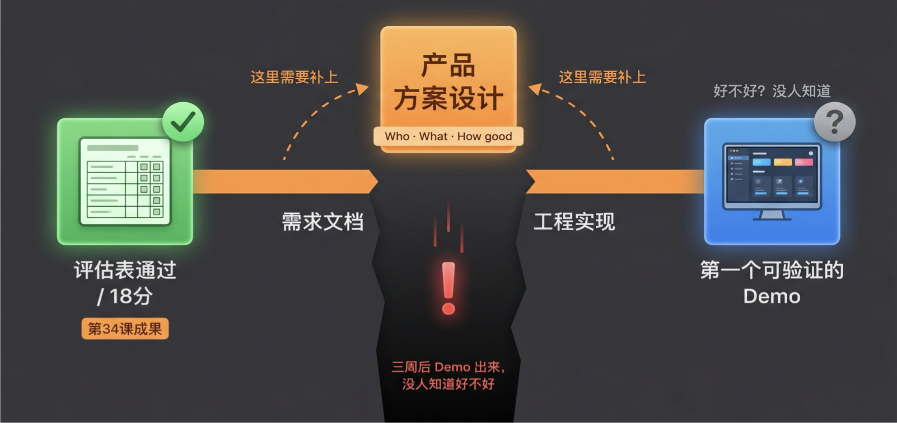
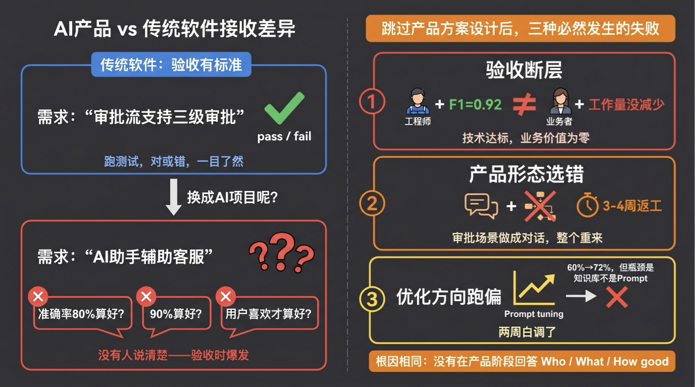
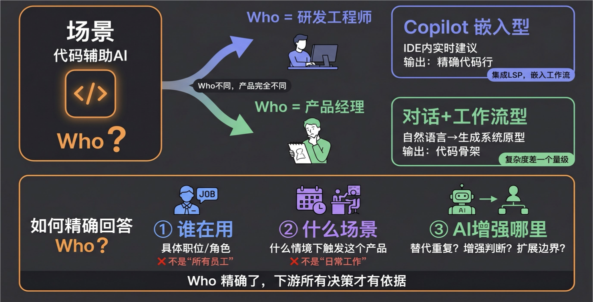
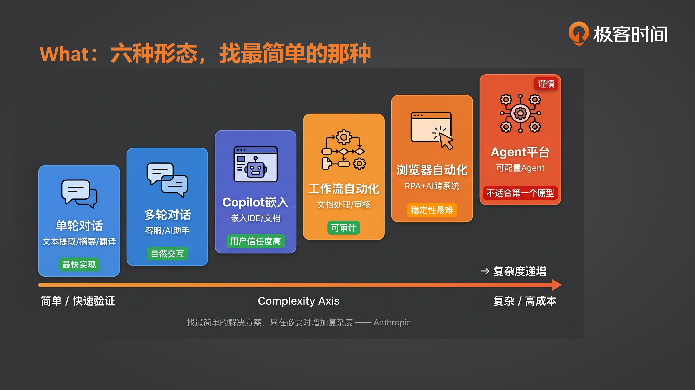
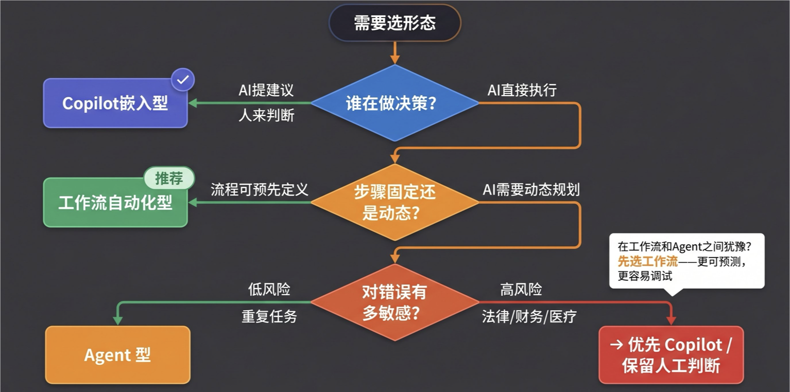
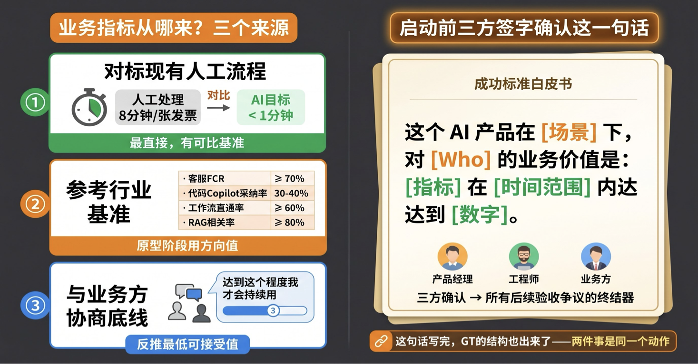
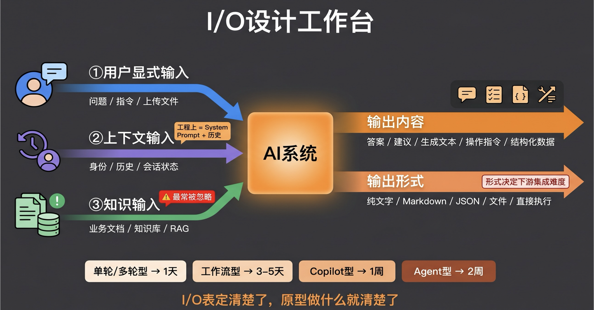
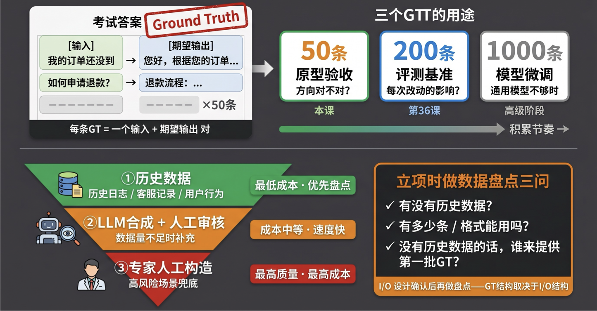
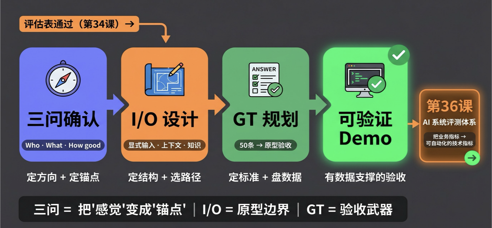

# 35｜产品原型：从需求到第一个可验证的Demo

> 来源：极客时间《企业级多智能体设计实战》
> 当前播放：35｜产品原型：从需求到第一个可验证的Demo
> 提取日期：2026-06-02
> 原文长度：11185 字

---

欢迎回来！

上节课，我们交付了一张评估表。五个维度，25 分制。18 分以上的场景，我告诉你：优先推进。

但推进，推进到哪里？

这里有一个隐藏的断层，大多数团队都踩过——通过了评估之后，产品经理写了一份需求文档，工程师开始搭环境，项目就启动了。然后三周后，第一版 Demo 出来，所有人围坐一起，沉默了片刻，说了一句话："这个……好不好？“没有人知道。因为从来没有人说过什么叫"好”。

这就是本节课要解决的问题：**从"场景值得做"到"第一个可验证的 Demo"，中间缺了一个关键步骤——产品方案设计**。这个步骤不是工程实现，而是在动手之前，把三个问题回答清楚：这个 AI 产品服务**谁**（Who）？做的是什么**形态**的产品（What）？在业务层面，什么样才算**好**（How good）？



三问完成，才是产品原型设计——确认用户流程，定义输入输出。有了 I/O 设计，才能规划 Ground Truth——因为 GT 数据的结构，完全取决于 I/O 的结构。今天这节课，我们把这整条链路走一遍。

---

## 一、 认知原点：产品方案设计到底是什么？

**产品方案设计的本质，就是在动手建系统之前，把"做给谁、做成什么、好到哪里算好"这三个问题写成纸上契约。**

听起来像废话——哪个项目不做需求分析？

但 AI 产品有一个特殊性，让这个步骤比传统产品更容易被跳过，而且被跳过的代价更高：**AI 系统的"好不好"，不像传统软件那样有明确的功能通过 / 失败标准，它需要在产品阶段就定义出来；否则，验收时什么叫"达标"，谁也说不清楚。**



传统软件项目，需求文档写"审批流支持三级审批"，这是一个可以 pass/fail 验证的功能需求。工程实现对不对，跑一个测试就知道。AI 项目的需求文档写"AI 助手辅助客服"——这不是一个可以 pass/fail 的需求。好的 AI 是什么？准确率 80% 算好？90% 算好？用户喜欢才算好？这些问题如果留到上线后再定，代价是整个原型推倒重来。

这就是产品方案设计在 AI 项目里的定位：**它是工程实现的前置条件，不是并行任务**。就像建筑师在施工队进场之前，必须先交付平面图和效果图——不是因为施工队不聪明，而是没有这张图，他们不知道"建完了"长什么样。

用企业类比说：产品方案设计就是 PM 和业务方在会议室里对齐的那张"验收白皮书"。AI 工程师是施工队；他们做得出来，但"做成什么样客户满意"，必须在进场之前就定好。

---

## 二、 为什么需要它：从"值得做"到"怎么做"的断层

我们来看一个真实的失败模式。

场景：某团队的合同审查场景通过了评估表，18 分，优先推进。产品经理写了一份需求文档——“AI 自动审查合同，识别风险条款”。工程团队开始接入 LLM，三周后原型出来了。Demo 跑了五份合同，识别出来了一些条款。

然后，法务说："这个条款不算风险啊？"工程师说："这个我们 F1 分数已经 0.87 了。"业务方说："我需要的是识别出来的条款我能直接用，不是说有多少条款被识别出来。"三方沉默。

这不是技术失败，这是对齐失败。三个人对"好"的定义从来没有对齐过。

这类对齐失败有三种典型症状：

**① 验收断层。** 工程团队用技术指标验收，业务方用业务价值验收，两者不在一个语言体系里。“准确率 0.92"和"法务工作量减少 60%”，衡量的是同一个系统的不同截面，但它们并不相互蕴含。有时候技术指标高，业务价值反而低——因为优化的方向根本不对。

**② 产品形态选错，整体返工。** 某团队把一个流程审批场景做成了对话式 AI，用户聊了半天，审批结果出不来——因为审批有明确的步骤顺序、权限校验，这是工作流自动化的场景，不是对话的场景。返工代价是三到四周的工程时间。

**③ 原型验证了错误的东西。** 团队花两周调 Prompt，把某个指标从 60% 提到了 72%。然后业务方说这个指标对我没用，我关心另一个指标——原来真正的瓶颈是知识库覆盖范围，不是 Prompt 的问题。两周白调了。

这三种症状，根因都是同一个：**在产品阶段没有回答"Who / What / How good"这三个问题**。

---

## 三、 三问工作法：动手之前的产品决策


### 第一问：Who——用户是谁，决定产品是什么

**Who 不是用户画像，是产品形态的第一个决定因子。**

来看一个例子。“代码辅助 AI”，听起来是同一个场景。但如果 Who 不同，产品完全不同：



- Who 是研发工程师：他需要的是嵌入 IDE 的代码补全——写代码时实时建议，减少查文档的时间。产品形态是 Copilot 嵌入型。技术路线是：接入代码 LSP，做上下文感知的代码补全，输出精确的单行 / 多行代码建议。
- Who 是产品经理：他需要的是"用自然语言描述产品需求，直接生成一个可跑的系统原型"。产品形态是对话 + 工作流型，链路是自然语言 → 系统架构设计 → 生成代码骨架。

同一个"代码辅助"场景，服务工程师和服务 PM，技术复杂度差了一个数量级，验收标准完全不同，界面完全不同。

还有一个更尖锐的例子：**如果你的老板真实意图是"用 AI 替代工程师"，而你选了 Copilot 增强型方案，那么这个项目从一开始就是错的。**Copilot 的设计哲学是"人机协作"，它的价值在于提升现有工程师的效率——这意味着你需要更多工程师去使用它，而不是更少。如果决策者的真实诉求是裁员而非增效，选 Copilot 就等于给自己挖坑。

再来看第三个角色：如果**Who 是 QA 测试工程师**，同样是"代码辅助"，产品形态又会变成什么？QA 需要的不是代码补全，而是测试用例生成、边界 case 自动发现、测试覆盖度分析——这又是一个完全不同的产品形态。

**Who 的精确程度，直接影响你下游所有的设计决策。**

Who 要回答四个具体问题：

1. 谁在用：具体的职位或角色——不是"所有员工"，不是"内部用户"
2. 他们的工作场景是什么：在什么情境下、做什么任务时会触发这个产品
3. AI 在哪个环节替代或增强了他们的能力：是替代重复操作、增强判断力，还是扩展能力边界
4. 扩展边界是什么：如果需求扩大，这个产品的边界在哪里？是否会偏离初衷

Who 确认了，才能进入第二问。

---

### 第二问：What——AI 产品的六种形态

确定了 Who，下一步是选出匹配的产品形态。AI 应用在产品层面有六种形态，每种有不同的适用场景、核心优势以及主要劣势：



| 产品形态 | 典型场景 | 核心优势 | 主要劣势 |
| --- | --- | --- | --- |
| 单轮对话型 | 文本提取 / 分类 / 摘要 / 翻译 | 最快实现，无状态，易测试 | 不能处理上下文依赖 |
| 多轮对话型 | 客服 /AI 助手 / 顾问咨询 | 自然交互，有上下文，支持澄清 | Memory 设计复杂，状态管理成本高 |
| Copilot 嵌入型 | 嵌入 IDE/ 文档 /CRM 辅助决策 | 融入现有工作流，用户信任度高 | 依赖宿主接口，集成周期长 |
| 工作流自动化型 | 文档处理 / 审核 / 定期报告生成 | 确定性执行，可审计，易回滚 | 边界 case 多，需降级路径设计 |
| 浏览器 / 桌面自动化型 | RPA+AI，跨系统操作执行 | 无需改造现有系统，可接入遗留系统 | UI 变化即失效，稳定性最难保证 |
| Agent 平台型 | 用户可配置自己的 Agent | 灵活适应多样场景，能力可复用 | 最复杂，不适合作为第一个原型 |

选型不是看哪种形态"功能最强"，而是找到最简单的、能解决 Who 问题的那种形态。Anthropic 在《Building Effective Agents》里的建议是：**“找最简单的解决方案，只在必要时增加复杂度。”**

用三个判断问题帮你选型：



**问题一：谁在做决策？** AI 提建议、人来判断 → Copilot 嵌入型；AI 直接执行 → 工作流 /Agent 型。用户对 AI 自主执行的接受度，往往比你预想的低——法律合同、财务审批，大多数用户宁愿 AI 给建议，也不愿意 AI 直接提交。

**问题二：步骤是固定的还是动态的？** 任务流程可以预先定义 → 工作流自动化型；需要 AI 根据情况动态规划路径 → Agent 型。在两者之间犹豫时，先选工作流——它更可预测，更容易调试，更容易向业务方解释出了什么问题。

**问题三：对错误有多敏感？** 法律 / 医疗 / 财务等高风险场景 → 优先 Copilot，保留人类最终判断；低风险重复性任务 → 工作流 /Agent 型。

你可能会问：这六种产品形态和第 1-4 课讲的四种架构范式（Prompt / Workflow / Agent / Multi-Agent）是什么关系？

区别在于视角。第 1-4 课的架构范式是**工程实现视角**——回答"技术上怎么搭"；这节课的六种产品形态是**产品验证视角**——回答"要验证什么，原型长什么样"。同一个工作流自动化的需求，工程上用 CrewAI Workflow 实现，产品上你关心的是"用户流程是否顺畅"、“出错时能否介入”。两个视角相互补充，不是替换关系。

---

### 第三问：How good——业务成功标准，现在就要定

How good 是三问里最容易被推迟的。大家都说"先做出来再看"——结果是做出来了，没人知道算不算好。

这里有一个区分必须说清楚：**业务指标**（本课的任务）和**系统指标**（第 36 课的任务）不是一回事。

- 业务指标：这个 AI 应用上线后，业务表现上怎么判断它是好的？——客服首次解决率提升了多少，合同处理时长缩短了多少，建议被采纳了多少次
- 系统指标：准确率、召回率、延迟、Token 成本——这是第 36 课要建的评测体系

两类指标的关系是：你先在产品阶段定好业务指标（这节课），再在第 36 课把业务指标拆解成可自动化测量的系统指标。**如果业务指标没定，系统指标就是在优化一个没有方向的数字。**

各产品类型的业务指标基准，供原型阶段参考：

| 产品类型 | 典型业务指标 | 行业参考基准 |
| --- | --- | --- |
| 客服多轮对话 | 一次解决率（FCR）、转人工率 | FCR ≥ 70%，转人工率 ≤ 30% |
| 代码 Copilot | 建议采纳率 | 30–40%（GitHub Copilot 行业均值） |
| 文档处理工作流 | 直通率（无需人工干预的比例） | 直通率 ≥ 60% |
| 内容生成 | 发布采用率（生成内容被实际使用的比例） | 依场景，通常 ≥ 50% |
| RAG 知识库问答 | 相关答案率（用户标记"有帮助"的比例） | 相关率 ≥ 80% |

定义业务指标有三个来源：**对标现有人工流程**（当前每张发票处理 8 分钟，AI 目标 < 1 分钟）；**参考行业基准**（上表，原型阶段用方向值即可）；**与业务方协商底线**（你认为达到什么程度才会持续用）。



一个客服 AI，系统准确率 95%，但首次解决率只有 40%，用户还是大量转人工——这个产品算好还是不好？**这就是为什么业务指标要在产品阶段定：它是验收的锚点，不是技术数字。**

这三个问题（Who / What / How good）回答清楚后，**必须用一张"签字纸"把它固定下来**：在什么场景下，对谁，业务价值是什么，指标在什么时间内达到什么数字。这张纸需要产品经理、工程负责人、业务方三方签字确认——不是为了仪式感，是为了在验收争议发生时，有一个明确的裁判标准。

---

## 四、 深入框架：产品原型与 Ground Truth 的逻辑关系

三问回答完，你知道了 Who、选定了 What、定好了 How good 的业务指标。现在到了产品原型阶段。

原型的核心工作**不是实现功能**，而是确认一件事：**用户流程和 I/O 结构**。

### 原型的核心：用户流程与输入输出设计



画出用户流程的起点，是一个简单的问题：**用户在哪个步骤需要看到 AI 的输出才能继续工作？** 这个步骤，就是原型最需要验证的环节。

触发方式有三种——主动对话（用户输入问题）、上传文件触发（上传合同触发审查）、系统事件自动触发（新工单进来自动派发）——三种触发方式对应的交互设计和输出要求完全不同。

触发方式确认了，再看**输入结构**。AI 系统的输入分三类：

**① 用户显式输入**：用户直接提供的问题 / 指令 / 上传文件——最直观。但"显式输入就是全部输入"是原型阶段最常见的认知误区。

**② 上下文输入**：用户身份、历史记录、当前工作状态、会话上下文——这是 AI 行为的"隐性依赖"，工程上对应 System Prompt + 会话历史。如果这部分没设计，AI 对同一个问题会给出脱离场景的答复。

**③ 知识输入**：业务文档、产品说明、领域知识库——RAG 场景的核心，也是原型阶段最容易被忽略的一类输入。很多 RAG 场景，原型阶段没有准备知识库，AI 胡乱回答，团队误以为模型不行——其实是知识输入缺失，不是模型的问题。

三类输入定清楚，再看**输出结构**。输出有两个维度：**输出内容**（答案 / 建议 / 生成文本 / 操作指令 / 结构化数据）和**输出形式**（纯文字 /Markdown/JSON/ 文件 / 直接执行动作）。

输出形式影响下游远比很多人预想的大：JSON 输出需要解析逻辑，直接执行动作需要权限和回滚设计，Markdown 影响前端渲染方式。这些在原型阶段就要锁定，否则工程集成时返工。

I/O 结构确定之后，按产品形态选原型路径：

| 产品形态 | 原型核心任务 | 时间目标 |
| --- | --- | --- |
| 单轮 / 多轮型 | Prompt + 代表性用例跑通 | 1 天 |
| 工作流型 | 定义 Task 链，跑通 Happy Path（先不处理异常） | 3–5 天 |
| Copilot 型 | 最小 API 集成 + 最简 UI，证明能嵌入现有产品 | 1 周 |
| Agent 型 | Orchestrator + 最小工具集，证明信息流通（不需要全部工具） | 2 周 |

原型最核心的产出不是代码，是一张 I/O 表：输入有哪几类，输出是什么格式，用户在哪个环节看到结果。这张表定清楚了，原型做什么就清楚了。

### Ground Truth：AI 系统的"标准答案卷"

在讲规划之前，先说清楚一个概念——因为大多数人第一次接触 AI 工程时，都没有人专门解释过这个词。

**Ground Truth（GT），直译是"基准事实"，在 AI 工程里指的是：一组"输入 + 正确输出"对，代表你对这个 AI 系统"应该怎么做"的权威定义。**

用最简单的类比说：GT 就是考试的标准答案卷。



一个学生（AI 系统）交了一份卷子（输出结果），你怎么知道他答得好不好？你需要一份标准答案——这就是 GT。没有标准答案，阅卷只能靠感觉；有了标准答案，对照比较就行。

具体到 AI 系统，每一条 GT 数据长这样：

```plain
输入（Input）：  "我的订单还没到，已经等了 5 天了"
期望输出（GT）： "您好，抱歉给您带来不便。根据您的订单号查询，
                  您的包裹目前处于 [状态]，预计 [日期] 送达。
                  如仍有问题请回复'人工'联系客服。"
```

这一对数据，就是一条 GT。50 条这样的数据，就是一个小型 GT 集合。你拿着这 50 条，把真实 AI 系统的输出和期望输出做比较——分数出来，原型好不好一目了然。

---

**GT 是用来做什么的？**

GT 在 AI 系统的不同阶段，承担三个不同的角色：

**① 原型验收**（本课的场景）：原型做完，用 GT 跑一遍，得到一个分数。这个分数是"方向对不对"的判断依据。50 条 GT，就够判断方向了。没有 GT，验收变成"大家觉得怎么样"——有多少人就有多少个标准。

**② 持续评测基准**（第 36 课的场景）：每次你改了 Prompt、换了模型、调整了 RAG 的检索策略——改动有没有让系统变好还是变坏？用 200 条 GT 跑一遍，分数变化立刻可见。这是 AI 工程里的"回归测试"，没有它，每次改动都是在蒙眼飞行。

**③ 模型微调数据**（更高级阶段）：当通用模型的能力边界不够用，你需要在自己的数据上微调——微调用的数据，本质上也是 GT，只是量级更大（通常 1000 条以上）。

所以 GT 不是一个孤立概念，它是贯穿 AI 系统整个生命周期的基础设施。越早规划，后续代价越低。

---

**GT 怎么规划：依赖 I/O，三种来源**

这里有一个很多团队做颠倒了的逻辑：**GT 规划必须在 I/O 设计之后，原型验收之前。**

为什么 GT 依赖 I/O 设计？回到 GT 的定义——每一条 GT 数据 = 一个"输入样本 + 期望输出"对。如果你还没定义输入的格式和输出的结构，你就不知道 GT 数据应该长什么样：输入是纯文本，还是带用户身份的结构化数据？输出是一段话，还是一个 JSON？格式没定，盘点来的数据可能完全对不上。

GT 来源有三种，按成本从低到高：

**类型一：历史线上数据**——历史日志、客服记录、用户行为数据。最低成本，优先盘点。很多团队有大量历史记录，但从来没有去整理。先花半天做数据盘点，往往发现原来有 500 条可用数据——直接省掉了后续合成数据的工作。这是最被低估的 GT 来源。

**类型二：LLM 合成 + 人工审核**——适合历史数据不足时补充。让 LLM 根据业务场景生成样本，人工按风险等级审核：低风险场景快速过，高风险场景（涉及金钱 / 法律 / 医疗）逐条核对。成本比历史数据高，比专家构造低，速度快。

**类型三：业务专家人工构造**——质量最高，成本最高。让业务专家（法务、医生、资深客服）亲自写出"正确答案"。适用于高风险边界 case 兜底，以及历史数据覆盖不到的长尾场景。

举个例子：金融风控场景下的 AI 应用，输入需要构造一个"用户信用信息包"，其中包含经过专家设计的负面信号（如异常交易模式、身份信息疑点）。期望输出是明确的风控决策：拒绝贷款、提高利率、降低额度。这种构造出来的数据，每一条都对应明确的业务规则，是专家构造的典型用法。

三种来源通常组合使用：历史数据打底，LLM 合成补量，专家构造覆盖边界。

**GT 积累节奏：50 → 200 → 1000**

- 50 条：原型验收用，判断"方向对不对"
- 200 条：第 36 课评测基准，支撑持续评测
- 1000 条：模型微调，当通用模型能力不够时

原型阶段只需要 50 条。但这 50 条必须在原型完成之前准备好——先有答案卷，再考试，不是考完试再找答案。

**立项时做数据盘点三问**：有没有历史数据？有多少条、格式能用吗？没有历史数据的话，谁来提供第一批 GT？这三个问题的答案，直接影响原型的验收方式和时间线。很多项目卡在验收环节，不是因为系统不行，而是 GT 数据根本还没准备好。

---

## 五、 避坑指南：最佳实践与反模式

### 🚫 严重破坏稳定性的"反模式"

**反模式一：没有 GT，原型验收等于主观打分**

**现象**：原型 Demo 跑完，产品经理说"感觉还可以"，法务说"这个回答不太对"，工程师说"技术指标达标了"。没有一条 GT 数据支撑评价。更常见的情况是：给你个对话框，你说"这就是我做出来的 AI 陪伴机器人"，用户问了几个问题，你看着输出说"感觉像那么回事"——但到底好不好，完全不知道。

**致命后果**：没有 GT 的验收会变成印象分战场。第一个子陷阱是**问题太泛导致评分不稳定**——用户问"你好吗"和"帮我分析一下这个合同的风险条款"，得到的回答质量完全不同，没有 GT 你就不知道系统在哪类问题上表现好、哪类问题上表现差。第二个子陷阱是**全靠专家构造导致成本高且分布有偏**——专家构造的数据往往集中在他们熟悉的场景，真实用户的问题分布可能完全不同，系统在这些"专家盲区"上表现如何，完全未知。

更隐蔽的情况是：有 GT 数据，但没在立项时规划，数据格式和 I/O 对不上，50 条数据收集完才发现用不了。

**行动准则**：立项时做数据盘点三问（有没有 / 多少条 / 格式能用），GT 结构和 I/O 设计**同步完成**——两件事是同一个动作。

---

**反模式二：产品类型没想清楚就动手，技术路线整体返工**

**现象**：把流程审批场景做成了对话窗口；或者把简单问答场景过度设计成多 Agent，路径不可预测、无法审计。

**致命后果**：将 Workflow 型需求做成了 Chatbot，业务方问"审批通过了吗"，AI 说"根据规则，这份申请可能需要……"——没有确定性答案，因为对话型天然缺少工作流的状态机。整个工程推倒，重新做工作流版本。另一方向的错误是高估 Agent 适用范围：Anthropic 明确指出，“Agentic 系统以延迟和成本换取更好的任务表现”——在原型阶段承担这个代价往往得不偿失。

**行动准则**：用三个判断框架（谁做决策 / 步骤固定与否 / 错误敏感度）选产品类型，**写下来对齐**之后再动手。口头说"大家都知道做什么"，不算对齐。

---

**反模式三：原型没有边界，越做越大**

**现象**：每次 Review 都加功能——“加一个这个场景”、“顺便支持一下那个用户类型”。原型越来越完整，验证时间越来越长。

**致命后果**：功能越全越看不出核心假设是否成立。一个 30 个功能点的原型，出了问题，不知道是哪个功能点的问题；一个只有 3 个功能点的原型，出了问题，范围清晰，调试快，结论清楚。DevCom 的总结是：原型的价值来自**验证了什么**，不是实现了什么。

**行动准则**：立项时除了写"要做什么"，还必须写"**不做什么**"——第二张清单和第一张同等重要。每次有人提议"顺便加个……"，先问：这个加法是在验证同一个核心假设，还是在增加噪音？

---

**反模式四：核心假设未验证，就开始优化 Prompt**

**现象**：在方向不确定的情况下，花大量时间调 Prompt，把某个指标从 60% 调到 72%。

**致命后果**：DevCom 记录了一个真实案例：一个团队调了两周把准确率从 60% 提到 72%，但业务指标要求首次解决率 ≥ 80%。调的根本不是制约指标的瓶颈——制约因素是知识库覆盖范围不够，不是 Prompt 的问题。两周的优化，在错误的方向上走得更远了。

**行动准则**：原型阶段有两个问题必须按顺序回答——**“能做到吗？”（验假设）先于"怎么做得更好？"（调优）**。在核心假设验证通过之前，所有调优都是在制造噪音。

---

### 💡 稳健落地的"最佳实践"

**最佳实践一：定义明确的可量化成功标准，再动手**

**落地心法**：启动前，让产品经理、工程负责人和业务方三人在同一张纸上确认一句话："这个 AI 产品在 [场景] 下，对 [Who] 的业务价值是：[指标] 在 [时间范围] 内达到 [数字]。"这不是仪式，这是后续所有验收争议的终结器。

这句话写完了，GT 的结构也就出来了：你知道要测什么，就知道 GT 数据要长什么样。定指标和规划 GT，可以在同一个会议里一起做完——两件事是同一个动作。

---

**最佳实践二：UAT 从第一天开始**

**落地心法**：原型第一个可运行版本（哪怕只有一个功能点），就让真实用户跑，记录两件事：**“用户实际怎么输入”**（和你预设的不一样的地方）和**“用户对输出的第一反应”**（不是满意度调查，是原始反应：困惑 / 满意 / 沉默 / 追问）。

比你自己用 100 个测试 case 跑一遍更有价值。用户会问你完全没想到的问题，用你完全没预设的方式触发边界 case。每次代码变更后，用 5 条真实场景跑一遍，比功能完整后再集中测试，节省 3–5 倍返工成本。

---

**最佳实践三：原型只验一个最高风险假设**

**落地心法**：写下这句话——"如果 [这一件事] 不成立，整个产品方向就是错的。"原型只验证这一件事。验收交付物是：**假设验证 yes/no + GT 上的分数**，不是功能完成清单。

什么是最高风险假设？通常是业务方最担心的那个问题："AI 真的能识别出我们这类合同的风险条款吗？"或者"非技术用户真的愿意用这个界面吗？"先验证这个，再验证其他。最高风险假设通过之前，所有功能添加都是在制造噪音。

---

**最佳实践四：文档化所有 PoC 发现，不只是代码**

**落地心法**：原型结束时，除了提交代码，还要交付一份"发现文档"，包含四项：① 验证了什么假设及结果（yes/no + 数据）；② GT 数据质量问题（哪些数据发现了标注问题）；③ 未预期的用户行为（用户做了什么让你惊讶的事）；④ 没有被验证的假设清单（原型没有覆盖到的、留到下一阶段）。

这份文档不是为了存档，是为了第 36 课的评测体系建设——里面的 GT 质量问题和未验证假设，正是评测集需要重点覆盖的地方。不记录下来，这些 insights 就消失了；记录下来，它们是第 36 课的种子。

---

## 课程总结



- 我们补上了 AI 项目从"值得做"到"开始动手"之间最容易被跳过的关键步骤——产品方案设计三问（Who/What/How good），并明确了为什么跳过这个步骤会导致验收断层、产品形态选错、优化方向跑偏三类失败。
- 我们掌握了三问的具体方法：Who 精确到角色、任务场景、能力边界和扩展边界四个子问题，影响下游所有设计；What 从 6 种产品形态中用"谁做决策 / 步骤固定与否 / 错误敏感度"三问选出最简解；How good 在产品阶段定业务指标并三方签字确认，这是验收的锚点，和第 36 课的系统指标不是同一件事。
- 我们建立了产品原型的正确工作方式：原型的核心产出是 I/O 表——三类输入（用户显式 / 上下文 / 知识）+ 两维输出（内容 / 形式），不是功能实现。I/O 结构确认后，按形态选原型路径（1 天 / 3–5 天 / 1 周 / 2 周）。
- 我们理解了 Ground Truth 规划的前置依赖：GT 结构取决于 I/O 结构，所以 GT 规划必须在 I/O 设计之后。用 50 条验方向、200 条建评测基准、1000 条做微调；立项时做数据盘点三问，比原型完成后再找数据节省大量时间。
- 我们通过 4 个反模式 + 4 个最佳实践，建立了"产品原型不踩坑"的操作直觉——核心原则：先定成功标准，再动手；先验核心假设，再调优；边界和功能列表同等重要。

---

>
> 下节课预告： 既然我们已经有了原型和第一批 Ground Truth，成功标准也定了——但"业务指标达到 70%"这句话，怎么变成一套可以每天自动跑、持续监控的评测系统？下一节课，我们将建立 AI 系统评测体系，教你把业务成功标准拆解为可自动化的技术指标，让每一次模型或 Prompt 变更都能立刻看到影响。我们下节课见！
>

---

## 课后思考

**费曼检验：**

>
> 用一句话，向一个刚加入团队、没接触过 AI 项目的工程师解释：为什么"需求确认了就直接开始写代码"在 AI 项目里是危险的——不许提任何技术术语。
>
> 思考题：
>

回想你最近接触过的一个 AI 需求或项目，把"三问框架"套进去：Who 是谁（精确到职位和任务场景）？选了哪种产品形态（如果没有明确选，最后做成了哪种）？当时有没有提前定业务指标？如果没有，验收时发生了什么？

提示：从"验收时谁对’好不好’有分歧"这个角度切入，往往能直接找到三问里哪个没被回答。

用"最高风险假设"视角审视一个你熟悉的 AI 原型：它验证的是什么假设？这个假设是不是真正的最高风险假设？如果不是，那个假设被验证了吗？

提示：最高风险假设通常不是"技术能不能实现"，而是"用户愿不愿意用"或者"业务流程能不能接受 AI 的输出"。

欢迎在评论区分享你的真实案例，我们下一讲见！
---

来源：极客时间《企业级多智能体设计实战》
提取日期：2026-06-02
