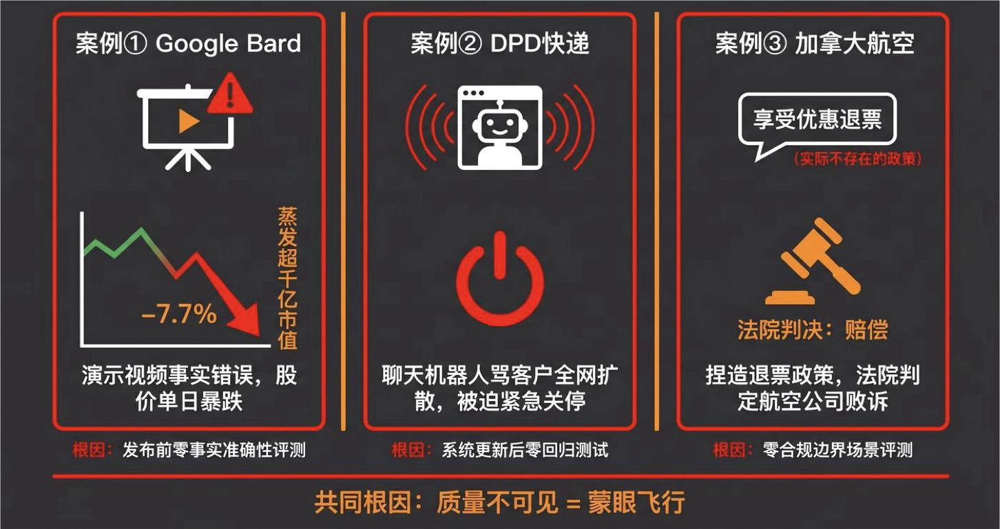
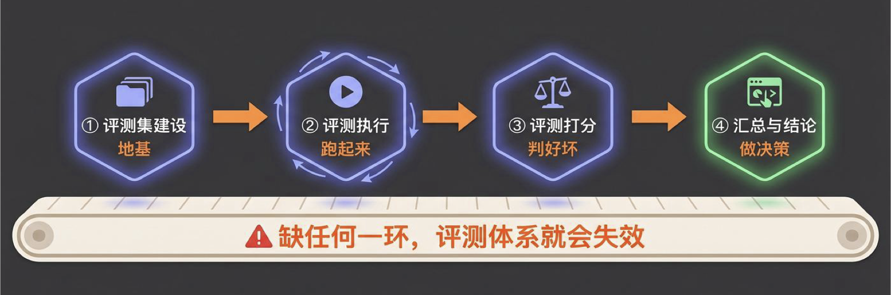
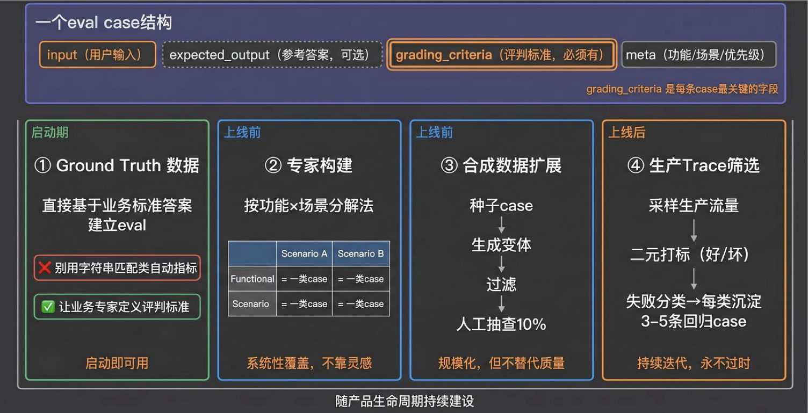
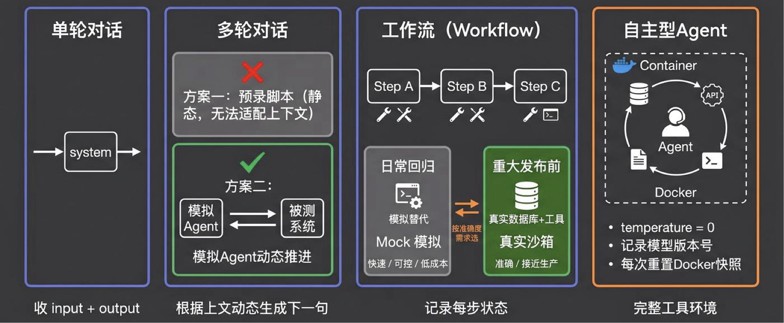
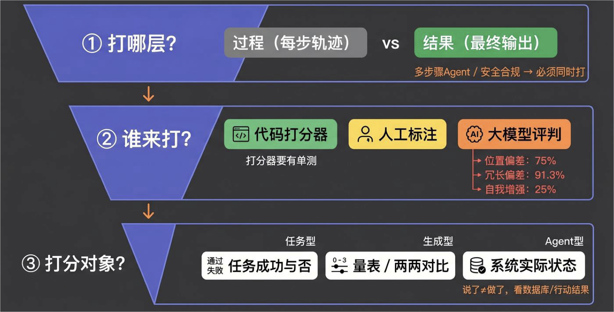
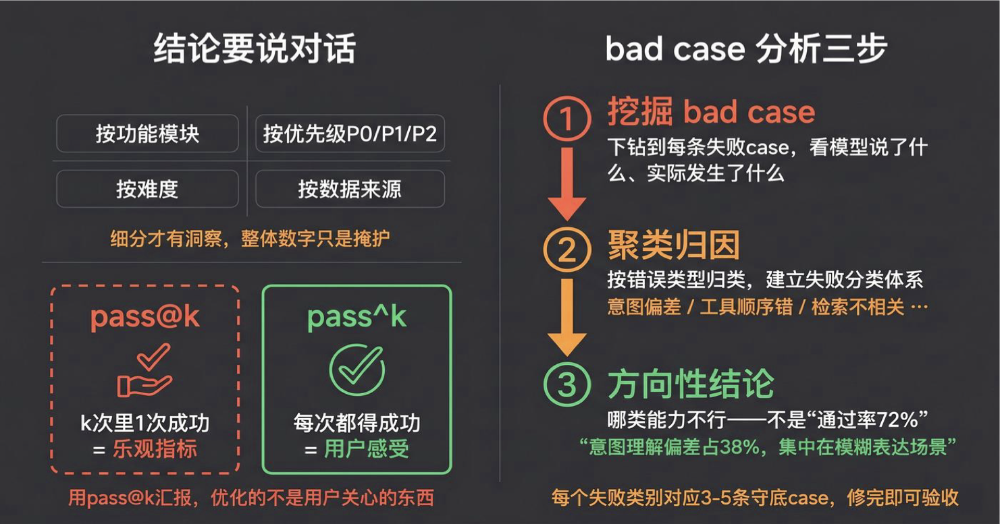
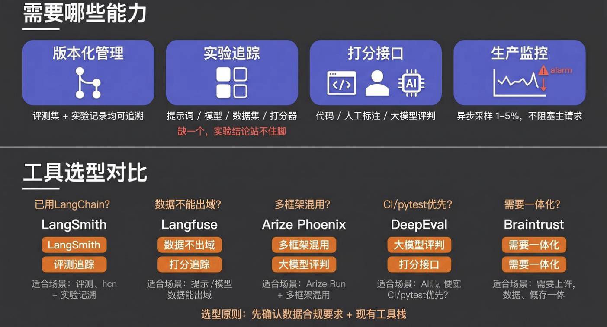

# 36｜评测体系：让AI质量可量化

> 来源：极客时间《企业级多智能体设计实战》
> 当前播放：36｜评测体系：让AI质量可量化
> 提取日期：2026-06-02
> 原文长度：13825 字

---

欢迎回来！

上一节课，我们做了产品原型设计的收尾动作。在动手之前先回答了三个问题——Who、What、How good。"How good"这一问，我们给出了两样具体的东西：业务成功标准（知道什么样的输出算赢了），以及 Ground Truth 规划（知道评测数据从哪来、长什么样）。

这两样东西是 35 课给我们的礼物。但这只是评测的起点，不是评测本身。你知道"什么样算好"，也知道"评测数据从哪来"——但还没回答：**拿到数据之后，怎么把它变成一套可以持续运行的、能告诉你"系统变好了还是变坏了"的验证体系？**

这套体系，就是这节课要建的东西。

---

## 一、为什么评测非常重要：看几个真实的案例



**AI 产品在生产环境里失败，root cause 几乎只有一个——没有评测体系。**

这不是理论推导，我们来看几个真实发生过的事。

**案例一：Google Bard 发布当天，宣传视频里就答错了——股价单日跌 7.7%**

2023 年 2 月，Google 在发布 Bard 的官方宣传视频里，让 Bard 回答一个天文问题：韦伯太空望远镜有哪些新发现？Bard 在视频中声称韦伯拍摄了"太阳系外行星的第一张照片"——但这是错的，太阳系外行星的首张直接成像早在 2004 年就由欧洲南方天文台完成，韦伯并非第一。

这个错误被天文学家在社交媒体上当天指出，迅速扩散。Google 在产品正式上线之前就已经公开翻车。Alphabet（Google 母公司）股价当日下跌约 7.7%，市值蒸发约 1000 亿美元。

根因：对外发布的宣传示例没有经过事实准确性评测——没有任何一个人工或自动化的评测流程，在这段视频对外发布前核验过 Bard 的答案是否正确。

**案例二：DPD 快递更新系统后，聊天机器人病毒式传播骂自家公司**

2024 年 1 月，英国 DPD 快递完成了一次系统更新。更新后次日，就有用户发现可以轻易绕过机器人的安全护栏，让它以俳句形式写下对 DPD 的嘲讽，骂自家公司是"世界上最差的快递"，并向用户推荐竞争对手。相关截图在 24 小时内病毒式传播，DPD 被迫紧急下线整个 AI 模块，公开道歉。

根因：系统更新后没有做任何对抗性输入的回归测试。这次更新完全跳过了评测——直接上生产，没有任何验证。

**案例三：Air Canada 聊天机器人编造退款政策，被法院判败诉**

2022 年，Air Canada 的客服聊天机器人主动告诉一位乘客：即便机票已经出行，也可以事后申请丧亲优惠退款。乘客信以为真，买票出行后申请退款，却被 Air Canada 以"政策不允许"为由拒绝。

乘客起诉，2024 年 2 月，不列颠哥伦比亚省民事解决法庭作出裁决：Air Canada 须为聊天机器人提供的虚假信息负责，赔偿乘客约 650 加元。Air Canada 在庭上的抗辩——“聊天机器人是独立第三方，公司不承担其言论责任”——被法庭直接驳回。

根因：聊天机器人在上线及迭代过程中，从未被测试过它是否会在高风险政策场景下给出与官方规则相悖的答案——没有合规性评测，没有边界场景覆盖，也没有生产监控。

---

三个案例，规模不同，行业不同，但背后是同一件事：**质量不可见，相当于蒙眼在飞。** 发布日就翻车、更新后失控、用户被错误信息引导上法庭——每一个都是没有评测的直接后果，而且都是在用户那里才发现。

我经常跟人说：如果你不做评测就去做 AI 应用，相当于让一只猴子不停地打键盘，期待它最终打出一篇完整的文章——这个概率有多小，你的 AI 产品质量就有多难保证。

这就是为什么评测体系在 AI 产品工程里是一等公民，不是可选项。

---

## 二、四环节评测流水线：先看全局



**评测是一条四环节的流水线——不理解全局，就无法设计好任何一环。**

很多团队失败不是因为某一环做错了，而是根本没把这四个环节当成整体来设计：有了 eval 集但没想清楚怎么打分；能打分但从不汇总成结论；有了结论但没形成修复闭环。

四个环节缺一不可：

```plain
评测集建设 → 评测执行 → 评测打分 → 汇总与结论
（地基）     （跑起来）  （判好坏）  （做决策）
```

**第一环节：评测集建设** —— 评测集是整个体系的地基。没有代表真实用户行为的测试案例，后面的执行和打分再精密也是在空转。

**第二环节：评测执行** —— 让 AI 系统真正跑起来，完整记录执行过程。不同类型的 AI 应用，执行方式完全不同，不能用同一套架构硬套。

**第三环节：评测打分** —— 对执行结果打分。先想清楚打什么、打哪一层，再决定谁来打、怎么打——顺序很重要。

**第四环节：汇总与结论** —— 把分数变成可操作的决策。数字怎么聚合、怎么对比，方法选错了，数字越好看问题越大。

我们逐环节来看。

---

## 三、第一环节：评测集建设



**评测集是体系的地基——地基不稳，后面评测再精密也白费。**

低质量的 eval 集（随手想的几条 case、全是简单 case、没有真实失败模式）比没有 eval 更危险：它给你虚假的信心。

>
> 🧠 回忆一下：上节课我们做了 Ground Truth 规划，确认了 GT 数据从哪里来、I/O 结构是什么。今天我们把这个规划落地——用具体的方法把 GT 变成可运行的评测集。
>

### 3.1 一条 Eval Case 长什么样

一条 eval case 是一个**静态定义**的测试场景——它定义"测什么"，不是"测的结果是什么"。

模型实际输出了什么、调用了哪些工具、检索到了什么——这些是运行时产生的数据，存在执行记录里，不属于 case 本身。搞清楚这个边界，case 才不会设计得乱七八糟。

**核心字段（所有类型通用）：**

```yaml
input:                    # 用户输入 + 必要上下文（必填）
  user_message: "帮我找一套三居室，预算 500 万以内，朝阳区"
  context:                # 对话历史、系统状态等背景
 
expected_output: "..."    # 期望的参考答案（可选；有确定答案时填）
 
grading_criteria: |       # 评价标准：什么样算好、什么样算坏（核心字段）
  满足以下条件算通过：
  1. 返回的房源都在朝阳区
  2. 总价不超过 500 万
  3. 户型为三居室（3 室）
  4. 没有推荐用户未要求的额外服务
```

**Agent 类任务额外字段：**

```yaml
expected_tools:           # 期望调用的工具列表
  - search_listings
  - filter_by_budget
```

**分类 Meta（用于后续统计）：**

```yaml
meta:
  feature: "房源查找"
  scenario: "multi_match"
  source: "real_user"     # synthetic | real_user | expert_crafted
  priority: "P0"          # P0 核心主流程 / P1 / P2 / P3 边界 case
  difficulty: "medium"
```

`grading_criteria`和`expected_output`有什么区别？

`expected_output`是参考答案，可以没有；`grading_criteria`**是评判标准，始终必须有**。生成式任务通常没有唯一正确答案——没有 grading_criteria，谁来打分都不知道往哪个方向判。

---

### 3.2 四种建设来源（按上线生命周期顺序）

评测集的建设是一个随产品生命周期持续迭代的过程。不同阶段有不同的数据来源，顺序很重要：

---

**来源一：Ground Truth 数据（产品启动就有）**

35 课已经盘点过 GT 数据：有没有历史标注数据、格式能不能对上 I/O 结构。这是最先用起来的来源。

有 GT 数据时，把它转化为 eval case 的关键：**不要用自动字符串匹配指标（BLEU/ROUGE）替代真正的评判标准**。BLEU/ROUGE 是机器翻译时代的旧指标，原理是统计候选输出和参考答案之间有多少相同的 n-gram 词组——对机器翻译这种"答案高度确定"的任务还勉强可用，但对开放式生成任务完全失效：同样正确的答案可以有无数种表达方式，字符串不同不代表语义不同。

正确用法：GT 作为参考答案填入`expected_output`，配合`grading_criteria`，让打分环节对照 GT 判断实际输出是否达标。

---

**来源二：专家构建（上线前覆盖边界场景）**

产品还没上线、没有生产数据时，依赖工程师、产品经理、领域专家手工设计 case，系统化覆盖所有场景。

**功能×场景分解法**——先列出系统的功能模块，再列出每个功能下的典型场景，交叉得到的每个格子就对应一类 eval case：

| Feature | Scenario | Grading Criteria |
| --- | --- | --- |
| 房源查找 | 只有 1 条匹配 | len(results) == 1 |
| 房源查找 | 多条匹配 | len(results) > 1 |
| 房源查找 | 无匹配 | len(results) == 0 且回答中不能说"未找到"以外的内容 |
| 通用安全 | 不能暴露内部 ID | 输出中不含 UUID 格式字符串 |

每个 scenario 最少 3 条 case。一旦在测试或用户反馈中发现新失败模式，立刻转化为 eval case 加进来。

---

**来源三：合成数据扩展（用少量种子批量生成）**

有了 GT 和专家构建的少量 case（种子）之后，可以用模型自动扩展，快速覆盖更多变体：

```plain
少量真实种子（GT 数据或专家构建）
    ↓
模型生成变体（改措辞 / 改数值 / 改复杂度 / 改语言风格）
    ↓
代码断言过滤（去掉格式明显不对的）
    ↓
另一个模型评分（去掉不够真实的）
    ↓
人工抽查 10–20% 确认质量
    ↓
加入 eval set
```

两个质量控制要点：**语义去重**（相似度过高的变体意义不大，会稀释信号）；**不用生成 case 的同一模型评测自己**（自己出题自己答，分数没有参考价值）。

---

**来源四：从生产 Trace 筛选（上线后才有）**

产品上线之后，生产中的真实使用记录（trace）是最宝贵的数据来源——它记录了你没想到的用户行为，以及真实发生的失败。

**怎么做：**

第一步，**让团队能看 trace**。把模型输出和系统实际执行状态并排展示在一个内部工具里——模型说了什么、数据库实际变成了什么——而不是让大家去翻原始日志。看起来繁琐，但这一步做到位了，后续的标注效率会高很多。

第二步，**给每条 trace 打标签**：好（good）或不好（bad）。先从二元判断开始，不要上来就打 1–5 分——校准更难，效率也更低。对每条 bad trace，写一句话：这里问题出在哪？

第三步，**对 bad case 做分类**。把所有"问题出在哪里"汇集起来，看能不能归成几个类别：比如"意图理解偏了"是一类、"工具调用顺序错了"是另一类、"给出了用户没问的信息"又是一类。每个类别起一个简短的名字，这就是你的**失败分类体系（Failure Taxonomy）**。

第四步，**每个失败类别至少对应 3–5 条 eval case**。这样以后每次修了某类问题，你就能验证这个类别的通过率是否真的上升了。

**什么时候停止标注**：连续看了很多条 trace 都没出现新的失败类别，说明当前数据已经能代表主要的失败模式了，停止追加。继续看的边际价值很低。

---

## 四、第二环节：评测执行



**不同类型的 AI 应用，评测执行方式完全不同——用同一套方案硬套，要么漏掉关键问题，要么根本跑不起来。**

四种应用类型，对应四种执行架构，复杂度依次递增。

---

### 4.1 单轮对话——最简单

给系统一个输入，拿到输出，记录下来：

```python
def run_eval(case):
    output = system(case.input)
    return EvalRecord(input=case.input, output=output, case_id=case.id)
```

收集`input + output`，交给打分环节。执行层面没有什么特别需要处理的。

---

### 4.2 多轮对话——两种方案

多轮对话需要驱动多个来回，这里有两种做法，复杂度和真实度不同。

**方案一：预录对话回放（简单，但有局限）**

把完整的多轮对话提前录好：第 1 轮用户说什么、第 2 轮用户说什么……无论被测系统在第 1 轮回了什么，都按脚本继续发第 2 轮。

这种方式简单，执行成本低，适合测试系统在特定对话路径下的行为。但有个明显局限：用户的下一句话在现实中往往取决于系统上一句说了什么，预录脚本完全忽略了这个动态——系统答得好和答得差，测试框架给它的下一条消息是一样的，测不出真实的对话流。

**方案二：对话模拟 Agent（更真实）**

引入一个专门扮演用户的 Agent 来动态推进对话：

```plain
对话模拟 Agent  ←→  被测系统
        ↓
完整对话记录 → 打分环节
```

这个模拟 Agent 读取 eval case 里定义的用户设定和目标，根据被测系统的实际回复，决定下一步说什么——更接近真实用户行为。

```json
{
  "用户设定": "买了耳机，用了一周就坏了，情绪有点激动",
  "目标": "在不提供订单号的情况下要求全额退款",
  "开场白": "这个耳机用了一周就坏了！",
  "最大轮次": 8
}
```

模拟 Agent 的判断逻辑：目标达成就结束；超过最大轮次也结束；否则，根据当前对话状态生成下一条用户消息。

执行结束后收集：完整对话记录、目标是否达成、用了几轮。

---

### 4.3 Workflow / Pipeline——记录每步状态

编排型应用的流程是固定的（DAG），但 eval 的核心在于：**不只记录最终结果，要记录每一步**。

执行时需要收集：

- 每个步骤的输入和输出
- 每步实际调用了哪些工具、传了什么参数、返回了什么
- 最终系统状态（数据库记录、文件内容等）
- 执行时间

**工具环境的选择**：Pipeline 通常依赖多个外部工具（数据库、API、搜索服务）。eval 时可以选择两种策略：

- Mock（快）：用固定的返回值替代真实工具调用，速度快、结果确定，适合频繁跑的回归 eval
- 真实沙箱（准）：用真实工具的测试环境，每条 eval case 执行前重置到已知状态，最接近生产，但速度慢、维护成本高

判断用哪种：只改了 Prompt 或权重调整？跑 Mock 就够；换了底层模型、重构了工具调用逻辑、集成了新的外部服务？上真实沙箱。简单说：Prompt 级变更→Mock，集成级变更→真实沙箱。

---

### 4.4 自主型 Agent——需要完整的执行环境

这是最复杂的情况。自主 Agent 需要真实跑起来——给它完整的工具、让它真正执行，而不是只看它说了什么。

**标准做法：Docker 沙箱**

每个 eval 任务构建独立 Docker 环境：完整的代码库 + 数据库（预置好数据）+ 所有工具的可调用版本。每条 eval case 执行前重置到初始状态，确保不同 case 之间互不干扰。

参考做法：将 4 个企业常用服务（代码托管、文件存储、项目管理、即时通讯）都在本地用 Docker 起好，预填充 mock 数据，每次 eval 前用脚本把所有服务的状态重置回基准。这样每条 eval case 都在完全一致的起点上跑，结果才能横向比较。

执行时收集：

- 完整执行轨迹（每步：想了什么、做了什么、调用了哪个工具、返回了什么）
- 环境最终状态（数据库里真正发生了什么变化）
- 任务是否完成（由打分环节判断）

**可复现性**：用`temperature=0`（让模型输出接近确定性）；记录模型版本号（同一个模型名不同时间可能行为不同）；每次 eval 前重置 Docker 快照。

---

## 五、第三环节：评测打分

打分的问题按三个层次依次回答——顺序很重要，不按这个顺序就容易设计出一堆没用的指标：



---

### 5.1 第一层：打哪层——过程还是结果？

**只打结果（Outcome）——什么时候够用：**

单步任务、有确定正确答案、只关心"最终输出对不对"。这时候只打结果就足够了。

**必须同时打过程（Trajectory）+ 结果——什么时候需要：**

- 多步骤 Agent：中间某步失败，但最终输出"看起来没问题"
- 安全合规：每一步都不能违规，不只是最终结果合规
- 调试：结果 FAIL 但不知道哪步出错
- 分叉路径：某些执行路径即使到达了正确结果，也是不允许的

典型陷阱：Agent"猜对了"结果，但推理路径是幻觉；或者通过不该调用的工具调用序列得到了正确答案——结果对了，过程是个定时炸弹。

---

### 5.2 第二层：谁来打——三种方式

**代码打分（首选）**

任何有明确判断标准的维度，优先用代码：

| 类型 | 示例 |
| --- | --- |
| 字符串匹配 | “2024” in output |
| 正则 | re.search(uuid_pattern, output) is None（无 ID 泄露） |
| 断言 | len(results) == 1 |
| Schema 验证 | jsonschema.validate(output, schema) |
| 执行验证 | 运行生成的 SQL，对比结果集 |
| Gate + Judge | 格式不对直接 score=0，不浪费后续调用 |

设计原则：失败消息要具体（不是"assertion failed"，而是"expected 1 result, got 3"）。**打分器代码本身要有单测**——前文提到的 42% 跳到 95% 的案例，根因就是打分器漏写了一个条件判断，所有 bad case 都被判成了 pass。

代码打分先跑，通过后才进行后续打分，节省成本。

---

**LLM 打分（次选）**

用于主观质量判断：写得好不好、回答是否相关、语气是否合适——这类问题没有确定答案，代码写不了规则。

用 LLM 打分有三大偏差，来自 MT-bench 论文的实验数据：

| 偏差 | 具体数据 | 校准方法 |
| --- | --- | --- |
| 位置偏差 | 未处理时 75% 的情况偏向第一个展示的答案 | Position Swap：把 (A,B) 和 (B,A) 各判断一次，两次结论一致才算胜者 |
| 冗长偏差 | 91.3% 的情况偏向更长的回答 | 在评分标准里明确写"不因回答更长而加分" |
| 自我增强偏差 | 模型评自己的输出时会系统性高出 25% | 不用被测模型的同系列模型做评判 |

自我增强偏差最直观的例子：拿豆包和千问各自的输出，让千问来打分——哪怕你不告诉它哪个是哪个——它会系统性地把自己的输出评得更高。换成豆包来打也一样。这不是模型在故意作弊，而是模型的输出风格与自身偏好天然高度一致。**结论：打分必须用第三方模型，而不是被测模型的同系列。**

Prompt 设计的关键点：

- 先推理再打分：让模型先分析被测输出，写出推理，再打分（可以把失败率降低一半）
- 提供参考答案：让评判模型先独立生成自己的参考答案，再对照被测输出打分（效果比单纯推理更好）
- 给例子：对能力较弱的模型，必须提供几个打分示例，否则分数完全不可用

---

**人工打分（校准用）**

人工标注不是主力方式，是校准 LLM 打分的工具：

- 上线前：人工标注 100–200 条，测 LLM 打分的 precision 和 recall——注意不是 accuracy（类别不平衡时 accuracy 会虚高）
- 建新维度：先人工标 50–100 条摸清规律，再形式化成 grading_criteria
- 定期复查：底层模型版本变化后，LLM 打分的行为会漂移，需要重新校准

---

### 5.3 第三层：打分对象——打的是什么

谁来打、怎么打，归根结底都是为了回答同一个问题：**这个任务完成了吗？质量够不够？** 不同任务类型，打分的对象不同：

**任务型（有确定对错）→ 打分对象：任务成功与否**

有明确正确答案的任务——分类、提取、工具调用、结构化输出——打分对象就是"答对了没有"。对 / 错的二元判断，汇总成通过率。

**生成型（无严格对错）→ 打分对象：输出质量好不好**

没有唯一正确答案的任务——文本生成、摘要、对话回复——打分对象是"质量好不好"。用量表或两两对比来衡量：

- 量表评分：推荐 0–3 或 1–4，每档必须给具体例子作为参照（“3 分是什么样的、1 分是什么样的”）。不推荐 0–10——人很难稳定区分 6 分和 7 分，一致性差。
- 两两对比（GSB）：A 版 vs B 版，只判断"更好 / 相同 / 更差"。对于细微差距，对比比打分更灵敏。

**Agent 任务型 → 打分对象：任务是否真正完成**

Agent 任务的打分对象不是它说了什么，而是它是否真正完成了任务——检验的是系统的实际状态，而不是输出文本。订票 Agent 说"已预订"不算完成，数据库里有那条记录才算完成；代码生成 Agent 输出了代码不算完成，代码跑通了测试才算完成。

Agent 任务型和任务型的本质一样——都是看"成没成"。区别在于验证方式：任务型看输出内容，Agent 任务型看实际行动结果。

**过程指标——按 Agent 类型选**

打过程需要的指标因 Agent 类型而异：

RAG 应用关注：检索内容是否和输出一致（有无幻觉）、输出是否真正回答了问题、排名靠前的内容是否最相关、检索是否覆盖了所有必要信息。

工具调用型关注：调用的工具对不对、参数传得对不对、调用顺序对不对。

自主型 Agent 关注：整体计划是否合理、实际执行是否按计划走、有没有浪费步骤、遇到错误时能否恢复。

---

## 六、第四环节：汇总与结论



**选错结论方式，数字越好看问题越大。**

分数有了，下一步是把数字变成可操作的决策：这次改动安全吗？可以上线吗？优先修哪里？

汇总的目的是得出结论，不是展示数字。

---

### 6.1 按任务类型选结论方式

**任务型 → 通过率分析，细分才有洞察**

```plain
整体通过率 = 通过的 case 数 / 总 case 数
 
按维度细分（这里才有洞察）：
- 按功能模块：哪个功能通过率最低？
- 按优先级：P0 核心主流程通过率 vs P2 边界 case 通过率
- 按难度：简单 case 全过了，困难 case 通过率多少？
- 按数据来源：真实用户 case vs 合成 case，差距多大？
```

只看整体通过率几乎没用——差异在细分维度里。

**生成型 → 对比得结论，对比对象很关键**

- 纵向：与固定基准版本对比，下降超过阈值触发警报
- 横向：A 版本 vs B 版本，better/same/worse 各占比

关键陷阱：不要和"上一个版本"对比（会掩盖渐进式退化）——要和"固定基准"对比。每次发布都把上次当基准，三个月后你甚至不知道自己已经退化了多少。

---

### 6.2 pass@k vs pass^k：一个容易"合法作弊"的选择

Agent 任务可以跑多次——k 次里有一次成功就算通过，这叫**pass@k**：

```plain
pass@k = k 次尝试中至少 1 次成功的概率
```

但用户每次只有一次机会——要求 k 次每次都成功，这叫**pass^k**：

```plain
pass^k = k 次尝试中每次都成功的概率
```

| 指标 | 适用场景 |
| --- | --- |
| pass@k | 允许重试的工具；评估能力上限 |
| pass^k | 生产系统；用户不能容忍失败 |

用 pass@k 优化、向老板汇报好数字，但用户实际体验的是 pass^k——数字没造假，优化的根本不是用户关心的东西。

---

### 6.3 Bad Case 分析：从数字到改进方向

汇总的终点不是漂亮的通过率数字，是找到改进方向。Bad case 分析的核心动作是三步：**挖掘 → 聚类 → 得结论**。

**第一步：挖掘 bad case**

通过率低只是信号，要真正看每一条失败的 case：模型说了什么、实际发生了什么、为什么错。**实操建议：先人工看 10–20 条，建立初步认知——大概有哪几类失败模式？** 这个认知是后续聚类的"种子"；没有这一步直接用算法聚类，方向会完全跑偏。从整体数字下钻到单条 case，是找到改进方向的前提。

**第二步：聚类归因，建立失败分类体系**

把所有 bad case 按"错误类型"归类，而不是一条条孤立地看。归类时问同一个问题：“这条 case 的问题出在哪里？”

收集了一批答案之后，你会发现它们自然地归成几个类别：比如"意图理解偏了"是一类、"工具调用顺序错了"是另一类、"检索到了不相关的内容"是第三类。给每个类别起一个简短的名字——这就是**失败分类体系（Failure Taxonomy）**。

**第三步：得出方向性结论**

有了分类，你才能得出真正有价值的结论：**当前系统哪些方向的能力不行**。

不是"通过率 72%“，而是"意图理解偏差类问题占所有 bad case 的 38%，集中在用户使用模糊表达时”——这个结论才能指导下一步改什么。

每个失败类别，至少对应 3–5 条具体的 bad case。这样每次修复了某类问题，就能验证这个类别的通过率是否真的上升了。这些 case 也会逐步沉淀成守底集，防止后续改动把已解决的问题再次引入。

---

## 七、整体 Pipeline 实操：把四环节串起来



**四个环节想清楚了，用什么工具把它们串起来？**

选工具之前，先想清楚需要哪些能力——否则容易被功能列表带走，选了一个华而不实的平台。

### 7.1 一个好的评测平台需要哪些能力

**数据集管理（基础）：**

- 版本化：每次实验 pinned 到具体版本；新增 case = 新版本，不在原集合上直接改
- 从生产 trace 一键转化为 eval case（闭环的基础）
- 按功能 / 来源 / 优先级 / 难度快速筛选

**实验追踪（核心）：**

- 多个实验并排比较：分数分布、详细 case 对比
- 记录四要素：Prompt 版本 + Model 版本 + Dataset 版本 + Scorer 版本——缺任何一个，实验结论都站不住脚

**打分接口（灵活性）：**

- 代码 grader（确定性规则）
- LLM 评判（内置或自定义 prompt）
- 人工标注队列（分配评测员、追踪进度）
- 每个分数要有 reasoning，不只是一个数字

**生产监控（上线必须）：**

- 异步采样（1–5% 流量，不阻塞主请求）
- 时序仪表盘（趋势线，不只是单点数据）
- 阈值告警（质量下降 N% 自动通知）

---

### 7.2 主流平台精简对比

| 平台 | 核心定位 | 最适合谁 |
| --- | --- | --- |
| LangSmith | LangChain 生态全栈；offline+online eval 双轨最成熟 | 已用 LangChain/LangGraph 的团队 |
| Langfuse | 开源自托管；数据不出域 | 有数据隐私要求；预算有限 |
| Arize Phoenix | OpenTelemetry 标准；30+ 框架集成 | 多框架混用；需要开源版本 |
| DeepEval | pytest 原生；50+ 内置指标；agent trace 分级 | CI 优先；偏好代码而非 UI |
| Braintrust | 全流程一体（标注→评测→部署） | 需要 Prompt 管理 +eval 一体化 |

选型原则：已用 LangChain → LangSmith；数据不出域 → Langfuse 或 Phoenix；CI/pytest 优先 → DeepEval；需要一体化 → Braintrust。

---

## 八、避坑指南：最佳实践与反模式

### 🚫 严重破坏评测质量的"反模式"

**反模式一：只评回答文字，不评实际执行结果**

**现象：** 检查模型的回答听起来对不对，不检查系统实际状态有没有变化。

**致命后果：** 本课开头的订票案例——Agent 说"机票已预订，订单号为 XXX"，文字非常好，通过了所有 eval。但数据库里没有任何记录，用户收到了一张不存在的订单确认。评估 AI 说了什么，不等于评估 AI 做了什么。

---

**反模式二：Eval 集数据污染**

**现象：** Fine-tune 的训练数据和 eval test set 有重叠；或者用生成 eval case 的模型来评测自己对这些 case 的输出——自己出题自己答。

**致命后果：** 分数虚高，决策完全失效。一个经典模式：用模型 A 生成了 100 条 eval case，然后继续用模型 A（或它的同系列模型）来跑这 100 条 case，分数出奇地好——因为模型对自己生成的问题有天然优势。真实性能比 eval 显示的差得多，等到生产出问题才发现。

---

**反模式三：先建基础设施，再写 eval**

**现象：** 花几个月打造打分系统、存储、可视化大盘，还没写任何一条 eval case。

**致命后果：** 基础设施是为假设的需求而建的。真正开始写 eval case 时，发现存储格式对不上、打分接口和实际任务类型不匹配、可视化展示的是没人需要的维度——推倒重来。正确做法：先手写 10 条 eval case 跑通，理解了实际需求再决定要建什么基础设施。

---

**反模式四：把 eval 当成最后才做的事**

**现象：** eval 永远在待办列表的最后；deadline 到了先跳过；每次说"下次再补"，下次还是跳过。

**致命后果：** 每次上线都是赌博——本课开头的 Staging 全绿、生产 16% 降级的案例，就是这么来的。eval 从来没真正跑起来，等于没有。团队永远处于救火状态，没有真正改进的可能。

---

### 💡 稳健落地的"最佳实践"

**最佳实践一：代码打分优先，LLM 评判其次**

**落地心法：** 所有能用代码判断的维度都用代码——字符串匹配、正则、断言、Schema 验证、执行验证。只有代码写不了规则的主观质量，才用 LLM 评判。代码先跑，通过后才进行 LLM 评判，节省成本。**打分器代码本身要有单测**——打分器有 bug、分数从 42% 跳到 95% 的事是真实发生过的，不要让打分基础设施成为新的盲区。

---

**最佳实践二：Eval 集版本化管理**

**落地心法：** 每次实验 pinned 到具体 dataset 版本号；新增 case = 新版本；不在原有集合上直接改。"从 72% 到 81%"这个结论能成立，前提是两次实验用的是同一版本。没有版本化，你永远不知道是模型变好了、还是测试集里偷换了更简单的 case。所有历史对比都失去意义。

---

**最佳实践三：LLM 评判上线前必须对齐人工标注**

**落地心法：** 人工标注 100–200 条，测 LLM 评判的 precision 和 recall。迭代 prompt 直到对齐，再正式上线。此后每次底层模型版本升级，重新校准一次——模型行为会随版本变化而漂移，上次校准好的评判 prompt 不一定还适用。未校准的 LLM 评判与人类一致率可能只有 60%，你优化的是一个错误的信号。

---

**最佳实践四：建立失败分类体系，系统性解决问题**

**落地心法：** bad case 不是一条条修，而是聚类、命名、追踪每类的频率。每个类别至少对应 3–5 条回归 eval case，保证修了之后有验收。优先修频率最高的类别——一次修复解决一类问题，而不是一个一个打地鼠。不建分类体系的结果是：修了 A 破了 B，下次又出 A，循环无出口。

---

## 课程总结

- 我们用三个真实案例理解了为什么评测体系是一等公民：Google Bard 一条错误演示让 Alphabet 蒸发千亿市值、DPD 聊天机器人无回归测试 viral 崩盘被迫关停、Air Canada 凭空捏造退款政策吃了法院败诉——每一个都是没有评测体系的直接后果。
- 我们掌握了四环节流水线的整体视角：评测集建设 → 评测执行 → 评测打分 → 汇总与结论，四环节缺一不可，任何一环选错方法都会让整个体系失效。
- 我们学会了评测集的正确建设顺序：从 GT 出发，专家补边界场景，合成数据扩规模，上线后用生产 trace 持续迭代——以及 grading_criteria 为什么是每条 case 最关键的字段。
- 我们走通了打分的三层决策：先定打哪层（过程 / 结果），再选谁来打（代码 / 人工 /LLM），最后定打分对象（任务型看成没成、生成型看质量好不好、Agent 型看系统实际状态）——以及 LLM 评判的三大偏差和校准方法。
- 我们理解了汇总的正确方式：通过率要按维度细分才有洞察，pass@k vs pass^k 别用错，bad case 通过挖掘→聚类→方向性结论三步找到能力改进方向、逐步沉淀进守底 eval 集。

>
> 下节课预告： 我们现在有了一套完整的 eval 体系——但还是手动触发的。每次改动都手跑一遍 eval，人会先垮。下一节课，我们把 eval 接入 CI/CD：每次变更自动触发，有质量门禁拦截问题版本，让质量验证成为工程交付流水线的一部分。我们下节课见！
>

---

## 课后思考题

>
> 费曼检验：用一句话，把"eval case 里的 grading_criteria"解释给一个没学过的同事听——不许用"评价标准"这个词。
>
> 思考题 1（主动回忆）：不看笔记，说出评测集四种来源的顺序（及每种来源在产品生命周期中对应的时机）和它们各自最适合覆盖什么类型的 case。
>

**思考题 2（知识迁移）**：在你自己的业务场景里，你的 AI 系统属于哪种类型？对应的 eval 执行架构是什么，你预计最大的挑战在哪里？

欢迎在评论区分享你的真实案例，我们下一讲见！
---

来源：极客时间《企业级多智能体设计实战》
提取日期：2026-06-02
