# 37｜持续集成：让 AI 应用稳定演进

> 来源：极客时间《企业级多智能体设计实战》
> 当前播放：37｜持续集成：让 AI 应用稳定演进
> 提取日期：2026-06-02
> 原文长度：15248 字

---

欢迎回来！

上一节课，我们系统地建设了 AI 应用的评测体系——四个环节，从评测集建设到汇总与结论，知道了怎么衡量 AI 应用的质量。最后，我们把失败的 case 转化成了回归 eval case，沉淀进了守底集。36 课的最后一行写着：**“CI 自动防止此类 case 回归（下节课讲）”**。

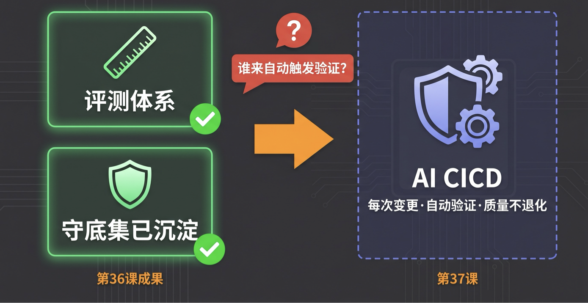

下节课到了。

但在正式开始之前，我想先抛一个问题：你有没有遇到过这种感觉——明明这周改了点东西，感觉效果应该更好，但怎么验证呢？改了 Prompt 测几条，感觉不错，上线。然后三天后用户反馈变多了，翻日志，不知道是哪次改动出了问题。找人问，每个人都说"我这边没问题"。

这不是 eval 建没建好的问题，这是**变更管理**的问题。

这节课，我们要解决的就是这个问题：让 AI 应用的每一次变更，都经过自动化的质量验证，而不是凭感觉上线。

---

## 一、认知原点：AI CICD 的本质到底是什么？

**AI CICD 的本质，就是为 AI 应用的每一次"变更"安装一套自动化的质量护栏。**

传统软件工程里的 CI/CD（持续集成 / 持续交付），是这样运作的：你改了代码，提交 PR，自动跑测试，通过了才能合并，合并后自动部署。这套机制解决的核心问题是：**代码变更的质量能否被自动验证**。

AI 应用面对同样的问题，但难度大了一个量级。难在哪里？

难在**变更的来源不只是代码**。改了一个 Prompt，AI 应用的表现可能完全不同；模型提供商悄悄更新了模型版本，你什么都没动，效果却变了；知识库添加了一批文档，RAG 的检索质量改变了。这些变更都会影响 AI 应用的表现，但传统 CI/CD 对它们完全是盲区。

更难在**质量标准不是二元的**。传统软件测试结果非黑即白：代码跑起来就是通过，跑崩就是失败。AI 应用的质量是概率分布：今天回答对了 85% 的问题，明天因为一个 Prompt 调整变成了 78%——它没有"崩"，但它在退化。这种退化，如果没有专门的机制，根本发现不了。

所以，AI CICD 要解决的不是"代码对不对"，而是：**AI 应用在不断迭代（离线开发）和持续演进（线上运行）的过程中，如何自动、稳定地维护系统的质量不退化、成本不爆炸、安全不失守。**

---

## 二、为什么需要它：没有 AI CICD 的代价

理论先放一放，我们先看几个真实发生过的案例。

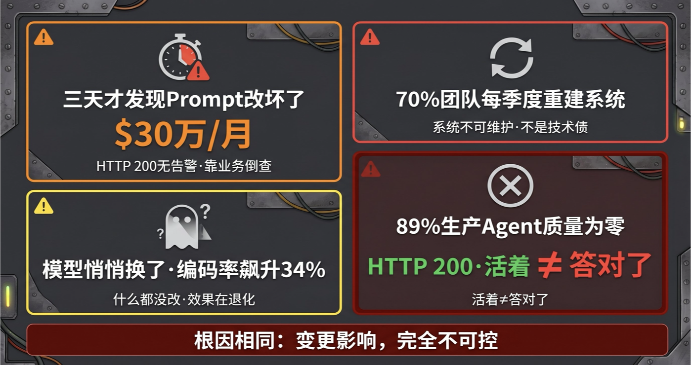

**案例一：三天后才发现，问题早就存在了**

一个月 API 消耗达到 30 万美元的团队，在某次 Prompt 调整之后，“某些任务连续几天返回无用结果”——系统没有崩溃，HTTP 状态码全是 200，运维监控没有任何告警。等到他们发现问题，是因为下游业务指标出现了异常。三天的问题，没有任何工程系统能告诉他们是哪次改动造成的。

**案例二：70% 的 AI 团队每季度重建一次系统**

这是 2026 年 AI 工程社区里被转发最多的一段话："你的团队上周发布了三个改动——新的系统 Prompt、模型升级、temperature 调整。用户抱怨 Agent 变差了。是哪个改动造成的？你不知道，没有人知道。因为这三个改动同时上线，没有对照组，没有版本隔离，没有变更记录。"结果就是：70% 的 AI 团队每个季度都在推倒重建，而不是在现有基础上持续改进。重建不是因为技术债，是因为**系统已经不可维护了**——没有人知道哪个版本是好的，也没有人知道到底坏在哪里。

**案例三：OpenAI 悄悄更新了模型，没有人知道**

2024 年 4 月，OpenAI 在没有任何公告的情况下，悄悄替换了`gpt-4-turbo`这个别名背后指向的模型版本。使用 aider（一个有自动化回归测试的 AI 编程工具）的团队，在几个小时内就检测到了"懒惰编码率"从正常水平飙升到 34%——代码编辑质量出现了明显退化。没有自动化回归测试的团队完全不知道这件事的发生。他们的 Prompt 还在运行，语法上没有错误，但代码质量在悄悄下滑。

**案例四：89% 的生产 AI Agent，质量检测得了 0 分**

2026 年 3 月，一份对 6259 个生产 AI Agent 的大规模审计报告显示：89.2% 的 Agent 在质量评测中得分为零——不是低于平均，是零。

这里需要澄清一个容易困惑的点：“有用户在用"和"质量得 0 分"并不矛盾。这些 Agent 仍然在正常返回 HTTP 200——系统没有崩溃，接口通着，所以用户还在发请求。但请求的响应内容是错的：Agent 调用了错误的工具，给出了误导性的答案，或者任务只执行了一半就停止了。传统运维监控只看"系统活没活”，HTTP 200 就是绿灯，不会告警。但**"活着"和"答对了"是两件完全不同的事**——系统活着、一直在输出，但输出的内容全是错的。这种情况，唯一能发现问题的，是专门的自动化质量评测。

---

四个案例，不同的公司，不同的技术栈，但暴露的是同一个问题：**AI 应用在迭代过程中，变更对系统表现的影响完全不可控。**

要注意，这和"有没有 eval"不是同一个问题。36 课建的 eval 体系，解决的是"怎么衡量质量"。今天这节课要解决的是：**每次变更的时候，这套衡量机制是否自动运行，并且自动拦截质量退化的版本。**

这就是 AI 应用 CI/CD 要做的事。

---

## 三、AI CICD 全景：三块结构

在深入细节之前，先建立整体认知。AI CICD 的全景可以用三块来理解：

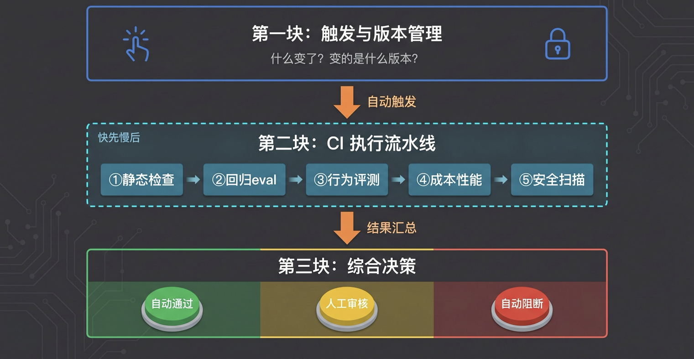

三块顺序执行：先确认"这次变更是什么、版本是什么"，再走流水线自动验证，最后根据验证结果做出决策。

接下来逐块展开。

---

## 四、第一块：触发与版本管理

### 4.1 触发对象：从 1 个扩展到 6 个

传统 CI/CD 的触发器只有一个：**代码 PR**。逻辑简单——代码变了，测试一跑，对不对立刻见分晓。

AI 应用有六类变更都会影响系统表现，每一类都需要触发对应的验证：

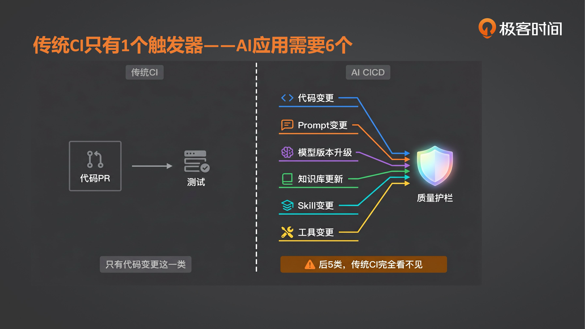

| 触发类型 | 什么变了 | 为什么会影响效果 |
| --- | --- | --- |
| 代码变更 | 工具逻辑、编排流程、API 接口 | 功能行为直接改变 |
| Prompt 变更 | 系统 Prompt、格式要求、角色设定 | 模型输出质量和风格改变 |
| 模型版本升级 | gpt-4o→4.1，Claude 3.5→3.7 | 所有输出行为都可能漂移 |
| 知识库更新 | 文档增删、向量索引重建 | 检索内容和质量改变 |
| Skill 变更 | 工具的调用逻辑、参数格式 | Agent 行为路径改变 |
| 工具变更 | 外部 API 接口、返回格式 | Agent 执行结果改变 |

传统 CI/CD 对后 5 类完全是盲区。这就是为什么大量 AI 团队"代码 CI 跑得好好的，但系统质量在退化"——他们的 CI 根本没有覆盖到真正在变的东西。

六类触发器，对应六类不同的验证逻辑。代码变更跑功能测试，Prompt 变更跑语义质量回归，模型升级跑全量 eval 套件，知识库更新跑 RAG 质量评测，Skill 和工具变更跑行为路径测试。**不同的变更类型，不能用同一套流水线硬套。**

---

### 4.2 版本一致性：六维快照

每次 CI 运行，都需要回答一个核心问题：**“这次 eval 跑的是哪个版本组合？”**

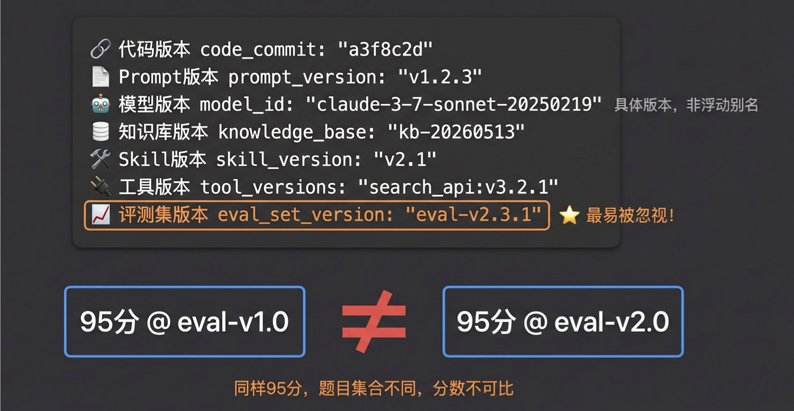

传统 CI 只需要追踪代码版本（git commit hash）。AI 应用需要在七个维度同时锁定版本：

```yaml
run_snapshot:
  code_commit:      "a3f8c2d"           # git commit hash
  prompt_version:   "v1.2.3"            # Prompt 管理系统里的版本号
  model_id:         "claude-3-7-sonnet-20250219"  # 必须是具体快照，不能用浮动别名
  knowledge_base:   "kb-20260513-1423"  # 知识库的时间戳快照
  skill_version:    "skill-set-v2.1"    # Skill 集合版本
  tool_versions:
    search_api:     "v3.2.1"
    crm_api:        "v1.8.0"
  eval_set_version: "eval-v2.3.1"       # 评测集版本——缺少这一维，CI 结果无法跨 run 对比
```

七个维度里，**知识库版本是最难落地的一个**——知识工程做法差异大，有的团队用时间戳快照，有的用文档哈希，但不管用什么方式，必须要有、必须管理起来。忽视它的代价是：一旦任何维度的版本没锁定，整个 CI 跑的结果就是在**瞎跑**——结论完全不可信，跟没跑没区别。

为什么这么重要？CI 的核心价值是**可重复性**——同样的变更，今天跑和明天跑应该得到可比较的结果。如果七个维度里有任何一个没锁定，今天的 CI 结论和昨天的 CI 结论就失去了可比性，退化检测就会失效。

其中`eval_set_version`是最容易被忽视的一维。评测集本身也在演进——每次生产事故后加了新 case，清理了重复 case，调整了 case 的权重。如果不锁定评测集版本，今天的 95 分和昨天的 95 分可能是在**不同的题目集合**上得的，这两个分数完全不可比。CI/CD 的核心逻辑——“这次变更让系统变好了还是变差了”——失去了成立的前提。

这里有一个特别容易踩的坑：**模型别名的浮动问题**。很多团队调用 API 时用的是`gpt-4o`这样的浮动别名，而不是`gpt-4o-2024-08-06`这样的具体版本号。模型提供商会在没有通知的情况下更新这些别名背后指向的模型——你什么都没改，但上周的 CI 结论和今天的 CI 结论实际上跑的是两个不同的模型。

**一条强制规则：生产和 CI 里调用的模型必须使用具体版本号，永远不用浮动别名。**

---

## 五、第二块：CI 执行流水线

**设计原则：快的先跑，慢的后跑；前面失败立刻停止，不浪费后续成本。**

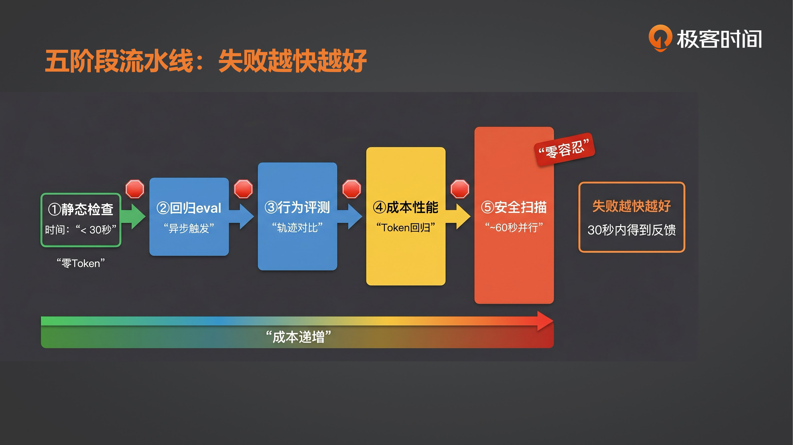

五个阶段按这个原则排序。每个阶段结束后，只有通过才进入下一个阶段；失败则立刻终止流水线，生成失败报告。

---

### 阶段①：静态规则检查

**目标**：在不调用任何模型的情况下，用秒级时间拦截所有可以用规则判断的配置错误和格式问题。

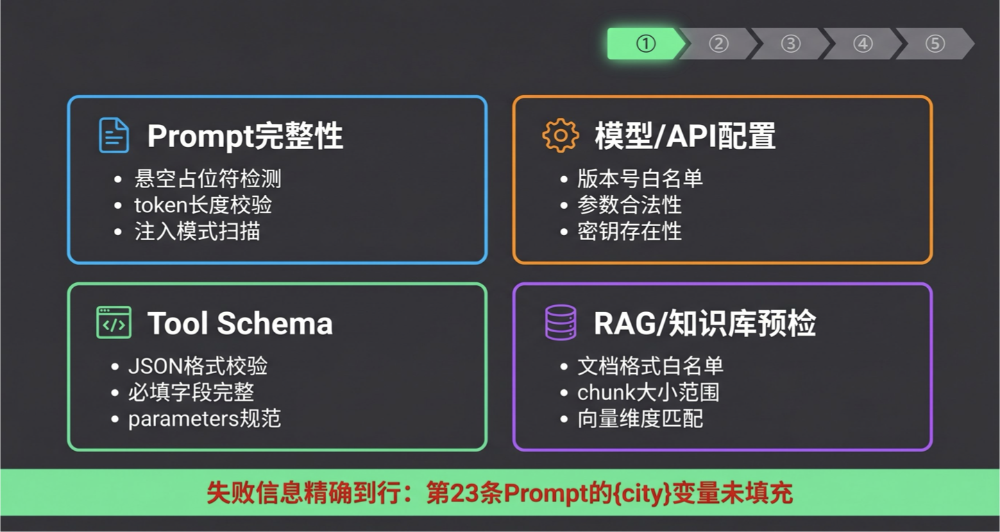

这是流水线成本最低的一关，应该能拦截掉大量低级错误——模板变量没填、模型名称写错、工具 Schema 格式不对、Prompt 长度超了限制……这些错误让 LLM 调用来发现，既浪费 token 又慢，静态规则检查全部在本地完成，速度在 30 秒以内。

**检查范围包括四类：**

**Prompt 完整性检查**：模板变量是否全部解析（有没有`{user_query}`这样的悬空占位符）；token 长度是否在模型上下文限制以内（本地计算）；是否包含会触发注入攻击的禁止模式（用 48 条正则规则扫描，<1ms 完成）。

**模型和 API 配置检查**：模型名称是否在白名单内（只允许已知的具体版本号，拒绝浮动别名和未知字符串）；temperature、top_p、max_tokens 等参数是否在合法范围内；API 密钥环境变量是否存在（快速失败，避免后续所有调用报认证错误）。

**Agent 工具 Schema 检查**：每个工具定义的 JSON Schema 格式是否正确；必填字段（`name`、`description`、`parameters`）是否都在；`parameters`是否符合 JSON Schema 规范。

**知识库和 RAG 预检**：文档格式是否在白名单内（PDF、纯文本、Markdown）；chunk 大小是否在配置范围内；每条 chunk 的元数据是否完整；向量维度和索引维度是否匹配。

>
> 这一阶段不需要任何网络调用。30 秒通过就进入下一阶段，失败则把具体的错误信息反馈给提交者：不是"检查失败"，而是"第 23 条 Prompt 模板里的{city}变量没有被填充"。
>

---

### 阶段②：可用性回归评测集

>
> 🧠 回忆一下：上节课的最后，我们讲到"bad case 必须转化为回归 eval case"，沉淀进守底集，靠 CI 防止此类 case 回归。今天，这个守底集就在这里登场了。
>
> 这是流水线里最核心的一关。回归评测集不是完整的 eval 套件，而是从完整 eval 套件中精心提取的子集——小到能在每次 PR 触发时跑完，代表性强到能发现真实的质量退化。
>

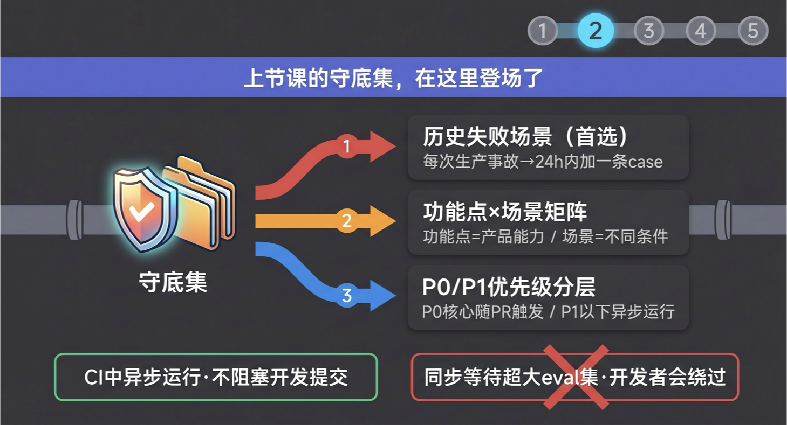

**回归集的定义**：把所有历史上发现的失败模式转化成可自动运行的 eval case，每次变更都自动验证这些底线没有被打破。每次有新的生产事故或用户反馈揭示了新的失败场景，就往回归集里加一条 case。这个集合只增长，不轻易减少——它记录了这个系统所有踩过的坑。

**从完整 eval 套件提取回归集的方法**：

_方法一：来自真实失败场景（首选）_

在历史上真实失败过的 case，优先进入回归集。"模型在这种输入上挣扎过"是进入回归集最强的信号。每次生产事故结案后的 24 小时内，必须有一条对应的回归 eval case 加入集合。

_方法二：功能点×场景覆盖矩阵_

先解释两个概念：**功能点（Feature）**是产品的一个具体能力，比如"订单查询"、“退款申请”、“商品推荐”；**场景（Scenario）**是同一功能在不同输入条件下的表现，比如"正常订单查询"、“跨境订单查询”、“订单号格式错误时的查询”，同一个功能点可以有许多个场景。

把所有功能点×场景的组合列出来，就是一张矩阵。矩阵的目标是确保每个"功能×场景"组合都有代表性 case 覆盖，而不是某一个场景被过度覆盖（比如 90% 的 case 都在测"正常查询"这一种场景）。每个组合最多一条代表性 case。用 embedding 相似度去重，防止回归集里 75% 的 case 都在测同一件事的不同说法。

_方法三：按优先级分层运行_

P0 核心主流程 + P1 重要功能：随 PR 异步触发，不阻塞开发提交。P2 边界 case：每日定时跑。完整 eval 套件（500—5000 条）：按大版本发布计划运行。

**异步设计是关键**：回归 eval 不应成为 PR 的同步卡点。CI 中，P0/P1 回归集在 PR 提交后异步启动，失败时发通知、在 MR 页面标注——而不是同步等待通过才允许提交。强制同步等待大规模 LLM eval 集，工程师会绕过 CI，等于没有 CI。

**对自动化的严格要求**：

回归集里的每一条 case，在 CI 运行时必须能完全自动得出 pass/fail 结论，不需要任何人工判断介入。具体要求：

- 代码断言优先：字符串匹配、正则、Schema 验证、工具调用顺序断言
- LLM 评判辅助：只用于确实无法用代码判断的主观质量维度，且必须是已通过人工标注校准（agreement > 85%）的评判 Prompt
- 每条 case 必须有明确的二元 pass/fail 判断，不是"分数多少"，而是"过还是没过"

如果一条 case 需要人工在线判断才能得出结论，它不应该在回归集里，而应该放在"人工审核"这一档触发时才查看。

---

### 阶段③：行为模式评测集

输出 eval 告诉你"结果对不对"，行为评测告诉你"过程对不对"。这两个维度发现的问题完全不同，缺一不可。

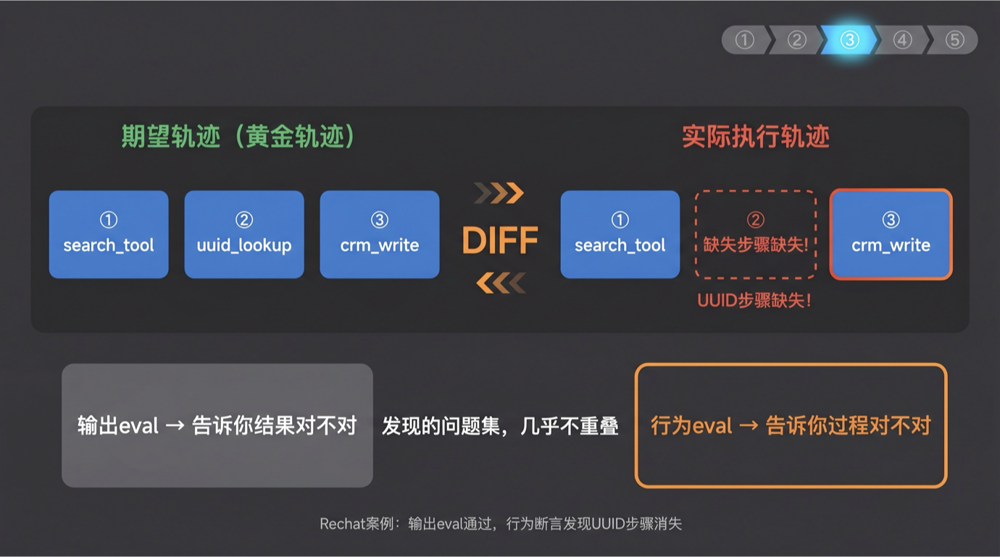

**为什么必须有专门的行为评测？**

有一个真实案例能说明问题：Rechat 的 AI 助手在一次 Prompt 更新后，停止了在 CRM 写入前先查询 UUID 的步骤。最终输出看起来正确（写入成功了，因为 UUID 恰好在上下文里），但工具调用顺序已经被打乱——在 UUID 不在上下文的情况下，这个行为会导致生产故障。输出 eval 全部通过，是专门的工具调用顺序断言发现了问题。

还有另一个来自学术研究的案例：GPT-4o 的零售 Agent 在单次运行时通过率约 50%，看起来还行。但如果要求"连续 8 次运行都成功"（pass^8），实际通过率低于 25%。输出 eval 掩盖了行为的不稳定性——用户每次只有一次机会，不是 8 次里中 1 次。

**行为评测关注什么：**

| 指标 | 评测什么 |
| --- | --- |
| 工具存在性 | 该调用的工具是否被调用了 |
| 工具顺序 | 工具调用顺序是否正确 |
| 工具参数 | 传入工具的参数是否合法 |
| 步骤数量 | 完成任务的步骤数在合理范围内 |
| pass^k 一致性 | 相同输入 k 次运行，行为是否稳定 |
| 系统终态 | 数据库 / 文件系统的最终状态是否符合预期 |

**如何建设行为评测集：**

把 Agent 能力拆解为功能点×场景矩阵（功能点 = 产品能力，场景 = 同一功能的不同条件），对每个场景用当前被认为正确的版本运行，记录"黄金轨迹"——工具调用名称、顺序、频次。把黄金轨迹转化成代码断言：工具名称集合对比、调用顺序验证、步骤数上下限。每次 CI 跑时，与黄金轨迹做 diff：

```plain
期望轨迹（黄金）：  ① search_tool  →  ② uuid_lookup  →  ③ crm_write
实际执行轨迹：      ① search_tool  →  [② 缺失！]      →  ③ crm_write
                                        ^^^^^^^^^^^^^^^^
                                        DIFF：步骤②未执行
```

这就是 Rechat 案例的情形：`crm_write`看起来成功了（UUID 恰好在上下文里），输出 eval 完全通过，但黄金轨迹断言在②处立刻报错。

这种评测最适合做行为漂移检测——当模型升级或 Prompt 调整之后，Agent 的行为路径有没有发生非预期的变化。

---

### 阶段④：成本与性能评测

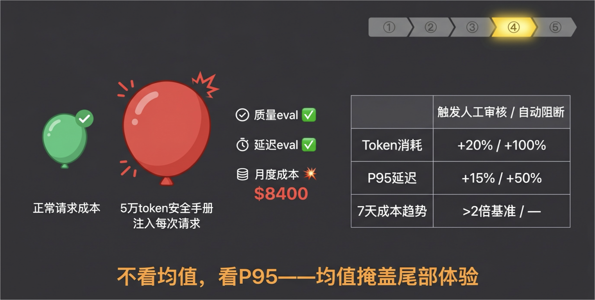

**Token bloat（token 膨胀）是 AI 应用里最隐蔽的退化类型**：系统运行正常，输出质量没有明显下滑，但每次请求的 token 消耗悄悄翻倍了。

一个真实案例：一个 PR 评测 Agent 的某个中间步骤，把一份 5 万 token 的安全手册注入到每个请求里。质量 eval 正常，延迟 eval 正常，但月度 API 费用直接到了 8400 美元。是成本逐步骤归因分析（不是看总量，是看每个步骤分别消耗了多少）发现的，不是任何质量指标。

**成本评测的核心指标：**

- 每次请求的 Token 消耗（分拆：输入 / 输出 / 缓存命中 / 推理 token，不能只看总量）
- 每个流水线步骤的成本分布（哪个步骤消耗了 90%？）
- 每次完整任务的端到端成本

**延迟评测的核心指标：**

- TTFT（Time to First Token，首字延迟）：实时交互应用的关键体验指标
- P95 端到端延迟：不看均值，均值会掩盖尾部体验

**回归检测的阈值参考：**

| 指标 | 触发人工审核 | 触发自动阻断 |
| --- | --- | --- |
| Token 消耗增加 | +20% | +100% |
| P95 延迟增加 | +15% | +50% |
| 7 天成本趋势 | 超过 2 倍基准 | — |

成本评测集使用固定长度的确定性输入（匹配生产流量的输入分布），全部用代码断言，零 token 额外消耗。

---

>
> 📷 【图 · Slide 12】 [实际图片] 5 类攻击（直接 Prompt 注入 / 越狱 DAN·角色扮演 /PII 泄露跨会话·提取系统 Prompt/ 工具滥用权限升级 /间接注入 RAG 场景特有[橙色标注]）；两工具（garak 开源 840+ 探针覆盖通用漏洞 / promptfoo 开源 50+ 漏洞插件场景定制·输出 JUnit XML）；底标"不需手工构造越狱句——工具已有完整攻击案例库"
>

### 阶段⑤：安全扫描评测集

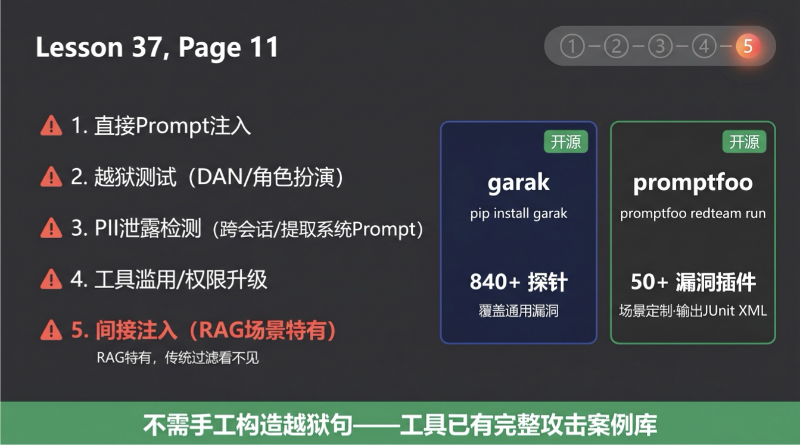

安全测试是 CI 流水线里**唯一一个零容忍维度**——一条失败就阻断，不存在"大部分通过就行"。

**需要覆盖的五类攻击：**

**直接 Prompt 注入**：预置 200+ 攻击模板（标准注入、角色覆盖、指令分隔符滥用、Base64 编码绕过、Unicode 隐藏字符），对系统发起攻击，验证系统能否正确拒绝。

**越狱测试**：DAN 系列变体、多轮升级式绕过、角色扮演框架。使用专门的攻击模型自动生成应用场景特定的越狱变体，覆盖手工案例库覆盖不到的盲区。

**PII 泄露检测**：跨会话泄露测试（会话 A 的用户信息是否泄露到会话 B）；系统 Prompt 提取攻击（用户能否获取系统 Prompt 内容）；输出中不应出现的 UUID、内部 ID。

**工具滥用 / 权限升级**：工具调用是否被操控到越权操作；对 Agent 系统，是否能通过注入让 Agent 执行攻击者的指令。

**间接 Prompt 注入（RAG 场景特有）**：从知识库检索出来的文档内容中嵌入攻击指令，验证系统是否会执行。这是 RAG 应用特有的安全向量，传统输入过滤完全覆盖不到。

**安全测试集的建设方式**：以 OWASP LLM Top 10 为骨架，手工编写 30-100 条针对具体应用场景和工具集的"黄金攻击案例"，再用开源工具自动扩展变体——不需要手工构造越狱句和注入字符串，这两个工具已经有了完整的攻击案例库：

- garak（NVIDIA 开源，pip install garak）：840+ 探针，覆盖提示注入、越狱、幻觉、PII 提取、毒性输出等类别；通过 CLI 对目标应用发起系统扫描，输出 JSONL 报告，可对接 CI；一行命令就能跑完针对某类漏洞的全套探针。
- promptfoo（开源，npm install -g promptfoo 后运行 promptfoo redteam run）：50+ 漏洞插件，支持针对具体应用场景和系统 Prompt 定制攻击集；GitLab CI / GitHub Actions 原生集成；输出 JUnit XML，CI 可直接解析并展示失败 case。

实践建议：用 garak 跑通用模型安全探针，用 promptfoo 针对你的应用场景定制 red team 套件。两个工具互补，都完全开源、可自托管，不需要把测试流量发送到境外服务。

不追求案例数量，追求对具体应用薄弱点的覆盖。

安全测试 suite 通常有 200+ 个探针，串行运行要几分钟——对 CI 速度影响较大。实践中通过并行化，可以把运行时间压缩到 60 秒以内。安全测试不能因为"太慢"而跳过，并行化是工程问题，不是"要不要做"的问题。

---

## 六、第三块：综合决策

五个阶段都跑完之后，进入综合决策。和传统 CI/CD 的二元 Pass/Fail 不同，AI CICD 的决策是**三档**的。

### 6.1 三档决策框架

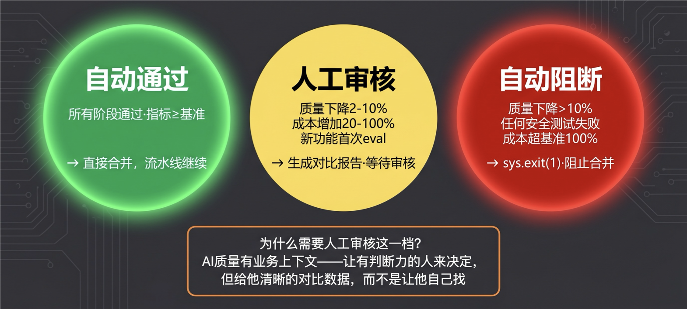

```plain
五个阶段结果汇总
        │
        ├── 全部指标达标 ─────────────► 自动通过（Auto-Pass）
        │   · 所有阶段均通过              直接合并，发布流水线继续
        │   · 关键指标不低于基准
        │
        ├── 边界情况 ─────────────────► 人工审核（Human Review）
        │   · 质量指标下降 2%-10%           生成详细对比报告
        │   · 成本增加 20%-100%             指定 Reviewer 审批
        │   · 涉及主观质量维度             此时人工 eval 介入
        │   · 新功能首次 eval
        │
        └── 核心指标崩溃 ─────────────► 自动阻断（Auto-Block）
            · 质量指标下降超过 10%          sys.exit(1)，阻止合并
            · 任何安全测试失败             生成失败报告
            · 成本爆炸超过基准 100%         附具体失败 case 列表
```

**为什么需要"人工审核"这一档？**

传统 CI 的二元判断对 AI 应用来说太粗糙了。想象这样一个场景：这次 Prompt 调整让主要功能的质量提升了 5%，但有一个边界场景的分数下降了 3%。整体是进步的，但某个维度退步了——这应该通过还是阻断？

答案是：让人来决定，但要给人看到清晰的对比。这就是"人工审核"档的价值：自动收集好所有对比数据，让判断权回到有业务上下文的人手里。

### 6.2 关键评估策略

**与固定基准对比，不与"上一次"对比**

每次 CI 对比的参照系必须是一个**固定的基准版本（Pinned Baseline）**，不是最近一次成功的版本。

如果总是和上一次比，渐进式退化会被完全掩盖——每次只退化 1%，三个月后累积了 30% 的退化，但每次对比都显示"正常"。固定基准让这种积累退化无处遁形。

实践中，每季度人工审查一次是否需要更新基准。更新时有明确的讨论和记录。基准不会随每次发布自动滚动。

**分类聚合，不是整体平均**

只看整体通过率没有信息量。必须按维度细分：

```plain
整体通过率：87%  →  没有洞察
 
分类后：
  P0 核心主流程：99%   →  正常
  P1 重要功能：78%    →  需要关注
  安全合规：100%     →  正常
  新功能首次：61%    →  触发人工审核
```

退化往往集中在某一类场景里。整体均值把信号平均掉了。

### 6.3 人工审核的执行

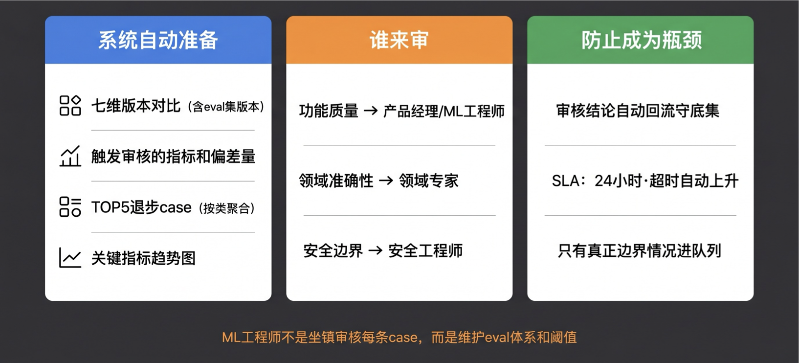

进入人工审核时，系统自动准备好：

- 本次变更与基准版本的七维版本对比（含 eval 集版本）
- 触发审核的具体指标和偏差量
- TOP 5 退步 case（按失败类别聚合，不是随机选的 5 条）
- 关键指标的趋势对比图

**谁来审**：功能质量问题找产品经理或 ML 工程师，领域准确性找领域专家，安全边界问题找安全工程师。ML 工程师负责维护 eval 体系和阈值校准，不是坐镇审核每一条 case。

**防止审核成为瓶颈**：只有真正的边界情况才进入审核队列（绝大多数应该自动通过或自动阻断）；每次审核结论（批准 / 拒绝 + 原因）自动回流进回归集，减少下次相同情况的人工判断；审核有明确的 SLA（建议 24 小时），超时自动上升。

---

## 七、深入框架：为什么要这样设计

### 7.1 为什么是"快先慢后"而不是"全部一起跑"

五个阶段的顺序不是随机的，是按"成本递增"排序的。

静态规则检查：零 token 成本，秒级完成。这一阶段能拦截掉的错误，如果让 LLM 调用来发现，可能要消耗几百个 token、花几十秒，还不如规则检查准确。

回归 eval 套件：有 token 成本，分钟级完成。P0/P1 核心用例随 PR 异步触发，失败时在 MR 里标注而不是阻塞提交；P2 以下定时运行，不占用 PR 通道。

安全扫描：200+ 探针，并行化后 60 秒，但总开销较大。不是每次 PR 必须完整跑，可以在合并 main 前完整运行，在 PR 阶段跑关键子集。

**"快先慢后"的核心价值**：失败越快越好。静态检查发现了问题，不需要等 eval 跑完才报告。这让工程师能在几十秒内得到反馈，而不是等 10 分钟后看到"失败"。

### 7.2 为什么 AI CICD 比传统 CICD 根本上更难

传统 CI 面对的是确定性问题：代码要么对要么错，测试是幂等的，相同输入 100% 得到相同输出。

AI CICD 面对的是概率性问题：同样的输入，LLM 每次的输出可能略有不同。这带来了三个根本性的设计挑战：

**挑战一：测试不是幂等的**。对于 LLM 评判分数，单次运行的结果有噪声。解决方案是多次运行取均值（n=3），不用单次分数做阈值判断。

**挑战二：质量退化是渐进的，不是突变的**。代码有 bug 会报错，LLM 质量下降不会报错——它只是悄悄变差。这就是为什么需要固定基准对比，而不是只跑测试"通过没通过"。

**挑战三：问题的来源是多元的**。代码 bug 来自代码，AI 系统的"bug"可能来自 Prompt、来自模型版本、来自知识库、来自工具接口……这就是为什么触发器需要从 1 个扩展到 6 个，每类变更对应不同的验证逻辑。

---

## 八、实践方案：工具组合推荐

理论完了，来看实践。以下是一套适合中小规模 AI 应用团队的工具组合（Python 技术栈，支持 GitLab/Gitea 国内自托管部署）：

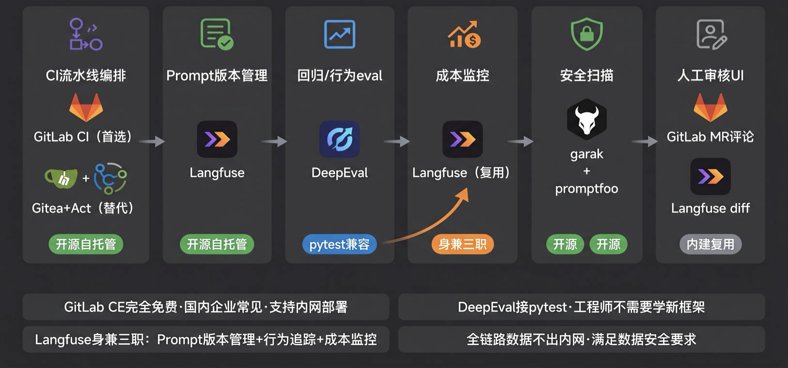

| 环节 | 工具 | 核心价值 |
| --- | --- | --- |
| Prompt 版本管理 | Langfuse（开源自托管） | 每次 Prompt 变更创建版本快照，支持 diff、回滚、环境绑定；免费，数据不出域 |
| CI 流水线编排 | GitLab CI（企业自托管首选）/ Gitea+Act（轻量替代） | GitLab CE 完全免费、国内企业极常见、支持内网部署；Gitea+Act 兼容 GitHub Actions 语法；6 类触发器对应独立 pipeline，MR/PR 评论自动附 eval 结果链接 |
| 阶段①静态检查 | promptfoo（deterministic 断言集）+ nukon-pi-detect（Prompt 注入预扫） | 零 token 成本，30 秒完成；promptfoo 的 is-json、regex、is-valid-function-call 等原生支持 CI |
| 阶段②回归 eval | DeepEval（pytest 原生） | pytest 天然对接 GitLab CI / GitHub Actions；ToolCorrectnessMetric 等 50+ 内置指标；结果以 JUnit XML 格式输出，CI 可直接展示 |
| 阶段③行为评测 | DeepEval + Langfuse Span 追踪 | DeepEval 评工具调用，Langfuse 从 trace 里提取工具调用序列做断言 |
| 阶段④成本性能 | Langfuse Token 追踪 | 每步 Token 消耗记录，与基准做 diff；P95 延迟监控 |
| 阶段⑤安全扫描 | garak + promptfoo redteam | garak 840+ 探针覆盖通用漏洞；promptfoo 50+ 插件支持场景定制；均开源可自托管；输出 JUnit XML |
| 人工审核界面 | GitLab MR 评论 + Langfuse（eval diff 可视化） | 审核者直接在 MR 里看到 eval 报告；Langfuse 已在本方案中，复用即可，不引入额外工具 |

**工具选型逻辑**：

- Langfuse 同时承担 Prompt 版本管理、行为追踪、成本监控三个角色，减少工具数量
- DeepEval 用 pytest，工程师不需要学新的测试框架
- GitLab CE + 所有开源工具均可完全自托管，数据不出企业内网，满足国内数据安全要求
- 整套方案以开源 / 免费为主，适合预算有限的团队

**更大规模团队的替换方案**：

- Langfuse → LangSmith（更丰富的 UI，适合已用 LangChain 的团队；需访问境外服务）
- DeepEval → 自建评测服务（基于 FastAPI 封装 DeepEval，配合 Langfuse 持久化结果，完全内网可控）

---

## 九、避坑指南：最佳实践与反模式

### 🚫 严重拖垮迭代效率的"反模式"

**反模式一：按感觉发布，不按验证发布**

**现象**：改了 Prompt 测几条，感觉不错，直接上线。没有任何自动化验证机制。

**致命后果**：70% 的 AI 团队每季度重建系统，根因就是这个——改动产生的问题在生产中慢慢发酵，积累到无法定位和修复的程度，只能推倒重来。这不是"出了 bug"，而是"系统变得不可维护"。重建的代价远比建设一套 CI/CD 高。

---

**反模式二：六个触发器用同一套流水线**

**现象**：不管是代码变更、Prompt 变更还是模型升级，全走同一个 CI 脚本，跑同样的测试。

**致命后果**：要么漏掉了某类变更特有的风险（比如 Prompt 变更没有跑语义质量回归），要么流水线太重、每次 PR 都跑全套而导致速度太慢，工程师开始跳过 CI。六类变更，六套不同侧重的验证逻辑，是设计 CI 时最重要的决策。

---

**反模式三：回归集只建不维护**

**现象**：第一版回归集上线时投入了精力，之后没有人维护。新的失败场景出现了，没有对应的 eval case 加进去。

**致命后果**：CI 在通过，但通过的是三个月前的标准，覆盖的是已经不再代表真实问题的历史场景。生产环境在出新问题，CI 却一直显示绿色。(“The initial harness gets funded. The ongoing curation never does.” —— MLOps 社区高频共鸣)

---

**反模式四：拿"上一次"做基准**

**现象**：每次 CI 把本次结果和"上一次成功的版本"对比，而不是和固定基准对比。

**致命后果**：渐进式退化（每次只退化 1%）被完全掩盖。三个月后系统质量已经累积退化了 30%，但每次 CI 对比都显示"与上次相比，无明显变化"。等到用户大量流失才意识到问题，此时已经无法追溯是哪个阶段退化的。

---

### 💡 稳健落地的"最佳实践"

**最佳实践一：模型调用必须 pin 到具体版本号**

**落地心法**：把所有模型调用里的浮动别名（`gpt-4o`、`claude-3-sonnet`）改为具体快照版本（`gpt-4o-2024-08-06`、`claude-3-7-sonnet-20250219`），并设置代码扫描检测，在 PR 合并前自动拦截使用了浮动别名的提交。这一个改动，就能消灭"模型悄悄更新导致行为漂移"这一整类问题。

---

**最佳实践二：每次生产事故 24 小时内加回归 case**

**落地心法**：在事故复盘模板里加一个必填项：“本次事故对应的回归 eval case ID”。没有这个 ID，事故复盘报告不算完成。这条流程保证了回归集随着系统的"踩坑经历"持续积累，而不是停留在三个月前的状态。每加一条 case，就是永久关闭一个坑。

---

**最佳实践三：行为 eval 和输出 eval 双轨并行**

**落地心法**：不要在"输出 eval"和"行为 eval"之间二选一。输出 eval 发现"结果对不对"，行为 eval 发现"过程对不对"，两者捕获的问题集几乎不重叠。对于 Agent 系统，工具调用顺序断言往往比输出质量 eval 更早发现问题——因为行为错了，输出还能"侥幸对一会儿"。

---

**最佳实践四：CI 报告给人看，不给机器看**

**落地心法**：CI 失败信息必须指向具体的 case，而不是"eval 未通过"。退步 case 必须按失败类别聚合，而不是随机列 5 条。PR 评论里自动附上 eval 报告链接，并且报告格式要让 PM、产品也能看懂，不只是工程师。一个只有工程师能看懂的 CI 报告，会让非技术的 Reviewer 在人工审核时做无用的决定。

---

## 课程总结

- 我们理解了AI CICD 的本质：不是自动跑 eval，而是为 AI 应用的每一次变更安装自动化的质量护栏，在离线迭代和线上演进的全生命周期中维护系统质量不退化。
- 我们见识了没有 AI CICD 的真实代价：月消 30 万三天才发现、70% 团队每季度重建、模型悄悄降级无人知晓、89% 的生产 Agent 质量为零——这些都是真实发生过的案例，根因相同：变更影响不可控。
- 我们掌握了触发器从 1 个扩展到 6 个的必要性：代码、Prompt、模型版本、知识库、Skill、工具——每类变更有独立的风险点和验证逻辑，不能用一套流水线硬套。同时锁定七维版本快照（含 eval 集版本），让 CI 结果可重复、可对比。
- 我们建设了五阶段 CI 流水线：静态规则检查（秒级底线）→ 可用性回归评测集（守底）→ 行为模式评测（过程）→ 成本与性能评测（资源）→ 安全扫描（底线），快先慢后，逐级拦截。
- 我们设计了三档质量门禁：自动通过、人工审核、自动阻断，以及固定基准对比、分类聚合、回归集持续积累的关键策略。

>
> 下节课预告：我们现在有了部署前的变更验证（CI/CD）——但系统上线之后呢？线上流量里的真实用户行为，会暴露出离线 eval 没有覆盖到的问题。下一节课，我们来做线上监控：如何在生产环境里对 AI 系统的真实表现进行持续观测，让"上线后变差"的问题不再是靠用户投诉才发现。我们下节课见！
>

---

## 课后思考题

>
> 费曼检验：用一句话，把"AI CICD 的触发器为什么要从 1 个扩展到 6 个"解释给一个没学过的同事听——不许用"变更"这个词。
>
> 思考题 1（主动回忆）：不看笔记，说出 CI 流水线五个阶段的顺序，以及每个阶段对应的"主要发现什么类型的问题"。为什么是这个顺序，而不是把安全扫描放第一位？
>

**思考题 2（知识迁移）**：在你自己的业务场景里，你们的 AI 应用最常出现的变更类型是哪一种（代码 /Prompt/ 模型 / 知识库 /Skill/ 工具）？按照今天讲的框架，这类变更对应的 CI 验证逻辑应该包含哪些阶段？

欢迎在评论区分享你的真实案例，我们下一讲见！
---

来源：极客时间《企业级多智能体设计实战》
提取日期：2026-06-02
