# 38｜线上监控：知道你的 AI 到底跑得怎么样

> 来源：极客时间《企业级多智能体设计实战》
> 当前播放：38｜线上监控：知道你的 AI 到底跑得怎么样
> 提取日期：2026-06-02
> 原文长度：14402 字

---

欢迎回来！

上节课，我们给 AI 系统装上了完整的 CI/CD 护栏——六类触发事件、七维质量快照、五阶段流水线、三档发布决策。到这里，你能保证**变更中的问题在上线前被拦住**。

但 CI 解决的是"可以预料的变化"。生产环境里的失败，往往是你根本没预料到的。而 AI 系统的失败方式，和传统系统**完全不同**：

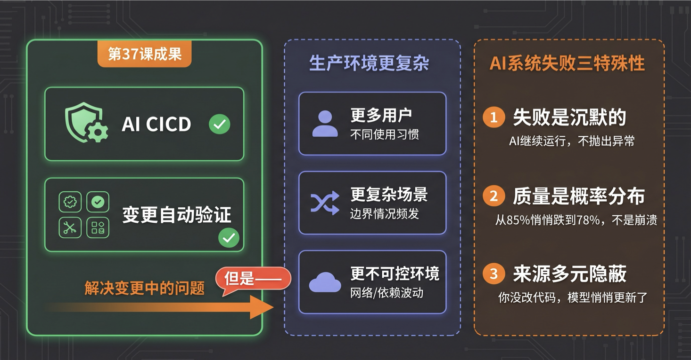

- 失败是沉默的：模型继续运行、HTTP 200 正常返回，但生成的答案已经悄悄变差了——没有任何报错信号
- 质量是概率分布：不是"崩溃"，而是代码采用率从 85% 滑落到 72%，没有异常堆栈，只有用户在沉默地不满意
- 来源是多元隐蔽的：你没改一行代码，但上游模型悄悄更新了，Prompt 缓存失效了，用户输入分布变了

这三点，决定了你不能靠"等错误日志"来感知 AI 的问题。线上监控要解决的，正是 CI 解决不了的那部分——**让你第一时间知道 AI 系统的真实运行状态，而不是等用户来告诉你"出问题了"。**

这节课，我带你搭建一套完整的 AI 应用线上监控体系。六层指标、告警策略设计、从工具选型到实际配置，用一个代码辅助 Agent 的具体场景贯穿——你大概率接触过这类工具，有直接感受，最适合把抽象指标变成可以想象的东西。

## 一、认知原点：HTTP 200 ≠ 成功

**AI 应用线上监控的第一认知跃迁：HTTP 200 ≠ 成功。**

AI 应用打破了这个前提。一个 Agent 可以连续十几个小时稳定返回 HTTP 200，同时在后台把几万美元的 API 费用烧光。一个 RAG 系统可以每条请求都成功响应，同时把错误的知识库内容喂给用户。一个代码辅助 Agent 可以正常生成代码，同时生成的代码 50% 运行不通——系统活着，质量已经崩了。

传统监控对这些完全是盲区。它看到的是"系统有没有在运行"，而 AI 应用真正需要监控的是：**“Agent 在做的事情对不对、值不值、能不能持续。”**

难在三个根本性差异：

**差异一：AI 系统的失败是沉默的。** 传统应用失败会报错，AI 应用失败会继续运行——只是输出错了。工具调用返回了过期数据，Agent 自信地基于这个数据做了决策，用户收到了错误答案。整个过程没有任何技术异常信号。

**差异二：AI 质量是概率分布，不是二元状态。** 传统软件跑起来就是通过，跑崩就是失败。AI 应用的质量是：今天正确处理了 85% 的任务，明天因为一次 Prompt 迭代变成了 78%。它没有"崩"，但它在退化。这种退化，没有专门的机制，根本发现不了。

**差异三：问题来源是多元且隐蔽的。** 代码没动，但模型提供商悄悄更新了版本；代码和 Prompt 都没动，但用户输入分布在变化，触发了你从来没测试过的场景。传统 CI 覆盖的是"你改了什么"，但生产环境里让 AI 系统变差的原因，很多是你没改任何东西。

这就是为什么，每一个上了 AI 系统的团队，最终都需要专门的线上监控体系——不是传统 APM 的延伸，而是从头设计的一套指标语言。

在展开六层体系之前，还有一个认知值得提前建立：**传统监控的终点是"请求有没有成功"，而 AI 应用监控真正要回答的是"用户的意图有没有被满足"。**

这是衡量 AI 应用健康最根本的问题，也是贯穿六层体系的北极星：**意图完成度**。Trace 告诉你工具调用成功了、任务返回了结果——但工程师打开 Agent 生成的代码后发现无法接入现有模块，手动重写了。技术上"成功"，用户意图上"失败"，而 Trace 里没有任何信号。这道鸿沟，正是六层监控体系需要一层层填补的——从系统健康，一直建到业务价值。

## 二、为什么需要它：三个真实案例，告诉你"仪表盘全绿"背后可能藏着什么

在搭建六层体系之前，先看三个真实发生过的案例。这三个案例有同一个共同教训，整套监控设计的逻辑从这里出发。

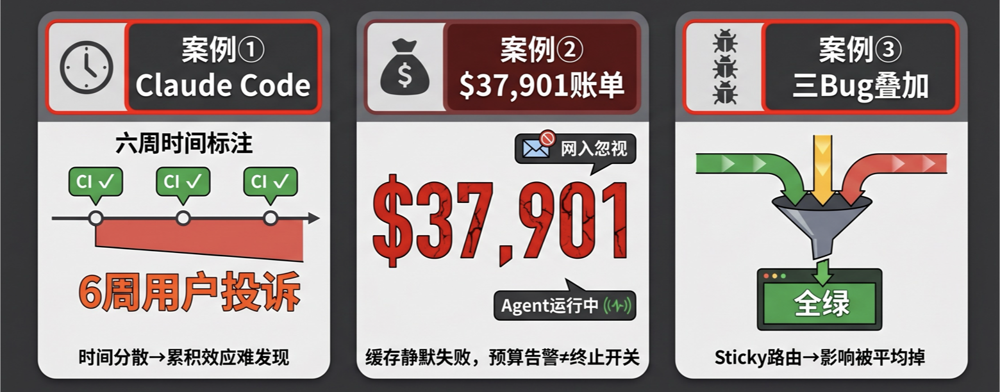

**案例一：Claude Code，六周的沉默退化**

Anthropic 对 Claude Code 做了三次时间错开的产品改动——推理 effort 降级、缓存优化引入 Bug、system prompt 加了一行限制。三次改动都通过了 CI 的所有检查，影响各自不同的流量切片。

累积效果：用户感觉"Claude Code 变笨了"，但每个 CI 单独看都通过了。六周后，靠用户主动反馈和社区投诉，Anthropic 才逐步回溯找到三个独立根因。Postmortem 原话：**“需要在真实生产系统上持续运行质量 eval，而不仅在测试环境。”**

教训：**时间分散的累积退化，汇总指标里完全看不出来——等用户投诉才发现，已经晚了六周。**

**案例二：睡一觉，账单 $37,901.73**

一个工程师建了本地编码 Agent，开启了 AWS 预算告警（email 通知），然后让 Agent 在他睡觉时工作。

缓存配置在链路中静默失效——`cache_control` 字段透传失败，每次请求都在发全量未缓存 input，Token 消耗是正常的几十倍。AWS 预算告警在晚上 11 点发出了邮件。没有人在盯邮件，Agent 继续跑了一夜。

第二天早上：$37,901.73。

教训：**预算告警是软通知，不是终止开关。成本失控没有报错，HTTP 全是 200。**

**案例三：三个 Bug 叠加，仪表盘全绿**

Anthropic 生产系统同时出现三个基础设施 Bug，互相无关，每个单独影响不到 1% 的请求。但因为路由是 sticky 的，这三个 Bug 叠加影响了同一批用户，让他们的错误率飙升到 16%。

监控仪表盘上，总体错误率：0.8%，**全绿**。

历时数周，靠大量用户投诉才逐步定位全部根因。

教训：**汇总指标把分片信号平均掉了。Sticky 路由让影响集中在一批用户，整体看却完全正常——等用户大规模投诉才发现，已经持续数周。**

**三个案例，同一个教训：汇总指标把信号平均掉了——监控要按维度分片，不能只看整体。等用户投诉才发现，往往已经持续数周。** 这是后面设计六层体系的起点。

## 三、全景图：六层监控指标体系

**在深入细节之前，先看整体。**

AI 应用的线上监控可以用六层来理解。每一层回答的问题不同，覆盖的风险不同：

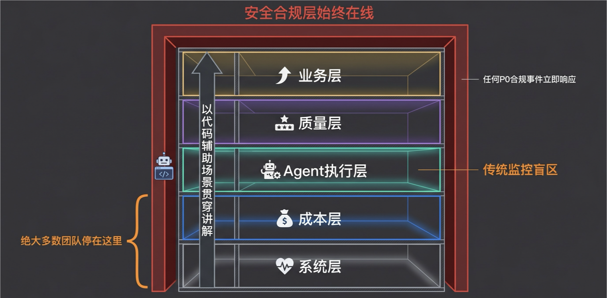

一个残酷的现实：绝大多数 AI 团队的监控体系停在第一层（系统健康）和偶尔的第二层（成本）。但 AI 系统真正的失败，几乎都发生在第三层以上——而且它们的共同特征是：**系统活着，日志干净，报警沉默。**

**贯穿场景说明**：接下来的每一层，我们都用同一个具体场景来讲：一个**企业内部的代码辅助 Agent**——工程师在 IDE 里向它提问、让它生成代码、运行测试、重构函数。这类产品你大概率用过或接触过，有直接的感受，最适合把抽象的监控指标变成可以想象的东西。

## 四、第一层：系统层 — 必须有，但不够

**监控的问题：系统有没有在运行？**

以代码辅助 Agent 为例，系统层监控覆盖三类核心问题：

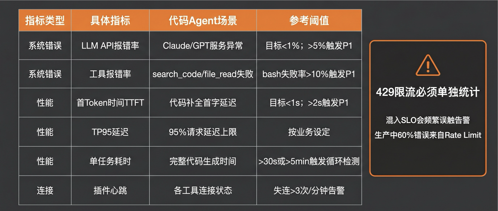

| 分类 | 具体指标 | 如何采集 | 参考阈值 |
| --- | --- | --- | --- |
| 请求延迟 | 代码补全首 token 时间（TTFT） | Langfuse span 的 time_to_first_token | 目标 2s 触发 P1 |
|  | 代码重构任务 P95 端到端延迟 | span 的 duration_ms 取 P95 | 目标 30s 触发 P1 |
| 工具调用与 API 错误 | file_read/bash/search_code 分工具失败率 | span 按 tool_name 分组统计 error 率 | bash 失败率 > 10% → P1 |
|  | LLM API 限流（429）频率 | 单独标注 error_type=rate_limit | 占总错误 > 30% → 考虑升级 Provider 配额 |
| 系统可用性 | IDE 插件连接成功率 | 客户端心跳上报 | < 99.5% → P0 |

>
> 其他类型 Agent 还可监控：WebSocket 连接稳定性、数据库依赖健康度、外部 API 响应时间、队列积压深度——分类相同，阈值根据业务 SLA 设定。
>

注意两个重要的设计决策：

**首先，刷新你对"几个九"的预期。** LLM 推理框架的稳定性远低于传统服务——一个优秀的推理框架能做到两个九（99%）就已经相当不错了。这和你习惯的四个九、五个九是完全不同的量级。这意味着你的监控目标要调整：LLM API 调用的成功率 SLO 设定在 99% 是合理的，别把不可能达到的目标写进 SLO，否则告警系统一直处于触发状态，最终被全员 ignore。

**其次，Provider 限流（429）必须与应用错误率分开统计。** 生产环境中约 60% 的 LLM 调用报错来自 Rate Limit。如果把限流错误混入应用 SLO，Provider 流量高峰会频繁误触告警，且掩盖真实的应用问题——429 单独统计、单独监控，不让它淹没真正需要处理的系统错误。

>
> ⚠️ 第一层的上限：代码辅助 Agent 可以 TTFT 正常、工具调用全绿，但生成的代码 50% 运行不通。系统活着，质量已经崩了。停在这层，就是案例三里 Anthropic 的处境——仪表盘全绿，等用户投诉才知道质量已经崩了。
>

## 五、第二层：成本层 — 最易忽视的定时炸弹

**监控的问题：烧了多少钱，烧在哪里？**

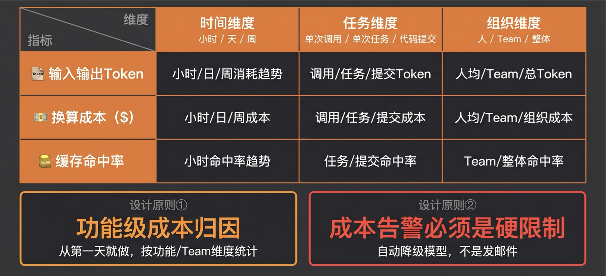

| 指标 | 具体内容 |
| --- | --- |
| Token 消耗 | 输入 Token/ 输出 Token分开统计（两者单价不同） |
| 单任务成本 | 每次 Agent 任务平均花多少钱 |
| 成本趋势 | 每日 / 每周变化率，突刺告警 |
| 缓存命中率 | 相同或相似 Prompt 的重用率 |
| 功能级成本归因 | 哪个功能模块烧钱最多 |

**代码辅助 Agent 场景：**

代码辅助 Agent 有一个特点：**系统 Prompt（代码规范、项目上下文）在每次请求里都重复发送，是最大的 Token 消耗来源**。Datadog 数据显示，系统 Prompt 平均占输入 Token 的 69%。这让缓存命中率成为成本控制的核心杠杆。

| 指标 | 具体含义 | 如何采集 | 参考值 |
| --- | --- | --- | --- |
| 系统 Prompt 缓存命中率 | 项目上下文 / 代码规范是否命中缓存 | Langfuse 的 cache_read_input_tokens vs input_tokens | 目标 > 60%；低于 30% 说明缓存策略有问题 |
| 单任务 Token 消耗（按任务类型） | 代码补全 / 重构 / 解释 / 测试生成分别统计 | span 按 task_type 打 tag，统计 token 消耗分布 | 补全：~500 tokens；重构：~5000 tokens；超过 2 倍历史 P90 → 告警 |
| 功能级成本归因 | 补全 / 重构 / 解释 / 审查各占总成本的百分比 | Langfuse 按 feature 维度聚合 | 每周检查；单功能占比突然超过 50% → 调查 |
| 每次代码提交的平均 AI 成本 | 产出一个被用户真正采用的代码变更的成本 | 关联代码采用事件 + token 消耗 | 业务价值层面的成本基准 |
| 每日成本趋势 | 单日成本相对前 7 日均值的变化 | Langfuse 时序图 | 单日 > 前 7 日均值 200% → P1 告警 |

**一个真实教训：Claude Code 升级触发全面缓存失效**

缓存命中率要监控，不只是因为"缓存好一点省钱"，而是因为它可以在你毫无感知的情况下归零。

一个真实案例：Claude Code 在某次版本升级后，在 Prompt 请求头里加了一个随机数标识（用于计费追踪）。官方 Anthropic API 知道这个随机数，会在转发给模型前把它删掉，所以缓存照常命中。但所有第三方代理 API——包括企业内网中转、国内中转 API、Bedrock 部署——不知道这件事，随机数被一起发到了模型端，每次请求都是全新的 Prompt，缓存命中率归零。

结果：线上什么都没改，成本飞速上涨，直到有人发现缓存命中率图表从 65% 掉到了接近 0%。如果没有这张图，这件事可能几周内都不会被发现。

**按三个维度分析成本，而不是只看总量**

总量图告诉你"今天花了多少"，但告诉不了你"为什么"。成本分析需要三个维度：

| 维度 | 分析粒度 | 发现什么问题 |
| --- | --- | --- |
| 时间维度 | 小时 / 天 / 周趋势 | 成本突刺：何时开始涨？昨天还是上周？ |
| 任务维度 | 单次调用 → 单次会话 → 单个项目周期 | 单次调用 token 暴增 → harness 框架问题；单次会话成本上升但单次调用正常 → 用户使用方式出了问题 |
| 组织维度 | 个人 / 团队 / 全公司 | 二八法则：通常就那几个人 / 团队把大部分成本用掉了——别看人均，要看 top 用户 |

**两个关键设计要点：**

第一，**功能级归因必须从第一天就做，不能等到成本出问题再回溯**。总量图只告诉你"成本高了"，无法告诉你是哪个功能。等发现问题时，那个功能已经运行了几个月，无从溯源。

第二，**成本告警必须是硬限制，不是软通知**。案例二里，AWS 预算告警是 email——Agent 在睡觉时继续烧钱，email 在早上等着你。正确的做法：告警触发后，自动降级（切换更便宜的模型）或暂停任务，不是等人来看邮件。

## 六、第三层：Agent 执行层 — 传统监控的完全盲区

**监控的问题：Agent 在做什么，做得对不对，有没有失控？**

>
> 一句来自生产团队的总结，精准描述了这层的意义：“一个工具静默返回了过期数据 → Agent 自信地基于这个数据做了决策 → 用户收到了错误答案 → 错误率仪表板显示零红色。”
>

这层是传统监控完全没有对应物的——传统 API 服务，你关心"请求进来、响应出去"；Agent 是自主执行的过程，选择工具、调用工具、根据结果决定下一步、再循环。**这个执行过程本身，才是最容易出问题的地方。**

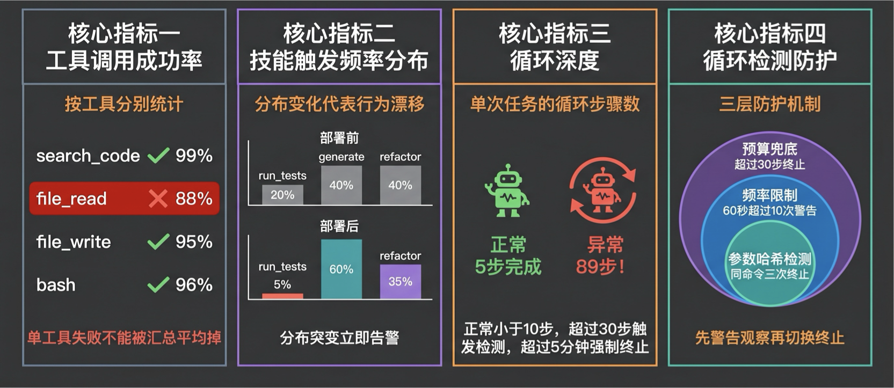

四大核心指标：

**核心指标一：工具调用成功率（按工具分别统计）**

每个工具的成功率分别统计，**绝对不能汇总**。`file_read` 失败率 12%、其他工具全是 99%——汇总成 98%，看起来正常；分开看，有严重问题。

代码辅助 Agent 场景：

| 工具 | 监控意义 | 参考告警 |
| --- | --- | --- |
| file_read | 能否读取代码库文件 | >2% → 检查文件系统权限 |
| file_write | 代码写入是否成功 | >1% → P1，写入失败任务无法完成 |
| bash | 编译 / 测试命令是否能执行 | 失败率 >10% → P1 |
| search_code | 代码库搜索是否有效 | "无结果"率 >30% → 检查搜索索引 |

采集方式：Langfuse span 按 `tool_name` 分组，统计 `status=error` 的比例。

**核心指标二：技能触发频率分布（分布变化 = 行为漂移）**

各能力模块（Skill）的触发比例。代码辅助 Agent 里：`run_tests` / `generate` / `refactor` / `explain` 各占多少，每日统计。

如果 `run_tests` 占比从 20% 突然跌到 5%，说明模型在该调用测试的时候没有调用——这是能力退化或 Prompt 路由漂移的早期信号，在质量指标下滑之前往往会先出现。**分布突变 → 立即调查。**

**核心指标三：Agent Loop 深度（单次任务循环步骤数）**

正常代码辅助任务，Agent 应该在 3–8 轮工具调用内完成。循环步骤数的分布是衡量 Agent "是否迷失了"的核心代理指标。

| 步骤数 | 含义 | 处置 |
| --- | --- | --- |
| 3–8 步 | 正常：理解→检索→生成→验证 | — |
| 9–15 步 | 偏高：可能在反复修复某个错误 | 监控 |
| >20 步 | 异常：大概率陷入局部循环 | 告警调查 |
| >30 步 | 触发硬限制 | 强制终止 |

采集方式：统计每个顶层 span 下的子 span 数量，P90 > 15 步 → 告警。

**核心指标四：循环检测防护（三层机制）**

Agent 陷入死循环是生产中最高频的致命故障——相同参数调用同一工具几十次，持续几十分钟烧掉几百美元，直到人工手动终止。

三层防护，按精确度递增部署：

```plain
第一层：参数哈希检测（捕获 >90% 的真实循环）
  相同命令执行 3 次相同参数 → 终止，告知用户"命令持续失败，需人工介入"
 
第二层：频率限制
  60 秒内工具调用 >10 次 → 发出警告，注入恢复提示
 
第三层：预算兜底（硬上限）
  单次任务 >30 步 OR 运行时间 >5 分钟 → 强制终止
```

关键工程细节：**先设 WARN 模式观察一周，确认阈值合理后再切换 TERMINATE。** 不同业务场景的正常重试次数差异很大。过早的强制终止会误杀合理的重试逻辑，导致任务完成率骤降——比没有循环检测更糟。

## 七、第四层：质量层 — 最难量化，最重要

**监控的问题：输出够不够好，用户的意图有没有被真正满足？**

>
> 🧠 回忆一下：第 36 课建了离线 eval 体系，解决"怎么衡量 AI 质量"。质量层监控就是把第 36 课的 eval 搬到生产环境——不是手动触发，而是对线上采样流量持续自动运行。
>

### 两条设计原则（先建立认知，再看指标）

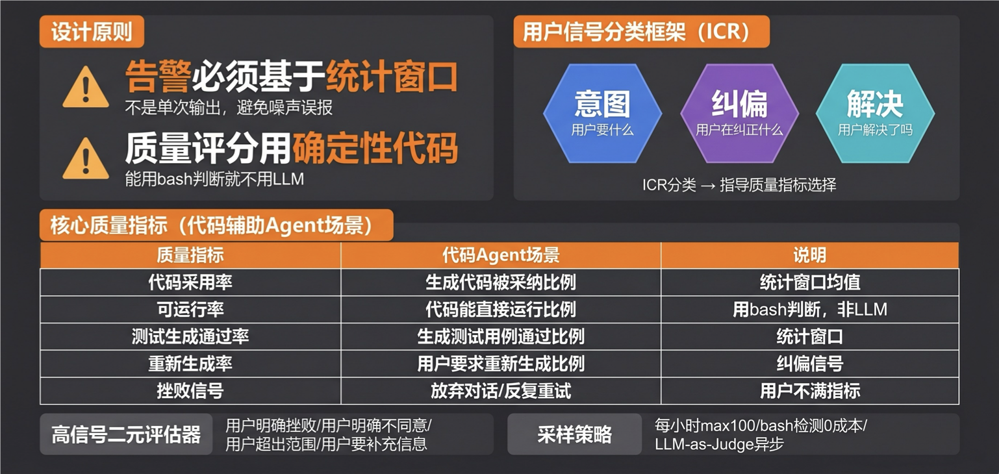

**原则一：告警必须基于统计窗口，不能基于单次输出。**

LLM 有固有的概率波动，单条输出质量低是噪声，不代表系统退化。正确的做法是"过去 1 小时内 X% 的输出质量低于阈值，持续超过 Y 分钟，才告警"。否则会产生告警风暴——工程师开始全部 ignore，等于没有告警体系。

**原则二：质量评分用确定性代码，不用 LLM。**

语义标注（判断"这个输出有没有幻觉"）用 LLM，因为只有 LLM 能理解语义；但统计计算（“过去 1 小时幻觉率多少”、“本周趋势”）必须用代码，确定性计算，结果可再现。

代码辅助 Agent 里，"代码可运行率"完全不需要 LLM——`bash` 执行结果是确定性的（成功或失败）。能用代码判断的，优先用代码；LLM 只负责它不可替代的部分。

### 用户信号分类框架：ICR

在设计具体指标之前，先把用户信号分三类，这是质量监控的思维框架：

| 维度 | 问的是什么 | 代码辅助 Agent 的对应信号 |
| --- | --- | --- |
| 意图（Intent） | 用户真正想完成什么？ | 补全 / 重构 / 解释 / 测试生成 / 调试 |
| 纠偏（Correction） | 哪里摩擦最大，用户在纠正什么？ | 重新生成 / 明确否定后重述 / 多轮修复同一问题 |
| 解决（Resolution） | 意图最终有没有被满足？ | 代码被 accept / bash 执行通过 / 会话自然结束 |

ICR 不是三个独立指标，而是一个思维框架：**哪类意图的纠偏率最高、解决率最低，就是最值得优先改进的方向。** 这比笼统的"质量分下降了"有行动指向。

ICR 的统计计算刻意不用 LLM（LLM 只做意图分类的语义标注），统计聚合全用确定性代码——保证可再现性，能区分"质量真的在变"和"评分系统在抖动"。

### 核心质量指标（代码辅助 Agent 场景）

代码辅助有一类独特优势：**可以用代码执行结果客观验证质量**，不需要完全依赖主观 LLM-judge。

| 质量指标 | 具体含义 | 采集方式 | 告警阈值 |
| --- | --- | --- | --- |
| 代码采用率 | 用户实际接受 AI 生成代码的比例 | IDE 客户端上报 accept/reject 事件 | <30% → P1 |
| 代码可运行率 | 生成代码第一次运行不报错的比例 | 关联 bash 执行结果（确定性判断） | <50% → P1 |
| 测试生成通过率 | 生成测试用例一次通过的比例 | 追踪 run_tests 后是否触发多轮 edit_file | 多轮修复率 >40% → 告警 |
| 重新生成率 | 用户要求重新生成同一任务的频率 | IDE 事件上报（纠偏信号） | >30% → 质量下降预警 |
| 挫败信号 | 放弃对话 / 反复重试 / 强烈不满 | LLM-judge binary 评分 | 触发率 >1%/ 会话 → P1 |

**采样策略**：生产环境的质量评估不能逐条运行——线上一万个任务，每条都跑 LLM-as-Judge 成本太高，也没必要。合理的做法是：每小时随机抽取 1%（一万个任务取 100 个），对这 100 个任务运行 `bash` 可执行性检测（零成本），再异步批量跑 LLM-as-Judge（不阻塞主请求）。看的是这 100 个任务的整体质量分布——如果某小时抽到的 100 个里有 35 个代码不可运行，说明有问题；如果只有 6 个，是正常波动范围。采样保证了质量层的可持续性，统计窗口保证了信号的真实性。

## 八、第五层：业务层 — 最终判断标准

**监控的问题：AI 应用是否真正创造了业务价值？**

>
> 🧠 回忆一下：35 课我们做产品原型设计时问了"How good"——业务成功标准是什么？第五层就是在生产环境里，持续验证这个标准有没有被满足。技术上正常运行，不等于业务目标在达成。
>

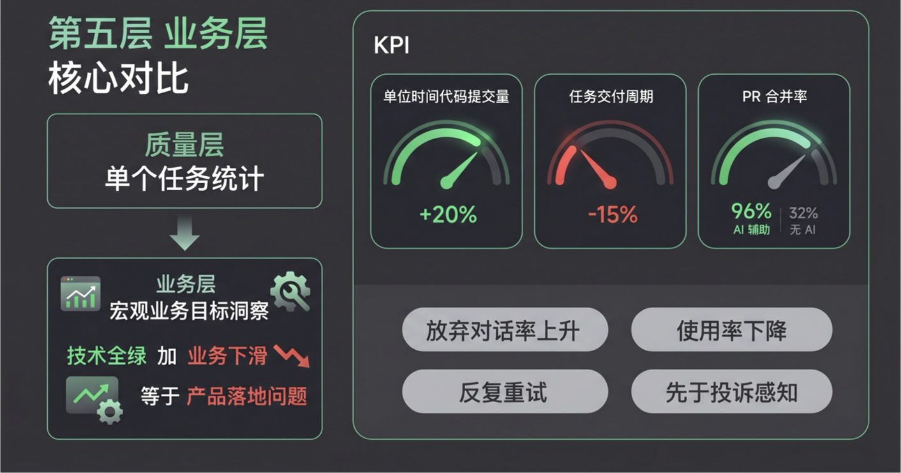

**代码辅助 Agent 场景：**

这层回答"代码辅助工具是否真的提升了工程师效率"。看的是最终结果指标——不是交互过程的质量，而是业务上有没有真正产出。

| 指标 | 具体含义 | 如何采集 | 参考值 |
| --- | --- | --- | --- |
| 单位时间代码提交量（Velocity） | AI 辅助前后工程师每周 commit 数量变化 | git 统计（排除合并 commit） | 目标提升 20% 以上 |
| 任务交付周期（Cycle Time） | 从开始开发到 PR 合并的时间 | git/Jira 时间戳 | 周期缩短 15%+ |
| AI 辅助代码的 PR 合并率 | AI 生成 / 辅助的代码最终被合并的比例 | 关联 AI 会话 + PR 状态 | 持续低于非 AI 代码的合并率 → 质量问题 |
| 用户主动使用率 | 有多少工程师每天在使用，用了多少次 | IDE 事件统计 | 使用率下降 → 用户体验出了问题 |
| 净推荐值（NPS）或满意度 | 工程师对 AI 辅助工具的整体评价 | 定期问卷或显式点赞 / 踩 | 基准值 + 趋势 |

**业务层的核心洞察**：技术层全绿、第五层下滑，说明 AI 输出"质量够用，但没有真正融入工作流"。这是产品落地问题，不是技术系统问题，需要的解法完全不同——不是调 Prompt 或换模型，而是重新审视产品设计。

业务层的隐式信号往往比显式评分更灵敏：用户放弃对话、对同一任务反复重试、使用率在工作日逐渐下降——这些信号在发生的当下就是预警，**不需要等用户主动投诉才发现问题**。

## 九、第六层：安全合规层 — 企业不可绕过

**监控的问题：有没有触发合规风险？**

>
> 🧠 回忆一下：37 课的 CI 第五阶段是安全扫描——事前防御，用 garak 和 promptfoo 在每次变更前跑。第六层是持续运行的第二道防线：覆盖那些只在真实生产流量里才会出现的攻击向量，CI 测试集无法预测。
>

**这层监控的不是"指标趋势"，而是"检测合规事件"。**

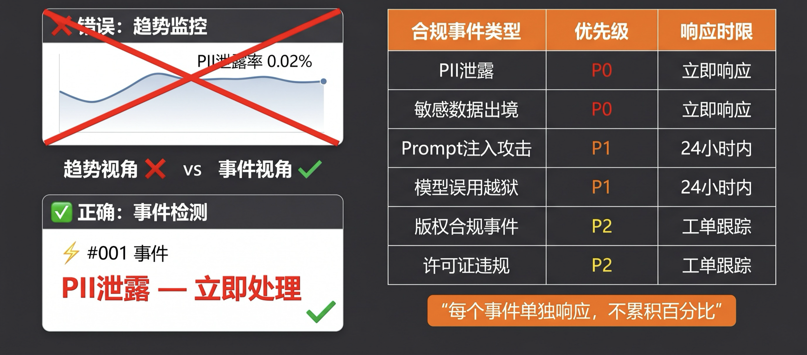

每一个合规事件都要有记录、有响应、有追溯，而不是等到季度审计时才发现。把 PII 泄露率做成趋势折线图并设 5% 告警阈值——这意味着泄露 100 次才告警，而每一次泄露都应该立刻被处理。

**代码辅助 Agent 场景：**

代码辅助 Agent 在企业场景里有几类特殊的合规风险：

| 合规事件类型 | 具体描述 | 检测方式 | 严重程度 |
| --- | --- | --- | --- |
| 敏感信息泄露 | 生成代码中包含 API Key、数据库密码、内部 IP | 正则扫描所有代码输出（truffleHog 规则集） | P0，立即通知安全团队 |
| 危险命令建议 | Agent 建议执行 rm -rf、DROP TABLE 等破坏性操作 | bash 命令黑名单检测 | P0，拦截不执行，记录 incident |
| 代码审计日志完整性 | AI 辅助生成的代码变更是否有完整溯源记录（谁生成 / 何时 / 基于什么 Prompt） | Langfuse trace + git commit 关联 | 企业合规强制要求；缺失 → P1 |
| Prompt 注入尝试 | 代码注释中嵌入指令试图通过 Agent 执行未授权操作 | 输入侧 Prompt 注入检测 | P1，记录攻击尝试 |
| 数据越权访问 | Agent 尝试读取超出当前工程师权限的文件或数据库 | 工具调用权限检查 | P0，拒绝并告警安全团队 |
| 版权 / 许可证合规 | 生成代码与已知 GPL 代码高度相似 | 代码相似度检测 | P1，标注"需人工审核" |

## 十、从指标到目标：告警体系设计

有了六层指标，下一步是设定目标、建立告警机制。这里有一个核心升级：大多数团队还在用旧方式告警，噪声极多，结果是工程师开始 ignore 告警——比没有告警更危险。

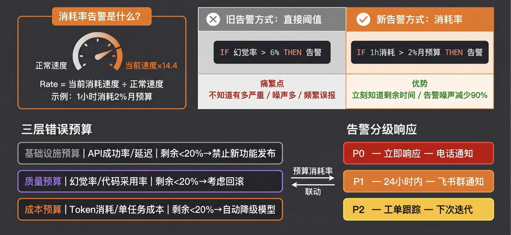

### 消耗率告警：先搞清楚这个概念

**旧方式：直接阈值告警**

```plain
IF 幻觉率 > 6% THEN 告警
```

问题：LLM 有固有的概率波动，今天随机抽到几条质量差的输出，幻觉率可能短暂超标，但完全不代表系统有问题。结果：告警频繁触发 → 工程师开始 ignore → 真正出问题时也没人看。

**新方式：消耗率告警（Burn Rate Alert）**

```plain
IF 1 小时内消耗 > 2% 月预算 THEN 告警
```

“消耗率"是什么意思？把你的月 SLO 预算想象成一个油箱——30 天把这箱油烧完，每小时正常消耗约 0.14%。如果某小时消耗了 2%，相当于以正常速度的 **14.4 倍**在烧。速度计指针打到红区，立即告警——不是"出问题了”，而是"如果继续这个速度，X 小时内预算就耗尽了"。

消耗率告警的优势：

- 立刻知道剩多少时间——告警不是"超标了"这种模糊信号，而是"按当前消耗速度，这个团队的模型配额将在本周三耗尽"。紧急程度一目了然，工程师知道自己有多少时间处理
- 自动双窗口机制：短窗口触发，长窗口平息，问题恢复后告警自动停止
- 噪声减少 90%——只有真正持续的退化才会触发，随机波动不会

### 三层错误预算联动

AI 应用需要三层预算同时维护，这是和传统 SRE 最大的设计差异：

| 预算类型 | 核心指标 | 剩余 <20% 时的联动动作 |
| --- | --- | --- |
| 基础设施预算 | API 成功率 / 延迟 | 禁止非紧急功能发布 |
| 质量预算 | 幻觉率 / 代码采用率 | 增加人工审核比例，考虑回滚 |
| 成本预算 | Token 消耗 / 单任务成本 | 自动降级到更便宜的模型 |

三层联动——任意一层预算告急，触发对应的自动降级动作，不是等人来手动响应。

### P0/P1/P2 分级响应

| 级别 | 响应时限 | 通知方式 | 典型场景 |
| --- | --- | --- | --- |
| P0 | 立即响应 | 电话通知 | 合规事件、系统崩溃、Agent 死循环烧钱 |
| P1 | 24 小时内 | 飞书群通知 | 性能退化、质量下降、成本日消超预算 200% |
| P2 | 下次迭代 | 工单跟踪 | 趋势性指标下滑、轻微波动 |

### 工具配置：把 Langfuse 从离线升级到生产监控

第 37 课我们用 Langfuse 做离线 eval。这节课，**改三处配置**，让它同时成为生产监控平台：

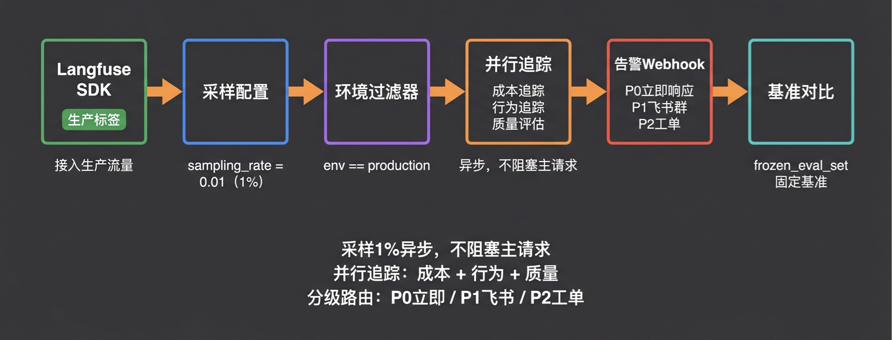

**改动一：接入生产标签**

```python
langfuse.trace(
    name="code_assist_agent",
    tags=["production"],
    metadata={"env": "production"}
)
```

**改动二：1% 异步采样，不阻塞主请求**

```python
langfuse.configure(
    sampling_rate=0.01,
    environment_filter="production"
)
```

**改动三：并行追踪 + 分级告警 Webhook**

```python
# 三路并行追踪（异步）
trace.track_cost()      # 成本追踪
trace.track_behavior()  # 行为追踪
trace.track_quality()   # 质量评估
 
# 分级路由
langfuse.alert_webhook(
    p0_url="...",   # P0 → 立即响应
    p1_url="...",   # P1 → 飞书群
    p2_url="..."    # P2 → 工单系统
)
```

六个节点串联：Langfuse SDK（生产标签）→ 采样配置（1%）→ 环境过滤器（只导出生产数据）→ 并行追踪（异步，不阻塞主请求）→ 告警 Webhook（P0/P1/P2 分级路由）→ 基准对比（`frozen_eval_set` 固定基准持续对比）。

不引入新工具，在第 37 课工具链基础上扩展配置。

## 十一、避坑指南：最佳实践与反模式

### 🚫 严重影响监控有效性的"反模式"

**反模式一：停在第一层，把"技术全绿"当"系统健康"**

**现象**：团队的监控体系只有延迟和错误率仪表盘。只要 HTTP 200 正常，就认为系统健康。

**致命后果**：Anthropic 两次生产事故的共同特征——仪表盘全绿，质量已经崩了，等用户投诉才发现问题。"活着"和"答对了"是两件完全不同的事。代码辅助 Agent 可以 TTFT < 1s、错误率 0%，同时生成的代码 50% 运行不通。停在第一层，你对自己系统的真实质量永远是盲的。

**反模式二：汇总指标掩盖分片信号**

**现象**：只看整体通过率或平均延迟，不按功能模块、用户群体、模型版本分片。

**致命后果**：Anthropic August 2025 案例的教训——路由 Bug 导致部分用户持续受影响，而另一部分完全正常，汇总指标把问题平均掉了，看起来一切正常。代码辅助 Agent 里类似的情况：重构任务质量崩了，但补全任务质量正常，整体平均质量分还在 SLO 之内。按任务类型细分，才会发现问题。

**反模式三：成本告警是软通知，不是硬限制**

**现象**：预算告警只发 email 或飞书消息，没有自动的动作触发。

**致命后果**：案例二——AWS 预算告警发了 email，Agent 在睡觉时继续烧钱，醒来时账单 $38k。企业环境里，值班工程师可能在睡觉、在开会，软通知可靠性趋近于零。正确做法：告警触发时，**同时**发通知 + 执行自动降级（切换模型 / 降采样率 / 暂停非核心任务），不是等人来响应再手动操作。

**反模式四：安全合规层做趋势分析，而非事件检测**

**现象**：把 PII 泄露率做成趋势折线图，设 5% 阈值才告警；把危险命令建议率做成每周报告。

**致命后果**：PII 泄露发生了一次，被平均进"本周泄露率 0.02%"，没有触发告警，用户数据已经暴露。合规事件不是统计问题——每一次 PII 泄露、每一次危险命令建议，都是需要立刻响应的独立事件，不是等积累到阈值才处理的趋势信号。

### 💡 稳健落地的"最佳实践"

**最佳实践一：从第五层（业务）反推，不从第一层（系统）出发**

**落地心法**：定义监控体系的起点是"AI 应用的业务目标是什么"，而不是"我们能采集什么指标"。先定义第五层的业务 SLO（代码提交量提升多少？代码采用率目标是多少？），再往下推导需要什么第三层、第四层的技术信号来解释业务变化。反过来从第一层出发，容易建出一堆漂亮但没有业务意义的仪表盘——好看，无用。

**最佳实践二：告警用燃烧率，不用原始阈值**

**落地心法**：把所有告警从"指标超过 X"改为"Y 小时内错误预算燃烧速度超过 Z 倍"。需要额外计算，但换来的是：告警数量大幅减少（只有真正威胁 SLO 的情况才触发），且每一条告警都有明确的紧急程度——“1 小时内消耗了 2% 的月预算”，工程师知道有多严重；“幻觉率达到 6.3%”，工程师不知道该怎么反应。Google SRE 的多窗口多燃烧率方案可以直接迁移到 AI 系统。

**最佳实践三：循环检测先 warn 再 terminate，不要直接 kill**

**落地心法**：三层防护的关键不是技术实现，而是**先设 warn 模式观察一周**，而不是直接用 terminate。不同业务场景的正常重试次数差异很大——代码辅助里，bash 失败重试 2 次是合理的；工单处理里，API 限流重试 5 次也是正常的。直接 terminate 而不经过观察期，会误杀大量合理的重试逻辑，导致任务完成率下降。warn 一周，收集到足够的"正常 vs 异常"数据后，再切换 terminate。

**最佳实践四：每次生产异常，强制走六层根因排查清单**

**落地心法**：在事故复盘模板里加一张六层检查清单——即使这次问题表面上只是系统层问题，也要快速过一遍其他五层（10 分钟内完成）。原因：多层问题叠加时，只修最表层的症状，根因在更深层继续发酵。Anthropic August 2025 的三个 Bug 叠加，历时数周才定位全部根因，根本原因是排查时缺乏系统性框架，把三个相互掩盖的 Bug 逐个暴露。六层清单让"我已经检查过所有可能的层"成为每次复盘的标准结束条件。

## 课程总结

- 我们建立了核心认知：AI 系统的失败是沉默的、质量是概率分布、来源是多元隐蔽的——这三点决定了传统监控无法胜任 AI 应用，CI 拦截的是变更前风险，线上监控解决的是生产环境持续退化。
- 我们从三个真实案例中提炼出核心教训：汇总指标把信号平均掉了——六周沉默退化、一夜 $38k 账单、三 Bug 叠加全绿，都是同一个模式：仪表盘全绿不代表系统健康，等用户投诉才发现往往已经持续数周。
- 我们掌握了六层监控体系：系统层（必须有但不够）→ 成本层（最易忽视的定时炸弹）→ Agent 执行层（传统监控的完全盲区）→ 质量层（最难量化，最重要）→ 业务层（最终判断标准）→ 安全合规层（检测事件不是监控趋势）。大多数团队只到第一层，真正的失败几乎都发生在第三层以上。
- Agent 执行层的四大核心指标：工具调用成功率（分工具统计）、技能触发频率分布（漂移信号）、Loop 深度、循环检测三层防护——每一个都是传统监控看不到、但在生产里真实发生的失败模式。
- 质量层两条设计原则：告警必须基于统计窗口（不是单次输出），质量评分用确定性代码（不用 LLM 计算统计量）。ICR 框架（意图 / 纠偏 / 解决）把质量信号结构化，找到"哪类意图纠偏率最高"才有行动指向。
- 消耗率告警比直接阈值噪声减少 90%：三层错误预算联动、P0/P1/P2 分级响应、Langfuse 改三处配置从离线升级到生产监控——让每条告警都有明确的紧急程度，而不是堆积噪声让工程师 ignore。

>
> 下节课预告：我们现在有了三件独立运转的东西——第 36 课的 eval 体系（怎么衡量质量）、第 37 课的 CI 质量门禁（每次变更自动验证）、第 38 课的线上监控（生产环境持续观测）。三件事各自在工作，但还是分散的：线上发现了问题，要手动转化为 eval case，再手动触发 CI。下一节课，我们把这三件事连成飞轮：生产发现 → 自动沉淀 eval → 触发 CI → 改进上线 → 生产再验证。这才是 AI 应用质量持续进化的完整闭环。我们下节课见！
>

## 课后思考题

>
> 费曼检验：用一句话，把"线上监控的六层指标体系为什么要分六层"解释给一个没学过的同事听——不许用"全面"这个词，也不许用"在用户之前发现"。
>

**思考题 1（主动回忆）**：不看笔记，说出六层指标体系的顺序，以及绝大多数团队最容易缺失的是哪几层、为什么容易缺失。

**思考题 2（知识迁移）**：在你自己的业务场景里（不一定是代码辅助），如果只能先上线三个监控指标，你会选哪三个？说明你的选择逻辑——为什么这三个最先值得做，而不是其他的。

欢迎在评论区分享你的真实案例，我们下一讲见！
---

来源：极客时间《企业级多智能体设计实战》
提取日期：2026-06-02
