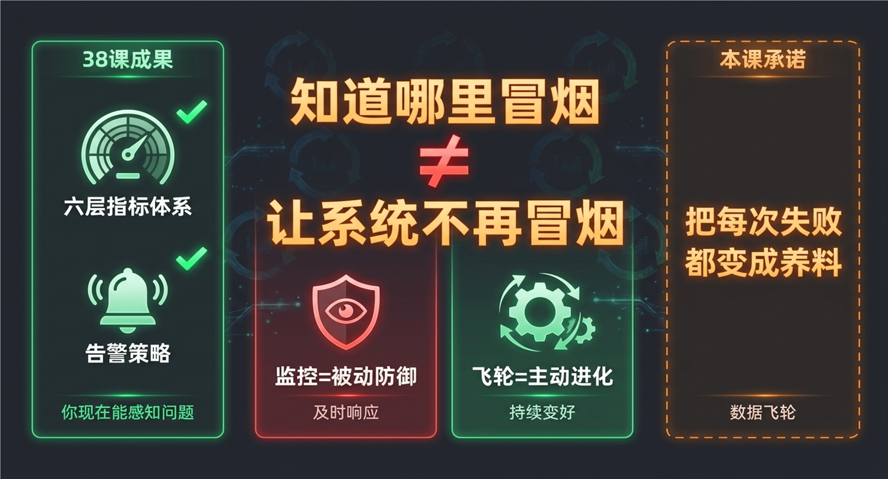
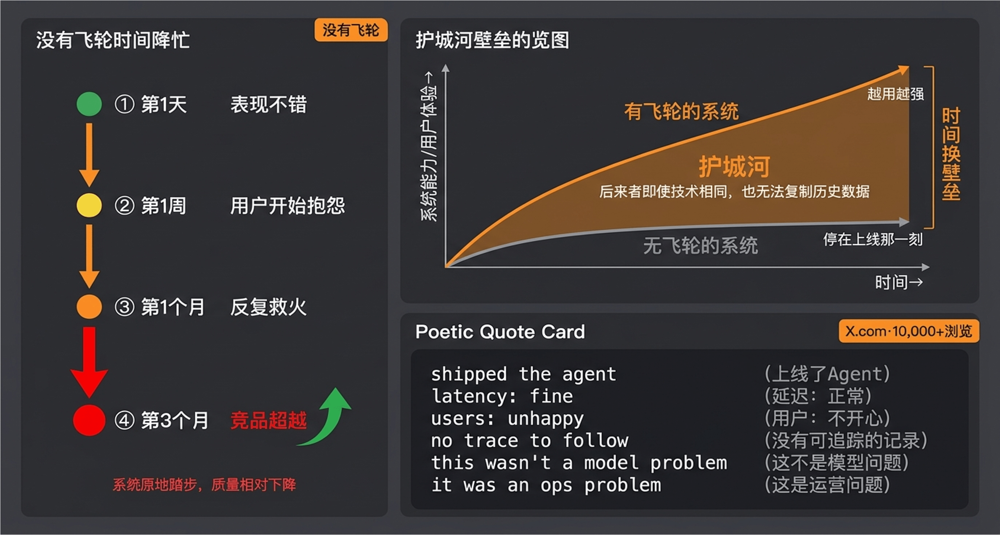
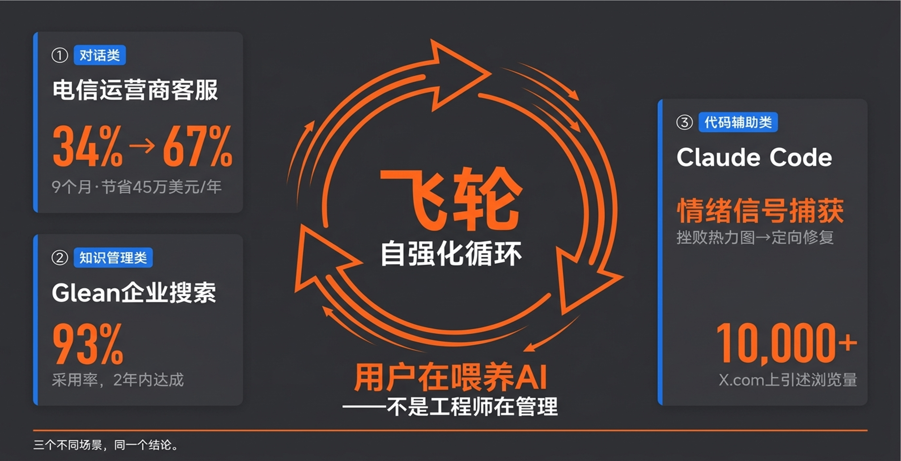
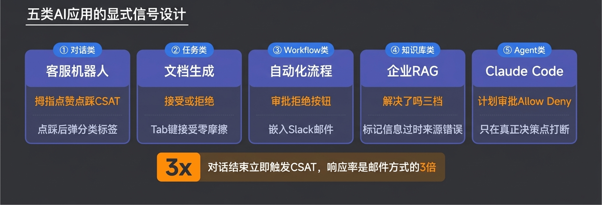
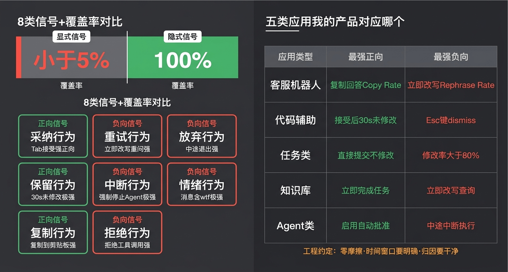
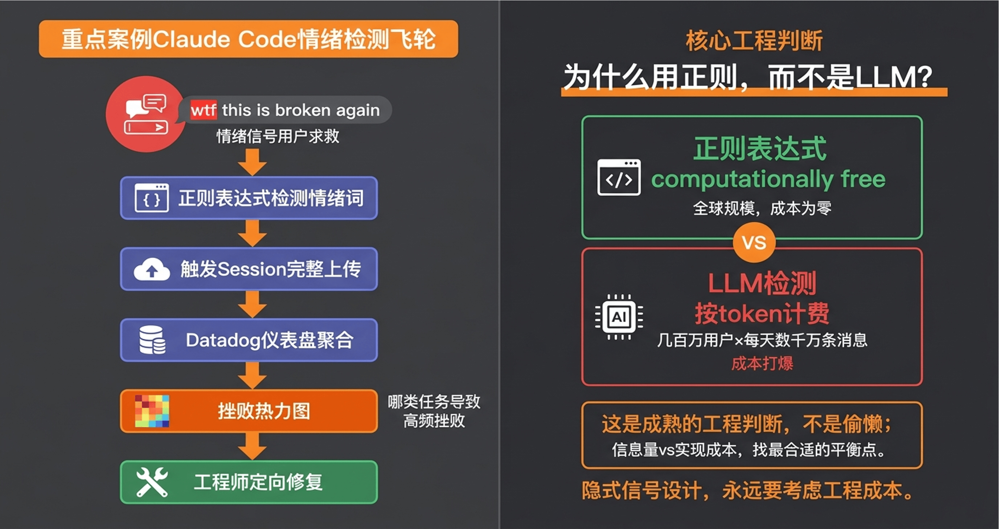
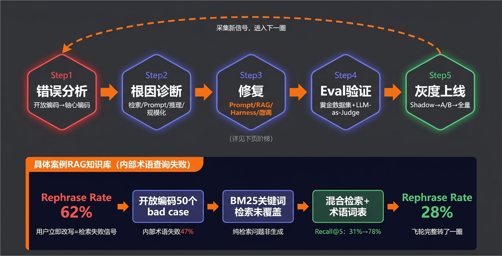
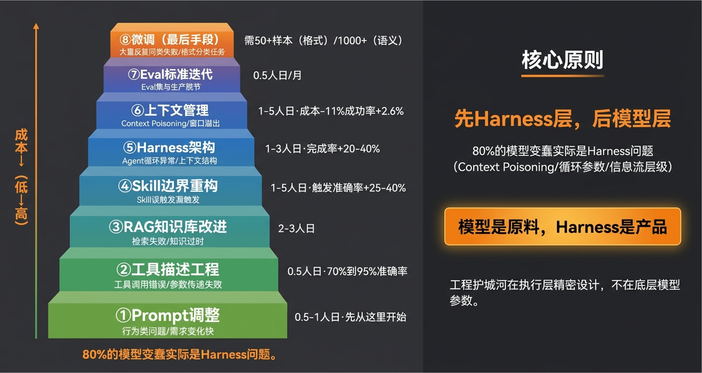
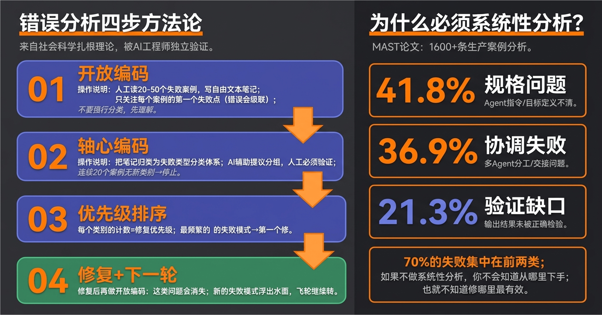

# 39｜数据飞轮：用线上数据持续迭代 AI Agent

> 来源：极客时间《企业级多智能体设计实战》
> 当前播放：39｜数据飞轮：用线上数据持续迭代 AI Agent
> 提取日期：2026-06-02
> 原文长度：11088 字

---

欢迎回来！

上节课，我们给 AI 系统装上了一整套线上监控——六层指标、告警策略、从延迟到用户满意度的全链路感知。你现在能在用户之前发现问题，知道哪里在冒烟。

但知道哪里冒烟，和让系统不再冒烟，是两回事。

监控是**被动防御**，让你及时响应；而这节课要讲的，是**主动进化**——如何把每一次用户交互、每一个失败案例、每一个"它又给出了错误答案"的瞬间，都变成让系统下一次更聪明的养料。这套机制，叫做**数据飞轮**。



没有飞轮的系统，**只能停在线上那一刻的状态**。用户的问题在变，场景在变，而系统原地踏步，质量只会相对下降。更糟糕的是——AI 应用的开发门槛正在快速降低，任何人都能快速搭一个原型上线。真正的护城河不是技术有多先进，而是**你有没有飞轮**——运行得越久，积累的真实失败案例越多，Prompt 越精准，知识库越完善，用户体验越好，用户越多……这个循环一旦转起来，就很难被追上。



飞轮让企业 AI 系统有了**持续进化**的能力。不是因为某个算法有多神奇，而是因为时间在里面——时间越久，数据越多，护城河越深。后来者即使技术完全相同，它没有你的历史数据，就无法复制你的效果。

## 一、认知原点：数据飞轮的本质到底是什么？

**数据飞轮的本质，就是一个把用户行为变成系统改进的自强化循环。**



换成软件工程的话说：你在生产环境里有一个持续运行的系统，用户的每一次操作都在产生信号——有些是主动的反馈（点赞 / 踩），大多数是被动的行为（用户有没有真的采纳 AI 的建议，有没有立即改写重问，有没有在关键步骤中途放弃）。飞轮要做的，是把这些信号系统性地采集→筛选→分析→修复→验证→上线，然后再产生新信号，进入下一轮循环。

```plain
线上用户交互
  → [Step 1] 采集信号（显式反馈 + 隐式行为）
  → [Step 2] 筛选有价值 case，进入 Bad Case 分析管道
  → [Step 3] 构建 / 扩充 Eval 数据集
  → [Step 4] 定向修复（Prompt / 工具描述 / RAG / Harness / 微调）→ Eval 验证 → CI/CD
  → [Step 5] 灰度上线
  → 采集新信号（回到 Step 1，进入下一圈）
```

为什么叫"飞轮"而不是"管道"？因为管道是线性的，跑完一遍就停；飞轮是循环的，而且越转越快——每一圈结束，你手里的数据更丰富，分析更精准，改进更有效，用户体验更好，下一圈的信号质量就更高。

这和传统软件改进的区别很根本：传统软件靠工程师主观判断"哪里需要改"；AI 产品靠用户行为数据**驱动**"哪里需要改、改了之后有没有变好"。**不是工程师在管理 AI，而是用户在喂养 AI。**

三个真实案例，让你看到飞轮跑起来的效果：

**案例 A：电信运营商 AI 客服（对话类）**

某北美电信运营商聊天机器人上线时自动化率只有 **34%**，大量简单问题被迫升级到人工。飞轮的核心信号是"升级率"——当机器人无法解决问题时，系统记录这次失败的完整上下文，定期对这批 session 做人工分析（**开放编码**），识别高频失败类型，补充 FAQ、优化对话流程。9 个月后：自动化率从 34% 升至 **67%**，每年节省约 **45 万美元**。

**案例 B：Glean 企业内部搜索（知识管理类）**

Glean 是一款企业级 AI 搜索和知识管理平台，帮助员工快速查找内部文档和信息。上线初期，员工反馈"查不到想要的文档"——信息分散在 Drive、Slack、Jira 等多个系统，搜索返回的结果往往不对。

飞轮机制：

- 核心信号（显式 + 隐式）： 显式：用户主动标记"未找到答案"、对搜索结果点赞 / 踩 隐式：同一问题的重复搜索次数、搜索会话时长、最终是否找到答案（通过后续行为推断）
- 迭代方式：内容团队每周分析高频未解决问题 → 人工补充 FAQ 或完善文档 → 重新索引 → 验证新员工上手时间是否缩短

效果（明确数据）：

- 新员工入职时间缩短 36 小时
- 每名员工每年节省 110 小时
- IT/HR 支持请求减少 20%
- 2 年内采用率达到 93%

**案例 C：Claude Code（代码辅助类）**

前段时间 Claude Code 源码公开，让我们第一次能看到 Anthropic 的工程设计内部——整个框架里全是遥测埋点，几乎每一个关键路径都有监控节点。Anthropic 正是基于这些埋点数据，进行各种各样的定向修复。这是 Claude Code 成为一套好用工程框架的重要原因：不只是技术出色，而是有飞轮在持续驱动改进。**其中最值得学习的信号设计，我们后面会专门拆解**——用情绪信号捕获用户挫败时刻。

三个完全不同的场景，同样的结论：**飞轮转得快慢，取决于信号收得多不多、准不准。** 那么，信号怎么设计？

## 二、为什么需要飞轮：没有它，系统只能停在线上那一刻

在讲信号设计之前，先回答一个问题：没有飞轮，会怎样？

你的 AI 系统上线了。第一天，它表现不错；第一周，用户开始抱怨"有时候不太准"；第一个月，同样的问题反复出现，团队忙于救火；三个月后，竞品上线了一个功能相似的产品，质量却更好——因为他们有三个月的飞轮数据，而你没有。

**没有飞轮的系统，只能停在线上那一刻的状态。** 时间越久，世界在变，用户在变，问题在变，而系统原地踏步，质量相对只会下降。飞轮要解决的核心问题是：**如何让系统不停在上线那一天，而是随着每一次运行不断变好。**

```plain
shipped the agent
opened the dashboard
latency: fine
error rate: fine
users: unhappy
 
checked the responses
technically correct
wrong tool called 3 steps earlier
no trace to follow
no dataset to reproduce it
no eval to catch it next time
 
this wasn't a model problem
it was an ops problem
```

这段话在 X.com 上获得了超过一万次浏览——因为它写出了太多团队的真实处境。Agent 上线了，技术指标全绿，用户在悄悄流失。你甚至不知道问题出在哪里，因为没有信号采集体系，没有失败案例分析，没有持续迭代的机制。

飞轮的价值，不仅在于"改进"，更在于**护城河**——时间换壁垒。后来者即使技术完全相同，它没有你一年的生产数据，就无法复制你的效果。这就是企业级 AI 系统的核心竞争力：不是你上线那天有多强，而是你能多快地把用户行为变成系统改进。

## 三、飞轮第一步：建立信号采集体系

### （一）显式信号：用户主动告诉你的



显式信号，是用户**主动**响应产品请求的反馈。五类 AI 应用的显式信号设计：

| 应用类型 | 核心信号 | 设计要点 |
| --- | --- | --- |
| 对话类（客服机器人） | 👍/👎 + CSAT | 点👎后弹分类标签；CSAT 趁体验新鲜触发 |
| 任务类（文档生成） | Accept/Reject + 审阅评分 | Tab 键接受零摩擦；关卡太多导致审批疲劳 |
| Workflow 类（自动化流程） | 审批 / 拒绝按钮 | 嵌入 Slack/ 邮件，设置超时机制 |
| 知识库类（企业 RAG） | "解决了吗？"三档 | 让用户标记"信息过时 / 来源错误" |
| Agent 类（Claude Code / Devin） | 计划审批 + 工具调用 Allow/Deny | 只在真正的决策点打断 |

但采集时面临四大挑战：

| 挑战 | 是什么 | 结果 |
| --- | --- | --- |
| 覆盖率不足 | 点赞类信号覆盖率 < 5%，绝大多数交互无反馈 | 飞轮燃料严重不足 |
| 幸存者偏差 | 困惑 / 放弃的用户静默离开，只有顺利完成的用户会给反馈 | 模型向高技能用户偏移，普通用户问题被忽视 |
| 礼貌偏差 | 用户不愿意给差评，尤其在"还过得去"时 | 正向反馈虚高，模型朝谄媚方向飘移 |
| 选择偏差 | 提供反馈的人 ≠ 真实用户群体 | 反馈样本不代表产品实际使用人群 |

其中**礼貌偏差**最值得单独说一说。面对 AI，很多人依然有社交压力——你问用户"这个回答怎么样"，他内心可能已经在默默翻白眼，嘴上却说"还行吧，还好的"，然后礼貌地给你点了个赞。越是"还过得去"的场景，这种偏差越严重。这是人类的本能，不是个别现象——所以依赖显式信号的系统，最终都会向"被接受而非真正有用"的方向漂移。

**设计共识**：减少摩擦（按钮嵌入消息气泡）、负面后追问（分类标签转化率是空文本框 10 倍）、时机决定响应率（对话结束立即触发 CSAT 是邮件方式的 3 倍）。

### （二）隐式信号：让行为本身成为数据

隐式信号，是从用户行为中推断出来的信号——用户没有主动告诉你什么，但**行为本身就是答案**。



| 隐式信号类型 | 典型行为 | 信号含义 |
| --- | --- | --- |
| 采纳行为 | Tab 键接受代码建议、不修改直接发送 AI 起草的邮件 | 正向（强）：对输出满意 |
| 保留行为 | 接受后 30s / 5min 代码未修改 | 正向（极强）：输出真正有用，不是顺手接受 |
| 复制行为 | 复制回答内容到剪贴板 | 正向（强）：认为有价值 |
| 重试行为 | 同一问题立即改写重问 | 负向（强）：上一个回答没解决 |
| 放弃行为 | 中途退出会话 | 负向（强）：体验差或目标未达到 |
| 中断行为 | 在 Agent 执行中强制停止 | 负向（极强）：方向严重偏差 |
| 情绪行为 | 消息中出现"wtf" / “这什么垃圾” | 负向（极强）：用户已沮丧 |
| 拒绝行为 | 拒绝 Agent 的工具调用 | 负向（强）：对操作不信任 |

覆盖率对比：

- 显式信号：< 5%
- 隐式信号：100%——每次交互自动产生，无需用户主动参与

五类应用，核心隐式信号设计：

| 应用类型 | 最强正向信号 | 最强负向信号 | 工程实现 |
| --- | --- | --- | --- |
| 对话类 | 复制回答（Copy Rate） | 立即改写同一问题（Rephrase Rate） | 前端剪贴板事件 + NLP 相似度检测 |
| 代码辅助类 | 接受后 30s 代码未修改（Persistence Rate） | Esc 键 dismiss + 点重新生成 | IDE 键盘事件 + 定时 diff |
| 任务类 | 直接提交不修改（Direct Use Rate） | 修改率 > 80%（近乎全部重写） | 应用层 event tracking |
| 知识库 /RAG 类 | 立即完成任务（Session Success Rate） | 立即改写查询（Rephrase Rate） | 多轮 session 检测 |
| Agent 类 | 启用完全自动批准（Auto-approve Rate） | 中途中断执行（Interrupt Rate） | 权限系统日志 + 会话事件 |

三条工程约定：

1. 零摩擦原则：最好的隐式信号，是用户根本意识不到自己在"评分"
2. 时间窗口要明确：接受后 30s 和 5min 的代码保留，含义不同，必须分别记录
3. 归因要干净：每条信号必须能关联到具体的模型版本和 Prompt 版本，否则无法指导改进

### （四）重点案例：Claude Code 的情绪检测飞轮

隐式信号最有价值的一类，是**情绪信号**——用户在挫败时会在消息里留下线索，这是"求救信号"，也是最需要被捕获的失败场景。



Claude Code 的工程师们发现：当用户输入"wtf this is broken again"或"这什么垃圾"时，背后往往是 Agent 在某类任务上系统性地不可靠。捕获这些情绪信号，能定位到最影响用户体验的失败模式。

他们的实现是：

```plain
用户输入 "wtf this is broken again"
  ↓
useFrustrationDetection（正则匹配检测情绪词）
  ↓
触发 frustration TranscriptShareTrigger
  ↓
submitTranscriptShare 上传完整 session 记录
  ↓
Datadog 仪表盘聚合，形成"挫败热力图"
  ↓
工程师分析哪类任务导致高频挫败 → 定向修复
```

一个值得专门拿出来讲的工程决策：为什么用**正则表达式**而不是**LLM**来检测情绪？

Boris Cherny（Claude Code 工程负责人）的原话是：“computationally free at global scale”。用 LLM 检测每条消息的情绪，在全球规模下成本不可接受——几百万用户、每天数千万条消息，按 token 计费的 LLM 调用会把成本打爆。正则表达式足够简单、快、便宜，在这个场景下比 LLM 更适合，不是偷懒，是成熟的工程判断。

**隐式信号设计永远要考虑工程成本**——不是越精细越好，是在信息量和实现成本之间找到最合适的平衡点。

还有一条更底层的直觉值得记住：**找 bad case 不需要高召回率。** 同样一个问题，有人骂出来，有人忍着没骂——你只要找到那个骂的用户，拿他这一条 case 去迭代就够了。那些浮出来的 bad case，往往你都看不完。先用简单方式能找着就行，找着了再迭代，不要为了"找完整"而在信号采集上过度投入。

## 四、飞轮第二步：用信号驱动迭代

有了信号，下一步是：把信号转化为系统改进。这是飞轮最核心的部分。

### （一）整体迭代流程



```plain
发现 Bad Trace（信号触发 or 主动抽样）
        ↓
[Step 1] 错误分析
  开放编码：人工读 20-50 个 bad trace，写自由文本笔记
  → 轴心编码：归类为失败类型分类体系
  → 按频率排优先级
        ↓
[Step 2] 根因诊断
  检索问题？      → 修 RAG / 工具描述工程
  Prompt 问题？   → 重写 / 加 few-shot
  Harness 问题？  → 上下文管理 / Skill 边界重构
  规模化失败？    → 考虑微调
        ↓
[Step 3] 修复（参见下方修复类型阶梯，共 8 种）
  Prompt / 工具描述 → RAG / Skill → Harness / 上下文 → Eval → 微调
        ↓
[Step 4] Eval 验证
  黄金数据集回归
  LLM-as-Judge（多 Judge 共识，防共模失效）
        ↓
[Step 5] 灰度上线
  Shadow mode → A/B 测试 → 全量
        ↓
监控新信号（确认改进有效，进入下一轮）
```

### （二）一个具体例子：RAG 知识库查不到文档

场景：企业内部知识库 AI，用户频繁投诉"查文档老是查不到"。

**Step 1 错误分析**

从过去一周的 session 里，提取 Rephrase Rate > 60% 的 session（用户立即改写重问 = 检索失败的强信号）。

Open Coding：看 50 个这类 session，不要急着分类，先写自由文本笔记。发现大量查询是内部项目代号（“X2-Alpha 报错怎么处理”）、内部术语（“SKU 合并流程的 SOP”）。

Axial Coding 归类：

- 内部术语查询失败：47%
- 跨文档综合问题：32%
- 文档过时问题：21%

**Step 2 根因诊断**

内部术语查询失败 → 向量模型在公网数据上训练，不懂内部代号 → **BM25 关键词检索覆盖不到这类查询**

这不是生成问题（把正确上下文给模型，它能正确回答）→ **纯粹的检索问题**

**Step 3 修复**

- 增加 BM25 + 向量混合检索（覆盖精确关键词匹配）
- 建立内部术语词表，加入查询扩展

**Step 4 验证**

- 黄金集：50 条历史"内部术语"查询 → Recall@5 从 31% → 78%
- LLM-Judge 对整体回答质量打分：平均 3.2/5 → 4.1/5

**Step 5 上线**

Shadow mode 跑一周，确认无回归。全量上线后：Rephrase Rate 从 **62% 降至 28%**。

这就是飞轮的一个完整循环：一个行为信号（Rephrase Rate 异常高）→ 驱动出根因（检索覆盖缺口）→ 精准修复（混合检索）→ 数据验证（Recall + LLM-Judge）→ 线上验证（Rephrase Rate 回落）→ 进入下一轮。

### （三）修复类型：从低成本到高成本的完整阶梯

修复不再是简单的"Prompt → RAG → 微调"三级，而是一个**多维度决策矩阵**。基于最新工程实践，这里给出完整的修复类型阶梯：



| 修复类型 | 适用场景 | 典型动作 | 最低投入 | 效果上限 |
| --- | --- | --- | --- | --- |
| Prompt 调整 | 行为类问题；需求变化快 | 系统提示优化、Few-shot 示例更新 | 0.5-1 人日 | 有天花板 |
| 工具描述工程 | 工具调用错误；参数传递失败 | 语义原子性拆分、参数命名优化 | 0.5 人日 | 70%→95% 准确率 |
| RAG/ 知识库 | 检索失败；知识过时 | 分块策略、混合检索、文档更新 | 2-3 人日 | 中高 |
| Skill 边界重构 | Skill 误触发 / 漏触发；上下文污染 | 拆分判据三原则、渐进式加载 | 1-5 人日 | 触发准确率 +25-40% |
| Harness 架构 | Agent 循环异常；上下文结构问题 | 执行循环调优、信息流层级重构 | 1-3 人日 | 完成率 +20-40% |
| 上下文管理 | Context Poisoning；窗口溢出 | 压缩策略、Sub-agent 隔离 | 1-5 人日 | 成本 -11%，成功率 +2.6% |
| Eval 标准迭代 | Eval 集与生产脱节；评分偏差 | 分布更新、Grader 标准精化 | 0.5 人日 / 月 | 生产相关性 r>0.7 |
| 微调 | 同类失败大量反复；格式 / 分类任务 | LoRA/SFT | 50+ 样本（格式） | 高，但维护成本高 |

**阶梯原则**：

1. 先 Harness 层，后模型层：80% 的"模型变蠢"实际是 Harness 问题（Context Poisoning、循环参数、信息流层级）
2. 先低成本，后高成本：Prompt/ 工具描述（人日级）→ RAG/Skill（周级）→ Eval/ 上下文（月级）→ 微调（月级 + 数据积累）
3. 根因决定修复方向：失败要分类，不同根因对应不同修复类型

关键洞察：**模型是原料，Harness 是产品**。工程护城河在执行层精密设计，不在底层模型参数。

### （四）错误分析方法论：开放编码与轴心编码

上面例子里的开放编码（Open Coding）和轴心编码（Axial Coding），来自社会科学的**扎根理论**，被工程师群体发现后独立验证：这是目前分析失败案例最系统化的方法。



**完整步骤**：

```plain
第一步 - 开放编码
  • 人工读取 20-50 个失败案例
  • 写自由文本笔记，不要强行分类
  • 只关注每个案例的第一个失败点（错误会向下游级联）
 
第二步 - 轴心编码
  • 把笔记归类为失败类型分类体系
  • 注意：AI 在聚类任务上做得并不好——推荐的做法是人先初步划分几个类别，再让 AI 基于这些类别特征提取共性，最后人工验证；别直接把 50 条 case 扔给 AI 让它自动分组，结果往往差强人意
  • 停止条件：连续 20 个案例没有产生新类别
 
第三步 - 优先级排序
  • 每个类别的计数 = 修复优先级
  • 最频繁的失败模式 → 第一个修
 
第四步 - 下一轮循环
  • 修复后，再做开放编码会看到这类问题消失
  • 新的失败模式浮出水面，飞轮继续转
```

一个量化参考：MAST 论文（分析了 1600+ 条生产案例）用类似方法发现：规格问题占 **41.8%**，协调失败占 **36.9%**，验证缺口占 **21.3%**。你如果不做这类系统性分析，你不会知道 70% 的失败集中在前两类——也就不会知道从哪里下手最有效。

## 五、避坑指南：反模式与最佳实践

基于前面五节的内容，这里提炼**4 个最严重的反模式**（🚫 不要踩的坑）和**4 条最关键的最佳实践**（💡 一定要做的事）。它们各自独立，没有对应关系，都是真实团队的踩坑经验。

### 🚫 反模式（4 条）

**反模式 1：只部署点赞 / 踩，把最懒的信号当核心数据**

**现象**：上线时加了 👍/👎 按钮，就认为"反馈机制有了"，不再投入隐式信号采集。

**致命后果**：点赞 / 踩覆盖率 < 5%，而且极易被 Goodhart’s Law 攻击——如果你只追踪满意度打分，Agent 会学会给出让用户开心而不是让用户正确的答案（Sycophancy）。单维信号必然被奖励黑客行为破坏。GitHub Copilot 的隐式信号（Tab 键接受率）覆盖率 100%，而显式评分覆盖率不到 5%，这就是差距。

**反模式 2：把"模型变蠢"直接归因为模型问题，跳过根因诊断**

**现象**：用户投诉"AI 变笨了"，团队第一反应是"要不要换个模型"或"要不要微调"。

**致命后果**：80% 的"模型变蠢"投诉实际是 context pollution——上下文窗口被垃圾历史记录、格式错误的工具输出或错误的 RAG 文档污染，而非模型本身的问题。直接跳到"换模型"会浪费资源且问题不解决。Claude Code 的 postmortem 显示，六周的"质量退化"来自三个独立的基础设施 Bug，没有一个跟模型有关。

**反模式 3：用合成数据构建微调集，上线后在真实分布上失败**

**现象**：团队 week 2 就决定微调，基于对失败案例的"假设"构建了 1000 条合成训练数据，SFT 后在合成测试集上 SOTA。

**致命后果**：真实用户行为总是和假设不同。合成集覆盖的是你能想象到的边缘场景，而真实失败发生在你根本没想到的地方。结果是：微调后模型在合成测试集上表现极好，在生产中失败的问题依然失败。用合成数据构建的微调集几乎必然失败。

**反模式 4：飞轮太慢——收集了数据但没有闭环更新机制**

**现象**：团队建立了日志采集、用户反馈收集，但数据在数据库里沉睡。没有触发分析的机制、没有负责人、没有更新 Prompt/RAG/Eval 的 SOP。

**致命后果**：只收不用，数据仓库不是飞轮。真实案例：团队积累了 6 个月生产数据，但从未用它更新过任何 Eval 用例。飞轮根本没有转起来。时间越久，数据越多，护城河反而越浅——因为你没有把它转化为改进。

### 💡 最佳实践（4 条）

**最佳实践 1：用"AI 建议 + 用户验证"的 UX 范式构建天然标注工厂**

**落地心法**：把产品交互本身设计成数据采集管道——AI 主动给出建议，用户接受 / 修改 / 拒绝。接受 = 正标签；修改后接受 = 负 + 正对（pairwise，适合训练偏好模型）；拒绝 = 负标签。这套模式的数据采集转化率，比"请给我们打分"高 **10 倍**，而且是自然发生的，不需要用户任何额外操作。GitHub Copilot 的飞轮核心就是 Tab 键接受率，Midjourney 的核心就是图片保存 / 下载行为。

**最佳实践 2：优先挖掘隐式信号，把行为数据变成飞轮燃料**

**落地心法**：用户行为比用户评分更诚实。对于代码类产品追踪 Tab 键接受率；对于内容类产品追踪复制 / 分享 / 下载行为；对于任务类产品追踪下游业务动作是否发生（订单完成、工单关闭）。用工具调用序列分析识别"技术上正确但路径错误"的静默失败（如：wrong tool called 3 steps earlier）。显式信号是"黄金标签"但覆盖率 < 5%，隐式信号是"行为数据"覆盖率 100%，两者都要，缺一不可。

**最佳实践 3：遵循"先 Harness 层，后模型层"的修复决策顺序**

**落地心法**：80% 的"模型变蠢"实际是 Harness 问题（Context Poisoning、循环参数、信息流层级）。修复优先级：(1) **Prompt/ 工具描述**（最快，0.5 人日）；(2) **RAG/Skill 边界**（周级）；(3) **Harness 架构 / 上下文管理**（1-3 人日）；(4) **Eval 标准迭代**（0.5 人日 / 月）；(5) **微调**（最后手段，需 1000+ 真实样本）。**模型是原料，Harness 是产品**——工程护城河在执行层精密设计，不在底层模型参数。

**最佳实践 4：把专家"品味"显式化，编码进系统提示和 Eval 标准**

**落地心法**：“Taste is invisible until you try to write it down”。系统性地访谈领域内最优秀的分析师 / 客服 / 运营，让他们描述具体决策过程（“为什么这个答案好 / 不好”），把这些隐性判断标准提炼为 Prompt 中的显式规则和 Eval 的评分锚点。这个过程本身就是飞轮的一部分：隐性知识显式化 → 可复制 → 可测试 → 可改进。飞轮不仅改进模型，还改进团队对"好"的理解。

## 课程总结

- 我们定义了数据飞轮的本质：一个把用户行为信号变成系统改进的自强化循环，越转越快，越转越深；
- 我们认识到没有飞轮的系统只能停在线上那一刻：时间越久，世界在变，用户在变，系统原地踏步，质量只会相对下降。飞轮让企业有了时间换壁垒的能力；
- 我们建立了完整的信号采集体系：显式信号是"黄金标签"（但覆盖率 < 5%，且有四种偏差），隐式信号是"行为数据"（覆盖率 100%），两者都要，缺一不可；
- 我们跑通了从信号到修复的完整迭代流程：开放编码 → 轴心编码 → 根因诊断 → Prompt/RAG/Harness/Skill/Eval/ 上下文 / 微调（完整阶梯）→ Eval 验证 → 灰度上线；
- 我们理解了飞轮为什么是护城河：后来者即使技术相同，没有历史数据就无法复制。关键不是上线那天多强，而是能多快把用户行为变成系统改进。

>
> 下节课预告： 既然系统能越用越聪明了，那谁来运营这个系统？谁来决定飞轮转得够不够快？下一节课，我们将进入整个课程的最后一讲——组织进化，从"如何做 AI"切换到"如何成为做 AI 的人"。我们下节课见！
>

## 课后思考题

>
> 费曼检验：不用专业术语，用一句话把"数据飞轮"解释给一个没学过 AI 的同事听——他只需要听懂"为什么 AI 会越用越聪明"就够了。
>

**思考题 1（知识迁移）**：你现在在做或即将要做的 AI 产品，它的核心隐式信号是什么？用户做了什么行为，能说明 AI 的回答"好"或"不好"？如果你明天就要开始采集，你会先捕捉哪个信号？

**思考题 2（精细质询）**：为什么"用合成数据构建微调集"几乎必然失败？真实用户行为和团队的"假设"之间，差距到底在哪里？

**思考题 3（主动回忆）**：不看课文，说出开放编码和轴心编码的区别，以及各自的停止条件。如果你明天要对 50 个失败案例做分析，你会怎么操作？

欢迎在评论区分享你的真实案例，我们下一讲见！
---

来源：极客时间《企业级多智能体设计实战》
提取日期：2026-06-02
