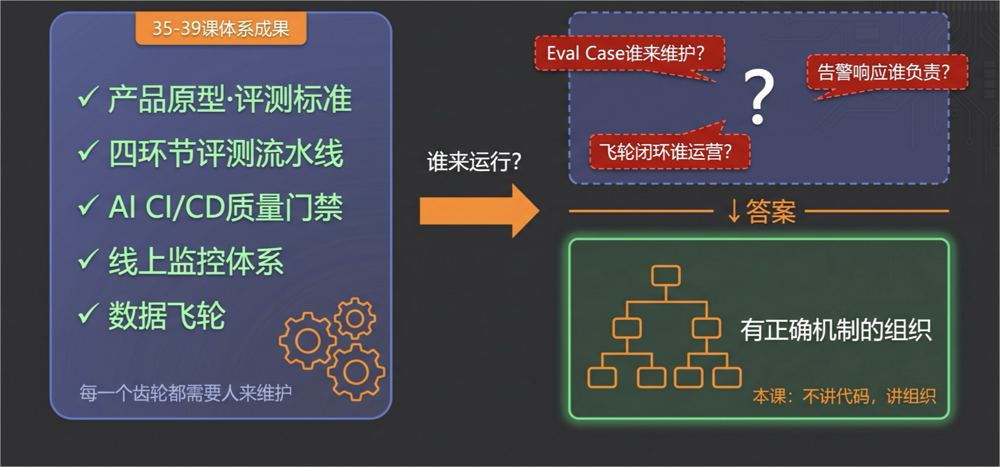
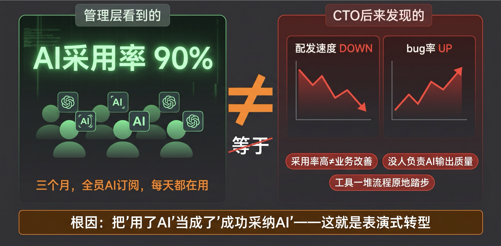
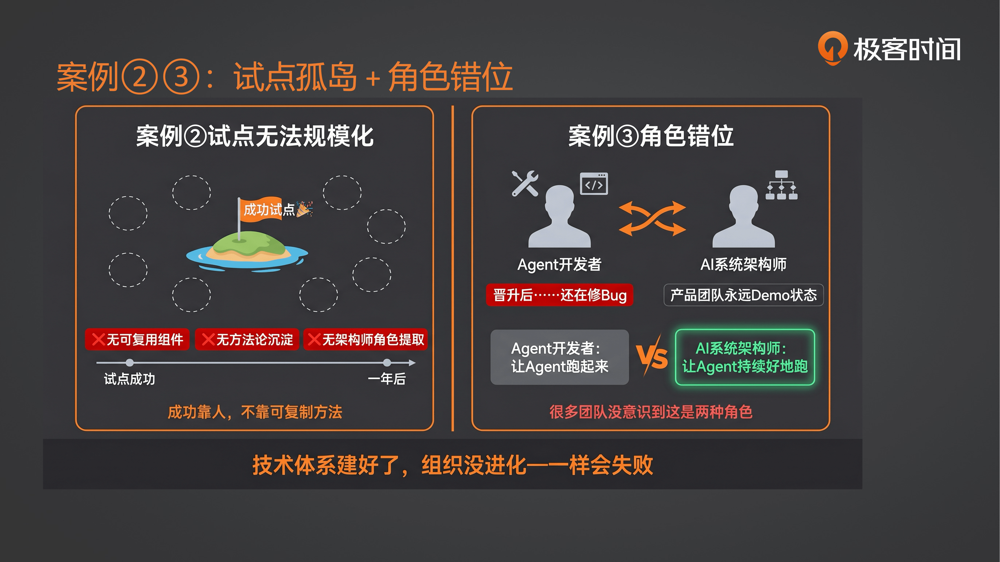
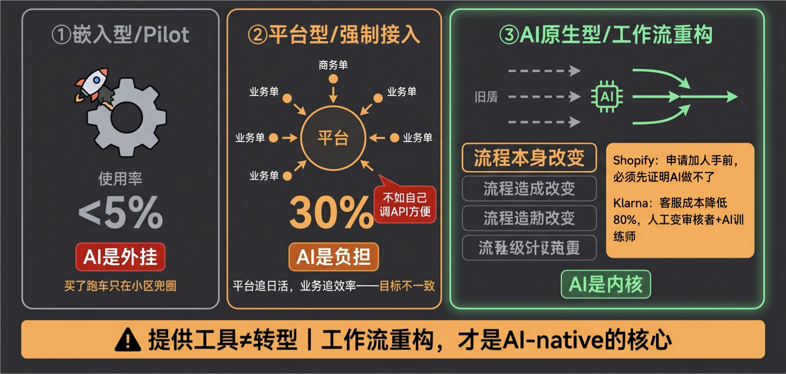
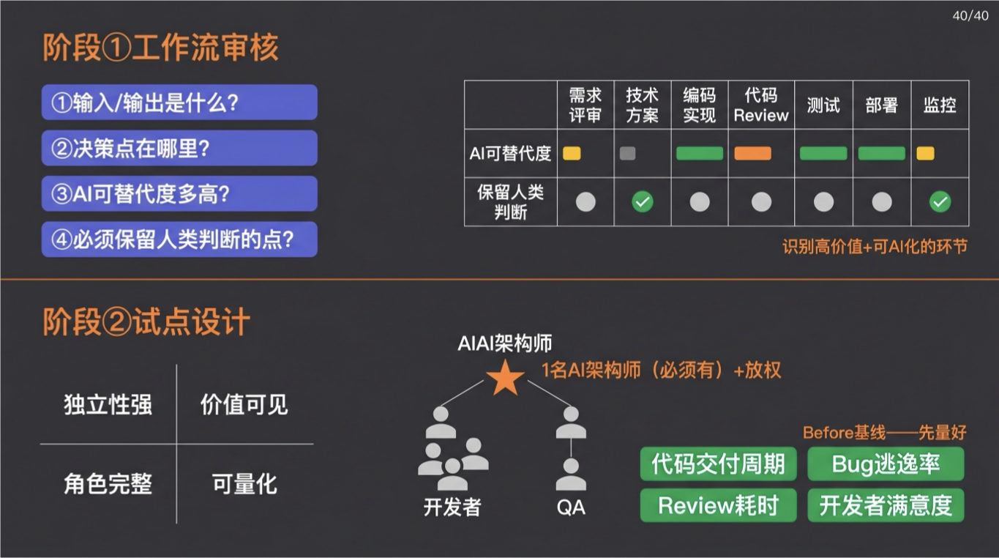
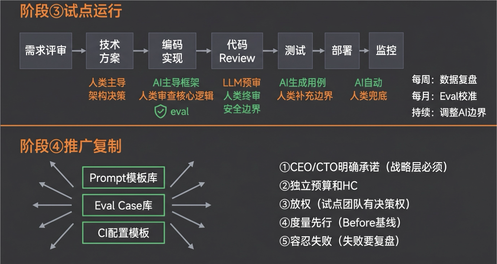
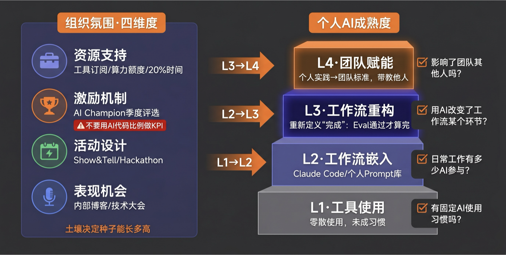
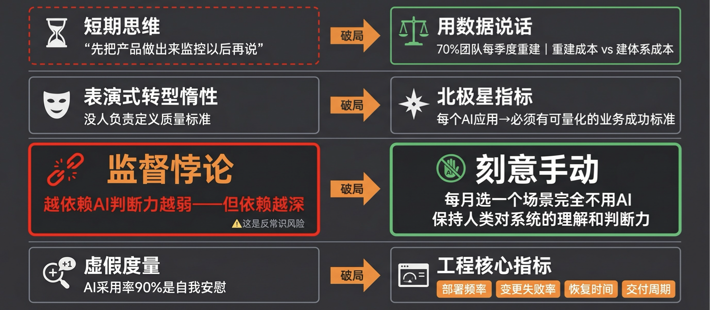

# 40｜组织进化：从表演式转型到AI原生组织

> 来源：极客时间《企业级多智能体设计实战》
> 当前播放：40｜组织进化：从表演式转型到AI原生组织
> 提取日期：2026-06-02
> 原文长度：6709 字

---

## 谁来运行这套体系？

上节课，我们讲了**数据飞轮**——如何把线上生产数据回流到 Eval 体系，让 AI 应用越用越聪明。39 课是整个工程体系的最后一个齿轮。



但我想问你一个问题：这套体系建好了，谁来运行它？

我们花了 5 节课（35-39 课），讲了产品原型、评测体系、持续集成、线上监控、数据飞轮。评测需要人维护 Eval Case，CI/CD 需要人定义质量门禁，监控需要人响应告警，数据飞轮需要人运营闭环。这套体系运转，依赖的是什么？

**依赖的是组织**——有了正确机制的组织。

这节课，我们不讲代码，讲组织。这节课有两个关键词：**表演式转型**（大多数团队正在经历的），和**AI 原生组织**（我们要走向的）。讲什么样的组织，才能真正让这套体系运转起来。

## 一、三个真实失败案例

技术体系建好了，但组织没有进化，一样会失败。先看三个案例，搞清楚"表演式转型"长什么样。

### 案例一：表演式转型陷阱



某公司给所有员工买了 AI 订阅，天天盯着采用率、采样率各种数据，激动地汇报：“AI 用起来了，采用率 90%！”

但业务负责人发现不对劲：产出不升反降，代码 Bug 率反而飙升。工具流程做了一大堆，但几乎原地踏步。

根因是什么？**拿着锤子在找钉子，然后不停强调锤子。** 用采纳率这个指标来管锤子，但采纳率高不等于业务效率改善——工具买了一堆，流程还是老样子，只是演了一场"我们在 AI 转型"的戏。

**什么是"表演式转型"？**

这就像公司组织团建，每个人都到场了、拍照了、发朋友圈了，看起来热热闹闹，但团队的凝聚力并没有真正提升。AI 领域的"表演式转型"就是指：组织里每个人都在"用 AI"（有工具、有账号、有使用数据），但工作流本身没有变化，质量没有提升，效率没有改善——只是演了一场"我们在 AI 转型"的戏。

**典型症状**：

- AI 采用率很高，但业务指标没有变化
- 每个人都在"尝试 AI"，但没人对 AI 输出质量负责
- 工具买了一堆，流程还是老样子

### 案例二：试点无法规模化——从成功到僵局



某公司做了一个成功的试点：先找几个 AI 觉醒的人，拉出来让他们自己干，做出了成果，试点成功。

但一年后，这个"成功试点"还是只有那几个人在跑，其他业务线并没有采用——有的是没法复制，有的是不愿意复制。那几个人也就能起到几个人的作用，无法成为整个组织的规模化 AI 转型。

**问题出在哪里？**

- 没有可复用组件：试点团队的 Prompt、Eval Case、CI 配置都是为特定场景定制的，其他业务线无法直接复用
- 没有方法论沉淀：试点成功是"靠这个团队的人"，而不是"靠一套可复制的方法"
- 没有组织机制：没有 AI 系统架构师角色去提取可复用组件，没有评审机制去推广

**解法**：试点设计阶段就要考虑"可复用"——哪些是通用的（Prompt 模板、Eval Case 库、CI 配置），哪些是定制的（业务特定逻辑）。试点成功后，先把可复用组件提取出来，再推广。

### 案例三：角色错位

**场景一**：某 Agent 开发高手被提拔为 AI 架构师，但他每天还在修 Bug、调 Prompt。没人告诉他，现在的职责是**设计质量标准**，不是亲自解决技术问题。

**场景二**：产品团队全是 Agent 开发者，擅长快速搭 Demo。但没人思考：Agent 上线后，失败 Case 怎么收集？质量退化怎么发现？结果就是永远在 Demo 状态，进不了生产。

**核心问题**：“Agent 开发者"和"AI 系统架构师"是两种不同角色。前者关注"让 Agent 跑起来”，后者关注"让 Agent 持续好地跑"——后者需要的是让整个团队、整个项目以 AI 原生的方式运行，能组织起人来改变工作方式。很多团队没意识到这个区别。

## 二、三种转型现状

调研发现，企业的 AI 转型有三种类型。其中两种都是**表演式转型**。



### 类型一：嵌入型（Pilot 模式）

**特征**：1-2 个 AI 专员做试点，产出方法论，但团队整体工作流未变。

**典型案例**：某银行 AI 实验室，产出 20+AI 工具，业务部门使用率 <5%。实验室与业务脱节，沦为"技术展示"。

**根因**：AI 是"外挂"，不是"内核"。就像买了辆跑车但只在小区兜圈，没真正上高速。

### 类型二：平台型（强制接入）

**特征**：建立统一 AI 平台，要求业务团队"在平台上做"，但工作流本身未根本改变。

**典型案例**：某大厂 AI 中台，使用率 30%，活跃用户反馈"不如自己调 API 方便"。业务团队觉得"为了用平台而用平台"，增加了负担。

**根因**：平台团队追求"日活"，业务团队追求"效率"，目标不一致。

### 类型三：AI 原生型（工作流重构）

**特征**：从工作流程出发，问"这件事用 AI 应该怎么做"。不是"把 AI 加到原流程"，而是"用 AI 重新定义流程"。

**关键标志**（按优先级排序）：

1. 流程的改变（最核心）：原有工作流的某个环节被 AI 重构，不是"AI 辅助原流程"，而是"新流程"
2. 决策方式改变：哪些由 AI 决策，哪些必须人决策，边界清晰
3. 交付物形态改变：从"代码"变成"AI 可消费的 Prompt/Eval Case"
4. 质量定义改变：从"人觉得好"变成"可量化的 AI 系统质量"
5. 迭代方式改变：从"版本发布"变成"持续 Eval + CI/CD"

**标杆案例**：

- Shopify AI-First Mandate（2025）：CEO Tobi Lutke 要求"申请增加人手前，必须证明 AI 做不了这件事"
- Klarna AI Transformation：客服成本降低 80%，人工从"执行者"变成"审核者 +AI 训练师"

>
> 记住这句话：提供工具 ≠ 转型。工作流重构，才是 AI 原生的核心标志。
>

前两种类型的核心问题都是——以为"提供工具 = 转型"，忽略了"工作流重构"才是 AI-native 的核心。

## 三、AI 原生组织怎么搭（上）：自上而下

以"代码交付工作流"为例，展示完整转型路径。



### 阶段一：工作流审核

**传统代码交付流程**：

```plain
需求评审 → 技术方案设计 → 编码实现 → 代码 Review → 测试 → 部署上线 → 线上监控
```

**涉及角色**：产品经理、技术负责人、开发工程师、代码审查者、测试工程师、运维工程师、SRE。

**审核方法**：对每个环节问四个问题：

1. 输入 / 输出是什么？
2. 决策点在哪里？
3. AI 可替代度多高？
4. 必须保留人类判断的点是什么？

**代码交付场景的 AI 化评估**：

| 环节 | AI 可替代度 | 保留人类判断 |
| --- | --- | --- |
| 需求评审 | 中 | 复杂业务逻辑理解 |
| 技术方案 | 低 | 架构决策、技术选型 |
| 编码实现 | 高 | 复杂算法、核心逻辑 |
| 代码 Review | 中高 | 架构合规、安全边界 |
| 测试 | 高 | 边界场景设计 |
| 部署 | 高 | 生产事故处理 |
| 监控 | 中 | 根因分析 |

**关键产出**：识别出"高价值 + 可 AI 化"的环节（编码、Review、测试、部署），以及"必须保留人类"的环节（架构决策、安全边界）。

### 阶段二：试点设计

**选择标准**：

- 独立性强：与其他系统耦合度低，失败不影响核心业务
- 价值可见：成功后有明确的效率或质量提升
- 角色完整：包含完整工作流中的关键角色
- 可量化：有清晰的 Before/After 度量指标

**示例**：选择内部工具模块做试点

- 团队配置：1 名 AI 架构师 + 2-3 名开发（高 AI 接受度）+ 1 名 QA（负责 Eval 标准）
- 放权：试点团队有权限选择工具、定义流程、调整 Eval 标准

**度量基线**（Before 数据）：

- 代码交付周期（需求到上线平均天数）
- Bug 逃逸率（生产 Bug 数 / 总 Bug 数）
- 代码 Review 耗时（平均小时数）
- 开发者满意度



### 阶段三：试点运行

**新工作流设计**（以代码交付为例）：

**需求评审**：AI 辅助生成需求理解文档，人类决策确认业务逻辑完整性。

**技术方案**：人类主导架构设计，AI 辅助生成技术方案模板。

**编码实现**：

- AI 主导：Claude Code 生成代码框架
- 人类审查：核心逻辑确认
- Eval 检查：自动跑单元测试 + 静态检查

**代码 Review**：

- AI 预审：LLM-as-Judge 预审代码质量
- 人类终审：架构合规 + 安全边界判断
- Eval 反馈：Review 质量评分

**测试**：AI 生成测试用例，人类补充边界场景。

**部署**：AI 监控自动部署，人类兜底生产事故。

**线上监控**：AI 检测异常 + 自动回滚，人类分析根因。

**运行与评价**：

- 每周数据复盘：对比 Before/After 指标
- 每月 Eval 校准：AI 生成的质量是否在提升
- 持续迭代：根据数据调整 AI 参与边界

### 阶段四：推广复制

**可复用组件**：

- Prompt 模板库（编码、Review、测试生成）
- Eval Case 库（代码质量标准）
- CI 配置模板（AI 门禁流水线）

**推广策略**：

- 从独立模块→核心业务模块
- 从试点团队→其他团队（经验分享 + 培训）
- 建立 AI 系统架构师评审机制

**度量验证**（组织级）：

- 部署频率变化
- 变更失败率变化
- 恢复时间变化
- 交付周期变化

**关键成功因素**：

1. CEO/CTO 明确承诺（战略必须）
2. 资源重新分配（独立预算和 HC）
3. 放权（试点团队有决策权）
4. 度量先行（Before 基线清晰）
5. 容忍失败（失败要有复盘）

## 四、AI 原生组织怎么搭（下）：自下而上

当组织想推动自下而上的 AI adoption 时，核心抓手是**组织氛围建设**。但最终目标不是"组织氛围好"，而是**让每个人变得 AI 原生**。



### 组织氛围四维度

**维度一：资源支持**

- AI 工具订阅统一采购（Claude Pro、Copilot、ChatGPT Team）
- 算力预算池：每人每月固定额度
- 20% 时间政策：允许用 20% 工作时间实验 AI
- AI Hackathon：季度性的创新 hackday

**维度二：激励机制**

- AI Champion Program：季度评选"AI 创新之星"
- 内部技术大会演讲机会
- 技术影响力：优秀实践写入内部技术博客
- ⚠️ 避免：用"AI 代码生成比例"作为 KPI——这会催生出更精细的表演式转型

**维度三：活动设计**

- AI Show & Tell（双周）：分享最近的 AI 实践
- Prompt Engineering Workshop（月度）：学习 Prompt 技巧
- AI Hackathon（季度）：用 AI 解决实际问题

**维度四：表现机会**

- 内部技术博客发表
- 技术大会演讲
- 工具化推广：个人工具变团队工具
- 导师制度：AI Champion 带教其他工程师

### 个人 AI 成熟度模型

组织氛围建设的最终目标，是让每个人的 AI 成熟度从 L1 进阶到 L4。

**L1：工具使用**

- 用 Copilot 写代码，用 ChatGPT 查资料
- 特征：零散使用，未形成工作流
- 检验标准：你是否有固定的 AI 使用习惯？

**L2：工作流嵌入**

- 把 AI 嵌入日常工作流（Claude Code 替代部分编码）
- 建立个人 Prompt 库
- 用 AI 做代码 Review 辅助
- 检验标准：你的日常工作有多少比例有 AI 参与？

**L3：工作流重构**

- 重新定义"完成"的标准（从"代码写完"到"Eval 通过 +CI 通过"）
- 建立个人 Eval 习惯
- 主动沉淀 Eval Case
- 检验标准：你是否用 AI 改变了工作流的某个环节？效果有没有提升？（别到时候弄完了以后全是 Bug）

**L4：团队赋能**

- 把个人工作流变成团队标准
- 培训其他成员
- 建立团队 Eval 共享库
- 检验标准：你的实践是否影响了团队其他人？

**成熟度进阶路径**：

- L1→L2：需要资源支持（工具、时间）
- L2→L3：需要激励机制（认可、表现机会）
- L3→L4：需要活动设计（分享、带教）

## 五、组织进化的阻力与破局



### 阻力一：短期思维 vs 长期系统

- 症状：“先把产品做出来，评测监控以后再说”
- 破局：用案例说话——70% 团队每季度重建的根因是"系统不可维护"；估算"重建成本"vs"建评测体系成本"

### 阻力二：表演式转型惰性

- 症状：团队觉得在做 AI 转型，但没人负责定义质量标准
- 破局：引入北极星指标——每个 AI 应用必须有可量化的业务成功标准

### 阻力三：监督悖论的自我强化

- 症状：团队对 AI 判断能力越来越弱，但依赖越来越深
- 破局："刻意手动"机制——每月选一个场景，完全不用 AI，由工程师手动完成，维持对系统的原始理解

### 阻力四：虚假度量自我安慰

- 症状：用"AI 代码采纳率 90%"自我安慰，实际处于表演式转型
- 为什么采纳率是假指标：同样是采纳率 100%，但你改了 50 次才让 AI 给出正确代码——这个效率，和一变 AI 就搞定完全不一样。采纳率量不了这个差距。你应该量的是：北极星指标里，这件事情的产出到底变好了还是变坏了。
- 破局：换用工程核心指标——部署频率、变更失败率、恢复时间、交付周期。能说出这四项数值，才说明 AI 转型在真正发生。

## 六、结束章——40 节课之后

### 第一部分：收获感——你学到了什么

还记得开篇词里说的三个困惑吗？

>
> “概念满天飞，上手却无门”——现在你能从 0 到 1 搭一个生产级 AI 应用了。
>
> “Demo 变生产的买家秀落差”——现在你掌握了评测、CI/CD、监控，让 Demo 能真正进生产。
>
> “知识体系碎片化”——现在你有了完整地图：什么时候用单 Agent，什么时候用 Multi-Agent，什么时候上评测，什么时候建监控。
>
> 这 40 节课给你的不只是技术，而是一套判断标准——知道什么时候该用什么，什么时候不该用什么。
>

### 第二部分：成长感——你能做到什么

**如果你已经能**：

- 看到团队的 AI 转型，能判断它是"表演式转型"还是真正的工作流重构
- 为一个 AI 应用写出"必须为真"的质量约束，建立 Eval 体系
- 设计过一次试点：选对模块、定好基线、提取可复用组件
- 用部署频率、变更失败率这类工程指标，而非"AI 采用率"，和管理层讨论 AI 进展

**说明你已经在走向 AI 原生了**——不只是会用工具，而是能推动组织进化。

**如果你还做不到**——没关系。成长不是线性的，每个人有自己的节奏。

**你可以这样继续**：

1. 回看这 40 节课的图文版，圈出你还不太确定的部分，比视频省时间。
2. 选一个真实项目，把这 40 节课的内容喂给 AI，让 AI 基于这些方法论 review 你的项目——你往往能有意想不到的发现。
3. 记录 Before/After，用数据证明你的成长。
4. 用费曼方式分享出来——如果你能把这套课教给别人，那你才是真的理解了。

### 第三部分：祝福——出发吧

走完这 40 节课，你已经比大多数人走得更远。坦白说，这节课的完课率挺低的——我有时候怀疑是不是我讲得有问题。但没关系，能听到现在的你，应该能收获很多了。

**最后，提醒一件重要的事**：用 AI 学习，要当心"假学习"。

AI 给你总结完，你看着那短短几行，觉得"啊，我好像懂了"——但实际上没有。用 AI 学习，AI 会加速你的成长，也会加速你的"假学习"。

**请保留那种憋了很久才想出来的痛苦。** 那是每个工程师成长最特别的 moment，也是你真正在成长的证明。请保护好它，不要让 AI 替你消除了这种痛苦。

你现在拥有的稀缺能力：在生产环境里，对 AI 系统的质量**负责任**；在组织里，能推动**真正的**AI 转型，而不是表演。

**带着这张地图，去做一件真实的事吧。**

我是晓寒。感谢你走完这 40 节课。

我们，都在路上。

## 课后思考题

**费曼检验**：用一句话，把"表演式转型"和"工作流重构"的区别解释给你的同事听——不许用专业术语。

**思考题一**：你目前所在的团队，属于嵌入型、平台型还是 AI 原生型？用这节课的四个关键标志（流程、决策、交付物、迭代方式）逐一对照，找出最大的差距是哪里。

**思考题二**：如果你要在你的团队推动一次"自上而下"的工作流重构试点，你会选哪个工作流作为起点？按照独立性、价值可见、角色完整、可量化这四个标准评估一下你的选择。

课程结课问卷填写[入口](https://jsj.top/f/BYQKeg)
---

来源：极客时间《企业级多智能体设计实战》
提取日期：2026-06-02
