# 直播回放｜吃透 Claude Code 核心源码：架构设计与工程细节全解析

> 来源：极客时间《企业级多智能体设计实战》
> 当前播放：直播回放｜吃透 Claude Code 核心源码：架构设计与工程细节全解析
> 提取日期：2026-06-02
> 原文长度：27252 字

---

## 一、Claude Code 的真实身份

大家好，今天这场直播的主题有点不一样。我们不是来讲怎么用 Claude Code 写代码的——那是使用层面的事情。我们今天要做的，是把它当成一个工程样本来解剖。

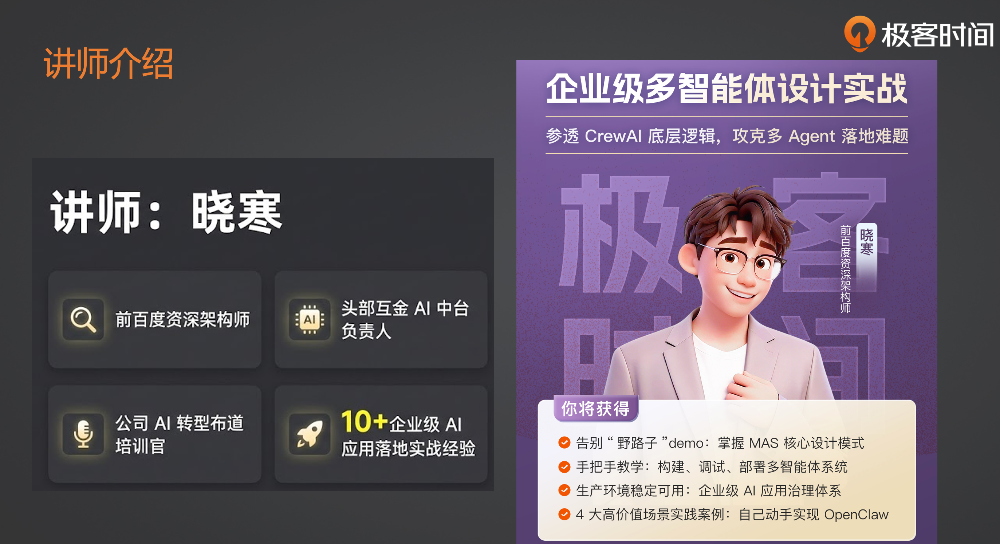

先问大家一个问题：你们有没有想过，Claude Code 是什么？

大多数人的第一反应是：AI 编程助手，Copilot 的升级版。这个认知是对的，但只对了一半，而且是不重要的那一半。

**Claude Code 更重要的身份是：Harness 的权威实现样本。**

什么是 Harness？这里有一个公式：

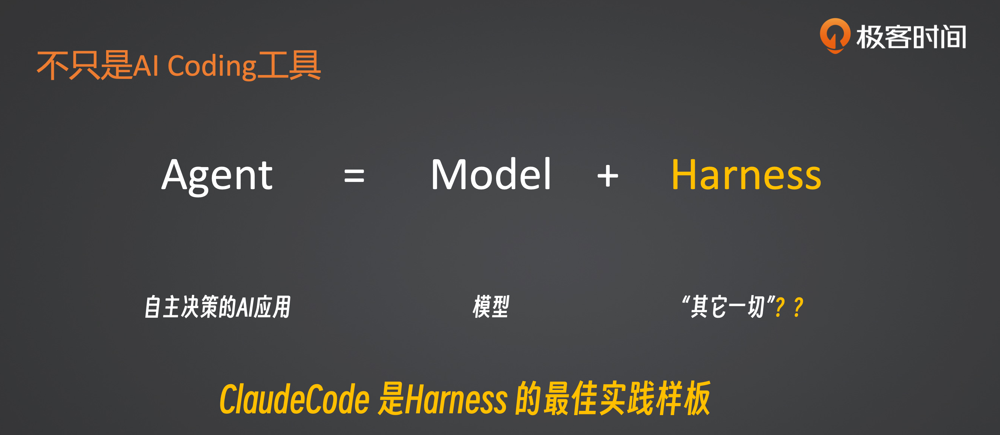

Model 是模型本身，就是 Claude 3.7。Harness 是除了模型以外的一切——上下文管理、工具链、记忆系统、多 Agent 协作机制、安全管控体系。

说到 Harness 这个词，它本身的语义演变也值得梳理。Harness 最早来自测试领域，是一个工程术语。被引入 AI 领域时，Anthropic、OpenAI 最初用它来指"驾驭 agent 本身"——驾驭的对象是 agent，不是模型。在 Harness 概念被引入 AI 领域的早期讨论中，OpenAI 等公司提出的 Harness 三大支柱是：context engineering（上下文工程）、约束（constraint）、定期垃圾回收（garbage collection）——关注的是如何让 Agent 工程运转得更好。后来 LangChain 等框架把这个概念大幅泛化：Harness 变成了"构建 agent 除了模型以外的一切"。这个泛化让概念变得极度宽泛，也让很多人感到混乱。但看 Claude Code 源码，你就能看清楚这个概念的真实内核。

我们搞 AI 应用开发这么久，Model 的问题早就解了——调 API 就好了。真正让人头疼的是 Harness：上下文应该怎么组织？工具应该怎么接入？Agent 之间怎么通信？安全边界怎么画？这些问题一直没有权威的参考答案。

直到 2026 年 3 月底，Anthropic 意外泄露了 Claude Code 的完整源码——60MB 的 Source Map，51.2 万行 TypeScript，23 分钟内被发现，6 小时 300 万浏览量。这件事的工程意义远超任何技术博客：**Anthropic 官方，用生产级代码，告诉了你一个商业级 Harness 应该长什么样。**

今天，我带你们把它拆开看。

---

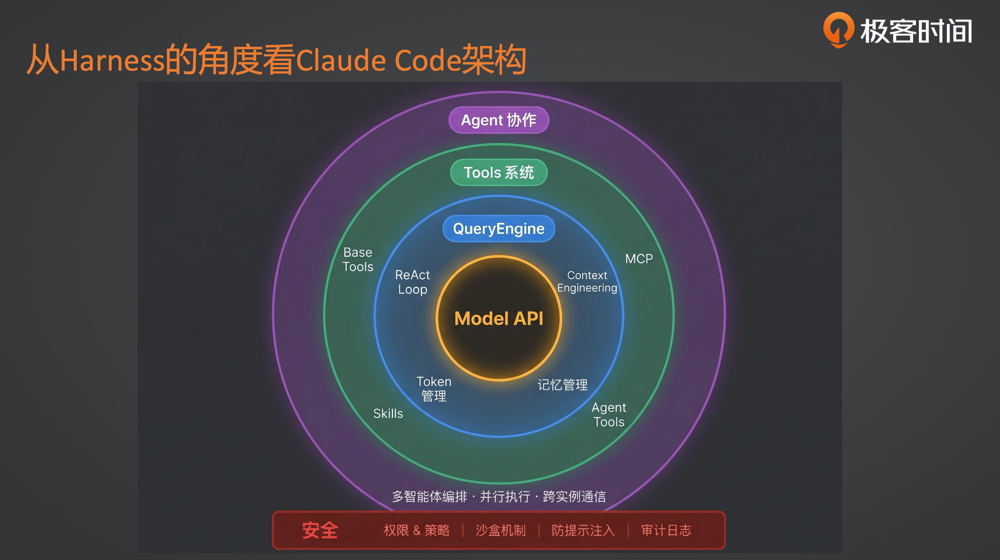

## 二、架构全景：Harness 的五大支柱

先看全局。很多分析文章喜欢把 CC 拆成技术分层（入口层、UI 层、查询引擎……），但那是代码组织视角，对我们学 Harness 设计没有太大帮助。

我换一个视角——**从 Harness 组件视角来看 CC 的架构**：

五大支柱：

1. 上下文系统：System Prompt + System Content + User Content，决定模型"知道什么"
2. 工具系统：52 个（含实验性工具）内置工具 + MCP + Skills + Agent OS，决定模型"能做什么"
3. 记忆系统：MEMORY.md 索引 + autoDream 整合，决定模型"记得什么"
4. Agent 协作：5 种模式的多 Agent 编排，决定"任务怎么分工"
5. 安全系统：权限 + 沙箱 + 注入防御 + 审计，决定"边界在哪里"

这五个支柱围绕同一个核心——`query.ts` 里的 Agentic Loop。我们今天就从这个核心开始，往外逐层展开。

技术栈补充说明：CC 用 TypeScript 全栈，React/Ink 写终端 UI（是的，用 Web 技术写终端），Bun 运行时打包（解决 Node 启动慢的问题）。整个项目 1,902 个 TS 文件。

---

## 三、核心循环：query.ts 的 AsyncGenerator 状态机

如果你只能从 CC 源码里学一件事，我建议是这个——`query.ts` 里的 Agentic Loop 实现方式。

### 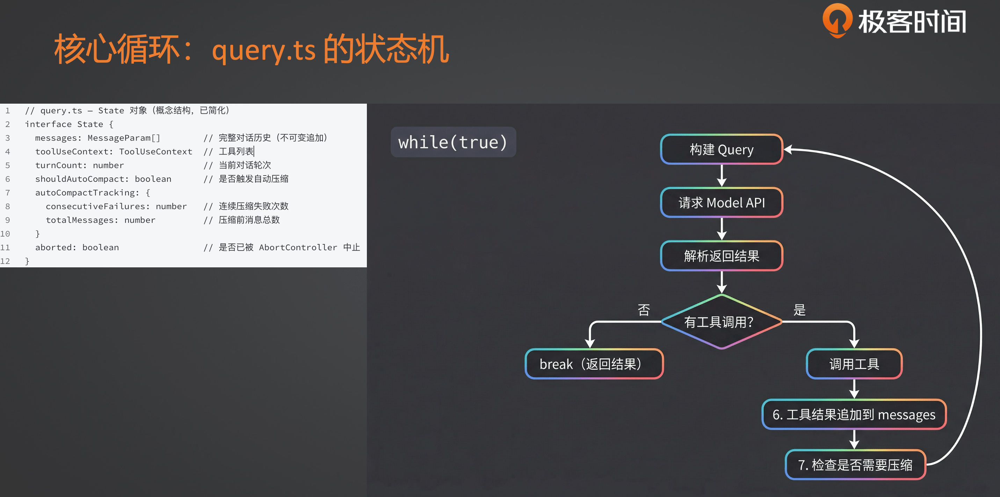

### State 数据结构

先看 State 对象。CC 的 query loop 维护一个**不可变的 State 对象**，每一轮迭代不修改旧 State，而是返回新 State：

```typescript
// query.ts — State 对象（概念结构，已简化）
interface State {
  messages: MessageParam[]        // 完整对话历史（不可变追加）
  turnCount: number               // 当前对话轮次
  shouldAutoCompact: boolean      // 是否触发自动压缩
  autoCompactTracking: {
    consecutiveFailures: number   // 连续压缩失败次数
    totalMessages: number         // 压缩前消息总数
  }
  aborted: boolean                // 是否已被 AbortController 中止
}
 
// 状态转换：纯函数，不可变
function next(current: State, reason: string, overrides?: Partial<State>): State {
  return { ...current, ...overrides }
}
```

这里有一个设计选择值得注意：为什么要用不可变 State？因为 Agentic Loop 是多轮迭代，如果允许就地修改状态，调试时你完全不知道哪一轮把状态改坏了。不可变设计让每一轮的状态转换都是可追踪、可重放的。

### queryLoop 的完整流程

`queryLoop()` 是 `async function*`（异步生成器），实现了 while(true) 无限循环：

```typescript
// query.ts:241 — 概念简化版
async function* queryLoop(state: State, tools: Tool[], systemPrompt: string) {
  while (true) {
    // ① 调用 Claude API，获取流式响应
    const stream = await callAPI(state.messages, tools, systemPrompt)
 
    // ② 消费流式响应，实时 yield 给 UI
    for await (const chunk of stream) {
      yield { type: 'stream_chunk', data: chunk }  // UI 实时更新
    }
 
    // ③ 判断是否有工具调用
    const toolUses = extractToolUses(stream.finalMessage)
    if (toolUses.length === 0) {
      return  // 模型只回复文本，循环结束
    }
 
    // ④ 执行工具调用（可能触发权限检查）
    const toolResults = await executeTools(toolUses, state)
    yield { type: 'tool_results', data: toolResults }
 
    // ⑤ 状态转换：追加消息，进入下一轮
    state = next(state, 'tool_results', {
      messages: [...state.messages, stream.finalMessage, ...toolResults],
      turnCount: state.turnCount + 1
    })
 
    // ⑥ 检查是否需要压缩（Token 阈值）
    if (shouldCompact(state)) {
      state = await runCompaction(state)
    }
  }
}
```

### 以一条请求为例走完全流程

假设你输入：“帮我分析一下这个项目的目录结构”

```plain
用户输入 → REPL.tsx:onSubmit
    ↓
handlePromptSubmit.ts → processUserInput
    ↓
构建三路上下文（并行）：
  ├── getSystemPrompt()      → System Prompt（5 级优先级决策）
  ├── getSystemContext()     → gitStatus + Agent 工具列表
  └── getUserContext()       → CLAUDE.md + 当前日期
    ↓
query.ts:query() → queryLoop(state, tools, systemPrompt)
    ↓
[轮次 1] API 请求 → Claude 回复："我需要先看看目录结构"
       → 工具调用：Bash("ls -la")
       → 权限检查：Allow（只读命令）
       → 执行：返回目录列表
       → yield tool_result → UI 显示执行过程
    ↓
[轮次 2] API 请求（带 ls 结果）→ Claude 回复："目录结构如下..."
       → 无工具调用
       → yield 最终回复 → UI 显示结果
    ↓
queryLoop 退出（return）
```

`for await...of queryLoop(...)` 让 UI 层可以实时消费每一个 yield 出来的事件，这就是你看到的"流式输出"效果。AsyncGenerator 把"多轮迭代 + 流式推送 + 状态管理"三件事用一个语法糖优雅地合成了。

**给自己项目的启示**：你的 Agentic Loop 也应该是状态机，State 不可变，每轮转换可追踪，用 AsyncGenerator 或类似机制做流式推送。不要用回调嵌套，那是调试地狱。

---

## 四、上下文管理：三路并行组装 + System Prompt 深解

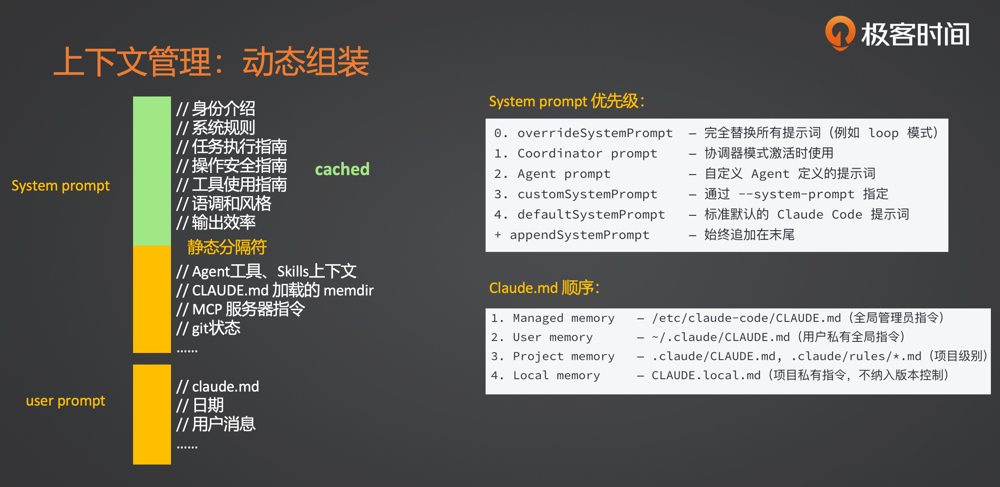

### 三路并行组装

每次用户提交消息，CC 会并行构建三路上下文：

```typescript
// REPL.tsx:2768-2789 — 三路并行
const [, , defaultSystemPrompt, baseUserContext, systemContext] = await Promise.all([
  checkAndDisableBypassPermissionsIfNeeded(...),
  checkAndDisableAutoModeIfNeeded(...),
  getSystemPrompt(freshTools, ...),     // ① System Prompt
  getUserContext(),                       // ② User Content
  getSystemContext()                      // ③ System Content
])
```

三路分工很清晰：

**① System Prompt**（`buildEffectiveSystemPrompt()`）

5 级优先级，从高到低：

| 优先级 | 类型 | 触发条件 |
| --- | --- | --- |
| 0 | overrideSystemPrompt | loop 模式、特殊场景 |
| 1 | Coordinator prompt | COORDINATOR_MODE=1 时替换 |
| 2 | Agent prompt | 当前是自定义 Agent 时替换 |
| 3 | customSystemPrompt | –system-prompt 参数指定 |
| 4 | defaultSystemPrompt | 默认 CC prompt |
| + | appendSystemPrompt | 始终追加到末尾 |

**② System Content**（`getSystemContext()`）：注入到 system 消息末尾

- gitStatus：实时 git 状态（标记为 uncached section，每轮重算）
- Agent 工具可用列表 + 每个工具的 whenToUse 描述
- MCP server 列表、Skills 列表

**③ User Content**（`getUserContext()`）：包装为**第一条 user 消息**

- CLAUDE.md（四层层级：企业 > 用户全局 > 项目 VCS > 本地）
- 当前日期
- 特意包装为 user 消息而非 system 消息——这样 CLAUDE.md 可以独立命中 prompt cache

### System Prompt 静 / 动分界：省钱的关键

`getSystemPrompt()` 返回 `string[]` 数组而不是单一字符串，每个片段可独立缓存：

```plain
[静态段，全局可缓存]
  ├── getSimpleIntroSection()       身份介绍
  ├── getSimpleSystemSection()      系统行为规范
  ├── getSimpleDoingTasksSection()  任务执行指南
  ├── getActionsSection()           操作安全指南
  ├── getUsingYourToolsSection()    工具使用指南
  ├── getSimpleToneAndStyleSection() 语调风格
  └── getOutputEfficiencySection()  输出效率
 
SYSTEM_PROMPT_DYNAMIC_BOUNDARY   ← 分界线
 
[动态段，每轮重算]
  ├── session_guidance             Agent 工具、Skills 上下文
  ├── memory                       MEMORY.md 内容
  └── gitStatus（uncached）        当前 git 状态
```

静态段跨 session 全局缓存，这不是小优化——每次请求省掉几千个 token，在高频调用场景下节省的成本相当可观。

### 从 CC 的 System Prompt 中可以学到什么

CC 的 defaultSystemPrompt 实际上就是你我现在用的 CC 版本里的 system prompt（就是这次对话里的 system 消息！）。拆开看，有几个工程细节值得学习：

**1. 安全规则用 IMPORTANT 前缀，独立维护**

```plain
IMPORTANT: Assist with authorized security testing...
IMPORTANT: You must NEVER generate or guess URLs...
```

这两条 IMPORTANT 来自独立的 `cyberRiskInstruction.ts` 文件，由 Safeguards 团队单独维护，修改需要特别审批。工程启示：**把安全规则和业务规则分开维护，防止一次重构把安全边界删掉。**

**2. 工具使用指南写"什么时候用什么工具"，而不是"工具能做什么"**

大多数人写 system prompt 只告诉模型工具的能力，CC 额外写了使用场景：

```plain
"For simple, directed searches use Glob/Grep directly.
 For broader exploration, use the Explore agent—it's slower,
 only when a single search isn't enough."
```

这让模型能做更好的工具选择路由决策。

**3. 输出效率指南是专门的一节**

```plain
# Output efficiency
Go straight to the point. Try the simplest approach first.
Lead with the answer or action, not the reasoning.
```

专门一节告诉模型怎么回复才算"高效"。这是 Anthropic 对用户体验的强制约束，写在 prompt 层面而不是模型训练层面——更灵活，可以被 `customSystemPrompt` 覆盖。

---

## 五、Token 管理：3 层降级压缩的完整 Pipeline

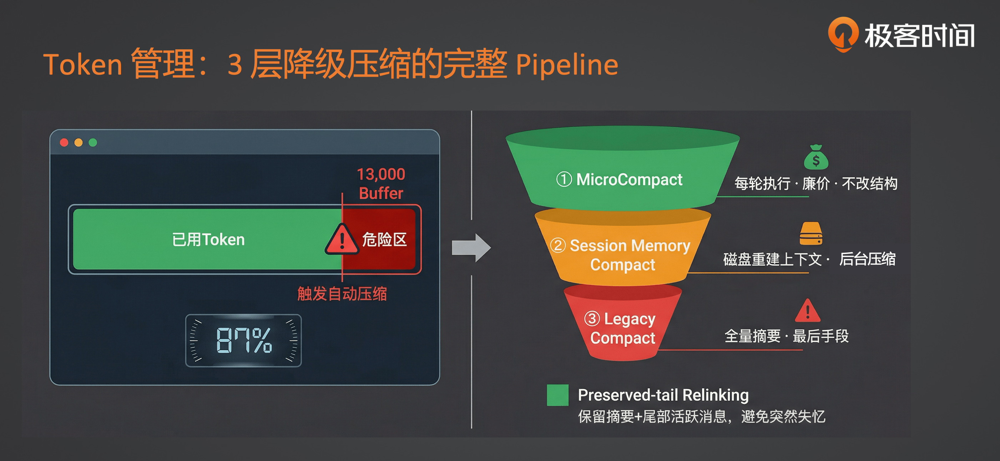

### 触发条件

```typescript
// autoCompact.ts:62
const AUTOCOMPACT_BUFFER_TOKENS = 13_000
 
// 触发条件：当前消息占用的 token > (model_context_window - 13000)
if (currentTokens > contextWindow - AUTOCOMPACT_BUFFER_TOKENS) {
  triggerCompaction()
}
```

13,000 的 buffer 是为了给模型留出足够的生成空间，确保压缩完还能继续对话。

### 完整压缩 Pipeline

压缩不是一个操作，是一个有降级逻辑的 Pipeline：

```plain
触发压缩
    ↓
Step 1: MicroCompact（每轮执行，廉价）
    → 按配置保留最近 N 轮的消息（默认 10 轮），N 轮之前的 tool result 直接裁剪
    → 最长的 message 就是 tool result，裁掉老轮次后 context 长度大幅受控
    → 不调 API，不改对话结构
    → 实现：src/query.ts:413-426，createMicrocompactBoundaryMessage
 
    ↓ 仍然超出阈值？
 
Step 2: Session Memory Compact（读预生成摘要，无 API 调用）
    → 读取 session_memory.md（后台 Agent 预先写好的对话摘要文件）
    → getLastSummarizedMessageId() 找到摘要边界
    → 保留边界之后的消息 + 摘要内容 → 重组上下文
    → 完全不需要调 Claude API
    → 实现：src/services/compact/sessionMemoryCompact.ts:514-630
 
    【session_memory.md 何时生成？】
    正常对话进行中，每隔 N 次工具调用（toolCallsBetweenUpdates=3）
    且 token 增长超过阈值（minimumTokensBetweenUpdate=5000）时，
    registerPostSamplingHook 触发 → runForkedAgent() 后台提炼关键信息
    → 写入 session_memory.md，记录 lastSummarizedMessageId
    （用户无感知，对话照常进行；这里才有 API 调用，但与压缩无关）
 
    关键点：** 预压缩是后台异步完成的，用户完全无感知 **。当对话进行中，token 使用量超过一定比例时，CC 就会异步将当前消息上下文存到磁盘，并同步启动后台压缩。等到真正触发阈值时，从磁盘直接加载已压好的内容，速度极快。
 
    用户的体验差异来自这里：有时压缩一闪而过，有时要等很久——前者是命中了磁盘预压缩，后者是触发了第三层全量 Legacy Compact（需要实时生成大量 output token，就像早期 Cursor 的压缩一样让人等得焦急）。
 
    ↓ 失败？（session_memory.md 不存在 / 为空）
 
Step 3: Legacy Compact（全量摘要，最昂贵）
    → 调 Claude API，让模型对历史对话生成摘要
    → 追加压缩边界标记（compactBoundary）
    → 未来加载时，从边界之后开始，边界前的内容丢弃
    → 实现：src/services/compact/autoCompact.ts
    → 成本：一次完整的 API 调用（但这是最后手段）
```

值得注意：Legacy Compact 不是"自由文本摘要"——CC 要求模型按结构化 JSON 格式（含用户问题、todo 清单、澄清事项等标准字段）输出压缩结果，确保摘要内容可机械处理、结构一致。

### Preserved-tail Relinking：防止突然失忆

Legacy Compact 有一个精妙设计——压缩时不仅保留摘要，还保留一段"最近活跃消息尾部"：

```plain
压缩结果 = [历史摘要] + [compactBoundary 标记] + [最近 N 条活跃消息]
```

为什么要保留尾部？因为如果你正在中途实现一个功能，压缩后模型只看到"之前做了什么"的摘要，但没有"刚刚在做什么"的上下文，就会出现"突然不知道我在干嘛了"的问题。Preserved-tail 保留了当前工作集，让对话在压缩后仍然连贯。

**用户感受到的"Claude 忘了"**，通常不是真的遗忘——是边界截断 + 摘要替换 + 尾部保留在尽力维持，只是摘要质量不够精确导致的信息失真。

**给自己项目的启示**：三层降级设计的核心思想是"按成本激活"——能不调 API 就不调，磁盘方案解决了再不行才调模型。你自己的压缩策略也应该有降级层次，而不是一刀切。

---

## 六、长期记忆：克制哲学与两条后台通道

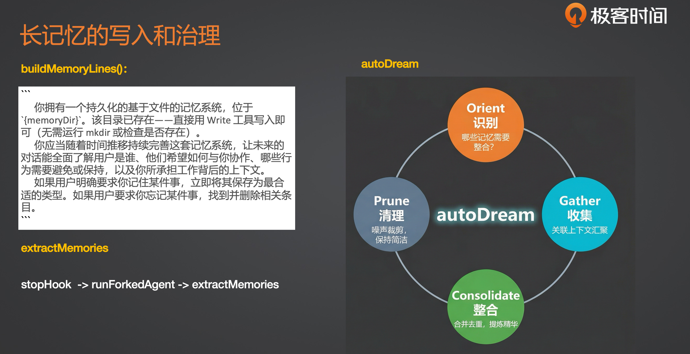

很多人说 OpenClaw 比 Claude Code 好的一点，是长记忆做得更好。但这个判断不准确——CC 的长记忆能力一点也不差，差的是**对普通用户开放程度**。

### 为什么很多人觉得 CC 记忆不行？

CC 没有任何专门用来写记忆的工具或 Skill。它唯一依赖的，是 system prompt 里的一段话，大意是：

>
> 你拥有一个持久化的基于文件的记忆系统。你应该随着时间推移持续完善这套记忆系统，让未来的对话能全面了解用户是谁、他们希望如何与你协作……如果用户明确要求你记住某件事，立即将其保存为最合适的类型。
>

这段 prompt 有两层触发逻辑：

- 模糊触发：随时间推移主动维护——但这个指令极度模糊，模型遵循度通常不高
- 确定触发：用户明确要求记住某件事——这是 CC 直接写记忆的唯一可靠触发条件

结论：**你必须明示 CC “记住这件事”，它才会主动写记忆。** 靠它自行判断，基本不会触发。

### 克制是设计选择，不是能力缺失

CC 的克制是刻意为之。它的核心场景是代码开发，宁可少记，也不希望把记忆搞乱——一个混乱的记忆库对代码助手来说比没有记忆更糟糕。

相比之下，OpenClaw 的策略是激进写入——“只要能记的，全都记住”。两种哲学各有取舍：CC 追求精准，OpenClaw 追求完整。

### 机制 1：extractMemories（需环境变量开启，普通用户不可用）

这是 CC 里一个"藏起来"的主动记忆机制。开启后，每当模型完成一轮完整的 react loop（stop hook 时机——模型把最终结果返回给用户的那个时点），CC 会把当前的完整 message list fork 出来，交给一个后台 SubAgent 专门做记忆提取：

```plain
每轮 react 完成（stop hook）
  → 将完整 message list fork 给后台 SubAgent（用户无感知）
  → SubAgent 从本轮对话中主动提取值得保留的信息
  → 写入 CC 的 memory 体系（MEMORY.md 及相关文件）
```

这样等于每轮对话结束后都会主动扫描是否有值得记的内容，而不是等用户明说。

代价是：**不再克制**。自动提取意味着可能记错、记不该记的内容，或记下对后续毫无帮助的东西——这正是这个功能需要手动开关的原因。

### 机制 2：autoDream（需内部开关，普通用户不可用）

autoDream 是解决 extractMemories"可能记错"问题的配套机制——相当于记忆的**垃圾回收**。

名字来自仿生学类比：人在睡眠时大脑不会停止工作，会把白天的事情过一遍，把需要记的归类记住，把不需要记的"睡一觉就忘了"。autoDream 做的是同样的事。

触发条件：**每隔约 24 小时，闲时自动运行**。每次触发后扫描当前工作空间，4 个阶段完成整合：

```plain
Phase 1: Orient — 扫描 MEMORY.md + 所有 CLAUDE.md，识别哪些记忆需要整合
Phase 2: Gather — 捞取相关上下文，聚合碎片化信息和反复出现的主题
Phase 3: Consolidate — 合并同主题条目，去重提炼，覆盖写入 MEMORY.md
Phase 4: Prune — 删除过时信息、噪声、冲突条目，保持记忆库精简干净
```

autoDream 的价值：**让工程空间能持久运转而不劣化**。没有 GC 的记忆系统，时间长了会充满过时、冲突、重复的信息，最终变得不可用。这对应 Harness 三大支柱里的"定期垃圾回收"。

目前对普通用户不可用，但这个思路值得借鉴——你自己的 Agent 工程也应该有对应的 autoDream 机制。

### 互斥保护

模型可以直接用 `FileWriteTool` / `FileEditTool` 写 MEMORY.md（显式指令时），但**模型直写和后台 extractMemories 互斥**——两者不能同时写同一文件，防止竞态覆盖。

**给自己项目的启示**：CC 的记忆设计核心是"克制 + 定期整合"——不主动乱记，但用定期 GC 保持记忆质量。对于自己的 Agent 项目，比堆记忆数量更重要的是设计好**记忆的清理机制**：没有 Prune 的记忆系统会越来越重，最终拖慢而不是增强 Agent 的能力。

---

## 七、工具系统：统一接口 + 三层过滤

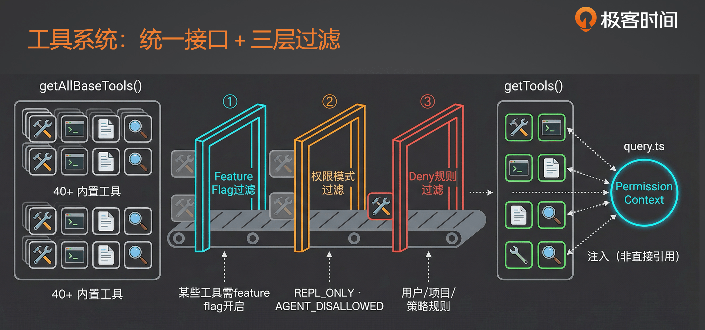

### 工具的统一接口

CC 的所有工具都实现同一个泛型接口：

```typescript
// Tool.ts — 核心接口
interface Tool<Input, Output, P extends ToolPermissionContext> {
  name: string                    // 工具名（全局唯一）
  description: string             // 模型看到的描述（影响路由决策）
  inputSchema: ZodSchema<Input>   // 输入校验（Zod）
  outputSchema: ZodSchema<Output> // 输出类型
  call(input: Input, ctx: ToolUseContext<P>): Promise<ToolResult<Output>>
  prompt: string                  // 工具使用指南（写入 System Prompt）
  permissionRule?: PermissionRule // 权限规则
}
```

注意 `ToolUseContext<P>` 里的 `P` 是 `ToolPermissionContext`——权限上下文是**注入**给工具的，工具本身不主动引用权限模块。这是依赖注入模式：权限由 query.ts 构建，再通过 context 传递给每个工具调用，工具和权限系统完全解耦。

### 三层过滤：从 52 个工具到实际可用集

```plain
getAllBaseTools()    ← 所有内置工具（52 个，含实验性工具）
    ↓
Feature Flag 过滤：
  某些工具需要 feature flag 开启才能加载
  例如：KAIROS 相关工具、Coordinator 专用工具
    ↓
权限模式过滤：
  REPL_ONLY_TOOLS：只在 REPL 模式可用（不能给 Agent 用）
  ALL_AGENT_DISALLOWED_TOOLS：Agent 禁用的工具集
  ASYNC_AGENT_ALLOWED_TOOLS：后台 Agent 可用工具
  COORDINATOR_MODE_ALLOWED_TOOLS：Coordinator 可用工具
    ↓
Deny 规则过滤：
  用户 / 项目 / 企业策略的 deny 规则
    ↓
getTools()          ← 当前上下文的实际可用工具集
 
---
```

## 八、工具能力层：基础工具清单 + MCP + Skills

### 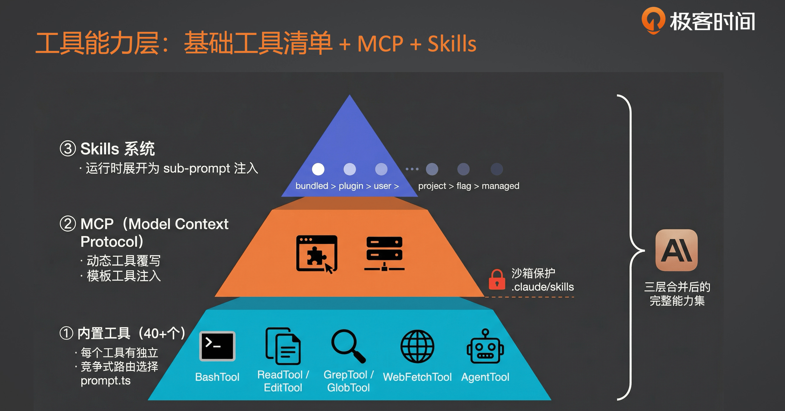

### 基础内置工具完整列表

CC 的内置工具按功能分为以下几组：

**文件系统工具**

| 工具名 | 说明 |
| --- | --- |
| Read | 读取文件内容，支持分页（offset/limit） |
| Write | 写入整个文件（新建或覆盖） |
| Edit | 精确字符串替换，比 Write 更安全 |
| Glob | 文件模式匹配，按修改时间排序 |
| Grep | 基于 ripgrep 的内容搜索，支持正则 |
| LS | 列出目录文件 |
| NotebookRead | 读取 Jupyter Notebook 含输出 |
| NotebookEdit | 修改 Notebook Cell |

**Shell 执行**

| 工具名 | 说明 |
| --- | --- |
| Bash | 执行 shell 命令，支持前 / 后台、超时、沙箱 |

**Web 工具**

| 工具名 | 说明 |
| --- | --- |
| WebFetch | 抓取网页内容（含权限规则） |
| WebSearch | 调用搜索引擎 |

**Agent 工具**

| 工具名 | 说明 |
| --- | --- |
| Agent | 派生子 Agent（5 种模式的统一入口） |
| SendMessage | 向 Swarm teammate 发消息 |
| TaskOutput | 读取后台 Agent 的输出 |
| TaskStop | 终止后台 Agent |

**任务管理**

| 工具名 | 说明 |
| --- | --- |
| TodoWrite | 写入 / 更新任务列表 |
| TodoRead | 读取任务列表（某些模式下） |
| CronCreate | 创建定时任务 |
| CronDelete | 删除定时任务 |
| CronList | 列出定时任务 |

**工作模式**

| 工具名 | 说明 |
| --- | --- |
| EnterPlanMode | 进入 Plan 模式（只规划不执行） |
| ExitPlanMode | 退出 Plan 模式 |
| EnterWorktree | 进入 git worktree 隔离环境 |
| ExitWorktree | 退出 worktree |

**交互工具**

| 工具名 | 说明 |
| --- | --- |
| AskUserQuestion | 向用户提出结构化选择题 |
| Skill | 调用已注册的 Skill |
| RemoteTrigger | 触发远程定时任务 |

**每个工具都有独立的**`prompt.ts`，这是一个竞争式路由设计——模型读完每个工具的描述后，自主决定用哪个。工具描述的质量直接影响模型的工具选择质量。

### MCP 集成

MCP 工具通过 `@modelcontextprotocol/sdk` 动态注入，有一个特殊的设计：**模板工具覆写**。

如果 MCP 工具和内置工具同名，MCP 工具可以覆盖内置工具的行为。这给了第三方极大的扩展空间。但有一条安全防线：**沙箱始终阻止写入**`.claude/skills`，这和保护 agents 定义文件是同等级别的防护，防止恶意 MCP server 注入自定义 Agent 定义。

### Skills 系统

Skills 是一种"可复用的 sub-prompt 包"：

```plain
6 种来源（按优先级）：
bundled > plugin > user > project > flag > managed
 
运行时行为：
调用 Skill 工具 → 展开为 sub-prompt → 注入当前对话
```

Skills 不是工具，是 prompt 的组合方式。每个 Skill 就是一段结构化的指令，调用时展开插入对话，让模型"临时掌握"某种专项能力。

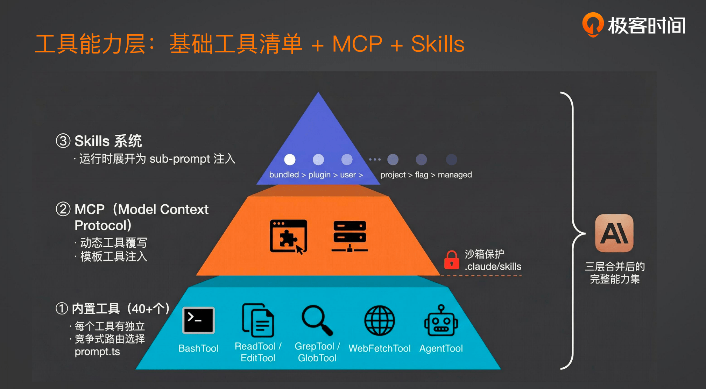

## 九、Agent 协作：从场景出发选择 5 种模式 %0A%0A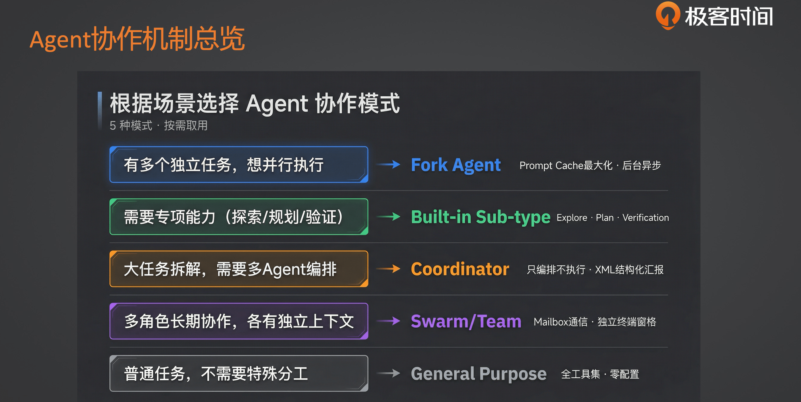

在了解 5 种模式之前，先建立一个关键的对比框架：**Coordinator 是做减法，Swarm/Team 是做加法**。

CC 整体在工程上一直在做减法——收缩工具集，克制功能扩张，激发模型本身的能力。Coordinator 模式把这个原则推到极限：不只是限制 Worker 的工具，连主 Agent 的工具也全部去掉——它只能编排，连文件都不能碰。

Swarm/Team 相反，是在一个 Agent 基础上做加法：多个数字员工，各有独立 workspace、记忆、skill，通过邮箱系统协作。

不同设计哲学，适用不同场景。

很多人看到 CC 的 Agent 协作是从代码变量切入的——`team_name`、`COORDINATOR_MODE`、`FORK_SUBAGENT`……这些变量对开发者有意义，但对选择使用哪种模式没有直接帮助。

我换一个视角：**根据你的场景需求来选**。

### 场景一：我有 3 个独立的后台任务，想同时跑

→ **Fork Agent 模式**

- 派生 3 个 Fork child，每个继承完整上下文
- 强制后台异步执行，主 Agent 不阻塞
- Prompt Cache 最大化（三个 fork 共享父 prompt 缓存）
- 适合：并行研究、批量处理、成本敏感场景

### 场景二：我需要一个专项能力的 Agent（探索代码库、写计划、验证实现）

→ **Built-in Sub-type Agent**

- 选 Explore（haiku，只读，快且便宜）
- 选 Plan（继承模型，返回分步计划）
- 选 Verification（自动验证，禁止修改）
- 适合：专项能力分工，模型选型精细化

### 场景三：我要把一个大任务拆分给多个 Agent 执行，需要编排

→ **Coordinator 模式**

- Coordinator 只编排不执行，主 Coordinator Agent 没有任何执行工具（不只是限制，是真的没有工具）
- Worker 子 Agent 被严格限制，不能再 fork 出其他 Agent
- 并行任务的 Worker 只有 Read + Bash（只读，无文件编辑权限），串行实现任务的 Worker 才有 Edit
- task-notification XML 结构化汇报（机械解析，不依赖 LLM 理解）
- 并发 + 串行策略：研究类并行，实现类串行（避免文件冲突）
- 适合：大型任务编排、多步骤流程

### 场景四：我需要多个 Agent 长期协作，每人有自己的上下文和"工作台"

→ **Swarm/Team 模式**

- 每个 Teammate 在独立终端窗格（iTerm2/Tmux）或进程里运行
- Mailbox/Actor 通信：SendMessage 点对点或广播
- 适合：长期团队协作、复杂的多角色交互

### 场景五：我就是需要一个通用的 Agent 帮我完成任务

→ **General Purpose Agent**（默认）

- 全功能，全工具集
- 不需要任何特殊配置
- 适合：通用任务，没有特殊分工需求

### 异步执行：何时后台运行？

以下 6 种条件，ANY 满足即进入后台异步模式：

```plain
run_in_background = true     在 Agent 调用时显式指定
agent.background = true      Agent 定义文件中配置
isCoordinatorMode()          Coordinator 下的 Workers
isForkSubagentEnabled()      Fork 模式
kairosEnabled()              KAIROS 持续代理模式
proactiveModule.isActive()   主动触发模式
```

**一个选型心智模型**：Coordinator 是减法——限制越多，专注度越高，适合有明确边界的大任务分解；Swarm/Team 是加法——能力越堆越丰富，适合需要长期积累和协作的数字团队。其余三种（Fork、Sub-type、General Purpose）则是在主流单 Agent 模式上的功能延伸，先掌握这两个极端，中间的选择自然清晰。

---

## 十、后台任务：task-notification XML 让 Agent 协作可观测

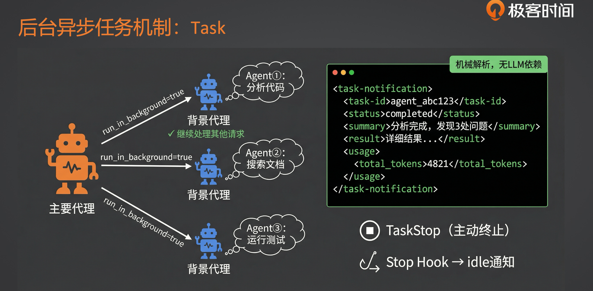

### 为什么要结构化汇报？

当你有多个后台 Agent 在并行跑时，你需要知道：哪个完成了？结果是什么？有没有出错？

最直觉的做法是让 Agent 用自然语言汇报，然后让 Coordinator 解析。但这依赖 LLM 理解，引入了不确定性。

CC 的选择是结构化 XML——机械解析，零 LLM 依赖：

```plain
<!-- 后台 Agent 完成时发送给 Coordinator -->
<task-notification>
  <task-id>agent_abc123</task-id>
  <status>completed</status>   <!-- completed | failed | killed -->
  <summary> 分析完成，发现 3 处 SQL 注入风险 </summary>
  <result>
    文件 api/users.py:47 存在未参数化的 SQL 查询...
  </result>
  <usage>
    <total_tokens>4821</total_tokens>
  </usage>
</task-notification>
```

Coordinator 用标准 XML 解析器处理这个输出，不需要 Claude 来"理解"结果是否成功——`<status>completed</status>` 就是完成。

### 生命周期管理

```plain
主 Agent / Coordinator
    ↓ Agent({ run_in_background: true, ... })
    ↓ 返回 agentId（立即）
 
后台 Agent 运行中...
    ↓ TaskOutput(agentId)  ← 随时查看中间输出
    ↓ TaskStop(agentId)    ← 需要时主动终止
 
后台 Agent 完成时：
    ↓ Stop Hook 触发
    ↓ 发送 <task-notification> XML
    ↓ 主 Agent 收到并处理
 
---
```

## 十一、Fork vs 通用 Sub-agent：缓存命中率的省钱数学

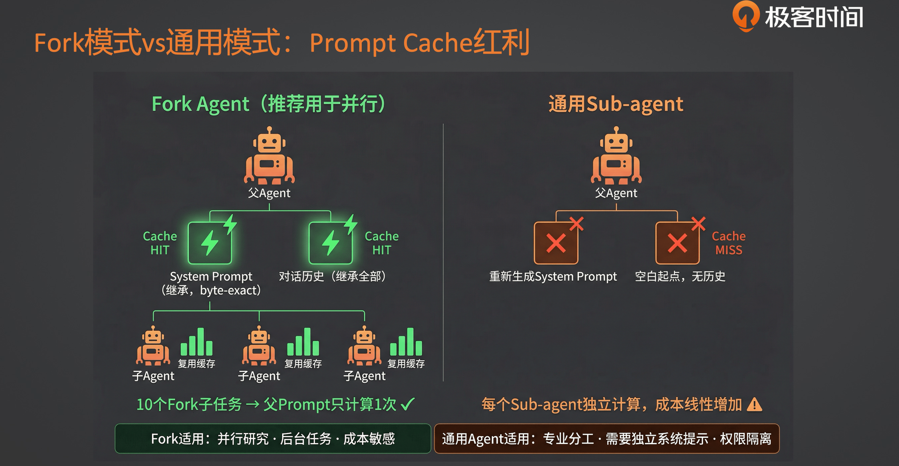

### byte-identical 是关键

Prompt Cache 的命中逻辑很简单：如果你的请求 prompt 和上一次**一个字节都不差**，就命中缓存，省掉 prompt 的处理费用。

Fork Agent 为什么能最大化缓存命中？因为它直接继承父 Agent 的 `renderedSystemPrompt`——不是重新生成一遍，而是**字面上同一份数据结构的引用**（byte-exact）。

对比：

| 维度 | Fork Agent | 通用 Sub-agent |
| --- | --- | --- |
| System Prompt | 继承父 renderedSystemPrompt（byte-exact） | 重新生成（即使内容相同，因动态字段不同也可能 miss） |
| 对话历史 | 继承父全部消息 | 空白起点 |
| 工具集 | [‘*’]，与父完全一致 | 由 agent 定义决定 |
| Prompt Cache | 最大化命中 | 独立 cache，每次可能 miss |
| 执行方式 | 强制后台异步 | 可同步可异步 |
| 递归保护 | FORK_BOILERPLATE_TAG 阻止 fork 再 fork | 无限制 |

### Fork 的消息构建方式

Fork child 收到的"消息"不是普通的 user message，是一个特殊拼接：

```plain
父 history（全部消息）
    +
父最后一条 assistant 消息（保留所有 tool_use 块和 thinking）
    +
每个 tool_use 的占位结果（"Fork started — processing in background"）
    +
<fork-boilerplate> 你是 fork child，不要再 fork，直接执行 </fork-boilerplate>
    +
📌 {实际要执行的指令}
```

这个拼接结构确保：占位结果让 tool_use 有对应的 tool_result（Claude API 要求），boilerplate 防止无限递归，实际指令是最后追加的新内容。

**什么时候用 Fork，什么时候用通用 Sub-agent？**

- 需要并行执行多个任务、任务内容不同但背景相同 → Fork
- 需要独立的 System Prompt、专项角色、权限隔离 → 通用 Sub-agent

---

## 十二、内置专项 Agent：正确的模型选型示范

## 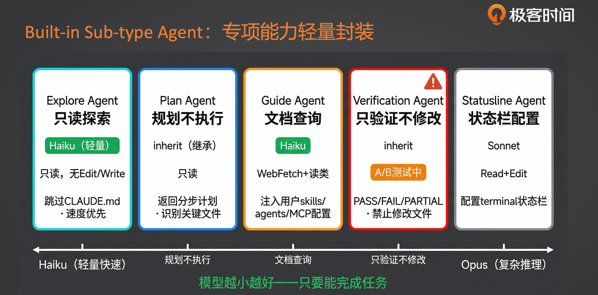

CC 的 5 个内置专项 Agent，每个都是"极简但足够"的设计：

| Agent | 模型 | 工具集 | 关键设计 |
| --- | --- | --- | --- |
| Explore | Haiku（外部）/ inherit（内部） | 只读（无 Edit/Write） | omitClaudeMd: true（跳过 CLAUDE.md，节省 token）；EXPLORE_AGENT_MIN_QUERIES 防止查太少就汇报 |
| Plan | inherit | 只读 | 返回分步计划，识别关键文件，评估架构权衡——只规划不执行 |
| claude-code-guide | Haiku | WebFetch + 读类 | 启动时注入用户 skills/agents/MCP 配置；知道官方文档 map URL |
| Verification | inherit | dontAsk（拒绝需权限操作） | PASS/FAIL/PARTIAL；禁止修改文件；主 Agent 不能自我验证 |
| statusline-setup | Sonnet | Read + Edit | 专门负责配置终端状态栏 |

**模型选型逻辑**：Explore 和 Guide 用 Haiku，因为它们的任务是搜索和读取，不需要高质量推理，便宜且快。Verification 用 inherit（继承主模型），因为"以破坏性思维验证实现"需要足够的推理能力。

这是 CC 给出的模型选型原则：**任务越专用，模型应该越小——只要能完成任务。**

---

## 十三、Coordinator 模式：举一个具体例子

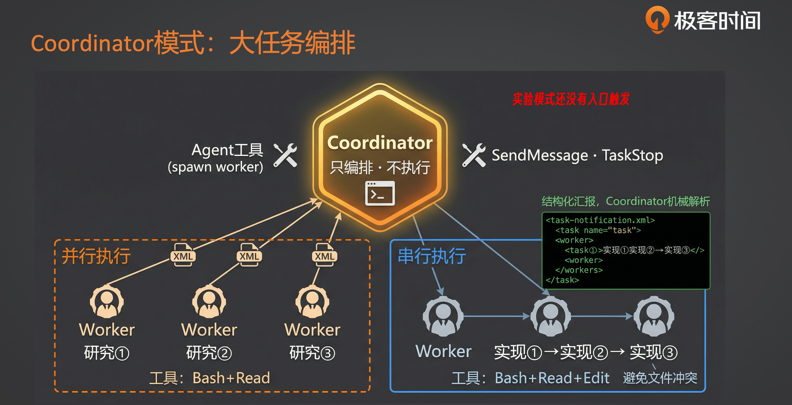

Coordinator 的概念说起来容易理解，但实际运作方式很多人没想清楚。我们用一个具体例子来走。

### 例子：大型 Python 项目的安全审计

**任务**：对一个 5 万行的 Python 项目做全量安全审计，找出 SQL 注入、硬编码密钥、SSRF 漏洞。

**没有 Coordinator 的做法**：

主 Agent 一个个文件扫描，处理完才能分析下一个，时间 O(n)，上下文窗口还容易爆。

**Coordinator 的做法**：

```plain
Coordinator（不直接操作文件）
    │
    ├── 分析任务 → 拆解为 3 个并行研究任务
    │
    ├──▶ Worker1（并行）：扫描 SQL 注入
    │    工具集：Bash + Read（只读）
    │    任务：grep 所有 SQL 字符串拼接，找出未参数化查询
    │    完成后发送 <task-notification>
    │
    ├──▶ Worker2（并行）：扫描硬编码密钥
    │    工具集：Bash + Read（只读）
    │    任务：搜索 API_KEY / password / secret 等关键词
    │    完成后发送 <task-notification>
    │
    └──▶ Worker3（并行）：扫描 SSRF 漏洞
         工具集：Bash + Read（只读）
         任务：搜索所有 HTTP 请求构建，检查 URL 是否来自用户输入
         完成后发送 <task-notification>
 
[3 个 Worker 并行运行]
    ↓
Coordinator 收到 3 份 <task-notification> XML：
  Worker1: completed - 发现 api/users.py:47 存在 SQL 注入
  Worker2: completed - 发现 config.py:12 存在硬编码 API KEY
  Worker3: completed - 发现 proxy/fetch.py:88 存在 SSRF 风险
    ↓
Coordinator 汇总 → 生成最终审计报告（串行，综合 3 份结果）
```

关键点：

1. Coordinator 自己没有执行任何文件操作——它只做调度和汇总
2. Worker 工具集受限（只读 Bash + Read），不能修改文件（审计时不应修改）
3. 3 个 Worker 并行运行，总时间接近 O(1) 而不是 O(n)
4. task-notification XML 是结构化的，Coordinator 机械解析，不依赖 LLM 理解

**Coordinator 模式的适用场景**：任务可以拆解为多个独立子任务、子任务结果需要汇总、对执行时间有要求。不适合：任务有强依赖关系（必须串行）、任务太简单（overhead 不值得）。

---

## 十四、Swarm/Team：Mailbox/Actor 模型

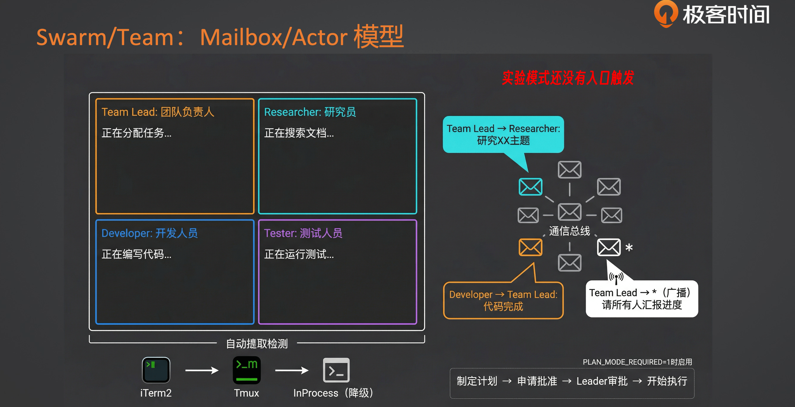

在讲 Team 模式之前，先区分一个核心概念：**Subagent ≠ 数字员工**。

不论是普通 Subagent、Fork Agent 还是 Coordinator 的 Worker，本质上都是"依附于主 Agent 的任务执行单元"——没有自己的记忆，没有自己的技能积累，任务完成即消失。它们服务于主 Agent 的一次性目标，本质上是主 Agent 的临时执行单元。

Team 模式才是真正意义上的"数字员工"：每个 Teammate 有自己的 workspace、自己的长期记忆、自己安装的 skill，实际上是一个独立运行的 Claude Code 实例。他们之间的协作不是通过共享上下文，而是通过**通讯总线**：有公共广播区域（所有成员可见）和点对点私聊。

这才是 Harness 时代真正意义上的 Multi-Agent 协作。

### 和 Coordinator 的区别

|  | Coordinator | Swarm/Team |
| --- | --- | --- |
| Worker 生命周期 | 短期（一个任务结束） | 长期（团队成员持续存在） |
| 执行环境 | 进程内异步 | 独立终端窗格（视觉分离） |
| 通信方式 | task-notification XML | SendMessage 邮箱 /Actor |
| 适合场景 | 大任务编排 | 长期协作团队 |

### 多终端后端自适应

```plain
检测运行环境：
    ↓
在 macOS + iTerm2 + it2 CLI 可用？
    → ITermBackend：split pane，图形化多窗格
 
在 tmux session 中？
    → TmuxBackend：tmux pane，终端复用
 
都不满足？
    → InProcessBackend：降级，进程内异步（显示 banner 提示）
```

启用方式（外部用户）：

```bash
CLAUDE_CODE_EXPERIMENTAL_AGENT_TEAMS=1 claude
# 或
claude --agent-teams
```

### Mailbox/Actor 通信

每个 Teammate 有独立的邮箱目录（mailbox），通过 SendMessage 收发消息：

```typescript
// 点对点
SendMessage({ to: '@researcher', message: '请分析一下这个错误日志' })
 
// 广播
SendMessage({ to: '*', message: '前端任务完成，请后端同步状态' })
```

Team Lead 完成 Teammate 创建后，自己的角色转变为"调度者 + 审批者"。Teammate 完成任务后通过 Stop Hook 发送 idle 通知。

### Plan Mode 审批机制

当设置 `CLAUDE_CODE_PLAN_MODE_REQUIRED=1` 时，Teammate 在开始实现前必须获得 Leader 批准：

```plain
Teammate 制定计划
    ↓ ExitPlanMode 工具（申请批准）
    ↓ SendMessage 给 Leader："我的计划是 A → B → C"
 
Leader 审批（通过 / 拒绝 / 修改）
    ↓ 批准：Teammate 开始执行
    ↓ 拒绝：Teammate 返回修改计划
```

这个机制确保高风险操作在执行前经过人工或上级 Agent 的审批。

**给自己项目的启示**：Team 模式适合长期、稳定的多角色协作场景——每个角色有固定的职责、需要积累专属记忆和技能。如果任务是一次性的（单次完成即解散），用 Subagent 或 Coordinator 更合适，Team 模式的配置成本不值得。评估核心问题是：**这些 Agent 之间需要长期记住彼此的工作内容吗？** 如果是，Team 模式；如果不是，用更轻量的协作方式。

---

## 十五、安全架构：6 大原则贯穿始终

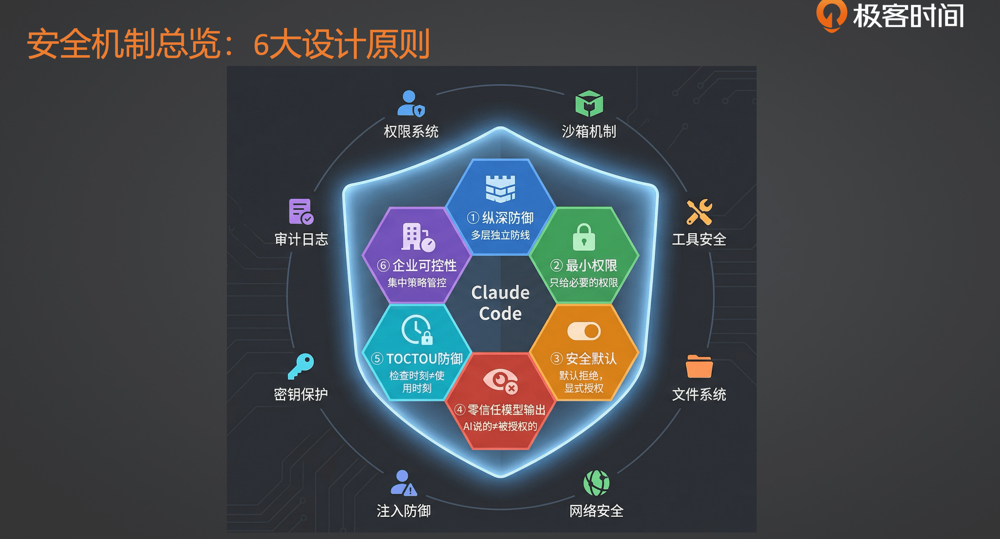

CC 的安全设计有 6 个核心原则，值得每个做 Agent 的工程师背下来：

**1. Defense in Depth（纵深防御）**

不依赖单一防线。权限检查失效了，还有沙箱；沙箱绕过了，还有审计日志。每一层独立失效，不会导致全线崩溃。

**2. Least Privilege（最小权限）**

Agent 只有完成任务所需的最小工具集。Explore Agent 没有 Edit/Write，Verification Agent 拒绝所有文件修改——权限最小化，爆炸半径最小化。

**3. Secure by Default（安全默认）**

默认拒绝，需要时显式授权。不是"默认允许然后拦截危险操作"，而是"默认拒绝然后放行安全操作"。

**4. Zero Trust on Model Output（零信任模型输出）**

AI 说"我要执行 rm -rf"，CC 不相信它被授权——仍然走权限检查流程。**模型的判断不等于系统的授权**。这一条是最重要的。

**5. TOCTOU Defense（时间竞争防御）**

检查时刻（Time of Check）和使用时刻（Time of Use）之间的不一致会被攻击。CC 在沙箱层防止这种攻击（例如防 Git fsmonitor 逃逸）。

**6. Enterprise Controllability（企业可控性）**

企业可以通过 policySettings 层集中控制所有 Agent 的行为。这是面向 B 端场景的必备能力。

---

## 十六、权限机制：Deny > Ask > Allow

## 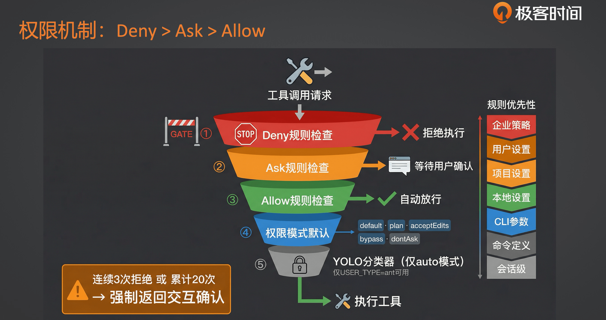

### 权限模式（6 种）

```typescript
// PermissionMode.ts
// 概念示意，非真实代码
const PERMISSION_MODE_CONFIG = {
  default:            // 每次工具调用需要用户确认
  plan:               // 只生成计划，不执行（ExitPlanMode 申请执行权）
  acceptEdits:        // 自动允许文件编辑
  bypassPermissions:  // 跳过所有检查（红色警告，危险）
  dontAsk:            // 自动拒绝需要权限的操作（用于只读 Agent）
  auto:               // 仅 USER_TYPE=ant 可用，YOLO 分类器
}
```

### 权限决策流（从上往下，第一个命中即返回）

```plain
1. Deny 规则检查 → 命中 → 直接拒绝 ❌
2. Ask 规则检查  → 命中 → 弹出确认对话框 ❓
3. Allow 规则检查 → 命中 → 自动放行 ✅
4. 权限模式默认值 → 按当前模式决策
5. YOLO 分类器（仅 auto 模式）→ Haiku 快速判断
```

**规则优先级**（高 → 低）：

```plain
企业策略（policySettings）
  > 用户设置（user）
  > 项目设置（project）
  > 本地设置（local）
  > CLI 参数（cliArg）
  > 命令定义（command）
  > 会话级（session）
```

### 拒绝跟踪（denialTracking.ts）

```typescript
// 防止 AI 反复尝试被拒绝的操作
const DENIAL_LIMITS = {
  maxConsecutive: 3,   // 连续 3 次拒绝 → 强制返回交互确认
  maxTotal: 20,        // 累计 20 次拒绝 → 同上
}
```

没有这个机制，一个设计不良的 prompt 可能让 AI 不断重试被拒绝的操作，造成无谓的 API 消耗和用户体验问题。

---

## 十七、沙箱：OS 级隔离

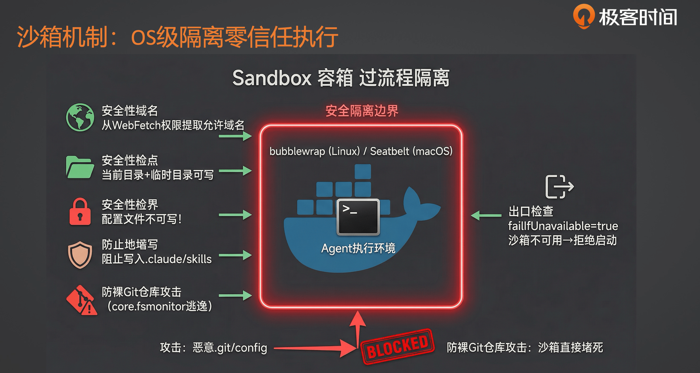

**为什么 CC 在编码场景很少默认启用沙箱？**

核心矛盾在于网络访问：编码场景下常需要运行 `npm install`、`pip install` 等依赖安装命令，这些命令需要访问外部网络。沙箱的网络访问严格限制（只允许 WebFetch 权限规则里的白名单域名）会让这类命令直接失败。文件系统写入方面相对宽松（工作目录和临时目录可写），但系统调用层面的限制同样可能导致某些构建工具行为异常。

沙箱的真正优势在于**网络层拦截**：如果 Agent 写了 Python 代码然后执行 `requests.get(url)`，bash 层的规则拦不住（命令本身是合法的），但沙箱层可以在 OS 级别阻断这次网络请求。这是沙箱相比 bash 规则的核心价值——对于需要严格网络出口控制的场景，沙箱是必要的。

### 底层技术

- Linux：bubblewrap（bwrap）——Linux 容器沙箱工具
- macOS：sandbox-exec（Seatbelt）——macOS 原生沙箱框架
- 实现文件：utils/sandbox/sandbox-adapter.ts（封装 @anthropic-ai/sandbox-runtime）

### 5 项核心安全转换（convertToSandboxRuntimeConfig）

```plain
① 从 WebFetch 权限规则提取网络域名白名单
   只有显式授权的域名才能访问，其他全拒
 
② 始终允许写入：当前工作目录 + 临时目录
   Agent 需要能在工作区操作文件
 
③ 始终拒绝写入：配置文件（~/.config/... 等）
   防止 Agent 修改系统配置，这是沙箱逃逸的常见路径
 
④ 阻止写入 .claude/skills
   与 agents 定义文件同等级别的保护
   防止恶意 MCP server 注入自定义 Agent 定义
 
⑤ 防裸 Git 仓库攻击（core.fsmonitor 沙箱逃逸）
   攻击路径：在工作目录放恶意 .git/config
   → 触发 core.fsmonitor 钩子执行任意命令
   CC 直接在沙箱层阻断这条路
```

`failIfUnavailable: true` 意味着沙箱不可用时 CC 会拒绝启动，而不是降级为无保护模式运行。

---

## 十八、提示注入防控：4 层纵深防御

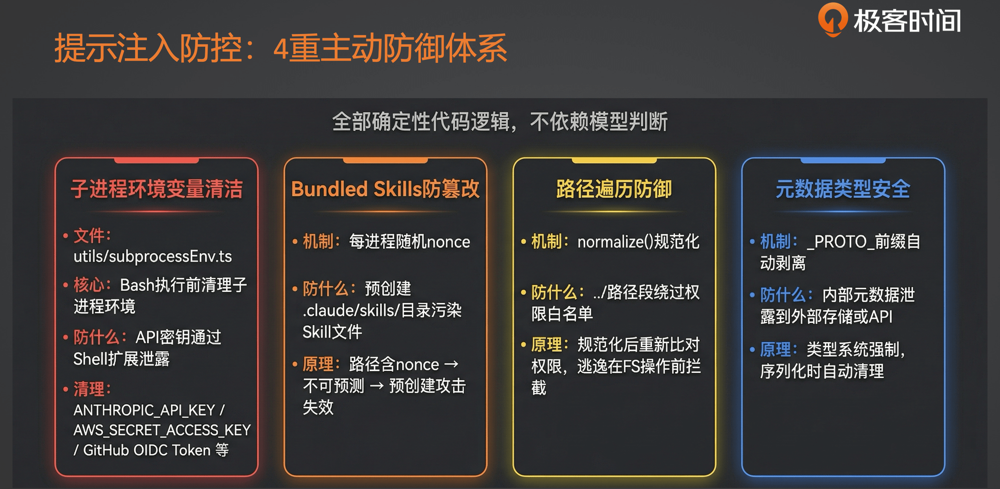

安全没有一招鲜——没有一个安全系统能拦住所有风险。CC 的做法是：有什么攻击路径，就针对性地补什么。以下 4 层防御，每一层对应一类具体的攻击场景。

提示注入的本质威胁：AI 被诱导执行恶意命令 → 通过 Shell 扩展（如 `${ANTHROPIC_API_KEY}`）泄露敏感变量，或通过污染的 Skill 文件接管 Agent 行为。CC 的防御全部在代码层面，不依赖模型判断。

### 层 1：子进程环境变量清洁（`utils/subprocessEnv.ts`）

在 CI/ 后台环境中，执行 Bash 命令前自动清理子进程环境变量：

```plain
清理范围：
· Anthropic 认证凭据：ANTHROPIC_API_KEY、CLAUDE_CODE_OAUTH_TOKEN、ANTHROPIC_AUTH_TOKEN 等
· OTEL 导出器 Headers（携带 Bearer token）
· 云服务凭据：AWS_SECRET_ACCESS_KEY、AWS_SESSION_TOKEN、GOOGLE_APPLICATION_CREDENTIALS、AZURE_CLIENT_SECRET
· GitHub Actions OIDC：ACTIONS_ID_TOKEN_REQUEST_TOKEN/URL（可铸造安装令牌 → 仓库接管）
· GitHub Actions 缓存：ACTIONS_RUNTIME_TOKEN/URL（缓存投毒 → 供应链攻击）
```

攻击场景：注入攻击者在文件 / 网页中埋入 `echo ${ANTHROPIC_API_KEY}` → AI 执行 Bash → 密钥泄露。子进程清洁确保**即使 AI 被诱导，敏感变量在子进程中根本不存在**。

### 层 2：Bundled Skills 防篡改（每进程随机 nonce）

攻击路径：本地攻击者预创建 `.claude/skills/` 目录 → Claude 读取污染的 Skill → 提示注入。

防御：每次进程启动生成随机 nonce，Skills 目录路径包含 nonce，使路径**不可预测**，预创建攻击无效。

### 层 3：路径遍历防御（`normalize()` 规范化）

文件系统权限检查在多处调用 `normalize()` 处理路径，`..` 段的遍历绕过被规范化后与权限白名单重新比对，路径逃逸在到达实际 FS 操作之前被拦截。

### 层 4：元数据安全类型分析（`_PROTO_` 前缀剥离）

使用类型系统强制验证：`_PROTO_` 前缀字段在序列化时被自动剥离，防止内部元数据泄露到通用存储或外部 API 调用中。

**设计共性**：4 层防御全部是确定性代码逻辑（类型系统、正则、nonce、env 清理），没有依赖 LLM 判断——这才是真正可信的安全层。

---

## 十九、可观测性：双轨上报 + 全链路审计

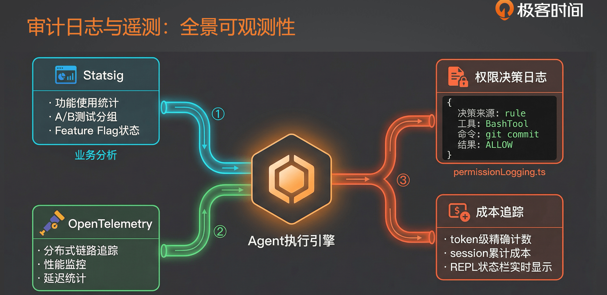

### 双轨遥测

CC 同时维护两套上报：

**Statsig**（业务分析）：

- 功能使用统计（哪个工具被调用最多）
- A/B 测试分组（GrowthBook 功能门控）
- Feature Flag 状态上报

**OpenTelemetry**（技术链路）：

- 分布式追踪（每次 Agent 调用有 trace_id）
- 性能监控（工具执行耗时、API 延迟）
- Datadog 可选集成

### 权限决策日志（permissionLogging.ts）

每次权限决策（Allow 或 Deny）都有结构化记录：

```typescript
// permissionLogging.ts
logPermissionDecision({
  source: 'rule',           // classifier | hook | rule | sandboxOverride | mode
  toolName: 'BashTool',
  input: 'git commit -m ...',
  decision: 'ALLOW',
  reason: 'matches allow rule: git commit'
})
// fan-out: Statsig analytics + OTel telemetry + code-edit metrics
```

**为什么要记录决策来源（source）？** 当出现安全事件时，你需要快速定位是哪层防线触发的——是规则？是沙箱覆盖？是权限模式？结构化的 source 字段让根因分析变得机械可查。

### 成本双轨追踪

```plain
token 级精确计数：
  每次 API 响应包含 usage: { input_tokens, output_tokens, cache_read_tokens }
  query.ts 精确累加
 
session 级累计：
  REPL 状态栏实时显示当前 session 消耗
  上次 session 费用在启动时上报（setup.ts）
```

Claude 自述（被某 X.com 帖子挖出）：“大部分工程为降成本”——这不是玩笑，双轨成本追踪是这个工程哲学的直接体现。

---

## 二十、总结：5 个可直接复用的工程模式

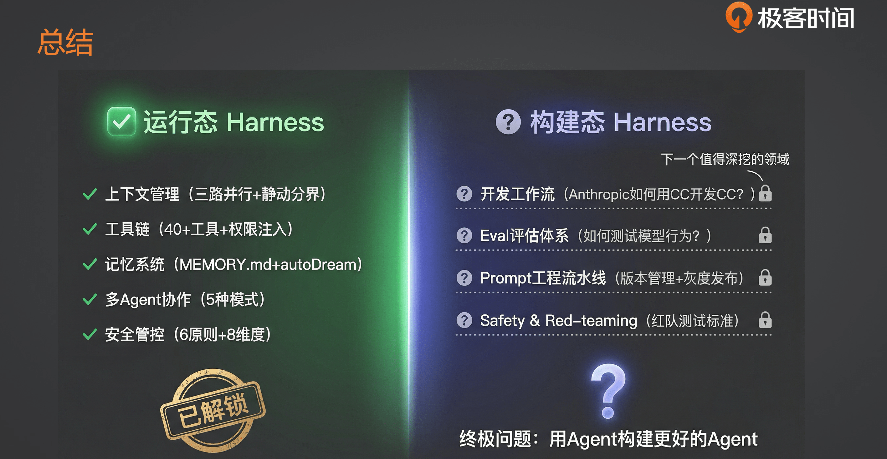

今天拆了这么多，最后帮大家提炼 5 个可以直接搬到自己项目里的工程模式：

**① AsyncGenerator 状态机 → 你的 Agentic Loop**

```typescript
async function* myAgentLoop(state: State) {
  while (true) {
    const response = await callModel(state.messages)
    yield response  // 实时推送给 UI
    if (!response.toolCalls.length) return
    const results = await executeTools(response.toolCalls)
    state = next(state, 'tool_results', { messages: [...state.messages, ...results] })
  }
}
```

不可变 State，每轮纯函数转换，AsyncGenerator 流式推送。

**② 三路上下文 + 静 / 动分界 → 你的 System Prompt 工程**

把 System Prompt 拆成 `string[]`，明确哪些段静态（可缓存），哪些段动态（每轮重算）。静态段跨 session 缓存，token 成本线性下降。

**③ MEMORY.md 索引模式 → 你的长期记忆**

不需要向量数据库。一个结构化的纯文本索引文件 + Stop Hook 触发的主动整合，足以给 Agent 提供工程级的跨 session 记忆。

**④ Fork byte-identical → 你的成本优化**

需要并行子 Agent 时，让每个子 Agent 继承父 prompt（byte-exact），而不是重新生成。Prompt Cache 命中率接近 100%，并行 N 个子任务的 prompt 开销 ≈ 1 个单任务。

**⑤ 多层权限决策链 + 拒绝跟踪 → 你的安全管控**

工具不直接引用权限模块——PermissionContext 由上层注入。Deny > Ask > Allow 决策链，加上拒绝跟踪防止 AI 无限重试，这是商业级 Agent 安全管控的最小可行方案。

---

## 二十一、未竟之问：我们拿到的只是一半答案

今天讲的是 CC 的**运行态 Harness**——CC 在运行时长什么样，每个模块怎么工作。

但还有另一半我们没看到：**构建态 Harness**——CC 是怎么被造出来的。

这是下一个值得系统研究的领域：

| 待探索 | 已知线索 | 核心问题 |
| --- | --- | --- |
| 开发工作流 | 代码有大量 AI 生成迹象；内部代号 Capybara/Numbat | Anthropic 用 CC 开发 CC 到什么程度？自举闭环怎么做的？ |
| Eval 评估体系 | Verification Agent 在 A/B 测试；Statsig 基础设施完整 | 模型行为的测试套件长什么样？如何防止"测试通过但生产挂"？ |
| Prompt 工程流水线 | cyberRiskInstruction.ts 需特别审批 | 生产级 Prompt 如何版本管理、评审、灰度发布？ |
| Safety & Red-teaming | ANTI_DISTILLATION 存在，red-team 流程不可见 | 商业 Agent 的 red-team 标准是什么？怎么测？ |

CC 是 Harness 的一个版本的答案，但 Harness 的故事还没有结束。

终极问题是：**如何用 Agent 来构建更好的 Agent？**

这不是哲学问题，是下一代 AI 工程的核心工程问题。
---

来源：极客时间《企业级多智能体设计实战》
提取日期：2026-06-02
