# 直播回放｜爆火全网的OpenClaw强在哪儿？

> 来源：极客时间《企业级多智能体设计实战》
> 当前播放：直播回放｜爆火全网的OpenClaw强在哪儿？
> 提取日期：2026-06-02
> 原文长度：18066 字

---

**2026.2.25 晓寒老师新课上新直播精华稿**

**一、自我介绍**

欢迎现场及线上的同学参加本次直播。今天主要讲解现在非常火的开源项目 OpenClaw，从产品到技术进行详细讲解，让大家对它有一个深度理解。

我是晓寒，刚入驻极客时间。之前我在百度做架构师，后来出来在一家头部互金公司做 AI，已经做了很久。从 2022 年开始，我先从评测入手，后来做 AI 应用、AI 产品，中间还转过一段时间的 AI 产品经理。到现在我负责整个公司的 AI 中台，不仅要搭建基础设施，还要负责各个业务的 AI 应用落地。同时我也是公司 AI 转型的布道师和培训官，对讲好这门课程还是比较有信心的。

在这个过程中我也踩了很多坑，特别希望能分享一些自己的经验给大家。今天是第一次直播，后面我还会有一个课程在极客时间平台上线。

**二、互动环节：大家对 OpenClaw 的了解程度**

我们先互动一下，看看大家对 OpenClaw 本身的了解程度：

- 完全没听过的扣 1；
- 之前有刷到过、有了解，但没有自己动手尝试过的扣 2；
- 本地搭过，包括在云厂商用过一键轻应用搭建过的扣 3；
- 深度玩过，看过代码，自己写过 Skill 或者做过源码改造的扣 4。

我看到扣 1、2 的同学不少，也有扣 3 的。没关系，不管之前了解多少，这次直播希望能带大家深度了解它。直播过程中如果有任何问题，欢迎随时在评论区发言，我会尽量解答，最后也会有 QA 环节。

**三、OpenClaw 究竟是什么？**

因为有些同学可能之前没听过，我们先来说说 OpenClaw 是什么。OpenClaw 其实最早火的时候名字叫 CrawlBot，它的标志是一个龙虾图案。后来因为商标问题被迫改名，中间迅速改名叫 MoteBot，最后定为现在的名字——OpenClaw。所以大家在网上看到的 CrawlBot、MoteBot、OpenClaw，其实是一个东西，只是中间换了名字。

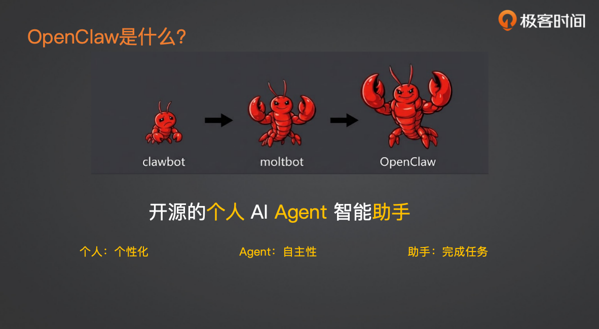

**本质上，OpenClaw 是一个开源项目，是一个个人的 AI Agent 智能助手。** 这里面有三个关键字：

1. 个人：它是一个反 PaaS 化的东西。我们日常用的豆包、千问、GPT、Claude 等平台，是你自己在跟服务器交互，回复都是用相同的逻辑。而 OpenClaw 是开源项目，你可以把它搭建在自己的个人电脑或者云端，是一个完全属于你个人的、个性化的东西。好处首先是数据安全、隐私，大部分数据和配置都存在你自己的电脑或云端，不太会泄露。其次，也是最重要的，就是个性化。你可以给它调教各种性格、技能，连回复风格和逻辑都可以完全定制，变成一个非常非常个性化的、属于你自己的助手。
2. 自主性：这里用 Agent 这个词，我对 Agent 的定义可能和现在泛化的“智能体”不太一样。这里的 Agent 是和 Workflow 对应的，它不是一个你事先用代码写好的编排式助手，而是用 Agentic 技术、可以自主完成任务的助手。它是一个基于 ReAct 架构的智能助手，能够完成各种任务，足够智能。
3. 助手：这个产品的定位就是帮你完成任务，这可能和数字分身不一样——数字分身是代替你，而助手是替你完成任务。因为 Agent 本身有自主性，你不需要说太多，只要把明确需求告诉它，它就可以很好地帮你完成任务。

**四、实际应用案例**

社区上现在有大量 OpenClaw 的案例，很多极客在上面分享自己的 Aha moment。我挑选了一些比较有代表性的：

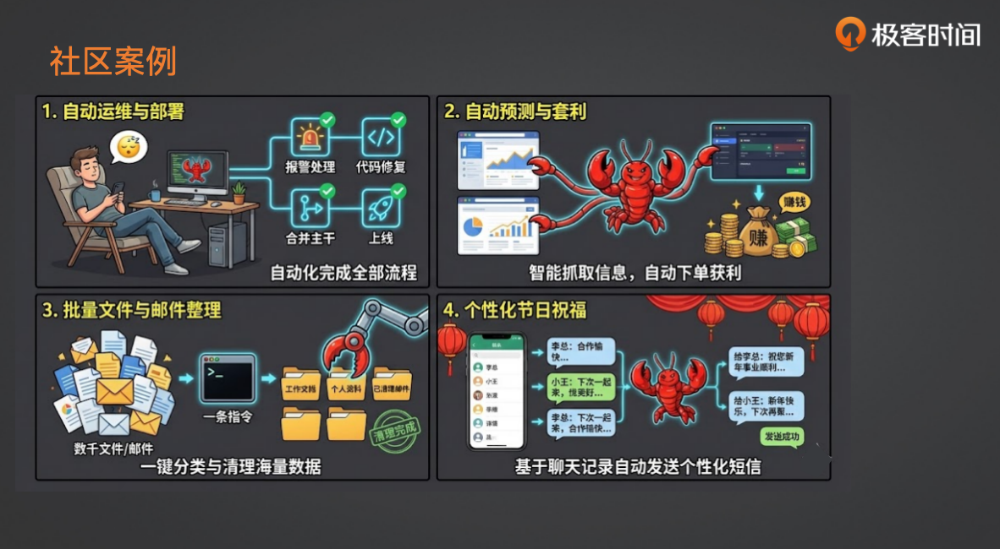

1. 程序员场景：自动运维和部署

以前要坐在电脑前干很多事情，现在直接拿手机，当出现报警时，OpenClaw 直接发消息说“这个东西出问题了”，你回复“你去解决吧”，它就开始自己干——查日志、看代码，甚至可以根据代码定位问题，给你提个 PR，然后在微信或飞书上告诉你“我打算这么改，你看行不行？”你在手机上点“行”，它就直接合并到主干。如果胆子更大，还可以和 CI/CD 系统打通，直接上线解决问题。

1. 开源社区自动化

现在很多开源社区，尤其是 OpenClaw 自己，你提个 Issue 报 bug，过个 5 到 10 分钟，它自己的 AI 机器人就会基于这个 Issue 把代码修了，并提一个 PR 上去。这些都是社区里真实在运行的案例，非常智能。

1. 预测网站套利

国外有一些预测网站，类似赌明天会不会下雨，你投注下雨或不往下，如果预测成功就能返钱。OpenClaw 可以批量地天天抓取和预测相关的信息，实时获取数据后，自动用你事先充的钱在预测网站上下单。比如它提前查了天气预报，就下单“明天下雨”，预测成功后就获利。网上确实有人通过这个获利，不过论坛上大部分人还是把钱赔光了的。

1. 办公助手：批量的文件和邮件整理

很多人会把 OpenClaw 装在自己的工作电脑上（虽然这有点危险）。装在工作电脑上后，你就可以发一条指令说：“我现在这个文件夹太乱了，你帮我整理一下。”它就会自主地去翻阅你所有的文件，把它们分门别类地归档到不同的文件夹，同时建立一些索引。之后如果你再说：“我想找某天聊到某件事的那个文件。”它就会自动帮你找到那个文件，并把对应的信息给出来。它也是一个非常好用的助手。

1. 个性化节日祝福

前两天过年时有个帖子：让 OpenClaw 帮我去做个性化的短信发送，前提是它已经接了微信。然后 OpenClaw 直接从联系人列表里拉出所有人，根据每个人的聊天记录和备注，生成了个性化的新年祝福语，这些祝福语甚至还带上了他们之前聊过的事情和共同的记忆。然后它逐一发给了联系人列表里的人，结果收到了大量的回复，大家都觉得“太有心了”。其实这都是 OpenClaw 自动去发的。

1. 个人应用：股票监控与社区互动

晓寒老师个人也在用 OpenClaw，用得更多的是跟股票相关的，比如每天早上提醒关注个股的信息。另外因为安全考虑，没敢把它放在个人电脑上，更多是放在云端，本地也起了一个为了学习代码。他还喜欢让它去逛一个叫“Motorbook”的机器人社区，里面都是各种机器人自动发帖、读帖。它进去逛完后，回来告诉老师它怎么逛的，里面发了哪些帖，有谁回复了它，还挺好玩。

**五、OpenClaw 为什么会火？**

在谈技术之前，先分析一下为什么 OpenClaw 能火。技术本身其实没什么门槛，它甚至是用 Web Code 一个周末搭出来的项目，很多人都说它就是个“胶水项目”，就是把各种各样的东西攒在一起。但它就是火了，为什么？更多的还是在**产品逻辑**上。现在不缺技术，缺的是好的 AI 产品。OpenClaw 的火爆主要可以分为两个方面：

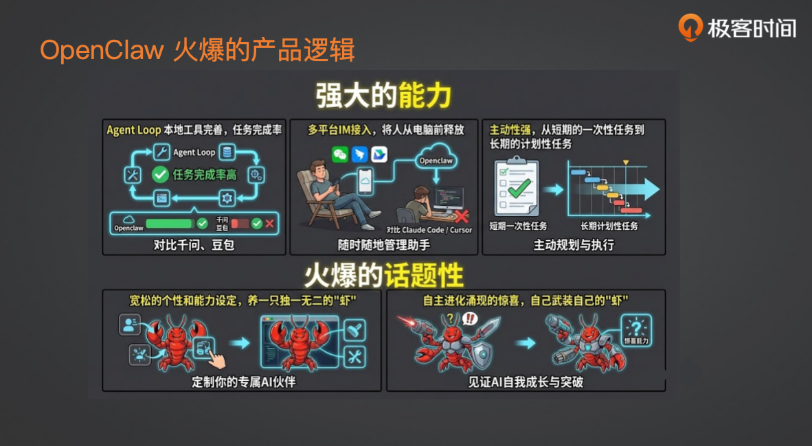

**（一）能力的强大**

1. 真的能把任务完成

对比一下现在的千问、豆包等，虽然它们后面的模型也感觉蛮强大的，但事实上它们给 ToC 端开放的资源非常有限，能接入的工具也非常有限。前段时间大家玩元宝，会发现它好像啥都干不了，没有代码能力，也没有浏览器能力。而 OpenClaw 利用了 Agent Loop 这种 Reactive 的机制，再加上它基本上接入的都是 Claude、GPT 的高版本才能好用——它确实非常依赖于现在模型能力的提升。但不管怎样，最终它达到的效果就是案例里展示的：**它是真的能把事情完成**。

1. 把人从电脑前解放出来

像 Claude Code 或 Cursor 这类助手能力甚至比 OpenClaw 要强，但为什么没有 OpenClaw 火爆？主要原因还是它们依赖于你在电脑前面。现在的 Agent 大部分还没办法完全脱离人，总会有一些 Human in the Loop 之类的东西。而 OpenClaw 最大的一个点就是它接入了各种 IM 平台，国外像 WhatsApp、纸飞机、Discord，国内现在已经接入了 QQ、飞书、钉钉等。接进去之后，这些 IM 平台能把你的助手变成一个**随叫随到的管家**。尤其如果你再把它放在自己的工作电脑上，就真的能做到像之前说的：代码写一半放那儿不用管，自己出去玩，然后通过几条命令控制你自己的电脑把剩下的任务完成。这其实是一个非常棒的产品设计。

1. 主动性

有个人没有主动去跟 OpenClaw 聊，但某天早上突然收到 OpenClaw 给他的一条消息，说“今天是你女儿的生日，我就不用工作事项打扰你了”。这就非常贴心。再比如让它监控阿里港股，它就能作为一个长期任务，真的在股票有异动的时候主动推送消息说：“你一直在关注的阿里股票今天突然涨得挺高，你看看是不是能卖一点了？”这种**主动性其实是一个非常强的 Aha Moment**。它把过去我们对 AI 助手的理解——我叫你你才来、一次性短期任务——彻底改变了。OpenClaw 的这种主动性，真正实现了长期计划性任务的自动完成。如果放到公司里，比如一个 PMO 去跟项目进度，那些长期性的事情：有哪些 Todo、项目有什么风险，它都可以主动通知到具体的人，告诉你什么时候该解决了。

**（二）话题性的东西**

1. 个性化

大厂其实并不是做不出个性化的东西，但它们的设计和安全一直都比较严格。而 OpenClaw 不一样，因为是你自己开源的、自己调教的龙虾。你可以让它扮演各种各样的个性：你可以让它非常主动，天天没事找你闲聊；也可以让它做一个非常理性的龙虾，只做你交代的任务。这些能力完全是个性化定制的，尤其是现在 Skill 出来了以后，你想给你的龙虾装备什么样的 Skill，都是按照你自己的个性需求去定制的。这种**独一无二的“养虾经历”特别容易让人产生分享欲**。为什么 OpenClaw 在社交平台上一下子火成这样？很多人主动分享，一下就爆了，其实跟大家本身的传播有很大关系。

1. 自主进化

OpenClaw 运行在你自己的电脑上，同时它又有你电脑本身的各种权限和能力。所以它能做到什么呢？它可以**自己改自己的代码**。这就会产生很多惊喜。像网上有个例子：Peter，也就是 OpenClaw 的创始人，说他那天给 OpenClaw 发了一段语音，但他没想着 OpenClaw 能解决，因为他之前没有给 OpenClaw 语音识别的能力。但因为 OpenClaw 调教得比较好，主动性比较强，它接到这段语音后，自己上网找到了 ASR 的 API，注册账号，把 Peter 的语音转成文字，然后解析并回复了 Peter。这就是它能自主进化的例子，带来了极大的惊喜感。这些惊喜一旦进入社区传播，即使真正自主进化的案例不多，但只要有几个传播开来，大家就会疯狂尝试，获取更多惊喜，最终让整个产品火起来。

**六、OpenClaw 的现存问题**

虽然优点很多，但 OpenClaw 更像是**专门给极客的玩具**，还不能算是一个 ToC 产品。为什么呢？主要有两点：

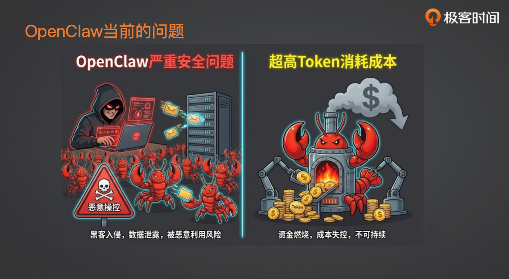

1. 安全问题

这是最让人难受的。我至今不敢在自己的电脑上长期跑 OpenClaw，因为不管是 prompt 注入，还是它本身代码的安全漏洞，都非常严重。你可以看到社区里有很多人把银行卡号都告诉它，让它去登录操作，但泄露的案例也非常多。现阶段，这些东西确实只有极客们才能真正驾驭。而且，如果你想让它相对安全一些，配置成本也很高。还有提示词的调教、需要做的隔离等，门槛真的非常高。所以到目前为止，我个人**非常不建议大家把 OpenClaw 放在个人电脑上长期跑**。

1. 超高的 Token 消耗成本

它的主动性、一切能力都依赖于它在后台不停地跑，而且想要完成任务必须用很好的模型。OpenClaw 底层基于 Palmimo 开源框架，这个框架的理念是：好的模型已经把大部分东西都训练进去了，所以提示词上并不需要给太多指导。因此 OpenClaw 底层的 System Prompt 构造其实相对简单。但这也导致，如果你用不好的模型——比如很多人说在本地跑 OpenClaw，我觉得纯属浪费时间和钱——那些小模型连 ReAct 都干不好，根本不可能完成复杂任务。所以你必须要用好的模型，但现在好模型都超贵，再加上 Token 消耗。待会讲到 System Prompt 构造时大家就会知道，它基础的 System Prompt 就需要 1.5 万左右的 Token。这还只是初始阶段，如果随着使用时间更长、Memory 更多、设置的 Skill 更多，那基础 System Prompt 基本上就要两三万 Token。可想而知，钱烧得有多快。我自己用的话，还没用特别好的模型，基本上还是用 Kimi 和之前的千问比较多。之前也尝试过它的极限，用过 Claude，但真的是烧钱，几个问题出去，充的 500 块钱就不剩多少了。所以这个成本不是一般人能承受的。其实它的上下文还有很大的优化空间，这也是我觉得后面会优化的方向，也是 OpenClaw 目前不太适合大多数 C 端用户的原因。

有同学问能不能用中间的这种订阅或代理？现在有很多能做，用一些订阅套餐，但基本上最近被封禁了一大批。因为说实话，不管用什么订阅，底层还是在烧那么多 Token。你用了那么多 Token，不是你亏就是厂家亏——Token 本身意味着 GPU 算力，意味着成本。厂家为了不亏，就会想办法封禁这些套餐订阅，或者用小模型、量化模型替代，那效果就会变差。所以这个问题还是比较难解决的。

**七、深入技术：OpenClaw 的系统架构**

接下来我们会更深入一点，带大家了解 OpenClaw 到底是怎么做出来的，它的整个系统架构是什么样子。最终我会给大家一个蓝图，去复刻整个 OpenClaw。因为 OpenClaw 本身也就是 Peter 用了一个周末，用 Web Coding 做出来的项目，其实没那么难学。它最核心的东西就在这张图上。当你把这张图上的东西学会，就能自己搭一个 OpenClaw。事实上，这个春节已经有七八个各种 Crawl 出来了，不管是 Python 版、Go 版、Rust 版，还是其他各种新项目，基本上都复刻了 OpenClaw 的产品设计，而且非常快。尤其是等我的课程上线后，实战课里有两节上下，就是教大家手搓 OpenClaw。那么今天的直播因为时间关系，我只会给大家做一个底层的系统解析介绍和蓝图。

**OpenClaw 的系统架构图**

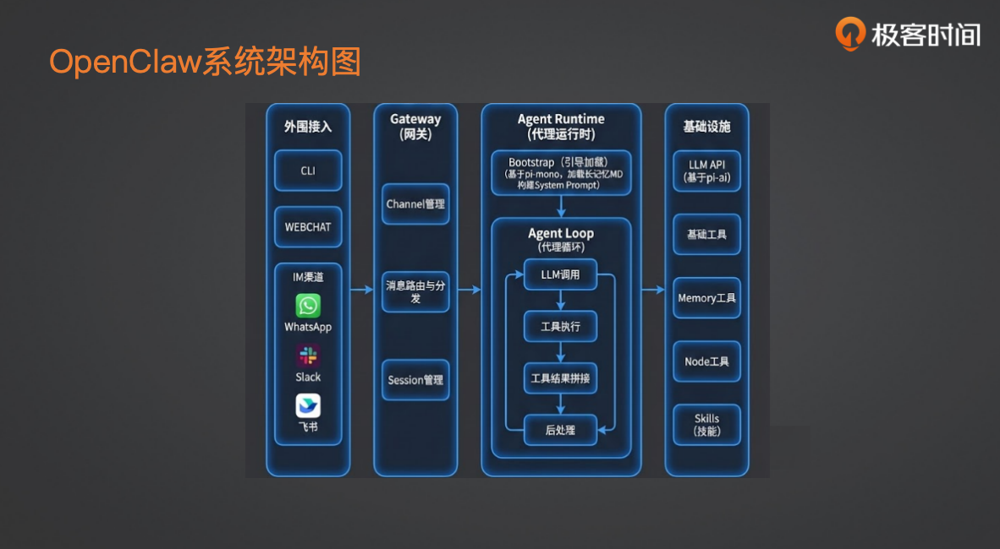

OpenClaw 的外围就是各种 IM 软件。除了 IM 软件，还有两个项目本身提供的东西：一个是 Client 端，也就是命令行的控制端；另一个是 WebChat，它提供了一个小网页，大家可以通过网页端对话使用。这些都是外围的东西。整体上，OpenClaw 的所有东西都放在一个叫 **Gateway 的进程**里，这个进程是一个 Node 服务。这个服务做了几件事，我主要列核心的：

- Channel 的管理：Channel 对应的是我刚才提到的各种 IM 平台。比如你在飞书上注册一个机器人，会有对应的 Key。然后在不同场景下——比如不同用户的私聊，或者机器人应用的消息——它都会生成一个新的 Channel。这其实就是你的每一通对话。
- 拿到 channel 后，会进行消息路由和分发，将消息分发到你具体运行的 agent 上。同时，每个 agent 管理着自己的多个 session。session 就是你与模型的对话。你最终与 OpenClaw 的交互都是在 session 中进行的。这主要是网关层的作用，它将不同来源的消息渠道在这一层隔离，使得 agent 运行时面对的都是统一的 session 结构。

**session 运行时**

session 运行时，会用到整个 agent 运行时。OpenClaw 的运行时基于开源项目“派 MIMO”构建。它改造了派 MIMO 的 session 管理，但核心的 agent loop（即代理的 react 循环）完全使用了派 MIMO 的“派 agent core”子模块，模型调用则基于“派 AI”子模块。这些是底层的基础设施。一个请求进来后，按照刚才说的流程处理。

一条消息经过分发到达一个 session，假设是新创建的 session，它会先构造与模型对话的 system prompt，使用一套**动态 system prompt 加载机制**。这是 OpenClaw 自己提供的，并在其上做了很大扩充。通过动态加载构建好 system prompt 后，再将用户的对话放入 user prompt 中，交给 agent 执行具体任务。任务执行后，就进入我们熟悉的 **react 循环**。

react 循环本质上是一个死循环：基于构造好的 system prompt 和 user prompt 调用大模型，让模型输出它当前的想法、接下来要调用的工具以及工具的入参。模型根据请求思考下一步该做什么。例如，要生成股票早报，模型会先想到需要获取股票行情信息，可能使用事先提供的一个行情接口 skill。它会决定调用这个行情获取工具，入参包括股票代码、当前日期等。然后 agent 运行时执行该工具，将执行结果以 tool result 的形式拼接到上下文的 message 中。之后第二次调用模型，此时模型能获取到 system prompt、用户任务、第一次的想法、调用的工具及结果。模型基于这些信息再次决定下一步，如此往复循环，直到完成用户的任务后跳出循环。这就是 react 的基本机制。

**背后依赖的基础设施**

除了核心算法逻辑，还需要：

- 大模型 API 的封装，使其能更好地使用 function call、知晓可用工具；prompt 的拼接；不同大模型 API 接口的统一封装。
- 基础工具：agent 要完成任务，需要许多基础工具，例如文件系统操作（写入、阅读、编辑）、bash/shell 命令集成、代码解释器、无头浏览器。这三者（文件处理、代码解释器、无头浏览器）是最重要的工具，有了它们，agent 基本能完成大部分人类操作电脑的工作。此外还有 memory 工具（长记忆相关），agent 可能需要搜索聊天记录，这时会用到 memory 工具。还有 NODE 工具，这个其实是 OpenClaw 自己提供的一整套连接外设的能力，包括连接 iOS、安卓或其他设备。它将这些能力封装成工具，当运行 OpenClaw 的电脑插着外设（如手机或摄像头）时，就可以直接调用这些工具。此外，skills 大家应该也比较熟悉了，它是 Claude 公司推出的一套工具使用协议，基于 skills 可以加载具体的工具。

这些基础工具都是 OpenClaw 已经提供好的。如果你有特殊需求，比如想把飞书的发消息接口封装成一个工具，或者想封装一个百度搜索工具，你可以改代码去实现。不过现在更常见的做法是：直接给 OpenClaw 发一个消息，说“我现在需要一个百度搜索的工具，你自己实现一个”，它就会自己去实现这个工具，放到用户自定义的 skills 目录下，并在里面写好具体的脚本。之后你在 skills 里就可以调用这个百度搜索工具了，当然前提是可能需要提供一些 API key 之类的信息。

以上是整个架构图以及消息进来后的核心逻辑。

**八、OpenClaw 的核心技术亮点**

除了核心逻辑，我们再细讲一下 OpenClaw 里面一些在系统设计上非常优秀的地方。

**1. 上下文工程**

一个 agent 能不能跑得更好，很大程度上依赖于上下文工程。在 OpenClaw 里，有几个强大的机制来保证给到大模型的上下文非常高效，能够完成当前任务。

**（1）system prompt 动态加载**

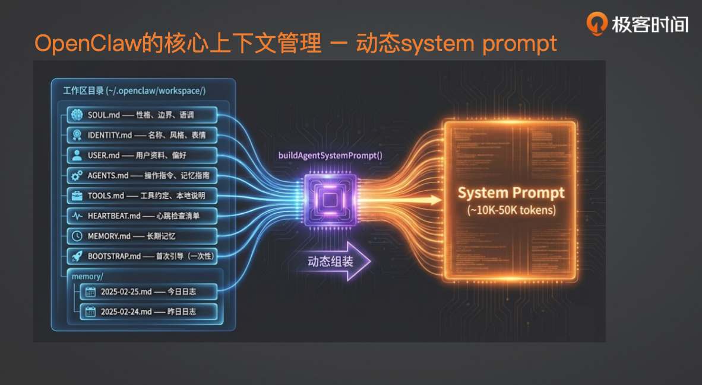

这是 OpenClaw 各种能力最基础的支持。怎么理解呢？在 OpenClaw 发给模型请求之前，它会先拼装 system prompt。除了基础的 react 相关 prompt（比如需要让模型输出工具调用和工具参数）之外，更重要的是动态加载了 OpenClaw 工作区里的几个 **MD 文件**。这些 MD 文件决定了你的 OpenClaw 和其他 OpenClaw 的区别。

- soul.md：这个非常有意思。当时 Peter 在开源 OpenClaw 的时候，唯一没有开源的就是他自己那只龙虾的 soul.md，我们至今不知道他那个性格写成了什么样。但你可以去社区查一下，社区里有大量分享的 soul.md，都写得非常有意思。比如有些让 OpenClaw 以“渣女语录”的方式说话，或者设置成自己理想型的性格和语气。这些东西本质上就是让模型在跟你聊天时，拟态成你想要的样子。
- identity.md：这部分更多是给 agent 自己的身份定义，包括你管自己叫什么名字，是什么样的风格。它和 soul.md 的区别在于，soul 是更本质的东西，是很多决策的影响因素，而 identity 更多是比较表面的东西。
- user.md：这里存放的是关于用户的信息。作为个人助手，它的主人是谁？这里记录的是你作为用户的资料，包括你的身份、职业、喜欢什么、不喜欢什么。
- agent.md：这里面更多是关于你的 agent 的知识和一些记忆相关的东西。当然长期记忆也在里面，但 agent.md 更多的是说你会特定地调教它，比如当它搜索什么东西时用这个工具、搜那个东西时用那个工具，或者调教它做某件事的 SOP 是什么。这类东西都会放在 agent.md 里，也就是你的 agent 在能力和知识上的一些强化指令。
- tools.md：约定了你的 OpenClaw 能调用哪些工具，包括前面提到的 skills 在哪里、需要加载哪些 skill.md，也包括很多本地工具的定义，以及你什么时候该调用这些工具、不能调用哪些工具。
- 除此之外，还有心跳检查清单、长记忆，以及一次性引导。一次性引导是指你第一次与 OpenClaw 聊天时，它会有一个个人引导，跟你聊一些事情，同时把这些文件都记录好。

之所以能有前面说的各种个性化，正是因为当你在使用和聊天时，OpenClaw 会根据情况自行决定更新这些文件。比如某天你聊到了一个自己的偏好，它发现这个偏好应该记在 user.md 里，就会自己记进去。当你不断调教它，告诉它性格应该这样那样，或者你在对话里说“你应该记住这个、记住那个”，它也会把这些信息记在相应的 md 文件里。这就让你的 OpenClaw 成了一个非常个性化、能被你调教的龙虾。但这也带来另一个问题：system prompt 会变得巨大，进而影响整个任务的执行。这也是为什么一定要用非常强的模型——我们都知道模型的注意力有限，一个特别小的模型，输入超过几万 token 时，它甚至可能不知道你在说什么。但强的模型就没有问题。所以，如果你的 system prompt 写得很多，它甚至能直接用上 5 万多的 token，这会导致实际运行中你能用到的有限注意力变得越来越小，当然个性化也会更强。这是它上下文管理里非常重要的一个机制。

这些 md 文件是 OpenClaw 给定的吗？OpenClaw 在运行时，会生成一个初始的 soul.md 或 identity.md，同时在新手引导时也会问你很多东西来构建这些 md 文件。但首先，你自己随时可以查看并编辑这些 md 文件。也就是说，如果你不愿意用对话去调教它，可以直接自己设定它的性格，或者从网上下载别人的龙虾性格装进去，它就会按那个来运行。

关于加载，这些文件都是固定加载的——当然也有机制决定如何加载，但大部分与它的主对话中，这些 md 都会被无脑加载到 system prompt 里，所以会造成刚才说的 system prompt 巨大。

**（2）上下文的剪裁和压缩**

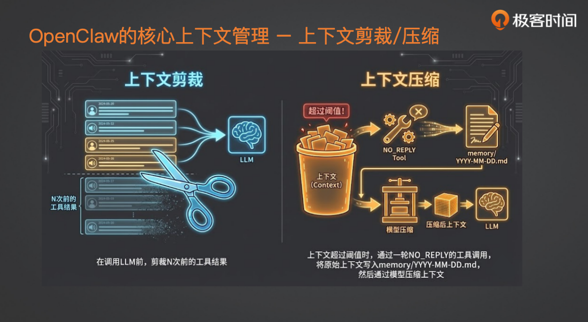

OpenClaw 本质上并不是一个 multi-agent 架构，而是一个**单 agent 架构**。单 agent 架构就是说，在刚才的循环里，它会不停地执行工具使用和工具结果拼接，并不断把新的 message 追加到模型上下文里。这就带来一个问题：system prompt 已经有 5 万多 token 了，每一次工具调用又会把入参和出参都累加到上下文里，这样上下文很容易爆掉。这也是单 agent 的最大问题。为了规避这个问题，OpenClaw 自己做了一套上下文管理能力，叫做**上下文的剪裁和压缩**。

- 剪裁：最占上下文的东西是工具结果。比如你是一个读文件的工具，结果就是文件全部内容；是一个网络搜索工具，返回的就是 20 条搜索结果的标题和摘要；是一个读网页的工具，返回的就是 HTML。可想而知，工具结果一定最占上下文。如果像刚才说的一直累加，token 数就会爆炸，上下文很快就满了。OpenClaw 的上下文剪裁机制会自动把 n 次前的工具结果全部隐掉，只记录模型当时的 thought 和工具入参。这样能极大缓解上下文不断追加的压力。
- 压缩：除了剪裁，它还会做上下文的压缩。它会为上下文设定一个阈值，比如模型假设接受 100K，但通常不会设那么高，可能到 80K 时，框架发现上下文已经 80K 了，就会自动调用一个叫做“no reply tools”的机制。这个调用会做几件事：第一，把当前上下文的所有原始信息存到 memory 里的“每天日志记录”中，这里面记录的是没被压缩前的完整上下文。所有的原始信息都会被存下来，包括模型的 thought、工具入参以及工具的原始结果，都会存在这个文件里。存完之后，系统会进行压缩：用模型对之前的全部上下文做一次压缩，只保留最关键的信息。这样压缩后的 message list 变得非常精炼，但同时并没有丢掉详细信息，因为详细信息已经写入了 md 文件。当需要查看之前的记录时，可以通过 memory 工具去检索。这样的设计让上下文在快要爆掉之前主动压缩，是保证任务能够顺利完成的重要机制。

**（3）长记忆搜索**

刚才提到，龙虾经常会突然记起之前聊过的一件小事，让人觉得特别暖心。这是怎么做到的呢？它通过一套**双层的长记忆机制**来实现。

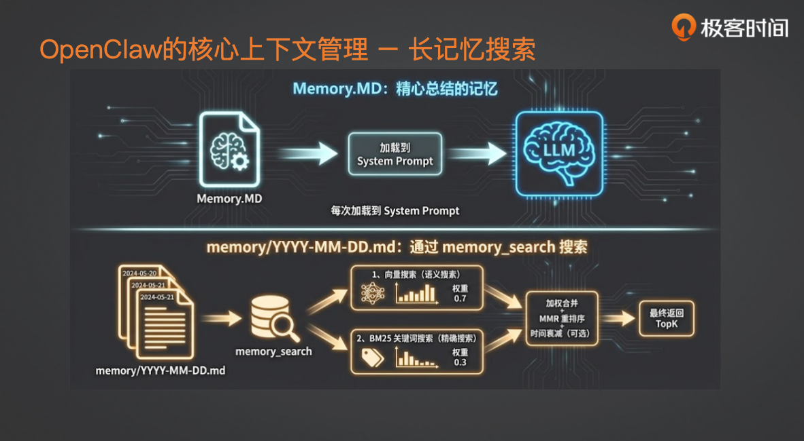

- 第一层是 memory.md。这个文件是模型在心跳触发时，不定期检查之前的聊天记录和运行日志，把最核心的记忆点或你在对话中明确要求“记住这件事”的内容，写入 memory.md。这样在下次拼接 system prompt 时，这些长期记忆就会被加载到上下文中，模型就能知道这些信息。
- 第二层是一个系统内置的 memory search 工具。它的搜索目标是刚才写入的那些带日期名的 md 文件（即原始上下文）。具体做法是：在每次记录 memory 时，同时为这些原始信息创建向量索引。底层没有用专门的向量数据库，而是用了 SQLite 自带的轻量级向量索引。搜索时还会结合关键词索引，进行混合搜索：先做向量搜索（对比相似度召回一部分），再做关键词精确匹配召回另一部分，两者权重约为 7:3。最后将结果加权合并、重排序，并基于时间等策略返回最相关的 top K 内容。这样龙虾就能用到历史上的记忆，给出暖心的回答。

以上就是三个上下文能力（动态 system prompt、上下文剪裁压缩、长记忆搜索）如何支撑一个单 agent 架构的 OpenClaw 既能高效运行任务，又能记住大量信息。

**2. 后台任务：双调度机制**

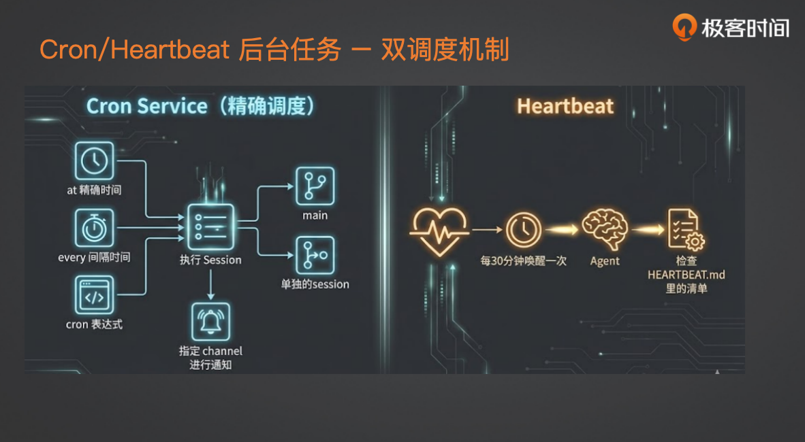

前面提到产品特性时说到，OpenClaw 之所以话题性强，是因为它的自主性特别强，会主动提醒你各种事情。这种自主性底层靠的是**双调度机制的后台任务**。说起来其实很简单。后台任务分为两种：

- Cron Tab

OpenClaw 自己维护一个 cron.json 文件，记录需要精确调度的任务。它支持三种 Cron Tab 调度：

- 精确时间：比如你跟它说“今晚 8 点提醒我参加直播”，它会建立一个精确时间的 cron 任务。
- 间隔时间：比如“接下来每隔 20 分钟提醒我一次”，它会记录间隔任务。
- Cron 表达式：比如“工作日每天上午 8 点提醒我起床”，或“交易日每天 9 点半给我搜一下行情”，这些会记录为 cron 表达式任务。

当你和 OpenClaw 聊天时，它会根据你的安排把任务记成 cron 任务。这些 cron 任务有两种执行环境：一种是在主 session 里执行，另一种是用单独的 session 执行。这对应之前讲的消息路由部分——每个渠道（比如 QQ 号）会对应到具体的某个 session，后台任务也可以创建新的会话来执行。

定时任务如果指定在某个 session 上执行，它会用该 session 的上下文来运行；如果用 main，则会用后台最主 session 的上下文来执行定时任务。任务执行完后，结果会放到哪里呢？在记录 cron 任务时，同时会记下通知要发送到哪个 channel。这里的 channel 可能是 last（最近一次的 channel），也可能是你指定的某个 channel ID。比如你正通过某个 QQ 聊天让它创建任务，它就会记住当前 channel 的 ID，后续用这个 channel 通知你。

- Heartbeat 机制

heartbeat 每 30 分钟无脑唤醒一次，让 agent 做点事情。它做什么呢？每 30 分钟它会检查心跳清单（即之前提到的上下文里的心跳检查清单）。在日常聊天中，当 OpenClaw 认为某个任务可能是长期任务、需要时不时处理时，就会把这些待办事项放进心跳检查清单。这些待办任务会在 heartbeat 调度时被检查到。比如，之前聊天知道某人生日是某天，它会把“在生日那天发祝福”放到心跳清单。每 30 分钟唤醒时，它会根据当前日期判断是否需要完成清单里的任务。如果需要，就主动发起；如果不需要，就静默返回 heartbeat ok。

所以，**两种机制——精确指定的定时任务和定期轮询的心跳任务——共同保证了 OpenClaw 的主动性**：定期检查该做什么，并主动完成。底层就是这样的调度机制。

**3. 工具调用与 Skills 渐进式披露**

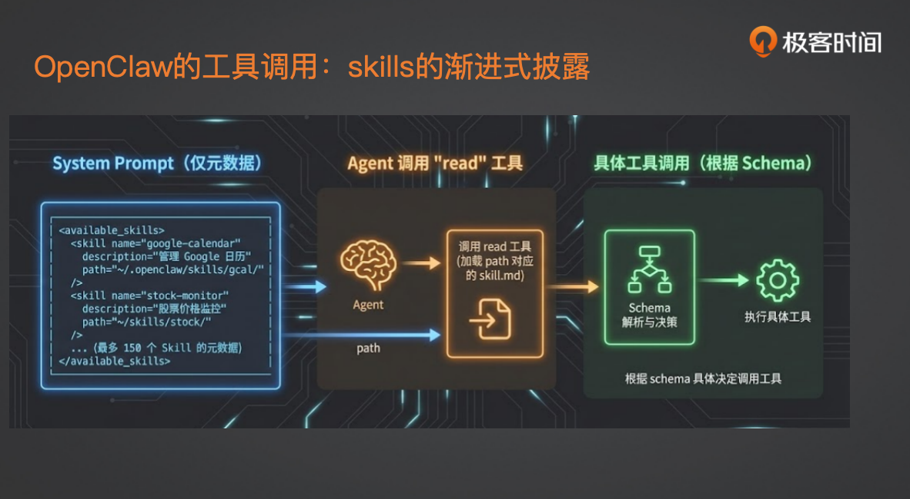

OpenClaw 使用标准的 **skills 渐进式披露**方式来调用各种工具，而且做得非常巧妙。

OpenClaw 在工具中加载了预先安装好的 skills。关于 Claude 当时发布的 skills 协议，它其实分为三层：

第一层是 skills 的元数据，即对每个 skill 的描述（description），通常不超过 100 token，简单说明有哪些技能、干什么用、何时调用、技能在哪里。这是 skills.md 头部的部分。

在 system prompt 加载时，OpenClaw **只加载所有已安装 skill（比如 150 个）的名字和最小描述**，同时把一整段 XML 作为工具描述放到一个“加载 skill”的工具里。当 OpenClaw 决定要用某个 skill（比如 Google Calendar）时，它会调用那个“加载 skill”的工具，入参就是 skill 名称。然后“加载 skill”工具会去读取对应 skill 的 .md 文件（通过 read 工具），把文件的原文作为消息加到上下文里，再返回给大模型。

在 skill.md 文件中，通常描述了一系列信息，比如技能的具体内容、需要调用的脚本、执行步骤，或者用哪些 shell 命令来解决什么问题。一旦这些描述被加载到上下文的某个 tool result message 中，模型就知道了这个技能的存在。当需要调用某个功能时，模型会根据 skill.md 中的说明，执行对应的脚本来完成工具调用。工具调用通常通过 shell 执行，执行结果再加载回上下文，从而完成整个技能的加载。

这就是 **skills 渐进式披露的底层原理**。它的首要效果是节省上下文。对于一个单 agent 来说，如果想把 150 个能力的全部细节都直接塞进 system prompt，那 token 数可能就不是 5 万，而是 50 万都打不住。但通过渐进式披露，system prompt 只保留技能名称和最小描述，具体操作步骤和调用方式则在需要时动态加载。这样既避免了无关信息占用上下文，也让整个 prompt 不会变得臃肿。比如不需要 Google 日历时，就没必要把它的十几种脚本调用方式都放在 system prompt 里浪费 token。这正是渐进式披露的好处，如今已成为自主运行 agent 加载技能的标准范式。

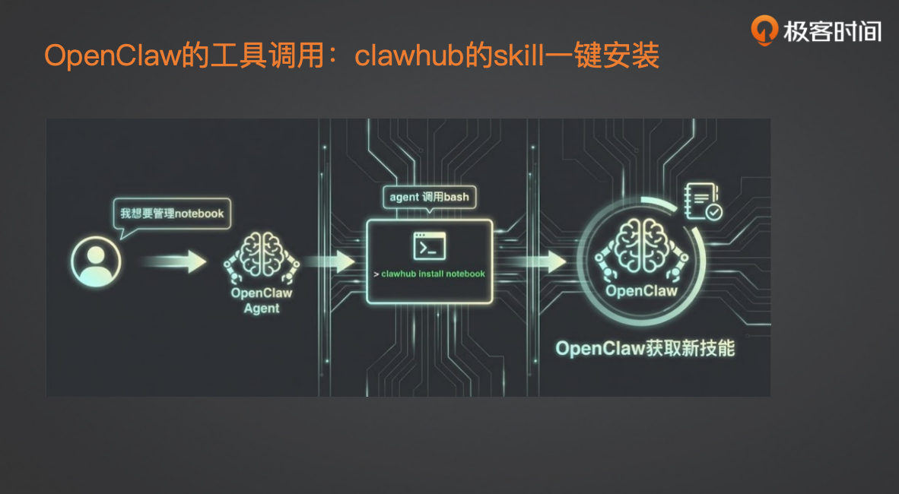

OpenClaw 不仅实现了这套机制，还做了一件非常有意思的事：**技能的一键安装**。比如你想拥有一个管理 notebook 的技能，但不知道具体怎么实现。你只需直接对 OpenClaw 说“我想要一个管理 notebook 的能力”，OpenClaw 就会自己去 Pro Hub（通过 bash 命令）搜索相关 skill，找到后自动用 Pro Hub install 把它安装到自己的技能列表中。从此你的龙虾就获得了使用 notebook 的能力。这体现了工具和 agent 的自主进化——之所以标准协议（如 MCP、skills）强大，是因为它们能让 agent 低成本地获取新能力。而 OpenClaw 更进一步，它能自己修改自己的代码，在自己的环境中安装插件，从而通过对话实现技能的获取，这是非常有趣的进化特性。

有同学提到，使用 skill 时总要手动提醒模型。这涉及两方面：一是模型能力。如果模型不够强，面对 5 万 token 的上下文，让它集中注意力去调用某个 skill 本身就是挑战。二是 prompt 设计。skill 的 description 只有 100 token 的容量，如何在这短短的描述中清楚告诉模型“什么时候该调用这个 skill”非常关键。除了说明能力，一定要强调在何种场景下必须使用该 skill。这两点（模型能力和 prompt 技巧）缺一不可。

**九、复刻 OpenClaw 的蓝图**

如果你想做一个 OpenClaw，其实很简单，按照下面的蓝图去做就行。

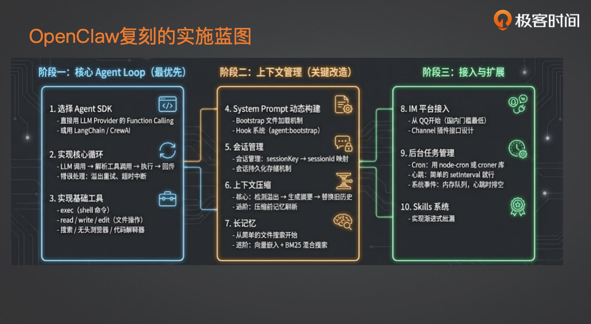

1. 真正的自主决策 agent

首先模型一定要好，要有非常好的模型核心。除此之外，你需要用到重要的 react 循环。这个循环你可以自己写（比如用模型 function calling 方式），也可以用现成框架，比如 LangChain 或 QL AI（我的课程主要以 QL AI 为主）来实现。选定 agent SDK 后，你需要打磨这个循环，包括如何调用和解析工具，还要处理错误、控制上下文、处理各种失败情况，以及重试和超时策略。

1. 安装基础工具

最基础的是：shell 命令（没有它很难实现自我进化等操作）、文件操作（read/write/edit）、搜索（获取互联网知识，无头浏览器用 Playwright）、代码解释器（让它能写和执行 Python 或 JS）。这些基础工具缺一不可，否则很难构建强大的 agent。

1. system prompt 动态构建

当核心功能跑起来后，它已经能干一些事，但成功率不高。要提高成功率，需要做 system prompt 动态构建。你不必像 OpenClaw 那样写很多（soul、identity 等），但需要有一套自己的 system prompt 管理机制，比如用 Markdown 文件让模型自动加载。

1. hook 系统

你需要在各个关键点添加钩子，比如 system prompt 构建前后、模型调用前后、工具调用前后。这些钩子可用于调试、安全管控、动态加载和上下文管理。

1. 会话管理

不能让 agent 只接收一次命令就结束。需要管理 session：何时新建、何时复用、何时重试，以及 session 存储在哪里。

1. 上下文工程

你需要检测上下文溢出、生成摘要、做裁剪和压缩。如果想更强大，可以加一套长记忆系统，先从简单搜索开始，再逐步加入向量搜索和混合搜索，提升检索效果。

1. 接入 IM 平台

完成以上后，你可能还在单机用命令行跑。要像 OpenClaw 那样用手机就能用，就需要接入 IM 平台。国内比较方便的是 QQ，因为飞书依赖企业环境，个人版受限；钉钉个人虚拟团队设置麻烦。QQ 的缺点是主动发消息接口被取消，agent 必须回复某条消息，不够灵活。如果想接入更多 channel，需要设计 channel 插件。

1. 后台任务

IM 搞定后，更强大的功能是后台任务，把短任务变成长任务。实现起来很简单：用 Cron Tab 或简单的心跳机制即可。

1. skill 加载系统

很多框架自带（如 Launchpad），接进来就能用；如果没有，你可能需要自己实现渐进式披露的加载机制。

把这些都搞好，一个自己手搓的 OpenClaw 基本就完成了。这一套东西如果理解了原理，基本上花上一两周，再加上 Web coding 的能力，搭建起来应该不成问题。这也是我后续课程里会带着大家做的实战部分。刚才讲的就是复刻整个项目的蓝图。当然，你之后可以自己再丰富，加入更多能力，比如语音、多模态等等。

**十、未来展望与建议**

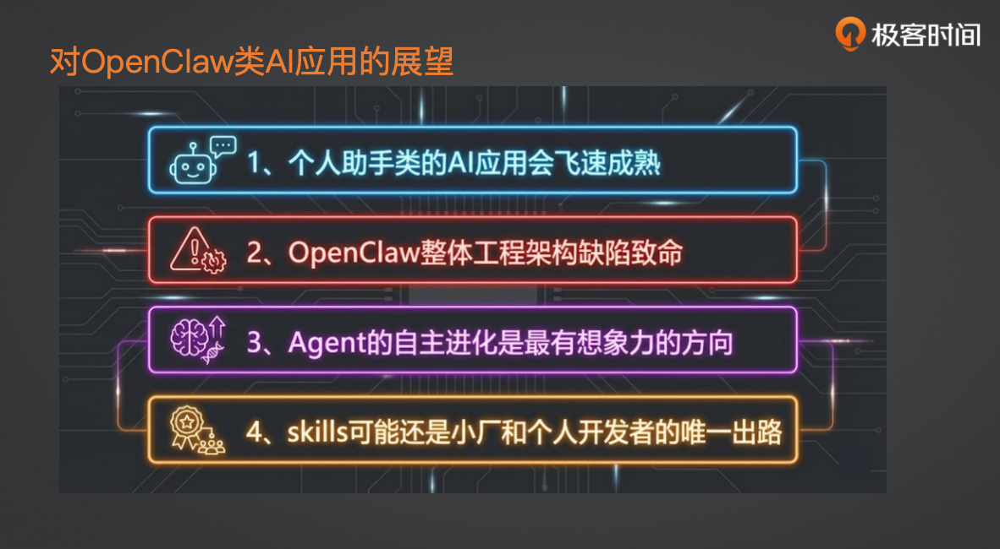

**1. 个人助手类 AI 应用将在今年上半年飞速成熟**

现在，无论开源还是闭源的项目都已经开始涌现。目前大家公认最难解决的，主要是安全问题和如何降低成本这两件事。但可以看到，关注这个方向的人越来越多，至少它的产品范式，我认为现在已经相对成熟了。这必然会带来个人效率的巨大提升。虽然现在程序员们都在卷各种代码、coding 能力和项目开发，但我认为很快，当一批 AI 产品经理成熟后，各行各业使用电脑的白领们，都会感受到这类个人助手产品的冲击。这就是个人助手类应用的前景，我认为它会很快成熟。

**2. OpenClaw 本身可能不会成为这类助手的最终解决方案**

OpenClaw 目前更像是极客的玩具。虽然已经做了很多安全优化，但它的底层，特别是那套臃肿的代码库，以及大量的 PR 提交、Bug 修复，导致它基本上两三天就会升级一次。经常是升级完，定时任务相关的功能挂了；再升级一次，各种模型调用又出问题了。它迭代非常快，但整个开源项目太臃肿了。我认为 OpenClaw 这个工程本身，可能不会成为最终解决方案。但它成功构建了一个产品范式。后续会有很多基于它的工程出现，可能是替代品，也可能是大厂开发的，最终推向 C 端。因为虽然现在 OpenClaw 云端部署变简单了，但那只停留在“能跑起来”的阶段。要让它真正好用，门槛依然非常高，比如安装什么 Skill、如何调教等等。所以，它目前主要还是局限在极客群体里。

**3. “自主进化”是今年非常有想象力的方向**

大家可能已经注意到，除了 Skills 之外，出现了一个叫“Evo Map”的新东西，我也是前两天才关注到的，打算把它写到后续的课程里。我觉得它非常有前景。它的原理是，所有 Agent 在初期尝试解决问题时，就像 ReAct 模式一样，会走很多弯路，这也是 Token 消耗最大的地方。但一旦它找到了一个解法，就可以进行复盘，并把复盘的结果沉淀下来，形成一个自己的观点，或者像 Evo Map 里叫做的“胶囊”。这样，下次再执行类似任务时，它就能直接找准方向。这个机制会让 Agent 的执行层面变得越来越精准，实现不断的进化。尤其当把它连接到网络上，无数 Agent 在跑，每个都找到了自己的最佳解法，并把解上传共享。当然，这中间会有信息过滤和搜索的机制。一旦这个机制跑通，Agent 的自我进化速度会非常快。所以我觉得这是今年非常有想象力的一个方向。

**4. 对个人开发者和小厂开发者的建议**

虽然搭建一个 OpenClaw 可能不难，但背后大量的工程工作非常耗费人力和时间沉淀。对于小厂和个人开发者，我建议大家把更多精力集中在 Skill 开发上，集中在某个垂直领域，以及解决具体场景的问题上。因为如果要去卷大的框架，你很难卷过大厂。当然，大厂也有他们的束缚。为什么人家能把 OpenClaw 这类项目开源出来？因为像安全、法律、合规这些问题，开源社区可以暂时不考虑。但如果你把它作为创业方向，你同样会遇到这些问题。所以，我认为后续大家更好的发展方向，可能是专注于 Skills，专注于 Agent 的各种长期记忆，以及刚才提到的进化方向。

**十一、Q&A 精选**

- 流量 Token 和龙虾图的做法：我所有的图都是用 Midjourney 生成的。现在我做 PPT 基本都用它来画图，虽然有些文字生成得有问题，但整体很符合我的想法。
- 用的什么协议，需要网关进行会话管理吗？：这个指的是 Channel Gateway 那一块吧？它本身是用 Channel 做了一个整体的抽象封装，具体连接某个 IM（比如飞书）时，会基于那个封装去做具体的代码实现。
- 引导加载，类似 Skill 的 Description？：其实在 Bootstrapping 那部分，Skill 都是固定加载的。
- Cron Tab 的配对：确实很依赖当时写的时候模型有没有“抽风”。我的习惯是，对于关键的定时任务，我都会自己去读一下那个 cron.json 文件，看看它配的对不对，然后手动修改。
- 可以基于 CC 改造吗？：可以。就像刚才说的，夸克代码本身就是执行电脑管理任务的很好能力。你把它封装好，无论对接什么聊天会话层，都能很好地应用到个人助手里。但它有门槛，非开发者用起来很难。
- 画 PPT：用 Midjourney。
- API Key 怎么放：最好的方式是写在环境变量里。但同时一定要做好安全门槛，用专门的模型或正则匹配去检查每次模型的回复里有没有泄露这些 Key，绝对不能相信模型。写 Memory 是绝对不行的。
- 自我进化：叫 Evo Map。
- Skill 会被嵌病毒，安全怎么讲：这块我会简单讲，但不会太深入。
- Agent 课程：我打算搭一个类似 OpenClaw 的东西，会加上 Channel 部分，可能只先接个 QQ。
- Nano boot 是什么：是 Nano Core。最近出了很多各种 Core。Nano Core 是一个用 Python 写的类似 OpenClaw 的东西，据说只有 4000 行代码，非常精简。我还在读它的代码。现在读代码已经变得很简单了，像这种开源项目，可以让 Claude 先生成大纲和解析，理出一条主线再去读，会轻松很多。我当时读 OpenClaw 那堆难受的代码时，就是让 Claude 帮我读的。
- 课程会有源码和讲解吗？：会的，会有我搭建出来的源码和讲解。
- 产品经理适合学吗？：产品经理更适合前面设计的部分，工程实战部分可能会比较难。
- 卡顿不动怎么办？：这得具体看日志。可以让 OpenClaw 活了之后，自己去查看日志来排查。
- 课程里是单 Agent 还是多 Agent？：是多 Agent。因为我认为在解决上下文问题上，多 Agent 架构更合适。单 Agent 没有分工，所有上下文都得挤在一个 Context 里；而多 Agent 可以拆分，只需把子任务相关的上下文放进去。所以我会用多 Agent 架构来搭 OpenClaw。
- 多 Agent 对知识库搜索会讲到吗？：会的。我的课程基于 CrewAI，但不会只讲怎么用，我会把 CrewAI 的代码拆开来讲，所以实际上跟具体框架关系不大。我选择 CrewAI，是因为它那套角色的设计，天然地引导大家做好多 Agent 的分工。
- 怎么读开源项目？：理大纲，理出主线，然后个人再去读，甚至不用细读。现在很多代码都是 AI 生成的，你更多是去理解它的设计和实现目的。
- 安全的技术栈？：我不是安全专家。但最重要的，第一是 Prompt 注入防护，第二是运行沙盒。不要让代码直接在主机上运行，无论是 Bash 脚本、Shell 脚本、代码解释器还是文件读取，最好都放到 Docker 沙盒里，这能大大降低安全风险。
- 个人公司靠谱吗？：我觉得挺靠谱的，我自己可能也会往这个方向走。但前提是你得懂很多，并且能快速学习。要能同时做产品经理、架构师、开发和运营，虽然现在每一项都能借助 AI 学习，但确实挺有挑战的。
- 小厂业务前景？：说实话，我现在对互联网的前景是比较悲观的，但这儿就不多说了。
---

来源：极客时间《企业级多智能体设计实战》
提取日期：2026-06-02
