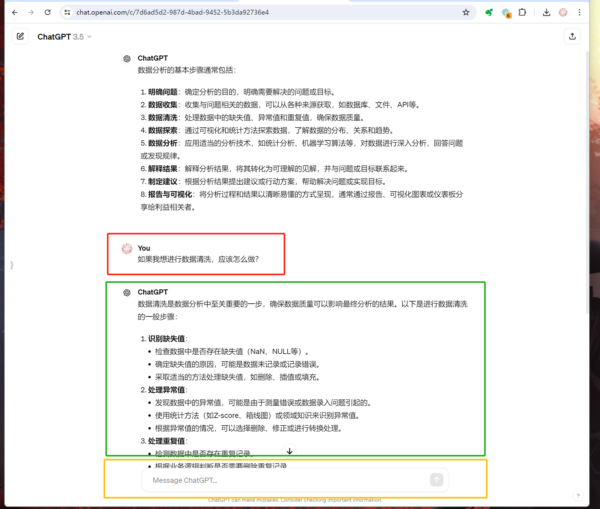

# 01｜数据分析入门：从掌握基础流程开始-AI数据分析课

点击“展开”查看“精华文字稿”

## 数据分析是一项至关重要的技能

说起数据分析，你先想到的可能是一个岗位，就是数据分析师。但其实，数据分析更是一项至关重要的技能，即使你不是数据分析师，只要你有大量的数据要处理，那么数据分析就是值得学习的一项技能。

比如，在工作中，随着工作年限的增加，数据的种类和数量也会不断增加，像邮件、会议记录、业务数据等等。随着时间推移和版本更替，这些数据会出现格式变动甚至缺失。当你决定进行一次大扫除时，发现需要先对这些数据进行加工整理才能派上用场。

那么，怎样才能将原始数据变成推动工作的有效结论呢？你会发现需要掌握的技能还真不少。

首先，需要一款能够处理数据的软件工具，比如 R 语言、Python 等。同时，还需要具备一定的数据分析能力，比如数据清洗、数据整理、数据挖掘等。然后你要确定你的目标，也就是你想从这些数据中得到什么。这样，你才能有针对性地进行数据分析。最后呢，需要将数据可视化，以便更直观地支撑你对数据做出的结论。

发现了没，掌握数据分析能力所需的技能比单纯的统计更有挑战性，需要综合运用多种不同的知识技能。

既然数据分析这么复杂，为什么我们还要去学习呢？手动分析有哪些弊端呢？主观性强就是其中最大的弊端，我为你举一个例子，你就能明白了。

> 今天领导表扬了我–上帝保佑。
> 
> 今天领导批评了我–我必须接受上帝的考验。
> 
> 女朋友弃我而去–上帝关闭了一扇门，也会为你打开一扇窗。
> 
> 女朋友又一次弃我而去–上帝要考验我。

你看，这就是主观性带来的问题，没有全面考虑数据，从而得出不正确的结论。除了证实性偏见的例子外，还有效率低下的问题。如果要你对着几十张 Excel 表格，找出其中哪些数据是异常的，这无疑是大海捞针。

因此，我们需要掌握数据分析能力，使用客观数据进行分析。数据分析可以帮助我们消除主观性、提高效率，帮助我们做出正确决策。

好了，说了这么多，那我们学习数据分析具体需要掌握哪些技能呢？要搞清楚这些问题，我们需要理解数据分析的基本流程，接下来我为你详细介绍。

## 数据分析的基本流程

数据分析的基本流程，一般会遵循以下四个步骤，分别是：了解并确定问题，分解问题和数据，评估与分析数据，得出结论和支持决策。

**第一步：了解并确定问题**

首先你需要明确你要分析的问题，这是数据分析的第一步，也是整个过程中至关重要的一步。你需要确定你要解决的问题，并在此基础上定义数据分析的目的和范围。如果问题不明确，就如同失去方向，无法有效地引导你在数据中寻找答案。

**第二步：分解问题和数据**

一旦确定了问题和目标，你需要将其分解成更具体的问题，并将其与相关的数据关联起来。这一步是为了明确你想要从数据中获取什么，以及需要使用哪些数据来达到这个目的。比如，我需要通过投放广告提高产品销量，这就是一个大问题，你可以将其拆分成三个小问题：

- 广告的目标用户是谁？
- 我们的产品为目标用户带来哪些用处？
- 在什么地方投放广告？

将大问题拆分到你能解决的小问题后，才能更准确地找到大问题的答案。相应的，原始数据也需要进行拆分。你需要收集相关数据，并将其与问题关联起来。在这个阶段，你需要进行数据清洗，去除噪声和异常数据，并将数据整理成适合分析的形式。在这个过程中，你还需要使用 Excel、R 语言或 Python 等软件工具，并运用数据分析的基本知识和技能，如数据清洗、数据整理等。

**第三步：评估与分析数据**

在这一步，你需要对收集的数据进行评估和分析，从而得出结论。同时，你还需要掌握如何将数据可视化，以便更直观地展示分析结果。这一步最具挑战性，最需要技能和创造力。你需要根据经验使用不同的统计学方法，如分类、回归、聚类等。同时，你还需要掌握如何将数据可视化，以便更直观地展示分析结果。为此你需要具备一定的编程和数据库知识。

**第四步：得出结论和支持决策**

最后一步是将分析结果转化为实际行动，从而支持决策。你需要将分析结果与问题进行关联，并根据结果制定相应的决策和行动方案。没错，就是我们在工作中经常见到的数据分析报告。

以上这四个过程，被称作数据分析的通用过程。我们在工作中，也将这四个过程按照需要做的技术工作，划分为**数据收集、数据清洗、数据分析和数据报告**四个工作步骤。

这四个步骤随着目标的清晰度、数据的复杂度、数据完整性以及业务复杂度等指标，会有不同的复杂程度。通常来说，对于中等规模的数据和问题，我们会在半天到一天的时间内完成所有工作。对于大数据和复杂问题，我们可能需要几天甚至几周的时间。另外，这些工作的完成还需要你具备成熟的数据分析技术基础，如果平时没有对数据进行很好的整理，也没有实践过专业的数据分析，将会面临更大的挑战。

到这里，我们深刻理解了数据分析的重要性以及掌握这门技能所面临的挑战。但是别害怕，好消息是现在我们有了大语言模型（LLM），可以帮助我们做一些事，从而提升数据分析效率，降低学习数据分析的门槛。

## 大语言模型如何提升数据分析效率

在使用大语言模型提升数据分析效率之前，我想先带你搞懂什么是大语言模型，以及与大语言模型交互的方式。

我们先来聊聊大语言模型到底是什么？

大语言模型（Large Language Model，简称 LLM）是一种基于深度学习技术的模型，主要是利用神经网络来处理和生成自然语言文本。这类模型通常会在非常大的文本数据集上进行训练，以学习语言的结构、语义和语境关系。通过这种训练，模型能够理解和生成复杂的文本，执行多种语言任务，如文本生成、翻译、摘要、问答等。

简单来说，你可以把大语言模型想象成一个读书无数的图书管理员。这位管理员阅读了大量的书籍，从中学到了如何使用语言、表达意思以及语言背后的深层含义。当你向他提问时，他能够迅速地从他的阅读经历中找到相关信息，并以流畅的语言回答你的问题。

那我们是怎么与大语言模型交互的呢？

与大语言模型交互就像与一个智能助手对话。你可以通过文字输入你的问题或请求，模型则根据其预先训练的知识库生成回应。这个过程中，明确清晰的提问会帮助模型更准确地理解你的意图，从而给出更合适的回答。同时，保持对话的连贯性对于确保信息的准确传递也非常关键。模型会考虑到对话的上下文，也就是之前的交流内容，以此来优化其回答。

也就是说，你与大模型对话时，他会根据自己掌握的知识和你提问的方式为你回答问题。注意了，这里我要强调一点，我们需要学习怎样更好地与大模型对话。

虽然直接与大语言模型进行对话确实非常直观和方便，但有一些更好的提问方法，能够让模型交互更加高效和精准。这种提问方式被我们称作提示词（Prompts）。提示词的设计直接影响了模型如何理解和回应你的问题或指令。

提示词的优化可以看作是一种精细调节的艺术，它帮助模型更好地捕捉你的意图和所需的输出类型。例如，如果你需要一个技术性的解释或一个创意性的建议，通过调整提示词的细微差别，可以使得模型的回答更符合你的期望。

此外，熟悉如何构建有效的提示词还有助于避免潜在的误解或模型的错误响应。它就像是我们给模型的具体指令，明确告诉它我们需要什么样的信息，这样模型就能更精确地提供服务。

也就是说，你直接向大模型提问数据分析知识和使用精心设计的提示词，让大模型回答你的问题还是有比较大的差异的。使用提示词能极大提高与大语言模型交互的质量和效率。这就像是学习一种新语言的词汇和语法，使得交流更为流畅和有效。

到这里是不是有点担心自己不会写提示词啊？别担心，我会在后面的章节中陆续为你介绍使用提示词进行数据分析的例子。

好，咱说了这么多使用大模型的厉害之处，但是大模型这么多，课程中使用哪个大模型呢？

在这个课程中，我们将会使用 ChatGPT 作为主要演示的大模型，因其回复速度快、对提示词理解上相比其他模型理解能力上更强。

ChatGPT 的官方网站我放在这里，你可以直接访问[https://chat.openai.com/](https://chat.openai.com/) ，默认使用的是 GPT3.5 版本的模型，当然，你也可以按照其网站的帮助文档进行付费使用，可以使用更强大的 GPT4-turbo 版本的模型，如果你当前所在的地区无法直接访问，也可以采用通义千问、文心一言等国内知名的大模型，也能完成课程中的绝大部分功能，且部分场景对中文的支持上要比 GPT4 模型更好。

到这里，咱们课程的准备工作就差不多了。在培养数据分析能力的过程中，如何实现更平缓的学习曲线，或者更智能化的方式呢？大语言模型能够为数据分析过程提供很大的助力。

例如，上面提到的四个基本数据分析步骤，大语言模型可以完成以下工作：

- 自动实现数据清洗，如删除空格、处理缺失值、纠正格式错误等；
- 自动识别数据中的噪声和异常数据，使数据质量达到一定的标准；
- 采用自然语言描述目标，根据目标提供各种算法和工具，对数据进行分析；
- 自动识别数据中的特征和规律，对数据进行统计和建模，并将分析结果转化为可视化的图表、仪表盘等形式。

有了以上所有的准备，那咱要动动手了。你可以像我一样，不采用任何花哨的技巧，用平铺直叙的语言向 ChatGPT 提问，例如：

- 数据分析有哪些基本步骤？
- 如果我想进行数据清洗，应该怎么做？
- 数据分析有哪些常见的图表？
- ……

截图中红色部分是我向 ChatGPT 提问的问题，绿色是 Chat 的回答，如果你对他的回答还不满意，可以在黄色的部分，继续提问。我建议你一定要亲自动手提问，有一个感性的理解后，再继续学习后面的内容，这样对你理解大语言模型非常有帮助。

如果 ChatGPT 的回答的确差强人意，你也不要嫌弃它，后面我会带你更深入地学习如何向 ChatGPT 提问，让大语言模型“更聪明”，咱们可是要让 ChatGPT 一路进化的，**从帮你干活到教你学数据分析再到替你干活**。

值得一提的是，大语言模型的功能实现只需要自然语言，不必进行复杂的编程和数据库操作，更容易上手，更容易进行实践，能够大大提高数据分析的效率和质量，降低数据分析的门槛，使更多的人能够掌握这项关键技能。同时，通过大语言模型的训练，可以不断提升数据分析的准确性和深度，为我们的决策提供更准确、更可靠的支持。

## 大模型之外的工作

除了大模型外，仍有一些数据分析工作需要手动完成，这些工作也是实现数据分析的关键过程。这些手动的工作主要是确定问题和原始数据仍需手动准备。

问题的确定可以帮助我们在数据中避免迷失，原始数据则是支撑结论的重要起点。虚构数据无法得出真实的结论，因此，我们得明白大语言模型加持下的数据分析并不是万能的。除此之外，有些数据分析工作，比如数据可视化的展现，我们还需要一些专业的数据可视化工具来实现。对于复杂的业务数据，还需要进行进一步的分析和建模，利用一些专业的机器学习算法，如神经网络、决策树等，来实现数据分析的目标。

在数据分析过程中，我们需要不断地实践和探索，从中积累经验，形成自己的数据分析思维。数据分析工具的选择应该以满足实际业务需求为前提，选择适合自己的工具和方法，并且不断学习和提升自己的专业技能，才能更好地完成数据分析工作。

## 总结复习

最后，我们总结一下今天的内容。这节课主要和你分享了在海量数据中数据分析的必要性，能够有效避免认知偏见。同时，我们还讨论了数据分析的四个通用过程：了解并确定问题，分解问题和数据，评估与分析数据，得出结论和支持决策。虽然大语言模型可以帮助清洗数据、提供海量的算法和自动编写相应的代码，但明确问题和提供充足的原始数据仍需要人工进行。有了大模型，你可以边实践边学习数据分析，并且在实践过程中不断成长。

## 课后作业

按照惯例，我将留下一个练习。请你分别以：

- 提供给我今天的 10 条新闻？
- 掌握数据分析需要哪些知识和技能？
- 为什么每个隧道上都有一座山？

向大语言模型提问，并尝试通过多次对话，让大语言模型为你提供你满意的答案。

欢迎你在评论区分享你的想法。

---
来源：极客时间
链接：https://time.geekbang.org/column/article/777362
日期：2026-05-29
