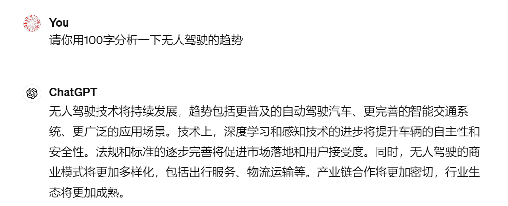
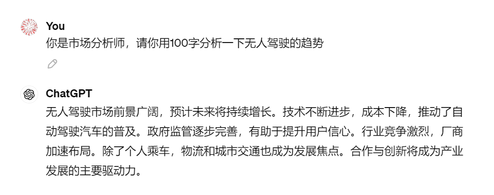
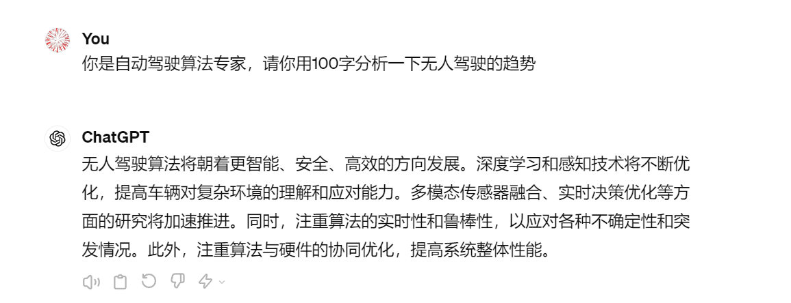

# 03｜Prompt提示词：与大模型交互的主要方式-AI数据分析课

点击“展开”查看“精华文字稿”

学了前面两节课，我们知道和大语言模型的交互中，提示词起着至关重要的作用。它们不仅是沟通“你的需求”和“模型理解”之间的桥梁，还可以极大地影响模型的输出质量。也就是说，优质的提示词设计不仅可以让模型理解你的问题，还能按照你的预期提供精确的分析或回答。

那么，什么样的提示词设计才能提高大语言模型的输出质量呢？今天我们就来聊一聊提示词这个话题，带你找到一些通用的技巧和原则。

## 提示词的一般技巧

这里我先给你详细介绍几个实用的技巧，帮助你优化与大语言模型的交互。

### 技巧 1：简洁具体，明确任务要求

**好问题比答案更重要**，编写提示词的第一个要求就是具体和明确，描述清晰。这意味着在设计提示词时，你需要尽可能详细地描述你的问题和你希望模型如何回答。例如，如果你需要一个数据分析的结果，具体指出需要分析的数据类型、预期使用的分析方法以及结果的表现形式，将帮助模型更准确地理解并执行任务。

你可能还不太理解对数据分析的具体要求，我写一个生活中的例子给你比较一下。

> 愚蠢的问题：救命啊，这段数据怎么分析？
> 
> 明智的问题：为我找出这段数据可能有哪些规律？

通过明智的问题，你不仅定义了大语言模型需要关注的分析方向，还减少了模型可能产生的误解。对于数据分析新手而言，这种方式可以有效降低认知负担，让你逐步通过模型的回答深入理解数据。

### 技巧 2：设定专业角色

设定模型的角色，如研究员、分析师等，也是一种有效的技巧，它可以帮助模型根据设定的角色调整其回答的深度和风格。这种方法不仅提高了回答的专业度，还能使交互更加符合实际工作场景的需求。例如，如果你将模型设定为市场分析师，询问关于市场趋势的问题，模型的回答将更专注于提供深入的市场分析。我为你展示一下设定角色和不设定角色的差别。







不难看出，这三个回答从不同的专业角度出发，分析了无人驾驶技术的发展趋势。每种角度侧重不同的关键因素，这也是我们面对复杂的问题时，先设置大语言模型角色的缘故。

在有限的对话数据中，通过设置不同的对话角色，你可以有效地引导大语言模型针对特定的需要提供专业的答案。这种方法不仅提高了回答的针对性，还能确保你从多角度获得均衡和深入的见解，有必要的话，你还可以设置 ChatGPT 为不同角色，从不同角度帮你完成数据分析工作。

### 技巧 3：提供足够的上下文，交代背景

提供清晰的背景信息可以极大地提高大语言模型的响应质量和相关性。这是因为背景信息能够帮助模型更准确地理解问题的上下文，从而生成更加有针对性和实用性的答案。

想象一下，如果你只是简单地问：“为什么说苹果改变了世界？”这个问题可能指向多个方向。你可能在问苹果这种水果的影响；也可能在询问苹果公司（Apple Inc.）的技术革新；乃至牛顿的苹果；或者是白雪公主口中的苹果。

没有足够的背景信息，模型很难确定你的具体意图，那就有可能导致答案的不准确或不相关。

为了避免这种情况，你可以提供更具体的背景信息。比如，你可以这么问：“在技术领域，苹果公司是如何通过其创新的产品如 iPhone 改变世界的？”

这样一来，你就明确了你的问题是关于苹果公司的，同时也指出了你关注的是其技术创新，特别是 iPhone。

通过这样的背景设定，模型可以更精确地定位你的问题焦点，从而提供更详细、更具针对性的回答。例如，模型可能会讨论 iPhone 如何革新了智能手机市场，引领了触控技术的普及，以及它如何影响了现代通信和媒体消费。

### 技巧 4：明确回复格式

要求模型按照特定的格式回复，如列表、报告、图表等，这不仅有助于增强输出的实用性和可读性，还能确保信息的组织和呈现方式符合用户的实际需求。

举个例子，假设你是一位市场分析师，需要了解某个新兴市场的发展趋势。你可以这样指定你的需求：“请以报告格式提供关于 XX 市场 2023 年的发展趋势分析，包括关键增长领域、主要竞争者和预测的市场规模。”这样的指令不仅告诉了模型需要关注的具体内容，还明确了信息应该如何被组织和呈现。

通过这种方式，你可以确保得到的报告不仅包含所有必要的信息，而且格式清晰、条理分明，便于阅读和理解。这对于需要 2 做出决策的商业环境尤其重要，因为它可以大大减少信息处理的时间和努力。

甚至你还可以让 ChatGPT 为你输出特殊的文件格式，比如提供 Word 文档并下载、提供 JSON 数据格式等。

这是一个非常有效的提示词技巧，我曾经用这样的方式做过非常多的数据预处理，让 ChatGPT 将不规范的网页内容，自动为我整理成格式工整的 Excel。

### 技巧 5：学会“Say No”

02 讲咱们介绍过大语言模型的原理，大语言模型是从巨大的数据集中学习语言模式，它们并不真正“理解”内容。那么，在设计提示词时，明确指出不希望模型执行的操作或避免的错误，可以防止模型生成不相关或不准确的内容。

例如，如果你不希望模型提供处理文字的中间过程，只需要显示执行结果，就应明确指出避免包含任何形式的编程代码。

通过以上这些技巧，你可以有效地提升与大语言模型的交互质量，使模型的回答更加贴合你的实际需求，助你更高效地利用模型的能力，无论是在业务分析、学术研究还是日常的问题解决中。

## 提示词工程

有了以上这些基本技巧打底，接下来我要给你介绍一个更高阶的概念：提示词工程。

关于提示词工程，我们需要进一步掌握“硬提示”和“软提示”两个概念，理解这是啥，看看它们是如何帮助优化模型输出的，并理解这两者的区别。

### 硬提示（Hard Prompts）

先说原理，硬提示是直接嵌入到输入中的具体指令或信息，它们通常是非常明确和具体的。这种类型的提示词直接告诉模型需要执行的具体任务或者提供的确切信息。硬提示的好处是它们可以非常精确地控制模型的输出，使得结果更加符合预期。

硬提示咱们主要掌握两种技巧，分别是思维链和思维树，咱们分别看下。

**思维链**（Chain of Thought，CoT）：链式思考技术通过引导模型逐步解释其解决问题的过程，使得模型能够处理复杂的推理任务。这种方式通过构建一系列逻辑步骤，帮助模型“思考”并提供更加详尽和准确的答案。通俗来讲，就是按照逻辑推理步骤输出中间思路，而不是直接生成最终答案。

**思维树**（Tree of Thought，TOT）：思维树对话技术鼓励模型在生成回答的同时，解释其思考过程。这有助于提高模型的透明度，让使用者能够理解模型如何达到其结论。简单一点来说，就是把任务形式化为一个对话，模型需要按步分解并逐步回答。

我用一个例子来带你看一下，针对不同的提示词，大语言模型是怎么回答的。

```
输入: 计算一个圆锥体积, 底面半径为 3 米, 高度为 4 米。
输出: 非常抱歉, 我没有足够的信息来计算这个圆锥的体积。通常需要知道半径和高度并依据公式进行计算。
```

这里模型没有正确理解问题或者没有足够的指导来进行计算，因此给出了错误的回应。那么我们采用思维树提示，再来尝试一下。

思维树提示

```
输入: 嗨, 能帮我计算一下一个圆锥的体积吗?
输出: 好的, 告诉我圆锥的底面半径和高度是多少, 我会按步骤计算。
输入: 底面半径是 3 米, 高度是 4 米。
输出: 了解了, 让我一步步推导:
计算圆锥体积的公式是 V = 1/3 * π * r^2 * h, 其中 r 是底面半径,h 是高度
给定的半径 r 是 3 米, 高度 h 是 4 米
将这些值代入公式: V = 1/3 * π * 3^2 * 4 = 1/3 * 3.14 * 9 * 4 = 37.68
单位是立方米, 因为这是体积
所以这个底面半径 3 米、高 4 米的圆锥, 其体积是 37.68 立方米。
输入: 太感谢了, 我理解你的推导过程了!
输出: 很高兴能够清晰地解释这个计算过程! 如果你还有任何其他问题, 随时问我。
```

通过这个示例，我们可以看到硬提示技术，可以让模型能够以一种更接近人类解决问题的方式来处理信息，过程中增加了透明度和逻辑性，从而提供更加详尽和准确的答案。这种技术特别适用于需要复杂推理和详细解释的场景，如科学计算、技术问题解答等。

探讨完硬提示技术后，我们继续看软提示技术。

### 软提示（Soft Prompts）

还是先看原理，软提示的核心在于它的灵活性和隐晦性。与硬提示直接指示具体任务不同，软提示通过设置语境或引导思考方向来间接影响模型的输出。这种方法让模型在一个更广泛的框架内自由发挥，从而适应各种复杂的应用场景。

针对软提示技术，咱们也需要了解两种技巧，分别是 RAG 和领域数据微调。

**RAG** (Retrieval-Augmented Generation)：这是一种结合了语义检索和生成式模型的技术。具体来说，它首先从大型语料库中检索与输入相关的信息段落，然后将这些检索到的内容与原始输入一起送入生成模型。这种方法不仅赋予了模型事实查找的能力，还增强了其推理能力。主要的应用场景，比如在回答有关历史事件的问题时，模型可能需要先检索相关的历史资料，然后基于这些信息生成答案。

**领域数据微调**：通过在特定领域的数据集上训练模型，可以显著提高模型对该领域的理解和表现。这种技巧通常需要大量的标注数据，还可能涉及到模型结构或参数的调整。应用场景很多，比如在医疗领域，模型可以通过学习大量的医疗文献和病例报告来提高其在诊断或治疗建议方面的准确性。

这里咱们只需要先了解这几个核心概念就行，软提示的实现方式更繁琐，我们将在后面的课程里为你详细讲解。

### 硬提示 + 软提示，组合应用

了解了硬提示和软提示的概念，那咱是不是可以把这些技术组合使用呢？当然可以了，例如，可以先使用 RAG 技术检索相关信息，然后通过 CoT 技术对结果进行逻辑推理。此外，领域微调可以应用于任何预训练模型，以增强其在特定领域的性能。

从底层逻辑上来说，这些技术都是为了给模型提供充分的上下文和指导，引导模型朝预期的方向思考和生成。

除了硬提示和软提示，提示词工程还可以根据对话的轮数划分为 Zero-shot 提示、One-shot 提示以及 Multi-shot 提示。

### Zero-shot, One-shot, Multi-shot

我给你总结下他们的概念和示例。

- **Zero-shot 提示**：这种方式不依赖于任何先前的示例，直接使用自然语言指令来引导模型完成任务。例如，给出“翻译下面这句英文到中文：”的指令，模型就会尝试将后面跟着的英文句子翻译成中文。
- **One-shot 提示**：在 Zero-shot 的基础上，给出一个输入 - 输出示例对，作为模型的参考。例如“英文:Hello world，中文: 你好世界；英文:How are you?”。模型会参考第一个示例对来推测第二个句子的中文翻译。
- **Multi-shot 提示**：给出多个输入 - 输出示例对作为上下文，以进一步增强模型的理解和推理能力。

为了让你更好理解，我们仍然使用计算圆锥体体积的案例来看看 Zero-shot 提示与 One-shot 提示。

```
Zero-shot 提示:
输入: 计算一个圆锥体积, 底面半径为 3 米, 高度为 4 米。
输出: 非常抱歉, 我没有足够的信息来计算这个圆锥的体积。通常需要知道半径和高度并依据公式进行计算。
One-shot 提示:
输入: 已知一个圆柱的底面半径为 2 米, 高度为 5 米, 它的体积为 (3.14 * 2 * 2 * 5) = 62.8 立方米。
一个圆锥的底面半径为 3 米, 高度为 4 米, 计算它的体积?
输出: 根据圆锥体积公式 V = 1/3 * π * r^2 * h,
其中 r 为底面半径 3 米,h 为高度 4 米,
将数值代入计算:
V = 1/3 * 3.14 * 3 * 3 * 4 = 37.68 立方米
```

简单来说，One-shot 提示就是先给大语言模型示范一次，再让大语言模型来根据你的套路来输出。

而 Multi-shot 提示你可以参考上面的 ToT 案例，这也是我前面提到过的，可以互相组合使用。

## 动手实践，从知道到做到

接下来，我们来实践一下这些技巧。我以 Mr. Ranedeer AI Tutor（[https://mr-ranedeer.com/](https://mr-ranedeer.com/)）提示词为蓝本，结合硬提示，编写一个数据分析学习步骤的提示词。

Mr. Ranedeer AI Tutor 教你学习数据分析的提示词如下：

```
Drawing inspiration from the structure and objectives outlined in the "Mr. Ranedeer AI Tutor" documents, we can design a reflective and dialectic prompt for learning data analysis. This prompt will focus on deepening the understanding of data's inherent value through critical examination, reflective thinking, and exploration of multiple perspectives.
Data Analysis Learning Prompt: A Reflective and Dialectic Approach
Objective: The goal is to foster a deep understanding of data analysis by engaging students in a reflective and dialectic process that goes beyond the surface of datasets to uncover the underlying stories and implications.
Student Configuration:
🎯Depth: Highschool to Undergraduate
🧠Learning-Style: Active and Reflective
🗣️Communication-Style: Socratic and Story Telling
🌟Tone-Style: Encouraging and Informative
🔎Reasoning-Framework: Causal and Analogical
😀Emojis: Enabled to enhance engagement
🌐Language: Adapt to the student's preference
Curriculum Framework:
Introduction to Data Analysis
Understanding the importance and fundamentals of data analysis.
Exploring different types of data and their sources.
Critical Examination of Data
Learning to question the reliability and validity of data sources.
Understanding biases in data collection and analysis.
Data Interpretation and Storytelling
Developing the skill to interpret data beyond numbers and statistics.
Crafting narratives based on data findings to tell compelling stories.
Reflective Analysis and Ethical Considerations
Reflecting on the impact of data analysis results on society and individuals.
Discussing ethical considerations in data analysis.
Application and Exploration
Applying learned concepts to analyze a dataset.
Encouraging exploration of data from multiple perspectives to uncover deeper insights.
Prompt for Reflective and Dialectic Engagement:
"Imagine you've been given a dataset related to recent environmental changes in your region. As you analyze this dataset:
Reflect on the sources of this data. What motivations might have driven the collection of this data? How might this influence the data presented?
Consider the story the data tells. Beyond the surface-level trends, what deeper insights or contradictions can you uncover about environmental changes?
Engage in a dialectic process. Debate with peers or within your own reasoning the potential biases and alternative interpretations of the data. How does this alter your understanding?
Finally, reflect on the implications of your findings. How do they impact your view on environmental issues, and what ethical considerations arise from the data's interpretation and use?"
Execution:
This prompt can be executed through a series of lessons incorporating interactive discussions, hands-on data analysis exercises, and reflective writing assignments.
Emphasize the use of emojis and encouraging tone to maintain engagement and support a positive learning environment.
Encourage students to use visual tools (like graphs and charts) and storytelling techniques to present their findings and reflections.
Conclusion:
By guiding students through this reflective and dialectic prompt, "Mr. Ranedeer AI Tutor" not only enhances their data analysis skills but also cultivates critical thinking, ethical reasoning, and a deeper appreciation for the stories behind the data. This approach ensures students are not just proficient in technical skills but are also thoughtful analysts capable of navigating the complexities of real-world data.
```

将提示词输入到大语言模型后，你可以进行场景设定，做如下输入：

```
课程名称：数据分析与环境变化
目标学生群体：高中至大学生
学习风格：主动学习与反思学习相结合
沟通风格：索卡拉斯式提问与故事讲述
课程目标：通过反思和辩证的过程，深入理解数据分析中数据的内在价值，以及数据背后的故事和含义。
```

大语言模型会输出如下学习步骤：

```
课程执行步骤
第一步：引入数据分析基础
开始课程时，介绍数据分析的重要性，探讨不同类型的数据及其来源。
使用🦌表情符号鼓励学生参与讨论，用故事讲述方式介绍数据分析的基本概念，如“想象你是一位探险家，探索未知的数据海洋...”。
第二步：批判性审视数据
引导学生反思数据收集的动机和过程，探讨这些因素如何影响数据的呈现。
通过小组讨论，让学生分享他们对数据可靠性和有效性的看法，鼓励使用证据和逻辑来支持他们的观点。
第三步：数据解读与叙事
提供一个关于最近地区环境变化的数据集，要求学生超越数字和统计，解读数据背后的故事。
学生将使用图表和可视化工具来展示他们的发现，并以故事形式进行呈现。
第四步：反思分析与道德考量
让学生反思他们的分析结果对社会和个人的影响，讨论数据解释和使用的伦理考虑。
以写作作业的形式，要求学生表达他们对数据分析影响的看法和感受。
第五步：应用与探索
通过实践练习，让学生应用所学的概念来分析特定的数据集，鼓励他们从多个角度探索数据，以发掘更深层的洞见。
作为课程的总结，组织一个分享会，让学生展示他们的分析项目，分享他们的发现和反思。
课程总结
通过以上步骤，"Mr. Ranedeer AI Tutor" 不仅帮助学生提升了数据分析技能，更重要的是，培养了他们的批判性思维、伦理推理能力，以及对数据背后故事的深刻理解。这种反思和辩证的教学方法确保学生不仅在技术技能上有所成长，还能成为能够驾驭现实世界数据复杂性的思考者。
```

你可以跟着提示，逐步学习数据分析的过程，也可以为其重新指定项目主题，如我将其改为：

```
项目名称：分析气候变化数据与农业产量的关系
```

可以得到返回信息为：

```
好的, 针对这个 " 分析气候变化数据与农业产量的关系 " 的项目, 我们可以从以下几个方面着手:
数据收集
收集过去几十年的历史气候数据, 包括温度、降水量、日照时数、风速等气象要素
收集同期的主要农作物的种植面积和产量数据
数据范围可以是全国或特定区域
数据预处理
对气候和农业数据进行清洗、标准化、缺失值处理等预处理
将数据整理到相同的时间尺度, 如年度或季度水平
相关性分析
计算气候变量 (如温度、降水) 与农产品产量之间的相关系数
绘制散点图等可视化工具, 直观展示两者的关系
利用回归分析等统计建模方法, 量化气候因素对产量的影响
影响分解
探索气候变化对不同作物、不同地区的不同影响程度
分析关键时期 (如生长期) 的气候条件对产量的影响
研究极端天气事件 (干旱、暴雨等) 的作用
情景模拟
基于现有数据, 构建气候 - 农业生产的预测模型
输入未来气候变化情景数据, 模拟农业生产的变化趋势
评估长期气候变化下的农业风险和粮食安全问题
对策建议
结合模型分析结果, 为农业生产的适应性提出建议
如耐逆品种选育、科学管理、政策扶持等
讨论可持续农业和减缓温室气体排放的长远策略
这个项目需要多学科团队合作, 气象、农业、统计和决策领域的专家通力协作。工作成果可以为制定农业发展政策和应对气候变化提供理论支持和数据参考。也可以进一步扩展到粮食贸易、社会经济等更广阔领域去探索。
如有任何疑问, 我们可以继续讨论和交流。祝项目取得圆满成功!
```

## 总结复习

这一讲咱们讨论了优化提示词的一些技巧，最后我们一起来复习一遍。

- 使用简洁明了的语言交代清楚任务，可以减少模型理解指令的难度，提高执行效率。
- 学会设定专业角色，让模型产生更加合适和专业的回答。
- 提供足够的上下文，确保提供足够的背景信息，让模型能够在正确的语境下进行思考和回答。
- 指定期望的回复格式，可以帮助模型更好地组织和格式化它的输出，让结果更符合你的需求。
- 清除无关信息和干扰，确保模型专注于任务本身，避免做无用功。
- 了解思维链、思维树等硬提示技术，增强模型的理解和推理能力。
- 了解 RAG 等软提示技术，让模型输出更加精确、有根据。

这节课内容比较多，但是很关键，咱们可以多复习几遍，多动手实践，一定要做到心中有数。

## 课后作业

按照惯例，给你留一个实践任务。假设你是一位气象数据分析师，需要利用大语言模型的能力，分析最近一个月的天气数据，并预测未来一周的天气情况。

请你向 ChatGPT 提问要想正确预测未来一周天气，需要做哪些数据分析工作，为了有效地使用大语言模型进行天气预测，你需要设计精确的提示词，这些提示词应该明确指导模型关注相关数据和执行特定的分析任务，并且向模型提问怎样能持续优化模型的性能和输出质量。

欢迎把你的提示词分享出来。如果有任何疑问，也欢迎你在留言区提问，我们一起交流讨论。

---
来源：极客时间
链接：https://time.geekbang.org/column/article/777365
日期：2026-05-29
