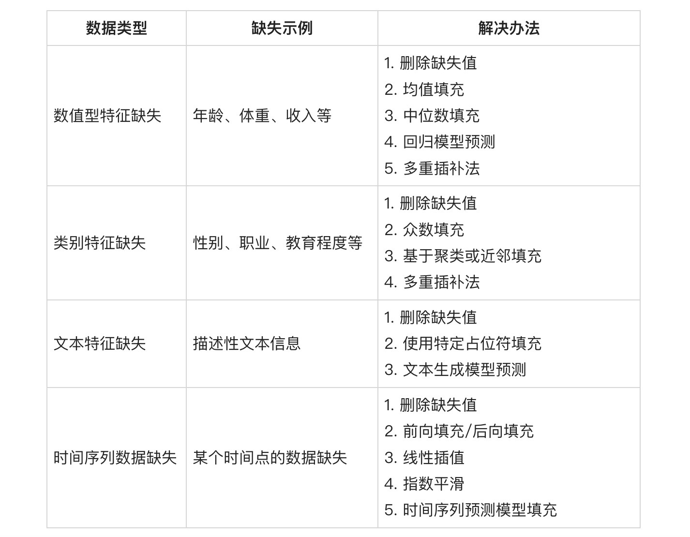
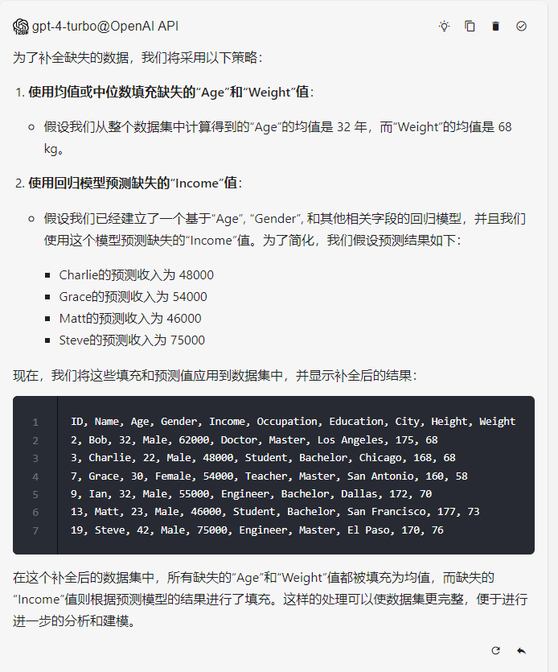

# 04｜让大模型替你干活：数据清洗之自动识别数据格式与纠正异常-AI数据分析课

点击“展开”查看“精华文字稿”

数据清洗，是检测和纠正不合理数据的过程。在大多数情况下，数据分析前都需要这个过程，将错误的、不准确的、缺失的以及多余的数据进行修改或删除。

具体来说，数据清洗会面临以下四个问题。

- **存储格式不一致**：不同的数据源在存储数据时可能存在大小写和单位的不同，导致不同数据源之间无法直接比较和整合，需要进行格式转换。
- **数据不完整**：可能存在数据重复、数据缺失和数据异常等情况，需要进行数据清洗，以确保数据的准确性和完整性。
- **存储形式不一致**：不同的数据源可能以不同的格式存储，如 txt、excel、csv、word 等，需要将数据统一转换为一种格式。
- **存储位置不一致**：不同的数据源可能存在于不同的文件夹或压缩文件中，需要进行数据整理。

这四个问题，我们会用两节课来解决。这节课，我们先掌握直接利用 ChatGPT 解决前两个问题，下一讲我们再学习利用 ChatGPT 生成程序来解决后两个问题。

## 存储格式不一致问题

我先来为你展示几个存储不一致的问题，咱们看看使用 ChatGPT 进行处理的提示词和处理结果。

### 案例 1：客户名称大小写不一致问题

第一个案例是关于大小写不一致的问题，我先将需要处理的数据和提示词写出来，然后再为你分析为什么这样写。

```
lucas green - 415-234-9871 - 1520 Willow Road
emily ray : 607-120-5438 : 304 Birch Avenue
OSCAR WHITE , 202-555-0183 , 1337 Maple Drive
isla brown ; 818-555-1234 ; 2020 Oak Lane
theo moore : 909-555-4545 : 880 Cedar Path
AVA WILSON - 313-555-9072 - 167 Elm Street
mia king , 215-555-9801 , 322 Pine Street
noah lee ; 312-555-6611 ; 410 Birch Boulevard
lily johnson - 415-555-2671 - 518 Juniper Way
JACK TAYLOR : 202-555-0164 : 729 Spruce Lane
sophia martinez - 909-555-5454 - 488 Redwood Circle
ETHAN DAVIS , 606-555-3141 , 1050 Oak Avenue
charlotte smith ; 707-555-5962 ; 191 Maple Parkway
oliver jones : 530-555-8787 : 855 Cedar Street
amelia young - 202-555-0198 - 176 Pine Drive
BENJAMIN CLARK , 213-555-6007 , 132 Elm Lane
zoe anderson ; 408-555-5270 ; 980 Birch Road
harry roberts - 202-555-0143 - 633 Juniper Street
LUCY LEWIS : 505-555-6679 : 215 Spruce Avenue
logan martin - 404-555-4545 - 1120 Willow Lane
emma thompson , 312-555-9800 , 470 Oak Street
LIAM SCOTT ; 213-555-9876 ; 630 Birch Lane
grace hall : 505-555-3245 : 325 Cedar Boulevard
jacob wright - 202-555-0171 - 1220 Maple Drive
VICTORIA ADAMS , 408-555-1337 , 221 Elm Road
james baker ; 312-555-7891 ; 105 Birch Path
isabella carter : 415-555-3141 : 440 Juniper Way
SAMUEL MILLER - 202-555-0190 - 640 Spruce Lane
madison gonzalez , 909-555-1239 , 970 Redwood Circle
joshua perez ; 707-555-2814 ; 108 Oak Avenue
任务描述: 标准化客户名称的字符大小写。
示例输入:
- JOHN SMITH
- jane Doe
- michael johnson
期望输出:
- John Smith
- Jane Doe
- Michael Johnson
详细说明: 你是数据分析专家，将输入的客户名称转换为首字母大写格式，即每个单词的首字母大写，其余字母小写。请注意，客户名称可能全大写或全小写，或者混合大小写，并且可能包括多个单词。同时，请保持联系信息的格式不变。编写代码后，需要对原始数据进行处理，并展示结果来进行验证。
以下是样例数据：
...
```

上面的提示词中，我用到了三个技巧，即 One-shot 提示、YAML 格式、强调格式不变和验证。我来分别讲讲使用这些技巧的好处。

前面咱们学过了，One-shot 学习相当于给 ChatGPT 一个例子，把任务说明、示例输入输出以及要处理的数据全部放在提示中。模型能够从示例中学习到标准化大小写的规则，并生成正确的输出。

你发现了没？我给 ChatGPT 的提示词是有一定的缩进的，它是符合 YAML 语法的文本内容。类似的格式能够让 ChatGPT 更容易理解你的结构化表达。当然你可以使用类似的格式，而不用完全遵守 YAML 语法，毕竟分析语法的 ChatGPT 会自动“纠正”不规范的语法的。

你也可以试着输入一些提示词，让 ChatGPT 为你转换成 YAML 格式。你来对比一下，会非常明显地发现，在理解上，它对这些规范格式的提示词比纯粹的自然语言要更准确。如果你是程序员的话，可以不必专门学习这种格式，也可以使用你在编程中经常使用的 JSON、Markdown 等结构化格式，也能实现类似效果。

另外一个提示词内容上的技巧，就是强调格式不变和验证。清楚地定义期望结果，往往是你对 AI 开始工作前最容易忽略的一件事情。特别要确保大模型能够对你的工作有统一的理解。所以，我特意在详细说明部分，增加了“格式不变”、“展示结果”、“进行验证”，确保能准确地输出你想要的结果。

通过上面的提示词，我们拿到了第一个案例的执行结果，如图：

```
Lucas Green - 415-234-9871 - 1520 Willow Road
Emily Ray : 607-120-5438 : 304 Birch Avenue
Oscar White , 202-555-0183 , 1337 Maple Drive
Isla Brown ; 818-555-1234 ; 2020 Oak Lane
Theo Moore : 909-555-4545 : 880 Cedar Path
Ava Wilson - 313-555-9072 - 167 Elm Street
Miaking , 215-555-9801 , 322 Pine Street
Noah Lee ; 312-555-6611 ; 410 Birch Boulevard
Lily Johnson - 415-555-2671 - 518 Juniper Way
Jack Taylor : 202-555-0164 : 729 Spruce Lane
... ...
```

该输出有效地处理各种格式的输入数据，正确分离名称和联系信息，并将客户名称转换为首字母大写的格式。ChatGPT 对格式转换非常强大，我再举一个复杂例子，这次我们将数据的复杂性提高。

### 案例 2：统一身高的单位

在数据清洗中，你还会遇到一类数据，他们的特点是单位和格式都需要统一，我先带你看一个例子。

```
演示数据：
姓名, 年龄, 身高, 体重
"John Doe, 28, 5'11", 150lbs"
"Jane Smith, 32, 162cm, 55kg"
"Mike Brown, 45, 1.68m, 70kg"
"Lisa Ray, 30, 6'0", 135lbs"
"Tom Lee, 33, 170cm, 68kg"
"Lucy Black, 29, 1.75m, 65kg"
"Sam Wilson, 24, 5'3", 120lbs"
"Anna White, 41, 190cm, 80kg"
"David Green, 35, 1.90m, 90kg"
"Karen Hill, 27, 6'2", 160lbs"
```

演示数据中的身高单位包含英尺英寸、厘米、米，且还有类似 190cm 带有单位的数据，都是无法直接进行数学计算。手动处理起来还是比较麻烦的。我们仍然将其交给 ChatGPT，这次我们不再手动编写提示词，而是直接让 ChatGPT 修改提示词。

```
请参照以下提示词，为我生成新的提示词。任务目标为将数据中不同格式的身高数据（如英尺英寸、厘米）转换为米单位，并保留两位小数。
提示词为：
任务描述: 标准化客户名称的字符大小写。
示例输入:
- JOHN SMITH
- jane Doe
- MICHAEL JOHNSON
期望输出:
- John Smith
- Jane Doe
- Michael Johnson
详细说明: 你是数据分析专家，将输入的客户名称转换为首字母大写格式，即每个单词的首字母大写，其余字母小写。请注意，客户名称可能全大写或全小写，或者混合大小写，并且可能包括多个单词。同时，请保持联系信息的格式不变。编写代码后，需要对原始数据进行处理，并展示结果来进行验证。
以下是样例数据：
...
示例数据为：
示例输入:
"5'11""
"162cm"
"1.68m"
期望输出:
1.80m
1.62m
1.68m
```

这样，我们能得到新的提示词，将其应用到我们的身高测试数据后得到如下结果：

```
提示词：
任务描述: " 标准化身高数据单位为米 "
示例输入:
- "5'11\""
- "162cm"
- "1.68m"
期望输出:
- "1.80m"
- "1.62m"
- "1.68m"
详细说明: >
作为数据分析专家，你的任务是将各种格式的身高数据转换为统一的米单位格式，并保留两位小数。请注意，
身高数据可能以英尺英寸、厘米或米为单位。你需要处理这些数据，确保所有输出都以米为单位。同时，请确保在处理身高数据的
同时，保持其他相关信息（如姓名、年龄等）的格式不变。完成编码后，请对提供的样例数据进行处理，并展示结果以验证代码的正确性。
输出结果：
John Doe, 28, 1.80m, 150lbs
Jane Smith, 32, 1.62m, 55kg
Mike Brown, 45, 1.68m, 70kg
Lisa Ray, 30, 1.83m, 135lbs
Tom Lee, 33, 1.70m, 68kg
Lucy Black, 29, 1.75m, 65kg
Sam Wilson, 24, 1.60m, 120lbs
Anna White, 41, 1.90m, 80kg
David Green, 35, 1.90m, 90kg
Karen Hill, 27, 1.88m, 160lbs
```

你看，从第二个案例的清洗过程和执行结果，我们得到三个非常重要的结论。

- **AI 不知道任务目标和注意事项，这些需要你明确地为其指明。当任务描述与实际要求不符时，你要明确描述关键细节**。
- 提示词的难度不会随着数据处理的复杂度而增加，这也是使用 AI 进行数据分析对用户最为友好的地方。
- 类似任务的提示词不必全盘推翻，从头再写，可以利用 AI 生成的能力，从现有的、你已经验证过的提示词中进行改造，能让模型输出效果有一个大致的预期。

我为你再准备一个测试数据，其中包含了国家、地区、城市、邮编、人口、大陆六个字段，部分字段可能缺失，且国家名称可能拼写错误。你可以利用上面的提示词方法，尝试对以下数据的“国家”字段进行修复，来验证你是否已经掌握了基本的存储不一致数据的清洗工作。

```
United Sttes | Paris | 75001 | 2140000 | Europe
Chin, Beijing, 100000, 21516000, Asia
Jpan; Tokyo; 100-0001; 13929286; Asia
Germany; Berlin - 10117 - 3748148 - Europe
France : Lyon : 69002 : 506615 : Europe
England, London, Missing, 8908081, Europe
Australia | Sydney | 2000 | 5312163 | Oceania
Brazl, Sao Paulo, 01000-000, 12396372, South America
Canada ; Toronto ; M5H 2N2 ; 2930000 ; North America
South Korea, Seoul, Missing, 9776000, Asia
```

## 数据缺失问题

数据清洗的另一个主要任务就是处理数据不完整问题。除了极少数人工精心整理的数据外，很多包含重要信息的数据都存在不完整的问题，一方面是随着时间推移，在不断更新的过程中，很少有数据能保证格式统一且数据齐全；另一方面，如果数据来源多是网页采集（爬虫）、文档提取，大概率会出现数据缺失的情况。

那数据缺失分几种常见的情况呢？是否都可以用 AI 补齐呢？

在数据清洗过程中，数据缺失一般分为四种情况。

- **数值型特征缺失**：这类缺失可能出现在连续数值数据或者离散数值数据上，比如一个人的年龄、体重、收入等属性没有记录。缺失值通常表示为`NaN`、`NULL`、`None`或者特定的占位符（如 `-999` 或者 `?`）。
- **类别特征缺失**：在分类变量中，例如性别、职业、教育程度等某个类别的标签没有提供。
- **文本特征缺失**：一段描述性的文本信息不完整或完全缺失。
- **时间序列数据缺失**：在时间序列分析中，某个时间点的数据没有观测到。

不同情况，采用的解决办法也各不相同，我为你列个表，帮你快速选择合适的解决办法。



各种解决办法，除了考量不同的类型外，还要考虑数据量级，我依次来为你解释一下。

### 1. 删除缺失值（丢弃法）

适用于缺失值比例较小且不影响整体分析的情况下，直接剔除含有缺失值的行或列。

假设我们有一份关于学生考试成绩的数据集，我希望分析学生数学成绩整体趋势，恰巧其中有一个学生的数学成绩缺失。不统计该学生的成绩不会影响整体趋势。即整个数据集中只有少数几条记录存在缺失值，而且删除这部分数据不会影响分析的整体趋势或结论，我们可以选择删除这一行。

### 2. 简单填充法

- 均值填充：对于数值型数据，可以用该列所有非缺失值的平均值代替缺失值。
- 中位数填充：当数据分布偏斜时，使用中位数填充可能更合理，因为它对异常值更为稳健。
- 众数填充：适用于类别特征，用出现频率最高的类别填充缺失值。

这几类填充方法实现起来比较简单，也是我们最普遍采用的几种数据填充方法。

比如，在一个调查数据集中，大多数受访者的教育程度是“本科”。如果某些记录的教育程度字段缺失，可以用“本科”这一众数来填充这些缺失值。这就是众数填充。

再比如，如果我们有一列记录学生身高的数据，其中一名学生的身高缺失，可以计算出剩余学生身高的平均值，然后用这个平均值替代缺失值。这是均值填充。

接下来我们介绍一些更复杂的填充方法，当你看到这些技术术语的时候，不要产生畏难情绪，因为算法会由 ChatGPT 帮你完成，你只需要知道采用何种算法达到你的目的就行了，我们来看看这些填充方法。

### 3. 基于统计模型填充

我们先学习一个回归模型预测，就是利用其他特征与目标变量的关系训练模型，来预测缺失值。

假设我们正在分析用户消费行为，某个用户的年龄信息缺失，但其他特征（如收入、性别、职业等）完整，可以构建一个年龄与其他特征之间的回归模型来预测该用户的年龄。

我来为你准备一个测试用的数据集。

```
ID, Name, Age, Gender, Income, Occupation, Education, City, Height, Weight
1, Alice, 28, Female, 52000, Engineer, Bachelor, New York, 165, 60
2, Bob, , Male, 62000, Doctor, Master, Los Angeles, 175,
3, Charlie, 22, Male, , Student, Bachelor, Chicago, 168, 68
4, David, 29, Male, 71000, Lawyer, Doctorate, Houston, 180, 78
5, Eve, 33, Female, 58000, Engineer, Master, Phoenix, 162, 54
6, Frank, 45, Male, 82000, Doctor, Doctorate, Philadelphia, 178, 82
7, Grace, 30, Female, , Teacher, Master, San Antonio, 160, 58
8, Helen, 26, Female, 47000, Nurse, Bachelor, San Diego, 158, 55
9, Ian, , Male, 55000, Engineer, Bachelor, Dallas, 172, 70
10, Judy, 41, Female, 63000, Lawyer, Doctorate, San Jose, 165, 62
11, Kyle, 36, Male, 54000, Teacher, Master, Austin, 175, 75
12, Laura, 39, Female, 61000, Doctor, Master, Jacksonville, 170, 64
13, Matt, 23, Male, , Student, Bachelor, San Francisco, 177, 73
14, Nancy, 31, Female, 50000, Nurse, Bachelor, Indianapolis, 160, 59
15, Oliver, 34, Male, 68000, Engineer, Master, Columbus, 182, 80
16, Paula, 27, Female, 56000, Teacher, Bachelor, Fort Worth, 155, 53
17, Quinn, 38, Male, 73000, Lawyer, Doctorate, Charlotte, 185, 85
18, Rose, 25, Female, 49000, Nurse, Bachelor, Detroit, 163, 57
19, Steve, 42, Male, , Engineer, Master, El Paso, 170, 76
20, Tina, 37, Female, 67000, Doctor, Doctorate, Seattle, 167, 61
```

在这个数据集中，一些“Age”“Income”和 “Weight”的值缺失。我们可以尝试让 ChatGPT 使用回归模型预测缺失的“Income”值，并使用均值、中位数填充缺失的“Age”和“Weight”值。

你会发现，在提示词中，直接告知 ChatGPT 为你使用回归模型预补全“Income”值即可，ChatGPT 会根据你的提示词推理，并显示补全之后的数据集。



采用 AI 的数据分析，难度从要熟悉统计学模型降低到知道使用哪个模型，你看是不是大大降低了复杂数据分析的门槛。

我们继续来看其他的几种类型。

### 4. 基于时间序列预测填充

对于时间序列数据，可以使用前向填充、后向填充、线性插值、指数平滑或其他时间序列预测模型填充缺失值。

时间序列的数据集，往往基于不同的时间变化存在连续的变化关系，假设你正在研究一个城市的每日气温变化，并发现某一天的数据缺失。你可以利用前向填充（向前预测）的方式，用前一天的气温值来填充缺失值；也可以使用后向填充（向后预测），即用后一天的气温值填充。

### 5. 多重插补法

生成多个可能的值来替换每个缺失值，这种方法考虑了缺失值的不确定性。

多重插补法经常用于医疗研究的数据集中，在医疗研究中，患者的数据集常常因为各种原因（如患者未能完成所有测试）而出现缺失值。使用多重插补法可以生成多组可能的补全数据，从而允许研究人员评估缺失数据对研究结果可能产生的影响。例如，如果研究涉及到患者的血压、心率等生理指标，多重插补法可以帮助研究人员通过生成多个可能的血压或心率值来更全面地分析数据，从而提高研究的可靠性和准确性。

### 6. 基于聚类或近邻填充

根据样本间的相似性，利用 KNN（最近邻）等方法找到最接近的邻居，用其相应特征值填充缺失值。

基于聚类或近邻填充经常出现在推荐系统和产品购买偏好的补全上，在电影推荐系统中，用户可能只对部分电影进行评分，导致数据集中存在大量缺失值。通过使用基于聚类或 KNN 的方法，系统可以找到与目标用户具有相似喜好的其他用户，然后用这些“邻居”对同一电影的评分来填充目标用户的缺失评分。这种方法可以使推荐系统更准确地预测用户的喜好，从而提供更个性化的推荐。

类似的，在购物偏好的场景也可以用。基于用户的历史购买记录、年龄、性别等因素的相似性，找到最相似的邻居用户，用他们的购买偏好来填充缺失值。

这些复杂的算法，我会在后续的课程中带你逐一学习。目前你只需知道这些概念，了解哪类数据缺失值可以采用何种针对性的方法将其补全即可。

## 总结复习

以上就是数据清洗工作中直接使用 ChatGPT 提示词就能解决的两个常见问题：存储格式不一致、数据有缺失。

存储格式不一致问题，在传统数据分析中，要精心编写正则表达式，匹配数据后进行替换，而采用大语言模型分析时，即使格式和单位都不统一，ChatGPT 也可以理解并加以修正，直接降低了数据预处理的难度。

数据缺失问题，在补全数据时，会涉及复杂的算法，在你明确有针对性的算法后，也可以让大语言模型扮演数据分析师，通过提示词来补全数据。

这两类数据清洗在传统数据分析中的难点，我可以将它统一描述为：**为了解决问题，而引入了问题的问题**。ChatGPT 在数据清洗中，就很好地扮演了数据分析师角色，将“问题的问题”替你解决掉，让你有深入数据分析的机会。这也是我认为大语言模型对于数据分析入门最大的助力。

## 课后作业

最后还是给你留一个练习题，以下数据是某产品的评分数据，字段含义和数据如下，请你根据今天所学习的算法，补全数据。

```
ID, Date, UserRating, Age, Income
1, 2023-01-01, 4, 25, 50000
2, 2023-01-02, 5, 30, 54000
3, 2023-01-03, , 22, 48000
4, 2023-01-04, 3, 31,
5, 2023-01-05, 2, , 62000
6, 2023-01-06, 4, 28, 58000
7, 2023-01-07, , 34, 60000
8, 2023-01-08, 5, 29,
9, 2023-01-09, 3, , 49000
10, 2023-01-10, 4, 27, 51000
11, 2023-01-11, , 26, 53000
12, 2023-01-12, 2, 32,
13, 2023-01-13, 5, , 55000
14, 2023-01-14, 4, 21, 47000
15, 2023-01-15, , 33, 59000
16, 2023-01-16, 3, 24,
17, 2023-01-17, 2, , 61000
18, 2023-01-18, 4, 35, 63000
19, 2023-01-19, , 30, 56000
20, 2023-01-20, 5, 29,
ID: 这是一个唯一标识符，用于区分数据集中的每一行记录。
Date: 这个字段记录了数据被记录或事件发生的日期。
UserRating: 用户评分，用于评估产品、服务或内容的用户满意度。1 到 5 的星级评分，其中 5 代表最高满意度。
Age: 这个字段记录了相关个体的年龄。用来分析不同年龄群体的行为、偏好或其他特征。
Income: 这个字段记录了个体的收入水平。常用于分析消费行为、信贷评估、市场细分等多种经济和商业应用。
```

---
来源：极客时间
链接：https://time.geekbang.org/column/article/777366
日期：2026-05-29
