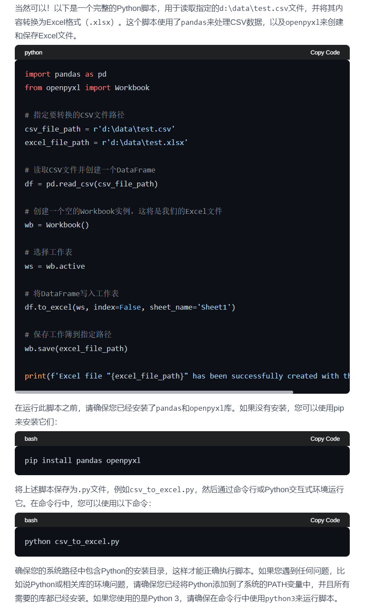
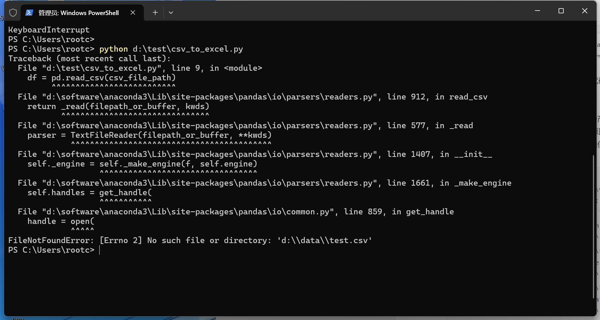
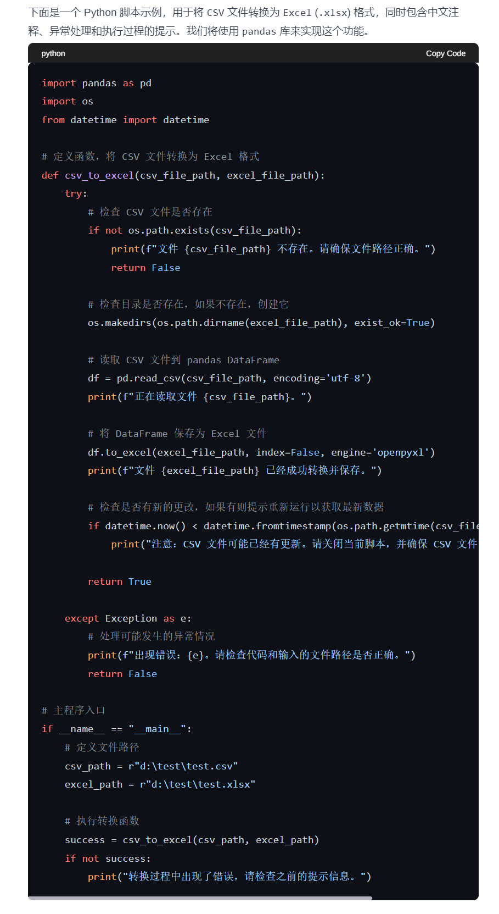

# 05｜让大模型帮你干活：数据清洗之处理数据存储形式不一致-AI数据分析课

点击“展开”查看“精华文字稿”

这一讲咱们继续让大模型帮我们干数据清洗的活儿，看看怎么利用大模型来解决数据存储形式不一致的问题。

想象一下，你手头上有来自不同部门的邮件、文档，里面包含了各类数据，这些数据分别存储在 txt 文件、Excel 表格、CSV 文件，甚至是 Word 文档中。现在你要做数据分析，看到一堆这样的数据，是不是一个头两个大？

具体来说，数据存储形式不一致的问题主要表现在两个方面：一是不同格式的文件需要不同的处理方法和工具来读取；二是即使是相同类型的数据，由于格式不同，其数据结构也可能有所差异，这就需要在数据整合前进行格式统一和结构对齐。

那这个问题可以像上节课那样直接用 ChatGPT 来处理吗？还真不行，主要有两个原因。一个是一旦数据较大，大语言模型容易产生“幻觉”，导致你的数据由 ChatGPT 处理后出现不完整的输出问题；另一个是每次有新的数据都需要与 ChatGPT 交互，它还容易“忘掉”早先的数据。

既然不能直接丢给 ChatGPT 来做，那该怎么办呢？也好解决，咱换个思路，**让 ChatGPT 编写程序，辅助我们处理存储不一致的形式**。

这节课里会涉及到编程技能，但是你也不用太担心，几乎全部代码我们都是由 ChatGPT 生成的，你只需将编程当做是工具来使用即可。

我先为你演示一个将 CSV 转换为 Excel 格式的代码。从转换的过程中，你可以了解怎样让 ChatGPT 为你编写代码，以及如何在你的 Windows 系统上运行代码。

## 利用 ChatGPT 编写代码处理

```
我向 ChatGPT 发起以下提问：
你是软件开发工程师，我需要你为我编写一个将 CSV 转换为 Excel 格式的代码，CSV 文件的位置是 d:\data\test.csv
```

ChatGPT 做了如下回复。



首先，你需要知道，ChatGPT 提供的是一段 Python 编程语言的代码，为什么使用 Python 而不用其他语言呢？因为 Python 语言的语法与自然语言接近，代码可读性强。哪怕生成的代码出错，你还可以让 ChatGPT 继续为你修改代码。

其次，ChatGPT 提示我们再执行代码前，你还需要为你的 Windows 安装 Python 解释器和库，Python 解释器就是用来解释上面的代码的，你可以将其当做是把程序代码翻译成你的计算机能懂的形式。而库是一些编程高手将更复杂的功能进行包装，你只需站在巨人的肩膀上，按照你的需要使用他们即可。

如果你的 Windows 还没有安装 Python 解释器，可以通过这个链接下载 ([https://www.python.org/ftp/python/3.12.3/python-3.12.3-amd64.exe](https://www.python.org/ftp/python/3.12.3/python-3.12.3-amd64.exe))。

安装完成后，你可以将 ChatGPT 为你提供的代码保存为 csv_to_excel.py 并按照 ChatGPT 为你提供的方式 python csv_to_excel.py 运行即可。

最后，我还想和你说的是，运行脚本有可能会产生错误，这里你不要过于担心，你可以将你的错误信息，一起交给 ChatGPT，它会根据错误原因，为你提供相应的解决办法。比如我在运行程序是就出现了下面错误，你可以看我如何解决。

**错误一：目标文件没有找到**



我将错误信息交给 ChatGPT，让他为我解答。

```
错误信息表明你尝试使用 Python 脚本（csv_to_excel.py）读取名为 test.csv 的 CSV 文件，但是 Python 无法找到这个文件。以下是一些解决这个问题的步骤：
确认文件路径：
确保文件 test.csv 真的存在于 d:\data\test 目录下，并且路径使用的是正确的格式。注意在 Windows 中，路径中的反斜杠 \ 有时需要被转义为双反斜杠 \\ 或者使用正斜杠 /。
文件权限：
确保你有权限访问该文件夹和文件。如果没有，尝试以管理员身份运行命令提示符或 Python 脚本。
完整的文件路径：
在调用 pd.read_csv() 函数时，确保你提供了一个完整的文件路径。例如，如果你的工作目录是 C:\Users\rootc，那么你应该使用 d:/data/test/test.csv 而不是 d:\data\test\test.csv（注意前面的 d: 后面没有斜杠）。
文件存在性：
确保文件没有被删除或移动到另一个位置。你可以通过在文件所在的目录中打开命令提示符（或者使用 Windows 资源管理器）来检查文件是否存在。
脚本运行路径：
如果文件位置正确，但问题仍然存在，你可能需要设置脚本的工作目录。这可以通过修改 Python 脚本中的 csv_file_path 变量或者在运行脚本之前设置环境变量来完成。例如，在运行脚本之前，你可以使用以下命令设置工作目录：
Set-Location -Path "d:\data\test"
或者在脚本中添加：
import os
os.chdir("d:/data/test")
csv_file_path = "test.csv"
```

你看，ChatGPT 按照出错的原因，将最可能出错的情况放在最上面，你可以按照他提供的解决办法修改代码，我这里的错误原因是 test.csv 的文件目录指定错误了。

看到这里，聪明的你肯定会想到，既然出现错误再交给 ChatGPT 来解决，那么能不能在编写程序的时候，就提前让 ChatGPT 将可能遇到的错误做个更友好的提示呢？于是我们就可以利用前面学过的提示词工程来写一个更友好的提示词，我将提示词改为下面的写法。

```
你是一个开发专家，我需要用 Python 将 CSV 格式的文档转换为 excel 格式，我的文档位置在 d:\test\test.csv 将其转换为 d:\test\test.xlsx
代码要求：
- 你需要为代码增加中文注释，帮我理解代码的功能
- 你需要编写常见的异常处理，例如文件、目录、库等常见问题，需要优化的中文提示
- 你需要在执行过程为我提示当前执行的中间过程，我需要了解执行时是否有和我期望不一致的过程
```

这样我们得到了一个新的代码，我将代码和测试的 test.csv 文件一起提供给你。



这次，ChatGPT 输出的代码比较复杂，但是通过代码的注释和执行过程，你能更容易地掌控 Python 这一工具的执行过程。

让我们再来看一个更复杂一点的例子，帮你更好地掌握存储格式不一致的解决办法。

如果你的数据存储的形式是 Word 文件，且格式没有被约束为 CSV 标准格式，怎样处理呢？

以下是一个 Word 文件中的数据内容：

```
ID Date Product Code Product Name Sales
uJnYjVRG 2013-01-24 53B7FJ56 惠派国际公司网络有限公司 308
VfmcCbvn 2017-09-09 C69GJGE2 海创科技有限公司 378
FRNYIjXH 2008-10-04； A1H18E25 富罳传媒有限公司 852
GqBphnLZ 2009-05-01 FFJ4006J 兰金电子网络有限公司 794
xnRArGza 2010-10-21 | 26|23GC7C 联通时科网络有限公司 311
aBQfgBbc 1996-09-22 80E9HJE6 华成育卓网络有限公司 968
MbfBPDia 2010-12-11 F1E285IJ 同兴万点网络有限公司 453
WrKvwGNG 2017-09-19； CIAE3FII 飞海科技传媒有限公司 574
IZVfxKYy 2022-02-04 I7D5AJB3； 明腾传媒有限公司； 116
OFWbnOvP 1998-05-18 6F2G8H3E 迪摩信息有限公司 224
```

不难发现，每一列的分隔符从逗号，变成了空格，乃至 | 等。

这时为了能够让模型更好地理解数据，建议你采用 One-shot 的提示方法，先让 ChatGPT“看到”你的数据，再编写代码。

我是这么写提示词做的：

```
你是一个开发专家，我需要用 Python 将 Word 格式的文档转换为 excel 格式，我的文档位置在 d:\test\test.docx 将其转换为 d:\test\test.xlsx
代码要求：
- 你需要为代码增加中文注释，帮我理解代码的功能
- 你需要编写常见的异常处理，例如文件、目录、库等常见问题，需要优化的中文提示
- 你需要在执行过程为我提示当前执行的中间过程，我需要了解执行时是否有和我期望不一致的过程
Word 文件格式：
- Word 中的内容并不规范，分隔符包括空格 多个空格 ， ； | 等特殊字符， 你需要将其转换为规范格式
- Word 格式举例:
ID Date Product Code Product Name Sales
FRNYIjXH 2008-10-04； A1H18E25 富罳传媒有限公司 852
GqBphnLZ 2009-05-01 FFJ4006J 兰金电子网络有限公司 794
xnRArGza 2010-10-21 | 26|23GC7C 联通时科网络有限公司 311
aBQfgBbc 1996-09-22 80E9HJE6 华成育卓网络有限公司 968
WrKvwGNG 2017-09-19； CIAE3FII 飞海科技传媒有限公司 574
IZVfxKYy 2022-02-04 I7D5AJB3； 明腾传媒有限公司； 116
```

这样你可以从 ChatGPT 得到新的代码：

```
import os
import pandas as pd
from docx import Document
import re
def convert_word_to_excel(word_file, excel_file):
"""
将 Word 文档转换为 Excel 格式
参数：
word_file: str，Word 文档的文件路径
excel_file: str，要保存的 Excel 文件的文件路径
返回：
无
"""
try:
# 检查 Word 文件是否存在
if not os.path.isfile(word_file):
raise FileNotFoundError(" 找不到指定的 Word 文件，请检查文件路径是否正确。")
# 创建一个空的 DataFrame 来存储数据
df = pd.DataFrame(columns=['ID', 'Date', 'Product Code', 'Product Name', 'Sales'])
# 使用 docx 库读取 Word 文档内容
doc = Document(word_file)
# 逐行读取文档内容并解析
for para in doc.paragraphs:
print(para.text)
# 使用正则表达式进行分割
data = re.split(r"\s+|；|\|", para.text) # 注意：这里使用的分隔符包括空格、中文分号和竖线
data = [item.strip() for item in data] # 去除每个字段两端的空白字符
# 将数据添加到 DataFrame 中
if len(data) == 5: # 确保每行有 5 个字段
df.loc[len(df)] = data
# 将 DataFrame 写入 Excel 文件
df.to_excel(excel_file, index=False)
print("Word 文档成功转换为 Excel 文件。")
except FileNotFoundError as e:
print(f" 错误：{e}")
except Exception as e:
print(f" 发生了意外错误：{e}")
# 测试代码
word_file_path = r'd:\test\test.docx'
excel_file_path = r'd:\test\test.xlsx'
convert_word_to_excel(word_file_path, excel_file_path)
```

上面这段代码是从 Word 转换为 Excel 的 Python 代码样例。通过告诉 ChatGPT 原始文件的内容格式，能够让 ChatGPT 根据你的内容情况，智能地编写出文件类型转换代码。这样的逻辑下， 你可以随时将你需要的任意格式转换为你需要的 Excel，便于后续进行数据分析。

## 存储位置不一致的挑战与对策

除了存储形式的不一致，数据分析中还常常面临存储位置不一致的问题。数据可能散落在不同的文件夹或压缩文件中，这就需要我们在进行数据分析前，先进行数据的搜集和整理。

对于存储位置不一致的问题，我们可以沿用上面的方法，比如我需要分析的数据是一封工作邮件中的一个 zip 压缩文件，当我将其放在我的电脑解压缩之后，发现文件夹里还包含着更多的 zip 压缩文件。如果手动合并文件那就太繁琐了，这时，你仍然可以求助 ChatGPT，编写一个 Python 脚本来自动化地搜集和整理数据。

按照上面的思路，我提供了文件夹，让其对其中的 zip 文件进行解压缩，并对解压缩后的 CSV 文件合并为一个 Excel 文件。ChatGPT 则按照我的要求提供了下述代码。

```
import os
import zipfile
import pandas as pd
def extract_zip_files(zip_folder, output_folder):
"""
解压缩指定文件夹中的所有 zip 文件到指定输出文件夹
参数：
zip_folder: str，包含 zip 文件的文件夹路径
output_folder: str，解压缩后文件的输出文件夹路径
返回：
无
"""
try:
# 检查文件夹是否存在
if not os.path.isdir(zip_folder):
raise FileNotFoundError(" 找不到指定的文件夹，请检查文件夹路径是否正确。")
# 创建输出文件夹
if not os.path.exists(output_folder):
os.makedirs(output_folder)
# 遍历文件夹中的 zip 文件并解压缩
for file in os.listdir(zip_folder):
if file.endswith('.zip'):
zip_file = os.path.join(zip_folder, file)
with zipfile.ZipFile(zip_file, 'r') as zip_ref:
zip_ref.extractall(output_folder)
print(f" 成功解压缩文件: {file}")
print(f" 解压缩路径: {output_folder}")
print(" 所有 zip 文件解压缩完成。")
except FileNotFoundError as e:
print(f" 错误：{e}")
except zipfile.BadZipFile as e:
print(f" 错误：{zip_file} 不是一个有效的 zip 文件。")
except Exception as e:
print(f" 发生了意外错误：{e}")
def merge_csv_to_excel(csv_folder, excel_file):
"""
将指定文件夹中的所有 CSV 文件合并为一个 Excel 文件，每个 CSV 文件成为一个 sheet
参数：
csv_folder: str，包含 CSV 文件的文件夹路径
excel_file: str，要保存的 Excel 文件的文件路径
返回：
无
"""
try:
# 检查文件夹是否存在
if not os.path.isdir(csv_folder):
raise FileNotFoundError(" 找不到指定的文件夹，请检查文件夹路径是否正确。")
# 获取文件夹中所有 CSV 文件的路径
csv_files = [os.path.join(csv_folder, file) for file in os.listdir(csv_folder) if file.endswith('.csv')]
# 创建 Excel 写入对象
writer = pd.ExcelWriter(excel_file, engine='xlsxwriter')
# 逐个 CSV 文件写入 Excel 文件中的不同 sheet
for csv_file in csv_files:
# 从 CSV 文件路径中提取文件名作为 sheet 名称
sheet_name = os.path.splitext(os.path.basename(csv_file))[0]
# 读取 CSV 文件并写入 Excel 文件中的 sheet
df = pd.read_csv(csv_file)
df.to_excel(writer, sheet_name=sheet_name, index=False)
print(f" 成功将 CSV 文件 {csv_file} 写入 Excel 文件的 sheet {sheet_name}")
# 保存 Excel 文件
writer.save()
print(" 所有 CSV 文件成功合并为 Excel 文件。")
except FileNotFoundError as e:
print(f" 错误：{e}")
except pd.errors.EmptyDataError as e:
print(f" 错误：{csv_file} 是一个空文件。")
except Exception as e:
print(f" 发生了意外错误：{e}")
# 测试代码
zip_folder_path = r'd:\test\zips'
output_folder_path = r'd:\test\extracted'
excel_file_path = r'd:\test\merged_data.xlsx'
print(" 开始解压缩 zip 文件...")
extract_zip_files(zip_folder_path, output_folder_path)
print("\n 开始合并 CSV 文件为 Excel 文件...")
merge_csv_to_excel(output_folder_path, excel_file_path)
```

相信你现在已经迫不及待地想自己运行一下代码了吧。我也为你准备了一个可以测试的 zip 压缩包，你可以在自己的电脑上运行，并观察结果。当然，如果运行出错，也可以像上面的方法，来向 ChatGPT 提问。

- 链接：[https://pan.baidu.com/s/1zLg-PjeQWR8tU2aL78kXqA?pwd=dtAn](https://pan.baidu.com/s/1zLg-PjeQWR8tU2aL78kXqA?pwd=dtAn)
- 提取码：dtAn

## 总结复习

通过今天的讨论和代码示例，我们可以看到，无论是面对存储形式不一致还是存储位置不一致的问题，Python 提供了强大的库和工具来帮助我们有效地解决这些问题。而 ChatGPT 在这里充当了你与代码的桥梁，你是下达指令的指挥官，负责表达数据处理的方向，ChatGPT 是你的代理人，根据你的方向，提供代码交由你执行。你根据执行效果不断地调整提示词，让 ChatGPT 生成的代码更好用。于是就形成了这么一个闭环：具体需求 -ChatGPT 转换 - 代码执行 - 反馈结果。

最后，我还想要提醒你，不要忘记让 ChatGPT 为你打工的初衷，因为数据会随着时间增加。让 ChatGPT 编写代码的核心目的是即使数据发生变化，你也可以继续运行你的代码，从容应对数据的增长和变化。

## 课后作业

按照惯例，我还要为你留一个作业。就以今天课程中的演示文件为例，请你将 Excel 的内容转换为 Word 文档的内容，并人工验证转换效果，如果效果不理想，请你不断地优化提示词，来提升你对 ChatGPT 的熟练度。

---
来源：极客时间
链接：https://time.geekbang.org/column/article/779806
日期：2026-05-29
