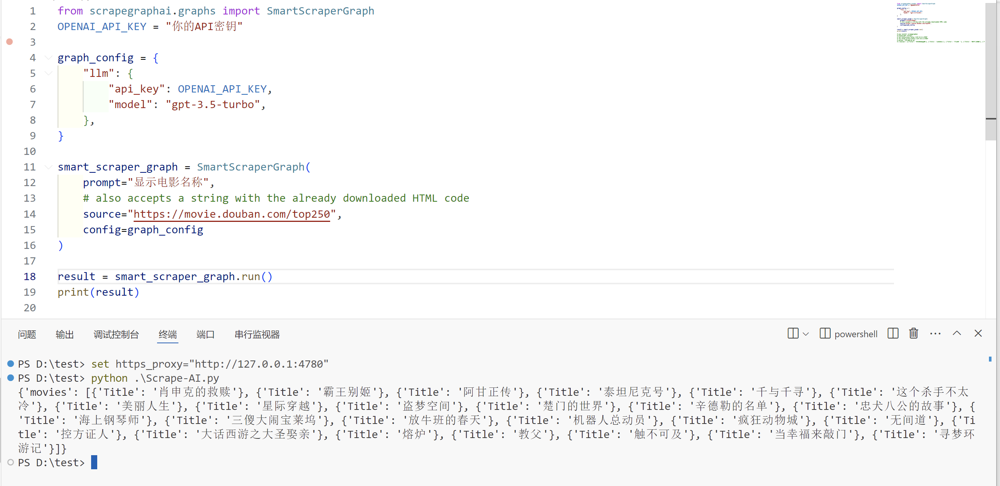
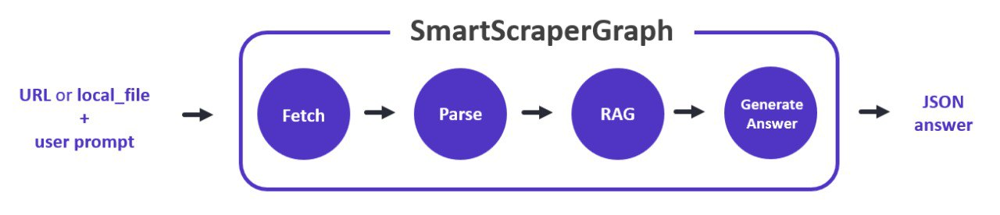
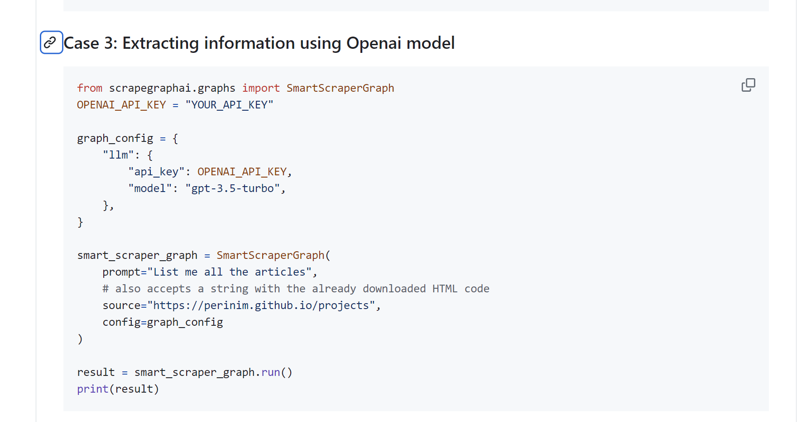
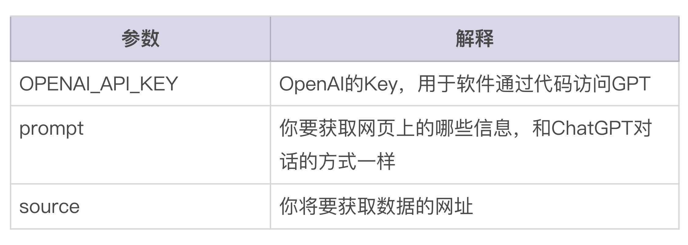
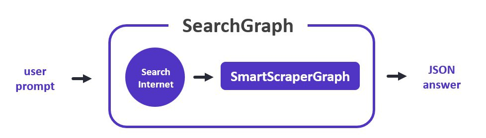

# 06｜AI工具：不用手写代码，让大模型帮你搞定爬虫-AI数据分析课

点击“展开”查看“精华文字稿”

在前面的课程中，我们已经学习了数据清洗的基本步骤和一些常规的数据处理技巧。不过，在实际应用中，我们经常需要处理的数据可不仅限于公司内部数据，很可能还包括网络上公开的数据。这些数据通常嵌入在网页中，要使用它们，你需要先将它们下载到本地，然后应用之前学到的方法进行处理。

这个过程有个名字你应该听说过就是爬虫。爬虫有很多种方式，之前也还是有一些门槛的，不过大模型时代，咱们有了更好的解决方案。今天呢，我们就来学习怎么利用 scrapegraphai 来自动化下载和清洗网络数据。

## 执行效果演示

我想先为你展示一下这个功能的执行效果，咱们看看 scrapegraphai 能帮我们做到什么程度，是不是真值得我们花时间和精力来学会它。

我们通过一个实际的例子来了解这一过程：从豆瓣电影 Top 250（网址：[https://movie.douban.com/top250](https://movie.douban.com/top250)）下载数据，并自动提取电影名称。

这里，我故意简化了提示词为“显示电影名称”，当然，在实际使用中，你应该提供更具体的指令以确保精确获取所需数据。我将在下方展示具体的执行结果。

```
{'movies': [{'Title': '肖申克的救赎'}, {'Title': '霸王别姬'}, {'Title': '阿甘正传'}, {'Title': '泰坦尼克号'}, {'Title': '千与千寻'}, {'Title': '这个杀手不太 冷'}, {'Title': '美丽人生'}, {'Title': '星际穿越'}, {'Title': '盗梦空间'}, {'Title': '楚门的世界'}, {'Title': '辛德勒的名单'}, {'Title': '忠犬八公的故事'}, {'Title': '海上钢琴师'}, {'Title': '三傻大闹宝莱坞'}, {'Title': '放牛班的春天'}, {'Title': '机器人总动员'}, {'Title': '疯狂动物城'}, {'Title': '无间道'}, {'Title': '控方证人'}, {'Title': '大话西游之大圣娶亲'}, {'Title': '熔炉'}, {'Title': '教父'}, {'Title': '触不可及'}, {'Title': '当幸福来敲门'}, {'Title': '寻梦环游记'}]}
```

执行过程我也截图放在下方，方便你之后详细解读代码和安装。



怎么样，是不是简单到让你觉得很震惊。

## 爬虫技术的传统挑战

传统上，想要编写一个网络爬虫，你需要学习如何使用后端编程语言（如 Python）来获取网页数据，同时还需要掌握 HTML、JavaScript 等前端技术来解析网页内容，提取有用数据。此外，面对那些部署了反爬虫技术的网站，你还需要了解一些反爬虫策略。这听起来是不是比手动整理数据还要复杂？

## AI 在数据抓取中的应用

但好消息是，虽然每个网页的结构不同，它们都是有一定结构的，正如每本书虽然内容不同，但总能找到目录一样。这为 AI 提供了施展才能的绝佳机会。

我们要学习的这个 scrapegraphai 工具，它能够自动完成网页匹配、语法分析和内容整理任务。它的工作流程类似于下图所示：



## 简化的爬虫设置过程

有了 scrapegraphai，你不再需要自己编写复杂的爬虫程序。只需通过简单的三步，即可完成软件的安装和设置。我将在接下来的教程中一步一步指导你如何操作。

通过这种方式，我们不仅能够简化数据收集和处理的过程，还能有效地利用 AI 技术来处理那些看似复杂的任务。这使我们能够更加专注于数据分析本身，提高工作效率。

由于 scrapegraphai 软件是基于 ChatGPT 和 Python 编写的，因此在开始使用前，你仍然需要准备好网络环境和 Python 脚本运行环境。如果你之前还没有配置过，别着急，我带着你一步步操作。

**第一步，安装 scrapegraphai**。

scrapegraphai 的 Github 地址是[https://github.com/VinciGit00/Scrapegraph-ai](https://github.com/VinciGit00/Scrapegraph-ai)。

访问之后，你会发现，文档提示你使用 pip 和 playwright 两个命令安装，你可以在 Windows 按钮点击右键打开终端，执行它们。我把安装命令放在下方，方便你操作。

```
pip install scrapegraphai
playwright install
```

我简单解释一下， 第一条命令是我们在第三讲就用过的 pip 命令，你需要通过 pip 命令安装 Python 的工具，让高手直接为你提供写好的库，丰富你的工具箱。

我着重解释一下第二行代码。第二行的 playwright 可以看做是 scrapegraphai 工具箱里面的一个工具，它也需要在终端执行。目的是为你的电脑统一配置一套用于编写网络爬虫的运行环境。这样的话，scrapegraphai 就能够不用担心你当前 Windows 没有安装足够的工具，出现还要配置工作环境的麻烦。

**第二步，编写代码**。

一提到编写代码啊，你可能又要担心了，这回我们甚至不需要 AI 帮我们写代码，直接使用样例代码即可。你将文档向下，找到“Case3”部分的代码即可。我将截图和代码也放在下方，方便你学习。

[https://github.com/VinciGit00/Scrapegraph-ai?tab=readme-ov-file#case-3-extracting-information-using-openai-model](https://github.com/VinciGit00/Scrapegraph-ai?tab=readme-ov-file#case-3-extracting-information-using-openai-model)



**第三步，修改和运行程序**。

```
from scrapegraphai.graphs import SmartScraperGraph
OPENAI_API_KEY = " 你的 OPENAI API-KEY"
graph_config = {
"llm": {
"api_key": OPENAI_API_KEY,
"model": "gpt-3.5-turbo",
},
}
smart_scraper_graph = SmartScraperGraph(
prompt=" 显示电影名称 ",
# also accepts a string with the already downloaded HTML code
source="https://movie.douban.com/top250",
config=graph_config
)
result = smart_scraper_graph.run()
print(result)
# python .\Scrape-AI.py
# {'movies': [{'Title': '肖申克的救赎'}, {'Title': '霸王别姬'}, {'Title': '阿甘正传'}, {'Title': '泰坦尼克号'}, {'Title': '千与千寻'}, {'Title': '这个杀手不太 冷'}, {'Title': '美丽人生'}, {'Title': '星际穿越'}, {'Title': '盗梦空间'}, {'Title': '楚门的世界'}, {'Title': '辛德勒的名单'}, {'Title': '忠犬八公的故事'}, {'Title': '海上钢琴师'}, {'Title': '三傻大闹宝莱坞'}, {'Title': '放牛班的春天'}, {'Title': '机器人总动员'}, {'Title': '疯狂动物城'}, {'Title': '无间道'}, {'Title': '控方证人'}, {'Title': '大话西游之大圣娶亲'}, {'Title': '熔炉'}, {'Title': '教父'}, {'Title': '触不可及'}, {'Title': '当幸福来敲门'}, {'Title': '寻梦环游记'}]}
```

这里有三个地方需要修改，分别为：



修改后，我将它保存为文件名[scrape-ai.py](https://scrape-ai.py/) ，并在终端使用 python .\Scrape-AI.py 运行，就得到了我想要的电影名称这一结果。

操作起来非常简单，当然你也可能会遇到几个常见的错误。

**错误一， 语法错误**。

这种错误的原因是上方三个需要修改的地方，需要用英文的引号将你的内容包含进去。这是 Python 的语法，它可没有 ChatGPT 智能，你的语法格式错一点，它都会拒绝执行你的代码。

**错误二， 结果为空**。

这种错误经常是由于 ChatGPT 无法将提示词与抓取的内容有效关联起来，你可以让 scrapegraphai 先显示网页的全部内容，然后再优化你的提示词，来获取准确的内容匹配。

**错误三，OPENAI_API_KEY 不合法**。

这种错误是你使用了过期的或者没有了费用的 KEY 导致，GitHub 上有很多项目，提供了免费的 OPENAI_API_KEY 供你练习， 比如我提供的[https://github.com/chatanywhere/GPT_API_free?tab=readme-ov-file](https://github.com/chatanywhere/GPT_API_free?tab=readme-ov-file)这个，就可以申请免费的 OPENAI_API_KEY , 你可以拿来动手练一练。

如果你遇到了我没有提到的错误，你也可以将代码、错误提示信息拿给 ChatGPT 询问，由于代码很简短，ChatGPT 一定能给你一个满意的答案。

好了，到这里你已经学会如何利用 scrapegraphai 来自动下载和清洗网络数据。接下来，我们要进一步丰富你的数据集。但仅靠网页静态数据可能数据量不足。别担心，scrapegraphai 还考虑到了这一点，它不仅能抓取静态数据，还内置了搜索引擎查找功能，大大简化了数据获取过程。

想象一下你日常的搜索过程：输入关键词、逐页浏览网页结果、从中提取数据、再手动整理这些数据。使用了 scrapegraphai 之后，这一切都可以自动完成。你只需要向它提供具体的搜索提示词，剩下的工作就交给这个基于 GPT 和 Google 的强大工具吧。

scrapegraphai 的使用非常直观。以下是一个示例，展示如何使用 scrapegraphai 搜索“今日从珠海到北京的航班”。

- 编写提示词：你只需要简单地输入你的搜索需求作为提示词。
- 执行搜索：scrapegraphai 会自动处理这些提示词，并使用其搜索引擎功能，快速返回结果。
- 数据输出：结果将直接输出，你可以直接查看或进一步处理。

下面是这个流程的示意图。通过这个示意图，你可以更直观地理解 scrapegraphai 的工作流程。



下面就是执行的结果，代码依然采用官方文档的样例代码，你需要修改的是 OPENAI_API_KEY 和 prompt 两个变量。

前面的是你的 OPENAI API-KEY，后面的仍然是提示词。执行后，稍等片刻，就得到了执行结果。我把代码和执行结果放在下方，你来对比一下它和爬虫程序的异同。

```
from scrapegraphai.graphs import SearchGraph
OPENAI_API_KEY = " 你的 OPENAI API-KEY"
# Define the configuration for the graph
graph_config = {
"llm": {
"api_key": OPENAI_API_KEY,
"model": "gpt-3.5-turbo",
"temperature": 0,
},
}
# Create the SearchGraph instance
search_graph = SearchGraph(
prompt=" 显示今日从珠海到北京的航班 ",
config=graph_config
)
result = search_graph.run()
import json
output = json.dumps(result, indent=2, ensure_ascii=False)
line_list = output.split("\n")  # Sort of line replacing "\n" with a new line
for line in line_list:
print(line)
```

执行结果

```
{
"answer": {
"Flights": [
{
"Airline": "CA1908",
"Aircraft": "73T",
"DepartureTime": "07:30",
"DepartureAirport": " 金湾机场 ",
"ArrivalTime": "10:35",
"ArrivalAirport": " 首都国际机场 T3",
"Frequency": " 一二三四五六日 ",
"Punctuality": "93%",
"Price": "¥860 起 "
},
... ...
]
}
}
```

程序输出比较长，我节选了一部分，你可以从中看到起飞、降落时间、航班、机场、价格以及准点率等相关信息，我也手动搜索了一下，确认了数据的正确性。

搜索程序执行逻辑和爬虫程序非常相似，但是关键的函数由 SmartScraperGraph 变成了 SearchGraph。根据官方网站的描述，这里还能支持开源的大模型，如果你感兴趣，也可以去官方文档（[https://scrapegraph-doc.onrender.com/docs/intro](https://scrapegraph-doc.onrender.com/docs/intro)）自己探寻一番，当然别忘了， 遇到不懂的内容，可以向 ChatGPT 进行提问。

在你有了爬虫和搜索两个利器之后， 数据分析的数据源就更加丰富了，有了这些真实的数据，一方面你可以自己用于人工分析，另一方面也可以将其提供给 ChatGPT，在更丰富、真实的数据支持下，ChatGPT 能够提供给你更加准确的结论。

## 总结复习

最后，我来给你总结一下，通过这节课的内容，你应该能够获得以下技能：

- 掌握如何使用 scrapegraphai 来自动化这些过程，包括抓取静态网页数据和利用搜索引擎功能。
- 应用 scrapegraphai 工具简化数据收集工作，有效应对数据不足的问题。
- 使用实际的代码示例，直接实践和体验从网络数据到可用数据的转换过程。

希望今天学到的知识和技能能让你的数据更丰富，工具库也更加完整，给你的数据分析工作加分。

## 课后作业

我为你准备了一个练习题，帮助你巩固所学知识。

题目：假设你是一名市场分析师，需要调查过去一年内最受欢迎的电影类型。使用 scrapegraphai 工具从 IMDb 网站（[https://www.imdb.com/）提取顶尖电影的数据，并分析这些电影的类型分布。](https://www.imdb.com/%EF%BC%89%E6%8F%90%E5%8F%96%E9%A1%B6%E5%B0%96%E7%94%B5%E5%BD%B1%E7%9A%84%E6%95%B0%E6%8D%AE%EF%BC%8C%E5%B9%B6%E5%88%86%E6%9E%90%E8%BF%99%E4%BA%9B%E7%94%B5%E5%BD%B1%E7%9A%84%E7%B1%BB%E5%9E%8B%E5%88%86%E5%B8%83%E3%80%82)

步骤：

- 设计一个 scrapegraphai 的搜索提示词，目的是提取电影名称和类型。
- 使用 scrapegraphai 下载和提取数据。
- 对提取的数据进行简单的统计分析，比如计算各类型电影的数量。
- 基于你的分析，撰写一个简短的报告，总结哪些电影类型最受欢迎，并尝试解释可能的原因。

这个练习将帮助你实践如何快速获取特定数据并进行基本分析，同时也能提升你利用现代工具解决实际问题的能力。完成后，你将更加熟悉如何将 AI 工具应用于实际的数据分析场景中。

---
来源：极客时间
链接：https://time.geekbang.org/column/article/779807
日期：2026-05-29
