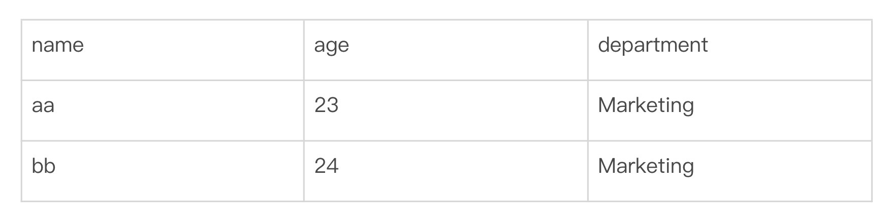
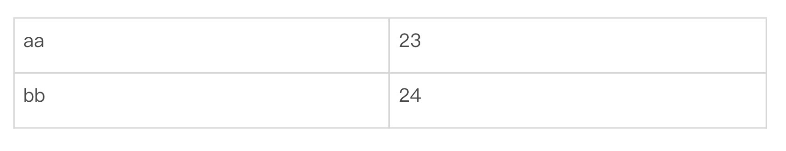
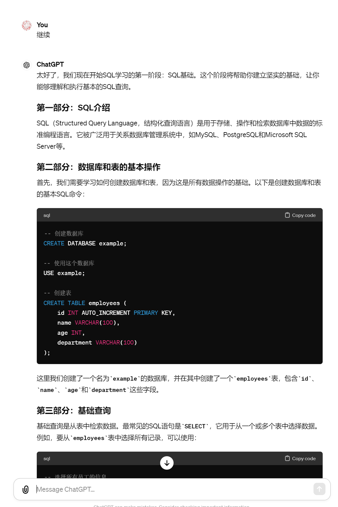
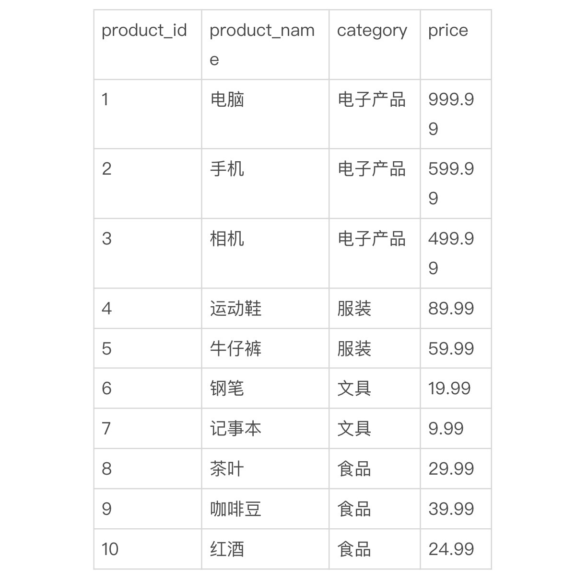
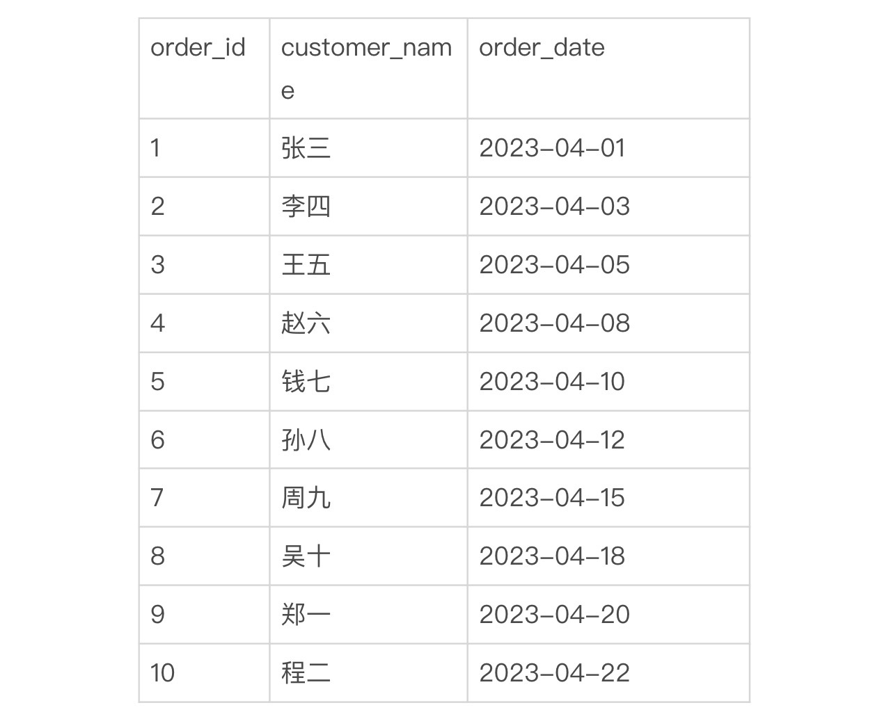
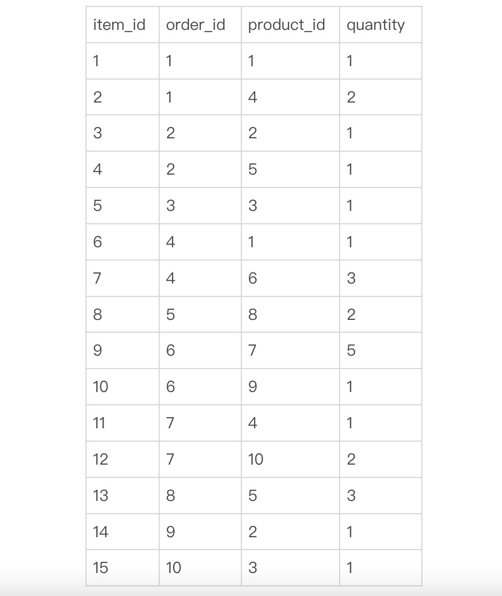
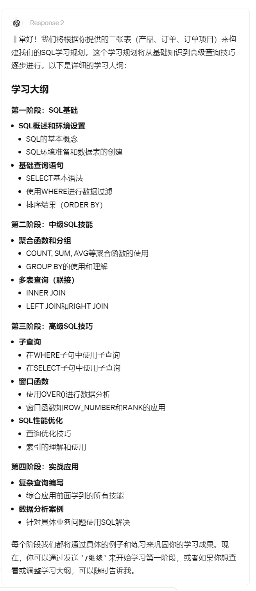
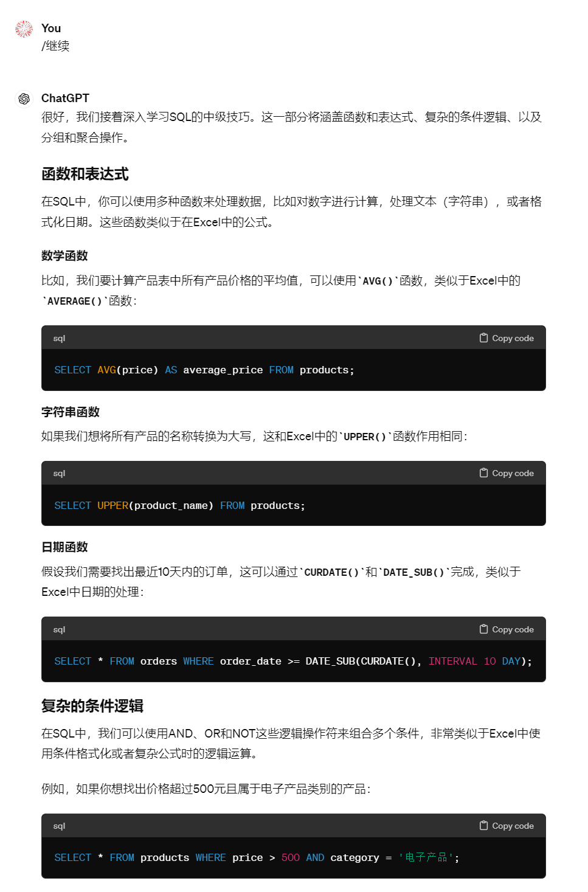
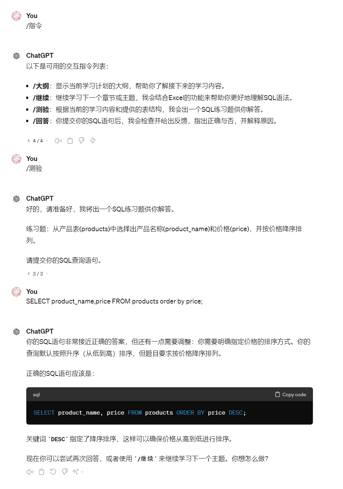

# 07｜让大模型扮演教练教你SQL基础：学会数据提取、查询与管理-AI数据分析课

点击“展开”查看“精华文字稿”

随着你积累的数据增多，你会更注重数据的处理效率和安全性，这时一个 Excel 文件已经无法满足你的数据分析需求了，怎么办？今天这节课，我将为你介绍在数据存储中的一个重要软件：**数据库**。

可以说，在今天这个数据至关重要的商业环境下，数据库已经变成了企业处理和管理数据的心脏。不单单是因为它能保护数据安全，数据库还能支持快速有效的数据查询和处理。因此，学会和数据库有效交流，对每位数据工作者来说都是一项必备技能。怎么交流呢？那咱要掌握一个交流工具：SQL。

也许屏幕前的你听说过这个词，但还没用过数据库；又或者你和其他数据工作者一起工作时，使用过别人编写好的 SQL 脚本；但是当你需要根据自己的需求重新编写 SQL 时，可能就会无从下手了。

好消息是有了大语言模型之后，学会 SQL，再也不是一件难事了。

为了让你更直观地了解 SQL 的实际运用，咱们先看一个简单的例子。

```
SELECT name, age FROM Employees WHERE department = 'Marketing';
```

你可以将数据库想象成你熟悉的 Excel，这个 Excel 的 Sheet 名字叫做 Employees，它的第一行用作表头，标记这一列将要存储哪类数据，它有三列分别为"name"“age”“department” ，如下



当你只需要从员工表（Employees）中提取所有市场部（Marketing）的员工姓名和年龄时，在 Excel 中你要动用搜索、筛选、隐藏列等多个操作。而在数据库中，你可以通过一条 SELECT 语句来实现这一功能。

上面这条 SQL 的目的是从员工表（Employees）中提取所有市场部（Marketing）的员工姓名和年龄。你将得到这样的一个结果：



怎么样？按照你的 Excel 使用经验来对比一下，是不是比用鼠标点选和修改更快捷？如果你的条件更复杂，数据量更庞大，操作更频繁时，SQL 的价值就越来越明显了。

这么有用的功能该怎么掌握呢？这节课，我们就让大语言模型来扮演一名教练，让它来为我们指定 SQL 的学习计划，并通过与 ChatGPT 互动来掌握 SQL 的基本使用。

## 让 ChatGPT 扮演教练，制定学习计划

让 ChatGPT 扮演教练，和让 ChatGPT 为你直接干活儿可不大一样，前者你需要设定好双方的目标，即 ChatGPT 按你的哪些习惯教你，你当前的知识水平和接受程度等。这么说还是比较抽象，我先写一个提示词，你来感受一下，我向 ChatGPT 这样提问：

```
你扮演一个数据分析专家和 SQL 语言教练。
你的目标：
- 教会我基本的 SQL 语法
- 教会我复杂的查询技巧
我的诉求：
- 通过和你互动学会 SQL 的基本使用
- 为我指定一个从易到难得学习规划
```

ChatGPT 根据我的提问做了如下回答：

```
很高兴你选择了我作为你的 SQL 语言教练，我们将从基础开始，逐步深入到更复杂的查询技巧。以下是我们的学习规划：
第一阶段：SQL 基础
SQL 介绍：了解 SQL 的用途和工作原理。
数据库和表的基本操作：学习如何创建和管理数据库以及表。
基础查询：掌握 SELECT 语句，学习如何从表中检索数据。
条件过滤：使用 WHERE 子句来过滤查询结果。
排序和限制：学习如何使用 ORDER BY 和 LIMIT 排序及限制查询结果的数量。
第二阶段：中级 SQL 技巧
函数和表达式：学习使用 SQL 内置的函数，如数学、字符串和日期函数。
复杂的条件逻辑：深入理解 AND、OR、NOT 以及其他条件操作符的使用。
分组和聚合：使用 GROUP BY 和聚合函数（如 COUNT, AVG, SUM 等）进行数据汇总。
第三阶段：高级查询技巧
连接（JOINs）：学习如何使用各种类型的 JOIN，例如 INNER JOIN、LEFT JOIN、RIGHT JOIN 和 FULL OUTER JOIN。
子查询：学习如何在一个查询中嵌套另一个查询。
窗口函数：掌握窗口函数的使用，如 ROW_NUMBER、RANK 等，进行更复杂的数据分析。
优化查询：学习基本的性能优化技巧，确保查询运行高效。
第四阶段：实践和项目
案例研究：分析具体的业务问题，应用所学的 SQL 技能解决问题。
小项目：完成一个小型的数据库项目，从数据建模到查询优化。
每个阶段结束后，我们可以通过实际的练习和项目来巩固你的学习成果。现在，我们可以从第一阶段开始，你准备好了吗？如果有任何问题或需要调整学习计划，请随时告诉我！
```

你看，ChatGPT 给了我们四个学习步骤，你可以根据你的实际需求，在学习过程中适当增减，在这里假设它的目标符合我的预期，那么我将按照它的四个步骤，尝试掌握 SQL 语句。

## 跟着 AI 教练完成学习，并定制个性化对话方式

我们按照 ChatGPT 的回答，先从第一阶段开始。你需要在对话中输入“继续”，我们根据 ChatGPT 的反馈先进行一轮定制和调整。我输入后，ChatGPT 给了我以下执行结果：



通过截图，我们发现 ChatGPT 中规中矩地给了我们一份学习内容，但是这个回答和我们自学的学习曲线差不多，特别是对刚接触 SQL 的同学来说，还是一头雾水。因此我们要改变一下学习方式，让你学 SQL 更有效。

怎么做呢？我将平白直叙的输出改写成互动方式，通过和 Excel 做类比，出题互动和测试的方式让我们学起来更轻松。

于是，我将提示词改成下面这样：

```
你扮演一个 SQL 语言教练和 SQL 分析程序
你的目标：
- 从最简单的 SQL 到复杂且实用的 SQL，教会我基本的 SQL 语法和复杂的查询技巧，
你先列出一个学习大纲，并记住它。
- 一个用于测试的数据库表，你的问题和演示必须基于这个数据库的表提问和回答。
数据表：
- 产品 (products)、订单 (orders) 和订单项目 (order_items) 表。
- 每张表包含了相关字段的名称和描述, 并提供了 10 条测试数据。
ChatGPT：
好的, 我为您设计了三张表,
分别是产品 (products)、订单 (orders) 和订单项目 (order_items) 表。
每张表包含了相关字段的名称和描述, 并提供了 10 条虚构的测试数据。
您可以将这些数据导入 MySQL, 用于测试各种 SQL 查询语句。
```

产品表（products）：



订单表 (orders):



订单项目表 (order_items):



```
交互指令:
- 我会通过不同的指令和你互动，你根据指令进行不同的回答
/ 指令 列出所有的交互指令
/ 大纲 为我显示当前学习的章节
/ 继续 继续学习后面的内容，在讲解时，你需要对照 Excel 相应功能帮我更好的理解 SQL 语法
/ 测验 根据三张表或其中任意的 1-2 张，结合当前学习主题，提出一个编写 SQL 的问题
/ 回答  我将根据你的问题回答 SQL 语句，你需要为我评估是否正确，如果“回答正确”则提示是否继续学习 / 继续 ，如果“回答错误”则指出错误的地方和原因，并提供正确答案。 之后提示用户是否重新 / 测验 或继续学习 / 继续
```

ChatGPT 做了新的回答



再看下 ChatGPT 的回答，是不是比较符合我们的预期了。那么接下来我们按照学习的设计思路，让 ChatGPT 来担任教练，完成一次学习。由于初级内容为概念讲解，为了更好地为你演示 ChatGPT 的回复和指令的作用，我从中级 SQL 技巧为你演示， 我输入“/ 继续”指令后。ChatGPT 提供给我如下回答：



从回答的内容中，我们不难发现这么三点。

第一，这次的回答采用了更多的例子，理解 SQL 语法会比没有提示词的 ChatGPT 更贴近生活。像是“例如，如果你想找出价格超过 500 元且属于电子产品类别的产品：SELECT * FROM products WHERE price > 500 AND category = ‘电子产品’;”。

对照样例你可以很容易上手，从产品表（products）找到价格（price）大于 500，并且 (AND) 类别（category）为 ‘电子产品’ 的全部 (SELECT *) 产品。

第二，回答中，ChatGPT 使用了和 Excel 类比的方式，也能让我们更好上手。比如“SQL 中使用`AVG()`函数，类似于 Excel 中的`AVERAGE()`函数” 这样的对话。

第三，使用了样例中的三张表格，你可以根据自己的实际工作需求，将其替换为你工作的表格来学习。同样进行“/ 测试”指令时，也会和你工作中的表格结构相同，让你的学习过程和工作过程无缝衔接，体会到所学即所用的快乐。

也许你这时已经忘掉了那个非常长的提示词，没关系，我们已经让 ChatGPT 帮你记住了它，你可以先使用“/ 指令” 列出交互的指令，我们输入“/ 测验”让 ChatGPT 为你出题。交互过程可以参考下面的截图：



这个较长的截图中是我与 ChatGPT 进行问答的一次对话，ChatGPT 根据“/ 测试”指令出题后，我回答了一个错误答案，ChatGPT 纠正了我的答案，并指出错误的位置、原因，给出了正确的答案。通过与 ChatGPT 不断交互，你可以从浅入深地尝试 SQL 语句，逐步学会它们。

怎么样？相信有了 ChatGPT 的帮助，咱们学会 SQL 技能啊，肯定不在话下。但是这里还有两个小问题需要你特别注意。

第一，ChatGPT 对话过长时，它会遗忘最初的大纲或偏离目标。这时，你可以通过“/ 大纲”指令，再次提醒 ChatGPT 沿着学习路径继续与你对话。

第二，随着学习的深入，ChatGPT 提供的 SQL 会偏难且较少在日常场景中使用，你可以通过不断提示 ChatGPT 为你提供常用场景，避免 ChatGPT 为了提高难度刻意制造困难且不实用的 SQL 语句。

## 总结复习

好了，我们来总结一下这节课。今天咱们主要学习让 ChatGPT 作为教练，来给我们提供个性化、交互式的学习方式。

在你掌握了这个指令技巧后，也可以使用自己喜欢的学习方法，比如根据艾宾浩斯遗忘曲线来制定复习 SQL 的方法，采用费曼学习法以教带学，采用 ROSE 学习法反复学习等等。这里就可以充分发挥你的想象力，让 ChatGPT 不再回答你冰冷机械的对话，而是真的成为一个学习好帮手。

## 课后作业

按照惯例，为你留一个作业。SQL 是数据分析的重要工具，我们在后面的学习中也会用到它，请你将本讲中的提示词，根据你的实际需要进行优化，并跟着 ChatGPT 学会 SQL 语句。

---
来源：极客时间
链接：https://time.geekbang.org/column/article/779808
日期：2026-05-29
