# 08｜让大模型扮演你的数据分析专家：跨越通用方法的障碍-AI数据分析课

点击“展开”查看“精华文字稿”

前面咱们学习了在数据分析中怎么做好数据清洗，有了数据之后就要进入数据分析处理环节了，这时候新的挑战来了。数据分析是一件有门槛的事情，比如数据分析方法有很多，往往还牵扯到数学知识、统计学知识等等，常常让非专业人士感到难以逾越。幸运的是，大语言模型已经能够扮演数据分析专家的角色，帮助我们解决通用分析方法在实际应用中的各种障碍。

这节课我就带你深入了解数据分析中用到的各种方法。怎么学呢？咱还是利用 ChatGPT 来一步步学习。

我们先向 ChatGPT 提问，数据分析的基本方法有哪些，并要求它举例说明一般应用。一起看下 ChatGPT 给的答案。

## 初识五种数据分析的基本方法

- 比较法

比较法通过对不同数据集间的差异进行比较，揭示数据背后的意义。例如，分析公司每月的销售表现时，通过比较各月的销售额，我们可以识别出表现突出或需要改进的时间段。
- 观察分析法

这种方法侧重于观察并分析数据中的模式，尤其是那些可能影响结果的变量。在分析连锁咖啡店的销售数据时，观察分析法会考虑地理位置、客流量等因素，以准确评估它们对销售影响的大小。
- 细分分析

细分分析通过将数据细分为更小的组，帮助我们更细致地理解数据。这种方法允许我们针对特定群体分析购买行为，进而优化针对性的营销策略。
- 归因分析

归因分析旨在识别哪些因素是导致特定结果的关键原因。在广告投放分析中，归因分析可以帮助我们确定哪些广告渠道最有效，从而更好地调整预算分配。
- 预测分析

使用历史数据预测未来事件的方法称为预测分析。这种方法在库存管理、金融市场趋势预测等多个领域都显示出了极高的应用价值。

众所周知，数据分析的目的就是从数据中找到世界的运行规律，得出支持你的观点的结论。所以，现在咱们看到的这五种分析方法可以说是数据分析中最常用的通用方法，它们都能帮助我们揭示数据背后的意义、评估影响因素、深入理解数据以及预测未来事件。

接下来，咱就用大语言模型帮我们掌握每一个方法的概念并提供贴近生活的案例。

## 掌握数据分析方法及案例实践

### 1. 比较法

为了让 ChatGPT 能更准确地回答我们的问题，这里要明确指出，你需要知道比较法的哪些知识，因此，我的提示词做如下编写：

```
你是一个专业的数据分析师，我需要你提供给我常用数据分析的基本方法
（例如比较法、观察分析法、细分分析等）当中的 " 比较法 " 相关内容。
你需要按照以下主题提供给我：
- 比较法的概念
- 比较法的细分领域
- 借助 ChatGPT，使用比较法进行数据分析的步骤
后续我将提供给你一些数据，你只采用比较法，不混合其他的分析方法，为我:
- 得出初步结论
- 一步一步思考，告知我中间的过程
- 最终结论
```

我们将从 ChatGPT 得到如下信息：

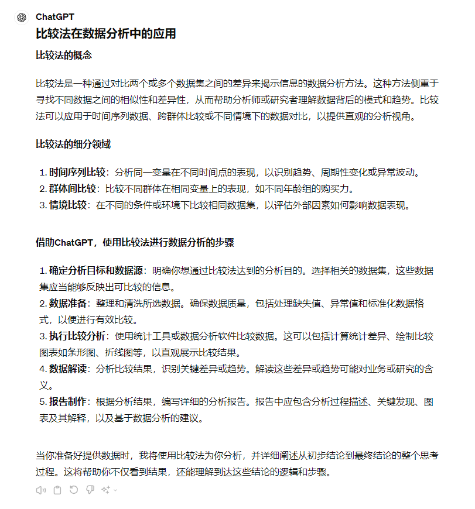

ChatGPT 为我们提供的结果是准确的，由于提示词我使用了“常用数据分析的基本方法当中的比较法”这一描述，让 ChatGPT 准确地理解我们需要的数据分析方法的分类方法，而不是类似分类、聚类等专业机器学习方面的学术分类。另外我还在提示词中使用了“你只采用比较法，不混合其他的分析方法” ，避免这位学识渊博的 ChatGPT 老教授掺杂其他的知识进来，让你能看到更纯粹的只通过比较法得到的结论。那么接下来我就提供一组数据给 ChatGPT，来看看它对具体数据分析的过程，和它的精彩表现吧。

假设我们有两组数据，一组是在特定广告活动期间的日销售额，另一组是广告活动前的日销售额。

- 广告期间销售额：[120, 135, 150, 145, 160]
- 广告前销售额：[100, 105, 98, 103, 110]

我们一起来看一下它的回答：

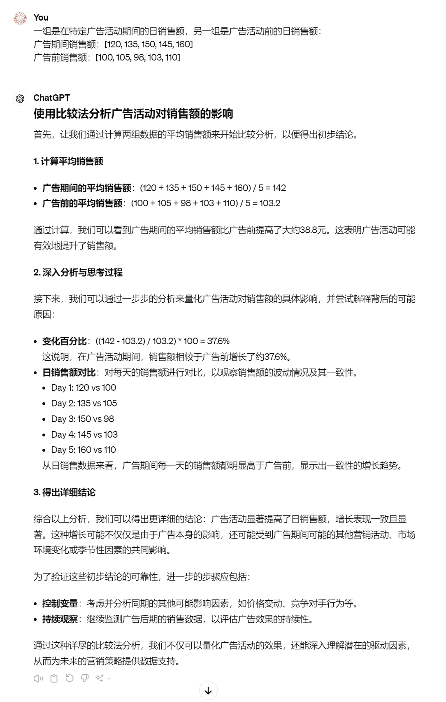

ChatGPT 根据对话的上下文，在我们提供数据后，直接使用了比较法，而且在全部回答中，一直没有偏离这一主题，也没有扩充其他的方法进来，说明“你只采用比较法，不混合其他的分析方法”这一提示词的有效性。

从回答来看，ChatGPT 很好地用了比较法中的时间序列比较，这一点上面，我们在提供数据的时候没有明确表达，但是 ChatGPT 已经识别出来采用分析法中的时间序列比较。

在没有考虑其他因素影响下， ChatGPT 给了结论广告活动提升了销售额。同时我让它将得出结论的过程也一起输出出来给你看的目的是，你从中可以学习分析思路。另一点也需要你提前了解的是，现实生活中对数据结论的影响因素非常多，ChatGPT 由于提示词、上下文、人文环境因素可能会忽略掉某些关键影响因素，如新冠对经济形式、出行的影响，而模型是预训练的，它的时间可能处于半年甚至一年前，因此得出的结论会有偏差。这也是你觉得我的提示词总是很“啰嗦”，得到结论也要让模型或人工反复验证的原因。

总的来说，ChatGPT 给出的对比法结论中规中矩，你能从中理解和运用基于时间序列的对比方法。当然如果你对对比法理解的还不深入，可以通过提供更多的数据，基于我提供的提示词，让 ChatGPT 为你继续讲解群体间比较和情境比较。

接下来我们来看第二种观察分析法。

### 2. 观察分析法

我们将比较法的提示词进行简单修改，得到观察分析法在数据分析中的应用。我的提示词改为：

```
知识点
- 观察分析法
这种方法侧重于观察并分析数据中的模式，尤其是那些可能影响结果的变量。在分析连锁咖啡店的销售数据时，观察分析法会考虑地理位置、客流量等因素，以准确评估它们对销售影响的大小。
你需要按照以下主题提供给我：
- 知识点的概念
- 知识点的细分领域
- 借助 ChatGPT，使用知识点进行数据分析的步骤
为我伪造一个使用分析法的最佳实践数据，你只采用知识点的方法，不混合其他的分析方法，为我:
- 得出初步结论
- 一步一步思考，结合“- 借助 ChatGPT，使用知识点进行数据分析的步骤” 告知我中间的过程
- 最终结论
```

这里我做了两点改动，因为在对比法中，我发现逐步思考过程和 ChatGPT 为我提供的“借助 ChatGPT，使用知识点进行数据分析的步骤” 毫无关联。试想一下，把“大象关进冰箱”的实际操作和操作步骤相悖甚至毫无关联，那么这条提示就是无效的，因此我将其放在“一步一步思考”之后，让大语言模型能够更严谨的思考分析步骤和实际分析数据的关系。

另一点是我将提示词中的全部的对比法，都改成了知识点，然后在最开始定义了当前的知识点，因为我们要掌握五个常用的分析方法，你只需要改每个提示词的知识点就好，其他提示词可以不用修改，这一小技巧你也可以用在需要反复使用的提示词上，减少输入和修改。

我们得到如下的结果：

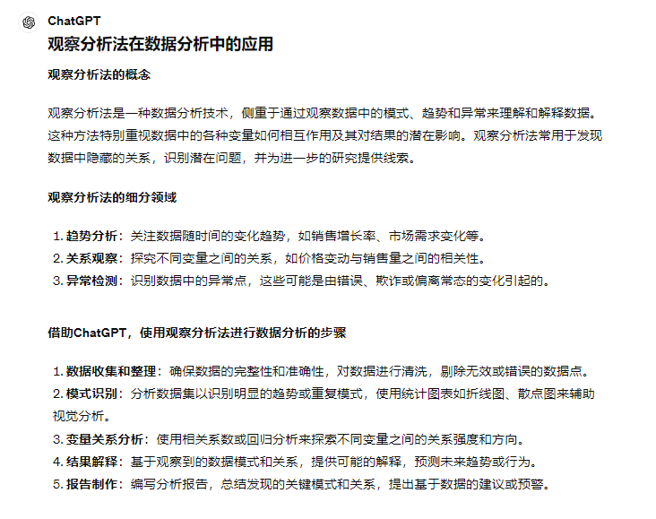

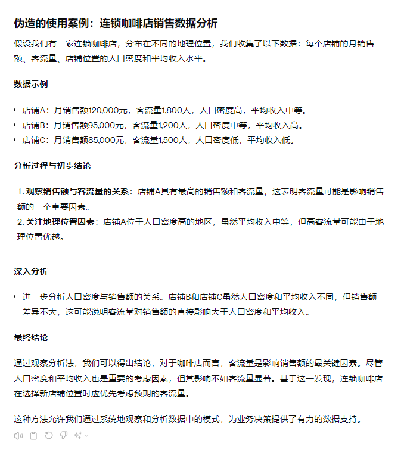

围绕着观察分析法，ChatGPT 也给出了和第一个例子不同的样例数据。你可以从中理解样例分析法的基本分析过程。

这里我继续吹毛求疵，挖掘其中不合理的两个地方。

第一，分析过程没有第一个例子详细了，一个是因为方法不同导致的，另一个是因为我们将一步一步分析的提示词进行了修改，大语言模型又要注意分步骤、又要注意符合结论、还要注意是否满足上下文提供的步骤，简单来说就是要注意的事儿太多太杂了，让大模型分心了。这里很好办，我们可以将这个提示词拆成两个部分来描述，就解决了。

第二，案例中的样例数据是 ChatGPT 伪造的，因此你很容易发现数据中的常识性错误，它没有考虑到获客成本（Customer Acquisition Cost, CAC）这一最基本的要素。获客成本（Customer Acquisition Cost, CAC）是衡量营销和销售效率的一个非常关键的指标，特别是在进行广告效果和销售策略评估时。它可以帮助企业了解吸引每位新客户所需的成本，是企业做出投资决策的重要数据依据。

在我们之前的讨论中未提及获客成本，是因为重点放在了销售数据和客流量的直接分析上，而没有深入到成本效益的评估。这种遗漏是由于我提供的提示词所聚焦的方向导致的。如果我们想要在数据分析中包括获客成本的考量，我们可以按照以下几个步骤来调整和优化提示词和分析方向。

- 明确提出包含获客成本的需求：在分析请求中明确指出需要考虑获客成本，这样我就可以在分析中包括这一因素。例如，您可以修改提示词为：“分析广告活动对销售额的影响，并评估获客成本”。
- 提供相关数据：确保提供足够的数据来计算获客成本，包括广告和营销的总支出、新客户的数量等。
- 分析目标的细化：在您的分析目标中明确指出希望通过数据了解的具体问题，比如“评估不同广告渠道的获客成本并识别最高效的渠道”。

当然这样也违背了我们只学习观察分析法的初衷，所以这里我们暂不考虑更复杂的场景，先聚焦在数据分析基本方法上面。

### 3. 细分分析法

我们来看看 ChatGPT 如何教会我们细分分析方法。

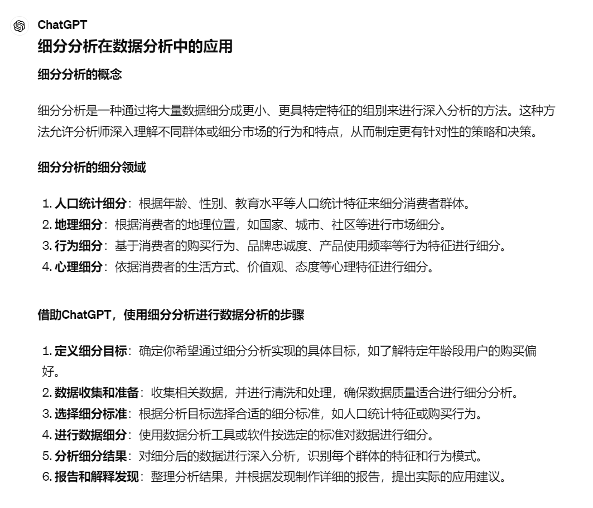

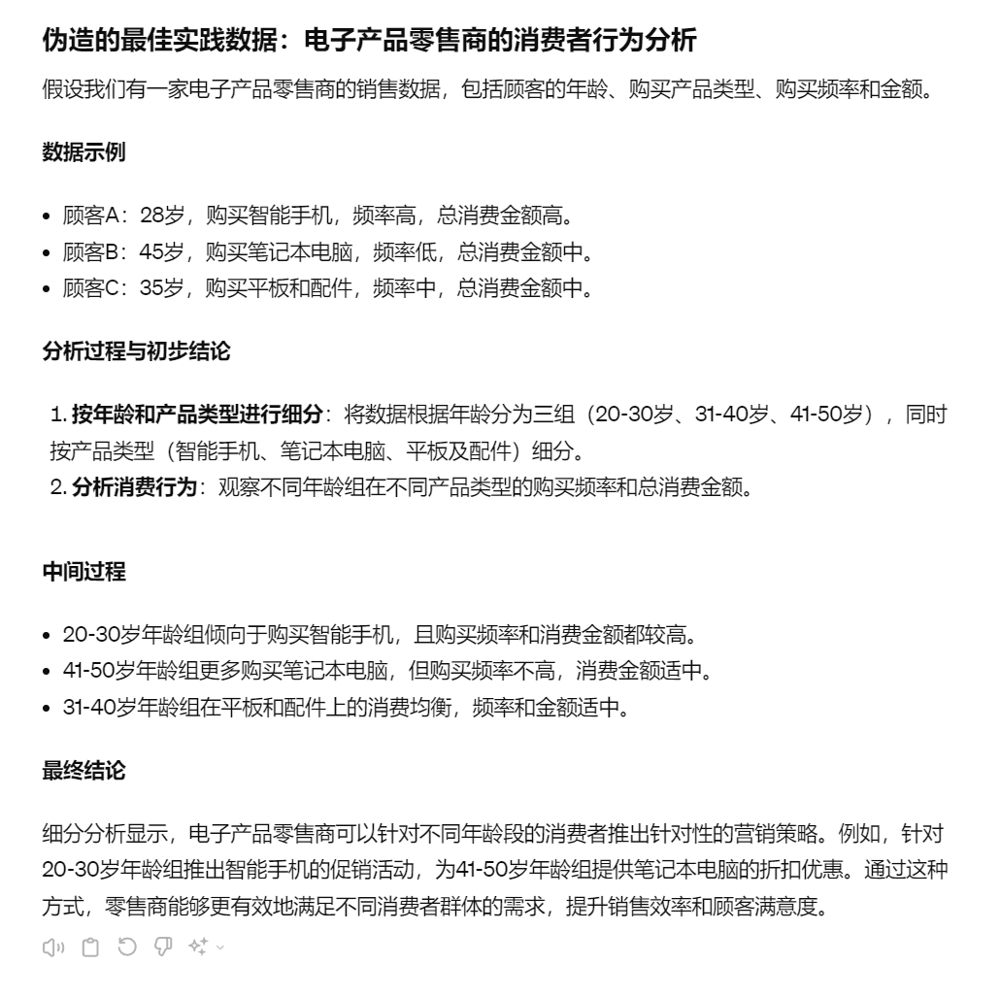

ChatGPT 也正确地回答了细分分析的相关知识，但是因为数据量太小，得到的分析结果比较有限。你可以通过提示词告知 ChatGPT 使用更复杂的数据，也可以使用你工作中的数据或开源数据集让 ChatGPT 为你得出细分法的结论。

例如，我通过提示词，让 ChatGPT 为我伪造以下数据，并给我一个制作数据的 Python 代码，用同样的提示词让 ChatGPT 再次处理。

```
假设我们有一个电子商务平台的用户购买数据，包括以下字段：
用户 ID
年龄：18-25, 26-35, 36-45, 46-55, 56+
性别：男，女
地理位置：北美，欧洲，亚洲
购买频率：低（1-3 次 / 年），中（4-7 次 / 年），高（8 次以上 / 年）
平均消费金额
最近一次购买日期
数据量： 10,000 条用户记录
```

我们得到了新的结论：

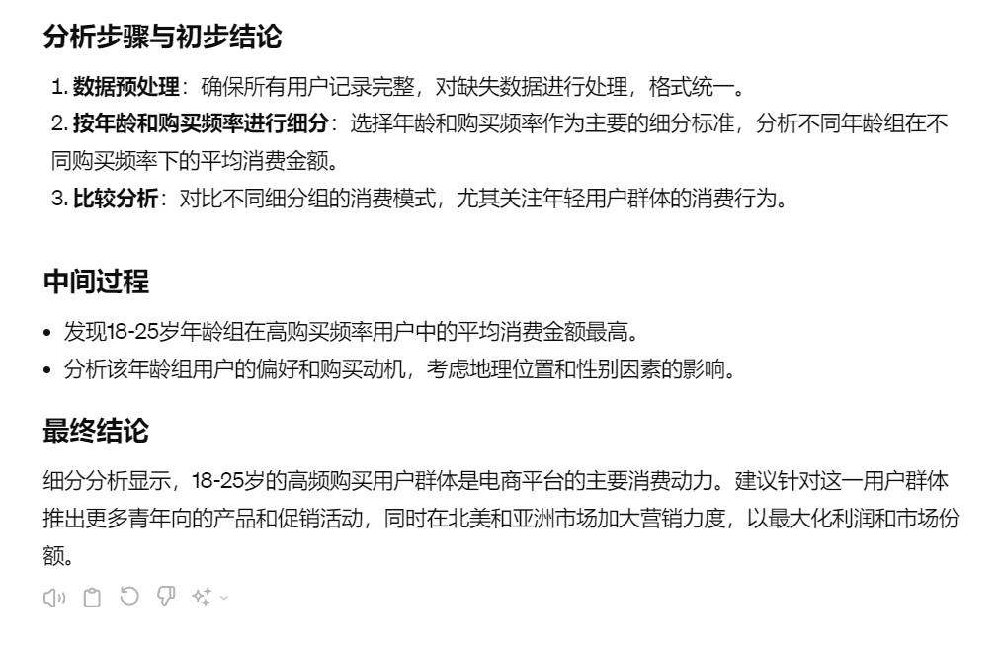

同样受限于我们的提示词，仅仅采用细分分析，但是也得到了一些比较有价值的点。你可以针对用户年龄做优化，提供利润率。

接下来，我们来看看归因分析的概念和示例数据。

### 4. 归因分析

提示词的主题换成归因分析，其他保持不变，我们得到如下结果：

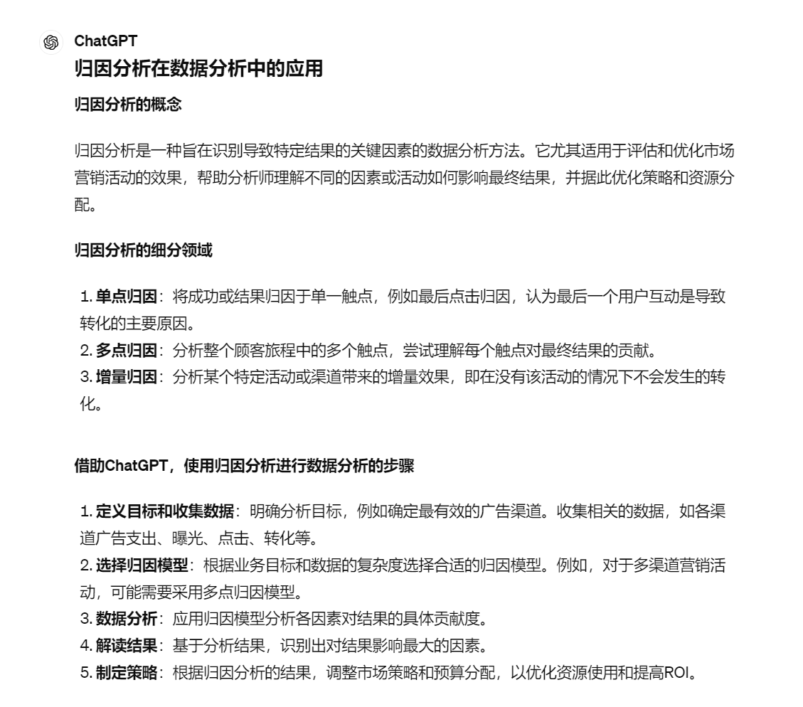

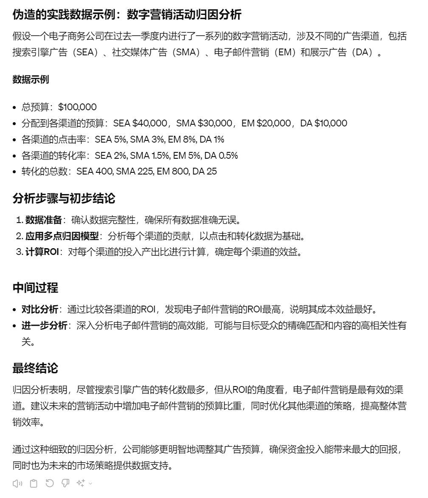

归因分析在数据分析和市场营销策略中起着关键作用，但在实际应用中，单纯依赖归因分析可能会面临一些挑战和弊端。这也是我想在 ChatGPT 回答之后为你补充的内容。

首先，许多归因模型依赖于简化的假设，比如最后点击归因模型假设最后一个点击的广告完全负责转化。这种假设忽视了用户决策过程中可能受到的多个触点的影响。还是以广告为例，用户可能在多个设备上与广告互动，从手机看到广告，可能在电脑上完成购买。如果跨设备的数据追踪不完整，归因分析的结果可能不准确。

其次，用户的购买决策过程往往是复杂的，可能受到多种因素的影响，包括品牌忠诚度、口碑、价格敏感度等。归因分析往往无法全面考虑这些隐性因素。也就是忽略掉了用户行为的复杂性，并且因为某些隐私限制，导致你无法手机用户的行为日志。

实际情况下，我们会采用多模型结合的方法， 例如使用不同的归因模型，如首次点击、线性归因和时间衰减模型，以获得更全面的视角。除了定量的归因分析外，结合使用消费者调研和市场分析等定性方法，以获得更深入的洞见。

接下来我们来看最后一个基本算法，预测分析。

### 5. 预测分析

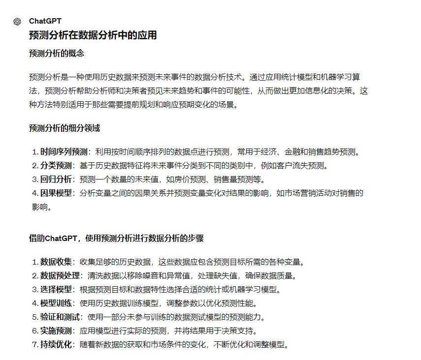

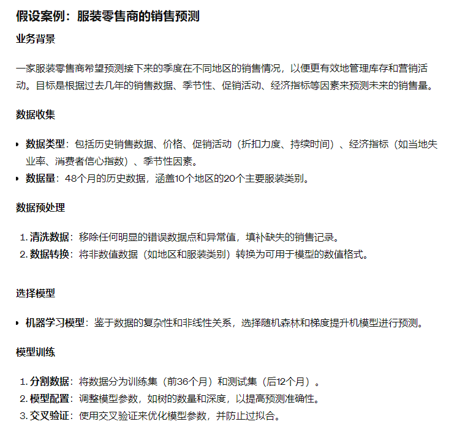

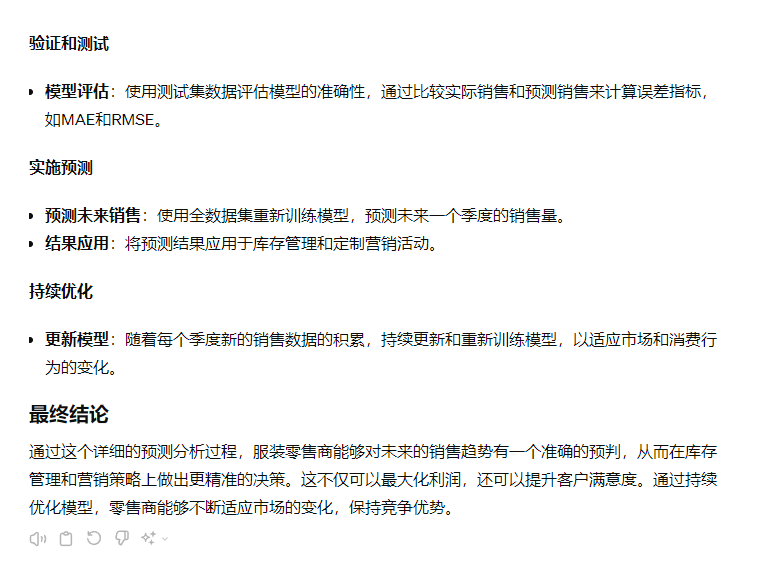

预测分析的结论输出也非常准确和客观。预测分析的核心价值在于其预测未来趋势和事件的准确性。通过比较预测结果与实际发生的数据，我们可以量化模型的预测误差，如平均绝对误差（MAE）或均方根误差（RMSE）。准确的预测可以显著提高决策的质量，降低风险。

在许多商业和科研环境中，模型的可解释性同样重要。尤其是在涉及关键决策的情况下，了解模型如何做出预测（哪些变量最重要）是必须的。模型解释性强可以增加用户对模型的信任并促进其广泛应用。预测分析的模型解释性要更强，这也是 ChatGPT 在解释中间过程比其他模型更丰富的原因，因此它也更容易地被业务团队采纳并产生实际影响。

## 总结复习

最后我来为你总结一下在数据分析的实践中五种基本方法，不同的方法会给我们提供不同角度的洞见，帮助我们从数据中提取有价值的信息，所以我们需要对这些方法有直观的理解，并在实践中反复尝试验证，在你掌握了单个方法后，你也可以尝试结合使用，逐步总结出适合自己数据分析场景的经验方法。

咱们再一起复习一下这五种分析方法：

- 比较法：通过对比两个或多个数据集之间的差异，比较法揭示数据背后的模式或异常。它常用于分析不同时间段或不同群体之间的性能差异。
- 观察分析法：这种方法侧重于观察数据中的模式和趋势，尤其是那些可能影响结果的变量。它帮助分析师理解数据背后的动态和关联。
- 细分分析：通过将数据分成更细小的组，细分分析允许分析师更深入地理解不同子集的行为。这种方法适用于针对特定群体制定定制化策略。
- 归因分析：归因分析旨在识别导致特定结果的关键因素，广泛应用于评估营销活动的效果和优化预算分配。
- 预测分析：使用历史数据预测未来事件，预测分析适用于多种场景，如销售预测、库存管理和市场趋势分析。

## 课后作业

给你留一道课后练习题，应用一下今天学到的五种基本算法。

假设你是一家餐饮连锁店的数据分析师，你有以下关于三家店铺（店铺 A、店铺 B、店铺 C）过去一年的每月销售数据：

- 数据示例：
- 店铺 A：月销售额（单位：千元）：[120, 130, 125, 140, 135, 145, 150, 155, 160, 165, 170, 175]
- 店铺 B：月销售额（单位：千元）：[95, 100, 98, 105, 103, 110, 115, 120, 125, 130, 135, 140]
- 店铺 C：月销售额（单位：千元）：[80, 85, 82, 90, 88, 95, 100, 105, 110, 115, 120, 125]

练习任务：

- 使用比较法：比较三家店铺的年终总销售额，确定哪家店铺的年增长率最高。
- 应用观察分析法：观察店铺 A 的月销售额趋势，并识别任何显著的销售增长或下降。
- 进行细分分析：分析三家店铺在夏季月份（6, 7, 8 月）的销售数据，看是否存在季节性销售模式。
- 实施归因分析：如果店铺 A 在 11 月和 12 月的销售额突然增加，尝试归因其可能的原因。
- 执行预测分析：基于店铺 C 过去一年的销售数据，预测下一年每个月的销售趋势。

通过这些练习，你将能够应用并加深对五种基本数据分析方法的理解，同时提高处理实际数据分析项目的能力。

---
来源：极客时间
链接：https://time.geekbang.org/column/article/780500
日期：2026-05-29
