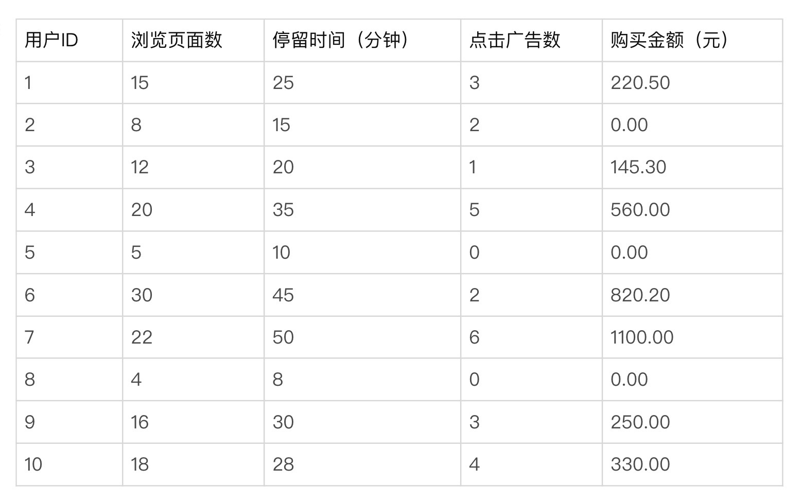
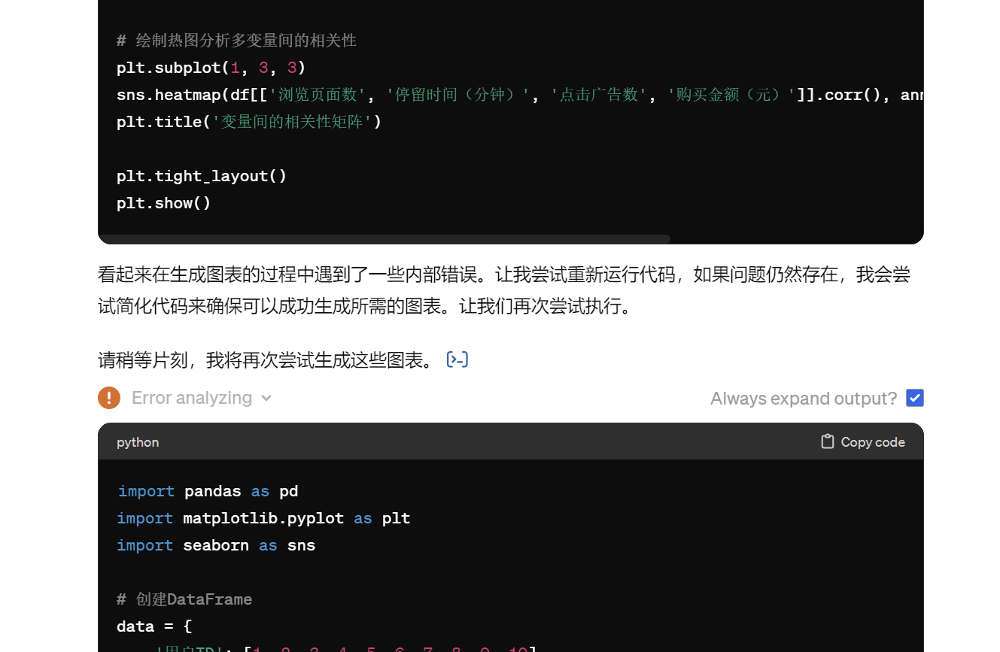
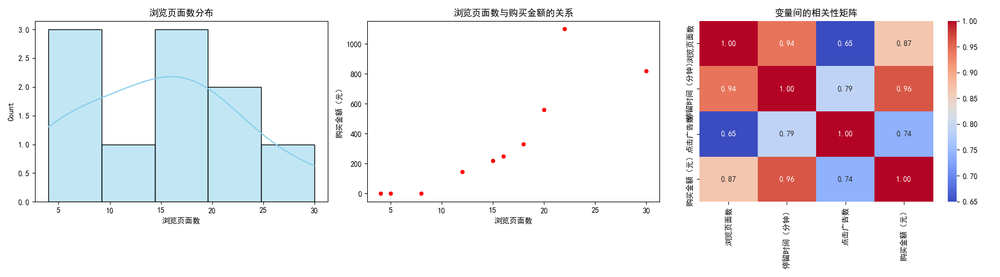
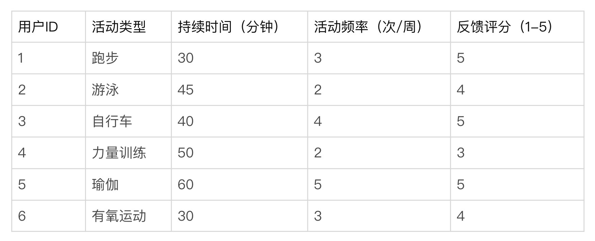
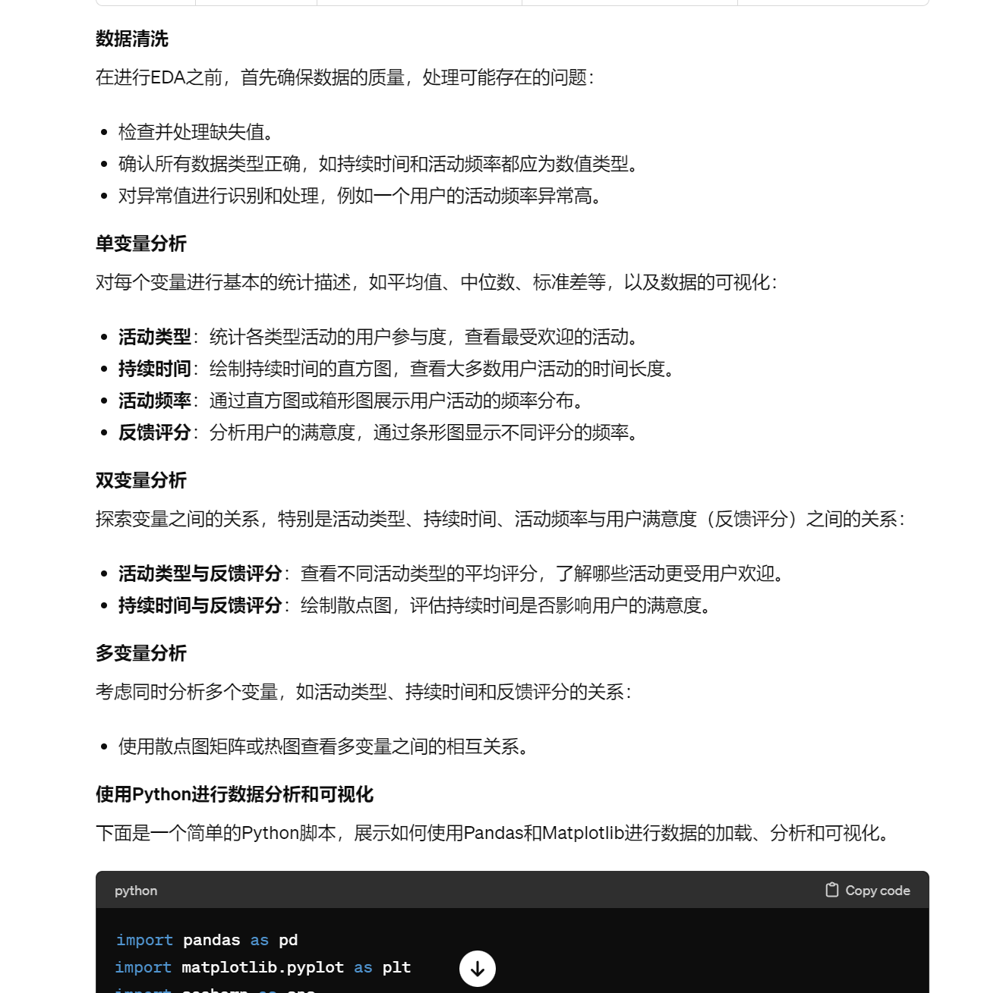

# 09｜数据探索：用和大模型交互的方式做探索性数据分析-AI数据分析课

点击“展开”查看“精华文字稿”

## 探索数据的方法有哪些

这节课我们来学习怎么探索数据。探索数据的方法可以帮助我们在正式深入分析前了解数据的基本情况。这些方法不仅为我们提供数据的直观理解，还能指导我们更有效地处理数据分析的后续步骤。

常见的数据探索方法有哪些呢？咱们掌握下面这 5 个就可以了。

- 描述性统计：计算关键的统计指标，如平均值、中位数、标准差等，这些指标揭示了数据的中心趋势和离散程度。
- 数据可视化：通过图表如直方图、箱线图、散点图等来展示数据的分布、集中趋势和异常值。这种视觉表示有助于直观地识别数据的模式和潜在问题。
- 相关性分析：评估不同变量之间的关系，使用如皮尔逊相关系数来衡量变量间的线性关系强度。
- 分组与聚合：对数据进行分类汇总，分析不同类别或组的数据行为，如通过分组平均值来比较不同类别的表现。
- 初步建模：建立简单的统计或机器学习模型，初步探索数据中的依赖关系，为后续复杂模型的开发提供基线。

那么探索数据的工具，就是咱们学过的 ChatGPT、Python。另外，这节课里我们既要复习前面学过的数据清洗技能，还得能将他们结合在一起使用。

掌握数据探索的各种方法，其实是为进入更系统的探索性数据分析（EDA）铺平道路。 EDA 是一个更全面的数据分析过程，不仅会用到这些数据探索方法，还会加入更多的统计测试和复杂的可视化方法，目的都是未来深入挖掘数据中的信息，获得我们需要的数据洞察和结论，最终能帮助我们解决真实问题。

## 探索性数据分析（EDA）是什么

探索性数据分析（EDA）是一种分析方法，它通过更系统、更深入地使用统计图表和摘要统计量来揭示数据集的结构、异常、模式和关系，而不先设立具体的假设。

- 标准定义：EDA 是通过各种技术主动探索和分析数据集的方法，以发现潜在的模式、检测异常、测试假设或验证假设前的条件。
- 浅显易懂的解释：想象 EDA 就像是对数据进行的一场彻底的健康体检，目的是找出数据的健康状况，识别数据中的任何潜在问题。
- 类比：可以将 EDA 比喻为地图上的侦查活动，在未知领域中寻找有价值的地点，这些地点有助于我们决定哪些地区值得更深入地探索。

那么探索性数据分析（EDA）的一般过程是什么呢？

### 数据清洗

首先，检查数据集中是否存在缺失或异常值，并确保所有数据类型适合后续分析。例如，确认活动类型正确分类，持续时间和活动频率是数值型数据，反馈评分在 1 到 5 之间。

### 单变量分析

- 活动类型：计算各类型活动的用户数量，看哪种活动最受欢迎。
- 持续时间：绘制持续时间的直方图，检查分布情况，了解用户通常进行活动的时间长度。
- 活动频率：分析用户活动频率的统计数据，如平均值、中位数和标准差，了解用户一周内的活动次数。
- 反馈评分：通过绘制评分的频率分布图，查看用户满意度的整体分布。

### 双变量分析

- 活动类型与反馈评分：使用箱形图或条形图展示不同活动类型的平均评分，分析哪些活动类型得到了较高的用户评价。
- 持续时间与反馈评分：绘制散点图，查看活动持续时间是否与用户满意度存在相关性。

### 多变量分析

- 活动类型、持续时间与反馈评分：构建多维可视化，例如使用气泡图（Bubble Chart），将活动类型、持续时间和反馈评分组合在一起分析，观察是否存在特定模式或趋势。

### 得出结论

通过详细的探索性数据分析，我们可以得出初步结论

接下来我们用两个案例深入探讨 EDA 的具体执行过程，通过 Python 展示出来。

## 电商平台用户行为分析

我们提供了一个涉及电商平台用户行为的数据集。现在，让我们将探索性数据分析（EDA）的执行过程应用到这一案例中，详细描述分析的各个步骤，并展示如何从这些数据中得出初步的结论。

提示词我们先采用最基础的提问方式：

```
提示词：
请你按照 EDA 的过程，详细分析电商平台用户行为的数据集，并给出绘制图表的 Python 程序和结果
```

我们得到以下输出，我将其整理之后，展示给你看执行结果。

数据集包含了 10 名用户在电商平台上的行为数据，具体字段包括：用户 ID、浏览页面数、停留时间（分钟）、点击广告数和购买金额（元）。数据如下：



按照上面的分析过程，我们对数据采用探索性数据分析，按照步骤，先进行数据清洗。

### 数据清洗

首先，你要检查数据集中是否有缺失值或异常值。必要时需要通过 Python 对数据进行处理。在案例中，所有字段均已填充，无需进一步处理缺失数据。但是你还是要注意，还要检查数据类型是否适合分析，并确认数值字段无异常，如负数或不合理的高值。

你可以直接向 ChatGPT 提问，并将数据附在提问之后，提示词可以直接按以下方式编写：

```
我需要让你 检查数值字段无异常，如负数或不合理的高值等数据不合理的地方，
除了直接检查外，你应当编写一个函数来检查数据中的异常值，
输出任何发现的异常值，使用 Python 检查异常值时直接输出结果。
```

### 数据集描述

数据集包括 10 名用户的行为数据，字段包括用户 ID、浏览页面数、停留时间（分钟）、点击广告数和购买金额（元）。

### 单变量分析

对每个变量单独进行分析，以理解其分布和特性：

- 浏览页面数、停留时间、点击广告数和购买金额：计算均值、中位数、标准差，并绘制直方图或箱形图以观察其分布。

### 双变量分析

分析变量之间的关系，尤其是看看哪些因素可能影响购买金额：

- 浏览页面数与购买金额：通过散点图查看是否存在正相关性。
- 停留时间与购买金额：同样，使用散点图评估关系。
- 点击广告数与购买金额：分析广告点击是否显著影响购买行为。

### 多变量分析

结合多个变量，探索它们如何共同影响用户行为：

- 浏览页面数、停留时间、点击广告数与购买金额的关系：使用热图展示变量之间的相关性矩阵，或者多变量散点图。

### 执行步骤和代码描述

**1. 数据准备**

首先，你需要创建一个 DataFrame 来存储提供的用户行为数据。

```
import pandas as pd
data = {
'用户 ID': [1, 2, 3, 4, 5, 6, 7, 8, 9, 10],
'浏览页面数': [15, 8, 12, 20, 5, 30, 22, 4, 16, 18],
'停留时间（分钟）': [25, 15, 20, 35, 10, 45, 50, 8, 30, 28],
'点击广告数': [3, 2, 1, 5, 0, 2, 6, 0, 3, 4],
'购买金额（元）': [220.5, 0, 145.3, 560, 0, 820.2, 1100, 0, 250, 330]
}
df = pd.DataFrame(data)
```

**2. 单变量分析**

生成浏览页面数的直方图，可以使用 seaborn 或 matplotlib 库。

```
import seaborn as sns
import matplotlib.pyplot as plt
plt.figure(figsize=(8, 4))
sns.histplot(df['浏览页面数'], color='skyblue', kde=True)
plt.title('浏览页面数分布')
plt.xlabel('浏览页面数')
plt.ylabel('频数')
plt.show()
```

**3. 双变量分析**

使用散点图分析浏览页面数与购买金额之间的关系。

```
plt.figure(figsize=(8, 4))
sns.scatterplot(x='浏览页面数', y='购买金额（元）', data=df)
plt.title('浏览页面数与购买金额的关系')
plt.xlabel('浏览页面数')
plt.ylabel('购买金额（元）')
plt.show()
```

**4. 多变量分析**

创建一个热图以显示相关性矩阵。

```
plt.figure(figsize=(8, 6))
sns.heatmap(df[['浏览页面数', '停留时间（分钟）', '点击广告数', '购买金额（元）']].corr(), annot=True, cmap='coolwarm')
plt.title('变量间的相关性矩阵')
plt.show()
```

这些脚本应该能在您的本地环境中正常运行，从而生成所需的图表。如果您在运行这些脚本时遇到任何问题，请随时询问。

上面的 ChatGPT 返回结果，是 3 条对话返回值合并在一起的结果。通过返回结果，我向你展示了一次完整的探索性数据分析的过程，如果正常情况下，ChatGPT 是能够直接展示结果的，但是也会出现无法绘制图表的问题，比如如下的截图：



这时，你需要让 ChatGPT 生成代码，交由本地执行。我将代码合并到一起，并执行显示结果如下：

```
import pandas as pd
import matplotlib.pyplot as plt
import seaborn as sns
# 设置中文显示
plt.rcParams['font.sans-serif'] = ['SimHei'] # 替换 sans-serif 字体
plt.rcParams['axes.unicode_minus'] = False   # 解决坐标轴负数的负号显示问题
# 创建 DataFrame
data = {
'用户 ID': [1, 2, 3, 4, 5, 6, 7, 8, 9, 10],
'浏览页面数': [15, 8, 12, 20, 5, 30, 22, 4, 16, 18],
'停留时间（分钟）': [25, 15, 20, 35, 10, 45, 50, 8, 30, 28],
'点击广告数': [3, 2, 1, 5, 0, 2, 6, 0, 3, 4],
'购买金额（元）': [220.5, 0, 145.3, 560, 0, 820.2, 1100, 0, 250, 330]
}
df = pd.DataFrame(data)
# 设置画布大小
plt.figure(figsize=(18, 5))
# 绘制直方图观察单变量分布
plt.subplot(1, 3, 1)
sns.histplot(df['浏览页面数'], color='skyblue', kde=True)
plt.title('浏览页面数分布')
# 绘制散点图分析双变量关系
plt.subplot(1, 3, 2)
sns.scatterplot(x='浏览页面数', y='购买金额（元）', data=df, color='red')
plt.title('浏览页面数与购买金额的关系')
plt.xlabel('浏览页面数')
plt.ylabel('购买金额（元）')
# 绘制热图分析多变量间的相关性
plt.subplot(1, 3, 3)
sns.heatmap(df[['浏览页面数', '停留时间（分钟）', '点击广告数', '购买金额（元）']].corr(), annot=True, cmap='coolwarm', fmt=".2f")
plt.title('变量间的相关性矩阵')
plt.tight_layout()
plt.show()
```



通过对图表的分析，可以得到以下结果。

**EDA 结论**

- 用户行为的基本统计：

- 浏览页面数：用户平均浏览页面数约为 14.2，最少的浏览页面数为 4，最多的为 30。这表明用户在平台上的活跃度有显著差异。
- 停留时间：平均停留时间为 26.6 分钟，显示用户在平台上的参与度。最长停留时间为 50 分钟，最短为 8 分钟。
- 点击广告数：平均每用户点击广告数约为 2.6 次，说明广告点击行为在用户中普遍存在，但参差不齐。
- 购买金额：用户的购买金额平均为 342.6 元，但存在极端值（最高为 1100 元），表明部分用户的购买力非常强。

- 浏览页面数与购买金额的关系：

- 散点图分析表明，浏览页面数与购买金额有正相关关系。用户浏览页面数越多，其购买金额往往越高。这可能表明更高的页面浏览次数能够增加购买的可能性，或者更高的购买意向驱使用户浏览更多页面。

- 停留时间与购买金额的关系：

- 停留时间与购买金额也显示出正相关。停留时间越长，用户的购买金额也越高。这反映了用户在平台上的参与度与消费行为之间的正向关系。

- 点击广告数与购买金额的关系：

- 广告点击次数与购买金额之间的散点图表明，较高的广告点击数可能与较高的购买金额相关。这表明有效的广告策略可能对增加平台的销售额起到关键作用。

- 多变量关系：

- 变量间的相关性矩阵（热图）显示，所有考虑的变量（浏览页面数、停留时间、点击广告数）均与购买金额呈正相关，其中浏览页面数与购买金额的相关性最强，其次是停留时间，然后是点击广告数。

电商平台可能会从增加用户在网站上的停留时间、页面浏览量以及有效的广告推广中受益。针对用户行为的优化策略，如提升页面内容质量、提高广告的相关性和吸引力，以及增加用户互动的机会，都可能直接影响销售额的提升。

基于这些 EDA 的结果，电商平台可以考虑实施一些改进措施，如优化网站布局，加强目标广告投放，以及提供更加个性化的用户体验，以进一步提高用户的购买转化率。

有了第一个案例之后，你可以用案例作为提示词，让 ChatGPT“学习”你的表达，来用探索性数据分析来分析第二个案例。

我这里将上面的完整探索性数据分析交给 ChatGPT，然后让 ChatGPT 使用探索性数据分析来进行健身应用用户行为数据的探索性数据分析，并提供数据。

## 健身应用用户行为数据的探索性数据分析（EDA）



ChatGPT 会遵循我们提供的样例，对齐分析，由于结果较长，我将重要的结果贴在下方。



```
数据清洗
在进行 EDA 之前，首先确保数据的质量，处理可能存在的问题：
检查并处理缺失值。
确认所有数据类型正确，如持续时间和活动频率都应为数值类型。
对异常值进行识别和处理，例如一个用户的活动频率异常高。
单变量分析
对每个变量进行基本的统计描述，如平均值、中位数、标准差等，以及数据的可视化：
活动类型：统计各类型活动的用户参与度，查看最受欢迎的活动。
持续时间：绘制持续时间的直方图，查看大多数用户活动的时间长度。
活动频率：通过直方图或箱形图展示用户活动的频率分布。
反馈评分：分析用户的满意度，通过条形图显示不同评分的频率。
双变量分析
探索变量之间的关系，特别是活动类型、持续时间、活动频率与用户满意度（反馈评分）之间的关系：
活动类型与反馈评分：查看不同活动类型的平均评分，了解哪些活动更受用户欢迎。
持续时间与反馈评分：绘制散点图，评估持续时间是否影响用户的满意度。
多变量分析
考虑同时分析多个变量，如活动类型、持续时间和反馈评分的关系：
使用散点图矩阵或热图查看多变量之间的相互关系。
使用 Python 进行数据分析和可视化
下面是一个简单的 Python 脚本，展示如何使用 Pandas 和 Matplotlib 进行数据的加载、分析和可视化。
import pandas as pd
import matplotlib.pyplot as plt
import seaborn as sns
# 创建数据
data = {
'UserID': [1, 2, 3, 4, 5, 6],
'ActivityType': ['Running', 'Swimming', 'Cycling', 'Strength Training', 'Yoga', 'Aerobics'],
'Duration': [30, 45, 40, 50, 60, 30],
'Frequency': [3, 2, 4, 2, 5, 3],
'Rating': [5, 4, 5, 3, 5, 4]
}
df = pd.DataFrame(data)
# 可视化活动类型和用户评分
plt.figure(figsize=(10, 6))
sns.barplot(x='ActivityType', y='Rating', data=df)
plt.title('Average User Rating by Activity Type')
plt.xlabel('Activity Type')
plt.ylabel('Average Rating')
plt.xticks(rotation=45)
plt.show()
```

这个脚本加载了数据，并使用条形图展示了不同活动类型的平均用户评分。你可以根据需要添加更多的分析和图表来探索数据。

通过这种详细的 EDA 过程，我们不仅可以理解用户的行为和偏好，还能基于实际数据做出更有针对性的业务决策。

虽然过程符合我们的要求，但是结论没有给出有效的结果，这也是因为 ChatGPT 回复消息过长导致的，这种情况需要再次提问让 ChatGPT 回复详细的结论。这是大模型本身的问题，无法通过提示词和技巧来解决。

## 总结复习

这节课我希望你能理解探索性数据分析（EDA）这个概念，咱得清楚这是啥，能干啥，一般的流程和步骤是怎样的。

我带你一起分析了 2 个案例，内容有点多，如果有部分内容还不能全部消化，也没关系，工作中遇到类似的场景，就多回来复习，肯定会有不一样的理解和收获。

在整个分析过程中，ChatGPT 展现了强大的分析支持能力。它可以快速生成数据处理脚本、提供统计分析指导、解释和可视化数据关系，是不是极大地简化了分析流程，帮助提高了工作效率和准确性。借助 ChatGPT 这种交互式的功能，即使咱们是数据分析新手，也能轻松进行复杂的数据探索和解释工作。

## 课后作业

背景：你是一名数据分析师，现在手头有一份来自健身应用的用户活动数据。这份数据记录了用户的运动类型、持续时间、消耗卡路里以及用户满意度评分。

数据集描述

- 用户 ID：唯一标识每个用户的编号。
- 运动类型：例如跑步、游泳、骑自行车等。
- 持续时间（分钟）：用户参与特定运动的时间。
- 消耗卡路里：用户在运动过程中估计消耗的卡路里数量。
- 用户满意度评分：用户对运动会话的满意度打分，范围从 1 到 10。

任务

- 使用 Python 进行数据加载和初步的数据清洗。
- 进行单变量分析，评估各个变量的分布情况。
- 执行双变量分析，探索运动类型与消耗卡路里之间的关系。
- 应用多变量分析，查看持续时间、消耗卡路里和用户满意度评分之间的相互影响。
- 利用 ChatGPT 生成数据分析报告，包括图表和你的分析结论。

用好 ChatGPT

- 利用 ChatGPT 自动生成数据清洗和分析代码。
- 利用 ChatGPT 优化数据可视化的设计。

希望通过这个练习，你不仅能够巩固和应用探索性数据分析的知识，还可以体验到利用 ChatGPT 进行数据分析的快乐。

---
来源：极客时间
链接：https://time.geekbang.org/column/article/780502
日期：2026-05-29
