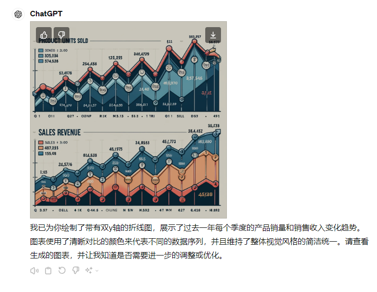
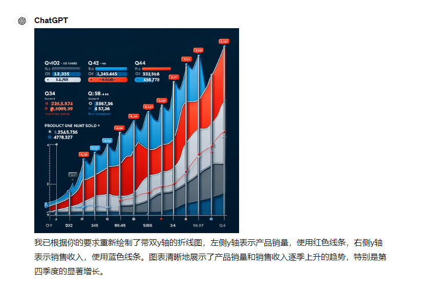
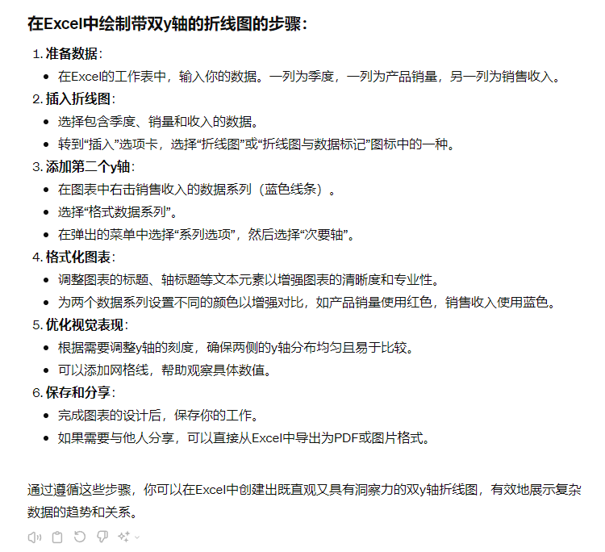
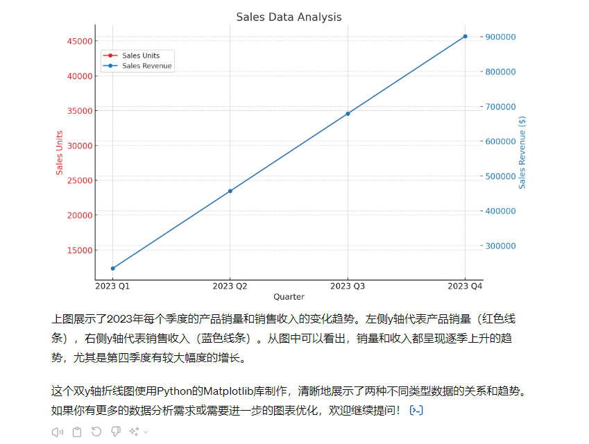
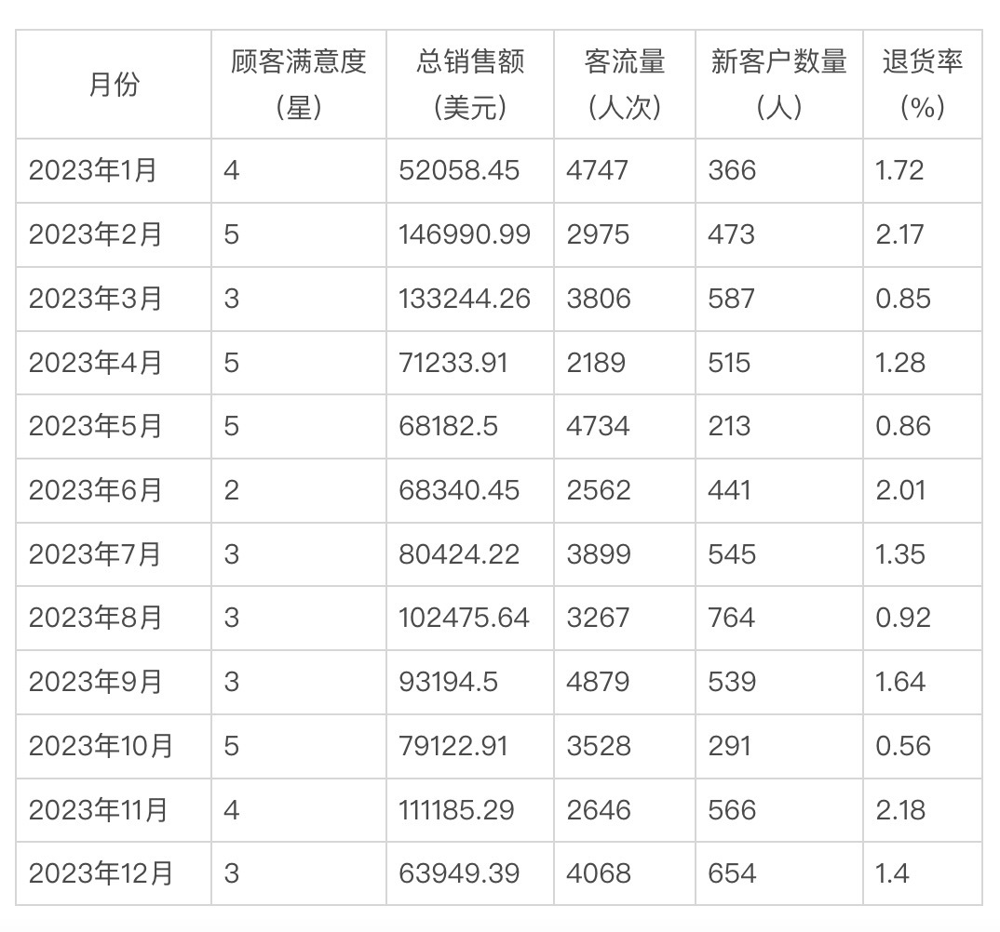

# 10｜让大模型为你绘图：利用ChatGPT创建直观且有洞察力的图表-AI数据分析课

点击“展开”查看“精华文字稿”

创建直观且有洞察力的图表是一门艺术和科学。在这个过程中，我们不仅需要关注数据本身，还要考虑到如何将这些数据以最清晰、最有效的方式展示给观众。ChatGPT 可以在这一过程中发挥重要作用，提供数据分析的深度洞察和优化图表的实用建议。

## 色彩心理学在图表设计中的应用

你知道吗，我们处理视觉信息的方式深受心理学的影响，这些原理可以指导我们创建更易于理解和记忆的图表。最常见的就是认知负荷理论、视觉感知原则和图表类型与信息匹配。我们来逐个介绍一下。

- 认知负荷理论：这个理论提醒我们，设计图表时应避免过于复杂，因为复杂会增加观众的认知负荷，比如，如果你在一张图表中填充了大量数据、过多的标签和多余的元素，观众可能会感到困惑，难以理解图表所要表达的核心信息。相反，如果你设计了一个简洁明了的图表，只展示了关键数据和必要的标签，观众就能够迅速理解图表的含义。举个例子，假设你要展示公司每月销售额的增长趋势，如果你选择一个简单的折线图，只展示每月销售额的数字，那么观众就能够轻松地理解销售情况的变化趋势，而不会被过多的细节所干扰。
- 视觉感知原则：举例来说，假设你在一张柱状图中想要突出显示某个类别的数据，你可以使用对比色来高亮这个类别的柱子，使其在整个图表中脱颖而出。此外，你还可以通过调整柱子的形状或方向来吸引观众的注意力，比如增加某个类别的柱子的宽度或者旋转某些柱子的方向。这样一来，观众在浏览图表时会更容易注意到你想要突出的信息，提高了信息传达的效果。
- 图表类型与信息匹配：选择合适的图表类型对传达信息至关重要。比如，如果你要展示一段时间内某个变量的变化趋势，那么最好选择线图，因为线图能够清晰地展示数据随时间的变化趋势。而如果你要比较不同类别的数据，比如不同产品的销售额，那么最好选择柱状图，因为柱状图能够直观地展示各个类别之间的对比情况。

这些道理虽然简单，但是如果我没有提起，你可能还没有意识到自己在以前的工作汇报中可能已经用错了图表类型。不过不用担心，我在第一次接触这些理论的是也和你一样，不好把握其中的度。例如：怎么选择合适的图表类型，能否让“高手”指点一下用哪些合适的颜色、标签、文字大小，增加什么样的解读文字等等。这些我们都可以交给大模型帮你完成。

## 提示词知识在图表创建中的应用

正如我们在大模型的原理时讲过，**大模型本身没有自主的目标意识, 它只会按照被赋予的指令和训练方法去执行任务**。要想让 ChatGPT 生成合适的图表，你需要给出明确数据分析目标、详细描述数据类型、请求特定图表类型的建议。

- 明确数据分析目标：在生成图表前，明确并描述你的数据分析目标。例如，告诉 ChatGPT 你希望“基于过去一年的销售数据，展示每个季度的销售增长趋势”。并在提示词后附上明确时间范围的销售数据表，ChatGPT 会自动根据类型生成图表。
- 详细描述数据结构：向 ChatGPT 提供数据的详细描述，包括数据类型、关键变量等信息，这有助于模型准确理解数据并提供合适的图表类型建议。ChatGPT 有时无法准确的区分整数、小数、单位这类概念，你提供更详细的数据描述，能让 ChatGPT 给出更贴切的报表。
- 请求特定图表类型的建议：如果你已经有了特定的图表类型想法，直接询问 ChatGPT 关于该类型图表的最佳实践，比如“如何在折线图中有效展示多个数据系列的比较？”让 ChatGPT 给出它对图表的建议。
- 向相关专业借鉴经验：你可以将 UI 界面的知识应用在你的图表设计中，优化用户体验。比如 UI 设计中的一致性、层次性、简洁性，都是设计图表的正确原则，一致性原则是基础，确保你的图表设计与整体应用或报告的风格保持一致。此外，通过恰当使用层次性设计元素，如大小和颜色变化，可以帮助观众更好地区分图表中的不同信息层级。还有，简洁性也是我们不能忽视的。图表中的文字说明应尽量简洁，以避免干扰主要信息的传递。简洁而直观的图例和标签是提高图表可读性的关键。你可以向模型提问时，告诉模型绘制出的图表要保证一致性、层次性、简洁性原则，来提高图表的视觉效果。

接下来我们来结合 ChatGPT 进行图表设计的实际应用。我们按照定义分析目标和描述、生成图表建议、设计图表、优化调整、以及用户反馈循环五个过程来让 ChatGPT 为我们制作图表。

## 结合 ChatGPT 进行图表设计的实际应用

我希望展示的销售趋势图表，下面是一个详细的与 ChatGPT 的交互过程。

```
我: 我手里有一份过去一年的销售数据，包括每个季度的产品销量和销售收入，我希望基于这些数据创建一个图表来展示销售趋势，你有什么建议吗?
ChatGPT: 了解了，根据你的需求，绘制一个折线图或柱状图应该是不错的选择，既可以清晰展示每个季度的数据变化，也便于对比不同季度之间的差异。不过在开始绘图前，我需要一些更多的信息。
我: 继续
ChatGPT: 首先，你可以告诉我一下销售数据的具体格式吗? 比如销量数据是整数还是小数? 收入数据是否带有货币单位? 这些细节会影响我选择合适的图表类型和设置。
我: 好的，这里是销售数据的样式:
季度, 产品销量 (件), 销售收入 (美元)
2023 年第 1 季度, 12345, 234567.89
2023 年第 2 季度, 23456, 456789.01
2023 年第 3 季度, 34567, 678901.23
2023 年第 4 季度, 45678, 901234.56
ChatGPT:" 非常感谢你提供了这么详细的数据格式说明。现在我有足够的信息来为你创建合适的图表了。考虑到你需要同时展示两个数据序列的变化趋势, 我建议使用带有双 y 轴的折线图。这种图表可以在同一个坐标系内同时展示产品销量和销售收入的变化情况。"
我: 请你设计图表时遵循认知负荷理论、视觉感知原则和图表类型与信息匹配，图表样式方面保证一致性、层次性、简洁性
ChatGPT:" 在绘制图表时, 我会注意遵循一些设计原则, 比如使用清晰对比的颜色代表不同数据序列, 保持整体视觉风格的简洁统一, 并提供清晰的图例说明。最后生成的图像, 我会嵌入在这个对话中与你分享。"
我: 请你开始绘制图表
ChatGPT:" 好的, 我这就为你绘制带双 y 轴的折线图, 展示过去一年的季度销售数据变化趋势。稍等片刻, 绘图完成后我会把成品分享给你。"
```



这里我们要停一停，ChatGPT 提供的样式我们比较认可，但是里面的数据不对 ，这是我们要更明确的告诉 ChatGPT 绘制新的图表，或者让其指导我们采用 Excel 或者 Python 绘制图表。因此我调整和优化我的提示词。

```
根据我提供的数据所绘制的带双 y 轴折线图样式正确但是数据不正确，需要重新绘制。
具体要求：
- 左侧 y 轴表示产品销量, 右侧 y 轴表示销售收入
- 两个不同的数据序列分别使用了红色和蓝色曲线来代表。
由于整体来说产品销量和收入都呈现出逐季上升的趋势, 尤其是第四季度有较大幅度的增长。样式上要为我考虑
接下来你需要：
1 重新绘制数据更准确的图表
2 提供采用 Excel 绘制图表的步骤
```





不难发现，第二次生成的图表依然不正确，这是因为 ChatGPT 的 plus 版本才能直接生成折线图的图表，而我们生成的是一张近似的示例图片。那么我们折中考虑，让 ChatGPT 使用 Python 在网页展示，或者可以根据提示在 Excel 中完成。



在这一步骤中，我更建议你多花一些时间，将 ChatGPT 生成的 Python 程序放到本地运行，你可以更方便的调整展示样式。

如果你觉得视觉效果不满意，你还可以通过提示词调整，比如：“在这个图表中，我将年度销售额的折线设置为更粗的红色曲线，而月度销售额折线使用了灰色细线条。通过这种明暗、粗细的对比，年度数据能够自然吸引视线，达到突出重点的效果。”或者让 ChatGPT 自行优化“注重主次分工，再次以之前的图表为例，优化一下次要信息的呈现方式。”

直到调整到你满意为止。

**用户反馈循环**

当我们设计完图表后，引入用户反馈循环是至关重要的步骤。这个环节能帮助我们根据目标观众的反馈进一步调整和优化图表。你可以通过线上调查、一对一访谈或实际的用户测试会议来收集反馈。这些反馈不仅涉及图表的视觉呈现，还包括数据的解释清晰度和信息的接收效率。

例如，你可能发现用户对某些颜色组合的可读性表示担忧，或者他们需要更多的图例解释来更好地理解数据。根据这些反馈，你可以调整颜色方案，优化图例布局，甚至重新思考数据的展示方式。这样的循环评审过程确保图表不仅满足设计标准，而且真正适应用户的需求和偏好。

这样你可以持续迭代优化，保留更好的提示词或 Python 代码解决类似的问题。

## 总结复习

我们已经探讨了利用大语言模型，特别是 ChatGPT，在图表设计中的多个方面，从心理学原理到 UI 设计原则，再到具体的实施应用。通过结合这些原则和技术，我们可以创造出不仅直观且有洞察力的图表，还能通过用户反馈循环不断完善。

图表设计是一个动态的过程，需要不断学习和适应新的技术和用户反馈。利用大语言模型的能力，我们可以更有效地解析数据、提炼信息，并将其转化为易于理解和行动的视觉呈现。这不仅增强了数据的传达效率，也提升了决策的质量。

## 课后作业

假设你是一家连锁餐厅的数据分析师，你手头有以下数据：

- 每月顾客满意度调查结果，满意度分为 1 到 5 星
- 每月总销售额（美元）



你的任务是创建一个图表，展示过去一年每月的顾客满意度与销售额的关系。请按照以下步骤操作：

- 选择图表类型：思考哪种类型的图表最适合展示这种类型的数据关系。
- 应用设计原则：考虑如何应用心理学原理和 UI 设计原则来优化图表的设计。
- 模拟用户反馈：想象一下用户可能提出哪些反馈，比如关于图表的清晰度、颜色使用或数据解释的建议。
- 优化图表：根据想象中的反馈调整图表，尝试改进图表的设计。

完成这个练习后，你将更加熟悉如何结合大语言模型和设计原则来创建有效的数据视觉表达。这种技能在数据密集型的工作环境中尤其宝贵。

---
来源：极客时间
链接：https://time.geekbang.org/column/article/780505
日期：2026-05-29
