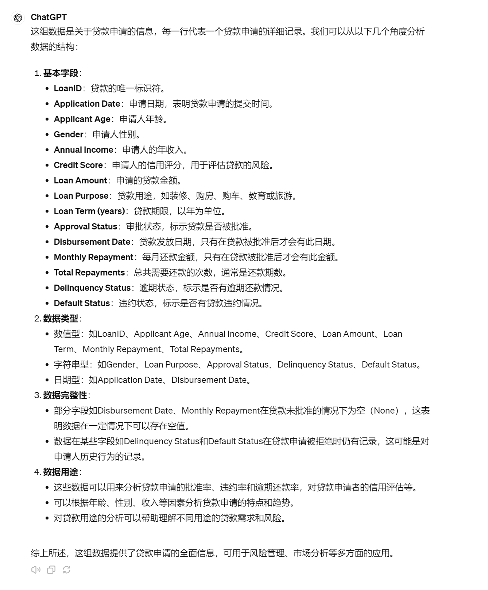
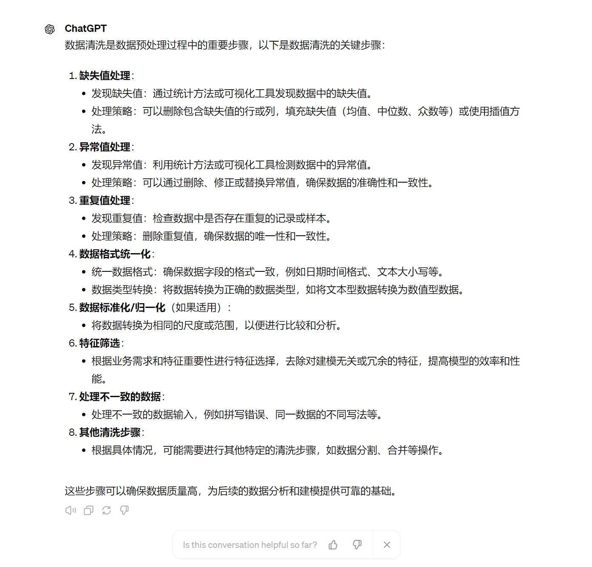
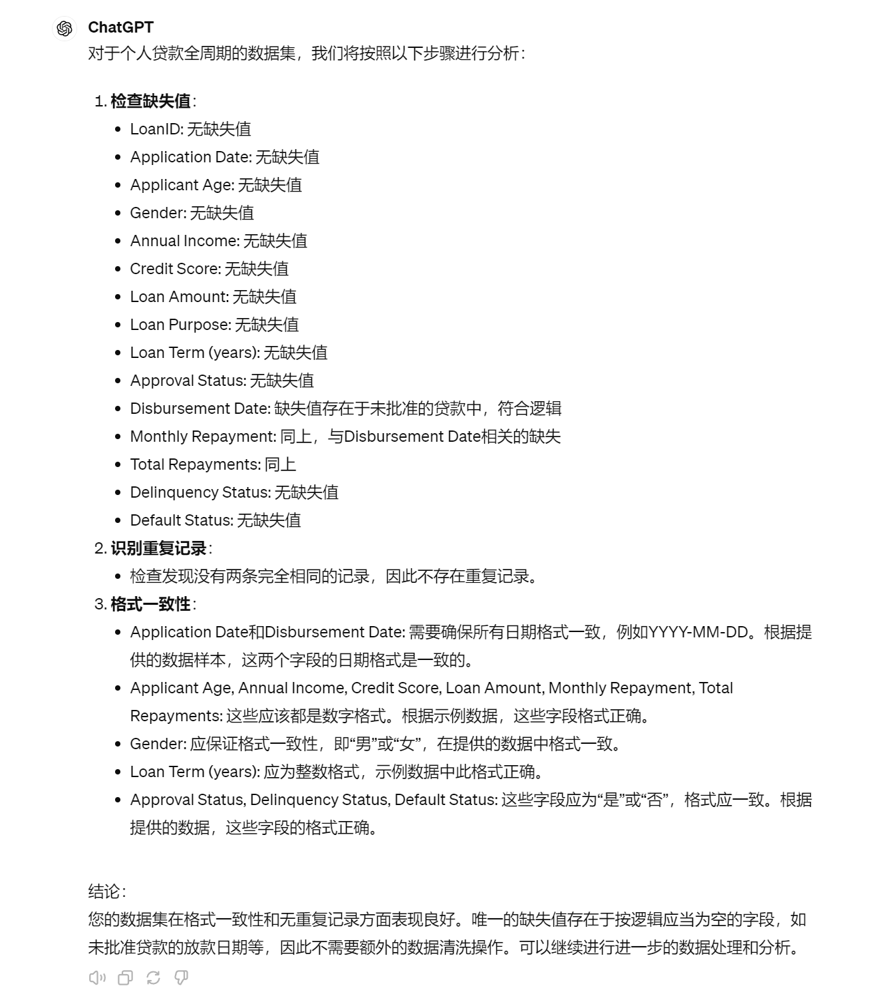
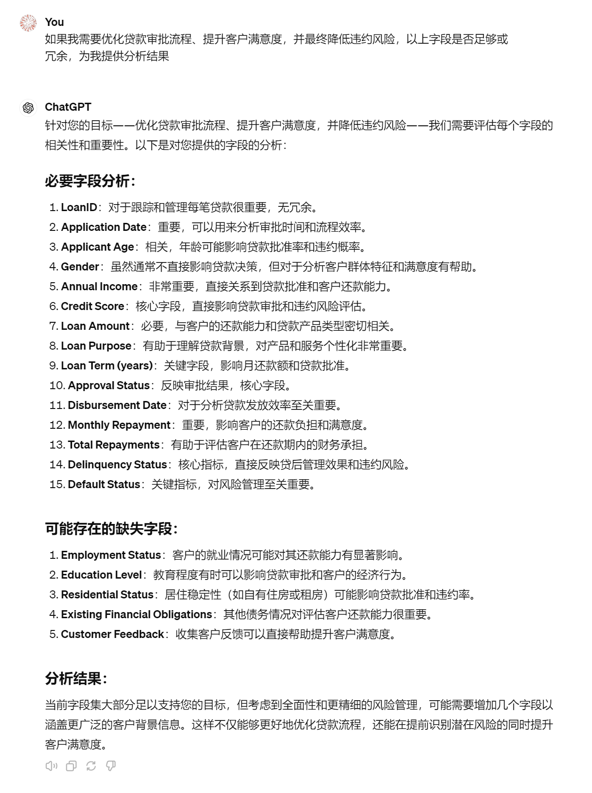
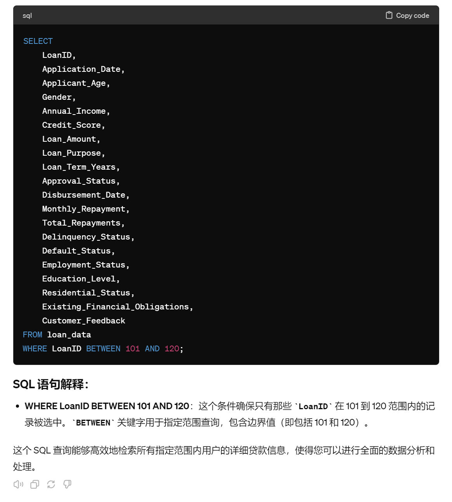
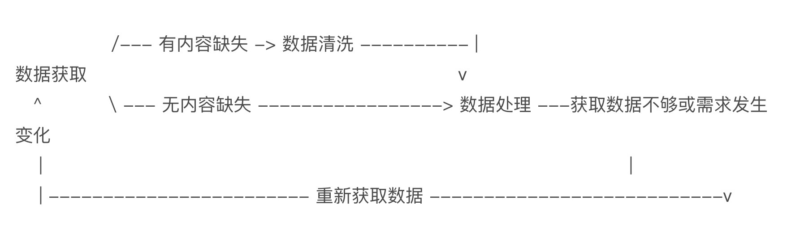

# 12｜数据导入及清洗：ChatGPT在数据处理过程中的完整应用（上）-AI数据分析课

点击“展开”查看“精华文字稿”

前面的课程中，我们一起走过了数据分析的完整流程，包括**数据获取、清洗、处理、建模、结果呈现和业务价值发现**这六个关键步骤。这里面建模部分相对复杂，到现在我们只是初步讨论，在课程的模块四“增强决策支持”这一章节中会进行详细解读。

我们在第一讲中讨论过，数据分析的核心目的是**提炼出业务价值，任何不能为业务服务的分析都是无效的**。因此，在深入探讨了每一个环节之后，现在我将把这些部分串联起来，以全面的视角展示 ChatGPT 如何在整个数据处理过程中提供支持。

为了让你更好理解，我举一个大家生活中常见的例子，个人贷款全周期数据分析，咱们一起来学习 ChatGPT 在整个数据分析过程的应用。

## 数据获取

来，先复习一下，数据处理之前最重要的工作是什么？对，得先明确分析目标。如果目标不清晰，我们无法判断数据的有效性，也很难高效开展后续分析。

咱们的案例是个人贷款的全周期数据分析，目标是什么呢？咱先对齐：**优化贷款审批流程、提升客户满意度，并最终降低违约风险**。

下面我给你提供一个示例数据表，并解释每个字段的含义。

[https://shimo.im/sheets/pmkxdbM0laSp9akN/MODOC/](https://shimo.im/sheets/pmkxdbM0laSp9akN/MODOC/) 《12 讲示例数据表》

字段的含义我放在下方：

```
LoanID: 贷款唯一标识符
ApplicationDate: 申请日期
ApplicantAge: 申请者年龄
Gender: 性别
AnnualIncome: 年收入
CreditScore: 信用评分
LoanAmount: 贷款金额
LoanPurpose: 贷款目的（如购房、教育、装修）
LoanTerm: 贷款期限（年）
ApprovalStatus: 审批状态（批准、拒绝）
DisbursementDate: 放款日期
MonthlyRepayment: 月还款额
TotalRepayments: 总还款次数
DelinquencyStatus: 逾期状态（是、否）
DefaultStatus: 违约状态（是、否）
```

这份数据表看起来还是挺复杂的，实际工作中你可能遇到的数据量更大，格式也更复杂。不过，无需担心，这就是咱们用到大模型的地方了。

咱们在 04 讲学习过，数据获取时面临的问题主要有存储位置不一致和存储格式不一致的问题。这些有的是因为历史遗留数据，有的是因为系统升级，数据格式发生改变。因此先大概看一眼，是否有这样的情况，如果存在就按照各自的方法提取他们，如果不存在那么可以直接获取数据，然后进行下一个步骤，检查数据的内容是否满足分析条件。

**1. 如果数据存放在文本文件中（如 TXT）**

对于文本文件，你可以直接上传文件或者复制数据文本至 ChatGPT 对话框。要让 ChatGPT 有效概览数据，你可以提供如下提示词：

```
“请分析以下数据结构。”
“请概述这些数据的主要特征。”
“请帮助我理解这些数据的基本信息。”
```

**2. 如果数据存放在 Excel 中**

对于存储在 Excel 中的数据，我们需要将其转换为文本格式（如 CSV），这样可以更容易地通过编程方式处理或者上传至平台如 ChatGPT。你可以提供如下提示词：

```
为我编写 Python 脚本，将 xxx 目录下的 path_to_your_file.xlsx 转换为 CSV 格式。
```

旦转换成 CSV 文件，你可以将其内容复制并粘贴到 ChatGPT 对话框中，或者直接作为附件上传该文件。

**3. 如果数据存放在数据库中**

如果数据保存在数据库中，你需要让 ChatGPT 为你生成 SQL。你可以提供如下提示词：

```
我的数据存入到了 MySQL 数据库中，请你按要求为我编写 SQL 语句：
1 数据库所在的 IP、用户名、密码 (注意数据安全) 分别为： xxx, xxx, xxx
2 数据所在的库和表分别为： xxx,xxx （需咨询数据库管理员）
3 我的表格式为： 字段的含义
4 请为我编写提取数据前 xxx 行或全部数据的 SQL 语句，并为 SQL 语句增加注释，用于人工审核
```

在这个过程中，你需要将数据库的路径、表名和查询语句调整为实际的参数。

**4. 如果数据存放在网页中**

当数据存放在网页中时，你可以使用网页爬虫来提取数据。你可以参考第六讲中我们的数据获取方法即可。这里就不再赘述了。

将数据发送给 ChatGPT 以后，我们就可以向其提问：

```
“请分析以下数据结构。”
```

得到数据的概览情况，ChatGPT 将会对基本字段、数据类型、数据完整性以及数据用途给我们进行回复。



在这里，你要注意的是，ChatGPT 会“记住”这些分析结果，如果 ChatGPT 提供的信息不对，你务必要纠正它，例如数据类型、字段功能不对，都可能导致生成图表和结论的差异，到分析后期再回过头来纠正，就需要耗费较长的时间和多次重复对话了，不要害羞，大胆的直接指出 ChatGPT 哪里理解错了。

当 ChatGPT 的理解与你的期望大致一致时，我们开始第二个步骤，数据清洗。

## 数据清洗

数据清洗有哪些关键步骤？如果忘掉了也没关系，你可以直接问 ChatGPT，数据清洗的步骤有哪些，我带你再来回顾一下。



那么对于我们的数据，我们不能仅仅对 ChatGPT 说：“你去数据清洗吧！”这样的指令可能不够明确，尤其当数据集存在各种复杂问题时。例如，如果数据集中有缺失值、重复记录或格式错误，ChatGPT 可能需要更具体的指示来正确处理这些问题。

因此，在进行数据清洗前，我们**首先需要对数据进行详细的检查，以确定需要解决的具体问题**。

例如，我们可以对 ChatGPT 下达如下指令：

```
1.  检查缺失值：“请列出每个字段的缺失值数量。”
2.  识别重复记录：“检查数据中是否存在完全相同的记录，并告诉我重复记录的数量。”
3.  格式一致性：“验证日期和数字字段的格式是否正确，如果不正确，请指出具体问题。”
```

通过这样的步骤，我们不仅确保了数据清洗的目标明确，而且也可以利用 ChatGPT 的能力来精确地处理具体的数据问题。这样的方法可以避免误修复和数据错误，确保分析的准确性。

接下来，**针对每个识别出的问题，我们可以继续具体指导 ChatGPT 进行修复**。例如，对于缺失值，我们可以决定是删除还是填充；对于重复记录，我们可能会选择保留一条或删除所有重复项；对于格式错误，我们将指定正确的格式并要求转换。

在完成这些数据清洗步骤后，我们将拥有一个更干净、更可靠的数据集，为下一步的数据处理和分析打下坚实的基础。这样，我们就可以确信所得出的结论是基于高质量数据的，从而使业务决策更加精确和有效。



上图就是 ChatGPT 检查的结果，当然，你也可以故意删除某些字段让其进行检查，观察 ChatGPT 对缺失数据的表述是否正确。这里还有一个小技巧，如果 ChatGPT 一直识别不对的话，你可以从 ChatGPT3.5 模型切换为 ChatGPT4，让它通过 Python 编写程序来准确分析数据的缺失值。

一旦有缺失值、重复值、或者异常值，你需要明确告知 ChatGPT 如何帮你处理，比如“年收入缺失值按照相同年龄均值填充” “删除重复的行” “将年龄大于 60 岁作为异常值删除该行” “将贷款期限大于 30 的值改为 30” 明确行动目标，ChatGPT 才能更有效的为你进行数据的通用处理。

## 数据处理

除了通用处理外，在你明确了业务需求后，你还要考虑业务特殊需求，即数据的筛选、分割、合并，回顾我们进行数据处理的核心目的**优化贷款审批流程、提升客户满意度，并最终降低违约风险**上， 我们的数据是否足够或者有不必要的数据。我们的数据有 15 列，不难想象你将它们都展示在图表上，图表该有多混乱，所以你可以继续问 ChatGPT。



好家伙，我们刚才还在得意，我们的字段没有异常，结果一结合业务才知道，要想达到目的还需要合并其他字段。要想让你的结论更“靠谱”，你需要再补齐其他的字段。如果你的其他字段在 Excel 或者文本文档中，按照之前的步骤直接输入到 ChatGPT 即可，如果在数据库中，可能意味着数据量比较庞大，因此，可以偷懒让 ChatGPT 为你生成一个只匹配演示的用户缺失字段的 SQL 语句。



我将缺失的数据也放在下方，方便你练习。

字段含义

```
Employment Status：客户的就业情况可能对其还款能力有显著影响。
Education Level：教育程度有时可以影响贷款审批和客户的经济行为。
Residential Status：居住稳定性（如自有住房或租房）可能影响贷款批准和违约率。
Existing Financial Obligations：其他债务情况对评估客户还款能力很重要。
Customer Feedback：收集客户反馈可以直接帮助提升客户满意度。
```

字段内容为

```
LoanID | Employment Status | Education Level | Residential Status | Existing Financial Obligations | Customer Feedback
101    | Full-time         | Bachelor        | Own home           | Credit card debt, Car loan     | Very satisfied
102    | Part-time         | High School     | Renting            | Student loan, Credit card debt | Satisfied
103    | Self-employed     | Master's        | Own home           | None                           | Neutral
104    | Unemployed        | High School     | Renting            | Credit card debt               | Dissatisfied
105    | Full-time         | Bachelor        | Live with parents  | Credit card debt, Mortgage     | Very satisfied
106    | Self-employed     | None            | Own home           | Business loan                  | Very satisfied
107    | Full-time         | PhD             | Renting            | None                           | Neutral
108    | Full-time         | Master's        | Own home           | Mortgage, Credit card debt     | Satisfied
109    | Part-time         | High School     | Renting            | Student loan                   | Satisfied
110    | Unemployed        | None            | Renting            | Medical bills                  | Dissatisfied
111    | Full-time         | Bachelor        | Renting            | Credit card debt               | Neutral
112    | Full-time         | Associate       | Own home           | Car loan                       | Very satisfied
113    | Part-time         | High School     | Live with parents  | Student loan                   | Neutral
114    | Self-employed     | Bachelor        | Own home           | Business loan                  | Satisfied
115    | Full-time         | Master's        | Renting            | None                           | Satisfied
116    | Unemployed        | None            | Homeless           | Medical bills                  | Dissatisfied
117    | Full-time         | Doctorate       | Own home           | Credit card debt, Mortgage     | Very satisfied
118    | Full-time         | Bachelor        | Own home           | Car loan, Student loan         | Neutral
119    | Part-time         | Associate       | Renting            | None                           | Neutral
120    | Self-employed     | High School     | Own home           | Business loan, Credit card debt| Very satisfied
```

数据说明：

- Employment Status: 反映客户的就业状态，如全职、兼职、自雇或失业。
- Education Level: 客户的最高学历，如博士、硕士、学士、副学士、高中等。
- Residential Status: 客户的居住情况，如自有住房、租房、与父母同住或无家可归。
- Existing Financial Obligations: 描述客户当前的财务负担，如信用卡债务、学生贷款、汽车贷款、医疗账单等。
- Customer Feedback: 客户对银行服务的反馈，如非常满意、满意、中立、不满意。

将其与之前的表格进行合并后，就得到了完整的数据，这回你可以再次询问 ChatGPT，是否满足业务分析需求。以确保数据清洗工作真的完成了。

那么数据清洗工作中还会涉及 ChatGPT 回复的：格式统一、范围统一、拼写错误等等工作。虽然处理门槛不高，但都是一些琐碎且耗费时间的工作。你都可以让 ChatGPT 分析之后，明确指出处理办法，让 ChatGPT 为你处理的。

处理完成的数据，我们就可以继续流程实现**建模、结果呈现和业务价值分析**了，那么后面三个步骤我在下一节继续为你讲述。

## 总结复盘

这一讲我们通过一个完整的案例，带着业务需求从头到尾演示数据分析的全流程。一个目的是复习数据分析各阶段的重点知识，另一个是在单项任务你已经了解的前提下，带着业务需求来进行整个的分析，也可以理解成带着问题来学习。

在这一讲讲中，我们先完成了数据的获取、清洗、处理三个步骤。

在带着业务需求的前提下，数据获取需要考虑字段数量、类型、完整性是否符合业务要求。

数据清洗也带来新的挑战，比如：将贷款期限大于 30 的值改为 30， 为什么是 30 不是 40 呢？ 还有，比如，使用平均值替换缺失的值？什么是平均值而不是最大值最小值呢？这些都是由业务需求来决定的 ，因此，带着业务需求的清洗操作对比前面章节学习的清洗数据的通用办法来说，要求更高，不能提一个模糊的指令，让 GPT 帮你判断。

数据处理部分增加业务需求之后，也变得复杂起来。单独进行处理时，最多就是统一一下单位名称、统一一下格式，但是带着业务需求之后，你要让 ChatGPT 根据业务来检验数据是否足够，如果数据充足那就继续往下一个流程走，如果数据不足，要回到数据获取环节，重新获取数据，与当前数据合并。

在数据合并时，也会产生新的数据清洗需求。好在 ChatGPT 可以在不改变提示词逻辑的前提下，也能搞定这件事。需要人工来做的就是，ChatGPT 提示你，还需要 xxx 数据时，你是否认同他的观点，同意 ChatGPT 将新的数据引入进来。活生生的一个，你来当老板，ChatGPT 为你打工的职场 PUA 大型现场。

最后，在现实数据分析中，不得不提的一点是，需求不会一成不变。一旦需求变动，在数据处理环节仍然需要调整字段的数量，太多了图表显得累赘，分析时也更复杂但是得不到有效结论。太少了结果中缺失必要条件。



## 课后作业

按照我们的学习惯例，今天的作业是将课程里提到的两份数据合并为一个 Excel 表格，并验证数据的正确性。你可以选择直接让 ChatGPT 来处理这一任务，或者通过编写 Python 脚本来完成。无论选择哪种方式，关键是确保数据整合后的准确性和可用性，为接下来的分析提供坚实的基础。

---
来源：极客时间
链接：https://time.geekbang.org/column/article/782557
日期：2026-05-29
