# 13｜数据分析及展示：ChatGPT在数据处理过程中的完整应用（下）-AI数据分析课

点击“展开”查看“精华文字稿”

上一讲中，我们详细探讨了个人贷款全周期数据的获取、清洗、处理这三个关键步骤。这一次，我们将继续深入分析，重点放在建模、结果呈现和业务价值发现上。在此之前，我想再次明确我们的分析目标——优化贷款审批流程、提升客户满意度，并最终降低违约风险。就像 ChatGPT 偶尔需要提醒目标一样，我们也需要不断回顾我们的分析目的，确保不偏离预设的方向。

那么有目标就能直接完成吗？这个目标“太大”，无法用“数据描述”，也容易让你的分析结果偏离核心问题。虽然在数据库中为你呈现的是一张表格，但是现实世界中，贷款的流程是随着时间，数据不断变化的，因此呢，我们将整个贷款过程划分为贷款前、贷款中和贷款后三个部分，来分别关注不同的核心指标。这些核心指标帮助我们监控和评估整个贷款流程的效率和风险。为了精准指导这一过程，我们将利用 ChatGPT 的能力，来定义和解释这些关键阶段的具体指标。

## 定义核心指标

在深入到贷款建模和结果呈现之前，首先来定位各阶段的核心指标。这些指标是我们实现目标的路标，帮助我们检测关键点，从而使决策更精确、更有针对性。以下是各个阶段可能关注的核心指标：

```
你现在是一名专业的数据分析师，
请你参考我提供的个人贷款数据，将贷款过程划分为前期、中期、后期，
为我提供不同时期的核心指标，用于优化贷款审批流程、提升客户满意度，并最终降低违约风险。
```

ChatGPT 做了如下输出：

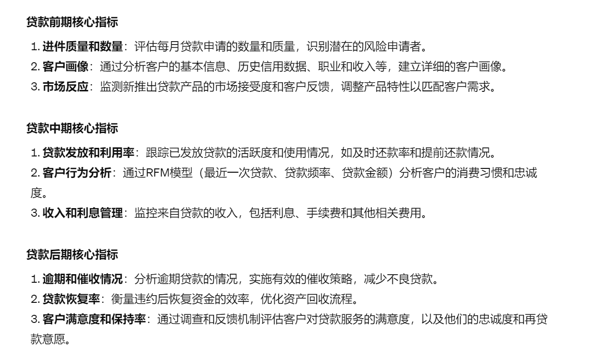

这些指标就是我们用于建模后进行图表展示的关键项，在这里，我们需要对指标再次确认，你可以人工确认也可以求助 ChatGPT，确保你的数据能支持这些指标的输出，否则需要回到数据处理部分增加字段。当然也可能回到更前面的数据获取和清洗过程。

所以这部分工作过程经常被放在数据处理阶段，作为数据处理和建模承上启下的阶段。

## 建模

接下来，我们将具体深入这些指标的分析方法和使用的工具，确保每一步分析都能对业务决策提供有力的数据支持。通过这种方式，我们不仅优化了贷款流程，也增强了客户关系管理，进一步降低了违约风险。接下来的部分，我们将探讨如何利用统计模型和机器学习技术来预测和管理这些风险，具体内容包括：

- 建立预测模型：利用历史数据建立贷款违约预测模型，提前识别高风险客户。
- 结果的可视化呈现：通过图表和仪表板展示分析结果，使决策过程更直观、更易于理解。
- 实时监控和调整策略：建立实时数据监控系统，根据市场变化和客户行为及时调整贷款政策和策略。

通过这些方法，我们能够不断提升数据分析的实用性和战略价值，确保贷款业务的持续健康发展。

可能这样描述，你觉得太晦涩难懂，那我们就先以贷款前期核心指标“进件质量和数量：评估每月贷款申请的数量和质量，识别潜在的风险申请者”为你来演示如何建模，需要哪些字段，采用何种图表。

同样的， 我们仍然借助 ChatGPT 来完成这一工作。我给 ChatGPT 以下提示词：

```
请你结合数据，实现进件质量和数据建模，
你需要告知我所需字段，建模步骤，推荐我用何种图表展示
以及生成图表的 Python 脚本
```

ChatGPT 做如下的回复，我先给你看一下然后带你来分析它的回复结果。

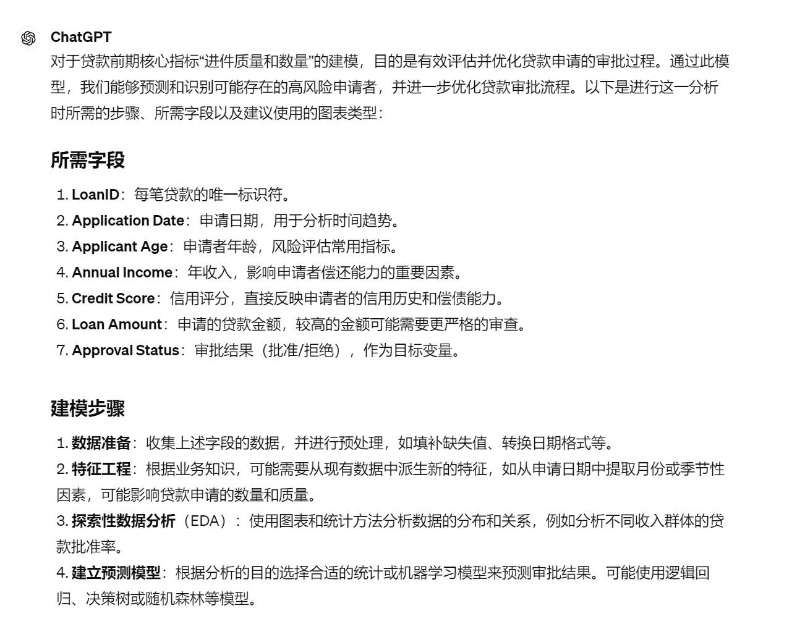

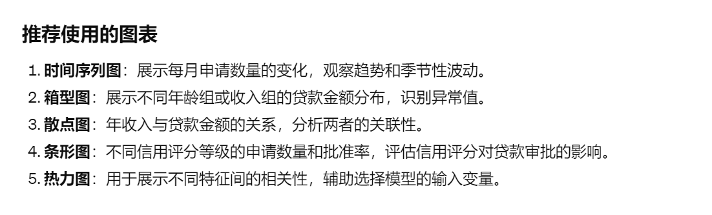

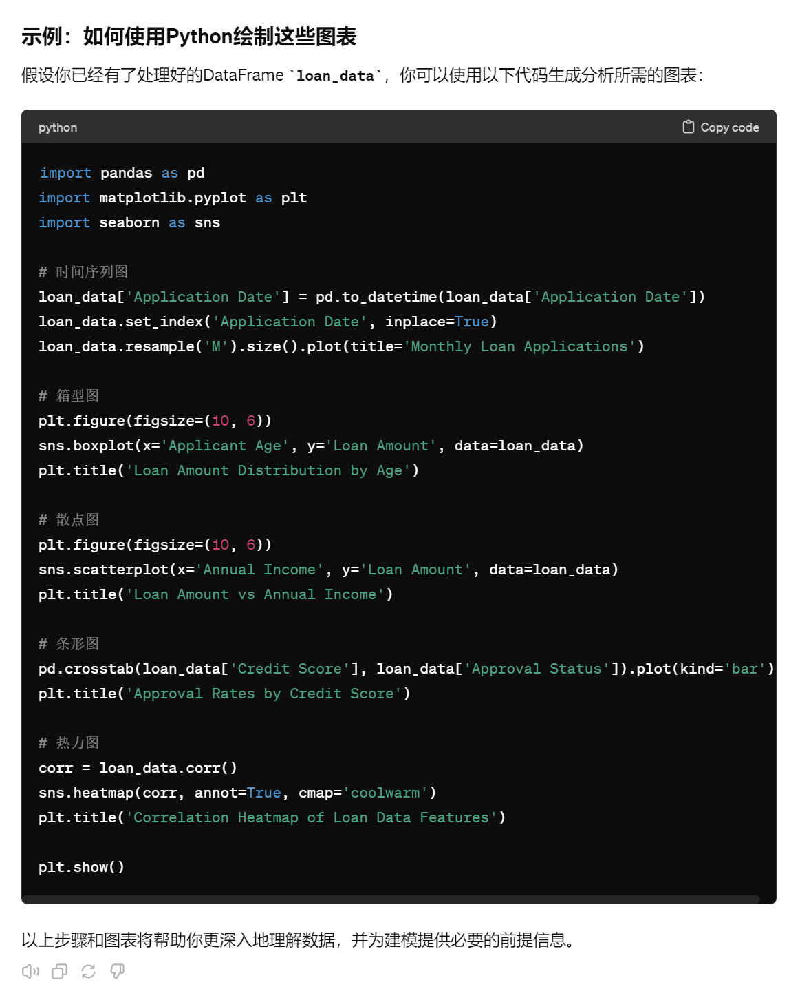

相信你和我一样对生成的结果不太满意，那么问题在哪里呢？

在这里我想请你关注几个学习数据分析的重点内容：

- 由于在数据提取时，我们没有明确指出核心指标，你发现需要加入新的指标，都会导致提取的数据不会全部被使用。
- 不要被 ChatGPT 的建模术语吓倒，你要相信 ChatGPT 自己就能扮演一名专业的数据分析师，遇到不懂的术语和概念大胆的让 ChatGPT 为你解释，这正是学习的好机会。
- 如果输出的图表（或结论）太多，意味着你的问题不够明确，比如我的输出结果，ChatGPT 提供给了我非常多的选择。这时你可以追加问题背景、详细需求和核心，让 ChatGPT 给你更少的选择项。
- 提供代码，由于结论太分散，导致代码的可用性也大大降低，你需要追加要求让 ChatGPT 生成 1-2 种图表，来帮你分析。

## 结果呈现

我修改一下提示词，改为：“进件分析是对渠道、质量以及后续转化情况的分析，为银行对获客营销行为提供建议。请你按照月度进件量重新回答 所需字段、图表以及 Python 代码”

调整提示词后，我们得到如下的结果：

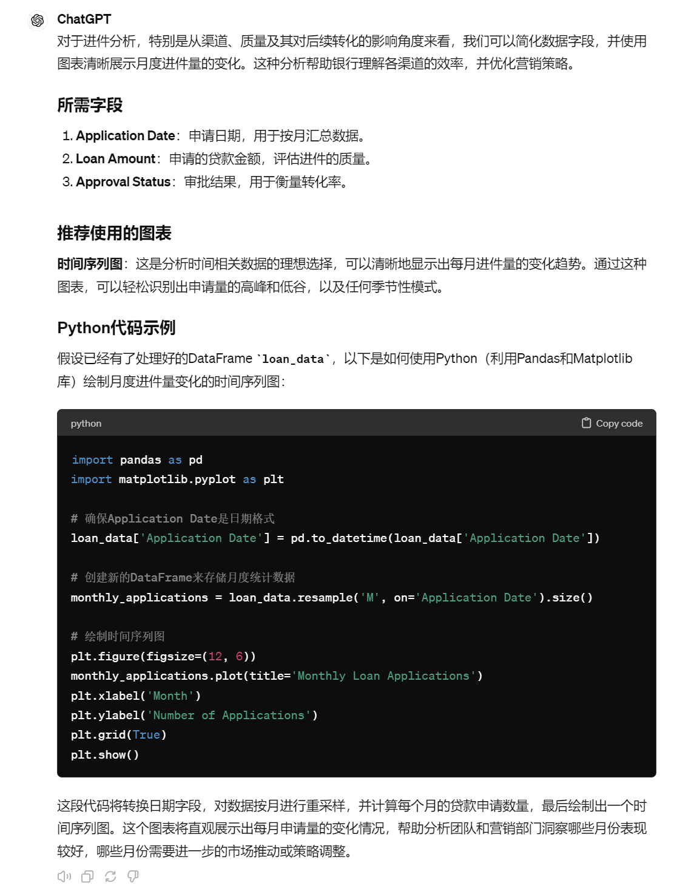

如果你使用的 ChatGPT4，可以直接让 ChatGPT 为你展示执行结果，如果是 ChatGPT3.5，你可以在本地运行，展示绘制出来的图表。我把图表也贴在下面供你参考。

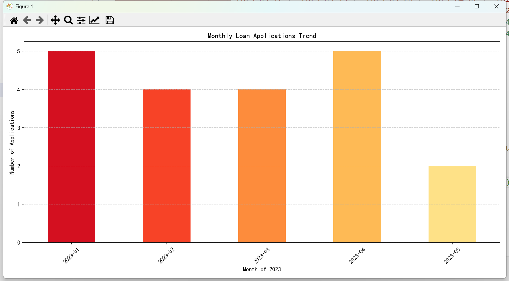

上面的结果是进件分析，相应的，用户画像你能提供有效的提示词吗？你可以先自己尝试一下，然后再来看我写的提示词，当然也可以在你的 ChatGPT 对话中使用，并优化，看看怎样对话让 ChatGPT 返回的效果更好。

我在请教了 ChatGPT 用户画像包含了哪些分类，每个分类包含哪些字段后，使用了如下提示词：

```
用户画像我希望分为客户基础信息和客群分布两个部分来建模，客户基础情况包含客户的年龄、性别、学历、行业等，
客群分布包含账单活跃情况、逾期风险等，请你先筛选各自合适的字段，为我列出所需字段，推荐一种图表，以及列出 Python 代码
通过对不同客户群体进行分层划分，以便企业可以更好地理解目标客户并针对其需求和偏好制定更有效的营销策略
```

ChatGPT 同样给我返回了详细的建模信息和代码。我将重点的内容附在下方，重复的内容就不在这里继续展示给你了。

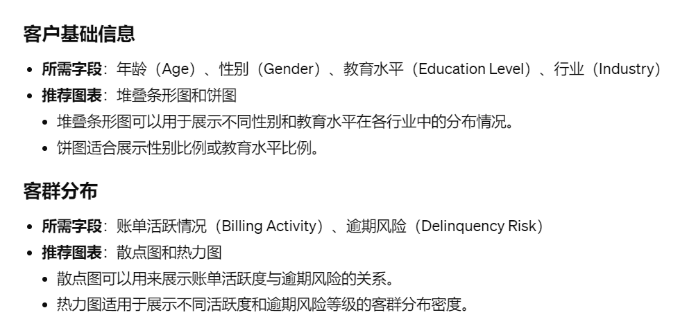

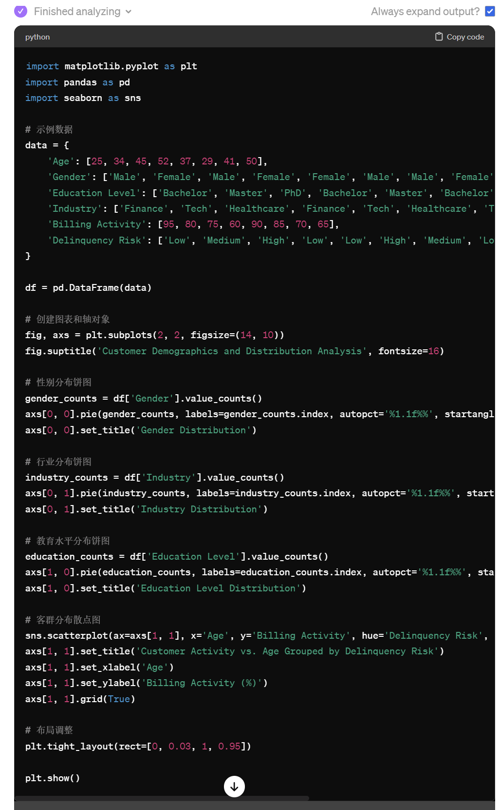

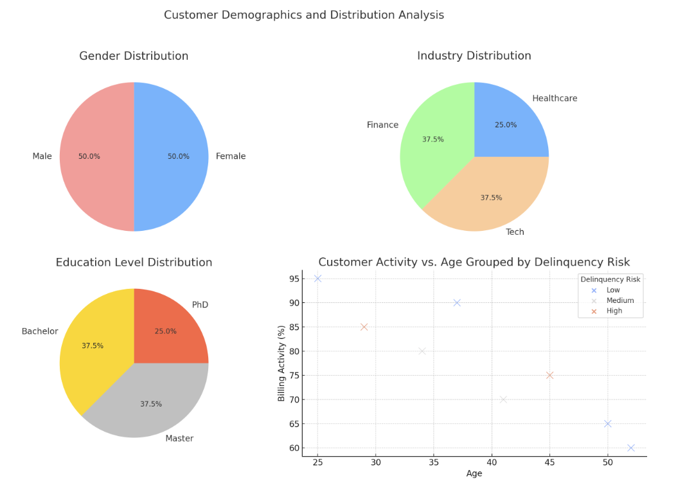

图表展示了性别、行业、教育水平的分布情况和客群活跃度与年龄及逾期风险的关联。这种视觉展示可以帮助深入理解客户群体的特征和行为，为制定有效的市场策略和风险管理措施提供支持。

根据先前的讨论，您应该已经对在贷款中和贷款后阶段如何进行建模和结果呈现有了一定的理解。现在我将介绍一些核心指标，您可以利用这些指标继续练习，直至熟练掌握如何使用 ChatGPT 来关联指标与数据、生成图表及相应的代码。

比如：

- 贷款中期指标：包括主要的收入来源，如息费、分期收入、违约金、年费等。通过分析用户的消费偏好和活跃度，可以及时策划有效的营销活动。
- 用户转化率分析：从用户注册账号、填写信息、到贷款审批、首次贷款、用户活跃度及收入的各阶段转化情况。可以采用 3A3R 策略模型设计营销方案，并利用漏斗图直观展示。
- 消费交易分析：利用帕累托分析法研究用户的消费交易金额，识别交易额较大的主要商户。
- 未来分摊预测：使用热力图展示贷款后期的未来分摊情况，为设计新的分期产品提供数据支持。

通过这些练习，您将更深入地了解如何运用 ChatGPT 进行数据分析和结果呈现，进一步提升您的分析能力。

由于我们这一讲更关注全流程，所以我就不让 ChatGPT 继续美化图表样式了，你可以在练习过程中，对图表进行美化操作。

## 业务价值发现

在数据分析的最后阶段，即业务价值发现，我们集中精力将分析结果转化为对业务具有实际意义的见解和行动计划。这一阶段的关键是确保数据分析的成果能够对决策过程产生积极影响，从而优化流程、提高效率和盈利能力。

业务价值发现过程，你可以根据 ChatGPT 提供的每个关键数据结论自行汇总，当然也可以将结论一起提交给 ChatGPT，让 ChatGPT 给我们进行汇总。

在这里我带你看一下 ChatGPT 给我们回答的业务价值发现

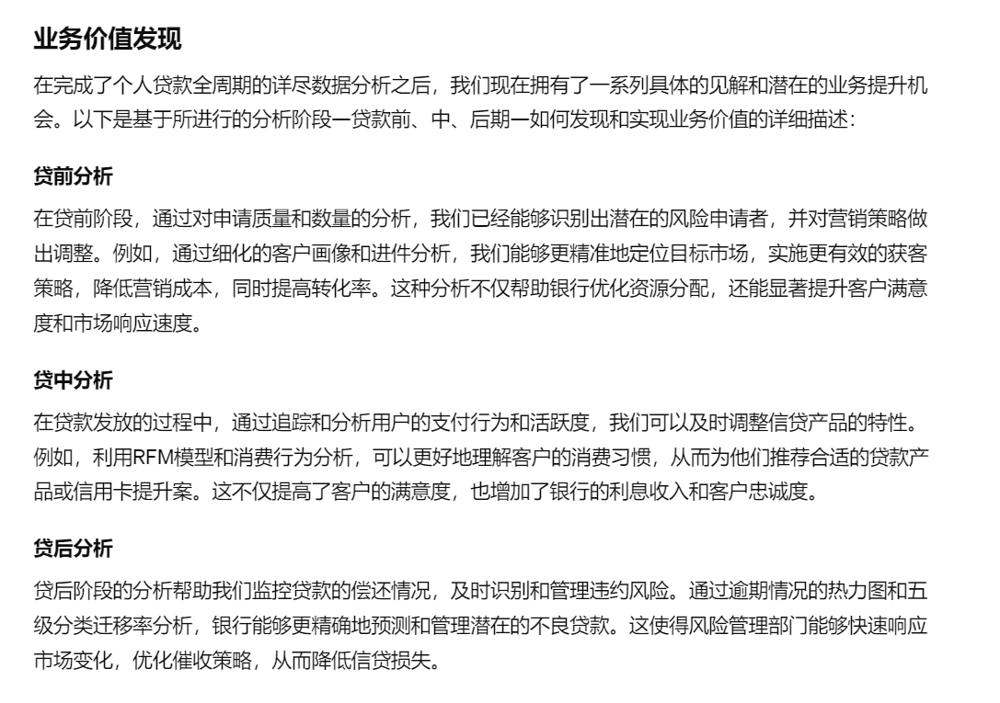

业务价值发现部分，不仅要说明数据分析如何支持业务决策，还要展示这些分析是如何转化为具体的业务优化措施。这部分内容应该清楚、具体，直接关联到分析结果和业务目标之间的桥梁，使决策者能够看到数据分析投入的直接回报。

所以这里的 ChatGPT 回复需要我们结合当前的市场前景，在 ChatGPT 编写的框架下，加以细化，形成数据更翔实、表格更丰富的数据报告。内容较长我也同样给你截取 ChatGPT 生成 PDF 的代码为你展示生成结果，供你参考。

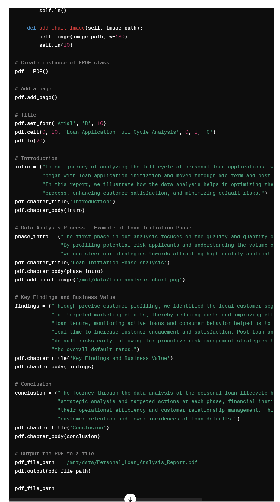

生成的 PDF 包含了我们需要的结论，我将其翻译成了英语版本，ChatGPT 也能够很好的支持这一功能。另外如果你担心讲述不够精彩，可以用上我们学习过的故事化展示技巧。丰富你的讲述过程。

## 总结复盘

今天我们继续深入探索了个人贷款的数据分析过程，特别是在建模、结果呈现及业务价值发现这三个关键阶段的应用。

通过建模，我们能够识别和利用核心指标，如客户的基础信息、行业分布和消费行为等，来优化贷款审批流程、提升客户满意度，并最终降低违约风险。结果呈现阶段不仅包括了数据的可视化，还包括了如何根据分析结果制定有效的营销策略和风险控制计划。

业务价值发现部分则是整个分析过程的高潮，我们通过故事化的方式将数据分析结果转化为具体的业务洞察，帮助决策者理解数据背后的业务意义，并作出更加有价值的决策。

加上前一讲，这两节课我们系统地走过了数据分析的完整流程。从数据获取、清洗、处理，到建模、结果呈现，再到业务价值的发现，每一个步骤都是为了最终的商业决策服务。

需要特别注意的是，在数据处理的流程中，你需要紧密围绕业务，一旦核心目标变化或者得不到有效数据支撑时，你要回到最开头的数据获取，丰富数据。这也是使用 ChatGPT 分析的优势，能够半自动甚至全自动地完成数据分析流程中的每个过程。

## 课后作业

假设你是一家银行的数据分析师，现在需要对新一季的贷款数据进行分析，目标是识别哪些因素最可能影响贷款的违约率。请设计一个分析方案，包括你将使用的数据字段、分析方法和预期的输出结果。此外，提出至少两种基于你的分析结果可能采取的策略来降低违约率。

---
来源：极客时间
链接：https://time.geekbang.org/column/article/782586
日期：2026-05-29
