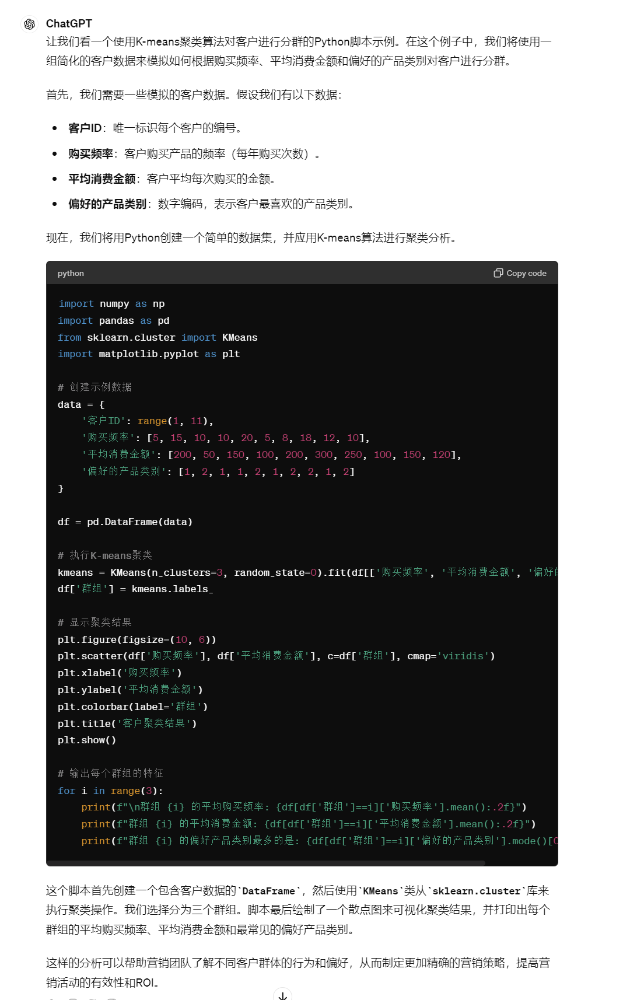
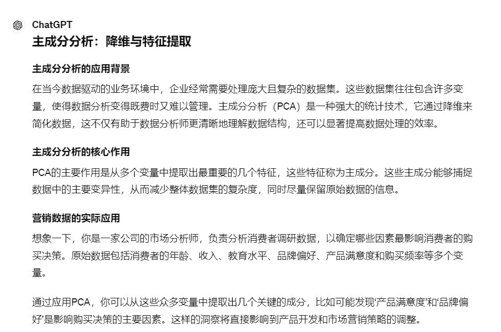
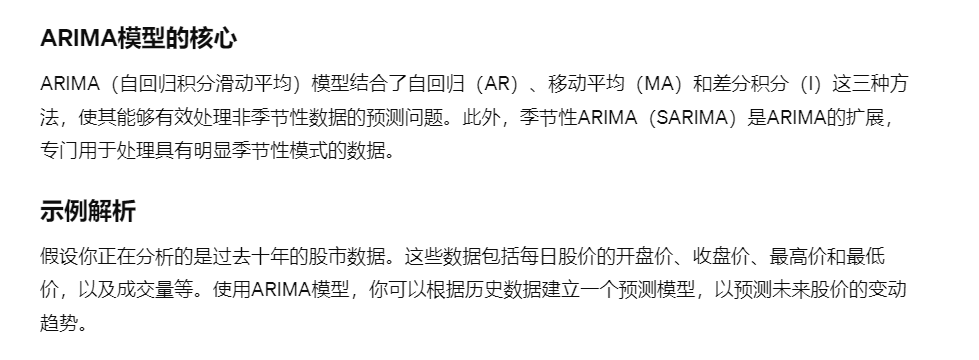
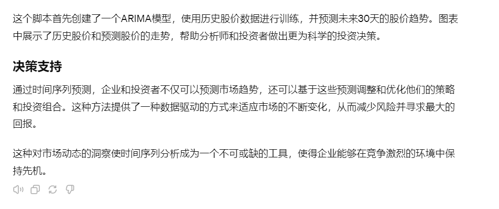

# 14｜预测与优化：ChatGPT在数据驱动决策中的综合应用（上）-AI数据分析课

点击“展开”查看“精华文字稿”

从这讲开始，我们进入一个新的模块：增强决策支持。数据驱动决策这个词咱都不陌生，我们做数据分析也是为了从数据中挖掘深刻洞察，让我们的决策科学有效，而不是全靠拍脑袋。课程设计了这个模块，就是要带你探索大模型在数据驱动的决策制定中可以发挥怎样的角色，看看怎样让大模型成为我们优化决策的得力助手。

我们会先用两讲一起来学习 ChatGPT 在数据驱动决策中的综合应用。今天这节课我们将一起探索一系列机器学习算法，包括**聚类、分类、回归**等，以及数据挖掘技术如关联规则挖掘和自然语言处理技术，比如**情感分析和语义分析**。

我希望能够帮你理解这些技术背后的原理，以及它们如何被应用于实际的商业决策中。我们还会通过具体的案例研究，看看其他企业是如何利用这些技术解决问题的，希望能给你带来启发。

## ChatGPT 在数据驱动决策中的角色

**数据不仅是信息的集合，更是关键决策的基石**。从数据到决策需要运用机器学习算法和大量的数据处理能力。具体来说帮你决策的常用算法有哪些呢？确实有很多，不过咱们也别贪多，先掌握这 5 个就可以了，能应用常见的业务场景。这 5 个算法分别是：聚类、分类、回归、主成分分析和时间序列预测，我们一一来看。

### 1. 聚类：客户分群优化

你可能已经听说过聚类算法，但可能不太清楚它在实际业务中是如何发挥作用的。让我带你一探究竟。

聚类算法，特别是 K-means 算法，是一种非常强大的数据分析工具，它可以帮助企业根据客户的购买行为、偏好和历史交易记录对客户进行分群。通过这种方式，企业可以发现哪些客户群体对其产品或服务的需求更高，从而有针对性地调整营销策略和优化产品推荐，提高客户满意度和转化率。

你还不清楚“满意度和转化率”这些指标也没关系，我们可以这样问 ChatGPT：

```
你是一个大型电商平台的数据分析师。
你的任务是帮助公司更好地了解其客户基础，以便更有效地推广产品。
你有大量的客户数据，包括购买频率、平均消费金额和偏好的产品类别等。
使用 K-means 聚类算法，你可以将客户分为不同的群体，比如“高价值客户”、“潜在客户”和“低价值客户”。
为我提供 Python 脚本示例
```

ChatGPT 做如下回答



你可以继续增加聚类算法和数据决策之间的因果关系，在下面继续提问“聚类分析和数据决策有哪些直接关系？”会得到下面的回复：

```
通过这种聚类分析，电商平台不仅能提高每次营销活动的 ROI（投资回报率），
还能显著提升客户忠诚度，因为营销信息和产品推荐都变得更加个性化了。
这就是聚类算法如何帮助企业在复杂的市场环境中做出更明智的决策。
这个过程不仅提升了决策的科学性，还增加了企业操作的灵活性和市场适应能力，
使企业能够更好地满足客户需求，从而在激烈的市场竞争中保持优势。
这正是数据驱动决策的力量所在，也是我们利用 ChatGPT 及其数据分析能力可以达到的效果。
```

虽然有点言过其实，但是你要理解只靠聚类一种算法是没办法得到有效的公司决策的。那么我们继续来学习其他算法，你需要根据实际情况，结合起来使用才能推动数据决策的有效性。接下来我们继续来看分类算法。

### 2. 分类：信用评分模型减少信贷风险

你肯定听过这句话：“物以类聚、人以群分”，那么分类算法就是按照不同的族群进行类别划分的。你可能会疑惑，这个“物以类聚”不也是为了分类的吗？为啥要弄出两种算法出来呢？这其实涉及到一个技术概念，叫做监督学习和非监督学习。

监督学习用通俗易懂的话来说，就是我先提供一大堆分好类的样本，来训练出一个模型，用这个模型给未来的数据进行分类。我们即将要讲的分类算法，就是监督学习。而前面的聚类算法是不需要提前进行训练的，所以属于非监督学习。不知道我这样解释分类和聚类算法你是否能理解。如果你还是觉得比较深奥，可以请教 ChatGPT，让它为你多举几个例子来体会一下两种算法的技术差别。

分类算法的典型应用是在金融领域，特别是银行和信用机构中，准确评估贷款申请者的信用等级至关重要。信用评分模型是这里的关键工具，它使用分类算法将申请者基于其信用历史、收入状况和职业稳定性等因素分级。这不仅有助于银行管理风险，还确保了信贷市场的稳健运行。

**数据细节和分类的意义**

在构建信用评分模型时，银行通常会考虑以下几个关键数据点：

- 信用历史：包括申请者的借贷记录、还款及逾期情况。这是评估他们未来行为的一个重要指标。
- 年收入：申请者的年收入反映了其偿还贷款的能力。
- 就业状态：职业稳定性是信用评估中的一个重要考量，稳定的职业通常意味着稳定的收入源。

通过将这些数据输入到分类模型中，银行可以将申请者分为“低风险”、“中等风险”和“高风险”等级。使用决策树、支持向量机或随机森林等算法，模型可以学习历史数据中的模式，然后对新的贷款申请者进行准确分类。

接下来，我让 ChatGPT 为我展示一个例子用 Python 写一个分类算法并说明它与数据决策的关系，这是 ChatGPT 提供的一个使用随机森林分类算法的 Python 脚本，模拟信用评分的过程：

```
import pandas as pd
from sklearn.ensemble import RandomForestClassifier
from sklearn.model_selection import train_test_split
from sklearn.metrics import classification_report
# 假设的数据集
data = {
'信用历史': [700, 550, 480, 620, 750],
'年收入': [50000, 40000, 30000, 45000, 80000],
'就业状态': [1, 0, 1, 0, 1],  # 1 表示稳定，0 表示不稳定
'信用等级': ['高', '中', '低', '中', '高']
}
df = pd.DataFrame(data)
# 数据预处理
X = df[['信用历史', '年收入', '就业状态']]
y = df['信用等级']
# 分割数据
X_train, X_test, y_train, y_test = train_test_split(X, y, test_size=0.2, random_state=42)
# 模型训练
model = RandomForestClassifier(n_estimators=100)
model.fit(X_train, y_train)
# 模型预测
predictions = model.predict(X_test)
# 输出结果
print(classification_report(y_test, predictions))
```

之后提供了一个与数据决策的关系描述：

```
决策价值
这种信用评分模型的决策价值在于它使银行能够基于科学的分析减少信贷风险。
正确的分类不仅帮助银行决定贷款批准与否，还可以合理设置贷款金额和利率。
更重要的是，这种精确的信用评估支持银行提供更个性化的金融服务，
提升客户满意度和市场竞争力。
通过对这些机器学习算法的探索和实际应用，
我们可以看到 ChatGPT 和相关技术在现代数据驱动决策中的重要作用。
这不仅仅是技术的展示，更是它们在真实世界中提供决策支持能力的证明。
```

从回答中，你看 ChatGPT 也渐入佳境了，不再是套话，而是从更小的场景，有效阐述了分类算法对数据决策的意义。

我们来看第三种算法，回归算法，它是预测未来销售和市场需求的强大工具。

### 3. 回归：销售预测的实践应用

这次，我们先问 ChatGPT，让它给我们解释回归的重要性，看看能否进一步提高 ChatGPT 回答的准确性。

我的提问是：

```
请你继续扮演数据分析师，告诉我销售预测的重要性，以及如何使用回归分析进行销售的预测，并提供 Python 脚本
```

ChatGPT 做了如下的回答：

```
销售预测的重要性
在零售行业，精准的销售预测是供应链管理的核心，它直接影响到库存控制、资金流管理和营销策略的制定。通过预测未来的销售量，企业可以提前做好准备，避免过度库存和缺货的情况，从而优化运营效率和成本控制。
如何使用回归分析进行销售预测
回归分析能够帮助企业分析多种因素对销售结果的影响。例如，一个服装零售商希望了解季节变化、促销活动以及价格波动如何影响其产品的销量。通过搜集过往几年的销售数据，包括销售额、季节、促销活动的详情及商品价格，可以使用回归模型来预测未来某一时间段内的销售情况。
```

**Python 脚本示例**

下面是一个使用多元线性回归模型进行销售预测的 Python 脚本示例。假设我们有关于某服装零售商的历史销售数据，包括季节性影响、是否有促销以及产品价格等因素。

```
import pandas as pd
from sklearn.linear_model import LinearRegression
from sklearn.model_selection import train_test_split
from sklearn.metrics import mean_squared_error
# 示例数据
data = {
'季节': [1, 2, 3, 4],  # 1= 春季, 2= 夏季, 3= 秋季, 4= 冬季
'促销活动': [1, 0, 0, 1],  # 1= 有促销, 0= 无促销
'价格': [200, 150, 180, 210],
'销售量': [350, 460, 370, 480]
}
df = pd.DataFrame(data)
# 特征和标签
X = df[['季节', '促销活动', '价格']]
y = df['销售量']
# 分割数据集
X_train, X_test, y_train, y_test = train_test_split(X, y, test_size=0.25, random_state=0)
# 建立回归模型
model = LinearRegression()
model.fit(X_train, y_train)
# 预测销售量
predictions = model.predict(X_test)
print(f" 预测的销售量: {predictions}")
# 评估模型
mse = mean_squared_error(y_test, predictions)
print(f" 均方误差 (MSE): {mse}")
```

**决策价值**

对于服装零售商来说，了解不同季节、促销活动和价格调整如何影响销售量，可以使他们更好地计划生产和库存策略。例如，如果模型预测夏季销量会增加，零售商可以提前增加夏季产品的库存，并在春季末开始促销活动，以最大化销售和利润。

经过几轮对话后，ChatGPT 更像一位经验丰富的专注于数据决策的数据分析师了。

它告诉我们，通过回归分析这样的算法，企业不仅可以优化现有的销售策略，还能预测市场变化带来的影响，从而在竞争激烈的市场中占据有利位置。这正是回归分析在实际业务决策中的强大力量，也间接展示了 ChatGPT 及其数据分析能力在帮助企业制定数据驱动决策中的潜力。

接下来我们来看一下数据挖掘中经常用到的另一种算法，用于简化数据复杂性的算法，叫做主成分分析。

### 4. 主成分分析：降维与特征提取

首先我要先为你解释一下主成分分析，它不能直接为数据决策带来结论性建议和价值。在面对高维数据时，主成分分析（PCA）是一种有效的数据简化技术。通过即将为你展示的例子，你可以看到 PCA 如何帮助我们从多维数据中提取关键信息，并通过降维简化了复杂的数据结构。这种技术通常能帮助市场分析团队更快地识别出影响消费者决策的关键因素，从而更有针对性地制定营销策略和产品改进计划。这样的数据洞察是提高决策质量、优化营销活动和增强客户满意度的关键。进而推动数据决策。

那我们看看 ChatGPT 是如何来描述主成分分析的，它又会给我们一个什么样的案例呢？



让我们继续向 ChatGPT 提问，通过一个 Python 脚本看看如何使用 PCA 对市场调研数据进行降维处理：

```
import pandas as pd
from sklearn.decomposition import PCA
from sklearn.preprocessing import StandardScaler
import matplotlib.pyplot as plt
# 创建模拟数据
data = {
'年龄': [25, 45, 35, 33, 55],
'收入': [50000, 64000, 58000, 52000, 75000],
'教育水平': [2, 4, 3, 3, 4],  # 1= 高中以下，2= 高中，3= 本科，4= 研究生
'产品满意度': [4, 2, 5, 3, 4],  # 评分 1-5
'品牌偏好': [1, 3, 2, 1, 4]  # 品牌 1 至品牌 5
}
df = pd.DataFrame(data)
# 数据标准化
scaler = StandardScaler()
df_scaled = scaler.fit_transform(df)
# 应用 PCA
pca = PCA(n_components=2)  # 减少到 2 个主要成分
principal_components = pca.fit_transform(df_scaled)
principal_df = pd.DataFrame(data = principal_components, columns = ['主成分 1', '主成分 2'])
# 绘制 PCA 结果
plt.figure(figsize=(8, 6))
plt.scatter(principal_df['主成分 1'], principal_df['主成分 2'])
plt.xlabel('主成分 1')
plt.ylabel('主成分 2')
plt.title('PCA 结果可视化')
plt.grid(True)
plt.show()
# 输出主成分解释的方差百分比
print(" 各主成分解释的方差百分比：", pca.explained_variance_ratio_)
```

我简单解释一下代码，通过主成分分析（PCA），我们得到了两个主成分，这两个主成分捕捉了数据的主要变异性。

主成分 1 解释了约 77.11% 的方差，而主成分 2 解释了约 20.85% 的方差。这表明大部分信息都集中在这两个成分中，你可以这样与 ChatGPT 继续对话“请你输出每个变量在两个主成分上的载荷，帮助我们更好地理解这些主成分与原始数据的关系。”

根据载荷值的正负和大小，我们可以解释每个主成分背后可能代表的意义。例如，如果’收入’和’教育水平’在第一个主成分上有高正载荷，这可能表明第一个主成分代表了经济和教育水平的综合影响因素。

如果你暂时还无法理解这个算法，也不用担心，只需知道，如果描述的字段过多，而你觉得他们都影响着最终的数据决策，又不想计算和展示结果过于复杂，可以让 ChatGPT 使用主成分分析来为你简化，当然了在你需要深入数据分析时，还是要在未来掌握主成分分析的。

接下来，我来带你学习最后一个算法，时间序列预测。

### 5. 时间序列预测：市场趋势分析

时间序列预测不仅是金融行业的核心工具，也广泛应用于零售、制造业、公共政策等多个领域。特别是在动态市场中，能够预测未来的市场走势对于企业决策具有至关重要的作用。

这次我们让 ChatGPT 担任投资公司的数据分析师，负责监控和预测股市的动态。

这个任务在波动的市场环境中尤为关键，因为即使是微小的市场变动也可能对投资组合造成巨大的影响。

为了提高预测的准确性，我决定让 ChatGPT 使用 ARIMA 模型来演示，这是一种广泛使用的时间序列预测方法。相比其他算法，你能更容易理解时间序列预测与数据决策的关系。



以下是一个 Python 脚本的示例，展示如何使用 ARIMA 模型进行股价预测：

```
import numpy as np
import pandas as pd
from statsmodels.tsa.arima.model import ARIMA
import matplotlib.pyplot as plt
# 假设 df 是包含股价历史数据的 DataFrame，其中'close'列是每日收盘价
# 这里仅为示意，实际数据需自行加载
data = np.random.randn(365) + np.linspace(0, 10, 365)  # 模拟数据
dates = pd.date_range(start='2020-01-01', periods=365)
df = pd.DataFrame(data, columns=['close'], index=dates)
# 建立 ARIMA 模型
model = ARIMA(df['close'], order=(5,1,0))  # 参数 order=(p,d,q) 需根据数据调整
model_fit = model.fit()
# 预测未来 30 天的股价
forecast = model_fit.forecast(steps=30)
# 绘制历史数据和预测数据
plt.figure(figsize=(12, 6))
plt.plot(df['close'], label='Historical Daily Closing Price')
plt.plot(pd.date_range(start=dates[-1], periods=31, freq='D')[1:], forecast, label='Forecast')
plt.title('Stock Price Forecast')
plt.xlabel('Date')
plt.ylabel('Price')
plt.legend()
plt.show()
```



## 总结复盘

在我们的讨论中，我们深入了解了五种关键的机器学习算法：聚类、分类、回归、主成分分析和时间序列预测。这些算法在数据驱动决策中起到了不可替代的作用，特别是在帮助企业理解市场动态、优化操作策略、预测未来趋势以及增强客户关系管理方面。

- 聚类：通过 K-means 等算法，企业能够将客户按照购买行为和偏好进行有效分组，从而为每个群体制定更加个性化的营销策略。
- 分类：使用如随机森林等强大的分类算法，企业可以对客户进行信用评分或预测其对新产品的接受程度，这对于风险管理和市场推广策略至关重要。
- 回归：回归分析帮助企业预测销量、需求等关键业务指标，依据历史数据和外部市场变量进行精确的量化预测。
- 主成分分析：PCA 作为一种数据降维技术，帮助企业从庞大的数据集中提取最有影响的特征，简化数据处理过程，提高分析效率。
- 时间序列预测：通过 ARIMA 等模型，企业能够预测股价走势、市场趋势等，为长期战略规划和短期操作决策提供数据支持。

这些算法的集成应用展现了数据科学在现代商业运营中的强大力量，能够帮助企业在竞争激烈的市场中保持优势，实现可持续发展。

## 课后作业

请你使用 ChatGPT 生成以下练习题的数据，并让 ChatGPT 自动完成分析任务。在完成任务后，你对任务的结论进行质疑，并观察 ChatGPT 的回复。

- 聚类应用：

- 数据集：包含 1000 个客户的数据，字段包括客户年龄、年收入和购买频率。
- 任务：使用 K-means 算法对客户进行分群，并解释结果如何帮助定制营销策略。

- 分类问题：

- 数据集：贷款申请数据，包括申请者的年收入、职业、信用历史等。
- 任务：构建一个分类模型预测贷款批准情况，并讨论模型如何帮助改进贷款审批流程。

- 回归分析：

- 数据集：某公司过去五年的月度销售数据，包括销售额、广告支出和市场活动。
- 任务：建立一个回归模型预测下一季度的销售额，并讨论如何利用预测结果调整营销策略。

- 主成分分析：

- 数据集：包含多个变量的消费者心理调研数据。
- 任务：应用 PCA 进行数据降维，并分析主成分如何帮助理解消费者行为。

- 时间序列预测：

- 数据集：最近十年的每月金融市场指数数据。
- 任务：使用时间序列分析预测下一年的市场走势，并讨论其对投资决策的潜在影响。

---
来源：极客时间
链接：https://time.geekbang.org/column/article/782752
日期：2026-05-29
