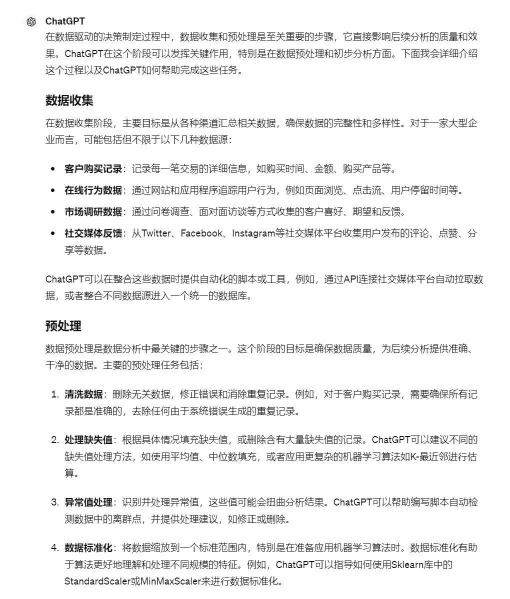
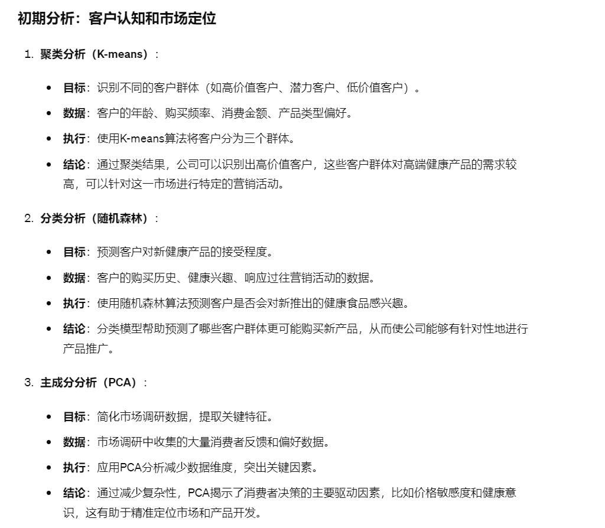
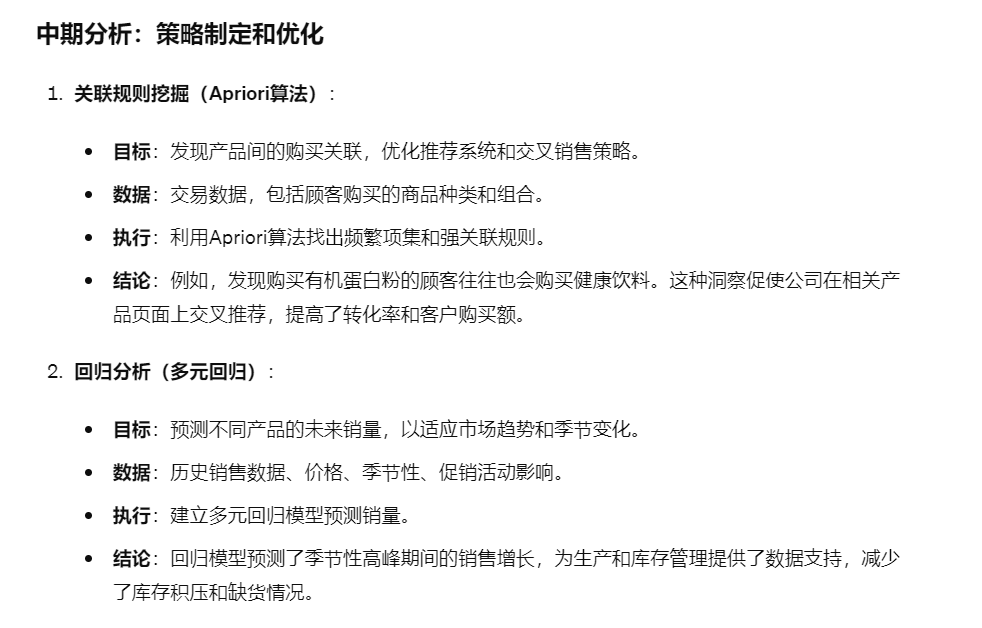
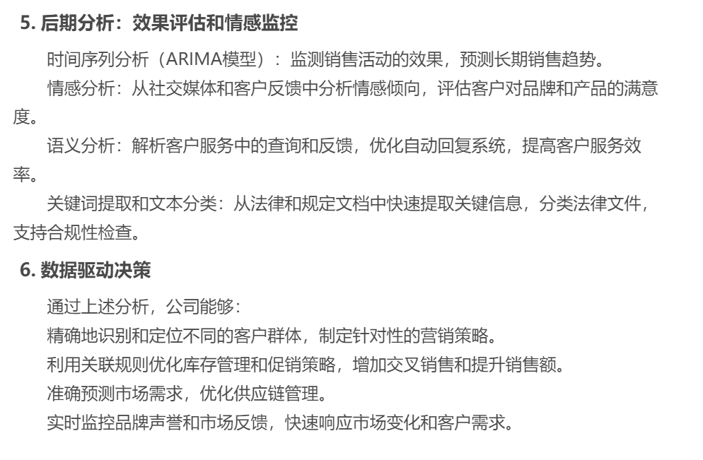

# 15｜预测与优化：ChatGPT在数据驱动决策中的综合应用（下）-AI数据分析课

点击“展开”查看“精华文字稿”

今天，我们将继续探讨数据挖掘技术与 ChatGPT 的结合，一起来看怎样进一步提升企业的数据理解和处理能力。

我们将详细解析关联规则挖掘、情感分析、语义分析以及关键词提取和文本分类等技术，展示它们如何从庞大的非结构化数据中提取有价值的洞见。

## 1. 关联规则挖掘

关联规则挖掘是数据挖掘中的一种重要技术，用于发现大数据集中变量间的有意义的联系。通过这种技术，企业可以识别出客户购买行为之间的模式和关联，例如，顾客购买某一产品时经常会同时购买哪些其他产品。这对于零售商来说尤为重要，它可以帮助他们进行有效的产品放置和促销活动规划。ChatGPT 可以通过分析交易记录数据，自动生成这些关联规则，从而帮助企业制定更加精准的销售策略。

你一定想到了著名的啤酒和尿布的故事，那么我们就以在尿布页面上推荐婴儿湿巾，让 ChatGPT 给我们编写代码和回答一下关联规则挖掘怎样用于数据决策。

我提供给 ChatGPT 一组数据：

```
TransactionID  尿布  婴儿湿巾  婴儿奶粉  玩具
1              1     1       0    0
2              0     1       1    0
3              1     0       0    1
4              1     1       1    0
5              1     0       1    1
6              1     0       1    0
7              0     1       0    1
8              1     0       1    1
9              0     1       1    0
10             1     1       0    0
```

然后让 ChatGPT 生成关联规则 Python 代码：

```
import pandas as pd
import numpy as np
from mlxtend.frequent_patterns import apriori, association_rules
# 创建示例数据
data = {
'TransactionID': [1, 2, 3, 4, 5, 6, 7, 8, 9, 10],
'尿布': [1, 0, 1, 1, 1, 1, 0, 1, 0, 1],
'婴儿湿巾': [1, 1, 0, 1, 0, 0, 1, 0, 1, 1],
'婴儿奶粉': [0, 1, 0, 1, 1, 1, 0, 1, 1, 0],
'玩具': [0, 0, 1, 0, 1, 0, 1, 1, 0, 0]
}
df = pd.DataFrame(data).set_index('TransactionID')
# 应用 Apriori 算法
frequent_itemsets = apriori(df, min_support=0.3, use_colnames=True)
# 生成关联规则
rules = association_rules(frequent_itemsets, metric="confidence", min_threshold=0.7)
# 打印关联规则结果
print(rules[['antecedents', 'consequents', 'support', 'confidence', 'lift']])
```

让 ChatGPT 自动执行后，给我们提供的分析结论如下：

```
关联规则分析表明，尿布和婴儿湿巾经常一起购买（支持度高，提升度高）。
这可以指导电商平台在尿布页面推荐婴儿湿巾，增加交叉销售的机会。
通过这种智能的产品推荐策略，电商平台能够提高转化率和顾客满意度，从而提升营销 ROI。
```

也就是说这种策略的执行能够有效地利用数据分析结果，优化决策和提高市场竞争力。 ​

你可以修改我提供的示例数据，并让 ChatGPT 解读，看看随着数据的不断变化，ChatGPT 是否能敏锐的观察到多种产品之间的购买关系。

通过关联规则挖掘，我们能够揭示产品间的隐藏关系，从而制定更精确的市场策略。然而，了解顾客的购买习惯只是一部分；了解他们对品牌或产品的情感反应同样重要。这就是情感分析发挥作用的地方，它帮助企业洞察顾客的感受和态度，从而管理品牌声誉并优化客户服务。

## 2. 情感分析

情感分析，顾名思义，就是一种用来判定文本情绪倾向的技术。企业可以利用这项技术从客户反馈、社交媒体评论或其他文本数据中分析情绪倾向，评估市场情绪和客户满意度。例如，ChatGPT 可以分析推特或产品评论来识别消费者对新产品发布的反应，是否普遍积极或存在某些担忧。这种分析能够让企业及时调整市场策略，改进产品或服务。

我找来了一些评价示例数据，交给 ChatGPT 为我做情感分析，让我们一起来看看 ChatGPT 的表现。

```
评论 ID  评论内容
1      " 非常喜欢这个品牌的产品，质量好，服务也棒！"
2      " 很失望，产品质量差，不推荐。"
3      " 服务态度不错，但产品有待提高。"
4      " 完美，每次购物体验都很愉快！"
5      " 产品不错，但配送速度需要加快。"
```

我让 ChatGPT 按照正面、中性、负面为我提供分析代码和结论。ChatGPT 做如下输出：

```
import pandas as pd
from textblob import TextBlob
# 数据加载
data = {
'评论 ID': [1, 2, 3, 4, 5],
'评论内容': [
" 非常喜欢这个品牌的产品，质量好，服务也棒！",
" 很失望，产品质量差，不推荐。",
" 服务态度不错，但产品有待提高。",
" 完美，每次购物体验都很愉快！",
" 产品不错，但配送速度需要加快。"
]
}
df = pd.DataFrame(data)
# 情感分析
def analyze_sentiment(text):
analysis = TextBlob(text)
if analysis.sentiment.polarity > 0:
return '正面'
elif analysis.sentiment.polarity == 0:
return '中性'
else:
return '负面'
df['情感'] = df['评论内容'].apply(analyze_sentiment)
# 结果输出
print(df[['评论 ID', '评论内容', '情感']])
```

从这个数据中我们可以看到，负面评论主要集中在产品质量和配送速度上。这种洞察可以让企业能够针对性地改进产品质量和物流服务，从而提升顾客满意度和品牌形象，最终促进品牌忠诚度和销售增长。

这里我多说一点，这段 Python 代码利用了 TextBlob 库进行简单的情感分析，是一个很好的示例，展示了如何快速评估文本的情感倾向。TextBlob 库的优点在于它的易用性和对多种语言的基本支持，但它主要依赖于预先定义的词典和简单的算法，可能不会考虑上下文的复杂性，这在分析更细微的情绪表达时可能导致精度不足。

ChatGPT 在情感分析方面的表现通常比 TextBlob 好，尤其是当它结合更先进的模型 GPT-4 时，可以更准确地捕捉文本的情绪和语境。如果数据量小，实时性不需要太强，建议你直接使用使用 GPT-4 模型替代 TextBlob 库，ChatGPT 能够在更复杂的文本中理解情绪的细微差别，提供更为深入的情感分析。

最后再为你总结下情感分析的应用场景，其实非常广泛，除了咱们上面例子中的品牌声誉管理之外，它还常用于这些场景：

- 客户服务：自动分析客户询问和投诉的情绪，快速响应负面反馈。
- 产品分析：评估和比较客户对不同产品的情感反应，指导产品迭代和发展。
- 市场研究：通过分析公众对某一事件或新闻的情绪反应，把握市场动向和公众兴趣。

在掌握了情感分析之后，我们来看看语义分析，这是另一个强大的 NLP 工具。语义分析不仅仅关注文本的“情感”，更深入地理解文本的“意义”，它考察词汇之间的关系及其构成的语境。

## 3. 语义分析

语义分析技术，可以帮助企业解析复杂的客户指令、查询或反馈，从而提供更精确的客户服务。例如，在金融服务行业，ChatGPT 能够理解用户关于账户问题的查询，并提供正确的解答或引导用户完成交易。这种能力特别重要，因为它能够确保用户请求的准确理解，减少误解和提高客户满意度。

比如在金融领域客户有如下问题：

```
" 我想了解我的账户余额。"
" 请帮我查看上个月的所有交易记录。"
" 我能申请贷款吗？需要什么条件？"
```

ChatGPT 通常无法直接回答这些私有问题，它需要结合公司内部的数据，采用大模型与搜索技术相结合（RAG）技术提供用户的答案。

如果你目前正在从事软件开发工作，我也为你提供一个参考，你可以使用 Hugging Face 的 transformers 库来实现私有的问答系统。这种方式非常适合处理金融行业中的客户服务查询，因为它能理解并回答基于特定上下文的复杂问题。ChatGPT 在测试数据时，也表现出了强大的语义理解能力，但因为用户数据隐私等问题，我们没办法将如此私密的数据交由 ChatGPT 托管。

掌握了语义分析的强大功能之后，我们接下来会探讨文本挖掘技术如关键词提取和文本分类，看看这些技术如何进一步提升内容策略的精确度和效率，在内容营销和信息检索领域都有哪些应用。

## 4. 关键词提取和文本分类

关键词提取是从文本中识别最重要元素的过程，而文本分类则涉及将文本文件归入预定义的类别。通过 ChatGPT 的强大分析能力，企业可以自动提取文档、电子邮件或报告中的关键信息，并依据内容对其进行分类。这对于管理大量信息和快速检索特定数据非常有帮助。

比如，在法律行业，律师事务所常常需要处理大量的法律文件，这些文件包括合同、诉讼文件以及其他相关的法律文档。有了关键词提取和文本分类这样的技术，就可以极大地提高文档处理的效率和准确性，律师就可以将更多时间投入到案件策略制定和客户服务中。

我让 ChatGPT 为我编写一个与它进行互动的 Python 脚本，假设我们有一批简化的法律文件文本，看看怎么使用 Python 和自然语言处理库来自动提取关键词和分类这些文档。

结果如下：

```
import pandas as pd
from sklearn.feature_extraction.text import TfidfVectorizer
from sklearn.cluster import KMeans
# 模拟法律文件数据
data = {
'文档': [
" 合同协议关于房地产交易的详细规定 ",
" 诉讼文件涉及商业纠纷的法庭记录 ",
" 合同协议关于技术服务的供应合同 ",
" 法律咨询关于知识产权的保护 ",
" 诉讼文件涉及专利侵权的案件文件 "
]
}
df = pd.DataFrame(data)
# TF-IDF 向量化
vectorizer = TfidfVectorizer(stop_words='english')
X = vectorizer.fit_transform(df['文档'])
# K-means 聚类进行文本分类
kmeans = KMeans(n_clusters=2, random_state=0).fit(X)
df['类别'] = kmeans.labels_
# 显示分类结果
print(df)
# 关键词提取
print("\n 关键词:")
features = vectorizer.get_feature_names()
sorted_centroids = kmeans.cluster_centers_.argsort()[:, ::-1]
for i in range(2):
print(f"\n 类别 {i} 的顶部关键词:")
for ind in sorted_centroids[i, :3]:
print(f" - {features[ind]}")
```

我为你简单分析一下，这段代码首先使用 TF-IDF 方法对文本数据进行向量化处理，然后应用 K-means 算法对这些法律文档进行聚类，将其分为两类。例如，一类可能主要包含合同相关文档，而另一类包括诉讼相关文件。通过查看每个类别的关键词，律师可以快速识别出文档的主题和内容重点。

还有很多数据挖掘技术都能被应用与数据决策工作中，通过上面的 4 个场景，不难发现，数据挖掘工作，大部分可以通过与 ChatGPT 对话直接实现，而不需要再编写代码处理。

接下来，咱们就看一个综合案例，把前面学到的内容串讲一下。

## 综合案例：全周期健康产业营销策略优化

### 1. 背景

有一家大型健康产业公司，涉及健康食品、健身器材销售以及健康咨询服务。公司希望通过数据驱动的方法优化其营销策略，提高产品销量和市场占有率。你将决策如何利用多种数据分析技术全面分析和预测市场需求，优化营销策略，并最终提高客户满意度和公司收益。

### 2. 数据收集和预处理阶段

这部分的关键是要收集哪些数据，用于支持后面的各种分析，如果你还没有指标，可以让 ChatGPT 根据它的经验提供指标，我向 ChatGPT 提问后，得到以下的信息：



整理一下，可能包括但不限于以下几种数据源：

- 客户购买记录：记录每一笔交易的详细信息，如购买时间、金额、购买产品等。
- 在线行为数据：通过网站和应用程序追踪用户行为，例如页面浏览、点击流、用户停留时间等。
- 市场调研数据：通过问卷调查、面对面访谈等方式收集的客户喜好、期望和反馈。
- 社交媒体反馈：从社交媒体平台收集用户发布的评论、点赞、分享等数据。

这几项数据指标对数据决策有没有用呢？我现在可能不清楚，但是使用 ChatGPT 的好处就是，你可以让它“假装”经历过了数据收集阶段，直接进入分析阶段，那么我们可以让 ChatGPT 继续分析，看看能用上哪些我们介绍过的算法，又能得到什么信息呢？

### 3. 初期分析：客户认知和市场定位

我让 ChatGPT 为我提供分析目标、需要的数据、使用的算法和对我数据处理的结论。它做了如下输出。



我也将数据提供给你，你可以尝试与 ChatGPT 对话，让其生成相应的代码和结论。

**字段描述**

- 客户 ID：客户的唯一标识符。
- 年龄：客户的年龄。
- 年收入：客户的年收入。
- 购买频率：每年购买的次数。
- 平均消费金额：每次购买的平均金额。
- 偏好的产品类型：数字编码，表示客户偏好的产品类型（1- 健康食品，2- 健身器材，3- 健康咨询服务）。
- 最近一次购买：从上次购买到现在的天数。
- 客户忠诚度：基于历史购买数据评估的忠诚度指标。

[https://shimo.im/sheets/wV3VMxQXxgHZNjAy/MODOC/](https://shimo.im/sheets/wV3VMxQXxgHZNjAy/MODOC/) 《15 讲示例数据表》

根据结论，我们可以对客户群体是否为高价值客户，对高端健康产品的需求情况来制定营销策略，并且哪些客户群体更可能购买新产品，根据客户群体设置新产品的推送频率。通过 PCA 得到的结论，我们还可以根据用户的价格敏感度，来为新产品定价。

新产品销售一段时间之后，你要考虑是否要更换策略，比如季节交替是否要对库存、产品类型进行调整。

### 4. 中期分析：策略制定和优化



**字段描述**

- 产品 ID：产品的唯一标识符。
- 产品类别：1- 健康食品，2- 健身器材，3- 健康咨询服务。
- 季节性因素：产品销售的季节性影响。
- 上月销量：上个月的销量数据。
- 促销活动：是否有促销活动（1- 有，0- 无）。
- 交叉销售情况：与其他产品的交叉销售情况。
- 价格变动：与上月相比价格的变动情况。
- 预测销量：基于回归分析的销量预测值。

[https://shimo.im/sheets/wV3VMxQXxgHZNjAy/6giMj/](https://shimo.im/sheets/wV3VMxQXxgHZNjAy/6giMj/) 《15 讲示例数据表》

通过中期分析的结论，发现购买有机蛋白粉的顾客往往也会购买健康饮料，你可以在相关产品页面上交叉推荐，随着季节的变化，库存也要做相应的调整。

经过一段时间的销售之后，我们需要对用户的使用情况进行调研，那么我们需要用情感和语义分析，了解用户的使用情况。

### 5. 后期分析：效果评估和情感监控



**字段描述**

- 日期：销售数据记录日期。
- 产品 ID：产品的唯一标识符。
- 实际销量：实际的月销量数据。
- 预测销量：之前预测的销量。
- 客户反馈数：收集到的客户反馈数量。
- 正面情感比例：正面情感的百分比。
- 负面情感比例：负面情感的百分比。
- 市场趋势：基于时间序列分析的市场趋势指标。

[https://shimo.im/sheets/wV3VMxQXxgHZNjAy/NoK7y/](https://shimo.im/sheets/wV3VMxQXxgHZNjAy/NoK7y/) 《15 讲示例数据表》

后期，我们根据用户的评论，进行了情感分析，通过用户的反馈，可以帮助公司评估营销活动的长期影响，调整营销策略。而语义分析帮助客服快速响应客户查询，提升了客户服务的质量和效率。

### 6. 数据驱动决策

通过上述全面的分析，该健康产业公司能够达到以下几个关键目标：

- 精确客户定位与群体识别：通过聚类和分类算法，公司不仅识别出了不同的客户群体，例如高价值客户、潜力客户、低价值客户，还能根据这些信息制定更为精准的营销策略。
- 库存与促销策略优化：利用关联规则挖掘，公司优化了库存管理和交叉销售策略，通过精准的产品推荐和促销活动显著提升了销售额和客户的购买体验。
- 市场需求的准确预测：借助回归分析和时间序列预测，公司能够准确预测各类产品的市场需求，从而有效调整生产和库存计划，优化供应链管理。
- 实时品牌声誉监控与客户反馈分析：通过情感分析和语义分析技术，公司实时监控社交媒体和客户反馈，快速响应市场变化和客户需求，提升了客户服务质量和品牌形象。

## 总结复盘

最后带你复习一下今天讲到的四个关键技术：

- 关联规则挖掘：通过分析客户购买模式，企业能够发现不同产品之间的购买关系，支持智能的交叉销售和推荐系统的建立，从而增加销售额和客户满意度。
- 情感分析：分析社交媒体、客户反馈等数据源中的情绪倾向，帮助企业评估品牌声誉和客户满意度，及时调整市场策略和产品设计。
- 语义分析：通过深入理解文本内容和用户意图，企业可以优化客户服务，提供更准确的信息和支持，提高服务效率和客户体验。
- 关键词提取和文本分类：这些技术能够帮助企业从大量的文本数据中快速提取核心信息和进行自动化分类，尤其在法律、医疗和科研领域的应用极为广泛，有效地提高了数据处理的速度和精度。

今天我还给你提供了一个综合案例，探讨了如何将聚类、分类、回归、关联规则挖掘、情感分析等多种技术应用到一个大型健康产业公司的数据分析中。通过这种多技术的综合应用，希望能帮你找到做数据分析的体感。

## 课后作业

背景：你是一家全球化化妆品公司的市场分析师。公司希望通过分析在线客户评价来优化其产品线和市场推广策略。

数据：包含 10,000 条客户对不同化妆品的评价，每条评价都包括客户的情感倾向和具体评论内容。

任务：

- 使用情感分析技术，分析客户对各个产品的情感倾向，识别最受欢迎和最不受欢迎的产品。
- 利用关键词提取技术，从评论中提取关键词，找出消费者最关心的产品特性。
- 应用文本分类方法，将评论分为正面、中性和负面三类，进一步分析不同类别下消费者的关注点。

---
来源：极客时间
链接：https://time.geekbang.org/column/article/782768
日期：2026-05-29
