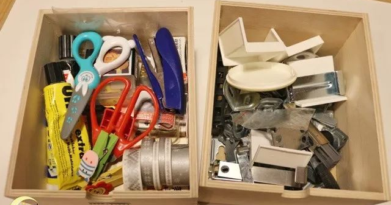
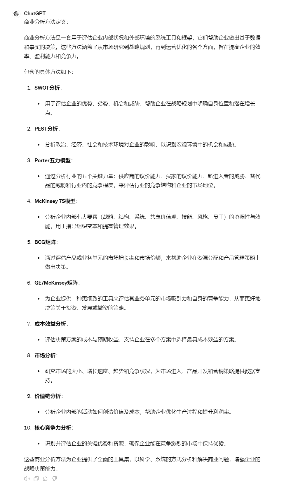
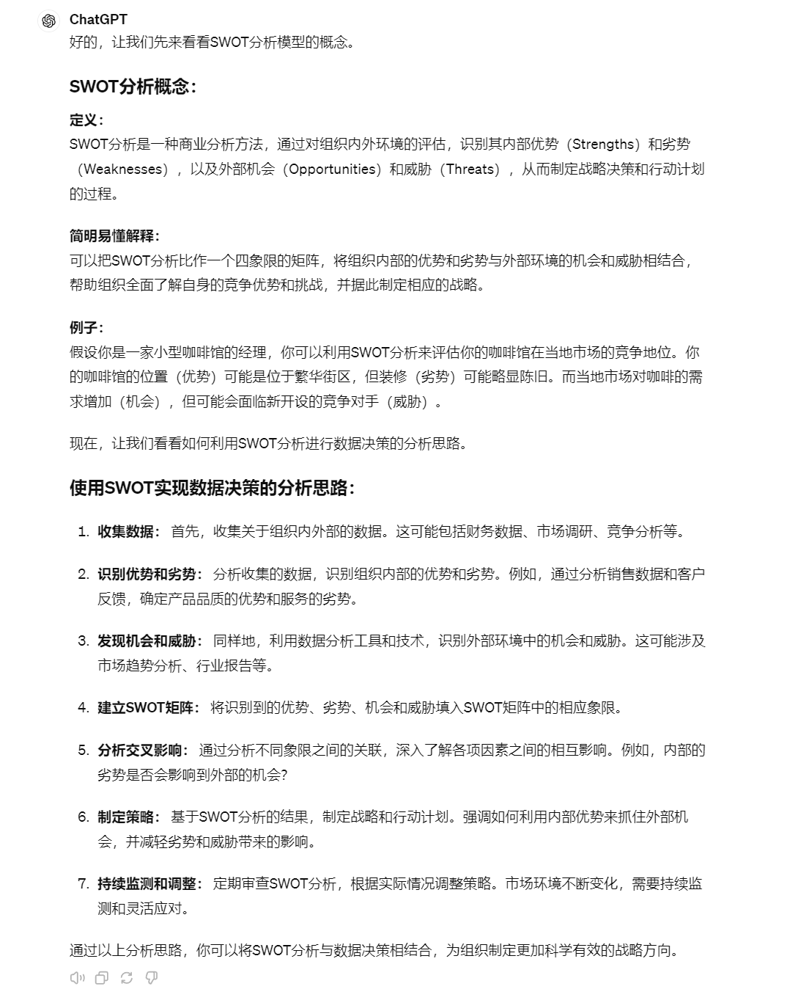
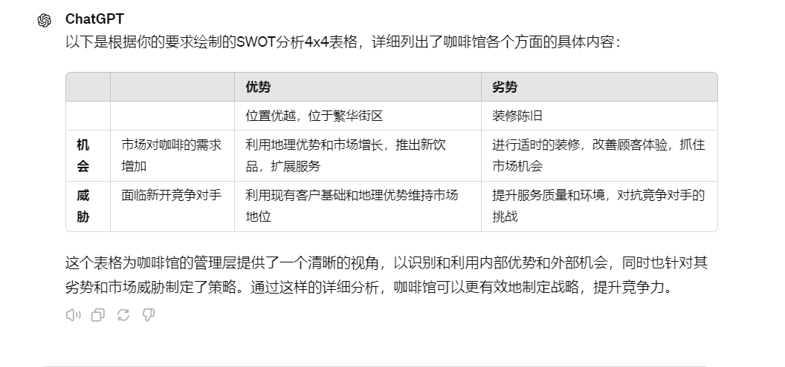
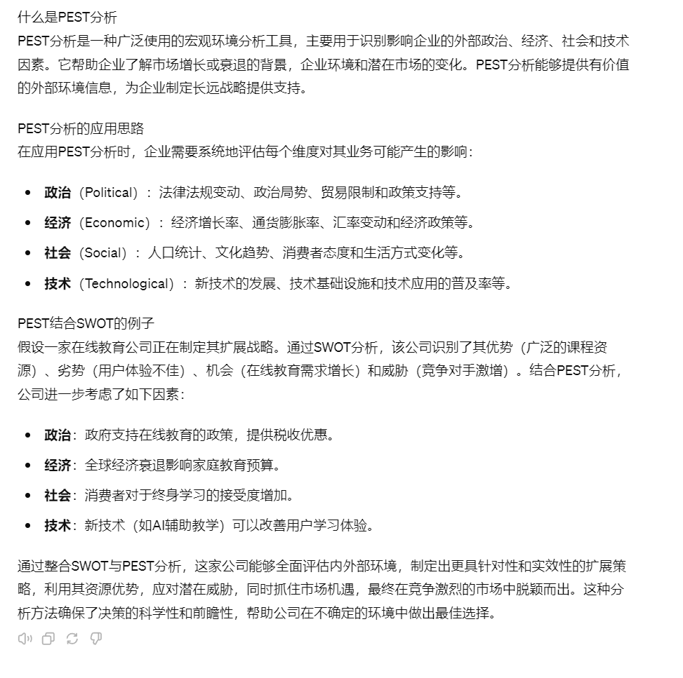
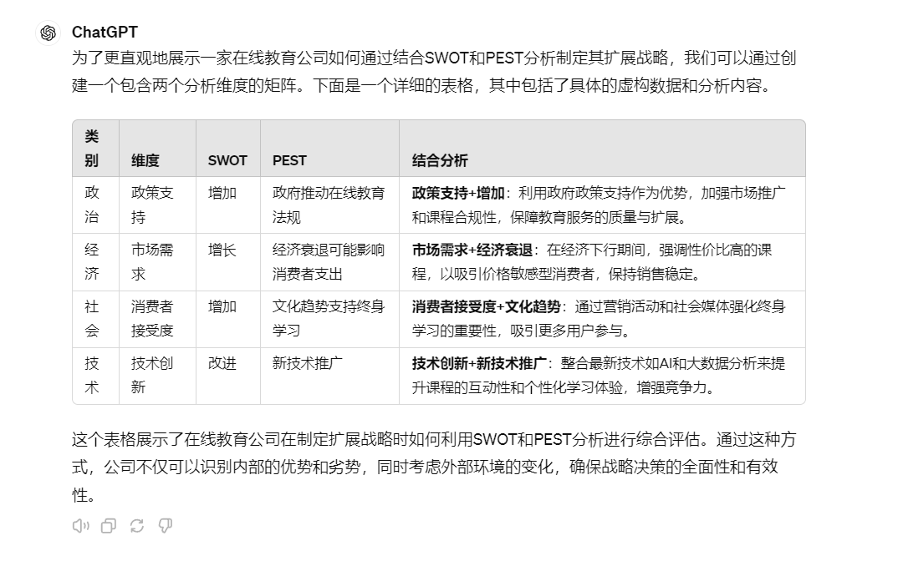
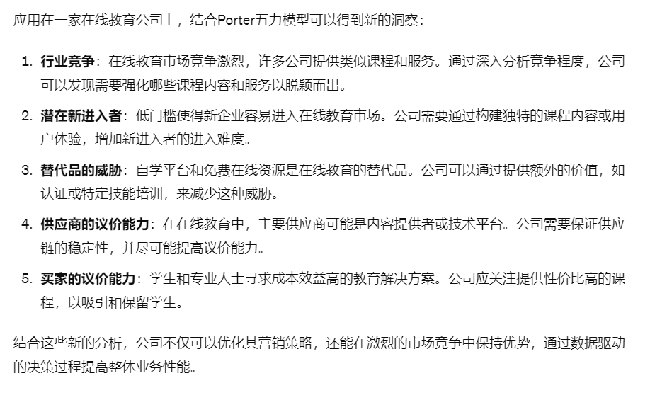

# 16｜战略咨询新伙伴：ChatGPT在SWOT与PEST分析中的实用性-AI数据分析课

点击“展开”查看“精华文字稿”

数据决策并非只能依赖内部业务数据的细节分析，还需高度重视外部宏观环境因素的影响。

比如这些年兴起的个人直播带货、口罩生产、大规模房地产投资等热门领域，虽然曾为企业创造了一定收益，但随着宏观形势转变，这些行业的红利期也随之结束。

那我们能不能先人一步，从宏观经济形势、政策法规变化、科技发展趋势、消费者需求转移等方方面面的变化动向，让 ChatGPT 帮我们进行一定的解读呢？

又有没有像机器学习的模型一样，能够根据某些有效的方法，来调整经营战略，抓住时机，避免决策失误带来损失呢？

那么今天，我们的视角就回到宏观方法上面来，我来带你学习常用的商业分析方法中的 SWOT、PEST 和 Porter 五力模型。

## 商业分析方法及其分类

商业分析也被称作战略分析，不管你是在做竞品分析还是制定企业未来发展方向，都需要一定的归纳整理，比如，你想比较两款剃须刀产品的好与坏，你不能想到什么就列出什么，要分门别类整理归纳，别人才能根据你的评价，得出有效结论。

我们所说的商业分析就是符合大多数人对商业的理解，归纳出来的通用方法，而这些方法也会按照不同的维度进行归纳总结，我经常举例说，你不能把你对产品的评价通通丢进一个抽屉里，你要给抽屉做好收纳格子，这样才能做出对比。




图片来自网络

商业分析方法就是收纳盒，那么商业分析方法怎么定义，又包含哪些可具体操作的方法呢？我们让 ChatGPT 先给我回答一下。



我们已经定义了商业分析方法，并准备了十种实用模型。其中，SWOT 分析和 PEST 分析是最通用的两种模型。接下来，我们将以这两个模型为例，演示如何利用 ChatGPT 进行 SWOT 和 PEST 分析。首先，我们将从 SWOT 分析开始。

## SWOT 分析模型

首先，我们还是让 ChatGPT 来教我们什么是 SWOT，以及 SWOT 怎么用。我编写下面的提示词：

```
你是数据分析专家，我需要你围绕着研究目的给出 SWOT 分析模型的概念，
以及使用 SWOT 实现数据决策的分析思路
```



ChatGPT 在这里准确地给出了 SWOT 的概念和分析思路。看了 ChatGPT 给我们的介绍，相信很多同学虽然没有套模版方式使用过 SWOT，但是多多少少都用到过其中的方法，就像上面提到的对比剃须刀的例子，我们都会对其优势、劣势进行归纳整理，之后选择一款价格最便宜的。

那是不是说明 SWOT 提供的是一套繁琐无效的收集工具呢？我觉得更多时候是许多人没有搞明白它的真正用法。就和咱们学习的机器学习的聚类分类算法一样，单靠一种算法能得到有效有力的决策依据吗？我认为多半是不可能的，所以进行宏观数据分析的时候，我们需要结合 SWOT 和后面介绍的 PEST 分析才能初见威力。有时候你还得结合 Porter 五力模型才能得到有效的结论。

现在呢，我们先不必着急，我们一个一个来掌握。我们先让 ChatGPT 先给我们一个 SWOT 的例子，加深一下对 SWOT 分析的理解吧。

我觉得 ChatGPT 给我们的例子就很好，我们就着这个例子，继续深入提问，把“偷懒”发挥到极致，让 ChatGPT 给我们绘制图表来完成分析吧。

我这样追问 ChatGPT：

```
用上面的例子，绘制 SWOT 4x4 表格，
第一行是 优势、弱点 第一列是 机会 威胁，
第二行、第二列分别列出单项内容，
交叉的表格列出组合内容
```

由于例子中没有包含丰富的数据，我们得到了一个格式正确但是内容空洞的分析结果。



这里需要你掌握的是，SWOT 不只是单项列出某个条件，而且还需要组合各种可行性方案。

还有我在前面提到的只靠 SWOT 没办法得出有效的决策，还要配合事情的轻重缓急、资源的多少、以及紧急程度等，进一步筛选出有效的策略，从其中挑选出最有价值的方案写入到你的执行计划里，要按照重要程度进行取舍。

咱们刚刚提到过，SWOT 分析经常和 PEST 分析搭配使用，实现 1+1 大于 2 的效果。通过 SWOT 分析内部优势与劣势以及外部机会与威胁，结合 PEST 分析政治、经济、社会、技术环境的外部因素，企业能更全面地了解环境背景与内部能力，做出更明智的战略决策。

## PEST 分析模型

和 SWOT 的逻辑一样，我们让 ChatGPT 回答我们什么是 PEST 分析模型，分析思路，以及和 SWOT 如何结合的。



同样的，我们让其通过图表方式绘制。



你看，将 SWOT 分析与 PEST 分析相结合，让分析的结果更“人性化”了。

例如，疫情期间，PEST 分析可以帮助我们洞察到卫生防疫用品和医药产品需求的激增，而科技领域的快速发展，如 AI 技术的广泛应用和 5G 的推广，也极大地推动了软件行业和短视频市场的变革。这些技术进步不仅改变了产品的设计理念，还影响了社会环境和人们的消费需求。通过这样的分析，企业能更准确地把握市场脉动和消费者趋势，从而在复杂多变的商业环境中制定出更有效的战略和决策。

虽然 SWOT 和 PEST 分析为企业提供了全面的内部优势劣势和外部机会威胁的视角，但这两种分析方法也存在一些盲点。首先，它们可能过于依赖现有数据，忽视了潜在的未来变化。其次，这些分析可能无法充分揭示行业内部的竞争结构和力量动态。此外，它们也可能不足以识别供应链中的潜在问题或新进入者的威胁，这些都是影响企业战略的关键因素。

## Porter 五力模型

为了补充 SWOT 和 PEST 分析的这些盲点，Porter 五力模型提供了一个有力的工具。Porter 五力模型，由迈克尔·波特教授提出，主要用于分析一个行业的吸引力和盈利潜力。该模型包括五个方面：行业内竞争者的竞争程度、潜在新进入者的威胁、替代品的威胁、供应商的议价能力和买家的议价能力。通过这些维度的分析，企业可以更深入地理解市场环境，制定更有效的竞争策略。

让我们继续上面的“在线教育公司如何通过结合 SWOT 和 PEST 分析制定其扩展战略”例子，加入 Porter 五力模型之后，我们看看 ChatGPT 为我们提供哪些新的启发：



结合 Porter 五力模型，我们得到了更具说服力的结论。从 ChatGPT 的结果不难看出，SWOT 更像是一种思维框架，而 PEST 对现状在框架上进行了补充和扩展，Porter 五力模型对威胁进行了进一步扩展。你可以将这些模型拿来直接得出结论，也可以用他们来训练你的思维，不断地发现问题、拆解问题、评估策略和重新发现问题，做一个循环迭代螺旋上升的思维训练模式。

## 总结复盘

最后我来为你总结一下这一讲，这节课我和你探讨了三种常见的商业分析方法 SWOT、PEST 和 Porter 五力模型，这些方法帮助企业从不同角度分析和解决问题，优化决策过程。

我们重点介绍了 SWOT 分析和 PEST 分析的基本概念和应用，它们能够帮助企业评估内部优势和劣势，以及外部机会和威胁。通过结合使用这两种方法，企业能更全面地理解其运营环境 Porter 五力模型作为补充，它是一种评估行业竞争强度的框架，帮助企业了解市场结构和竞争态势。

此外，你还可以像我学习 SWOT 分析方法一样利用 ChatGPT 掌握如 McKinsey 7S 模型、BCG 矩阵和 GE/McKinsey 矩阵进行企业内部分析和业务单元评估，以及如何运用成本效益分析、市场分析和价值链分析等方法来优化企业运营和增强核心竞争力。

虽然只介绍了三种分析方法， 但是你需要知道每种分析方法都有其独特的重点和适用场景，只有巧妙组合这些工具才能更好的帮助你精准地制定战略，应对市场变化，形成有效决策。

## 课后作业

设想你是一家中型制造企业的市场分析师，该企业正在考虑扩展其产品线。请使用 PEST 分析方法，针对可能的新市场进行分析，考虑政治、经济、社会和技术四个方面的因素，撰写一份报告概述每个因素可能如何影响企业的扩展计划。

---
来源：极客时间
链接：https://time.geekbang.org/column/article/785098
日期：2026-05-29
