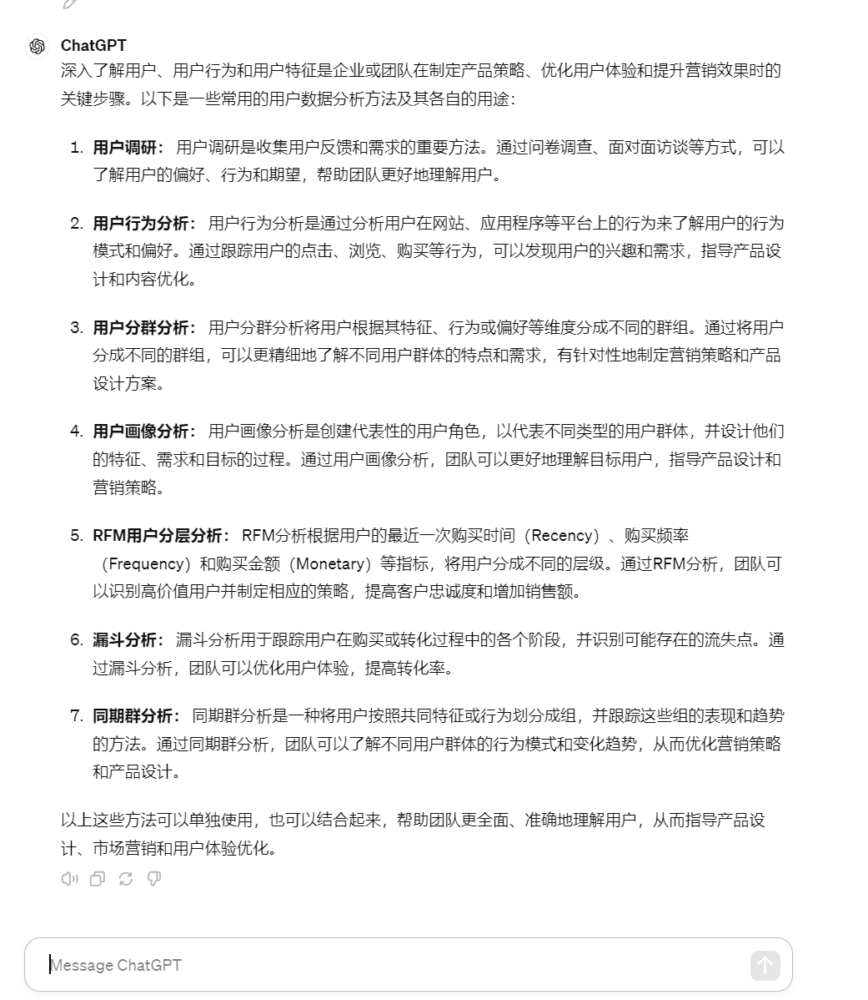
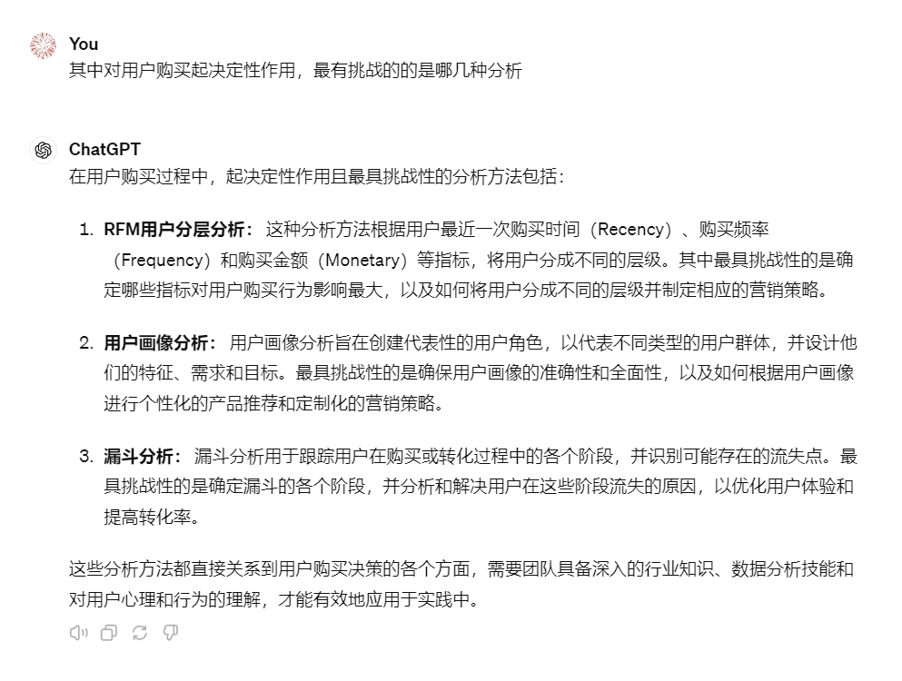
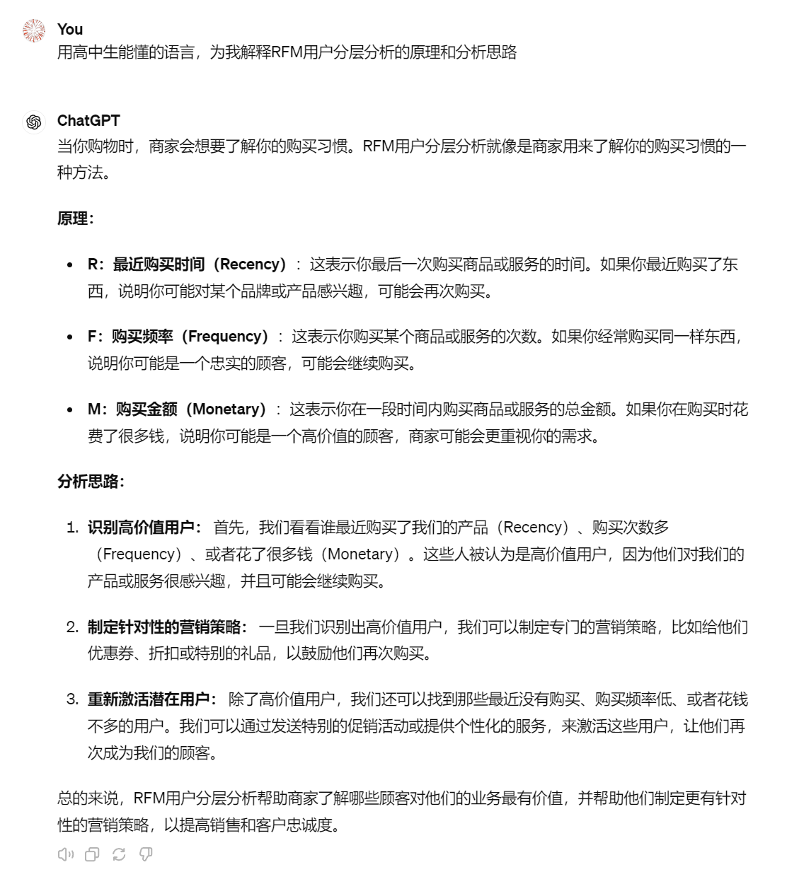
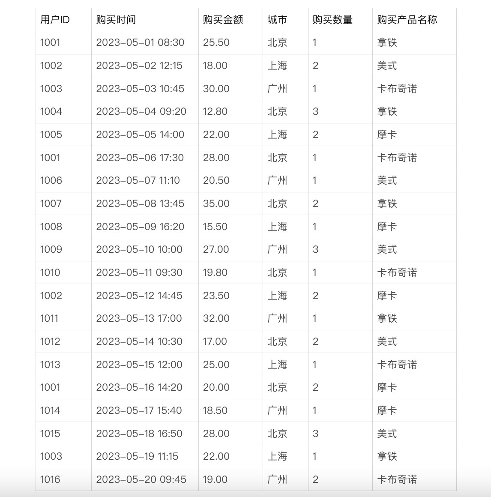
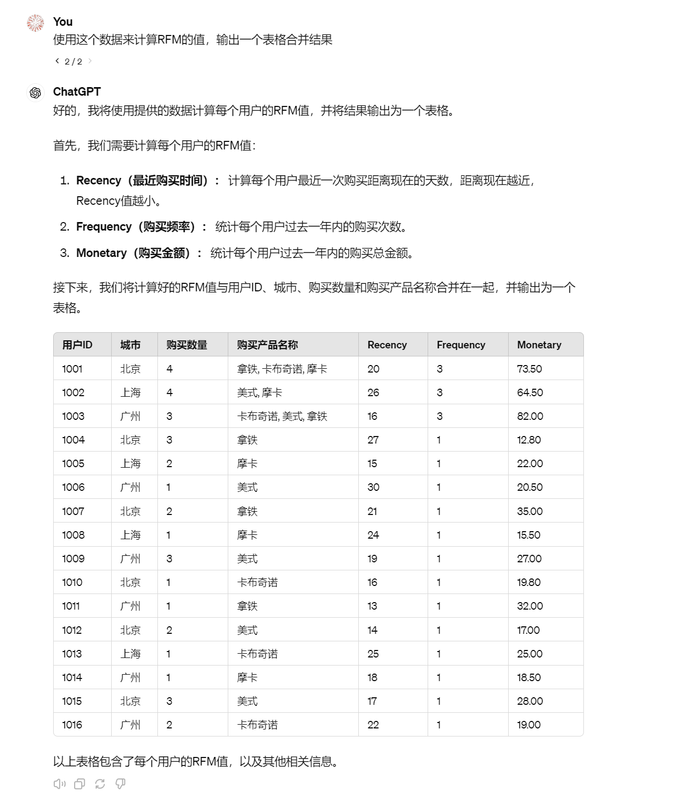
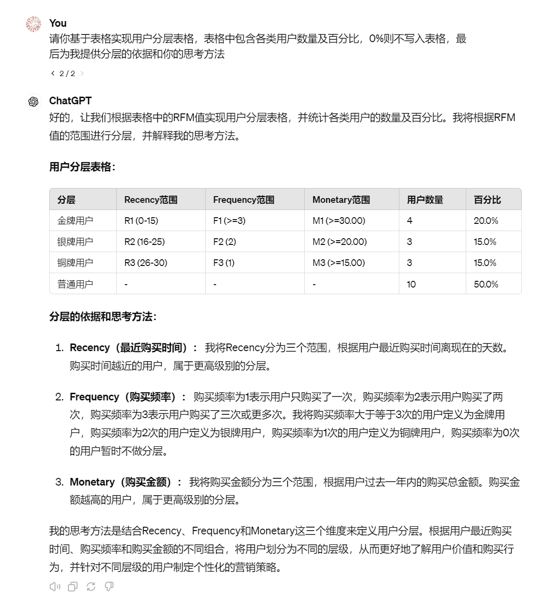
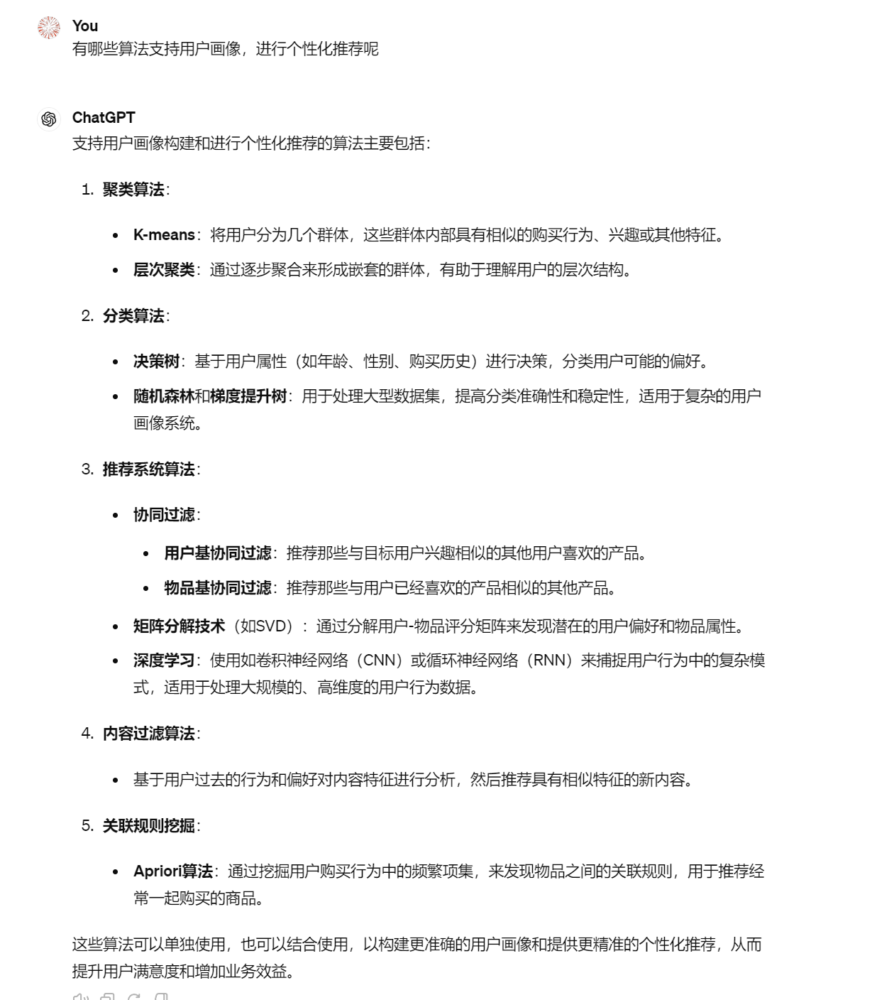
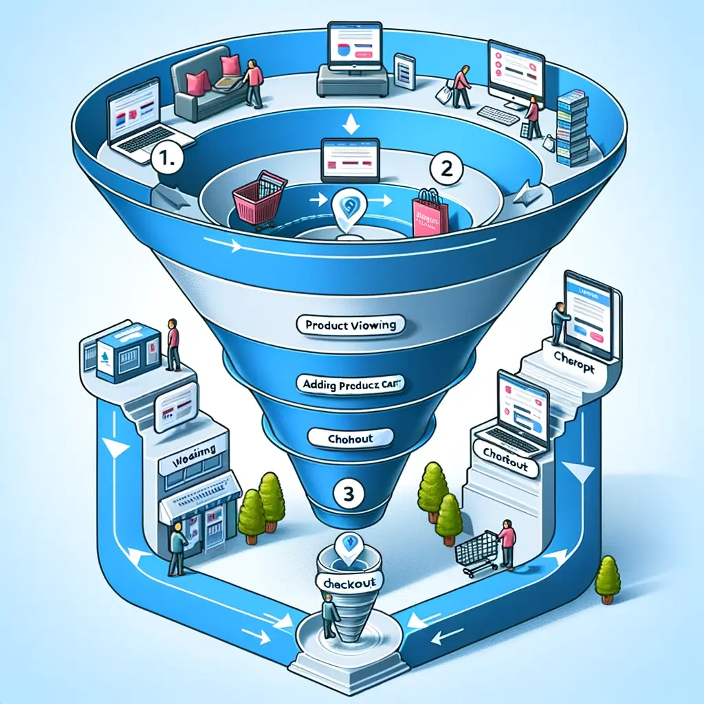

# 17｜用户洞察全面探索：ChatGPT在用户行为分析中的应用-AI数据分析课

点击“展开”查看“精华文字稿”

“站在用户的角度思考问题”，这句话你经常能听到吧？那么用户在想什么？在用户消费购买你的产品前，是由哪些因素来决定的？你的用户里，哪些用户会为你的产品买单？用户又对你的产品了解多少？

这一串问题问下来，大概会让你无从回答吧。但是你仔细思考后会发现，他们都建立在一个问题的基础上，那就是你对你的用户到底了解多少？

用户洞察就是深入了解用户、用户行为和用户特征，来指导企业或团队的决策和优化的有效方法，也有人把这种方法称为“用户研究方法”或“用户数据分析方法”。

这节课，我们就利用 ChatGPT 来学习如何通过用户画像、用户转化、用户分层来了解你的用户。

## 用户数据分析方法

按照惯例，我们还是向 ChatGPT 提问，用户数据分析方法包含哪些分析模型，咱们将最常见的模型学会，并掌握用 ChatGPT 自动帮我们完成分析的技巧。

首先我们还是为 ChatGPT 设定角色，之后询问它，如果我需要深入了解用户、用户行为和用户特征，有哪些常用的用户数据分析方法及各自的用途。

ChatGPT 为我们提供了 7 种分析方法，这回啊，我们改变一下提问的思路，让 ChatGPT 为我提供最能影响用户消费决策的和最具挑战的方法有哪些，我们来挑战一次高难度的分析，看看 ChatGPT 能否为我们提供满意的答案。

ChatGPT 为我们提供了 RFM 用户分层分析、用户画像分析、漏斗分析三种，这三种分析方法的挑战性最高，是高在数据清洗和算法上面，而这些都可以让 ChatGPT 为我们完成，所以你不必担心学不会。

## RFM 用户分层分析

越是抽象的概念，咱们越是可以让 ChatGPT 给我们简单化解决。比如第一个 RFM 分析，你就可以这样问 ChatGPT：

解释得很直白，但是你是不是和我一样有种感觉，明明每个字都认识，合在一起就不知道表达什么含义了呢？其实啊，这是因为 RFM 是一种计算过程，你只看定义当然不理解了。不过没关系，咱可以让 ChatGPT 给咱们举例说明， 我们继续追问它，让它举例给我们讲解。

首先我们让 ChatGPT 为我们制作一些用于计算的数据。

[https://shimo.im/sheets/5xkGoKPxwafOBBkX/MODOC/](https://shimo.im/sheets/5xkGoKPxwafOBBkX/MODOC/) 《17 讲示例数据表》

生成的表格包含了用户购买时间、金额和产品名称数量**，**接下来分别计算 R、F、M 的值。

最后，我们来对用户分层，这次仍然交给 ChatGPT 来完成。

ChatGPT 提供的结论基本上涵盖了对用户的分层，并提供了基于 RFM 值的合理划分。

但是站在从业者角度考虑，还存在一些优化空间。

- 细化分层标准：虽然现有的分层标准考虑了 Recency、Frequency 和 Monetary 三个维度，但仍有可能通过更详细的分层标准来提高精度。例如，你可以将 Recency、Frequency 和 Monetary 值的范围划分得更加精细，更准确地反映用户的行为特征。
- 考虑其他因素：除了 RFM 值外，还可以考虑其他因素对用户进行分层，比如用户的地理位置、购买历史、产品偏好等由于案例数据少，没有体现出这些因素造成的结论不同，实际使用时你应当将这些客观因素综合考虑进去，从而更准确地划分用户分层。
- 实时更新分层：用户的行为和特征可能随时间而变化，因此需要定期更新用户的分层信息。可以考虑保留 ChatGPT 当前的结论，数据更新是，对 ChatGPT 重新提供数据，让 ChatGPT 得到最新的结论，以确保分层信息的准确性和时效性。
- 测试和迭代：结论的有效性和可靠性必须要通过实际测试和反复验证来确认。可以将制定的个性化营销策略应用于不同分层的用户群体，并监测其效果。根据测试结果，可以对分层标准和策略进行迭代和优化，以实现更好的营销效果。

综上所述，虽然 ChatGPT 已经对用户进行了合理分层，并提供了相应的营销策略，但仍有优化空间。你需要提供更丰富的数据来细化分层标准、考虑更多因素、实时更新分层和测试迭代等方式，不断优化和改进结论。

在对用户进行 RFM 分析并制定个性化营销策略的过程中，我们已经初步了解了用户的消费行为和价值，并对用户进行了合理的分层。然而，为了更深入地了解用户、精准地进行营销定位，我们需要进一步构建用户画像，以全面、立体地展现用户的特征和行为习惯。

接下来，我们将深入探讨用户画像的构建方法和应用场景，以进一步提升我们的用户分析能力和营销效果。

## 用户画像分析

要确保用户画像能为决策提供支持，我们需要的不仅是数据的统计分析。例如，你在一个会议中向销售团队展示：“我们网站的用户男女比例是 3:7，主要年龄集中在 18-25 岁。”这样的数据虽然精确，但它只停留在描述性统计层面，并未深入到决策支持的实质。

销售团队对这样的数据报告反应冷淡，因为这个结论他们早就清楚了。用户画像的真正价值在于，它应该提供能够影响业务策略和操作的深刻见解，而不仅仅是数字的堆砌。我们需要从数据中提炼出能够驱动具体业务行动的信息。

将数据转化为可行动的洞察，意味着我们需要深入分析这些数据背后的业务含义，从而为具体策略提供依据。

比如说，如果你的用户画像显示大部分用户是 18 到 25 岁的年轻女性，这个信息本身虽然有用，但还不够。你需要进一步探索：这个年龄段的女性喜欢什么样的产品？她们的购物习惯是什么？她们在什么时间最活跃？通过回答这些问题，你可以调整营销活动的时段，选择更受她们欢迎的产品线进行推广，甚至调整广告内容来更好地与她们的兴趣和需求对接。

举个例子，如果分析发现这些年轻女性用户喜欢追求时尚且对相声感兴趣，那么你可以推出一系列相声类综艺插播广告。在社交媒体上的推广时段可以选择她们活跃的晚上或周末时段，用具有吸引力的视觉和信息突出你的产品理念。

这样的操作能使得用户画像不仅仅是一堆数据，而是变成了驱动产品选择、营销策略和客户沟通方式的实际工具。这才是用户画像应用到决策中的真正价值所在。

这时候，你肯定还会冒出一个问题，如果我想用用户画像分析进行个性化推荐，应该用什么算法呢？让我们问问 ChatGPT。

原来这些算法你大部分都学过，那就是我们之前讲过的聚类、分类、关联关系等。这些内容可能看起来各自独立，但实际上它们之间有着密切的联系。如你所见，各种数据分析技术和方法都不是孤立存在的；它们相互支持、相互补充。

你看，这不仅展示了知识体系的内在联系，也提醒我们在学习和应用时需要跨领域思考。掌握了这些算法之后，你就能将它们灵活运用到不同场景中，从而发挥出最大的业务价值。

接下来，我们将介绍另一个非常实用的商业分析工具——漏斗分析。漏斗分析帮助我们了解在从潜在客户到实际购买者的转化过程中，用户在哪个阶段最可能流失，从而优化营销策略和客户体验。

## 漏斗分析

漏斗分析作为一种可视化工具，它用于展示客户在完成特定目标（如购买产品、注册服务等）的过程中，从一个步骤到另一个步骤的转化率。通过这种分析，企业可以识别出潜在客户在转化过程中流失的关键环节，从而针对性地优化策略。

我仍然采用一个例子，为你说明漏斗分析的过程。

假设你经营一家在线书店，希望分析客户从浏览到购买的转化过程。漏斗的各个阶段可能包括：访问网站、查看商品、添加商品到购物车、结算、完成支付。通过漏斗分析，你发现虽然许多用户添加商品到购物车，但到了结算阶段却有大量流失。这种情况提示你可能需要简化结算流程或提供更多的支付选项，增加完成购买率。

有时候，通过一个漏斗，你可能没办法明显看出问题，这时候可以将一个大漏斗，根据业务特点拆分开，比如 iOS 付费渠道、Android 付费渠道分别制作加入购物车到付款的漏斗图，通过浏览器、App 分别制作漏斗分析登录到购买过程的漏斗图等。看看是否因为付款渠道、购买交互方式是否影响了购买率。

我们习惯将这种拆分称作多维度切分，一个完整的大漏斗给我们描述了趋势，切分后的漏斗给我们快速定位问题提供了有力的依据。

那么除了我提到的用户付费漏斗，还有哪些其他的典型应用场景呢，比如：

- 营销活动效果评估：分析营销活动吸引潜在客户、激发兴趣、促使行动的效率。
- 用户体验优化：识别并改善用户在应用或网站内可能遇到的障碍点。
- 服务流程改进：例如，改进在线申请服务的过程，减少用户在填写表单或上传文档时的流失。

而漏斗模型还能与用户画像和 RFM 模型的结合，深入理解不同类型客户的行为模式和偏好。

例如，你可以通过将用户画像中的具体属性（如年龄、性别、兴趣）与漏斗中的转化数据结合，可以发现哪些客户群体更可能完成购买。同时，RFM 模型的数据可以帮助识别高价值客户，在漏斗分析中针对这部分人群进行特定的优化措施，比如提供个性化优惠或忠诚度奖励。

## 总结复盘

这节课，我们深入探讨了如何通过数据分析技术优化商业决策和运营效率。具体来说，我们聚焦了 RFM 用户分层分析、用户画像分析、以及漏斗分析这三种核心方法。

- RFM 用户分层分析：这种方法帮助企业根据客户的最近购买时间、购买频率、和购买金额进行分层，从而能够识别出高价值客户。这对于定向营销和资源分配至关重要，因为它确保营销活动能够针对最有可能产生高回报的客户群体。
- 用户画像分析：通过综合考虑客户的多维度信息，如年龄、性别、消费习惯等，形成用户的全面画像。这不仅能帮助企业更好地了解其客户基础，而且能精准推送个性化的产品和服务，提升客户满意度和忠诚度。
- 漏斗分析：这是一种分析客户在购买过程中的行为模式的方法，能够揭示在从潜在客户到实际购买者转换过程中的不同阶段的丢失点。通过漏斗分析，企业可以发现并解决那些导致客户流失的关键问题，优化用户体验和购买流程。

## 课后作业

你是一家电子商务公司的数据分析师，公司主营服装销售。使用上述三种分析方法设计一个策略，帮助公司识别潜力客户、优化购物流程，并提高转化率。

你需要:

- 描述如何使用 RFM 模型来识别潜力客户。
- 利用用户画像分析确定目标客户群的特定需求。
- 应用漏斗分析找出购买流程中的主要丢失点，并提出改进建议。

---
来源：极客时间
链接：https://time.geekbang.org/column/article/785130
日期：2026-05-29
