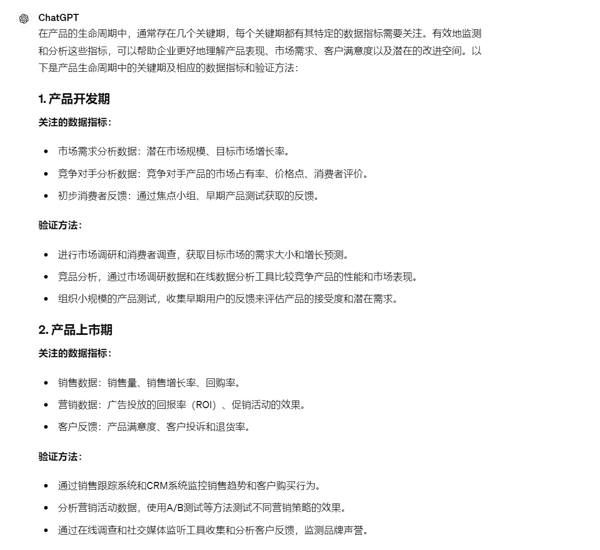
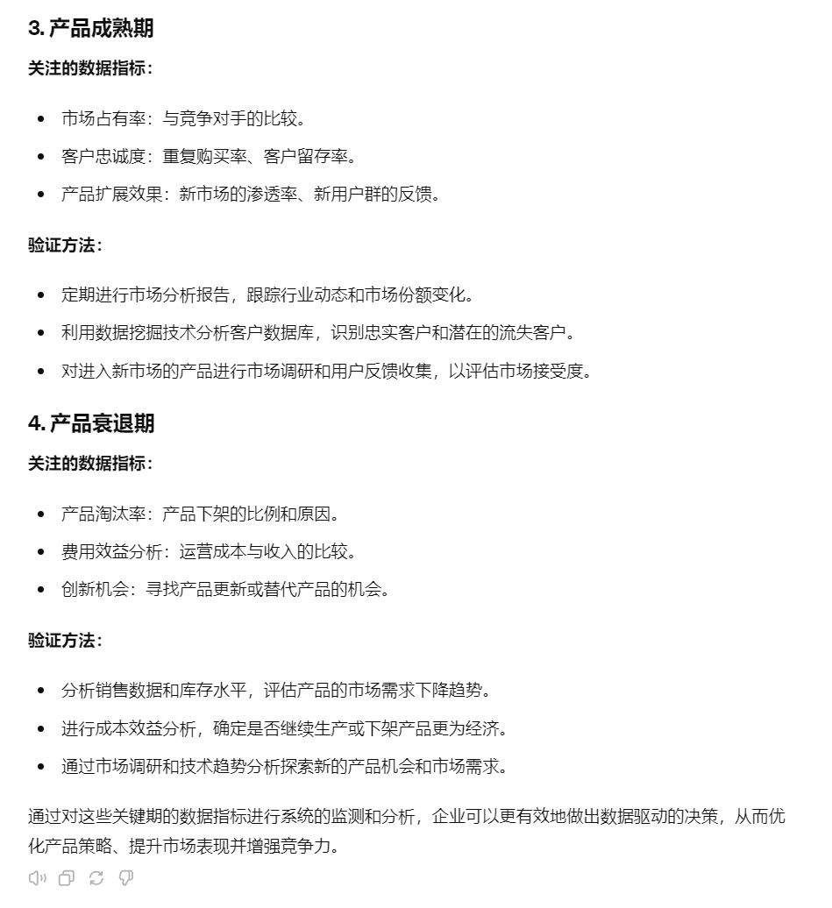
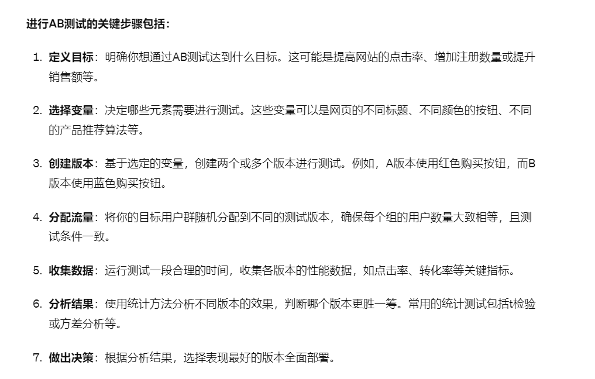
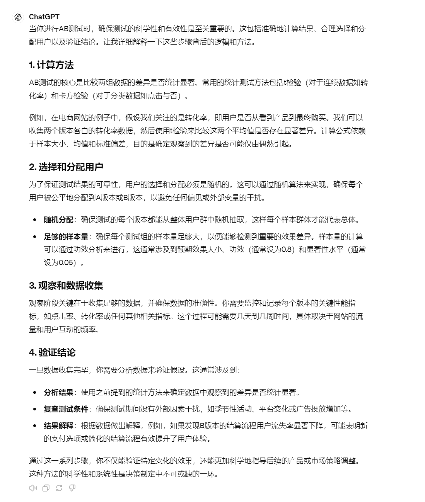

# 18｜数据驱动的产品策略：利用ChatGPT优化产品生命周期-AI数据分析课

点击“展开”查看“精华文字稿”

在产品策略与市场反馈分析中，ChatGPT 可以扮演关键角色，帮助企业从多个角度深入理解产品生命周期各阶段的性能与市场反响。这包括从产品开发初期的市场需求分析，到产品上市后的消费者反馈收集与分析，以及最终的产品迭代或淘汰决策。

这节课，我们就利用 ChatGPT 来为不同的产品周期提供关键指标和验证方法。

## 产品关键期有哪些

在产品的生命周期中，通常存在四个关键期，分别是产品开发期（研发期）、产品上市期（成长期）、产品成熟期、产品衰退期，每个关键期都可以设定指标来监测和分析产品效益。通过这些指标，可以帮助你更好地理解产品表现、市场需求、客户满意度以及潜在的改进空间。

同样的，我们首先先来询问 ChatGPT，产品生命周期中的关键期有哪些及相应的数据指标衡量方法：





显然，面对产品各个生命周期阶段时，我们需要采取不同的策略来应对市场的挑战和机会。比如，在产品开发期，我们重点要确保产品真正符合市场需求，并具有一定的竞争力。这时候，定位清晰、差异化显著的产品特征至关重要。我们可以通过深入的市场和竞品分析来确定我们的独特价值主张，同时，也要留意技术变革或消费者偏好可能带来的风险。

当产品正式上市，快速占领市场、提升品牌知名度就显得尤为重要了。我们可能需要通过吸引眼球的营销活动和适当的价格策略来吸引用户尝试。同时，对用户的反馈要迅速响应，及时调整产品，以满足用户的实际需求。

进入到产品成熟期，我们的重点则转向如何最大化市场份额和提升客户忠诚度。这个阶段，持续的产品创新和优质的客户服务是保持竞争力的关键。我们可以通过客户关系管理来增强用户的满意度和粘性，同时也需要不断探索新的市场或细分市场以保持增长。

然而，当产品逐渐走向衰退期，我们就需要考虑如何优化收益，甚至可能需要做出淘汰旧产品、投资新技术的决策。这时，深入分析成本效益和市场趋势至关重要，确保资源能被有效配置到更有潜力的领域。

这些是不同周期的一些通用策略，还有一些问题 ChatGPT 因为其局限性，无法考虑周全：

- 数据驱动：确保所有决策都基于收集到的数据和深入的分析。
- 灵活调整：市场条件不断变化，策略也需适时调整以适应市场和技术的新发展。
- 跨部门合作：策略制定和执行需要市场、产品、销售、财务等多部门的合作与协调。

简单来说，就是如果市场环境或数据发生变化时，你要及时同步到 ChatGPT，得到最新的结论。这一点上数据分析师要比 ChatGPT 敏锐得多。

除了“闭门造车”之外，我们经常会找一些“友商”进行“对标”，这也是一种常见的分析方法叫竞品分析，分析过程中你要从产品、用户、销售等视角挑选合适的竞品，形成差异化市场。那么能否利用这种差异化自己和自己对比，提升产品质量呢？

这种方法我们叫做“A/B Test”, 也被称为 AB 测试分析，接下来我们就来看看 AB 测试分析能为产品决策带来哪些帮助。

## AB 测试分析

AB 测试是一种非常实用的数据分析方法，主要用于比较两个或多个版本的变量（如网页、应用界面、广告等）以确定哪个版本效果更好。这种方法能够帮助企业基于实验结果做出数据驱动的决策，优化用户体验和提升业务绩效。

这里我们继续借助 ChatGPT 得到 AB 测试的步骤：



那么这一结果是如何计算出来的呢？



从 ChatGPT 给出的答案，揭示了 AB 测试的过程，但是这里还是有两点需要你注意的。

- 确保测试的公正性：确保数据的随机化分配是 AB 测试的核心，因为任何非随机因素都可能导致结果的偏差。这包括确保测试的两个版本接触到相似的用户群体，以及测试期间外部环境（如广告投放、季节性事件等）对两组都有相同的影响。
- 避免数据污染：在测试过程中，确保每个用户只能看到一个测试版本，避免同一个用户在测试期间看到多个版本，这种情况可以通过严格的用户跟踪和会话管理控制来避免。此外，如果测试期间网站或产品发生其他重大变化，也可能会影响测试结果的准确性。

AB 测试是一种非常实用的方法，可以帮助我们在实际操作中评估新功能或改动的效果。例如，如果我们想提高微信支付的用户活跃度，可以选择过去 30 天内不活跃的老用户，对他们进行优惠券推送实验。我们可以把 95% 的流量分配给实验组，而另外 5% 的流量则作为对照组。同样的方法也可以用于测试新的用户界面，比如将一半的用户直接使用新界面，另一半则提供选择是否启用新界面的选项。

在实施这些测试时，我们通常需要几天到几周的时间来收集关键的数据指标，并最终形成实验结论。如果实验结果显示变化不明显或者效果不佳，这时候就需要我们深入分析可能的原因。可能的问题包括：优惠券被非法用户薅羊毛，用户分组不精确（例如由于 IP 地址定位错误导致的地域划分错误），或者是实验时间设置不合理等等。

在遇到这些问题时，关键是要保持透明并迅速做出调整，而不是掩盖问题让情况进一步恶化。这样的开放态度不仅有助于快速解决问题，还能提升团队处理危机的能力，确保 AB 测试能够有效地帮助我们做出更好的业务决策。

另外，除了观察问题外，还要考虑全局指标的重要性。

在进行 AB 测试优化局部最优指标时，要注意不要破坏全局最优指标。例如我最近几天就看到这样一条消息。

```
群里聊到“账号矩阵”，看来这招已经在摄影圈蔓延开了，大家都很气愤，
说“拉黑一个，还会被推，根本拉黑不完”。
“账号矩阵”和以前的“诱导转发”类似，虽然不违法，但不道德，利用系统漏洞获得大量流量。
“诱导转发”只是让转发者损失点社交货币，对诱导者影响不大。
而“账号矩阵”属于自杀式方法，短时间内可能会获取很多流量，但很快就会被封号封 IP。
大家说“拉黑不完”的意思就是太讨厌了，彻底被圈子排斥，根本混不下去。
```

为了推广自己的品牌，增加与成交量，在小红书形成账号矩阵，通过购买流量不停地向同一组用户投放促销信息。测试初期数据显示实验组销售转化率提高 7%，对照组 3%，表面看广告和矩阵营销缺失产生了显著的效果。但是在 QQ 群里，用户退群，拉黑账号等情况越来越频繁。群体的整体覆盖面和影响力已经受损。这表明频繁的推销信息可能造成用户疲劳，导致用户不停地拉黑。

因此，如果你在制定推广策略时，应该采用更为细致和多样化的内容策略来维持用户的活跃度和满意度，以保持目标用户的稳定，在用户有好的感受前提下，再提高用户的转化。

## 总结复盘

在这一讲中，我们探讨了产品生命周期管理以及数据分析在其中的关键作用，特别强调了产品生命周期的四个阶段：引入期、成长期、成熟期和衰退期。在每个阶段，企业需要关注不同的数据指标以作出相应的策略调整，以维持或增强市场竞争力。

- 引入期：这一阶段重点是市场接受度和初步用户反馈。关键指标可能包括用户增长率、市场渗透率和初期用户满意度。
- 成长期：关注快速增长和市场扩展，重要指标包括销售增长率、市场份额和顾客忠诚度。
- 成熟期：此阶段产品已广泛被市场接受，关注维持市场位置和优化利润，关键指标如成本控制、市场饱和度和竞争策略效果。
- 衰退期：当产品接近生命周期末期，重点是减少成本和提高效率，指标可能包括库存水平、销售下滑速率和市场退出策略效果。

我还为你介绍了 AB 测试作为一种有效的数据分析方法，通过创建实验组和对照组来测试不同的市场策略、产品特性或用户体验改进的有效性。AB 测试帮助企业基于实证数据做出决策，从而更精准地满足市场和用户需求。

## 课后作业

假设你是一家健康饮品公司的市场分析师，公司计划推出一款新的能量饮料。市场研究团队提出了两种不同的包装设计，并希望了解哪种设计更能吸引消费者的注意。设计了一项 AB 测试，将随机选定的消费者分为两组，一组看到 A 设计，另一组看到 B 设计。

请设计一个 AB 测试的实施方案，包括：

- 如何选择参与测试的消费者？
- 测试将持续多久？
- 如何收集数据？
- 你将如何评估测试结果？

---
来源：极客时间
链接：https://time.geekbang.org/column/article/785136
日期：2026-05-29
