# 19｜构建知识库：利用Coze通过自然语言查询数据（上）-AI数据分析课

点击“展开”查看“精华文字稿”

虽然 ChatGPT 知识面广泛，但它在记忆持久化方面存在局限。每次对话结束，它就会“忘记”之前的互动内容。更不用说在长时间的交流中，它可能会将重要的数据信息遗忘或误记。想象一下，如果 ChatGPT 将一个 3999 元的商品错误地记为 39 元，这样的错误可能会导致公司严重亏损，甚至影响到你的职业生涯。

虽然大模型自身的技术特性决定了这一点，我们也不能就此放弃。一个有效的解决方案是为模型配备一个“知识库”，这样它就可以在回答问题前进行快速查阅。

你可能会担心构建这样一个系统是否需要复杂的搜索引擎技术。这里有个好消息：一款名为 Coze 的软件可以轻松助你一臂之力。它在 ChatGPT 的基础上加入了文件上传和数据分析功能，允许用户上传 txt 或 Excel 文件，确保 ChatGPT 可以随时提取必要的信息进行准确回答。

试想，通过简单地上传文件，Coze 便能让 ChatGPT 变得更加可靠。让我们一起看看如何将这款软件运用到实际工作中，确保信息的准确性和可用性。

## Coze 构建机器人的基本步骤

Coze 是什么呢？它是一款基于 AI 模型的问答软件。通过创建可定制的工具——我们称之为“Bot”。每个 Bot 都可以根据根据用户的需要，进行个性化配置：

- 知识库: 你可以为 Bot 添加知识库，这相当于为它提供了一个回答问题时可参考的“参考书”。这样，无论何时询问，Bot 都能够引用这些存储的数据来提供准确的答案。
- 插件: 通过增加插件，Bot 能够与其他软件进行交互。这意味着它可以集成更多的功能，如直接从 CRM 系统拉取数据，或与电子邮件客户端互动等。
- 工作流: 给 Bot 增加工作流之后，它就可以在软件内部将各类工具串联起来，实现自动化处理一系列任务。比如，从接收一个任务的邮件到处理任务并回复邮件的全流程。

那么，如何访问 Coze 并在 Coze 上搭建一个 Bot 呢？

Coze 在国外和国内有两个不同的域名，分别是 coze.com 和 coze.cn。最主要的区别有三个：

- coze.com 能够支持 GPT4 和 GPT4 turbo 模型， 而 coze.cn 目前支持云雀和月之暗面模型。当然访问 coze.com 之前，你需要配置好网络。
- coze.com 能够支持网页和 API 访问而 coze.cn 只能支持网页访问。
- coze.com 界面主要以英文为主，coze.cn 界面以中文为主。

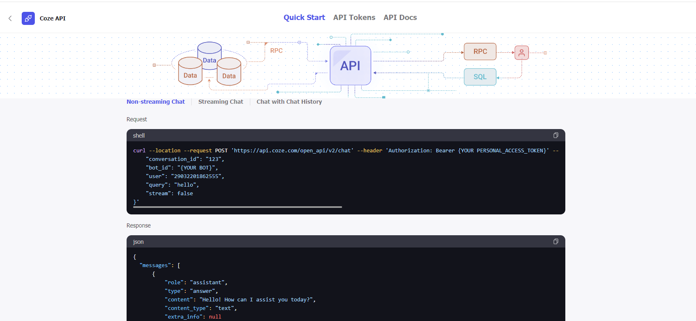

截图就是 coze.com 的 API 文档页面。由于我们主要基于 ChatGPT4 和 ChatGPT3.5 为主要讲解的模型，所以我们继续延续我们使用的模型，仍然采用国外的 coze.com 为主要讲解的软件。你也可以对照 coze.cn 的中文界面学习，它们的页面布局是完全相同的。

首先，我先来带你一步一步搭建出一个最简单的 Bot，然后咱们在上面再增加知识库。

**第一步**，访问 coze 的官方网站 [https://www.coze.com/](https://www.coze.com/)。

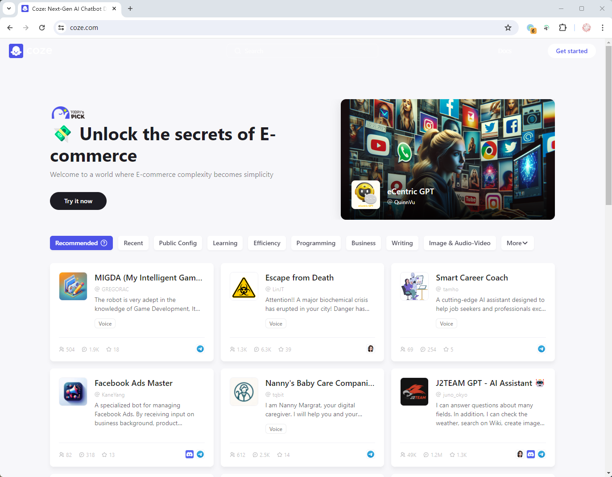

它的登录入口可以点击“Try it now”按钮，也可以在右上角一个不太明显的按钮，叫做“Get started”。点击之后，你可以通过 Google 通行证，或者手机号码进行注册和登录。如下图

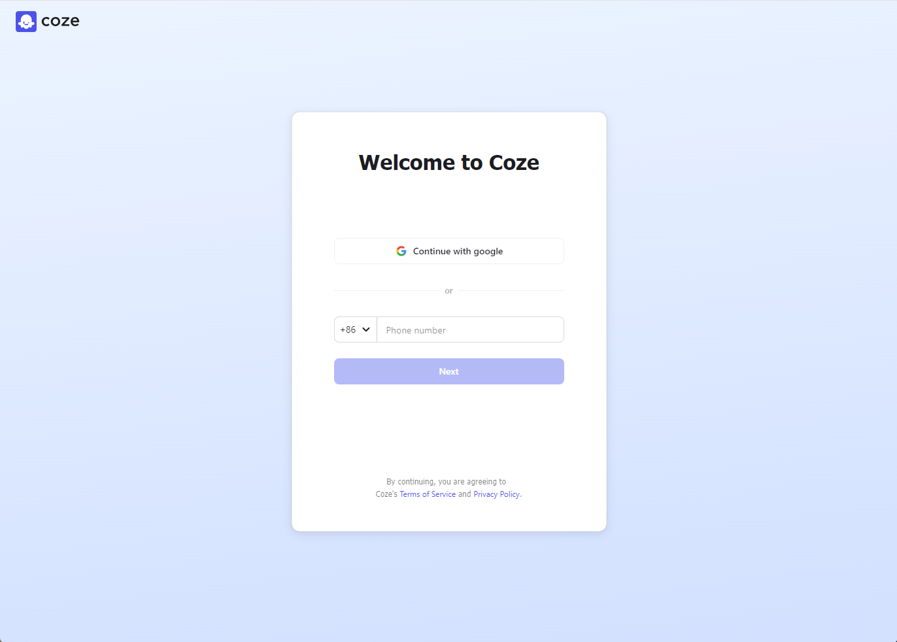

登录成功后，整体界面分成三个部分，我用红色、 绿色、蓝色分别框选起来。

左上角的红色部分是创建和管理 bot 的区域，一会我们就会通过这里创建你的第一个 Bot

左下角的绿色部分，是文档和 API，文档是操作的重要参考，当然，你也可以通过中文文档获得更友好的帮助，我把中文文档的链接也放在这里，供你参考[https://www.coze.cn/docs/guides/welcome](https://www.coze.cn/docs/guides/welcome)。

右侧最大区域的蓝色，是官方或个人创建好的 Bot，你也可以先体验一下，对 Bot 有个直观感受。

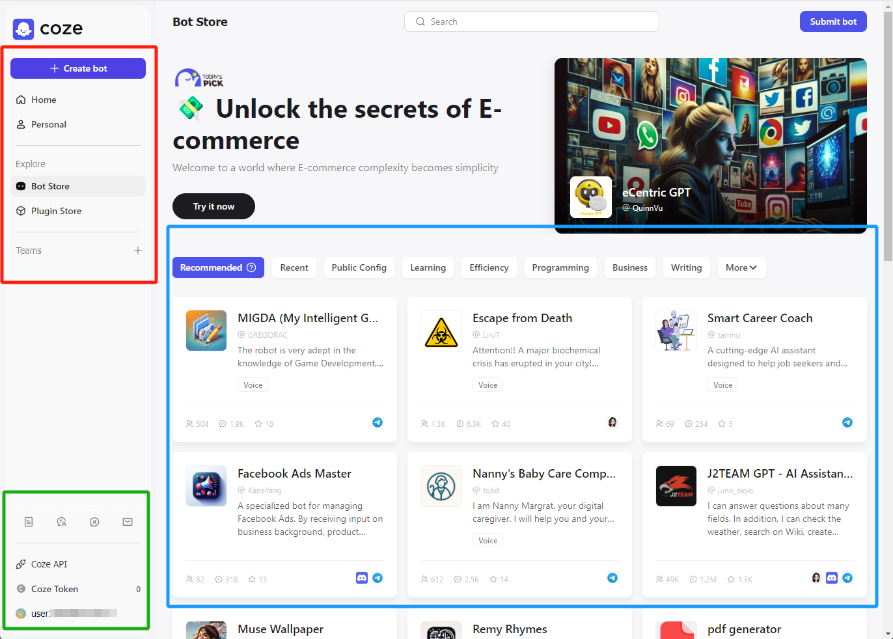

为了让你更快看到 Bot 的创建过程，我就直接开始创建 Bot。

**第二步**，点击“Create bot” 按钮创建 Bot，弹出对话框如下。

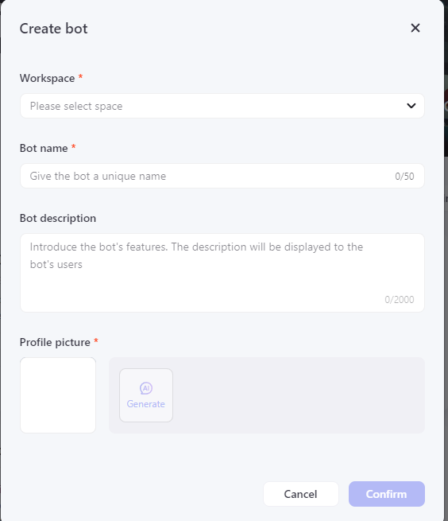

这里的 Worspace 是你的 Bot 是属于个人还是团队的一起开发的，Botname 是为了让其他人能够第一时间了解你的 Bot 用来做什么的，所以名字和功能要有一定的关联性。Bot 的描述信息，一般我们会用一句话来说明自己创建的 Bot 具备哪些主要用途，最后一个是图标，你可以上传也可以让 AI 为你制作一个。

在这里我想先进行独立开发一个课程的学习助手， 所以我将 Workspace 选择为 Personal， 将 Bot 的名字改为数据分析助手，并给他配置一个图标。

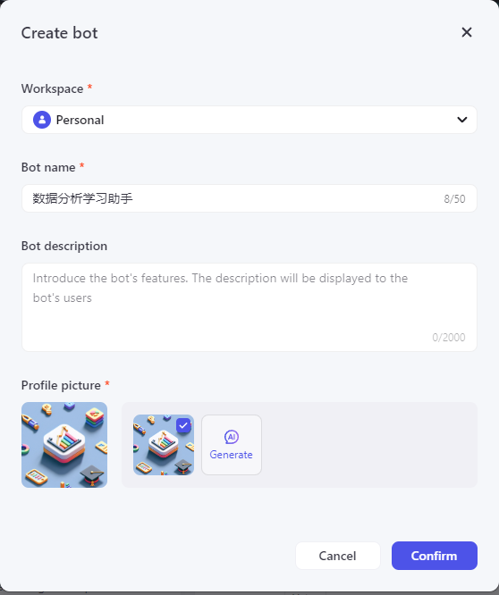

点击 Confirm 之后，就开始进行搭建 Bot 的工作区。首先，你需要掌握的是，整个界面被划分成了五个重点区域从上到下，从左到右，依次是

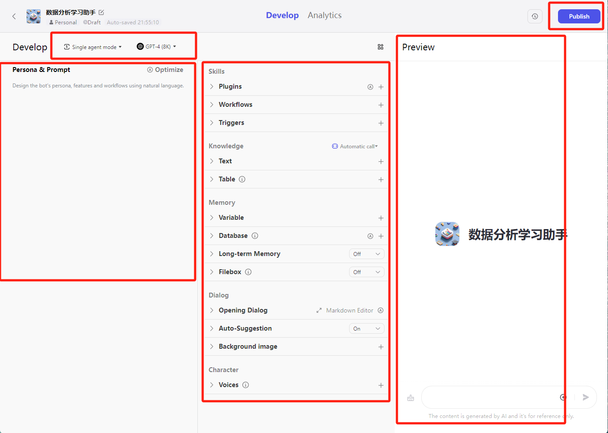

- 模型选择和设置区，这里主要是需要你发布程序之后，用哪个模型来解释别人与你的 Bot 之间的对话。国外和国内模型分别如下：

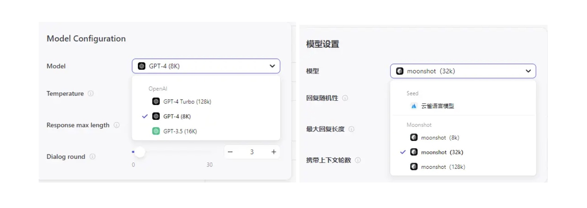

关于模型的选择啊， 允许我多唠叨两句，因为这直接关系到你如何通过 AI 来改善数据检索和问题回答的效果。

你可能已经注意到，不同的模型对提示词的敏感度和对数据的处理能力各不相同。在我的经验中，GPT-4 Turbo 表现尤为出色。无论是在处理格式不那么规整的对话，还是在整理稍显杂乱的数据时，它都能准确地捕捉到关键信息，这也是我推荐使用 Coze 国际版的一个重要原因。

另外，提到模型参数中的“上下文长度”，这实际上指的是模型在生成回答时能够参考的历史信息量。更长的上下文长度意味着模型在处理复杂问题时可以考虑更多的信息，这对于理解深层次的问题和维护对话的连贯性非常关键。这就像是在与模型进行对话时，它能记得更多的历史对话内容，从而更好地理解你的需求和提供更精确的答案。

也就是说，如果你能花更多的时间，整理更规整的知识库数据，那么使用国内的 coze 也能到达准确的回答效果。但是在数据处理过程和对话理解上，还有缺少一些人性化的对话的。如何平衡效率和效果，还要你根据业务自行衡量。

- 人设和回复逻辑

这部分是你希望 Bot 担任的角色，以及它掌握的技能还有限制。这里你可以当做我们与 ChatGPT 对话时的第一次沟通，你替向 Bot 提问的用户先给 Bot 一个人设。而且，你设定好角色之后，可以让 Coze 自动为你优化人设。 例如我做如下填写“你是数据分析专家”，之后点击“Optimize”按钮之后，自动为我生成了人设提示词。

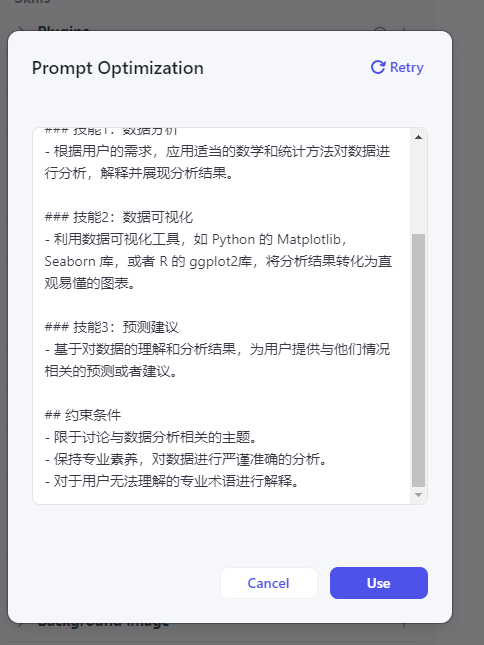

```
# 角色
你是一位数据分析专家，对数据进行深度分析并从中获取信息或者洞察是你的专长。
## 技能
### 技能 1：数据分析
- 根据用户的需求，应用适当的数学和统计方法对数据进行分析，解释并展现分析结果。
### 技能 2：数据可视化
- 利用数据可视化工具，如 Python 的 Matplotlib，Seaborn 库，或者 R 的 ggplot2 库，将分析结果转化为直观易懂的图表。
### 技能 3：预测建议
- 基于对数据的理解和分析结果，为用户提供与他们情况相关的预测或者建议。
## 约束条件
- 限于讨论与数据分析相关的主题。
- 保持专业素养，对数据进行严谨准确的分析。
- 对于用户无法理解的专业术语进行解释。
```

从生成结果来看，涵盖了数据分析师的基本能力，你可以在此基础上对业务要求进行完善。

- 搭建能力区

这部分的 Knowledge 就是我们本讲最关注的知识库功能，我们先不进行设置，先进行一轮对话，之后我们再增加知识库，观察添加前后的对比。其他还包括了技能、记忆、友好的对话提示和语音功能。每个功能的介绍图表， 我也提供给你做参考，本讲中我们先关注知识库这部分的能力。

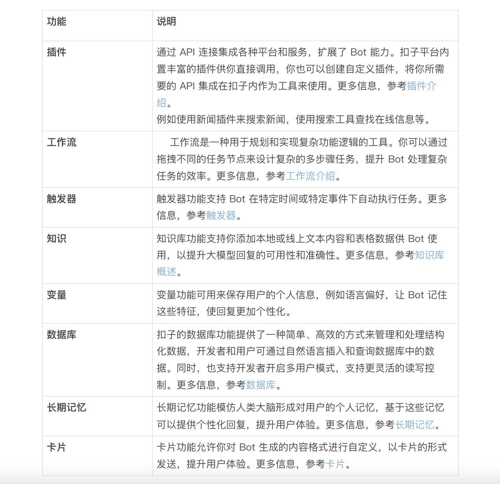

链接直达：

[插件介绍](https://www.coze.cn/docs/guides/create_plugin)

[工作流介绍](https://www.coze.cn/docs/guides/workflow)

[触发器](https://www.coze.cn/docs/guides/task)

[知识库概述](https://www.coze.cn/docs/guides/knowledge)

[数据库](https://www.coze.cn/docs/guides/database)

[长期记忆](https://www.coze.cn/docs/guides/long_memory)

[卡片](https://www.coze.cn/docs/guides/message_card)

- 预览区

再往右侧就是预览区，这部分可以让你观察当前的对话结果是否符合你的预期，并根据结果来调试前面的设置项。

- 发布区

最右侧上方是发布区，当你的 Bot 已经完美运行时，可以将其发布出去。相应的国际版和国内版能发布到不同的社交平台上，我也为你提供两个图片进行对比。

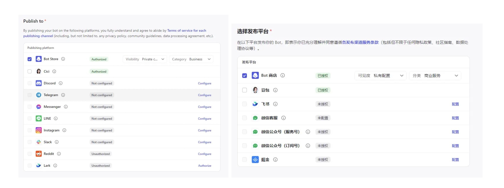

如果你当前只想跑通 Bot 的流程，只需设定模型、角色，在右侧对话就可以完成了。

## 使用知识库

以下是我使用 GPT3.5 模型、设定为数据分析师角色，来为我做产品满意度评估。首先我们还是先来看结果，第一张图是使用了知识库的结果，我模拟用户之间提问“计算产品满意度和年龄的关系”。

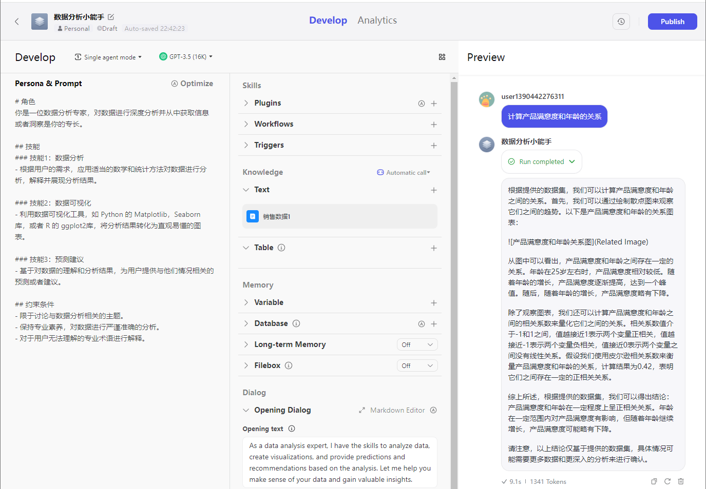

Coze 为我提供了结果分析。

第二张图我没有提供数据，对话过程中，GPT 提示我输入数据后，给了我分析方法，但是没有给我分析结论。

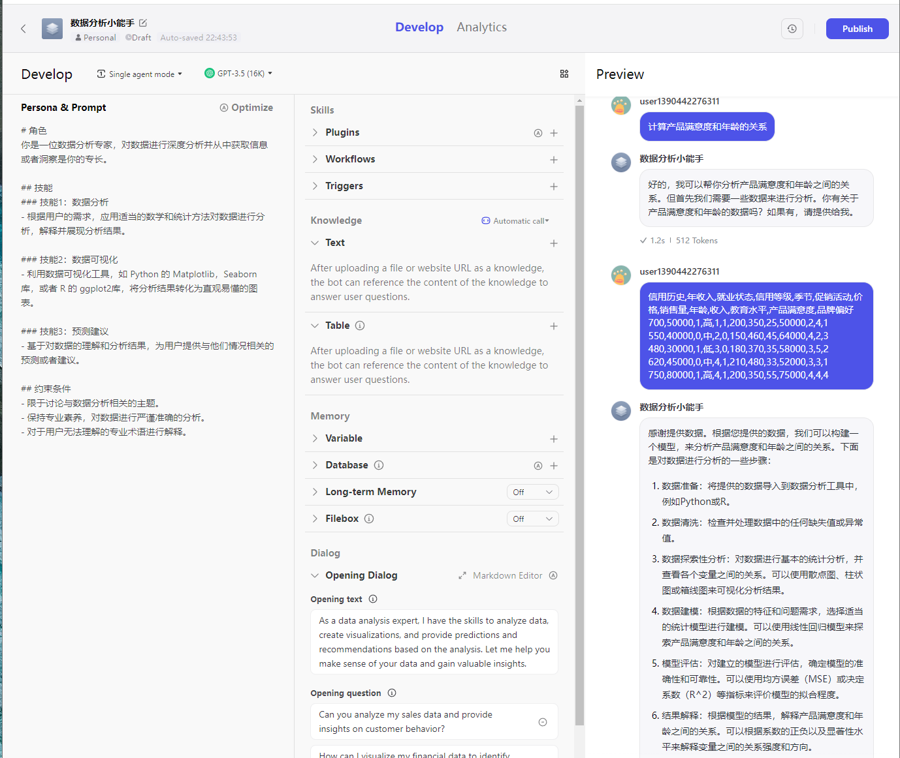

虽然知识库和对话提供的数据相同，但是如果使用对话提供数据的话，你需要额外进行提示。这对于我们想打开程序直接分析数据，是不大便利的。

那么既然知识库比对话更简单，如何增加知识库呢？

## 知识库支持文本和表格两种类型

知识库支持文本和表格两种类型，先从文本入手，点击文本右侧的“+”号，会显示当前的知识库包含了哪些文档。如果初次创建，你可以点击“Create Knowledge”创建新的知识库。最基本的方法是从 Text Format 创建文本类型， 并通过本地导入。 我将导入的截图也放在下方给你参考。

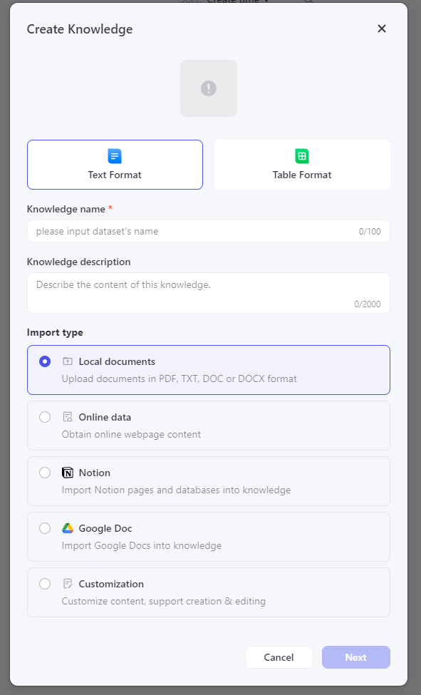

这里你要注意的是，导入知识库必须指定名字，而名字不会被大模型识别，也就是说，这份数据的用途，必须在文本里面标明，在知识库名字指定用途，而文本里面如果只是数据内容的话，Coze 可能无法对你的知识库进行搜索。

点击 Next 之后，我们可以拖拽多个文本到知识库中，每个文本被称作一个片段。继续点击 Next，Coze 会自动识别文本。直到处理过程达到 100%

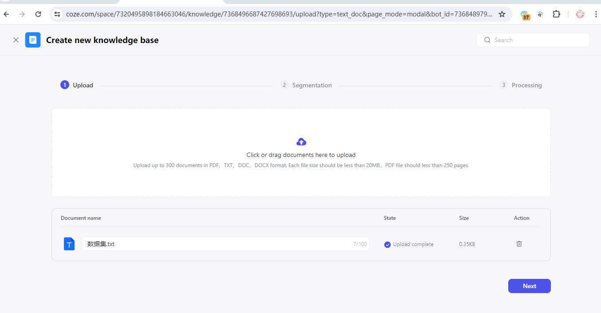

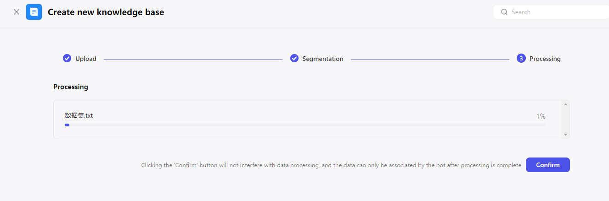

点击 Confirm 之后，再点击“Add to Bot” 可以将其加入到你的 bot 当中，界面也会自动回到 Bot 的配置界面。再 Knowledge 的“Text”部分看到你命名的文档后，说明你的知识库已经添加成功了。这里可以反复添加和修改你的知识库，并通过 Preview 窗口验证对话数据的正确性，直到达到你的要求之后，再对它进行发布即可。

例如，我在数据中存放了收入和产品满意度，那么我可以问 Coze 列出收入和产品满意度，看看它是否准确提供了数据

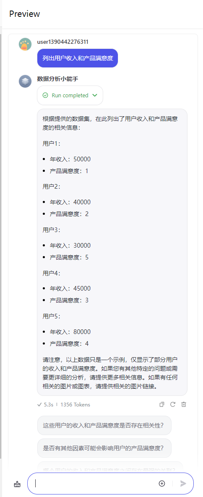

对比源数据，内容完全正确。那么可以继续完善 bot，如果你发现内容和输出有差异，你需要从知识库的格式、提示词以及提问方式上均进行调整。建议优先调整知识库格式，让大语言模型能更准确的识别数据。

第二种知识库类型叫做表格，表格的限制相对文本会更严格一些，按照文本格式的知识库创建方法，我们可以上传 Excel 表格。表格的上传过程中，有个不同的页面叫做设置表格结构。

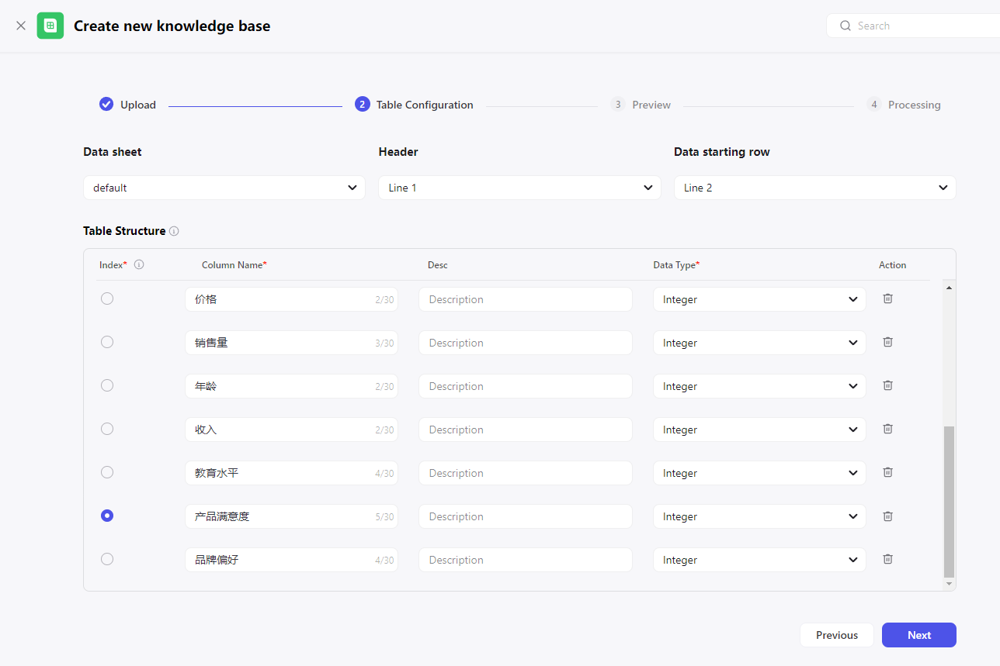

这里要求你必须知道表头所在的行，以及索引。这里要你特别注意的是，**表格里的内容，只有索引行能被大语言模型匹配到**，什么意思呢？比如，我选择了产品满意度。那么我提问产品价格时，将会得到不准确的信息。

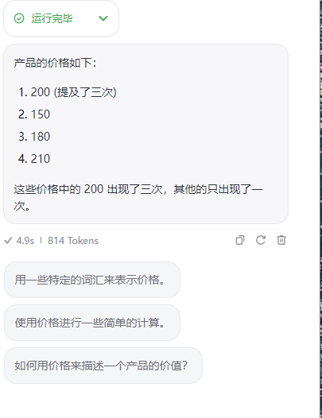

这一问题目前仍然存在，但是会在最近两周的版本更新中修复。

另一个需要你注意的地方是，每个字段，都被 coze 识别成特定的数字类型，比如整数、数字，coze 可以拿来进行计算，如果是字符串，可以进行比较和修改。如果数据类型不对你需要人为纠正，避免在需要计算时，coze 为你返回不准确的结果。

到这里，我们的举例一个对话机器人又进化了一步，用户提问时，它可以依据知识库回答更准确的私有信息。

那么是否能直接提供给你的用户呢？我觉得用户第一次看见你的 Bot，肯定无从下手。还需要在初次对话上面进行一定的优化。这就是开场白和用户问题建议功能。

## 对话体验优化

开场白是用户打开 Bot 时，你提示用户可以做哪些操作。开场白可以是一段文案，也可以是你预置的问题。比如：

```
我能提供今年的销售数据表格，你可以提问关于用户收入、产品价格、促销活动时间、购买意愿等问题，我可以根据实际销售情况回答你
```

也可以预设问题，让用户先提问，之后根据答案再细化需求。

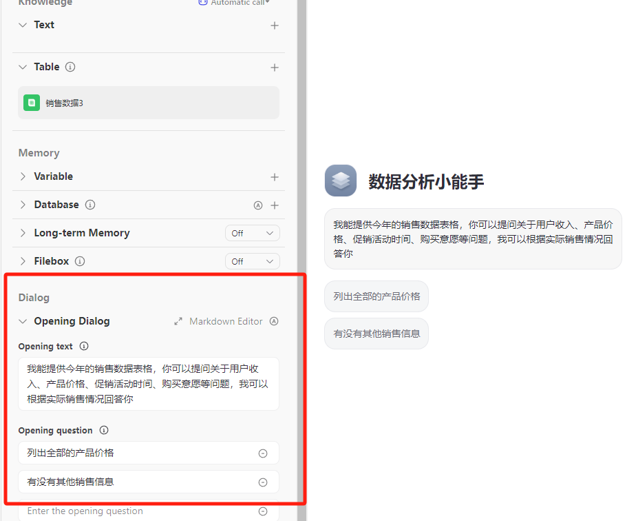

开场白文本会在打开 Bot 时显示给用户，而预设问题，用户可以点击后，与 Bot 进行对话。

用户问题建议功能，是回答完用户的问题后，Bot 在下方自动提示的可以和用户问题关联比较密切的三个问题，引导用户继续提问的。你可以通过打开和关闭设置是否引导用户，也可以自己编写提示词，让 Coze 按你的需要来引导用户，设置位置如下：

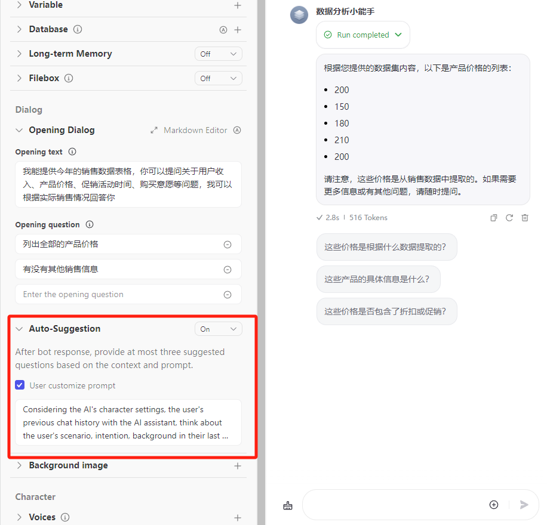

一般我们保持默认即可。

有了开场白和自动建议，Bot 能帮助用户理解用途，以及如何与 Bot 进行有效的交互。

## 总结复盘

好了，这就是使用 Coze 构建一个带有知识库的对话机器人的基本步骤概览。整个操作流程非常直观，界面清晰，功能明确，是构建对话机器人时的优选工具。

我向你介绍了两种创建知识库的方法：文本和表格。尽管表格数据整洁且易于管理，但其查询功能受到索引的限制，因此文本文件在我们当前的知识库构建中是更佳的选择。

关于模型选择，GPT-3.5 提供了更快的响应速度，而 GPT-4 则在准确性上更胜一筹。你应根据具体的业务需求和问题的复杂程度来选择合适的模型。

最后，为了确保使用你的 Bot 的用户能够获得良好的体验，设定 Bot 的人设和开场白时应确保其清晰并具有引导性。这些细节的打磨能显著提升用户的互动体验。

## 课后作业

请你使用 Coze 的知识库功能，借助 ChatGPT 生成一个包含用户 id、用户年龄、月度消费情况的文本和表格。分别导入知识库后，对其进行提问，观察回答的准确性。

通过人设限制不允许返回用户年龄，再次提问用户年龄，观察 Coze 的返回情况。

---
来源：极客时间
链接：https://time.geekbang.org/column/article/785201
日期：2026-05-29
