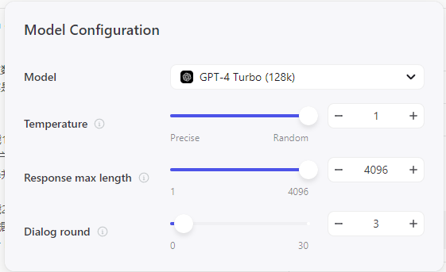
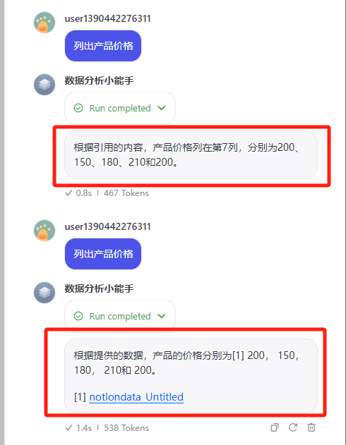
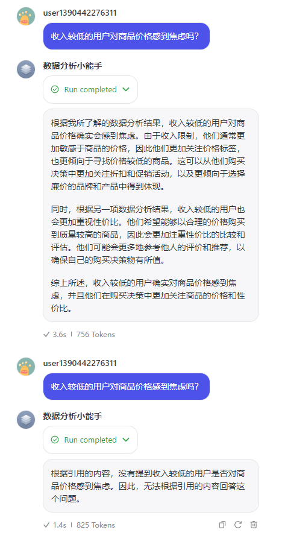
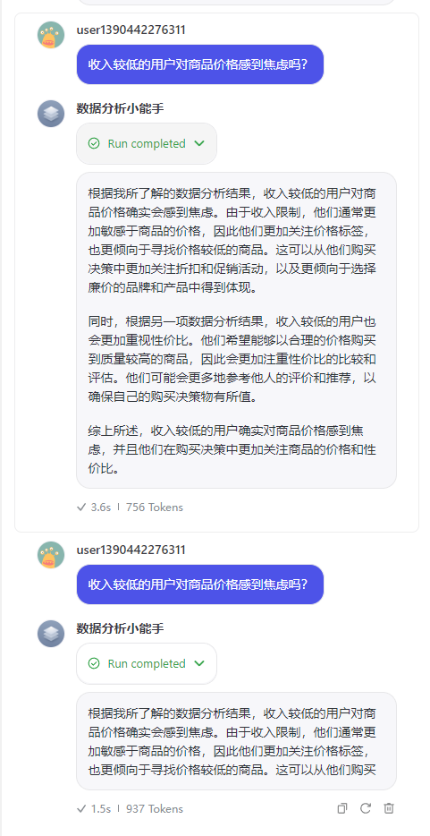
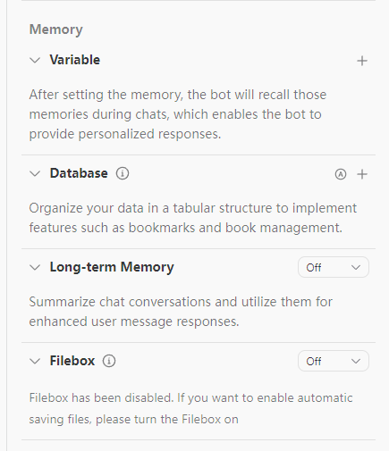
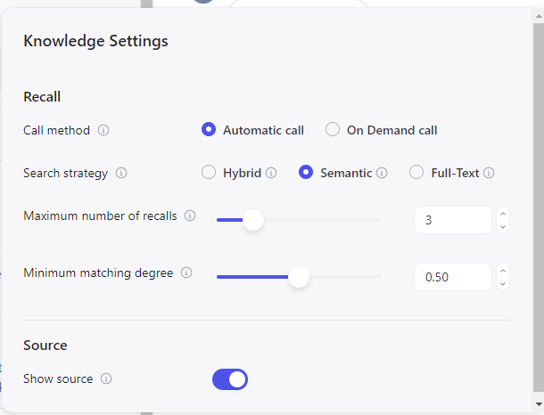

# 20｜深度优化：为Coze知识库实现更准确的数据查询（中）-AI数据分析课

点击“展开”查看“精华文字稿”

在上一讲中，我们一起探索了 Coze 支持的知识库的两种主要形式：文本和表格。你可能已经注意到，在界面上，**模型和知识库的设置都有许多参数**。这些参数的调整究竟会对知识库产生什么影响呢？今天，我们将深入了解这些参数的具体含义，并探讨在不同的使用场景下应如何调整这些参数，以优化我们的知识库功能和效果。

## 模型参数

在 Coze 等对话机器人中，模型参数的设置对对话效果和数据获取能力有着直接的影响。这些参数通常包括“Temperature（温度）”、“Response max length（最大回复长度）”和“Dialog round（对话轮数）”。下面，我将逐一为你解释这些参数的具体作用。

**1. Temperature（温度）**

这个参数控制回答的随机性。温度值越高，生成的回答越随机，可能会更创造性但不一定精确；温度值越低，则回答越固定、预测性强，适合需要精确答案的场景。

这个设置值会影响所有对话，你要根据需求谨慎使用，比如回答数据严谨的问题时，你可以降低 Temperature 值，如果是扮演客服，咨询非技术问题时，可以增大该值。例如我问同样的问题“列出产品价格，会得到不同的回答”，我分别使用了 0.1 和 1 两个极端的设置，你会看到不同的回答，你能猜出来哪个是 0.1 哪个是 1 吗？

没错，第一个回答更严谨，所以它是 0.1。那么我再换个问法：

这次你猜到哪个是 Temperature 为 0.1 的输出结果了吗？没错，是第二个，我用了两个极端参数对比。不难看出，Temperature 参数设置较低（例如 0.1）时的特点：内容直接、精确，没有引入新信息或推测，完全基于给定的引用内容进行回答，显得较为保守且固定。

而第一段则展现了较高 Temperature（例如 0.9）设置的特点：内容更加开放和创造性，引入了未在引用中直接提及的信息，进行了较多的推断和延伸，使得回答看起来更丰富和具有解释性。

这样的对比可以帮助我们理解不同 Temperature 设置如何影响模型的回答风格和内容深度，从而更好地选择合适的参数配置来满足特定场景下的需求。

**2. Response max length（最大回复长度）**

顾名思义，这个参数决定了机器人回答的最大长度。设置适当的回复长度可以避免生成过长或过短的回答，保证信息的完整性与精炼性。它的单位叫做“Token”一般，我们认为 100 个 Token 约等于 60 个汉字。当然你还要考虑前后的提示词、人设等， 如果你设置大语言模型回复 100 个 Token 可能不到 60 个汉字，这些额外的 Token 就是被提示词给吃掉了。

那么实践时，何时调大或调小最大回复长度呢？根据我的经验：

【调大最大回复长度】

- 详细解释和深入分析：允许模型提供更多信息，进行更全面的讨论和分析，可能包括更多背景信息、详细步骤、例子或相关数据。
- 覆盖更多点：模型可以在一个回答中涵盖更多相关的子话题或相关问题，提供更全面的视角。
- 增加教育价值和用户参与度：更长的回答可以更详尽地解释复杂概念或步骤，对于教育内容或详细指导尤其有用。

【调小最大回复长度】

- 快速直接的回答：使得模型的回答更加简洁、直接，适合快速解答简单或直接的问题。
- 提高对话节奏：在对话式的交互中，较短的回答可以提高对话的节奏，使得用户体验更流畅。
- 减少信息过载：对于一些用户来说，简短的回答可能更易于理解和消化，特别是在需要快速决策的场景中。

我们仍然以“收入较低的用户对商品价格感到焦虑吗？”这个问题为例，我将回复长度由 4096 改为 100 个 Token，你来对比一下两次回复的区别。

你要明确区分"最大回复长度"（Response max length）和"温度"（Temperature）两个参数，在调整 ChatGPT 的行为上的不同作用，最大回复长度决定简洁还是细节；温度觉得保守还是多样性。不能混为一谈。

**3. Dialog round（对话轮数）**

这个参数定义了在不丢失上下文信息的情况下，对话可以持续的轮次。较高的对话轮数有助于维持长对话中的连贯性，而较低的对话轮数则可能导致对话快速“忘记”前面的内容。

对话轮数（Dialog rounds）的设置主要取决于对话的复杂性和目标。并不是对话轮数越长总是越好，而是要根据具体情况来调整。

- 长对话轮数的优势：

- 更深入的对话：长对话轮数允许模型保持更长时间的上下文记忆，有助于处理复杂的话题或需要多步骤推理的问题。
- 连贯性增强：在长篇文章生成、连贯性对话或长期交互中，长对话轮数可以帮助模型维持话题的连续性和深度。

- 短对话轮数的优势：

- 响应速度：短对话轮数可以减少模型处理信息的负担，从而快速响应用户的查询，特别是在需要快速交互的场景中，如客户服务。
- 减少累积错误：在一些场景中，长对话可能导致错误累积（例如，误解或不正确的信息被重复引用），短对话轮数有助于限制这种错误的传播。

所以呢，你需要根据对话的目的选择合适的对话轮数。如果是处理复杂问题或维护长时间的交互，可以选择较长的对话轮数。如果是快速查询或操作指导，短对话轮数可能更合适。

还可以关注用户体验和反馈，适时调整对话轮数以提高满意度。例如，如果用户频繁重复问题或感觉到对话冗长，可能需要调整对话轮数设置。

那会不会遇到一种场景，需要 Bot 一直保持记忆呢？Coze 也提供了解决方案，在 Memory 提供了变量、数据库、长期记忆和文件箱四个选项。

它们各自有不同的用途，比如变量，就是由 Bot 开发者创建的，每轮对话，都提醒大模型一次。

而数据库、长期记忆、文件箱则是根据对话自动生成的。后面三个保存的位置略有不同，你可以理解为保存到传统数据库、保存到内存和保存到文本文件的差异。

那你可能还会有疑问，长期记忆是不是和知识库重复了呢？这要从他们的作用和特性来对比。

知识库是一个存储信息的容器，通常以文本或表格格式存在。这些信息相对静态，一旦建立，内容变化不大，除非进行手动更新或配置自动更新机制。知识库为对话系统提供了一种快速检索事实信息的能力，它背后的内容通常是经过验证的、权威的，并且广泛适用于多种情境。

长期记忆则是对话系统在与用户互动过程中逐步建立的。它不仅仅是储存信息，更多的是记录用户的偏好、历史交互以及任何有助于个性化体验的数据。长期记忆随着用户对话的增多而逐渐丰富，能够让系统更好地理解和预测用户的需求，实现更加个性化的交互体验。

简而言之，知识库是对话系统的“参考书”，提供了广泛的基础信息；而长期记忆则类似于对话系统的“个人笔记”，记录了与特定用户的具体交互历史，用于提升对该用户的服务质量和相关性。两者共同作用，使得对话系统在提供精准信息的同时，也能够提供更加定制化的服务体验。

理解并合理设置这些参数，能够使 Coze 更好地适应不同的业务场景和对话需求，从而提升用户体验和对话效果。

## 知识库设置

知识库设置包含了 5 个参数，这些参数是用来解决从哪里查、怎么查、返回几条的问题。

虽然它写着“Automatic call”即自动调用，但是我也希望你能掌握它的设置方法和用途，让知识库的工作过程更可控。

我们先来看一下知识库设置的卡片，来回顾一下它的样式：

我们来依次看一下每个参数，以及对他们调整之后对知识库的影响。

- **调用方式**

你可以选择两种主要的调用方式：自动调用和按需调用。

- 自动调用：这种模式下，每一轮对话都会自动检索知识库，并利用召回的内容辅助生成回复。这种方式保证了系统在每次交互中都能尽可能利用到存储的知识，从而提高回答的准确性和相关性。然而，这可能会导致回答过程中不必要的延迟，特别是在知识库庞大或查询复杂的情况下。
- 按需调用：在这种模式下，知识库的调用是基于特定的触发条件。这意味着只有在满足特定条件或达到特定对话阶段时，系统才会查询知识库。这样做可以优化性能，减少不必要的数据处理，让对话更流畅。当然，要实现这一点，就需要在对话管理系统中配置详细的逻辑规则，明确在哪些情境下调用哪些知识库。

还有一点你需要注意，：在配置对话系统时，你需要注意，如果是在工作流中使用知识库，系统会根据工作流的设计自动按节点顺序调用知识库。这意味着你需要在设计工作流时考虑到各个节点的逻辑和数据需求，确保知识库的使用最大化效率和效果。

当你需要优化响应速度且能够详细指定用户逻辑规则时，才使用按需调用，否则我建议你使用自动调用。

- **搜索策略**

在构建对话系统时，合适的搜索策略决定了召回内容的相关性和最终生成回复的准确性。它包含了三个搜索策略，分别为：

- 语义检索：这种策略使用先进的自然语言处理技术来理解文本中词语和句子之间的深层语义关系。语义检索特别适用于需要理解上下文含义或查询跨语言内容的场景。例如，男人和女人， 国王与王后，语义关系强，适合使用语义搜索。
- 全文检索：这种方法侧重于关键词匹配，适合那些需要准确召回包含特定词汇的内容片段的场景。例如，当查询涉及到具体的人名、特定产品或者特定编号时，全文检索可以高效地从大量文本中找到包含这些关键词的文档。
- 混合检索：结合了语义检索和全文检索的优点，通过一种综合的方法对结果进行排序和召回。这种方式既考虑了关键词的直接匹配，也考虑了内容的语义相关性，从而实现更高质量的内容召回。这种策略适用于复杂的查询需求，能够提高召回内容的相关性和对话回复的准确性。

不同的搜索策略影响查询结果的准确性和查找效率。虽然混合检索看起来比较“全能”，但是查询时间上要比前两种搜索的时间更长。

- **最大召回数量**

最大召回数量确定了在一次检索中能够返回给大模型使用的内容片段的最大数量。选择合适的召回数量可以根据应用需求做出优化：

- 高召回数量：当你设置一个较高的召回数量时，系统将返回更多的内容片段。这对于那些需要广泛信息覆盖或深入分析多个角度的场景非常有用。例如，在进行复杂的市场分析或详细的技术研究时，多个相关内容的召回可以提供更全面的信息，帮助构建更丰富的回复。
- 低召回数量：在一些需要快速响应和高效准确信息的应用中，减少召回的数量可以缩短处理时间并减少信息过载。例如，在客服机器人中，用户通常期望快速获得直接和准确的答案，过多的信息可能导致用户感到困惑。

调整最大召回数量的实践应基于特定的业务需求和用户体验目标。通过对这一参数的精确控制，可以在保证信息质量和处理效率之间找到一个平衡点，确保系统能够在提供广泛信息的同时，也保持回复的相关性和准确性。

- **最小匹配度**

最小匹配度可以帮助 Bot 确保只有足够相关的信息片段会被提取并用于生成回复。它的用途一般有：

- 过滤低相关内容：通过设定一个合理的最小匹配度，可以有效地过滤掉那些与查询关键词相关性不高的内容。这样不仅可以提高回复的质量，还能避免向用户展示误导性或无关紧要的信息。
- 提高效率：在处理大量数据时，较高的最小匹配度设置可以减少系统处理的数据量，从而提升处理速度和效率。这对于需要快速响应的应用场景尤为重要，如实时客服支持或在线交互系统。

这个参数，你也需要根据不同的场景进行修改，例如：

- 客服系统：在客服系统中，可以设置较高的最小匹配度，以确保只有最相关的答案被提供给用户，从而增强用户满意度和效率。
- 研究和内容生成：在需要广泛信息搜集的场景，如学术研究或内容创作，最小匹配度可能会设置得较低，以便捕获更广泛的相关信息，支持深入分析。

一般来讲，我会适当调整最小匹配度，可以使知识库检索更加精准，符合特定应用场景的需求，帮助用户获得更准确、更有价值的信息。

- **显示来源**

顾名思义，在回答时显示引用自哪一个知识库，多用于调试。

如果用一句话来总结，调整参数的原则，那就是 **召回的内容的完整度和相关度越高，大模型生成的回复内容的准确性和可用性也就越高**。

合理配置可以显著影响对话机器人的性能，使其更加精准地理解和回应用户的需求。

## 总结复盘

这节课我们详细探讨了影响 Coze 知识库性能的两个关键设置：模型参数和知识库参数。

模型参数可以视为定义对话风格的工具，应根据业务特点调整为简洁或详细的风格。而知识库参数则直接影响回答的准确性。当我们扩展知识库后，通常会调整这些参数以优化检索结果，确保只有最相关、最高质量的信息被用于生成回答。

这些设置和技术不仅适用于 Coze，其他大型语言模型的对话系统也利用这些指标来优化性能，掌握它们能帮助你在 AI 对话机器人优化中提升效率，打造更智能的对话体验。

## 课后作业

设定一个场景，使用 Coze 构建一个简单的对话机器人，并通过修改“Response max length”和“Temperature”参数，观察并记录不同参数设置下对话输出的变化。具体操作如下：

- 设置场景：假设你正在为一个在线旅游咨询服务构建对话机器人。
- 初步对话设计：机器人需要能够回答关于目的地、旅行建议和预算规划的基本问题。
- 参数调整：

- 将“Response max length”从默认值调整到较短（如 100 字符）和较长（如 500 字符）的值，观察对话内容的详尽程度如何变化。
- 调整“Temperature”参数，从 0.1（几乎没有随机性）到 1.0（高随机性），观察回答的创造性和多样性如何变化。

- 记录和分析：记录不同设置下的对话结果，分析哪种参数组合更适合旅游咨询的需求，并思考为什么。

---
来源：极客时间
链接：https://time.geekbang.org/column/article/785210
日期：2026-05-29
