# 21｜联网与实时更新：利用技能模块为Coze知识库提高查询准确性（下）-AI数据分析课

点击“展开”查看“精华文字稿”

今天，我们来继续扩展 Coze 对话机器人的能力，我们要使用一个更酷的功能：Coze 插件。它可以让你的对话机器人更智能、更强大。

## 什么是 Coze 插件？

首先，你可能会问，什么是 Coze 插件？简单来说，Coze 插件就像是为你的对话机器人增加超能力的小工具。通过这些插件，你可以让 Bot 与其他软件进行互动，比如调取数据库、发送邮件、甚至是调用 API 来获取实时数据。

## 为什么要使用 Coze 插件？

那么，为什么要使用插件呢？想象一下，你希望编写的 Bot 它不仅能回答数据分析的问题，查询到采用的算法出自那篇论文，而且为用户提供的数据决策能和最新出台的政策相关联等等。这些需求，有了 Coze 插件，这一切都变得可能了。插件扩展了 Bot 的功能，让它不仅仅是一个回答问题的机器人，更是一个可以执行任务的助手。

那么我们还是先来看结果，然后再学习如何管理插件。

我在 Coze 上，向我的 Bot 提出两个问题：

```
我的行业金融行业，我需要为公司指定数字化转型计划，有哪些最新的政策支持？利用 PEST 为我分析一下
有本周涉及此类的新闻吗？为我提供新闻的出处时间并为我做个简报？
```

看看 Coze 如何回答我的：

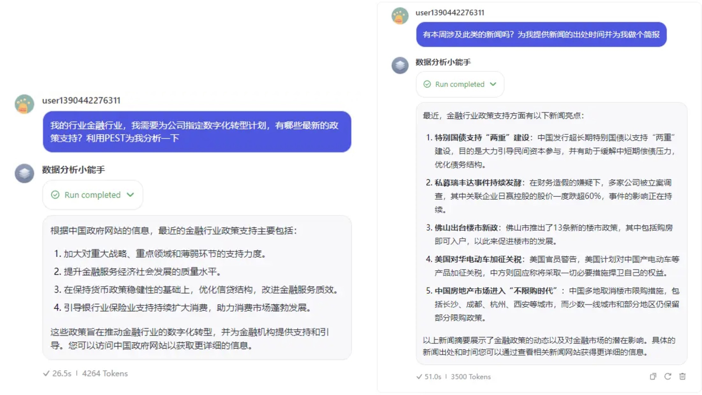

根据结果，我手动搜索了一下新闻，发现的确是发生在本周最新的财经频道的新闻。

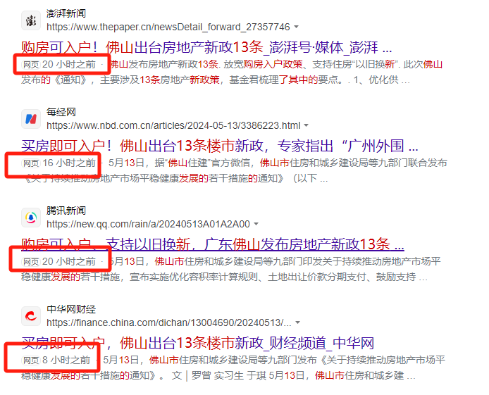

我是怎样让 Coze 支持联网的呢？操作步骤复杂吗？其实非常简单，在 Plugins 插件菜单右侧，直接点击自动加载插件，Coze 就为我正确加载了 WebPilot 和 Data Analysis 两个插件，前者是用于联网的，后者是用于更专业的进行数据分析的。这两个插件加载后的界面，我也提供给你。

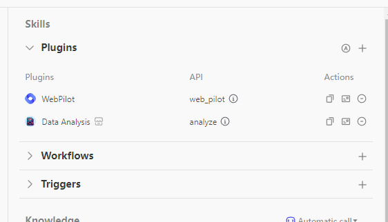

除了自动调用的插件外，你肯定希望能自己添加需要的插件，接下来我们就来学习一下，如何添加你需要的插件。

## 添加新的 Coze 插件

添加插件的基本操作也非常简单，你需要点击 Plugins 右侧的＋号，进入插件商店。根据你的需要进行搜索，或者从左下角的分类中找到你想要的插件。

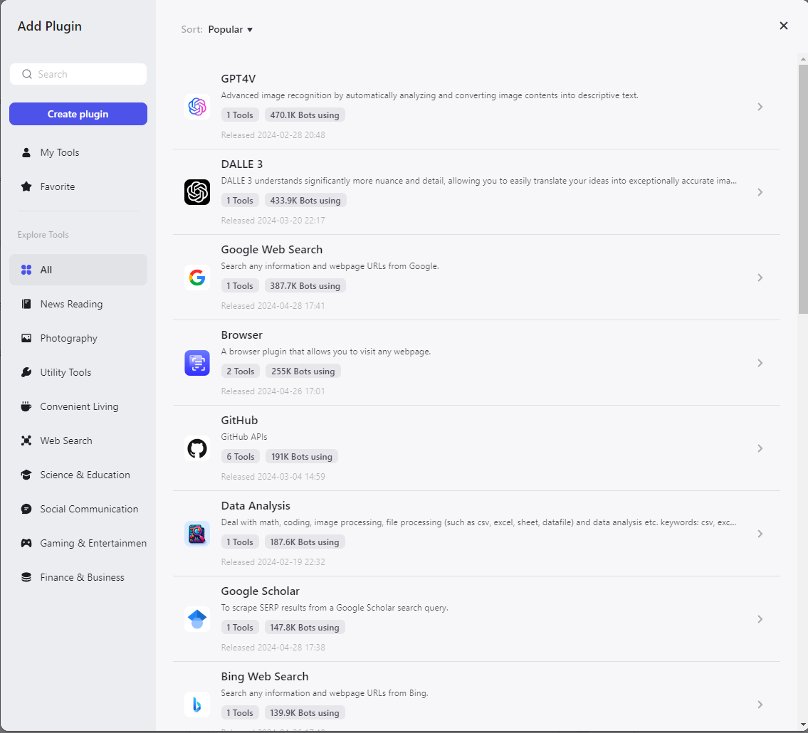

例如，你有下面这个场景的需求：

```
客户：我想查询一下我的订单状态。
Bot：请提供您的订单号。
客户：订单号是 12345。
Bot：正在查询订单状态，请稍等...
（Bot 调用数据库插件查询订单状态）
Bot：您的订单正在处理中。需要我发送一封更新邮件吗？
客户：好的，麻烦你了。
（Bot 调用邮件插件发送更新邮件）
Bot：更新邮件已发送，请查收。
```

这个需求需要你在知识库中，记录客户的订单号码，和客户的邮件地址。那么发邮件这个动作，其实就需要插件来完成。

这时，你需要找到对应插件加入到当前 Bot，验证和授权三个步骤，我来依次为你演示一下。

### 1. 找到对应插件

这里我使用 mail 作为关键字进行搜索，先找到和邮件相关的插件。我找到了 3 个，虽然都能实现邮件相关的功能，但是它们的体量和公司的知名程度不同，那么我们可以选择 Google 的 Gmail。但是如果你发现搜索出来的插件开发者，你都不认识先选择哪一个呢？这里我建议你根据使用的人数和最新更新时间来选择。使用的人数越多，发现 bug 的几率也就越多，更新的时间越近，软件功能的可用性也就越高。

选择 Gmail 之后呢，你会发现，这个插件能支持浏览邮箱和发送邮件两个功能，我们只需要发送邮件功能，那么点击 sendMessage 功能对应的 Add 按钮即可。

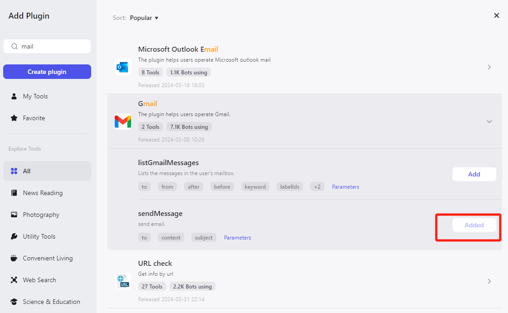

在插件中看的 Gmail 图标，说明该功能已经添加成功了。

### 2. 验证插件

添加成功之后，我们需要对邮件功能进行验证，确保插件能正常使用。

借助上面的读取新闻的例子，我将其发给我的邮箱。于是我向其继续提问：

```
能将新闻发到我的邮箱吗？我的邮箱地址是 xxxx@gmail.com
```

为什么要这样提问呢？一个是基于正确的提示词能拉起 Gmail 插件功能，另一个是根据它的 API 说明必须要有收件人地址、主题和内容。

第一个原因比较好理解，每个特定功能的插件，都需要你在对话中使用相应的关联度高的问题才能拉起，那么第二个 API，你可以从他的 API 提示中找到。

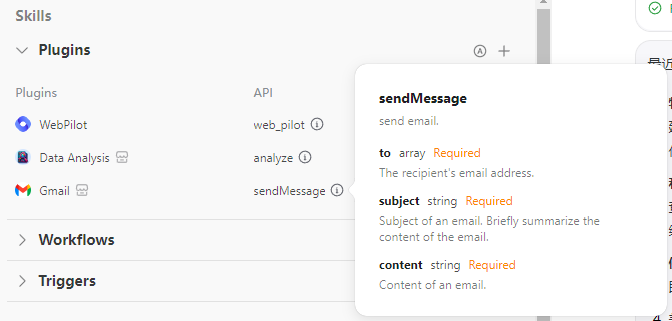

我也将提示截图给你，供你参考。其中主题和内容就是我们的新闻简报，内容就是新闻本身。

### 3. 授权

Coze 在拉起插件后，通常不会直接“干活”，它需要你授权以你自己的邮箱作为发送邮件的主体，因此还会弹出新的页面，让你登录一次邮件服务器，授权 Coze 使用 Gmail 发送邮件。

这里特别要注意，除了搜索功能外，Coze 需要以你的身份做某件事情时，都会拉起授权页面。所以你在为 Bot 添加新的插件后，务必要自己进行测试。确保授权信息没问题后，再发布最新的版本。

授权成功后，邮件会自动发送到我的邮箱里。

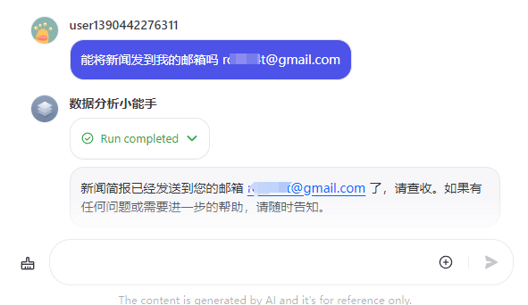

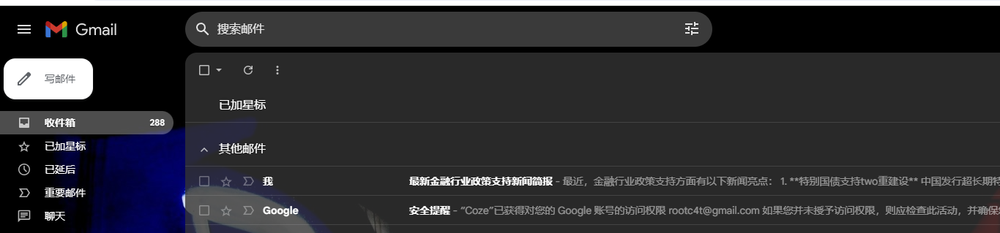

我的邮箱收到两封邮件，第一封是对 Coze 的账号授权，第二封邮件是财经新闻。

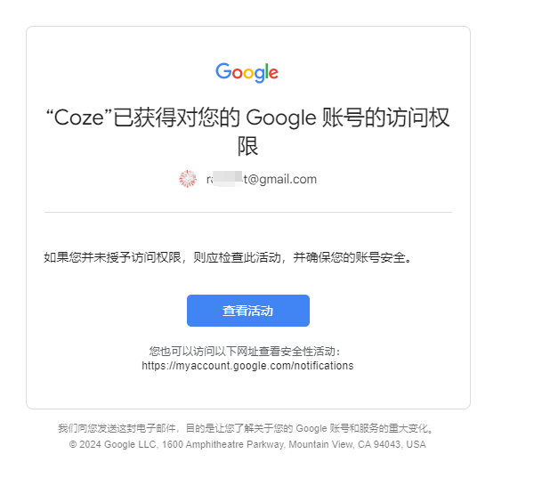

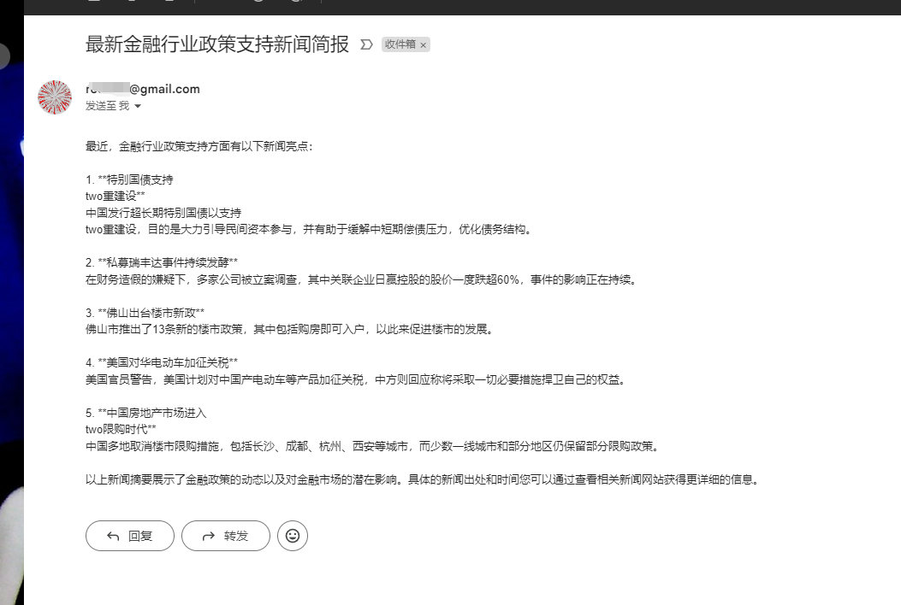

验证完成后，我们回到发送订单的例子，我创建如下知识库，让 Coze 完成订单数据的发送。

这里我先为数据集上传订单状态信息。

```
订单 id, 订单进展, 客户邮箱
001, 发货,a@gmail.com
002, 未发货,b@gmail.com
003, 已签收,c@gmail.com
```

并按照验证方法，增加 Gmail 插件。

接下来，我们模拟用户向 Bot 提问订单状态并发送最新状态到邮箱里。完整过程我也截图给你参考。

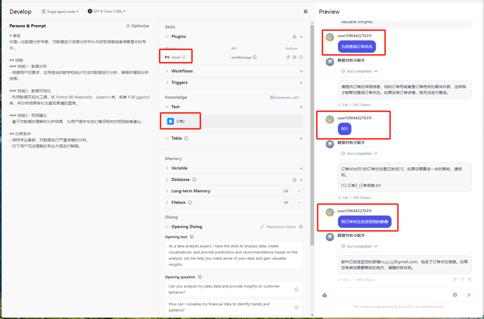

在截图中，我与 Bot 进行了 3 轮对话，第一轮比较模糊，直接询问我的订单状态。Bot 告诉我们需要提供具体的订单编号，此时大模型会根据知识库，找到我输入订单编号的一行。

在我输入订单编号时，Coze 会让大模型解释这一行的信息，并根据记忆，从上下文了解到我需要 001 订单的状态。正确返回给我后。

我继续要求 Bot 发邮件到我的邮箱。你需要注意的是，这次我没有提供邮箱地址。邮箱地址在知识库中被提前写入。Coze 依然利用同一会话的上下文，找到我的邮箱地址。 而发送邮件这一特殊功能，被插件捕获，因此 Coze 会调用 gmail 插件发送邮件。第二次使用插件，就不需要再次进行授权了。

此时观察我的邮箱，会收到一封订单状态更新的邮件。

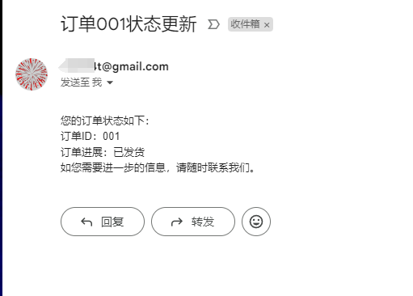

插件功能非常完美的帮我们扩展了 Coze 的基本能力。

Coze 的插件可以同时添加多个，你可以根据用途不同，添加不同的插件。例如：

```
数据收集插件：可以对用户的输入自动收集整理，存入飞书
掘金数据读取：可以解析和读取掘金文章的数据，并总结
Charts：生成图表
Dalle2：生成图片
```

利用 Coze 的插件机制，我们可以极大地扩展机器人的能力，满足不同场景的需求。

除了使用现成的插件外, 我们还可以根据实际需求自行开发定制插件, 这极大拓展了 Coze 机器人的可扩展性和灵活性。

你可以将大模型处理前后，需要连接自己特殊场景的业务编写为插件，形成你独特的功能。

由于编写插件需要借助比较多的编程能力，我就不在这里展开讲解了，如果你有兴趣可以阅读官方的插件开发样例代码，我将链接也放在下方[https://www.coze.com/docs/guides/plugin_ide?_lang=zh](https://www.coze.com/docs/guides/plugin_ide?_lang=zh)

## 总结复盘

插件是扩展 Coze 功能的主要形式，它能够让 Coze 具备连接其他软件的能力。通过结合插件和知识库，Coze 不仅能访问权威数据，还能实时联网，获取最新信息。这样，ChatGPT 不仅仅是一个对话模型，更成为一个功能强大、能够执行多种任务的智能助手。

## 课后作业

请你试着在 Coze 中安装一个热点新闻插件和一个邮件插件，通过对话，让 Coze 为你生成你关注的新闻，并发送到你的邮箱中。

---
来源：极客时间
链接：https://time.geekbang.org/column/article/790991
日期：2026-05-29
