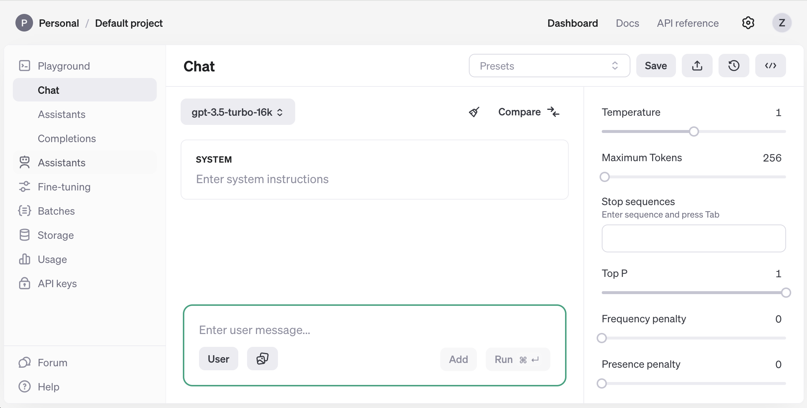
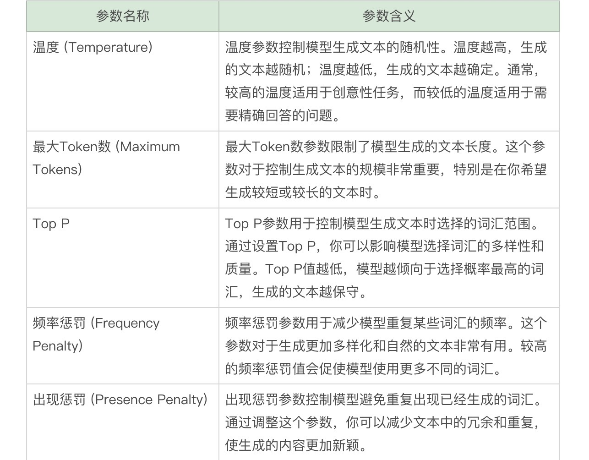
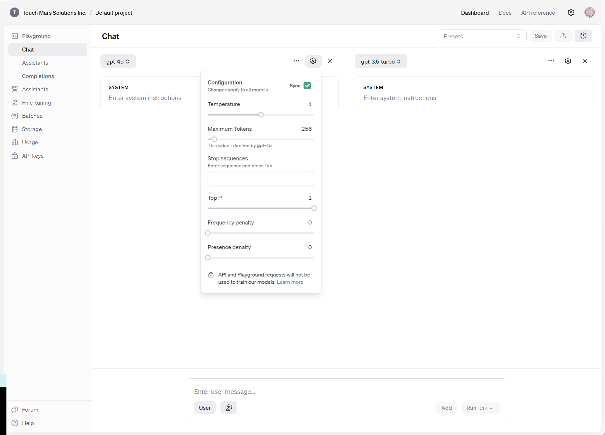
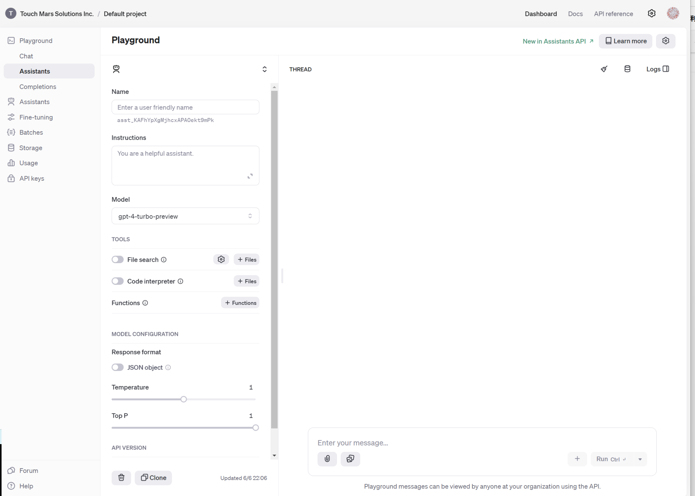
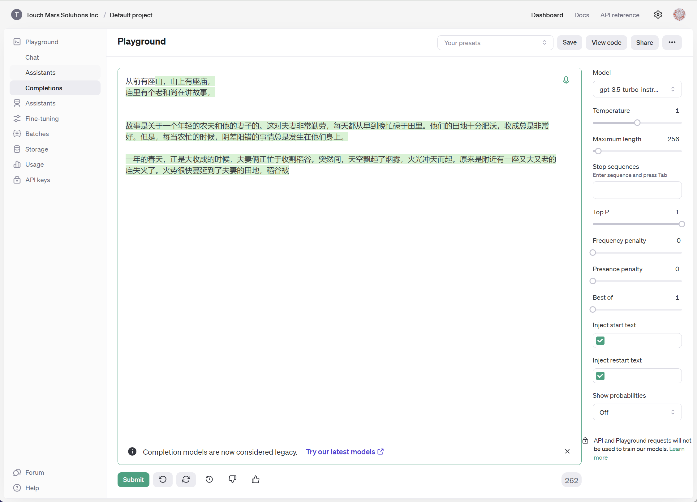

# 22｜打造专属助手：利用OpenAI Playground构建可控的数据分析工具-AI数据分析课

点击“展开”查看“精华文字稿”

前面几节课，我带你学习了如何在 Coze 平台上搭建各类助手，相信 Coze 的简单易用给你留下了深刻的印象。

如果你的使用经验越来越多，你肯定希望能够掌握更多参数，这样就可以更精准地把控模型的特性，来发挥模型的最大效能。这个时候，我们就需要借助 OpenAI 的原生调试界面了，那就是 Playground。

今天，我就带你学习 OpenAI 的原生对话调试工具 Playground。

Playground，顾名思义，是一个让你可以随意尝试的“游乐场”。前几节课中，我们学过各种参数在不同数值时的用途，也体验了多个参数配合时的特殊效果。你可能会好奇，难道这些效果是需要一个一个试出来的吗？AI 助手的效果好坏，是否需要逐个尝试才能确定能否满足我们的工作需求？AI 对话时，多次调整补全内容，是否需要等待 GPT 一次次生成，把大量时间耗费在重复输出上？

实际上，这些问题我都是通过 OpenAI 的 Playground 调试的。Playground 比对话更方便调整，提供了更多的参数和对比窗口，方便你掌握对话参数、调试各类助手，是挑战对话补全的利器。下面我先给你展示 Playground 的界面，然后按照对话、助手和补全三个分类为你逐步拆解其功能，帮助你高效调整出更符合你风格的 GPT。

## Playground 简介

我先来为你介绍一下 Playground 界面和使用方法。

当你打开 Playground 时，会看到一个清晰简洁的界面，左侧是功能导航栏，右侧是具体的设置和调试区域。

导航栏中包含以下几个主要部分：

- **Chat**：用于对话调试
- **Assistants**：用于创建和管理 AI 助手
- **Completions**：用于设置和调试补全模式
- **Fine-tuning**：用于微调模型
- **Batches**：用于批量处理任务
- **Storage**：存储相关数据
- **Usage**：查看使用情况和配额
- **API keys**：管理 API 密钥

前三个部分**Chat、Assistants、Completions**是 Playground 的主要功能。也是咱们今天要学习的重点。除了功能外，还有一个调试的通用逻辑，你可以套用通用流程来完成各种复杂逻辑的调试任务。

通用流程：

- **选择模型**：在每个功能模块中，你首先需要选择一个模型，如 gpt-4 或 gpt-3.5。这决定了你使用的 AI 的类型和能力。
- **设置参数**：根据你的具体需求，调整各种参数，如温度、最大 Token 数、Top P 等。
- **输入指令**：在对话或完成模式中，输入你的问题或任务要求。
- **查看结果**：运行任务并查看生成的结果，根据需要进一步调整参数或输入新的指令。
- **重新调整参数**：如果结果没有达到你的要求， 回到第二部分“设置参数”，重新设置新的参数值。

怎么样，定制模型比你想象的要容易吧。Playground 界面的设计非常直观，所有功能一目了然。接下来，我们将详细介绍如何使用 Playground 进行对话调试，并结合具体实例展示如何调整参数以优化模型的表现。

## 使用 Playground 进行对话调试

### 基本对话设置

在 Playground 中进行对话调试，你可以通过 Chat 功能模块设置基本的对话参数，以便更好地控制模型的行为。在这个模块中，你可以输入系统指令和用户消息，定义对话的背景和规则。我按照上面的通用流程，为你演示一下如何通过参数对比，进行对话结果的优化。

- **选择模型**：在右上角选择你希望使用的模型版本，例如 gpt-4o 或 gpt-3.5-turbo。
- **设置系统指令**：在 SYSTEM 部分输入你的系统指令，定义对话的背景和期望的行为。例如，你可以输入“你是一个数据分析小助手，根据用户提供的数据和要求提供计算模型和计算步骤”。
- **输入用户消息**：在 USER 部分输入你的问题或任务要求，然后点击运行（Run）。

通过以上设置，你可以开始与模型进行对话，模型会根据你的指令和参数设置生成回应。

在使用 Playground 进行对话调试时，我们需要清晰地理解角色的概念。根据 Chat 的目的，我们可以将其分为“**为自己编写对话机器人**”和“**为他人编写对话机器人**”两类。

当你为自己编写对话机器人时，SYSTEM 和 USER 部分分别代表不同的功能。可以将 SYSTEM 比作 GPT 的领导，而 USER 比作 GPT 的同事。要让 GPT 听从指令、完成任务，你需要通过 SYSTEM“命令”GPT，这样它才能按照你的要求执行任务，而你作为同事从中获得结果。

例如：

- **SYSTEM**：你可以输入“你是一个友好的助手，帮助用户回答技术问题”。
- **USER**：你可以输入具体的问题，如“请问如何安装 Python？”。

这种设置能确保 GPT 明确你的指令，并按照预期的方式完成任务。如果把要求写在 USER 中，GPT 可能会因为计算量不足而无法理想地完成任务。

接下来我们来看另一个用途，当你为他人编写对话机器人时，SYSTEM 代表的角色是对话的开发者，而 USER 则是对话机器人的使用者。这类似于 Coze 对话机器人，其中 SYSTEM 定义了机器人的“人设和回复逻辑”，而 USER 则是实际用户与机器人交互的界面。

例如：

- **SYSTEM**：你可以输入“你是一个银行客服助手，帮助用户查询账户信息”。
- **USER**：用户可能会输入“请问我的账户余额是多少？”。

这种设置方式使对话机器人更具针对性和实用性，确保用户能够得到准确和满意的回答。

### 参数设置与调试

按照通用流程，接下来我们要按照业务需要来设置参数。我先带你来掌握一下这里的参数。

为了让你更好地理解这些参数的作用，以下是几个实际的参数调整实例，结合数据分析场景来进行相应的调整。

**场景 1：增加创意性**

在数据分析领域，有时你可能需要生成创意性的描述或数据洞察报告。此时，你可以使用较高的温度和 Top P 值，增加模型生成文本的随机性和多样性。

- **温度**：0.8
- **最大 Token 数**：150
- **Top P**：0.9
- **频率惩罚**：0.5
- **出现惩罚**：0.5

这种设置适用于生成富有创意的文本，例如撰写数据分析报告中的洞察部分，或提供关于数据趋势的创意性见解，如故事写作或广告文案。

**场景 2：精确回答**

在数据分析中，你也需要模型提供准确的分析结果和具体的数值回答。那你就可以使用较低的温度和较高的频率惩罚，确保模型生成的文本准确且连贯。

- **温度**：0.2
- **最大 Token 数**：50
- **Top P**：0.8
- **频率惩罚**：0
- **出现惩罚**：0

这种设置适用于需要提供精准数据分析结果的场景，如解释特定数据点或回答关于数据的具体问题，如技术支持或 FAQ。

如果你想要反复比较调整前后的结果，对比功能会非常有用，我们具体来看。

### 对比功能 (Compare)

Playground 提供了对比功能，允许你同时调整多个参数，并对比不同参数设置下的结果。通过对比功能，你可以更快找到最佳的参数组合。具体步骤如下。

- **设置基准参数**：在主界面上设置一组基准参数。
- **点击对比按钮**：点击“Compare”按钮，打开对比窗口。
- **调整对比参数**：在对比窗口中调整不同的参数组合，然后运行对话，查看结果。

我也将界面截图放在下方，供你参考。

通过这种方式，你不但可以对比参数设置前后的变化，也能在界面中修改模型。极大地方便对比不同参数设置的效果，基于结果不断挑战参数，直到找出最符合你需求的设置。

在掌握了 Playground 的基础功能后，我们可以进一步探讨如何创建和调整 AI 助手。这一过程不仅需要明确的角色设定，还需要根据不同的应用场景进行详细的配置。接下来，我们将创建一个与数据分析相关的助手，并深入了解 Playground 的各项功能。

## 创建和调整 AI 助手

OpenAI 的助手和 Coze 助手功能类似，但可用的功能更深入。这节课我先带你学习一下创建助手的基本流程并创建一个基本的助手，下一讲我会带你深入学习助手的高级功能。接下来我来带你看看如何创建一个基于 OpenAI 的助手。

助手创建步骤：

- **进入 Assistants 模块**：在 Playground 的左侧导航栏中，选择“Assistants”模块，进入助手创建界面。
- **定义助手名称 (Name)**：你可以为你的助手输入一个友好的名称，这样方便你在多个助手之间进行区分。
- **设定指令 (Instructions)**：在此处输入助手的基本行为和角色指令。例如，对于数据分析助手，可以设置为“你是一位经验丰富的数据分析师，帮助用户分析数据并提供有见地的建议。”
- **选择模型 (Model)**：在模型选择部分，你可以选择不同的模型版本，例如 gpt-4-turbo-preview。不同的模型有不同的能力和特性，选择适合你需求的模型非常重要。
- **启用工具 (Tools)**：这里包括以下工具：

- **文件搜索 (File search)**：允许助手搜索和处理文件。
- **代码解释器 (Code interpreter)**：这是一个 Python 的沙盒环境，可以使 Assistant 编写和运行代码，处理文件和数据。
- **函数 (Functions)**：调用特定函数来扩展助手的功能。

- **配置模型 (Model Configuration)**：在模型配置部分，你可以设置模型的响应格式（如 JSON 对象）、温度（Temperature）和 Top P 等参数。这些配置会直接影响助手的行为和输出。
- **选择 API 版本 (API Version)**：你可以选择不同的 API 版本，根据需求进行调整。
- **输入消息 (Enter your message…)**：在右侧的对话框中输入你的消息，测试助手的响应。

我为你详细解读一下配置流程的关键步骤。

首先，**设定指令 (Instructions)**，相当于 Chat 功能的 SYSTEM 功能，助手能做哪些事情，不允许做哪些事情，都在此处简单明了的写清楚。

其次，模型选择上，由于 OpenAI 只能支持 GPT 系列模型，可选的模型比 Coze 更少，如果需要更快的回答用户对话，可以使用 GPT-3-turbo 模型，只有在模型效果不佳时，才考虑使用 GPT-4-turbo 或 GPT-4o 模型。牺牲速度提高准确度。

最后，**启用工具**的选择，这里的技巧依然是“没必要不启用”。对比 Coze 来说，文件搜索就是知识库，函数就是插件，而代码解释器是是否使用 Python 替代自然语言处理进行数据分析。

按照通用流程，最后就是进行测试。

在 USER 部分，你可以输入不同类型的内容以测试助手的响应能力。Playground 支持以下输入类型：

- **文字**：直接输入文本消息与助手进行对话。
- **附件**：上传文件供助手分析和处理。
- **图片**：上传图片供助手识别和解释。

通过合理配置这些功能和工具，你可以创建一个功能强大且符合你需求的 AI 助手。

除了对话和助手外，在 Playground 中，你还可以使用补全模式。补全模式允许你定义模型如何生成完整的文本段落。这种模式对于需要生成较长文本或连续对话的任务非常有用。

## 补全模式的使用

通过界面可以看出，对话部分占据了页面的大部分，而且没有明显的 SYSTEM 和 USER 指令的区分。这是因为你可以直接将需要生成的长文本开头写入对话框，GPT 会基于你的输入继续生成内容。与对话助手不同的是，你可以直接在生成的对话基础上进行修改，并让其继续生成更长的文本。

但是遗憾的是，从 GPT-3.5-turbo 模型之后，这一功能不再更新。OpenAI 已经将其整合到 Chat 功能中，因此你会在对话框的底部看到提示“Completion models are now considered legacy.” 另外，最新的模型只能使用 GPT-3.5-turbo，因此你只能在有限的环境下调试长文对话。

除了模型选择外，右下方还提供了非常多的参数，这些参数的功能与对话调试时的参数相同。你可以参考对话参数设置进行相应的调整，以优化文本生成的效果。

## 总结复盘

好了，这就是使用 OpenAI Playground 构建和调试对话与助手的步骤概览。整个操作流程非常直观，功能明确，是优化和调试 AI 模型时的优选工具。

在这一讲中，我向你介绍了如何通过 Playground 进行对话调试、创建和调整 AI 助手、以及使用补全模式来优化文本生成。通过合理设置参数和利用丰富的工具选项，你可以更快的调试出符合你要求的 GPT 对话机器人和 AI 助手。

为了确保你创建的 AI 助手能够提供优质的用户体验，在设定助手的角色和指令时应确保其清晰并具有引导性，这些细节的打磨能显著提升互动体验。

## 课后作业

创建一个数据分析助手：

- 使用 Playground 中的 Assistants 模块，定义助手的角色为“数据分析师”。
- 利用 chat 模块生成“去年四个季度的销售数据分别是 10 万，12 万，15 万和 18 万”数据
- 通过文件搜索、调整参数等方法，使助手生成的分析结果既详细描述又不枯燥。
- 调整温度、最大 Token 数、Top P、频率惩罚和出现惩罚参数，观察生成结果的变化，并记录最佳设置。

希望你能通过实践掌握这些功能，并应用到你的工作中，创造更多价值。

---
来源：极客时间
链接：https://time.geekbang.org/column/article/790998
日期：2026-05-29
