# 23｜对话智能：使用OpenAI Assistants构建支持文件搜索的机器人-AI数据分析课

点击“展开”查看“精华文字稿”

在上一讲中，我为你讲解了如何利用 Playground 调整参数，来实现更符合你需求的对话机器人。

同样，在 Playground 如何使用 Assistants 工具的基本流程我也为你介绍过了。

虽然 Assistants 与 Coze 功能比较相似，但它更加强大，比如其知识库能支持多达 1 万个文件，并且支持多线程搜索和并行查询，它能让你的知识库搜索速度比早期的 Assistants 版本提高几百倍。而且相比于 OpenAI 的 Chat 功能，Assistants 的最大特点是支持 File Search、Code Interpreter 以及 Functions 功能。那么这一讲我们就深入这三个工具，为你深入解读一下 Assistants 助手功能。

为了让你更好地掌握 Assistants，我先为你提供一个支持了全部工具的 Assistants，分析财经新闻数据的截图。这个例子展示了如何利用 Assistants 的多种功能来处理复杂的数据分析任务，并通过详细记录和成本评估来优化整个过程。

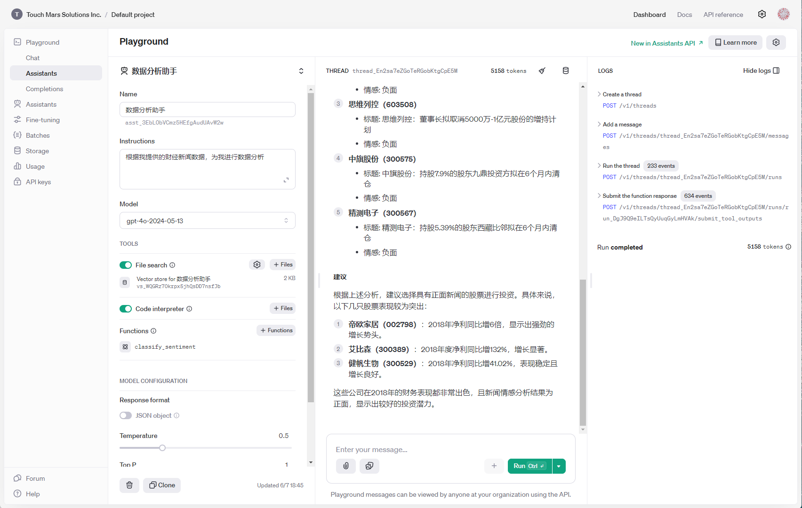

在这个示例中，我们通过使用财经新闻数据，并利用 Assistants 功能挑选出表现较为突出的股票代码。

在图中我希望你关注到以下三点。

- **Tools 功能**

- 我启用了 File Search、Code Interpreter、Functions 三大功能。
- **File Search**：使 Assistants 能够在知识库中快速搜索相关信息。
- **Code Interpreter**：用于在搜索过程中增加计算的精确性。
- **Functions**：增加情感分类功能，使 Assistants 能够自动进行情感分类，而不需要额外的提示词。

- **对话过程中的 Tokens 数量**

- 对话中的 tokens 数量被明确显示出来，这有助于有效评估成本。
- 通过显示 tokens 数量，我们可以清楚地知道每次对话和操作的资源消耗，从而优化对话内容和复杂度。

- **Logs 详细描述了运行过程**

- Logs 记录了整个运行过程的详细信息。
- 通过 Logs，我们可以了解 Assistants 的每一步操作和计算，使得整个过程不再是一个黑盒。
- 这些详细的记录可以帮助我们根据具体的操作过程进行优化，从而提升 Assistants 的性能和准确性。

我再带来你来深入学习一下**TOOLS 功能的三个工具**，这也是我们使用 Assistants 代替 Chat 的主要原因。

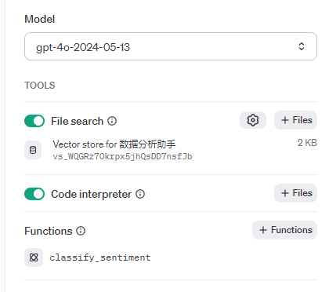

如截图所见，Tools 功能，包含了 File Search、Code Interpreter、Functions 三大工具。我来逐一为你讲解一下。

为了方便演示，我首先通过 Playground 创建了一个新的 Assistants，它的名字叫做数据分析助手。以下是创建和配置过程。

- **设定角色**

- **角色 (Instructions)**：设定为“你是数据分析专家，根据我提供的财经新闻数据，为我进行数据分析”。
- **目标**：使数据分析助手能够根据财经新闻数据进行专业的数据分析。

- **模型选择**

- **模型**：选择最常用的“gpt-3.5-turbo”。
- **理由**：gpt-3.5-turbo 具备最快速的生成能力，适合进行对话的快速生成和调整。

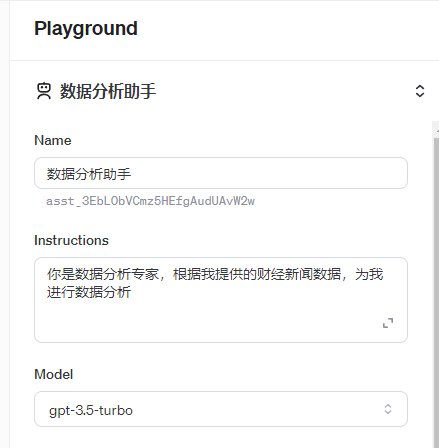

根据界面的布局，继续向下，就来到了 TOOLS 的第一个工具 File Search。在使用 Assistants 进行数据分析前，需要先启用这个工具。以下是详细步骤。

## File Search

- **启用 File Search**

File Search 是 Assistants 中的一个强大工具，能够在知识库中快速搜索相关信息。

为了能够并行检索数据，并快速检索上万个文本，Assistants 在这里引入了向量数据库的概念。向量数据库是一种用于存储和检索高维向量数据的数据库，常用于处理和查询大规模的嵌入向量，特别适合在机器学习和数据分析中的相似性搜索和推荐系统。

- **上传和转化文本数据**

Assistants 能够将你上传的文本，自动转化为向量数据库格式，以优化搜索算法和并行处理，使 File Search 可以在极短的时间内返回精准的搜索结果。这极大地提高了信息检索的效率和准确性。

**上传步骤**

- **点击“+Files”按钮**：在 File Search 功能右侧，点击“+Files”按钮。
- **拖拽上传文件**：通过拖拽方式，将包含 10 行的财经新闻数据集“news_seed.txt”文件上传。Assistants 会自动将其转化为向量数据库格式。

```
日期, 公司, 代码, 正 / 负面, 标题
2019 年 2 月 14 日, 永兴特钢,002756,1, 永兴特钢：2018 年净利同比增 14.45%；拟 10 派 10
2019 年 2 月 14 日, 帝欧家居,002798,1, 帝欧家居：2018 年净利 3.82 亿元，同比增 6 倍
2019 年 2 月 14 日, 艾比森,300389,1, 艾比森：2018 年度净利同比增 132%
2019 年 2 月 14 日, 远东传动,002406,1, 远东传动：2018 年净利 2.71 亿元，同比增 44.94%
2019 年 2 月 14 日, 健帆生物,300529,1, 健帆生物：2018 年净利 4.01 亿元，同比增 41.02%
2019 年 2 月 14 日, 盛运环保,300090,0, 盛运环保：37.48 亿元到期债务未清偿
2019 年 2 月 14 日, 乐视网,300104,0, 乐视网：贾跃亭持股近期再度减少 1077 万股
2019 年 2 月 14 日, 思维列控,603508,0, 思维列控：董事长拟取消 5000 万 -1 亿元股份的增持计划
2019 年 2 月 14 日, 中旗股份,300575,0, 中旗股份：持股 7.9% 的股东九鼎投资方拟在 6 个月内清仓
2019 年 2 月 14 日, 精测电子,300567,0, 精测电子：持股 5.39% 的股东西藏比邻拟在 6 个月内清仓
```

- **使用 File Search 功能**

配置完成后，数据分析助手可以使用 File Search 功能来搜索知识库中的信息。

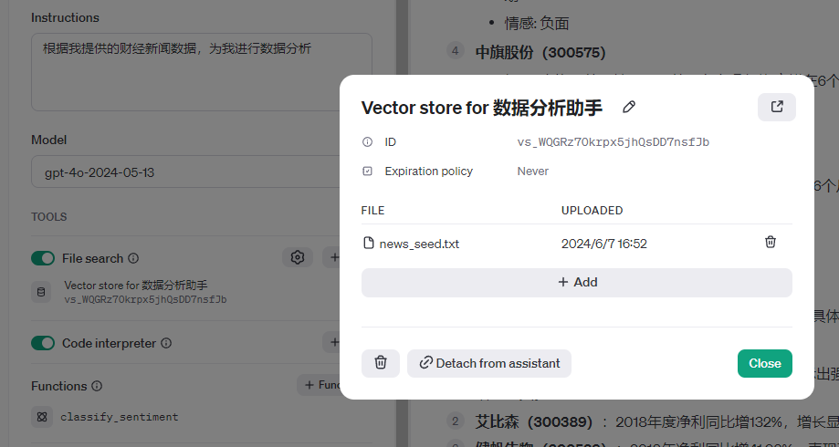

- **使用更大规模的数据集**

为了更好地练习和体验 File Search 的强大功能，可以使用更大规模的财经新闻数据集。在网盘中，我为你准备了一个包含 4074 行完整的财经新闻数据集。通过相同的步骤上传该数据集，Assistants 将自动转化并优化为向量数据库格式，进一步提高搜索的效率和准确性。

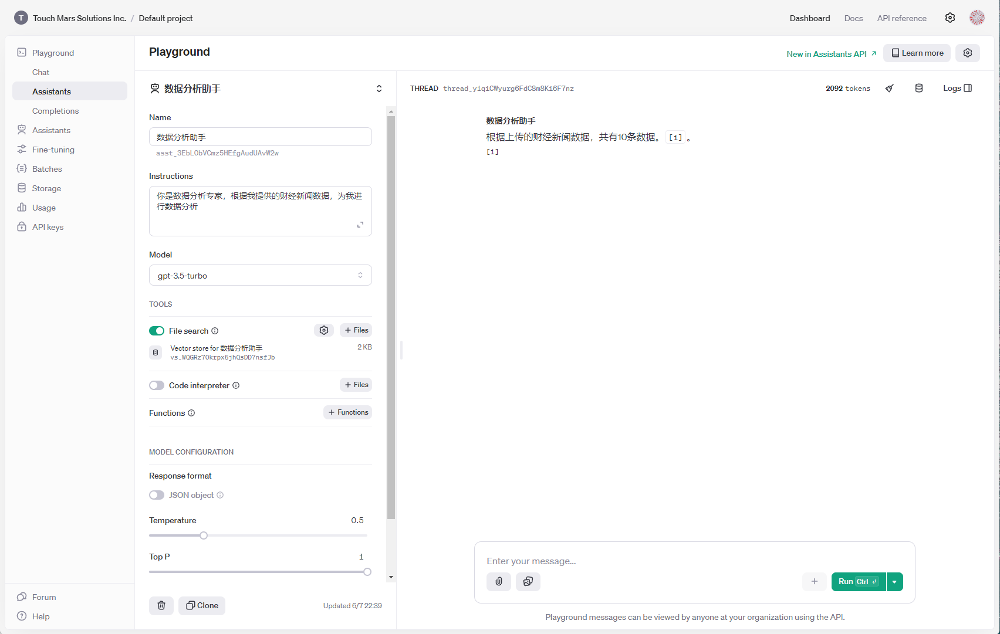

在完成向量数据库的更新后，你可以通过右侧对话框进行查询。例如，向数据分析助手提问“资料库中有多少数据？” 数据分析助手会准确回答你的问题，在更新向量数据库后，也会显示更新的准确结果。

在使用 Assistants 工具时，还有两个重要的知识点需要你注意。

第一，模型的选择。

并非所有模型都支持 File Search 功能。特别是以下两个模型在选择时，界面上的 File Search 功能会自动关闭：

- **gpt-4**
- **gpt-3.5-turbo-16k**

选择不支持 File Search 功能的模型时，会出现无法加载向量数据库的问题。这一点在你未来学习和使用 Assistants API 时尤为重要。因此，在进行相关设置时，请务必选择支持 File Search 功能的模型，以确保正常使用该功能。

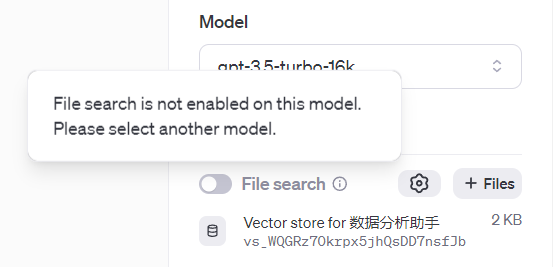

第二，关注 tokens 数量。

随时关注消耗的 tokens 数量非常重要。tokens 数量过多不仅会导致响应时间延长，还会显著增加成本。以下是一些注意事项和实例。

- **消耗计算**：在例子中，即使一问一答仅包含 25 个汉字，但由于需要处理资料库的全部数据，tokens 数量可能会达到非常高的值，界面中显示我消耗了 2092 个 tokens。
- **成本控制**：在使用付费 tokens 测试 Assistants 功能时，务必要注意测试成本，避免因大量 tokens 消耗导致不必要的开销。

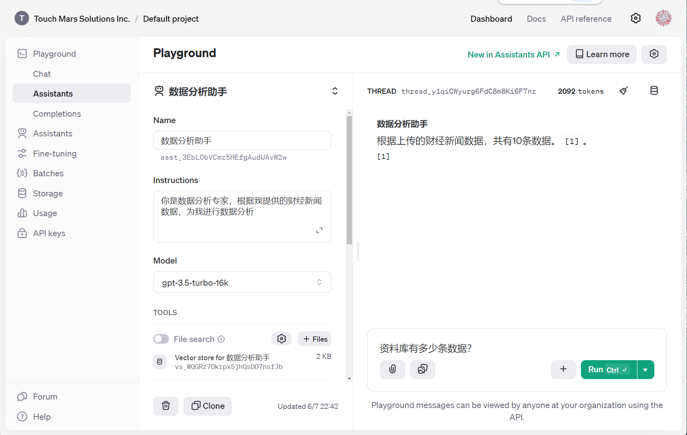

通过理解模型选择和 tokens 消耗的重要性，可以更有效地使用 Assistants 工具进行数据分析和查询。在启用和配置 File Search 功能时，确保选择支持该功能的模型，并时刻关注 tokens 消耗，以优化响应时间和成本。在下一部分，我们将介绍如何启用和配置 Code Interpreter 功能，以进一步增强数据分析助手的能力。

## Code Interpreter

在启用和配置 File Search 功能后，下一步是启用 Code Interpreter 功能，以进一步增强数据分析助手的能力。Code Interpreter 使你能够在对话中直接执行代码，这对于数据处理和分析非常有用。

启用步骤：

- **打开 TOOLS 选项卡**：在 Playground 界面中，找到并打开 TOOLS 选项卡。
- **启用 Code Interpreter**：在 TOOLS 选项卡中，找到 Code Interpreter 选项并将其启用。

Code Interpreter 这个名字很容易误导使用者，它并非字面意义的代码相关功能。它的主要作用是使用沙盒运行 Python 代码来处理数据，并展示 Python 的执行结果以及生成图表和可视化数据。通过 Code Interpreter 功能生成的代码，GPT 能够验证代码的正确性，比直接通过大语言模型对话生产的代码更具有可执行性。

比如我想预测一下知识库中任意一家企业的增长趋势，需要 Assistants 提供预测算法和代码，Code Interpreter 会为我自动编写 Python 脚本，并在对话显示代码的执行结果。通过提示中的“/home/sandbox/…”路径，你可以发现 Python 代码在服务器的沙盒中被运行过，这也能确保代码的准确性。它的执行结果较长，我用下面两张图为你展示提问和运行代码和显示图形的运行情况。

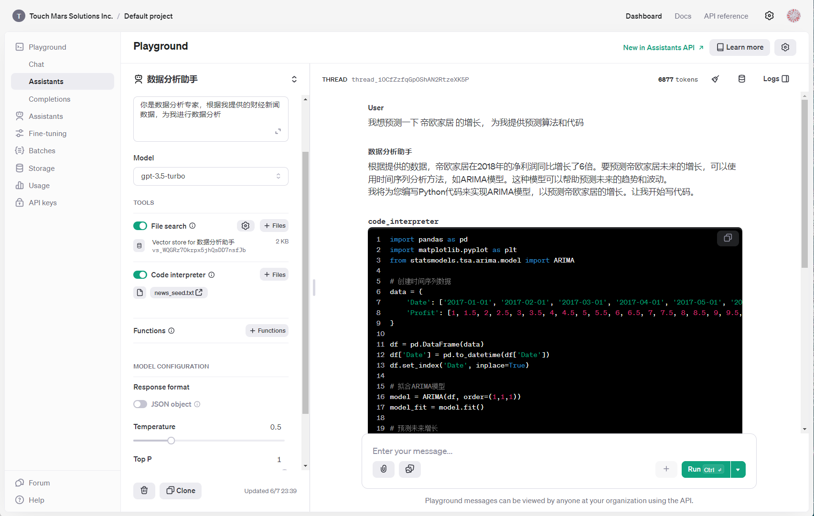

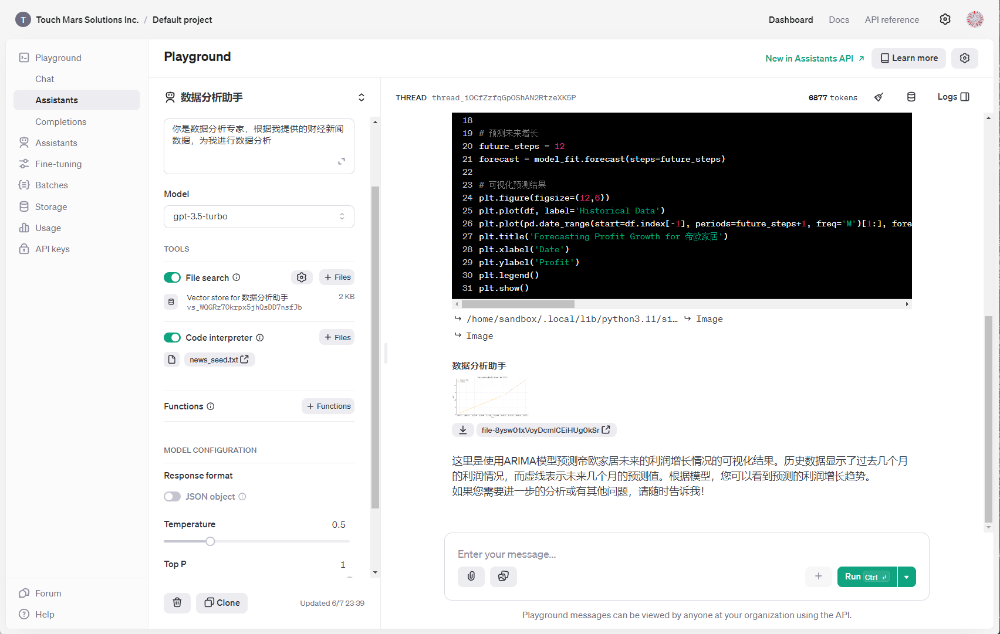

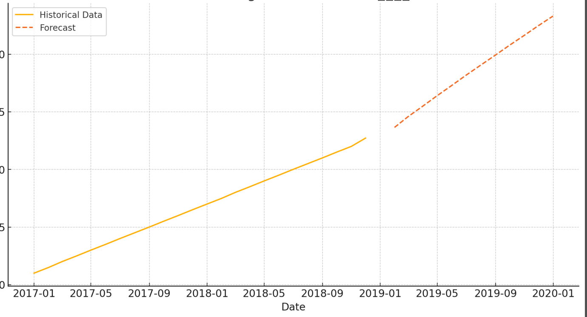

## Functions

最后，启用 Functions 功能，使数据分析助手能够调用自定义函数，进一步扩展其功能。

启用步骤：

- **打开 TOOLS 选项卡**：在 Playground 界面中，找到并打开 TOOLS 选项卡。
- **启用 Functions**：在 TOOLS 选项卡中，找到 Functions 选项并将其启用。

启用 Functions 后，你可以定义和调用自定义函数，以满足特定需求。例如，可以定义一个函数来自动进行情感分类，并调用该函数分析财经新闻数据。

这里的 Functions 功能和编程语言中的函数有着本质的差别，Functions 功能是一个 JSON 格式的对象，它主要用于向 Assistants 描述你要实现的特定功能。这样说你肯定难以理解，我为你举个例子，帮你理解它的写法。

```
示例：
假设你需要分析新闻数据的情感倾向，可以定义这样一个函数来进行情感分析。
{
"name": "classify_sentiment",
"parameters": {
"type": "object",
"properties": {
"news": {
"type": "array",
"items": {
"type": "object",
"properties": {
"title": {
"type": "string",
"description": " 财经新闻标题 "
}
},
"required": [
"title"
]
}
}
},
"required": [
"news"
]
},
"description": " 根据财经新闻标题分类情感 "
}
```

这个 JSON 定义了一个名为`classify_sentiment`的函数，**parameters**: 定义了函数需要的参数、类型。再通过**description**描述这个函数的功能，Assistants 发现新闻标题后，就会对新闻进行情感分类了。 我来为你执行一下，你可以从截图看到执行的效果。

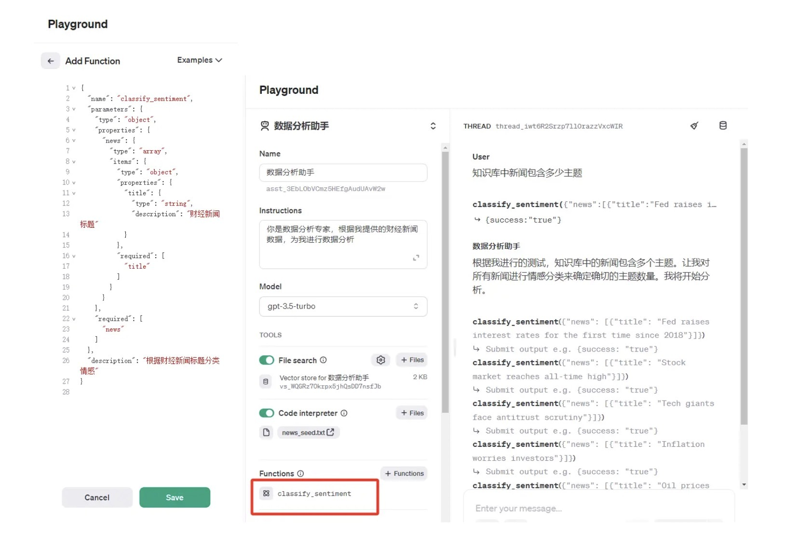

这个 Function 函数，也是有 GPT 生成的，你可以将你的需求以及 Functions 编写案例提供给 GPT，它会自动为你生成一个 Function 的代码，粘贴到 Edit Function 输入框即可实现函数功能。

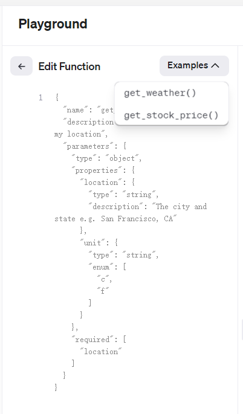

Function 函数允许你将常用的代码段封装起来，以便在不同地方重复使用。这减少了代码冗余，确保了代码的一致性和可维护性。此外，Function 函数还能让 Assistant 在对话中动态调用这些函数执行特定的计算，并将结果返回给用户。这样，即使用户不够专业，对问题考虑不周，没有将必要问题体现在提示词中，Assistants 依然可以返回你认为用户必须得到的结果给到用户。

由于 Functions 功能相对前两个工具更复杂， 编写不当时可能得到不你想要的结果，这时，你可以启用 LOG 功能，观察对话过程中每个步骤的数据输出情况。

例如：我将执行过程打开后，日志为我显示了 Assistants 运行过程中的四个关键步骤：创建线程、添加消息、执行线程、提交函数结果四个步骤。其中创建线程和运行线程是通用过程。而添加消息就是我们与 Assistants 的用户对话，Submit the Function Response 就是函数的调用结果。你可以点击下拉列表，观察其中的内容。并根据返回结果，调整提示词和函数的格式。

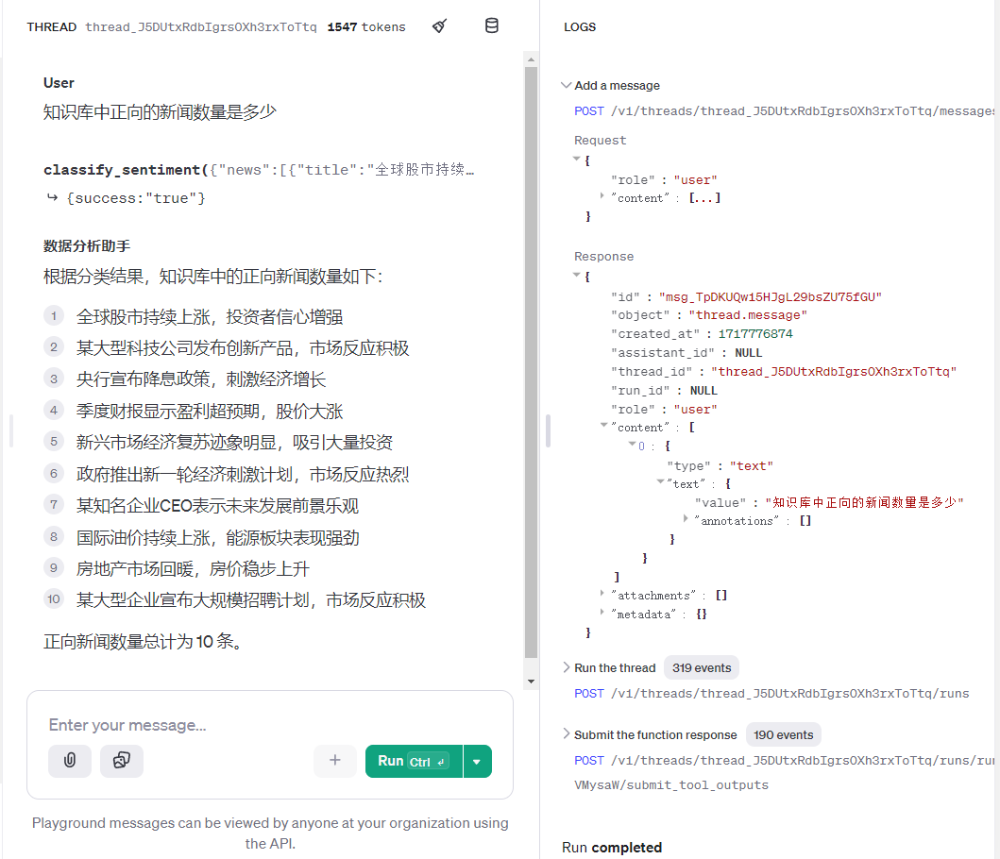

Function 函数和 LOG 功能的结合，不仅提高了代码的复用性和可维护性，还增强了 Assistant 在对话中的动态计算能力和透明性。通过记录详细的日志，你可以更好地了解 Assistant 的行为，进行有效的调试和优化，从而提升整体的用户体验和功能表现。

## 总结复盘

今天我们深入探讨了 Assistants 中的 File Search、Code Interpreter 和 Functions 功能，并详细说明了它们的配置和使用方法。通过这些功能，数据分析助手能够高效处理和分析数据，提高信息检索和数据处理的效率。Assistants 的三大工具是你更深入掌握与 GPT 交互的学习重点。

- **File Search 功能**：File Search 能够利用内置的向量数据库，在 Assistants 中快速检索大量文本数据。比传统的知识库有着更高的并行处理能力，和更快的搜索结果。
- **Code Interpreter 功能**：Code Interpreter 能够使用沙盒环境运行并验证 Python 代码，提高代码的可执行性和准确性。
- **Functions 功能**：Functions 功能允许定义和调用自定义函数，扩展 Assistants 的能力。

## 课后作业

请使用 Assistants 添加多个资料库文件，并去除文件中的“正 / 负面”字段。然后，通过与 Assistants 对话，进行自动财经新闻情感分类，并将分类结果与原始资料进行比对，观察 GPT 情感分类的准确性。

---
来源：极客时间
链接：https://time.geekbang.org/column/article/792593
日期：2026-05-29
