# 24｜全面联网：三种方式让ChatGPT接入网络，提高回答精度-AI数据分析课

点击“展开”查看“精华文字稿”

在结合当前的最新市场趋势分析数据时，你是否经常看见这种“无法提供实时信息”提示？


不联网的大语言模型就像生活在现代的古代人，尤其很多重要的政策和利好消息都不知情，无法为你的外部决策带来有效的分析。

今天，我想为你系统地剖析一下大模型联网的不同解决方案，它们实现起来难易不同，效果也不一。为了方便你学习，我将联网功能按照操作难度分成三个部分：**最简单的内置插件方式、稍难一些的浏览器插件方式，以及比较复杂的 API 方式。**

## **内置插件方式**

内置插件是实现 GPT 联网最简单的方法。这种方式不需要你具备深厚的技术背景，只需安装并启用插件就能实现联网功能。

我们使用的内置插件叫做 “WebPilot 插件”，它能集成在 OpenAI 原生的 GPTs 中和 Coze 国际版中。我来依次为你介绍一下增加插件的步骤。

### GPTs 方式增加插件步骤

- 使用 GPTs，找到联网插件，从左上角找到探索 GPT 按钮点击后，搜索 “Web” 关键字。第一个就是我们需要联网的 “WebPilot 插件”。

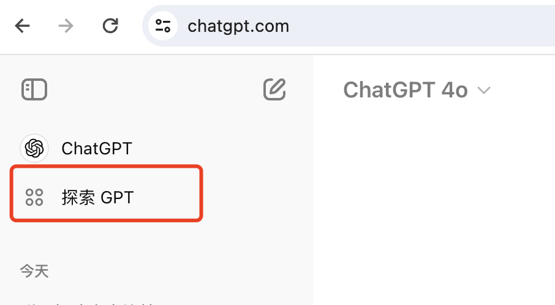

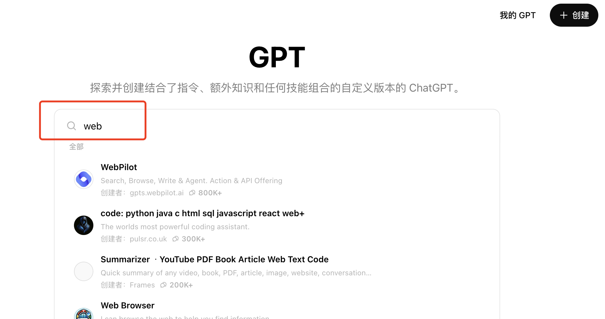

WebPilot 插件的简单原理是将 Prompt 先通过搜索引擎搜索后，将搜索结果与 Prompt 合并再交给 ChatGPT 处理。

- 通过 WebPilot 进行对话。点击“开始聊天”后，你的 ChatGPT 就可以联网查询消息了。

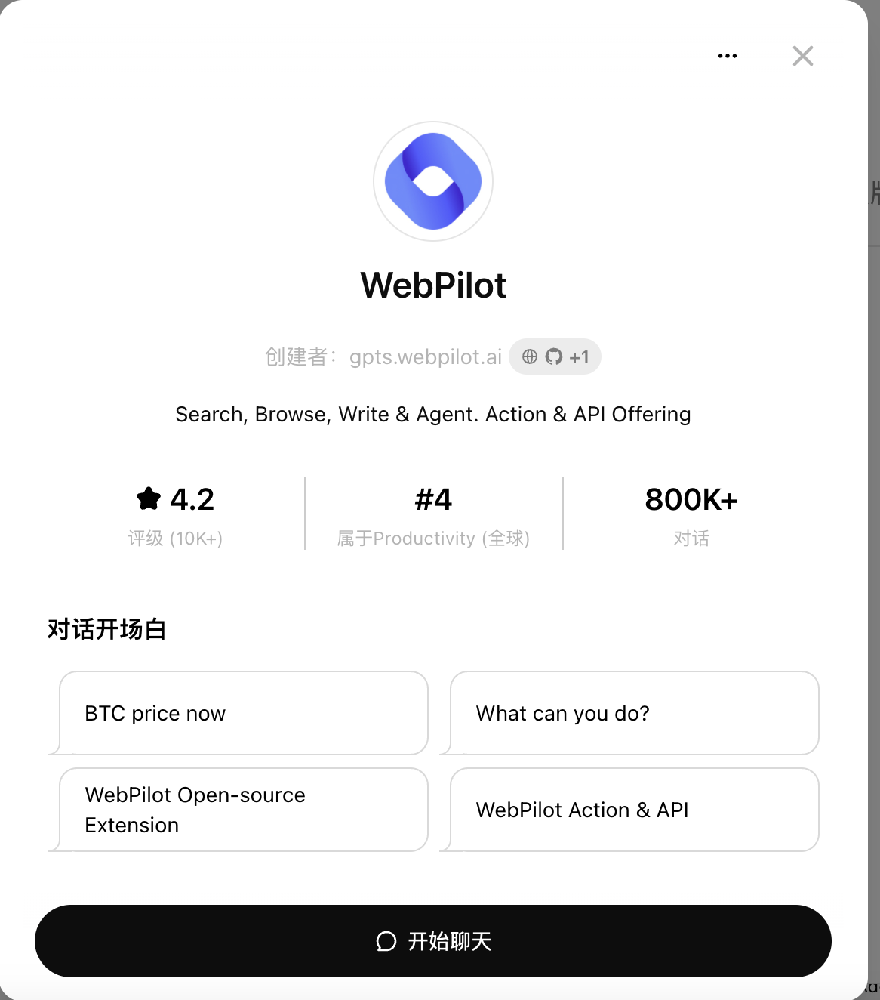

为了便于你进行比较，我统一用 “2024 年 6 月 7 日，中国高考的语文作文题目有几个？分别是什么？”作为问题，来帮你直观地观察联网后的执行结果。

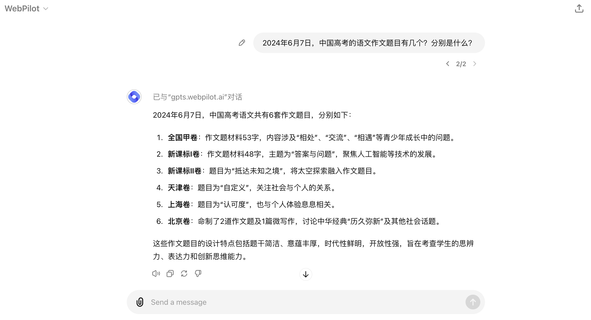

通过 ChatGPT 的回答，我们看到 WebPilot 插件能够准确地从互联网获取资源，并且对结果进行了总结，而不是原样照搬。这使得信息更加简洁和易于理解。

当我追问“新课标 I 卷的原文是什么？”时，ChatGPT 并没有再次访问搜索引擎，而是利用了上下文记忆功能，直接提供了之前查询的结果。这种上下文记忆功能极大地提升了对话的流畅性和效率，避免了重复查询，节省了时间。

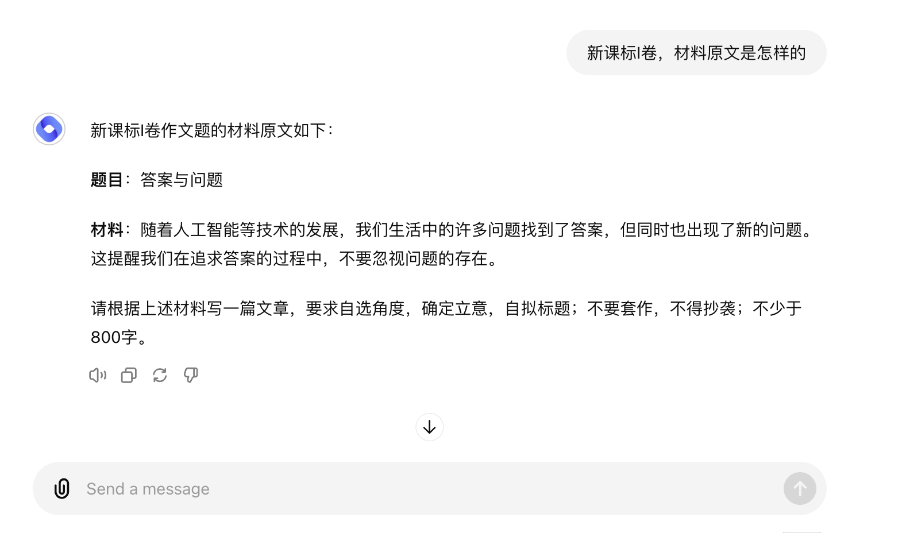

虽然步骤简单，但是我们轻而易举地让 ChatGPT 实现了联网获取实时数据的能力。

接下来我们来看一下 Coze 国际版的类似功能。

### Coze 国际版实现联网的操作步骤

- 新建一个搜索助手


**登录 Coze 国际版**：使用你的账号登录 Coze 国际版平台。
**导航到助手管理界面**：在主菜单中选择“助手管理”选项。
**创建新助手**：点击“新建助手”按钮，按照提示填写助手的基本信息，例如名称、描述等。
- **登录 Coze 国际版**：使用你的账号登录 Coze 国际版平台。
- **导航到助手管理界面**：在主菜单中选择“助手管理”选项。
- **创建新助手**：点击“新建助手”按钮，按照提示填写助手的基本信息，例如名称、描述等。
- 增加 WebPilot 插件


**选择插件管理**：在助手的设置页面中，找到“插件管理”选项。
**添加 WebPilot 插件**：点击“添加插件”按钮，在插件列表中找到并选择 WebPilot 插件。
- **选择插件管理**：在助手的设置页面中，找到“插件管理”选项。
- **添加 WebPilot 插件**：点击“添加插件”按钮，在插件列表中找到并选择 WebPilot 插件。
- 利用 Coze 自动优化的提示词，并采用与 ChatGPT 相同的 GPT-4o 模型，我们可以向 Coze 提出相同的问题，以观察其输出结果。

通过输出结果，我们发现 Coze 也正确加载了 WebPilot 插件。但是回答的结果并不理想。通过前面我们对参数的学习，相信聪明的你一定马上发现了问题，没错，就是它的 tokens 达到了默认的 2048 Tokens，所以答案过于简单。那么，你可以利用我们第 20 讲中介绍的修改参数的方法，增加 Tokens 数量，即可让 Coze 得到搜索到的原文，如果你需要总结文章，需要继续优化角色设定提示词，可以实现与 GPTs 相同的效果。

对比 GPTs 与 Coze 的 WebPilot 调用情况，GPTs 考虑得更周到，Coze 更加灵活。

内置插件的方式是最简单直接的实现大语言模型联网的方法。在多次尝试后，你会发现很多集成 ChatGPT 的工具都能支持 WebPilot 插件，但 GPTs 是最简单和直接的方式。如果你的工作场景是通过 Chat 对话来进行数据分析，需要联网时，我建议你使用 GPTs 方式，能带来最直接有效的信息实时性提升。

## 浏览器插件方式

相比内置插件，浏览器插件稍微复杂一些，但也提供了更多的功能和灵活性。接下来，我将使用 WebChatGPT 插件实现在浏览器中直接获取网页内容并与大语言模型进行交互。

### **WebChatGPT** **插件**

在安装 WebChatGPT 插件之前，你需要为你的系统安装 Chrome 浏览器，可以通过[Chrome 官](https://www.google.com/chrome/)[网](https://www.google.com/chrome/)下载并安装。安装完成后，按照以下步骤进行插件安装。

**安装 WebChatGPT 插件步骤**

- **访问 Chrome 应用商店**

打开 Chrome 浏览器，访问 Chrome 应用商店。在搜索栏中输入 “WebChatGPT” 关键字进行搜索，或者直接访问 [WebChatGPT 插件地址](https://chromewebstore.google.com/detail/lpfemeioodjbpieminkklglpmhlngfcn)。
- **安装插件**

在 WebChatGPT 插件页面，点击“添加至 Chrome”按钮。根据提示完成安装过程。
- **启用插件**

安装完成后，插件会自动跳转到 ChatGPT 界面，界面的样式会发生明显的变化。

**使用 WebChatGPT 插件**

我将插件的界面和安装插件后的界面为你截图，放在下方供你参考。

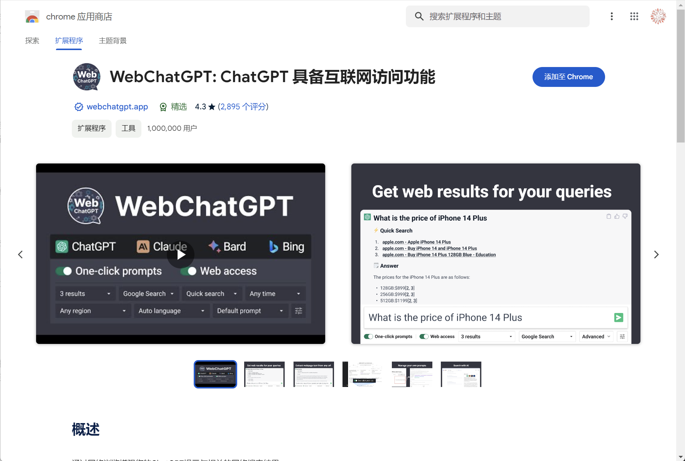

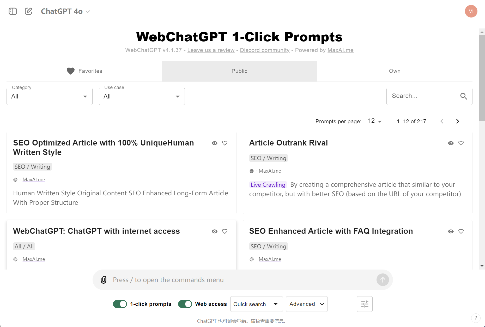

添加插件后，会自动跳转到 ChatGPT 的官方网站，并打开 ChatGPT。你会看到界面中根据用户和功能分类展示了常用的提示词（prompts），你可以根据需要直接使用它们，而无需重新编写。界面下方有两个主要功能。

- **1-click prompts**：支持一键调用提示词，方便快速生成对话内容。
- **Web access 开关**：启用或禁用联网功能，让 ChatGPT 能够实时访问互联网获取最新信息。

我们仍然用 “2024 年 6 月 7 日，中国高考的语文作文题目有几个？分别是什么？”作为提问，来看一下 ChatGPT 如何回答。

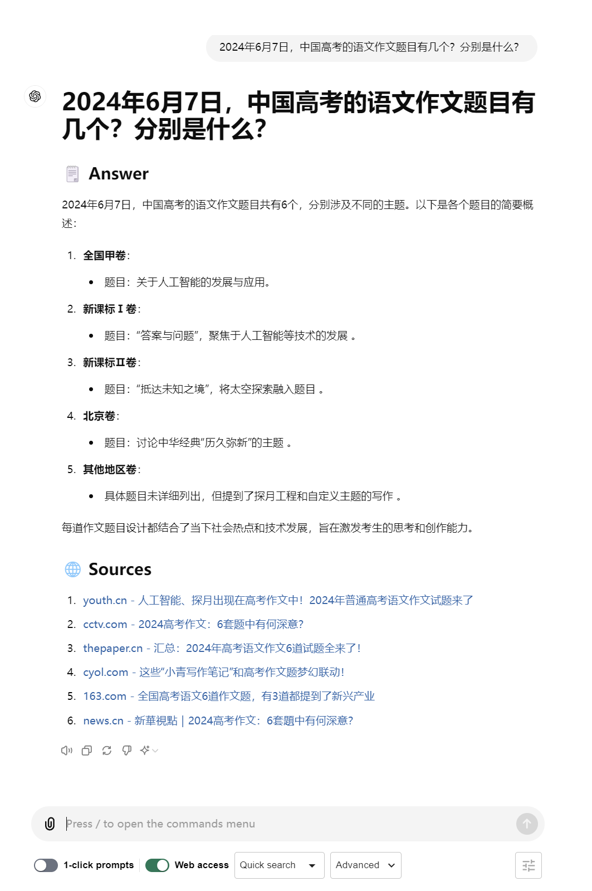

通过截图，ChatGPT 也出色的完成了搜索任务，而且和 GPTs 一样，它为新闻内容进行了总结。而且在下方提供了新闻的链接地址，为你进一步验证消息提供了非常有用的来源信息，你可以人为确认信息的有效性，这是我认为最有价值的能力。

### Bing 国际版

如果你不使用 Chrome 浏览器是否有其他替代方案呢？我推荐你使用必应的国际版来进行搜索。必应国际版不仅可以访问全球最新的资讯，还能通过 Bing Copilot 与 ChatGPT 进行综合查询。下面是具体的操作步骤。

**设置网络和位置**

- 你需要确保你的网络环境能够访问国际网站。
- 打开浏览器，访问[必应国际版](https://www.bing.com/?cc=us)。
- 在访问之前，请将“location”设置项手动更改为美国，以确保你访问的是国际版而非国内版。

**使用必应 Copilot**

- 访问必应国际版后，你会在界面上看到“询问 Copilot”的提示。
- 点击“询问 Copilot”按钮后，你可以向 Copilot 提问。必应会调用 ChatGPT 与必应搜索引擎，为你提供一个综合的结果。

我将操作步骤和结果截图为你放在下方，供你参考。

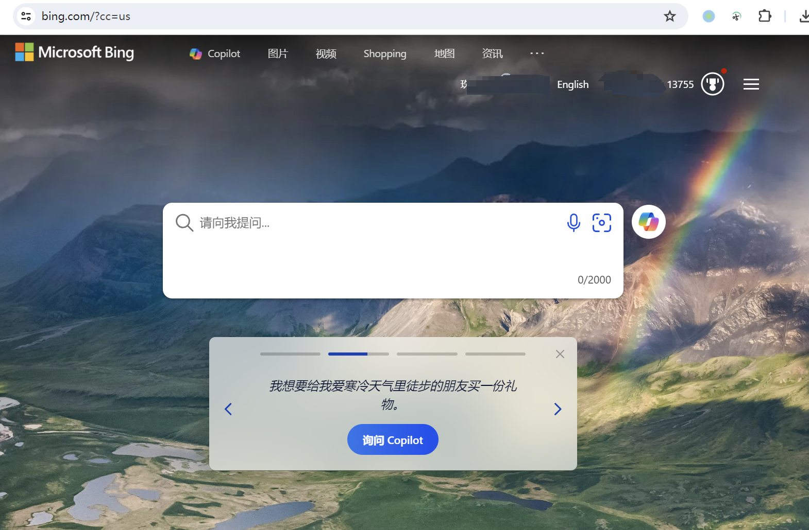

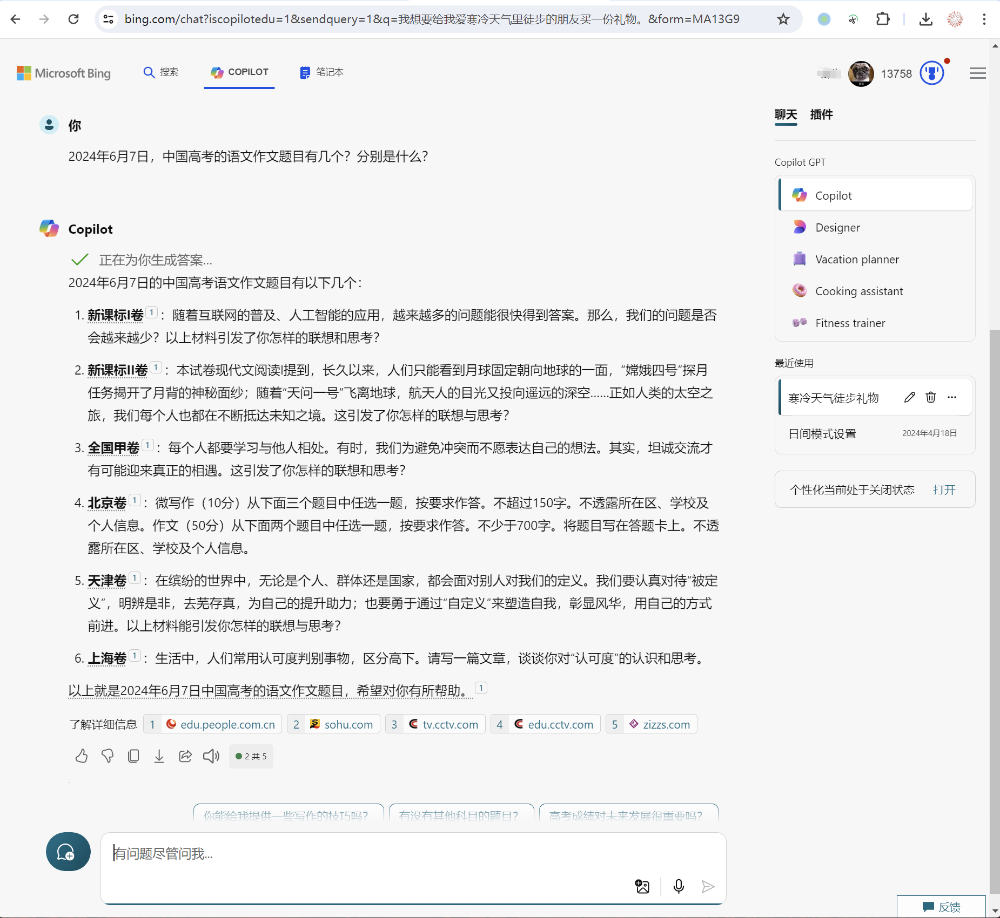

Bing Copilot 也非常出色地完成了网页查找任务，且提供了信息来源。并且它不受浏览器的限制，在任何浏览器都能访问。

通过这些步骤，你可以使用必应国际版实现实时数据获取和智能分析。这种方法不仅简单快捷，还能提供更加丰富和多样化的信息，非常适合需要频繁查询实时数据的用户。

## API 方式

API 方式是实现大语言模型联网的最复杂但也是最灵活的方法。通过 API，我们可以自定义数据源和处理流程，以满足特定的需求。我将使用 OpenAI API 连接网络的代码提供给你。

如果你现在不会编写代码，没有从事开发工作，也不用太着急，先理解代码的思路，有助于你以后的学习。如果你从事开发工作，可以通过代码的逐行注释理解代码的功能。我来为你展示一下代码和它的执行结果。

```
import openai
import requests
# 设置 OpenAI API 密钥
openai.api_key = 'YOUR_OPENAI_API_KEY'
# 定义搜索查询
query = "2024 年 6 月 7 日，中国高考的语文作文题目有几个？分别是什么？"
# 调用 OpenAI API 进行搜索
response = openai.Completion.create(
engine="text-davinci-003",
prompt=f"使用网络搜索查询 '{query}' 并返回结果。",
max_tokens=150
)
# 打印 OpenAI API 的响应结果
print("OpenAI API 响应结果:")
print(response.choices[0].text.strip())
# 使用 Bing 搜索 API 进行搜索
bing_api_key = 'YOUR_BING_API_KEY'
bing_search_url = f"https://api.bing.microsoft.com/v7.0/search?q={query}"
headers = {"Ocp-Apim-Subscription-Key": bing_api_key}
# 发送搜索请求
response = requests.get(bing_search_url, headers=headers)
# 解析和打印 Bing API 的搜索结果
bing_results = response.json()
print("Bing 搜索结果:")
for result in bing_results['webPages']['value']:
print(result['name'], result['url'])
print(result['snippet'])
print()
```

我来为你解释一下上面流程中的关键代码。

首先代码中使用了两个库，openai 和 requests。

`openai` 用于调用 OpenAI 的 API。`requests` 用于发送 HTTP 请求。这两个都是第三方库，需要你手动安装，如果你的 python 环境没有安装这两个库，可以使用如下命令安装。

```
pip install openai requests
```

代码中还需要你使用两个密钥，分别是 “openai.api_key” 与 “bing_api_key”，它们分别是访问 OpenAI 和 Bing 接口的唯一标识，你需要分别从两个网站注册并申请。注意密钥要严格保密。

接下来就是核心的向 OpenAI 发起请求和向 Bing 发起请求功能。

```
response = openai.Completion.create(
engine="text-davinci-003",
prompt=f"使用网络搜索查询 '{query}' 并返回结果。",
max_tokens=150
)
```

调用 OpenAI 的 Completions API，生成搜索查询的响应。

`engine` 指定使用的模型。

`prompt` 设置为我们的搜索查询的内容。

`max_tokens` 指定生成的最大 tokens 数量，在 Coze 的使用中，我们也遇到了需要调整最大 tokens 的问题。

我们再来看一下 Bing 的查询代码。

```
bing_api_key = 'YOUR_BING_API_KEY'
bing_search_url = f"https://api.bing.microsoft.com/v7.0/search?q={query}"
headers = {"Ocp-Apim-Subscription-Key": bing_api_key}
# 发送 GET 请求到 Bing 搜索 API
response = requests.get(bing_search_url, headers=headers)
```

设置 Bing 搜索 API 密钥和请求 URL。

将 `YOUR_BING_API_KEY` 替换为你的 Bing API 密钥。

`bing_search_url` 设置为 Bing 搜索 API 的 URL，包含我们的查询参数。

`headers` 设置包含我们的订阅密钥，用于验证 API 请求。

这两段代码连在一起的作用就是通过 prompt 告诉 OpenAI，我要“使用网络搜索查询”功能了，你要调用 Bing 的查询地址，查询时使用专有的 key 和查询的内容（query），查询后把结果返回给 OpenAI，让我进一步处理。

最后，解析和打印 Bing API 的搜索结果。

```
bing_results = response.json()
print("Bing 搜索结果:")
for result in bing_results['webPages']['value']:
print(result['name'], result['url'])
print(result['snippet'])
print()
```

将 Bing API 的响应解析为 JSON 格式。

遍历搜索结果并打印每个结果的名称、URL 和摘要。

这段代码，你可以自行编写，也可以通过 [Bing 的 API 文档](https://github.com/Azure-Samples/cognitive-services-REST-api-samples/blob/master/python/Search/BingWebSearchv7.py)让 ChatGPT 为你编写相应的代码。

通过上述代码，你可以使用 OpenAI API 和 Bing 搜索 API 进行查询，并获取到有关 2024 年 6 月 7 日中国高考语文作文题目的搜索结果。由于我们没有过多处理结果，因此显示的内容比较简化，我将 bing 得到的结果也为你放在下方，方便你比较三种方式的差异。

```
OpenAI API 响应结果:
根据查询，2024 年 6 月 7 日，中国高考的语文作文题目如下：
1. 题目 A：探讨人工智能的发展与人类的未来。
2. 题目 B：描写嫦娥四号登月的过程及其意义。
3. 题目 C：以“自定义”为主题，叙述个人成长经历中的重要时刻。
Bing 搜索结果:
2024 高考作文题目汇总 - 中国新闻网
https://www.chinanews.com.cn/gn/2024/06-07/10230181.shtml
2024 年高考作文题目已经公布，包括多个不同的题目，详细内容如下...
2024 年高考语文全国卷作文试题解析 - 光明网
https://difang.gmw.cn/2024-06/08/content_37370523.htm
教育部发布 2024 年高考语文全国卷作文试题解析，包括对每个题目的详细解释...
2024 高考作文：6 套题中有何深意？ - CCTV 新闻
https://news.cctv.com/2024/06/08/ARTIxzwGsbguX8eSCypcaSHM240608.shtml
2024 年高考语文作文题目涉及多个领域，包括人工智能、嫦娥四号等...
```

最后还要提醒你，确保在运行此代码之前，将你的 OpenAI 和 Bing API 密钥替换为实际的密钥。

## **总结复盘**

这一讲我们介绍的三种方法，你可以根据自身的需求和技术背景选择最适合的联网解决方案。每种方法都有其独特的优势和适用场景，关键在于找到最适合自己的那一种。

我将三种联网方法的优点、缺点、适用场景为你总结成了一个表格。

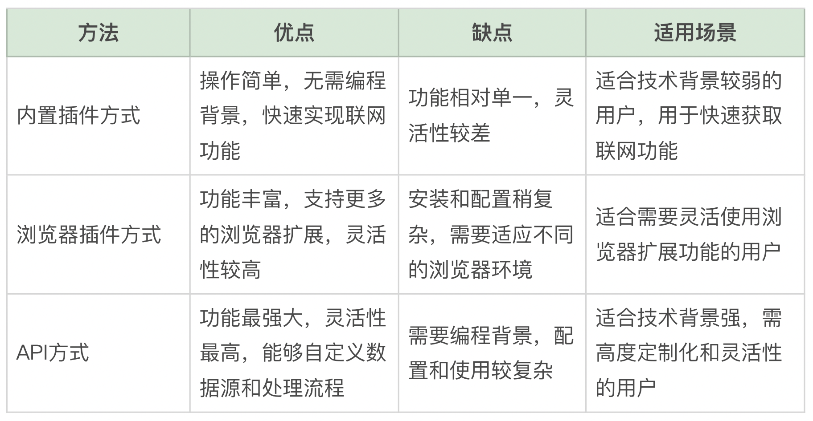

## 课后作业

请你用以上任意一种方式为 ChatGPT 联网，并以 “AI 最新突破如何助力数据分析”为标题，生成一篇综述文章，包括具体的方法步骤、应用场景以及相关的实例分析。

---
来源：极客时间
链接：https://time.geekbang.org/column/article/794469
日期：2026-05-29
