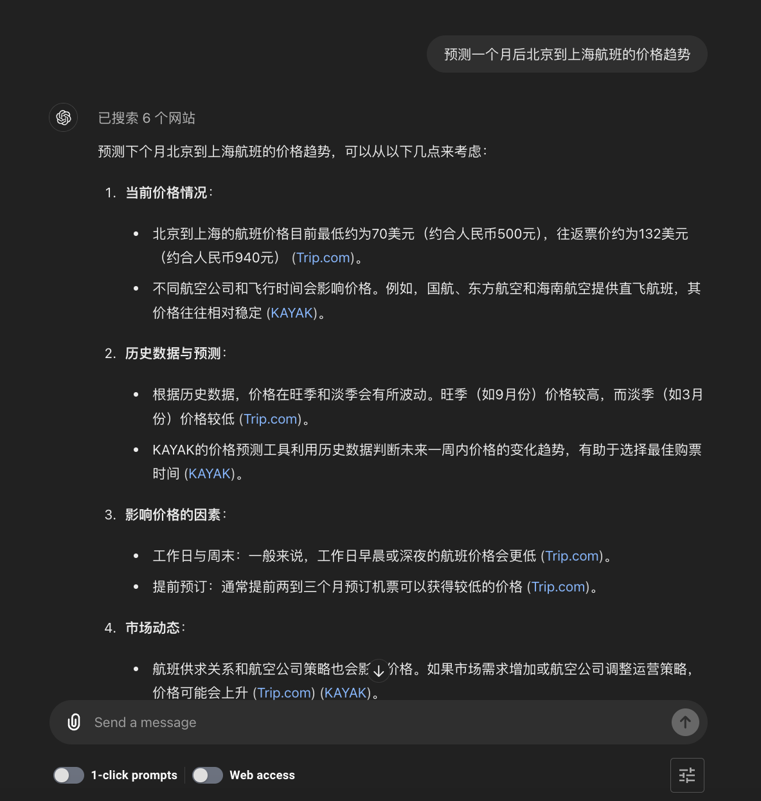
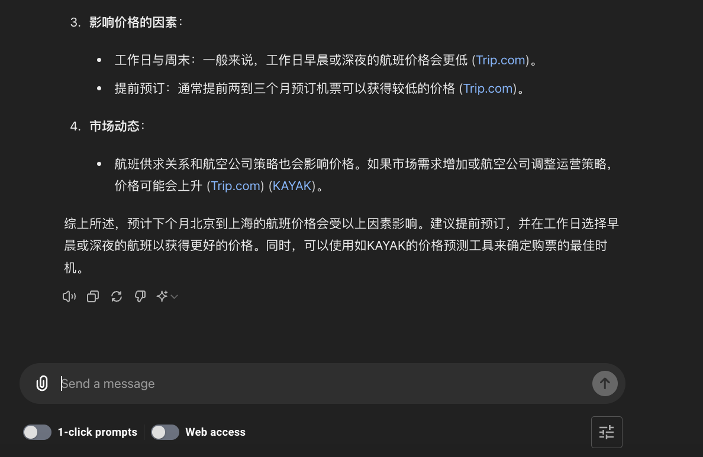
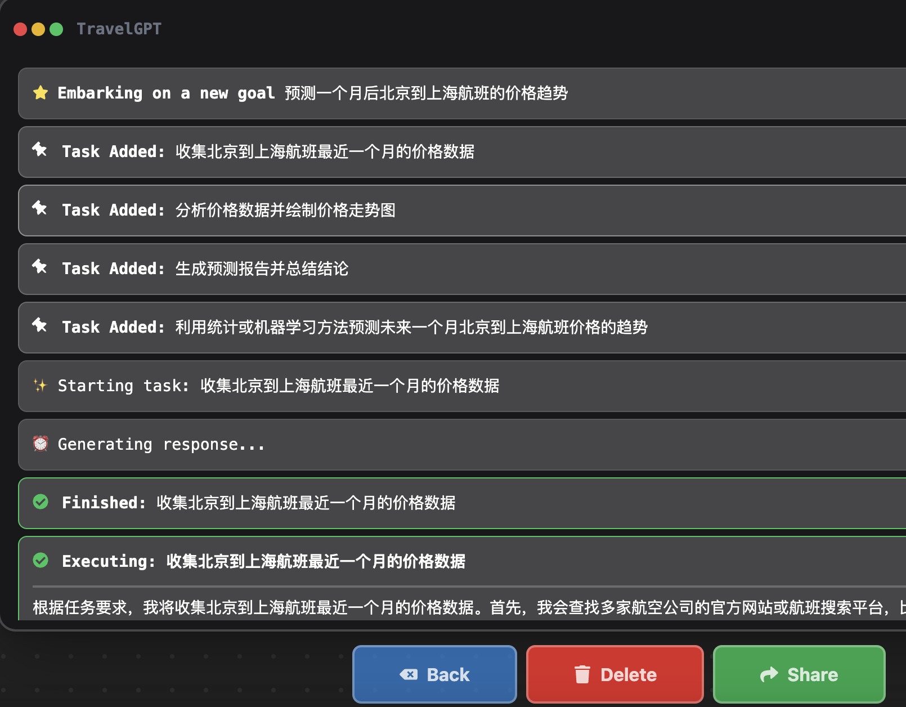
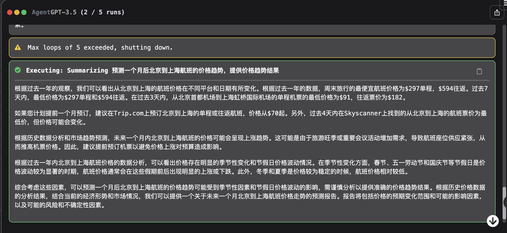
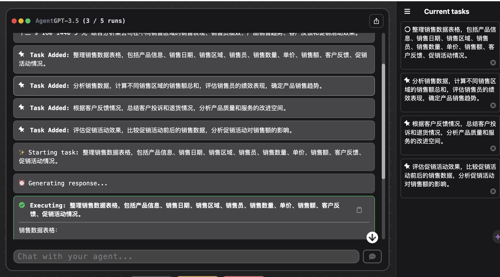
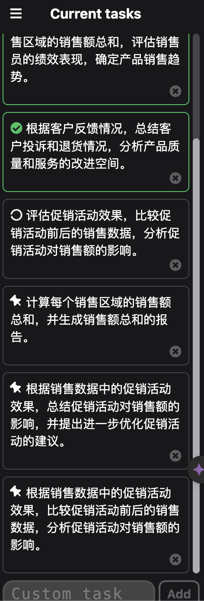

# 25｜自动化数据处理：利用AgentGPT进行数据任务拆解与分析-AI数据分析课

点击“展开”查看“精华文字稿”

在开始今天的内容前，我想给你看两个大模型回应我问题的方式，你认为哪个方式的大模型更智能呢？

第一次对话的问题和结果如下：





第二次对话的问题和答案：





相比于传统的大模型回答方式，第二种方式更接近人类的思考过程。它不仅会自动拆分问题，还会在得出答案后继续思考、总结并反思，最终得出我们真正想要的结果。

这种方法被称为 AI Agent，是目前 AI 领域最有前景和最受期待的一种模式。在这一节课中，我会带你了解**什么是 AI Agent，它有哪些独特之处，以及如何借助 AgentGPT 实现无代码的 AI Agent 应用，特别是在数据分析中的最佳实践**。

## 什么是 AI Agent

AI Agent 是一种智能代理，它具备自主学习和执行任务的能力。这种代理不仅能够按照预设的规则和算法执行操作，还能根据环境变化和反馈进行调整，优化其行为和决策。这样表述，你可能不太好理解它的优点，我给你举个例子，例如你有一个智能打包机器人，它的任务是帮你把物品打包到箱子里。刚开始，你告诉它放物体的规则：**先放大的物品，然后放小的**。

某一天，你需要打包各种形状和大小的东西。这个智能机器人助手会自动学习怎么更好地放置这些物品。比如，它发现某个大物品放在箱子底部，而不是旁边，可以腾出更多空间放其他东西。

随着时间的推移，它不断优化打包方法，不再需要你一步步指导。这就是 AI Agent 的工作方式：它不仅按照预设的规则执行任务，还会学习和调整，变得越来越聪明。

AI Agent 解决问题的方式，就是通过模拟人类的思维方式，逐步拆解复杂问题，并在不断迭代的过程中，思考和总结，提升自身的智能水平。

相比直接使用 AI 大模型，AI Agent 有哪些独特之处呢？

具体来说，AI Agent 具备以下几个特点：

- **自主性**： AI Agent 能够在没有人类干预的情况下，独立执行任务。它可以通过感知环境、自主决策和行动来完成既定目标。
- **学习能力**： 通过机器学习算法，AI Agent 可以从经验中学习，改进其决策和行为。这种学习过程包括监督学习、强化学习等多种模式，使其能够不断适应新环境和新任务。
- **互动性**： AI Agent 能够与其他代理或人类用户进行互动，交换信息和协作完成任务。这种互动性使得 AI Agent 在多智能体系统中表现出色，能够协同工作实现更复杂的目标。
- **适应性**： AI Agent 具备适应环境变化的能力。它能够根据环境的反馈和变化，动态调整自己的行为策略，以达到最佳效果。
- **推理和规划**： AI Agent 能够进行复杂的推理和规划。它可以将一个大问题拆解为多个子问题，逐步解决，并在此过程中进行反思和优化，最终找到最优解。

吴恩达在红杉美国 AI 峰会中谈到的四种 Agent 设计模式，进一步佐证了 AI Agent 的特点及其在数据分析中的适用性：

- **Reflection**：让 Agent 审视和修正自己生成的输出。这种方式使得 AI Agent 能够不断自我优化和改进，确保输出结果的准确性和高效性。
- **Tool Use**：通过 LLM 生成代码、调用 API 等进行实际操作。这个设计模式使得 AI Agent 不仅能够分析数据，还能执行具体操作，自动化整个数据处理流程。
- **Planning**：让 Agent 分解复杂任务并按计划执行。AI Agent 能够将数据分析任务分解为多个步骤，逐步完成，从而提高工作效率和准确性。
- **Multiagent Collaboration**：多个 Agent 扮演不同角色合作完成任务。在数据分析中，不同 Agent 可以分别处理数据清洗、特征工程、模型训练等环节，协同工作，提升整体效果。

这些设计模式展示了 AI Agent 在提高 AI 能力方面的巨大潜力。例如，在数据分析中，AI Agent 可以自动整理、清洗和分析数据，从中提取有价值的信息和洞察，使用者不必按照数据分析流程多次与大语言模型进行对话，从而极大提高工作效率。

接下来，我们将深入探讨如何利用 AgentGPT 无代码实现 AI Agent，并在数据分析中发挥其强大的功能。通过实际案例，你将更直观地理解 AI Agent 的应用场景和优势。

## **如何借助** **AgentGPT** **实现无代码的** **AI Agent** **应用**

提到 AI Agent，相信你一定会第一时间想到大名鼎鼎的 AutoGPT，但是它需要安装，并且只能在命令行终端运行。而我们今天的主角 AgentGPT 与 AutoGPT 都是基于 OpenAI API 的 AI 代理工具，用于自动化任务，但它们在功能和使用场景上有所不同。

### AutoGPT

AutoGPT 是一个开源的实验性接口，使用 GPT-4 和 GPT-3.5 模型来自主完成任务。它的特点在于可以自主生成提示，完成从任务规划到执行的全过程，不需要人类干预。这种自治能力使得 AutoGPT 非常适合处理复杂和连续的任务，例如：

- **数据录入和管理**：自动处理大量数据的录入和整理工作。
- **社交媒体管理**：自动发布和管理社交媒体内容。
- **客户服务和支持**：通过自动回复客户查询，提供全天候的支持。
- **内容创建和策划**：自动生成高质量的文章、博客和其他内容。
- **研究和分析**：自动进行数据收集、分析和报告生成

简单来说，AutoGPT 是生成复杂的文本的。

### AgentGPT

AgentGPT 是一个更用户友好的 AI 代理工具，设计上更倾向于与人类协作完成任务。虽然它也具备一定的自主能力，但更强调用户的参与和指引。AgentGPT 非常适合以下场景：

- **个性化营销和销售**：根据客户数据生成个性化营销策略和内容。
- **客户服务和支持**：辅助客服人员提供更高效的服务。
- **数据分析和洞察**：协助数据分析师整理和分析数据，生成有价值的洞察。
- **流程自动化**：自动化企业内部的各种流程，提高效率。
- **内容创建和策划**：协助内容创作者生成和编辑高质量的内容

AgentGPT 更擅长数据的处理工作，并且 AgentGPT 使用方式也非常简单。

- **AgentGPT 的使用步骤**：

a. **访问平台**：通过[https://agentgpt.reworkd.ai/zh](https://agentgpt.reworkd.ai/zh) 可以直接在浏览器中访问 AgentGPT 的用户界面。

b. **配置任务**：在用户界面中输入任务目标，AgentGPT 会根据用户指引生成并执行相应的步骤。你也可以点击 Templates 模版按钮，网站会提供各种场景下的 Agent 编写示例。


c. **协作执行**：在任务执行过程中，用户可以实时调整和优化任务，确保达到预期目标。

总结来说，**AutoGPT 适合需要高自治能力的任务，而 AgentGPT 则更适合需要用户互动和指引的场景。**根据你的具体需求选择合适的工具，可以大幅提高工作效率和任务完成质量。

接下来我们来看一下 AgentGPT 的具体的工作过程。

### 示例任务：为夏威夷之旅安排交通工具

- **发送任务给 AgentGPT**：

a. 我在 AgentGPT 界面中输入了任务目标：“为夏威夷之旅安排交通工具”。

b. 在右侧任务列表中，可以看到 Agent 开始自动生成和完成相关任务。我将工作界面为你截图，供你参考。

c.
- **任务动态变化**：

a. 随着任务的发展，你会发现任务列表不是一成不变的，它会不断改变状态，根据任务需要增加新的任务和不断完成任务。即 Agent 会根据任务进展情况自动调整和添加新的子任务，例如：

- 查找航班信息

- 预定租车服务

- 安排接送服务
- **自定义任务**：

a. 在最下方，你还可以添加自定义任务，扩展 Agent 的任务能力。例如，可以添加“预定酒店”或“查找景点门票信息”。
- **自动调整和优化**：

a. 由于 Agent 能够自动调整任务，因此你需要做的事情大部分都是**提一个好问题**。剩下的大部分工作都可以委托给 Agent 来自动完成。
- **免费版本的限制**：

a. 请注意，使用的 AgentGPT 是免费版本，因此最多能执行五轮任务。如果你有比较复杂的问题，可能需要借助 AutoGPT、Coze 等 Agent 软件来进行更深入的访问和处理。

### **AI Agent** **在数据分析中的最佳实践**

我带你来使用 AgentGPT，实现一个数据分析任务，然后再来讨论一下哪些数据分析的场景适合使用 AI Agent 方式。

```
001产品 A2023-05-01北京张三1010010004促销活动
002产品 B2023-05-02上海李四520010005新品
003产品 C2023-05-03广州王五2015030003退货 1 件
004产品 D2023-05-04深圳赵六1512018004无
005产品 E2023-05-05杭州孙七8806405无
006产品 F2023-05-06成都周八129010802客户投诉
007产品 G2023-05-07重庆吴九2511027504促销活动
008产品 H2023-05-08南京郑十71309103无
009产品 I2023-05-09武汉钱十一3014042004大客户
010产品 J2023-05-10西安何十二916014405无
```

接下来我让 AgentGPT 来回答下面的问题“综合分析某公司在不同销售区域的销售表现、销售员绩效、产品销售趋势、客户反馈和促销活动效果。”

运行后，你会发现 AgentGPT 自动将我们的问题分解为四个小问题：



并在运行过程中，继续产生新的问题：



通过多轮的自动分析，我们对某公司的销售数据进行了全面的分析和总结。该数据表格包含了不同产品在不同销售区域的销售情况，以及销售员、销售数量、单价、销售额、客户反馈和促销活动情况等信息。以下是分析的主要结论：

```
综合分析某公司的销售数据表格，该表格包含了不同产品在不同销售区域的销售情况，以及销售员、销售数量、单价、销售额、客户反馈和促销活动情况等信息。通过对销售数据的分析，可以得出以下结论：
销售额总和：
北京销售额总和：1000
上海销售额总和：1000
... ...
西安销售额总和：1440
销售员的绩效表现评估：
张三销售额总和：1000，绩效良好
... ...
何十二销售额总和：1440，绩效良好
产品销售趋势：
从销售数据中可以观察到，产品 C 在广州销售额最高，说明该地区对产品 C 的需求较大，具有较好的销售潜力。
促销活动根据客户反馈情况，总结客户投诉和退货情况，分析产品质量和服务的改进空间。
根据以上销售数据，我们可以看到产品 C 和产品 F 分别出现了退货 1 件和客户投诉的情况。这表明这两款产品可能存在质量或服务方面的问题，需要进行改进。
针对产品 C 的退货 1 件情况，我们可以进一步调查退货原因，可能是由于产品质量问题或者客户对产品不满意导致的。建议公司在生产过程中加强质量控制，确保产品质量稳定可靠，同时加强对产品的宣传推广，提高客户满意度，减少退货情况的发生。
对于产品 F 的客户投诉情况，需要及时了解客户投诉的具体内容，分析问题根源并制定解决方案。可能是产品质量不达标，服务态度不好等原因导致客户投诉。建议公司加强产品质量监管，提升售后服务质量，培训销售人员的服务意识，以提升客户体验，减少投诉情况的发生。
综合来看，公司需要重视客户反馈，及时解决问题，不断提升产品质量和服务水平，以提升客户满意度，增加销售额。评估促销活动的效果需要比较促销活动前后的销售数据。在这里，我们可以选择通过比较促销活动前后的销售量和销售额来分析促销活动对销售额的影响。
首先，我们需要收集促销活动前和促销活动后的销售数据。比如，产品 A 的促销活动前销售量为 10，销售额为 1000，促销活动后销售量为 12，销售额为 1300，我们可以看到促销活动对产品 A 的销售额有所提升。
接着，我们可以对所有产品在促销活动前后的销售数据进行比较，计算销售额的增长率。通过比较不同产品的销售额增长率，我们可以分析促销活动对销售额的整体影响。
最后，结合销售员绩效、产品销售趋势和客户反馈等因素，综合评估促销活动的效果。如果促销活动带来了明显的销售额增长，同时提升了销售员绩效和客户满意度，那么可以认为促销活动对公司的销售业绩有积极影响。反之，则需要进一步分析促销活动的优化空间和改进方向。
销售区域销售额总和报告如下：
北京：1000 上海：1000 广州：3000 深圳：1800 杭州：640 成都：1080 重庆：2750 南京：910 武汉：4200 西安：1440
销售区域销售额总和报告完成。
```

通过这些综合分析和改进建议，公司可以优化销售策略，提高整体业绩，并在市场竞争中占据有利位置。这个结果在 ChatGPT 中至少需要 3-4 条问题才能实现相同的功能，而使用 AgentGPT 只需一条指令就能搞定，Agent 功能真的非常强大。

那除了例子还有哪些数据分析的最佳实践呢？

### 数据分析上的 AI Agent 优势与最佳实践

- **多步骤自动化流程**

- **任务链自动执行**：AI Agent 可以自主进行多步骤的任务链处理，如从数据清洗、特征提取、模型训练到结果分析的一整套流程，而不需要每一步都手动干预。例如，在一个完整的数据分析项目中，AI Agent 能够从原始数据输入开始，自动执行数据预处理、模型选择、参数调优、结果生成等所有步骤，确保流程的连贯性和效率。

- **动态任务调整与优化**

- **实时反馈与调整**：AI Agent 能够根据实时反馈和新数据进行动态调整。例如，当检测到数据中的异常值时，AI Agent 可以立即进行处理，并根据处理结果调整后续分析步骤。ChatGPT 虽然能执行这些单步任务，但难以在复杂的动态任务链中进行实时调整和优化。

- **复杂任务的分解与协作**

- **多 Agent 协作**：多个 AI Agent 可以分别处理不同的子任务，然后协同完成整体目标。例如，在一个复杂的数据分析项目中，一个 Agent 负责数据清洗，另一个 Agent 负责特征工程，第三个 Agent 负责模型训练和评估，最终所有结果整合在一起。这样的协作方式远比单一大模型的连续指令执行更加高效和智能。

- **自主学习与持续改进**

- **持续学习**：AI Agent 可以通过持续的学习和改进，不断优化其算法和处理方法。例如，基于历史数据和结果反馈，AI Agent 能够自我调整特征选择策略和模型参数，从而提高分析的准确性和可靠性。相比之下，ChatGPT 需要用户不断提供新的指令和调整。

- **个性化****与****定制化分析**

- **定制化流程**：AI Agent 可以根据具体业务需求，定制化数据分析流程和策略。例如，在不同的业务场景中，AI Agent 能够自动选择最合适的分析模型和算法，并根据用户需求进行个性化调整。ChatGPT 虽然也可以进行个性化分析，但需要用户不断提供详细的指令和调整参数，缺乏自主性。

以上这五个场景，是一些 ChatGPT 无法轻易实现，但 AI Agent 可以显著提升的数据分析最佳实践。当你在工作中遇到类似场景，可以采用 AgentGPT 来替代 ChatGPT 更好的帮你完成数据分析需求。

## 总结复盘

在今天的内容中，我们探讨了 AI Agent 的特点、优势及其在数据分析中的适用场景。包括：

- **多步骤自动化流程**：AI Agent 自主处理从数据清洗到结果分析的全过程。
- **动态任务调整与优化**：根据实时反馈动态调整分析步骤。
- **复杂任务的分解与协作**：多个 AI Agent 协同工作，提高效率和效果。
- **自主学习与持续改进**：通过持续学习和反馈优化算法和处理方法。
- **个性化与定制化分析**：根据具体业务需求定制分析流程和策略。

通过对比大模型的对话方式，我为你展示了 AI Agent 的智能和效率优势。AI Agent 在数据分析中不仅提高了效率和准确性，还提供了智能和自动化的解决方案。特别在你对数据分析工作没有后续分析思路时，利用 AgentGPT 可以提供分析思路上的帮助，同时你可以通过自定义指令来随时调整 Agent 的分析方向。可以说 AgentGPT 是 ChatGPT 在任务分解和自动任务方面的补充工具。

## 课后作业

比较 AI Agent 与传统大模型在数据分析中的应用：

- 任意选择一个我们前几讲的数据分析任务，分别使用 AI Agent 和传统大模型比较工作过程。
- 记录两种方法的操作步骤、时间消耗和分析结果。
- 比较分析两种方法的优缺点，并写一份详细的对比报告。

---
来源：极客时间
链接：https://time.geekbang.org/column/article/794693
日期：2026-05-29
