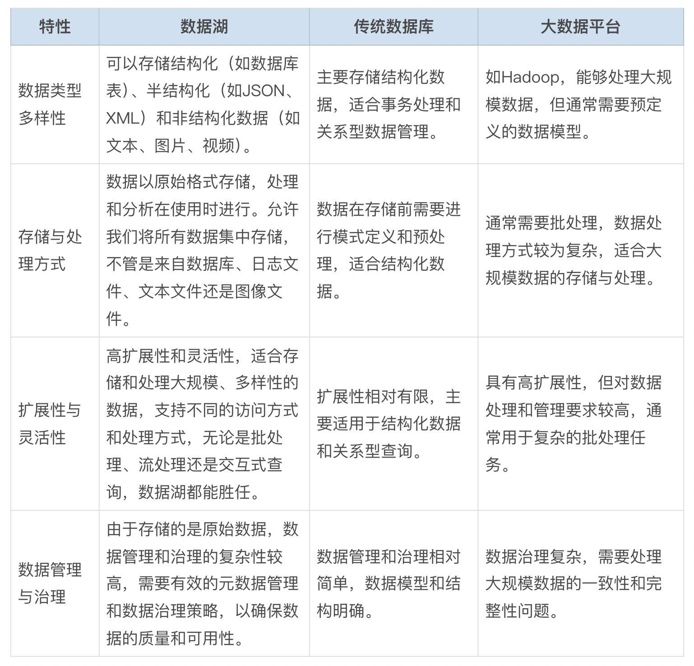

# 26｜数据一体化：集成不同来源的数据资产，打造统一数据湖支持大模型分析-AI数据分析课

今天我们来聊聊构成 AIGC 三大主要部分之一的“数据”。我们将探索如何通过集成不同来源的数据资产，打造一个支持大模型分析的统一数据湖。这话题听起来不小，但别担心，我会用最通俗易懂的方式带你了解其中的奥秘。

在大数据时代，企业和组织面临着海量的数据，这些数据分布在不同的系统、格式和位置。为了有效地管理和利用这些数据，我们需要将它们整合到一个统一的数据湖中。这不仅可以提高数据分析的效率，还可以为大模型分析提供强大的支持。

那么什么是数据湖，它和传统的数据库、大数据有哪些不同，构建数据湖又对利用大模型进行数据分析有哪些强大助力，以及如何构建一个数据湖呢？

## 数据湖的概念

数据湖（Data Lake）就是一个存放海量数据的地方，不管是结构化的还是非结构化的，通通都可以往里放。这个概念由 James Dixon 提出，他形象地将数据仓库比作瓶装水，而数据湖则像一个自然湖泊，任何形式的水都可以直接流入。数据湖允许我们将所有数据集中存储，不管是来自数据库、日志文件、文本文件还是图像文件。

这么做的好处是，你可以在一个地方搞定所有数据分析的需求，不再需要到处找数据。数据湖不仅支持存储不同类型的数据，还支持不同的访问方式和处理方式。无论是批处理、流处理还是交互式查询，数据湖都能胜任。

那么你可能有疑问了，数据湖是软件吗？它和 MySQL、Hadoop 有什么区别和联系呢？

## **数据湖与传统数据库、大数据平台的区别**

数据湖并不是一种具体的软件，而是一种数据存储和管理的架构和理念。它利用多种技术和工具来实现海量、多样性数据的存储、管理和分析。因此，你不能用 MySQL、Hadoop 等软件与数据湖相提并论。

我根据特性，为你整理了一张表格，帮你对比他们之间的关系。



知道了数据湖与传统数据库和大数据平台的差异后，接下来我们聊聊为什么数据湖成为越来越多企业的选择。特别是在金融机构中，数据湖通过集成各种类型的数据，实现了大规模模型分析。那么，传统的数据库和大数据平台在 AI 数据分析中存在哪些明显的缺点呢？

## 数据湖的实际应用案例：金融机构的数据湖实践

实际上，很多大公司已经通过数据湖实现了大规模模型分析。例如，一些金融机构通过整合交易数据、客户数据和市场数据，建立了一个统一的数据湖，用于实时风险管理和预测分析。

为什么没有采用传统的数据库呢？

一个是数据类型限制。传统数据库主要存储结构化数据，这意味着它们在处理半结构化和非结构化数据时效率低下。例如，金融机构的交易数据、客户反馈、市场报告等数据常常以非结构化形式存在，如文本文件、图像文件和音频文件。传统数据库在存储和管理这些数据时，需要进行复杂的预处理和格式转换，导致数据管理成本增加，效率降低。

另一个是存储与处理方式不适合大模型。传统数据库需要在数据存储前进行模式定义和预处理，这种 Schema-on-Write 的方法虽然保证了数据的一致性和完整性，但缺乏灵活性。金融机构需要实时处理和分析的数据，例如实时交易监控和风险管理，传统数据库在处理这些实时数据时效率较低，无法满足实时分析的需求。

大数据平台同样有着大模型数据处理的局限性。

如 Hadoop 能够处理大规模数据，但在数据处理方式和数据模型上存在局限性，大数据平台通常采用批处理方式，如 MapReduce，这种方式虽然适合处理大规模数据，但在处理实时数据时显得笨拙。例如，金融机构需要对交易数据进行实时监控和分析，以便及时发现和应对异常交易。Hadoop 等大数据平台在这种场景下往往表现出处理延迟，无法实现实时分析。

大数据平台通常需要预定义的数据模型，适合结构化数据的批量处理。金融机构的市场数据和客户数据常常是非结构化和半结构化的，需要灵活的数据模型来支持多样化的数据处理需求。大数据平台在处理这些数据时，需要进行复杂的模式定义和转换，增加了数据管理的复杂性。

## 数据湖的优势

而数据湖能够集成来自不同来源的数据，提供一个统一的数据视图，确保数据的一致性和完整性。比如，金融机构可以通过数据湖将交易数据、客户数据和市场数据统一存储和管理，实现数据的集中查询和分析。这样，不仅可以实时监控交易情况，发现异常交易，还可以结合市场数据进行综合分析和预测，提高风险管理和决策的准确性。

最主要的是，数据湖允许数据保持原始状态，提供灵活的处理方式，支持多种数据分析需求。金融机构可以根据具体需求，灵活地对不同类型的数据进行处理和分析，例如对客户行为数据进行个性化分析，优化营销策略；对市场数据进行趋势分析，制定投资策略。这种灵活性使得金融机构能够快速响应市场变化和客户需求，提升业务敏捷性和竞争力。同时数据湖兼具一致性、灵活性和大规模数据分析能力，让它更适合应用在交易数据管理、客户数据整合和市场数据综合分析当中。

既然数据湖能够对 AI 大模型分析数据有帮助，那么有没有简单且功能强大的数据湖构建方法呢？

我们可以借助开源软件来构建数据湖，比如 Apache Hudi、Delta Lake 和 Apache Iceberg。

- **Apache Hudi**：由 Uber 的工程师设计，用于满足其内部数据分析需求。Hudi 提供了快速的 upsert/delete 以及 compaction 功能，解决了数据更新和管理的痛点。通过 Hudi，你可以高效地处理增量数据更新，非常适合需要频繁数据更新的业务场景。
- **Delta Lake**：由 Databricks 推出，与 Apache Spark 紧密集成。Delta Lake 解决了数据湖的一致性问题，支持 ACID 事务，保证了数据读写过程中的一致性和可靠性。它还能高效处理大规模数据，适合需要实时数据处理和批处理的场景。
- **Apache Iceberg**：Netflix 开发的一种高度抽象的数据湖解决方案，具有优雅的设计和高度的扩展性。Iceberg 支持复杂数据分析和大规模数据处理，非常适合需要灵活数据管理和高效查询的场景。

选择哪种方案取决于你的具体需求，比如频繁数据更新适合 Hudi，实时数据处理用 Delta Lake，而复杂查询和大规模分析可以考虑 Iceberg。

比如，我以 Delta Lake 为例结合 ChatGPT，创建一个智能数据分析系统。让 ChatGPT 能够从存储在 Delta Lake 中的大规模数据中提取信息，并通过 ChatGPT 进行自然语言交互。

在学习前，我还要提醒你一下，由于数据湖用于企业数据的搭建，需要考虑数据的各个方面需求，因此搭建步骤非常繁琐。我所演示的搭建步骤主要帮你理解数据湖和 ChatGPT 互相调用的概念。如果你暂时没有为公司搭建数据湖的需求，不必在你的电脑安装和搭建数据湖软件。不会影响后续的学习。

环境设置

- **安装必要的软件**

Apache Spark
Hadoop
Java
Python
Delta Lake
OpenAI API (用于 ChatGPT)

确保你有一个配置好的 Spark 环境，并且已经安装了 Delta Lake。
- Apache Spark
- Hadoop
- Java
- Python
- Delta Lake
- OpenAI API (用于 ChatGPT)

确保你有一个配置好的 Spark 环境，并且已经安装了 Delta Lake。

Delta Lake 的优势

- **ACID 事务支持**：Delta Lake 提供 ACID 事务支持，确保数据读写过程中的一致性和可靠性，这在处理实时数据更新时尤为重要。
- **高效的 Upsert/Delete 操作**：Delta Lake 能够高效处理数据的插入、更新和删除操作，而不需要全量重写数据。
- **Schema 演变**：Delta Lake 支持 Schema 的自动演变，方便处理不断变化的数据结构。
- **大规模数据处理**：结合 Spark 的分布式计算能力，Delta Lake 可以高效处理大规模数据，支持实时和批处理。

- **创建 Spark 会话并配置 Delta Lake**

```
from openai import OpenAI
from delta import *
import pyspark
# 创建 Spark 会话并启用 Delta Lake
builder = pyspark.sql.SparkSession.builder.appName("MyApp") \
.config("spark.sql.extensions", "io.delta.sql.DeltaSparkSessionExtension") \
.config("spark.sql.catalog.spark_catalog", "org.apache.spark.sql.delta.catalog.DeltaCatalog")
spark = configure_spark_with_delta_pip(builder).getOrCreate()
```

- **数据加载与存储**

假设我们有一个大规模数据集存储在一个 CSV 文件中，我们将其加载到 Spark DataFrame，并将数据存储到 Delta Lake。

```
# 将 CSV 文件写入 Delta Lake
csv_file_path = r"E:\25\test.csv"  # CSV 文件路径
delta_table_path = r"E:\25\delta-table"  # Delta 表存储路径
df = spark.read.csv(csv_file_path, header=True, inferSchema=True)
df.write.format("delta").save(delta_table_path)
```

- **创建 API 与 ChatGPT 集成**

我们将 OpenAI 的 API 用于接收用户请求，查询 Delta Lake 中的数据，并通过 ChatGPT 进行自然语言交互。

```
from openai import OpenAI
from delta import *
import pyspark
# 获取 API 密钥
api_key = 'your openai key'
client = OpenAI(api_key=api_key)
def execute_query_from_prompt(prompt):
# 使用 OpenAI API 生成代码
response = client.chat.completions.create(
model="gpt-4o",
messages=[
{"role": "system", "content": '你是数据科学家, 你有一个 Delta Lake 表, 你想从中查询数据。请提供一个查询, 以便我生成代码。如 查找 id 为 1 的用户的信息。则转换成代码 <delta_df.filter("id = 1").show()>，并只输出 <> 之间的代码，不要输出"<>"和其他信息'},
{"role": "user", "content": prompt}
]
)
# 生成的代码
generated_code = response.choices[0].message.content.strip()
print("Generated Code:\n", generated_code)
# 配置 Spark 和 Delta 环境
builder = pyspark.sql.SparkSession.builder.appName("MyApp") \
.config("spark.sql.extensions", "io.delta.sql.DeltaSparkSessionExtension") \
.config("spark.sql.catalog.spark_catalog", "org.apache.spark.sql.delta.catalog.DeltaCatalog")
spark = configure_spark_with_delta_pip(builder).getOrCreate()
# 读取 Delta 表
delta_table_path = r"E:\25\delta-table"
delta_df = spark.read.format("delta").load(delta_table_path)
# 执行生成的查询代码
exec(generated_code)
# 示例使用
prompt = "查找 id 为 2 的用户的信息。"
execute_query_from_prompt(prompt)
```

通过这个示例，我为你展示了如何使用 Delta Lake 存储和处理大规模数据，并结合 ChatGPT 进行自然语言交互。Delta Lake 提供了 ACID 事务支持、高效的数据更新操作和灵活的数据架构管理，这使其在大规模数据处理和分析场景中效率更高。

## 总结复盘

好了，今天咱们聊了这么多，你应该对如何通过数据集成构建统一数据湖有了一个初步的了解。相比传统数据库和大数据平台，数据湖能更好地处理各种类型的数据，并且灵活性和扩展性更强。通过实际案例，我们看到了金融机构如何利用数据湖实现了实时风险管理和预测分析。

我们还介绍了如何使用开源方案如 Delta Lake 和 ChatGPT 相结合，实现一个智能数据分析系统，让你更直观地理解数据湖在大规模数据处理和分析中的强大功能。

希望这些内容能帮你更好地理解和利用数据湖，提升你的数据处理和分析能力。

## 课后作业

请举一个自己工作相关的适合数据湖的场景，并说明数据湖在该案例中如何与 ChatGPT 结合以及使用数据湖的优势。

---
来源：极客时间
链接：https://time.geekbang.org/column/article/794695
日期：2026-05-29
