# 27｜云上构建：利用云计算的弹性和可扩展性，构建高性能的大模型数据分析平台-AI数据分析课

今天，我想和你聊聊在构建企业 AI 数据分析平台时遇到的另一个关键问题——计算问题。

构建 AI 数据分析平台的第一步，我们需要解决数据存储的问题，也就是建立一个数据湖。然而，当数据湖构建完成后，随着数据量的急剧增加，计算资源的需求也随之提升，这对硬件设备提出了更高的要求。

你可能会和我一样遇到以下问题：需要购买硬件进行扩容，而采购周期长且复杂。此外，GPU 服务器更新换代迅速，模型参数成倍增长，使用 GPU 做推理服务器的性价比越来越低。同时，普通 PC 的显存和配置常常无法满足需求。

我为你想到的解决方案是利用云计算的弹性和可扩展性来解决这个难题。在云端运行大模型，你可以根据模型的需求随时更换硬件配置。业务增长时，可以立即切换到更高配置的 GPU，而无需中断业务。

例如，当我们利用 Google Colab 运行大模型时，可以通过本地资源库访问在线大模型，实现本地资源和云计算的结合，从而构建一个高效的大模型数据分析平台。

接下来，我将演示如何利用 Google Colab 运行 Ollama，通过本地资源库访问在线大模型，展示如何结合本地资源和云计算的优势，构建一个高效的大模型数据分析平台。这样，你不仅能够解决计算资源的问题，还能灵活应对业务需求的变化。

## **什么是** **Ollama**

首先，我想为你介绍一下 Ollama。除了我们常用的 ChatGPT 外，还有一些大模型在运行时可以脱离网络，这些我们称之为本地大模型。这些模型在运行时，需要为它们配置特定的运行环境，而本地大模型的运行环境大同小异。因此，有人专门开发了一个支持本地大语言模型运行环境并提供开发接口的程序，其中最出名的就是 Ollama。

Ollama 为本地大模型提供了稳定的软件环境，但硬件环境上却面临一个新的瓶颈，那就是计算效率。众所周知，使用英伟达的企业级 GPU 运行大模型既快速又高效，但这些 GPU 不仅体积庞大，购买和维护成本也相当高。因此，很多开发者选择在云端运行本地大模型，这样既能享受本地模型的安全和便利，又不用承担大量使用带来的高昂费用。

在云端免费 GPU 资源方面，以 Google 的 Colab 最为著名。Colab 提供了充足的资源，并允许用户免费试用配置较低但足够使用的 T4 GPU，这些 GPU 拥有 16GB 的显存，足以支持你尝试各种常见的本地大模型。

## 在 Colab 中安装 Ollama

接下来，我将向你演示如何在 Colab 中安装 Ollama，帮助你在云端配置和运行本地大模型。

我将按照步骤分为五个部分。

**第一步，访问 Colab 网站，并采用 Gmail 账号登录。**

Colab 的官方网站地址是 [https://colab.research.google.com/](https://colab.research.google.com/) ，打开网页后要求你登录才能访问。因此你需要注册一个 google 的 gmail 用户，并点击登录。

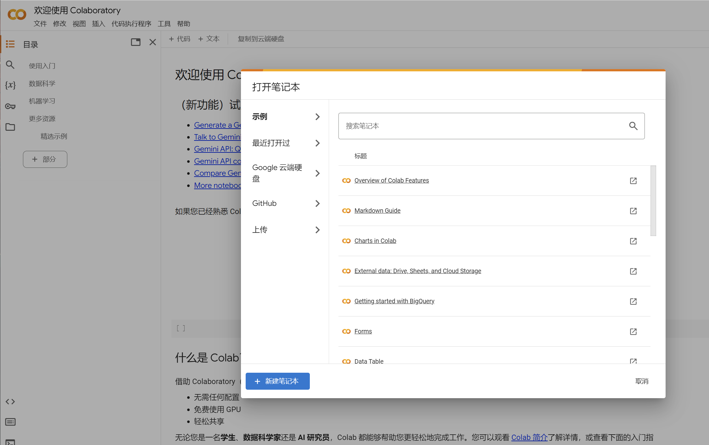

**第二步，创建新的“笔记本”。**

这里说的笔记本，是一种能运行 Python 代码的网页。你可以在网页上放置代码和文本，代码能够运行，而文本可以作为注释。

**第三步，编写安装 Ollama 的代码，并运行。**

我将按照 Ollama 和启动 Ollama 的代码和执行结果放在下面，供你参考。

```
# Download and install ollama to the system
!curl https://ollama.ai/install.sh | sh
!pip install aiohttp pyngrok
import os
import asyncio
# Set LD_LIBRARY_PATH so the system NVIDIA library
os.environ.update({'LD_LIBRARY_PATH': '/usr/lib64-nvidia'})
async def run_process(cmd):
print('>>> starting', *cmd)
p = await asyncio.subprocess.create_subprocess_exec(
*cmd,
stdout=asyncio.subprocess.PIPE,
stderr=asyncio.subprocess.PIPE,
)
async def pipe(lines):
async for line in lines:
print(line.strip().decode('utf-8'))
await asyncio.gather(
pipe(p.stdout),
pipe(p.stderr),
)
#register an account at ngrok.com and create an authtoken and place it here
await asyncio.gather(
run_process(['ngrok', 'config', 'add-authtoken','your-auth-token'])
)
await asyncio.gather(
run_process(['ollama', 'serve']),
run_process(['ngrok', 'http', '--log', 'stderr', '11434', '--host-header', 'localhost:11434'])
)
```

这段代码的目的是在 Google Colab 环境中下载并安装 Ollama，然后使用 Ngrok 进行隧道配置，从而允许外部访问运行在本地的 Ollama 服务。

代码第二行 ，这行代码使用 `curl` 命令从指定 URL 下载 `install.sh` 脚本，并通过 `sh` 命令执行该脚本，以便在系统上安装 Ollama。

第四行，这行代码使用 `pip` 安装两个 Python 包：`aiohttp` 用于异步 HTTP 请求，`pyngrok` 用于与 Ngrok 进行交互。

接下来第十行，这行代码将 NVIDIA 库的路径添加到环境变量 `LD_LIBRARY_PATH` 中，以确保系统能够找到并使用 NVIDIA 的 GPU 库。

第 12 行开始，到代码结束，这段代码通过 `asyncio` 库实现了异步并行地启动和管理多个子进程，其中包括配置 ngrok 的身份验证令牌、启动 ollama 服务器和通过 ngrok 暴露本地端口。每个子进程的输出都通过管道逐行打印到控制台，以便实时监控和调试。

比较关键的是第 31 行，`await asyncio.gather(run_process(['ngrok', 'config', 'add-authtoken','your-auth-token']))`：这行代码通过 `run_process` 函数来运行 `ngrok config add-authtoken your-auth-token` 命令，配置 ngrok 的身份验证令牌。

之后是启动 ollama 服务端和 ngrok，`run_process(['ollama', 'serve'])`：启动 ollama 服务器。

`run_process(['ngrok', 'http', '--log', 'stderr', '11434', '--host-header', 'localhost:11434'])`：启动 ngrok，将本地 11434 端口通过 ngrok 暴露给外网，并将日志输出到标准错误输出。

**第四步，更改运行时类型并连接到托管的运行时。**

更改运行时，类似为你的电脑安装不同类型的 GPU 卡。Colab 能支持多种 GPU，免费的用户可以使用 T4，如果你需要运行配置更高的本地大模型可以付费并使用更高级的 GPU 卡。

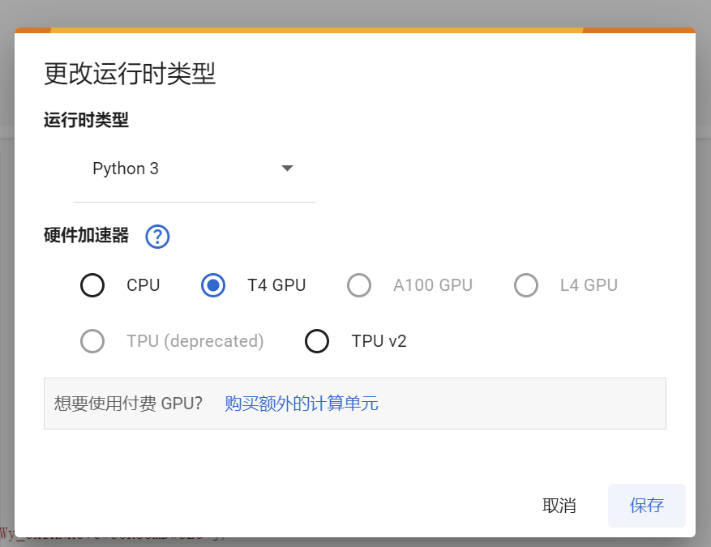

更改后，点击连接到托管的运行时，就相当于为电脑开机，之后，可以点击代码左侧的执行箭头，就能运行代码了。

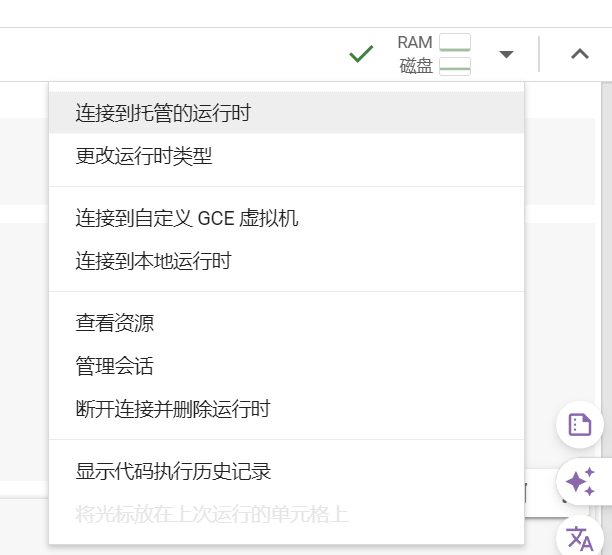

我将运行的结果也放在下方供你参考

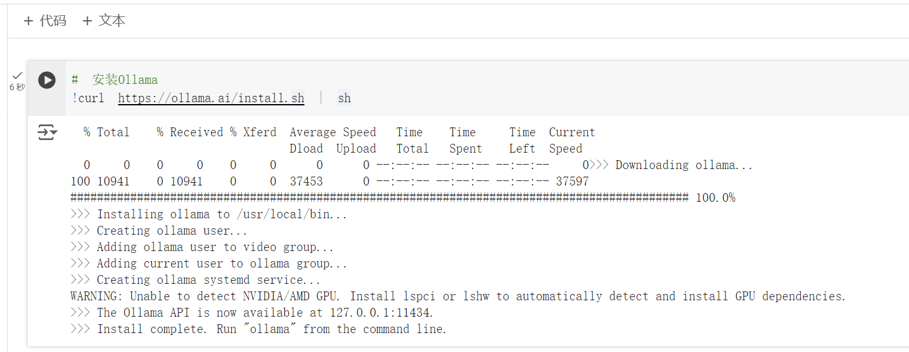

**第五步填写 ngrok 的 token****。**

ngrok 能够将 Colab 的访问地址，通过隧道技术发布到外网。即你可以在公司的电脑访问到大模型。你可以访问以下地址 [https://dashboard.ngrok.com/get-started/your-authtoken](https://dashboard.ngrok.com/get-started/your-authtoken) 申请自己的 token。

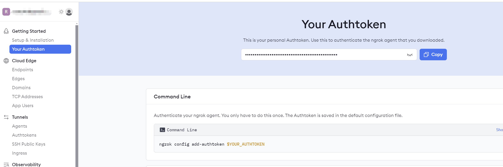

申请后，运行这部分代码，可以通过日志看到 Ollama 以及 ngrok 验证成功并正确运行。

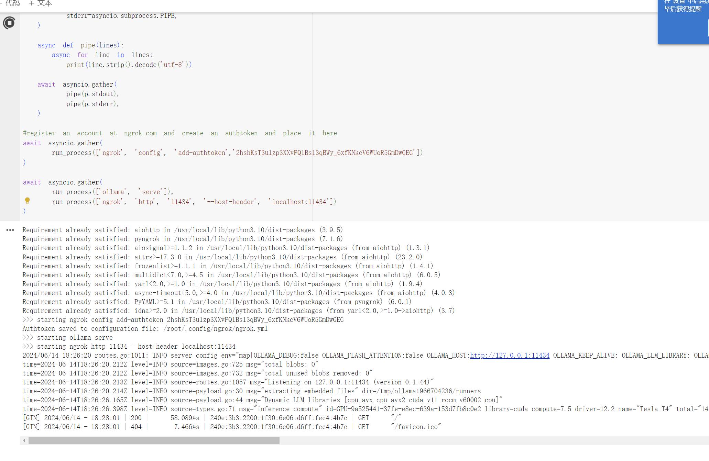

你可以通过日志和 ngrok 的官方网站，获取到 Ollama 服务器的访问地址。

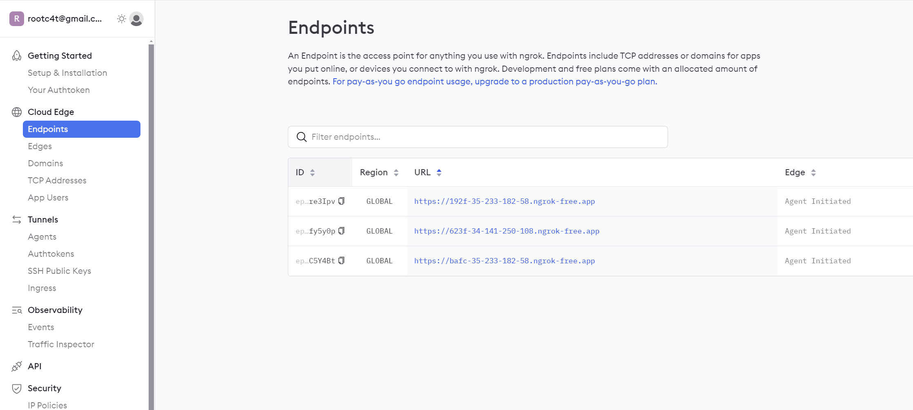

到这里，在 Colab 上安装 Ollama 的步骤就完成了。

那么如何为 Ollama 服务端安装本地模型以及如何与本地的知识库结合呢？ 我们需要两个软件，分别是 Ollama 客户端和 AnythingLLM。

接下来，我来带你为 Ollama 安装本地模型。

## 为 Ollama 安装本地模型

首先，你需要为你的电脑安装 Ollama 客户端，它的下载地址为 [https://ollama.com/download](https://ollama.com/download)，请你根据自己的操作系统选择适合的安装包。

安装后，你需要通过环境变量 OLLAMA_HOST 以及上个步骤 ngrok 发布的 URL 来访问 ollama 服务端。

如果你是 MacOS 系统，可以使用以下方式设置环境变量。

```
export OLLAMA_HOST=https://192f-35-233-182-58.ngrok-free.app
```

如果你是 Windows 系统，可以通过设置 - 高级属性 - 环境变量，新建一个用户环境变量。

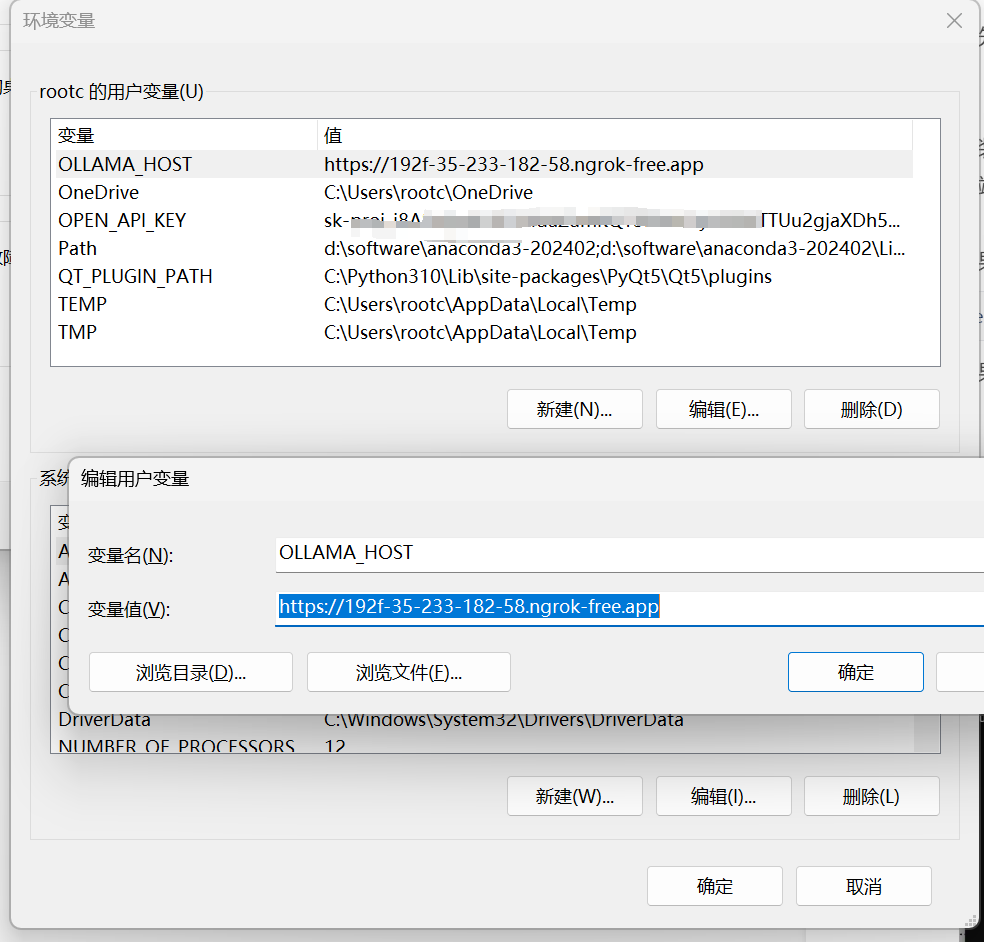

添加完成后，你可以从 [https://ollama.com/library](https://ollama.com/library) 来找到你希望测试的模型，由于免费用户默认使用的是 T4 GPU ，因此模型的大小要小于 16GB。

以 Qwen2 大模型为例，你可以在网页查看模型的大小，由于 Ollama 的运行方式，模型会全部加载到显存，因此模型的大小约等于占用显存的大小。

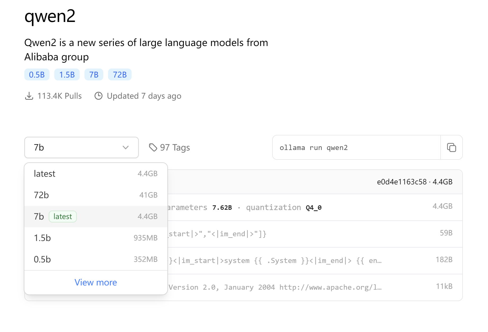

当你选定一个模型后，在网页右侧会自动显示模型的安装和运行方式。

例如，我希望采用 Qwen2 的 0.5b 模型。那么我可以执行。

```
ollama run qwen:0.5b
```

并且你还可以通过 `ollama list` 查看已安装的模型。我将模型的安装过程为你截图，供你参考。

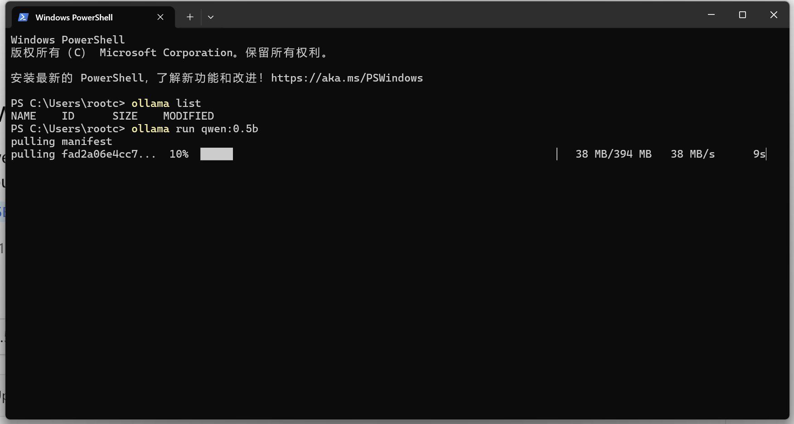

执行模型安装时，本地会显示安装进度，在 Colab 会执行同步的安装和模型的下载保存工作。

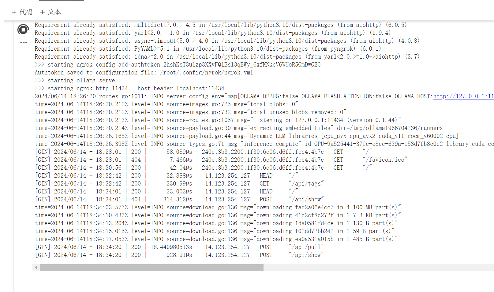

安装完成后，你可以通过终端与模型对话，来验证模型是否被成功安装。

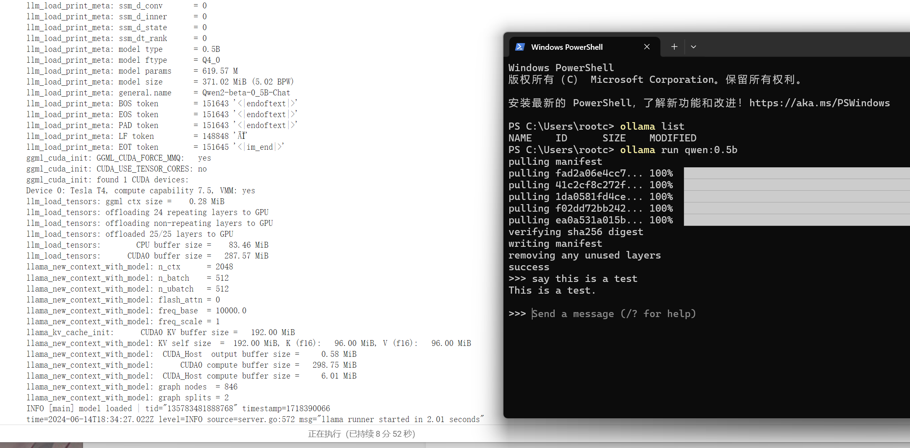

你可以参考我的安装步骤，安装更多的本地大模型，进行功能的横向对比，以便你找到运行效率高，成本适宜的模型。

那么，有了大模型以后，怎样能像 Coze 一样，集成知识库，与 Ollama 通讯呢？

这里，我们还要借助一款叫做 AnythingLLM 的软件。你可以访问 [https://useanything.com/download](https://useanything.com/download) 下载并安装 AnythingLLM

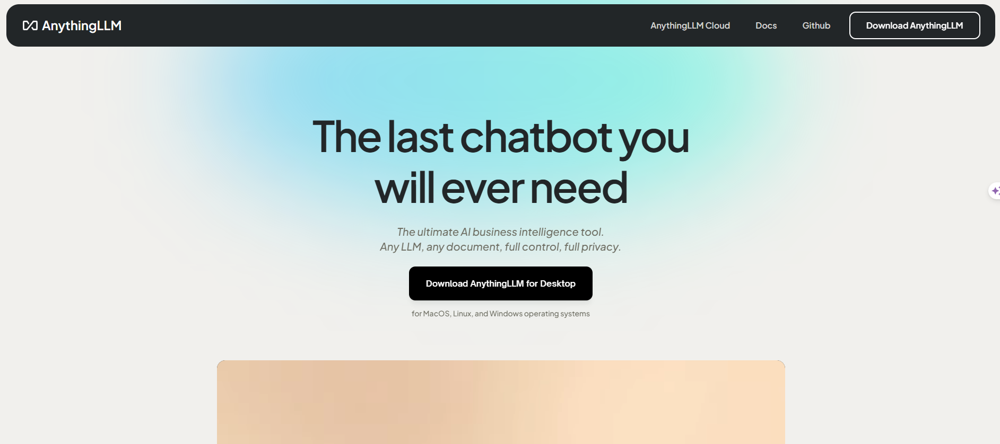

安装后，会首先来到模型设置步骤，你可以选择 Ollama 并使用 Ollama 服务器的地址和已经安装好的大模型。这里的地址就是我之前使用 ngrok 生成的 [https://192f-35-233-182-58.ngrok-free.app/](https://192f-35-233-182-58.ngrok-free.app/)，而模型就是采用 `ollama run` 命令安装好的模型。 我也将设置页面为你截图。放在下方作为参考。

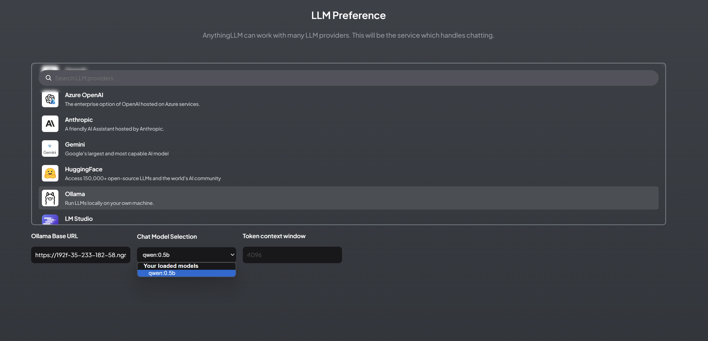

设置完成之后，AnythingLLM 即可借助 Ollama 功能，通过网页来集成知识库，实现类似 Coze 的本地数据分析平台搭建工作。

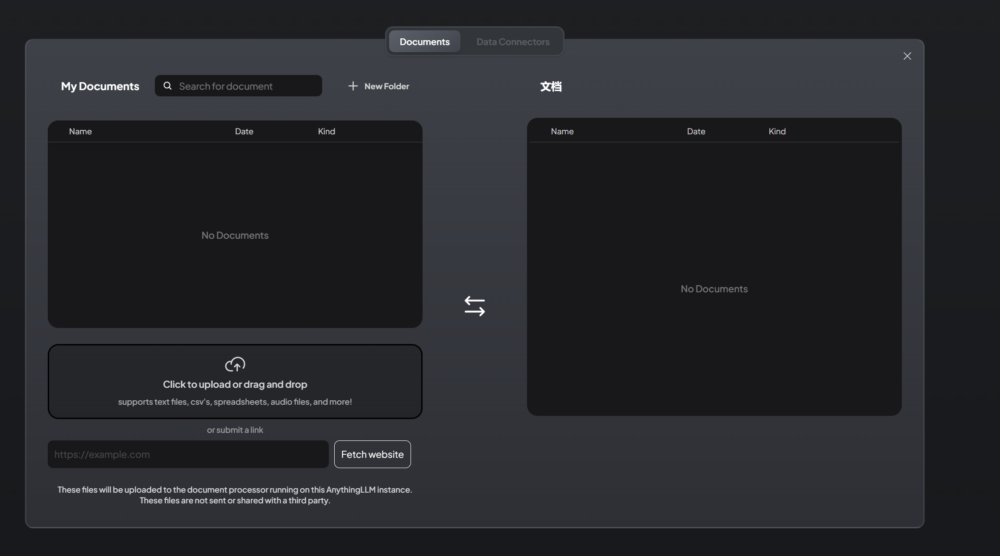

在使用过程中，你还可以通过 Colab 的资源监视器，查看资源的使用情况。

你可以根据自己的实际需要，随时调整 GPU 类型，随时保持高效的计算效率。

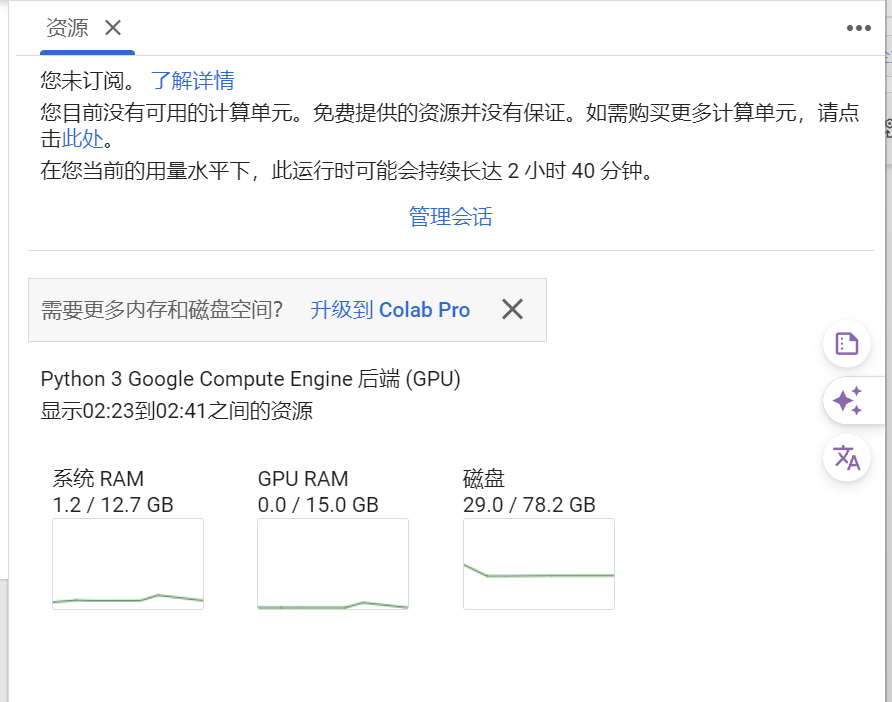

最后，我还要提醒你，Colab 的免费用户有一定的使用时间限制。因此，如果你仅将 Colab 用于测试，测试完成后，建议你断开端口连接并删除运行时，以避免超出使用限制。

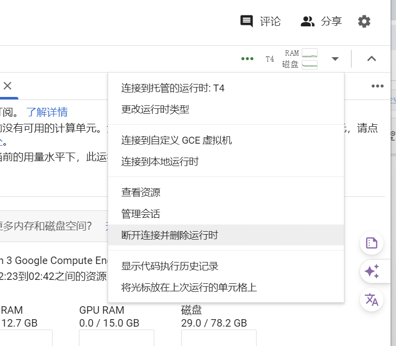

## 总结复盘

今天我们讨论了如何在构建企业 AI 数据分析平台时解决计算资源不足的问题，并介绍了一些具体的方法。通过 Google Colab 运行 Ollama，可以在云端灵活地使用大模型。Ollama 允许在本地运行大模型，通过 Ngrok 建立隧道技术，可以让这些本地大模型服务被外网访问。这不仅解决了计算资源不足的问题，还使得硬件资源的切换更加灵活。

另外，我们还谈到如何结合 AnythingLLM 使用知识库与 Ollama 集成，这样可以实现一个高效的数据分析平台。这些方法不仅提高了计算效率，降低了成本，还能灵活应对业务需求的变化。你还可以结合上一讲，我为你介绍的数据湖功能，构建更为强大的企业级 AI 数据分析平台。

## 课后作业

- 请在 Google Colab 中安装并运行 Ollama，详细记录安装过程中的步骤和遇到的问题，并提出解决方案。
- 从 Ollama 模型库中选择一个感兴趣的模型并安装到 Colab，比较不同模型大小在智能程度上的差异。
- 结合 Ollama 和 AnythingLLM，通过上传文档的方式，建立一个支持知识库的数据分析平台。

---
来源：极客时间
链接：https://time.geekbang.org/column/article/796093
日期：2026-05-29
