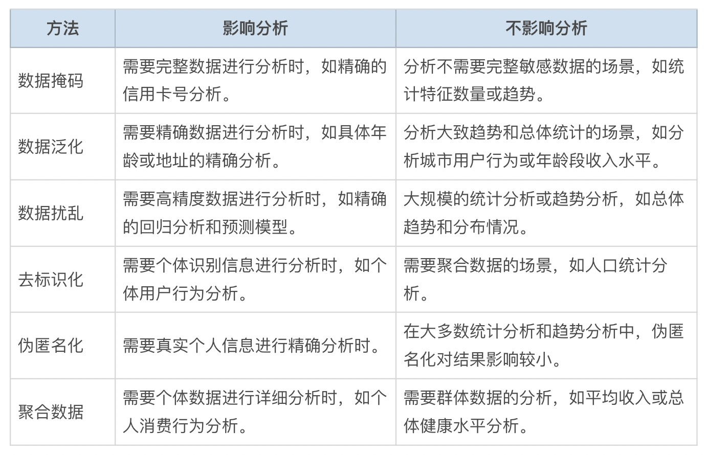
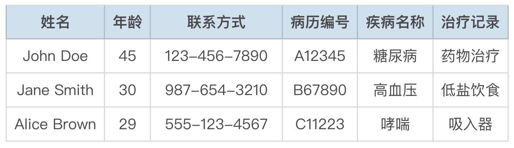
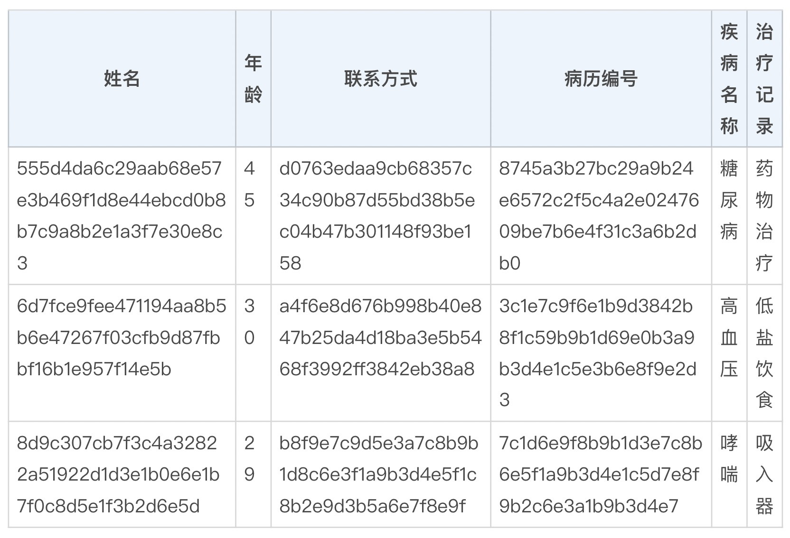

# 28｜数据保密：利用ChatGPT实现数据脱敏和匿名化-AI数据分析课

今天，我想和你聊一下数据安全的话题。

在 AI 数据分析领域，如何在**使用数据的同时保护数据隐私是一个重大挑战**。这些数据中常包含大量的个人敏感信息，如姓名、身份证号码、银行账号和医疗记录等。一旦泄露，不仅会对个人造成严重影响，还会引发法律纠纷和损害企业声誉。即使大模型供应商声称不使用这些数据作为训练数据，但是你可能还是不放心。那么有没有什么技术，既能保护数据隐私，又能实现用大模型进行数据处理呢？我为你提供两种方法：**数据脱敏和匿名化技术**，来解决数据隐私问题。

## **什么是数据脱敏和匿名化呢？**

**数据脱敏**和**匿名化**是两种用于保护个人隐私的数据处理技术，比如我向 ChatGPT 提问，数据脱敏和匿名化的定义与实现方法有哪些？

ChatGPT 的回答是：

> 什么是数据脱敏和匿名化？
> 
>  
> 
> **数据脱敏**：通过替换、掩盖或删除敏感信息，使数据在使用过程中不会暴露个人隐私。例如，将姓名替换为编号，将具体地址模糊化为区域信息。
> 
>  
> 
> **匿名化**：通过修改或删除数据中的识别信息，使得数据无法再关联到具体个人。
> 
> 实现方法有哪些？
> 
>  
> 
> **数据脱敏的方法**
> 
> **数据掩码**：隐藏部分敏感信息，例如将信用卡号的中间部分用星号替代，只显示最后四位。
> 
> **数据泛化**：将具体数据概括到更高层次，例如将具体的家庭住址泛化为城市或地区，将具体年龄转换为年龄段。
> 
> **数据扰乱**：对数据进行随机扰动，使得原始数据无法被准确恢复，例如在数据中加入随机噪声。
> 
>  
> 
> **匿名化的方法**
> 
> **去标识化**：删除或替换数据中的所有个人标识信息，例如删除姓名、身份证号等信息。
> 
> **伪匿名化**：将个人识别信息替换为假名或其他无法追溯到原始个人的信息。
> 
> **聚合数据**：将个人数据汇总为群体数据，例如统计一个地区的平均收入而不是个人收入。

从 ChatGPT 提供的标准化答案来看啊，实现方法其实并不难，但是实际操作起来就难在**脱敏的标准和脱敏后 AI 对数据进行分析时是否会受到干扰**。

从大的方面来讲，比如你在大型跨国公司，如果你所使用数据来自多个国家，就要考虑在不同的国家遵循不同的去标识方法。经常涉及到个人隐私保护的法案有：欧盟《通用数据保护条例》(GDPR)、美国《健康保险可携性和责任法案》(HIPAA) 和中国《个人信息保护法》(PIPL)。

各国法规对数据脱敏和匿名化的要求虽然目标一致，但在具体要求和实施细节上存在一些差异。

比如 GDPR（欧盟）去标识化要求删除所有能够识别个人身份的信息，而 HIPAA（美国）规定了具体的去标识化方法，包括移除 18 类标识符，如姓名、地址、出生日期等。而且应用范围也有差异，像是 HIPAA（美国）主要适用于医疗机构、健康保险公司以及处理医疗数据的相关企业。

PIPL（中国）适用于在中国境内处理个人信息的企业和组织，以及处理中国境内个人信息并对中国境内提供产品或服务的境外企业。如果处理不当呢，还会受到高额的处罚。所以呢，AI 虽好，但是使用国外的大模型处理公司数据时，还是要注意保护隐私，避免公司承担法律风险。

**那如果数据脱敏了之后，对数据分析是否会造成影响呢？这要看你的脱敏方法和分析的目标来决定。****数据脱敏和匿名化对数据分析有不同程度的影响。**

比如说：数据脱敏中的数据掩码会影响需要完整数据的分析，如精确的信用卡号分析，但对统计特征数量或趋势分析影响较小；数据泛化影响精确数据分析，如具体年龄或地址分析，但对大致趋势和总体统计影响不大；数据扰乱会影响高精度分析，如回归分析和预测模型，但对大规模统计或趋势分析影响较小。而匿名化也有诸如此类的问题。

我将常用的方法和影响分析的情况为你总结了一张表格。如果你必须要先脱敏数据才能让 AI 分析，就可以提前了解一下对分析结果的影响程度。



既然用户隐私数据无法直接让大语言模型处理，那有没有弯道超车的办法呢？聪明的你肯定想到了，既然我们知道数据脱敏的方法，我们可以上传几条示例数据让 ChatGPT 了解数据的格式，然后根据格式为我们自动编写 Python 脚本。这样我们可以通过脚本将数据进行脱敏。并且你还能根据所在的地区，要求 ChatGPT 利用特定的数据处理办法帮你进行脱敏处理。

那我们说干就干。我就以一份医疗数据为例，带你看一下怎样让大模型帮我们进行数据脱敏。

## **实践案例**

假设我们有一个包含患者个人信息的医疗数据集，其中包括姓名、年龄、联系方式、病历编号、疾病名称和治疗记录等信息。为了进行流行病学研究，我们需要对这些数据进行脱敏处理，确保患者隐私不被泄露。

**【****数据集描述****】**

我们的原始数据集示例如下：



**【****方法和步骤****】**

- **识别敏感信息**

使用 ChatGPT 根据数据的用途、使用数据的国家地区法律法规，自动识别数据集中需要脱敏的敏感信息字段。比如我问 ChatGPT 在 HIPAA（美国）的法律条款下，以下哪些字段需要过滤？

ChatGPT 分析完我提供的几条数据样本之后，告知我姓名、联系方式和病历编号三个字段需要进行数据脱敏。

```
sensitive_fields = ['姓名', '联系方式', '病历编号']
```

- **智能替换**

接下来我继续提问 ChatGPT，让他生成 Python 代码进行数据脱敏，将敏感信息替换为匿名标识。用于统计不同年龄下的某种疾病的发病率。ChatGPT 为我提供了如下代码：

```
import pandas as pd
import hashlib
# 加载数据集
df = pd.DataFrame({
'姓名': ['John Doe', 'Jane Smith', 'Alice Brown'],
'年龄': [45, 30, 29],
'联系方式': ['123-456-7890', '987-654-3210', '555-123-4567'],
'病历编号': ['A12345', 'B67890', 'C11223'],
'疾病名称': ['糖尿病', '高血压', '哮喘'],
'治疗记录': ['药物治疗', '低盐饮食', '吸入器']
})
# 脱敏函数
def anonymize_data(value):
return hashlib.sha256(value.encode()).hexdigest()
# 应用脱敏
for field in sensitive_fields:
df[field] = df[field].apply(anonymize_data)
print(df)
```

执行以上代码后，数据集将变为：



从执行的结果中，你可以人为确定数据不会影响后续的分析目标。那么可以让 ChatGPT 继续生成对全量数据集的匿名化脚本。

我们还能从上表得到两个重要结论。

- **上下文感知的脱敏**：通过 ChatGPT，保证替换后的数据在报告中逻辑一致，不影响聚合数据场景下的医疗分析的进行。而且 ChatGPT 会自动检测上下文关系，确保数据脱敏后的报告仍然有意义。
- **保持数据一致性**：在报告的多个部分引用同一个患者时，ChatGPT 会确保使用相同的替换标识，避免出现混淆。例如，将患者的姓名“John Doe”在报告中所有出现的地方都替换为相同的匿名标识。

以上方法是利用 ChatGPT 去标准化的基本流程。用 ChatGPT 来进行数据脱敏简单有效，同样的策略你还可以应用到数据掩码、数据泛化、数据扰乱等脱敏方法中。这样你在利用大模型进行数据分析时，就不用再为你的数据泄露风险担心了。

## **总结复盘**

最后，我来为你总结一下，今天我们从数据安全的角度讨论了在使用大模型进行数据分析时需要考虑的安全性和隐私保护方法。通过向 ChatGPT 提问和结合我的从业经验，我为你介绍了 6 种通用的数据脱敏和匿名化方法，它们是：数据掩码、数据泛化、数据扰乱、去标识化、伪匿名化、聚合数据。

在实际使用时，你需要根据相关法律法规、公司要求以及具体的分析方法，灵活应用这些技术。由于数据的重要性和敏感性，你无法直接将数据上传给 ChatGPT。不过，你可以利用 ChatGPT 生成代码，在本地运行这些代码进行半自动化的数据清洗工作。虽然这是一种折中的解决方案，但保护数据安全始终比智能分析更为重要。

## **课后作业**

请你使用 ChatGPT 实现身份证号码后六位的数据掩码工作。确保相同身份证号码经过数据掩码后依然能够识别。

---
来源：极客时间
链接：https://time.geekbang.org/column/article/796976
日期：2026-05-29
