# 12 | 数据集成：这些大号一共20亿粉丝？

我们采集的数据经常会有冗余重复的情况。举个简单的例子，假设你是一个网络综艺节目的制片人，一共有 12 期节目，你一共打算邀请 30 位明星作为节目的嘉宾。你知道这些明星影响力都很大，具体在微博上的粉丝数都有标记。于是你想统计下，这些明星一共能直接影响到微博上的多少粉丝，能产生多大的影响力。

然后你突然发现，这些明星的粉丝数总和超过了 20 亿。那么他们一共会影响到中国 20 亿人口么？显然不是的，我们都知道中国人口一共是 14 亿，这 30 位明星的影响力总和不会覆盖中国所有人口。

那么如何统计这 30 位明星真实的影响力总和呢？这里就需要用到数据集成的概念了。

数据集成就是将多个数据源合并存放在一个数据存储中（如数据仓库），从而方便后续的数据挖掘工作。

据统计，大数据项目中 80% 的工作都和数据集成有关，这里的数据集成有更广泛的意义，包括了数据清洗、数据抽取、数据集成和数据变换等操作。这是因为数据挖掘前，我们需要的数据往往分布在不同的数据源中，需要考虑字段表达是否一样，以及属性是否冗余。

## 数据集成的两种架构：ELT 和 ETL

数据集成是数据工程师要做的工作之一。一般来说，数据工程师的工作包括了数据的 ETL 和数据挖掘算法的实现。算法实现可以理解，就是通过数据挖掘算法，从数据仓库中找到“金子“。

什么是 ETL 呢？ETL 是英文 Extract、Transform 和 Load 的缩写，顾名思义它包括了数据抽取、转换、加载三个过程。ETL 可以说是进行数据挖掘这项工作前的“备菜”过程。

我来解释一下数据抽取、转换、加载这三个过程。

抽取是将数据从已有的数据源中提取出来。

转换是对原始数据进行处理，例如将表输入 1 和 表输入 2 进行连接形成一张新的表。

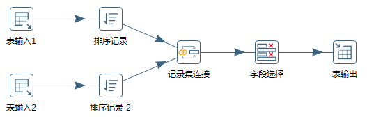

如果是三张表连接的话，可以怎么操作呢？先将表输入 1 和表输入 2 进行连接形成表输入 1-2，然后将表输入 1-2 和表输入 3 进行连接形成新的表。然后再将生成的新表写入目的地。

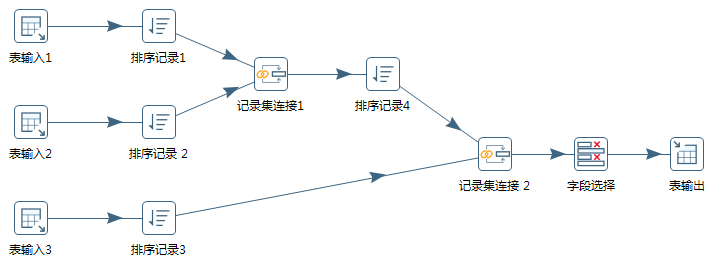

根据转换发生的顺序和位置，数据集成可以分为 ETL 和 ELT 两种架构。

ETL 的过程为提取 (Extract)——转换 (Transform)——加载 (Load)，在数据源抽取后首先进行转换，然后将转换的结果写入目的地。

ELT 的过程则是提取 (Extract)——加载 (Load)——变换 (Transform)，在抽取后将结果先写入目的地，然后利用数据库的聚合分析能力或者外部计算框架，如 Spark 来完成转换的步骤。

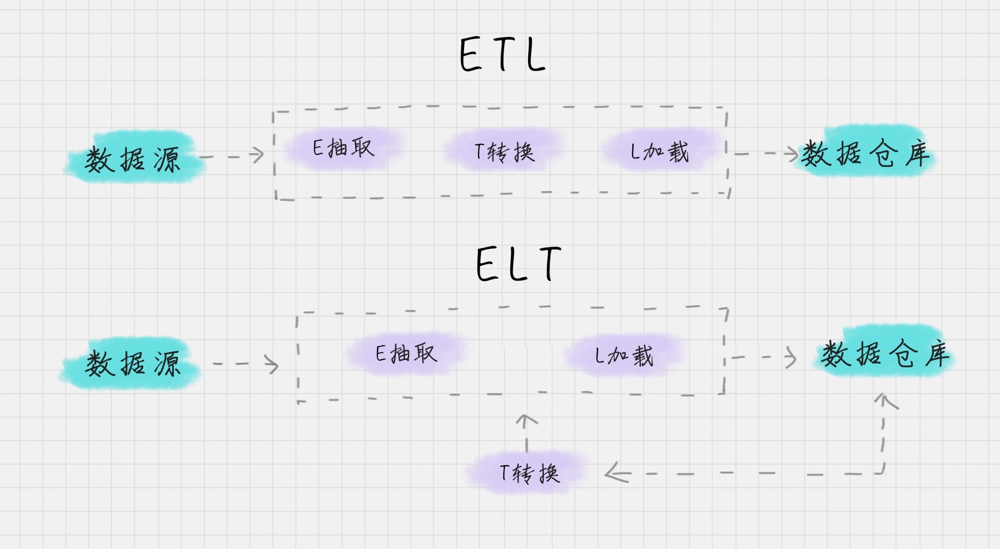

目前数据集成的主流架构是 ETL，但未来使用 ELT 作为数据集成架构的将越来越多。这样做会带来多种好处：

- ELT 和 ETL 相比，最大的区别是“重抽取和加载，轻转换”，从而可以用更轻量的方案搭建起一个数据集成平台。使用 ELT 方法，在提取完成之后，数据加载会立即开始。一方面更省时，另一方面 ELT 允许 BI 分析人员无限制地访问整个原始数据，为分析师提供了更大的灵活性，使之能更好地支持业务。
- 在 ELT 架构中，数据变换这个过程根据后续使用的情况，需要在 SQL 中进行，而不是在加载阶段进行。这样做的好处是你可以从数据源中提取数据，经过少量预处理后进行加载。这样的架构更简单，使分析人员更好地了解原始数据的变换过程。

**ETL 工具有哪些？**

介绍完了这两种架构，你肯定想要知道 ETL 工具都有哪些？

典型的 ETL 工具有:

- 商业软件：Informatica PowerCenter、IBM InfoSphere DataStage、Oracle Data Integrator、Microsoft SQL Server Integration Services 等
- 开源软件：Kettle、Talend、Apatar、Scriptella、DataX、Sqoop 等

相对于传统的商业软件，Kettle 是一个易于使用的，低成本的解决方案。国内很多公司都在使用 Kettle 用来做数据集成。所以我重点给你讲解下 Kettle 工具的使用。

## Kettle 工具的使用

Kettle 是一款国外开源的 ETL 工具，纯 Java 编写，可以在 Window 和 Linux 上运行，不需要安装就可以使用。Kettle 中文名称叫水壶，该项目的目标是将各种数据放到一个壶里，然后以一种指定的格式流出。

Kettle 在 2006 年并入了开源的商业智能公司 Pentaho, 正式命名为 Pentaho Data Integeration，简称“PDI”。因此 Kettle 现在是 Pentaho 的一个组件，下载地址：[https://community.hitachivantara.com/docs/DOC-1009855]()

在使用 Kettle 之前还需要安装数据库软件和 Java 运行环境（JRE）。

Kettle 采用可视化的方式进行操作，来对数据库间的数据进行迁移。它包括了两种脚本：Transformation 转换和 Job 作业。

- Transformation（转换）：相当于一个容器，对数据操作进行了定义。数据操作就是数据从输入到输出的一个过程。你可以把转换理解成为是比作业粒度更小的容器。在通常的工作中，我们会把任务分解成为不同的作业，然后再把作业分解成多个转换。
- Job（作业）：相比于转换是个更大的容器，它负责将转换组织起来完成某项作业。

接下来，我分别讲下这两个脚本的创建过程。

**如何创建 Transformation（转换）**

Transformation 可以分成三个步骤，它包括了输入、中间转换以及输出。

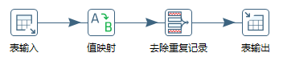

在 Transformation 中包括两个主要概念：Step 和 Hop。Step 的意思就是步骤，Hop 就是跳跃线的意思。

- Step（步骤）：Step 是转换的最小单元，每一个 Step 完成一个特定的功能。在上面这个转换中，就包括了表输入、值映射、去除重复记录、表输出这 4 个步骤；
- Hop（跳跃线）：用来在转换中连接 Step。它代表了数据的流向。

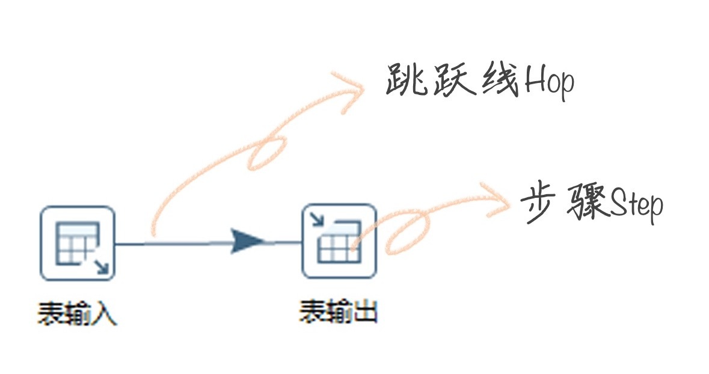

**如何创建 Job（作业）：**

完整的任务，实际上是将创建好的转换和作业串联起来。在这里 Job 包括两个概念：Job Entry、Hop。

如何理解这两个概念呢？

- Job Entry（工作实体）：Job Entry 是 Job 内部的执行单元，每一个 Job Entry 都是用来执行具体的任务，比如调用转换，发送邮件等。
- Hop：指连接 Job Entry 的线。并且它可以指定是否有条件地执行。

在 Kettle 中，你可以使用 Spoon，它是一种一种图形化的方式，来让你设计 Job 和 Transformation，并且可以保存为文件或者保存在数据库中。下面我来带你做一个简单的例子。

**案例 1：如何将文本文件的内容转化到 MySQL 数据库中**

这里我给你准备了文本文件，这个文件我上传到了 GitHub 上，你可以自行下载：[http://t.cn/E4SzvOf]()，数据描述如下：

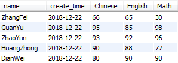

下面我来教你，如何将文本文件的内容转化到 MySQL 数据库中。

Step1：创建转换，右键“转换→新建”；

Step2：在左侧“核心对象”栏目中选择“文本文件输入”控件，拖拽到右侧的工作区中；

Step3：从左侧选择“表输出”控件，拖拽到右侧工作区；

Step4：鼠标在“文本文件输入”控件上停留，在弹窗中选择图标，鼠标拖拽到“表输出”控件，将一条连线连接到两个控件上；

这时我们已经将转换的流程设计好了，现在是要对输入和输出两个控件进行设置。

Step5：双击“文本文件输入”控件，导入已经准备好的文本文件；

Step6：双击“表输出”控件，这里你需要配置下 MySQL 数据库的连接，同时数据库中需要有一个数据表，字段的设置与文本文件的字段设置一致（这里我设置了一个 wucai 数据库，以及 score 数据表。字段包括了 name、create_time、Chinese、English、Math，与文本文件的字段一致）。

具体操作可以看下面的演示：

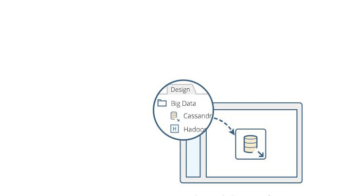

Step7：创建数据库字段的对应关系，这个需要双击“表输出”，找到数据库字段，进行字段映射的编辑；

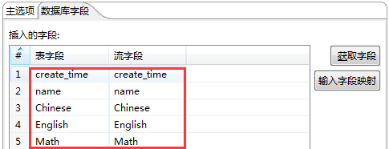

Step8：点击左上角的执行图标，如下图：

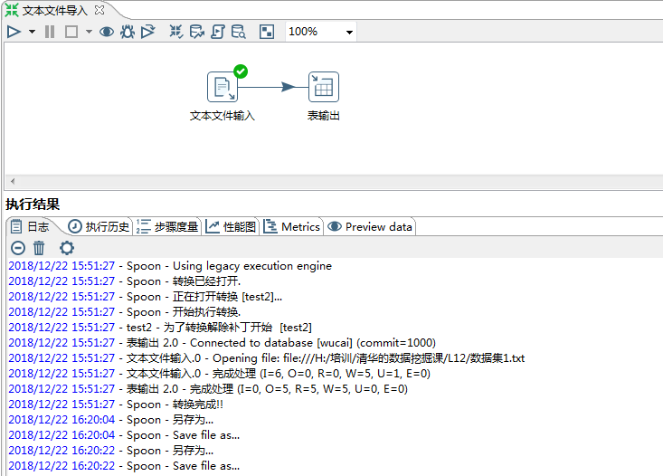

这样我们就完成了从文本文件到 MySQL 数据库的转换。

Kettle 的控件比较多，内容无法在一节课内容中完整呈现，我只给你做个入门了解。

另外给你推荐一个 Kettle 的开源社区：[http://www.ukettle.org]() 。

在社区里，你可以和大家进行交流。因为 Kettle 相比其他工具上手简单，而且是开源工具，有问题可以在社群里咨询。因此我推荐你使用 Kettle 作为你的第一个 ETL 工具。

当然除了 Kettle 工具，实际工作中，你可能也会接触到其他的 ETL 工具，这里我给你简单介绍下阿里巴巴的开源工具 DataX 和 Apache 的 Sqoop。

**阿里开源软件：DataX**

在以往的数据库中，数据库都是两两之间进行的转换，没有统一的标准，转换形式是这样的：

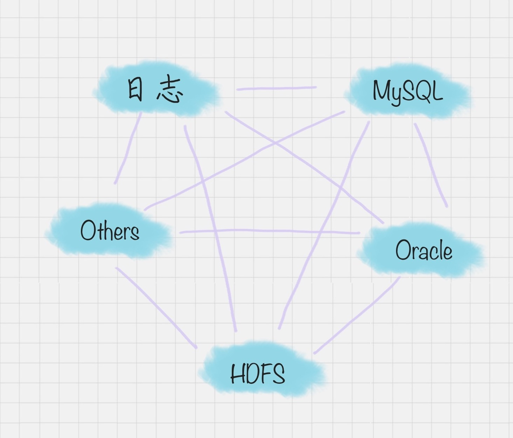

但 DataX 可以实现跨平台、跨数据库、不同系统之间的数据同步及交互，它将自己作为标准，连接了不同的数据源，以完成它们之间的转换。

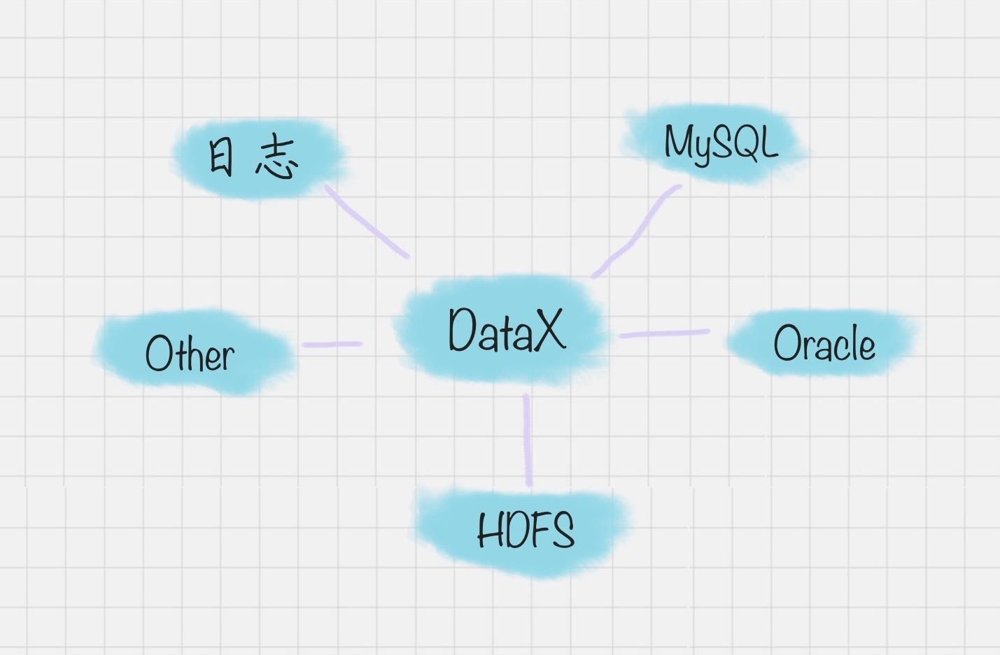

DataX 的模式是基于框架 + 插件完成的，DataX 的框架如下图：

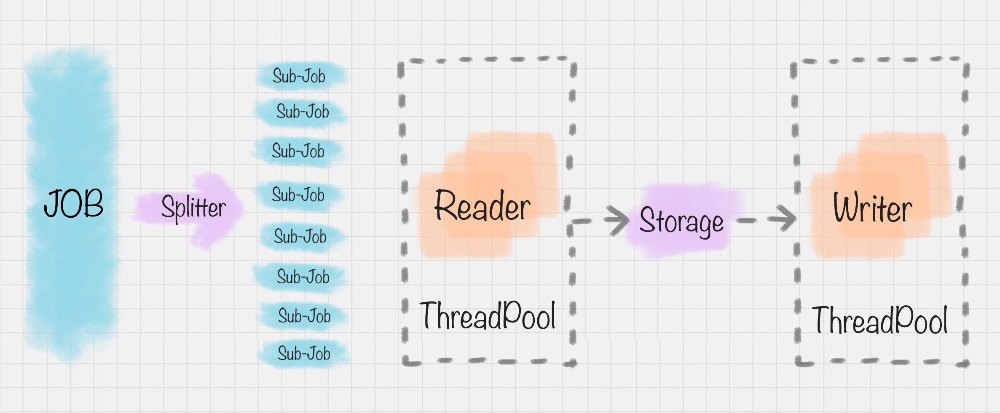

在这个框架里，Job 作业被 Splitter 分割器分成了许多小作业 Sub-Job。在 DataX 里，通过两个线程缓冲池来完成读和写的操作，读和写都是通过 Storage 完成数据的交换。比如在“读”模块，切分后的小作业，将数据从源头装载到 DataXStorage，然后在“写”模块，数据从 DataXStorage 导入到目的地。

这样的好处就是，在整体的框架下，我们可以对 Reader 和 Writer 进行插件扩充，比如我想从 MySQL 导入到 Oracle，就可以使用 MySQLReader 和 OracleWriter 插件，装在框架上使用即可。

**Apache 开源软件:Sqoop**

Sqoop 是一款开源的工具，是由 Apache 基金会所开发的分布式系统基础架构。Sqoop 在 Hadoop 生态系统中是占据一席之地的，它主要用来在 Hadoop 和关系型数据库中传递数据。通过 Sqoop，我们可以方便地将数据从关系型数据库导入到 HDFS 中，或者将数据从 HDFS 导出到关系型数据库中。

Hadoop 实现了一个分布式文件系统，即 HDFS。Hadoop 的框架最核心的设计就是 HDFS 和 MapReduce。HDFS 为海量的数据提供了存储，而 MapReduce 则为海量的数据提供了计算。

## 总结

今天我介绍了数据集成的两种架构方式，以及 Kettle 工具的基本操作。不要小看了 ETL，虽然它不直接交付数据挖掘的结果，但是却是数据挖掘前重要的工作，它包括了抽取各种数据、完成转化和加载这三个步骤。

因此除了数据科学家外，还有个工作职位叫 ETL 工程师，这份工作正是我们今天介绍的从事 ETL 这种架构工作的人。如果你以后有机会从事这份工作，你不仅要对今天介绍的数据集成概念有所了解，还要掌握至少一种 ETL 开发工具，如 Kettle、DataX、 Sqoop 等；此外还需要熟悉主流数据库技术，比如 SQL Server、PostgeSQL、Oracle 等。

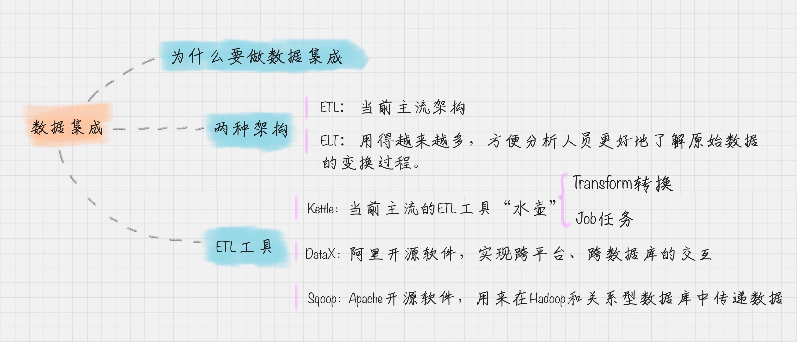

这是我操作 kettle 的流程视频，你可以看一下。

今天我给你讲了数据集成的两种架构，以及帮助我们实现 ETL 的工具 Kettle。纸上得来终觉浅，绝知此事要躬行。你不妨尝试下如何使用 Kettle 将 MySQL 数据库内容转化到文本文件？

另我想让你来谈谈，你对数据集成的理解，如果你之前做过 ETL 的工具，也请你来谈一谈你对 ETL 的工具选择和使用经历。

欢迎在评论区与我分享你的想法。如果你觉得这篇文章对你有帮助，欢迎点击“请朋友读”，分享给你的朋友和同事。

---
来源：极客时间
链接：https://time.geekbang.org/column/article/76787
日期：2026-05-12
