# 30丨关联规则挖掘（上）：如何用Apriori发现用户购物规则？

今天我来带你进行关联规则挖掘的学习，关联规则这个概念，最早是由 Agrawal 等人在 1993 年提出的。在 1994 年 Agrawal 等人又提出了基于关联规则的 Apriori 算法，至今 Apriori 仍是关联规则挖掘的重要算法。

关联规则挖掘可以让我们从数据集中发现项与项（item 与 item）之间的关系，它在我们的生活中有很多应用场景，“购物篮分析”就是一个常见的场景，这个场景可以从消费者交易记录中发掘商品与商品之间的关联关系，进而通过商品捆绑销售或者相关推荐的方式带来更多的销售量。所以说，关联规则挖掘是个非常有用的技术。

在今天的内容中，希望你能带着问题，和我一起来搞懂以下几个知识点：

搞懂关联规则中的几个重要概念：支持度、置信度、提升度；Apriori 算法的工作原理；在实际工作中，我们该如何进行关联规则挖掘。

## 搞懂关联规则中的几个概念

我举一个超市购物的例子，下面是几名客户购买的商品列表：

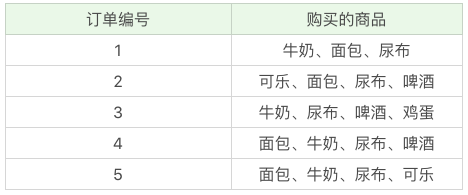

**什么是支持度呢？**

支持度是个百分比，它指的是某个商品组合出现的次数与总次数之间的比例。支持度越高，代表这个组合出现的频率越大。

在这个例子中，我们能看到“牛奶”出现了 4 次，那么这 5 笔订单中“牛奶”的支持度就是 4/5=0.8。

同样“牛奶 + 面包”出现了 3 次，那么这 5 笔订单中“牛奶 + 面包”的支持度就是 3/5=0.6。

**什么是置信度呢？**

它指的就是当你购买了商品 A，会有多大的概率购买商品 B，在上面这个例子中：

置信度（牛奶→啤酒）=2/4=0.5，代表如果你购买了牛奶，有多大的概率会购买啤酒？

置信度（啤酒→牛奶）=2/3=0.67，代表如果你购买了啤酒，有多大的概率会购买牛奶？

我们能看到，在 4 次购买了牛奶的情况下，有 2 次购买了啤酒，所以置信度 (牛奶→啤酒)=0.5，而在 3 次购买啤酒的情况下，有 2 次购买了牛奶，所以置信度（啤酒→牛奶）=0.67。

所以说置信度是个条件概念，就是说在 A 发生的情况下，B 发生的概率是多少。

**什么是提升度呢？**

我们在做商品推荐的时候，重点考虑的是提升度，因为提升度代表的是“商品 A 的出现，对商品 B 的出现概率提升的”程度。

还是看上面的例子，如果我们单纯看置信度 (可乐→尿布)=1，也就是说可乐出现的时候，用户都会购买尿布，那么当用户购买可乐的时候，我们就需要推荐尿布么？

实际上，就算用户不购买可乐，也会直接购买尿布的，所以用户是否购买可乐，对尿布的提升作用并不大。我们可以用下面的公式来计算商品 A 对商品 B 的提升度：

提升度 (A→B)= 置信度 (A→B)/ 支持度 (B)

这个公式是用来衡量 A 出现的情况下，是否会对 B 出现的概率有所提升。

所以提升度有三种可能：

提升度 (A→B)>1：代表有提升；提升度 (A→B)=1：代表有没有提升，也没有下降；提升度 (A→B)<1：代表有下降。

## Apriori 的工作原理

明白了关联规则中支持度、置信度和提升度这几个重要概念，我们来看下 Apriori 算法是如何工作的。

首先我们把上面案例中的商品用 ID 来代表，牛奶、面包、尿布、可乐、啤酒、鸡蛋的商品 ID 分别设置为 1-6，上面的数据表可以变为：

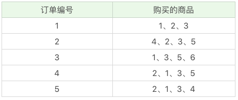

Apriori 算法其实就是查找频繁项集 (frequent itemset) 的过程，所以首先我们需要定义什么是频繁项集。

频繁项集就是支持度大于等于最小支持度 (Min Support) 阈值的项集，所以小于最小值支持度的项目就是非频繁项集，而大于等于最小支持度的项集就是频繁项集。

项集这个概念，英文叫做 itemset，它可以是单个的商品，也可以是商品的组合。我们再来看下这个例子，假设我随机指定最小支持度是 50%，也就是 0.5。

我们来看下 Apriori 算法是如何运算的。

首先，我们先计算单个商品的支持度，也就是得到 K=1 项的支持度：

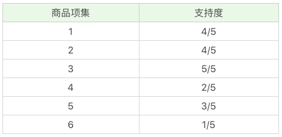

因为最小支持度是 0.5，所以你能看到商品 4、6 是不符合最小支持度的，不属于频繁项集，于是经过筛选商品的频繁项集就变成：

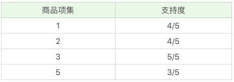

在这个基础上，我们将商品两两组合，得到 k=2 项的支持度：

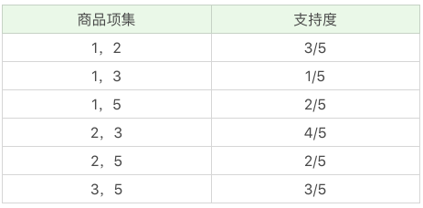

我们再筛掉小于最小值支持度的商品组合，可以得到：

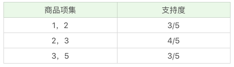

我们再将商品进行 K=3 项的商品组合，可以得到：

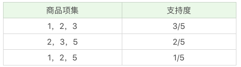

再筛掉小于最小值支持度的商品组合，可以得到：

通过上面这个过程，我们可以得到 K=3 项的频繁项集{1,2,3}，也就是{牛奶、面包、尿布}的组合。

到这里，你已经和我模拟了一遍整个 Apriori 算法的流程，下面我来给你总结下 Apriori 算法的递归流程：

K=1，计算 K 项集的支持度；筛选掉小于最小支持度的项集；如果项集为空，则对应 K-1 项集的结果为最终结果。

否则 K=K+1，重复 1-3 步。

## Apriori 的改进算法：FP-Growth 算法

我们刚完成了 Apriori 算法的模拟，你能看到 Apriori 在计算的过程中有以下几个缺点：

可能产生大量的候选集。因为采用排列组合的方式，把可能的项集都组合出来了；每次计算都需要重新扫描数据集，来计算每个项集的支持度。

所以 Apriori 算法会浪费很多计算空间和计算时间，为此人们提出了 FP-Growth 算法，它的特点是：

创建了一棵 FP 树来存储频繁项集。在创建前对不满足最小支持度的项进行删除，减少了存储空间。我稍后会讲解如何构造一棵 FP 树；整个生成过程只遍历数据集 2 次，大大减少了计算量。

所以在实际工作中，我们常用 FP-Growth 来做频繁项集的挖掘，下面我给你简述下 FP-Growth 的原理。

**1. 创建项头表（item header table）**

创建项头表的作用是为 FP 构建及频繁项集挖掘提供索引。

这一步的流程是先扫描一遍数据集，对于满足最小支持度的单个项（K=1 项集）按照支持度从高到低进行排序，这个过程中删除了不满足最小支持度的项。

项头表包括了项目、支持度，以及该项在 FP 树中的链表。初始的时候链表为空。

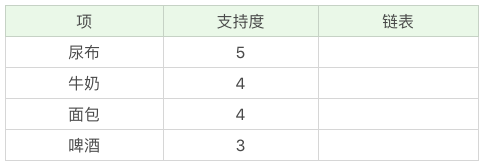

**2. 构造 FP 树**

FP 树的根节点记为 NULL 节点。

整个流程是需要再次扫描数据集，对于每一条数据，按照支持度从高到低的顺序进行创建节点（也就是第一步中项头表中的排序结果），节点如果存在就将计数 count+1，如果不存在就进行创建。同时在创建的过程中，需要更新项头表的链表。

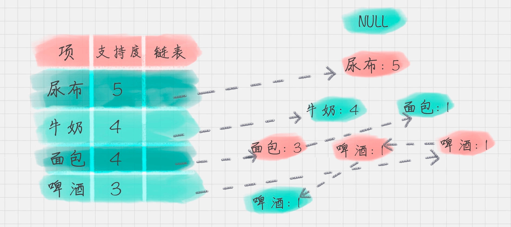

**3. 通过 FP 树挖掘频繁项集**

到这里，我们就得到了一个存储频繁项集的 FP 树，以及一个项头表。我们可以通过项头表来挖掘出每个频繁项集。

具体的操作会用到一个概念，叫“条件模式基”，它指的是以要挖掘的节点为叶子节点，自底向上求出 FP 子树，然后将 FP 子树的祖先节点设置为叶子节点之和。

我以“啤酒”的节点为例，从 FP 树中可以得到一棵 FP 子树，将祖先节点的支持度记为叶子节点之和，得到：

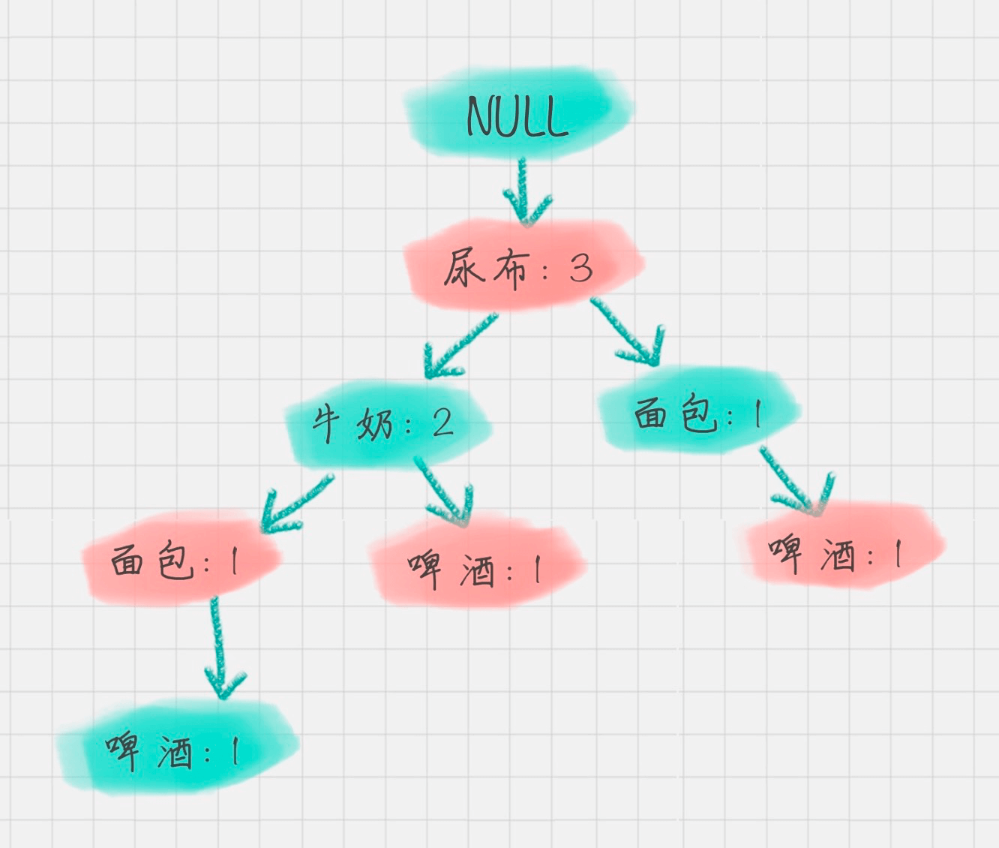

你能看出来，相比于原来的 FP 树，尿布和牛奶的频繁项集数减少了。这是因为我们求得的是以“啤酒”为节点的 FP 子树，也就是说，在频繁项集中一定要含有“啤酒”这个项。你可以再看下原始的数据，其中订单 1{牛奶、面包、尿布}和订单 5{牛奶、面包、尿布、可乐}并不存在“啤酒”这个项，所以针对订单 1，尿布→牛奶→面包这个项集就会从 FP 树中去掉，针对订单 5 也包括了尿布→牛奶→面包这个项集也会从 FP 树中去掉，所以你能看到以“啤酒”为节点的 FP 子树，尿布、牛奶、面包项集上的计数比原来少了 2。

条件模式基不包括“啤酒”节点，而且祖先节点如果小于最小支持度就会被剪枝，所以“啤酒”的条件模式基为空。

同理，我们可以求得“面包”的条件模式基为：

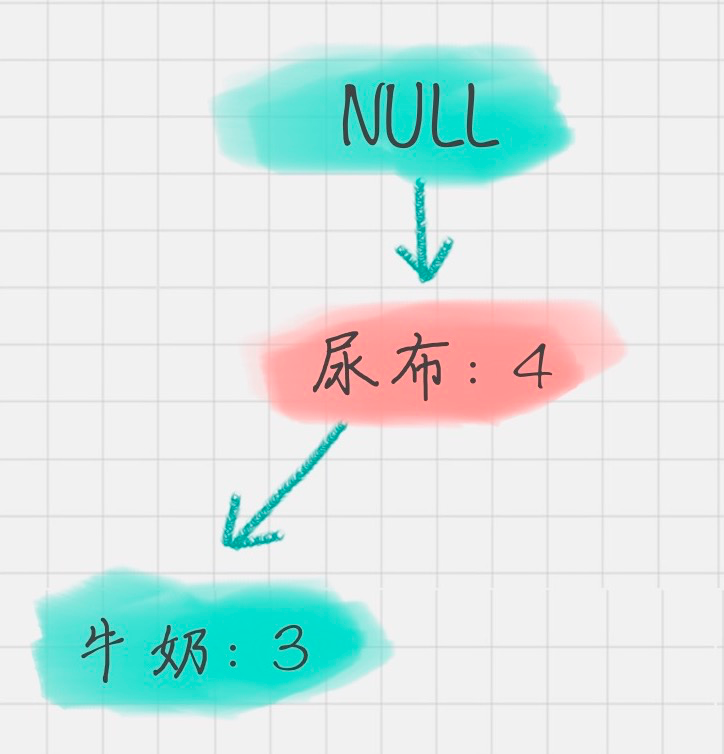

所以可以求得面包的频繁项集为{尿布，面包}，{尿布，牛奶，面包}。同样，我们还可以求得牛奶，尿布的频繁项集，这里就不再计算展示。

## 总结

今天我给你讲了 Apriori 算法，它是在“购物篮分析”中常用的关联规则挖掘算法，在 Apriori 算法中你最主要是需要明白支持度、置信度、提升度这几个概念，以及 Apriori 迭代计算频繁项集的工作流程。

Apriori 算法在实际工作中需要对数据集扫描多次，会消耗大量的计算时间，所以在 2000 年 FP-Growth 算法被提出来，它只需要扫描两次数据集即可以完成关联规则的挖掘。FP-Growth 算法最主要的贡献就是提出了 FP 树和项头表，通过 FP 树减少了频繁项集的存储以及计算时间。

当然 Apriori 的改进算法除了 FP-Growth 算法以外，还有 CBA 算法、GSP 算法，这里就不进行介绍。

你能发现一种新理论的提出，往往是先从最原始的概念出发，提出一种新的方法。原始概念最接近人们模拟的过程，但往往会存在空间和时间复杂度过高的情况。所以后面其他人会对这个方法做改进型的创新，重点是在空间和时间复杂度上进行降维，比如采用新型的数据结构。你能看出树在存储和检索中是一个非常好用的数据结构。

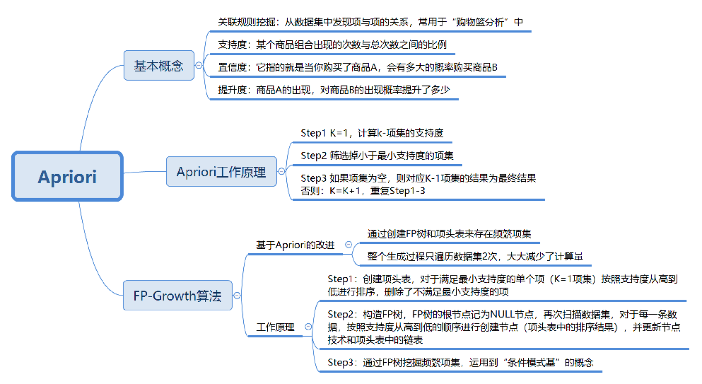

最后给你留两道思考题吧，你能说一说 Apriori 的工作原理吗？相比于 Apriori，FP-Growth 算法都有哪些改进？

欢迎你在评论区与我分享你的答案，也欢迎点击“请朋友读”，把这篇文章分享给你的朋友或者同事，一起来学习。

---
来源：极客时间
链接：https://time.geekbang.org/column/article/82628
日期：2026-05-12
