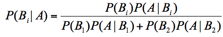
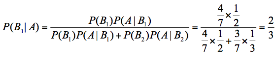
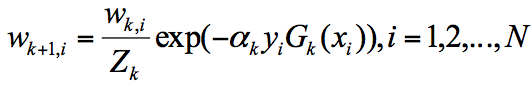
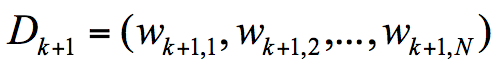
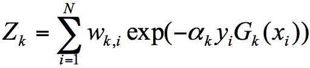
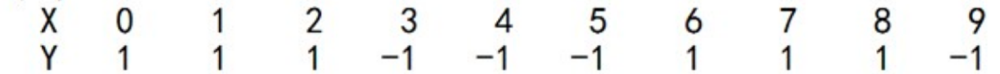

# 36丨数据分析算法篇答疑

算法篇更新到现在就算结束了，因为这一模块比较难，所以大家提出了形形色色的问题。我总结了同学们经常遇到的问题，精选了几个有代表性的来作为答疑。没有列出的问题，我也会在评论区陆续解答。

## 17-19 篇：决策树

### 答疑 1：在探索数据的代码中，print(boston.feature_names) 有什么作用？

boston 是 sklearn 自带的数据集，里面有 5 个 keys，分别是 data、target、feature_names、DESCR 和 filename。其中 data 代表特征矩阵，target 代表目标结果，feature_names 代表 data 对应的特征名称，DESCR 是对数据集的描述，filename 对应的是 boston 这个数据在本地的存放文件路径。

针对 sklearn 中自带的数据集，你可以查看下加载之后，都有哪些字段。调用方法如下：

```
boston=load_boston()
print(boston.keys())
```

通过 boston.keys() 你可以看到，boston 数据集的字段包括了[‘data’, ‘target’, ‘feature_names’, ‘DESCR’, ‘filename’]。

### 答疑 2：决策树的剪枝在 sklearn 中是如何实现的？

实际上决策树分类器，以及决策树回归器（对应 DecisionTreeRegressor 类）都没有集成剪枝步骤。一般对决策树进行缩减，常用的方法是在构造 DecisionTreeClassifier 类时，对参数进行设置，比如 max_depth 表示树的最大深度，max_leaf_nodes 表示最大的叶子节点数。

通过调整这两个参数，就能对决策树进行剪枝。当然也可以自己编写剪枝程序完成剪枝。

### 答疑 3：对泰坦尼克号的乘客做生存预测的时候，Carbin 字段缺失率分别为 77% 和 78%，Age 和 Fare 字段有缺失值，是如何判断出来的？

首先我们需要对数据进行探索，一般是将数据存储到 DataFrame 中，使用 df.info() 可以看到表格的一些具体信息，代码如下：

```
# 数据加载
train_data = pd.read_csv('./Titanic_Data/train.csv')
test_data = pd.read_csv('./Titanic_Data/test.csv')
print(train_data.info())
print(test_data.info())
```

这是运行结果：

```
<class 'pandas.core.frame.DataFrame'>
RangeIndex: 891 entries, 0 to 890
Data columns (total 12 columns):
PassengerId    891 non-null int64
Survived       891 non-null int64
Pclass         891 non-null int64
Name           891 non-null object
Sex            891 non-null object
Age            714 non-null float64
SibSp          891 non-null int64
Parch          891 non-null int64
Ticket         891 non-null object
Fare           891 non-null float64
Cabin          204 non-null object
Embarked       889 non-null object
dtypes: float64(2), int64(5), object(5)
memory usage: 83.6+ KB
None
<class 'pandas.core.frame.DataFrame'>
RangeIndex: 418 entries, 0 to 417
Data columns (total 11 columns):
PassengerId    418 non-null int64
Pclass         418 non-null int64
Name           418 non-null object
Sex            418 non-null object
Age            332 non-null float64
SibSp          418 non-null int64
Parch          418 non-null int64
Ticket         418 non-null object
Fare           417 non-null float64
Cabin          91 non-null object
Embarked       418 non-null object
dtypes: float64(2), int64(4), object(5)
memory usage: 36.0+ KB
None
```

你可以关注下运行结果中 Carbin 的部分，你能看到在训练集中一共 891 行数据，Carbin 有数值的只有 204 个，那么缺失率为 1-204/891=77%，同样在测试集中一共有 418 行数据，Carbin 有数值的只有 91 个，那么缺失率为 1-91/418=78%。

同理你也能看到在训练集中，Age 字段有缺失值。在测试集中，Age 字段和 Fare 字段有缺失值。

### 答疑 4：在用 pd.read_csv 时报错“UnicodeDecodeError utf-8 codec can’t decode byte 0xcf in position 15: invalid continuation byte”是什么问题？

一般在 Python 中遇到编码问题，尤其是中文编码出错，是比较常见的。有几个常用的解决办法，你可以都试一下：

将 read_csv 中的编码改为 gb18030，代码为：data = pd.read_csv(filename, encoding = ‘gb18030’)。代码前添加 # -- coding: utf-8 --。

我说一下 gb18030 和 utf-8 的区别。utf-8 是国际通用字符编码，gb18030 是新出的国家标准，不仅包括了简体和繁体，也包括了一些不常见的中文，相比于 utf-8 更全，容错率更高。

为了让编辑器对中文更加支持，你也可以在代码最开始添加 # -- coding: utf-8 -- 的说明，再结合其他方法解决编码出错的问题。

## 第 20-21 篇：朴素贝叶斯

### 答疑 1：在朴素贝叶斯中，我们要统计的是属性的条件概率，也就是假设取出来的是白色的棋子，那么它属于盒子 A 的概率是 2/3。这个我算的是 3/5，跟老师的不一样，老师可以给一下详细步骤吗？

不少同学都遇到了这个问题，我来统一解答下。

这里我们需要运用贝叶斯公式（我在文章中也给出了），即：



假设 A 代表白棋子，B1 代表 A 盒，B2 代表 B 盒。带入贝叶斯公式，我们可以得到：



其中 P(B1​) 代表 A 盒的概率，7 个棋子，A 盒有 4 个，所以 P(B1​)=4/7。

P(B2​) 代表 B 盒的概率，7 个棋子，B 盒有 3 个，所以 P(B2​)=3/7。

最终求取出来的是白色的棋子，那么它属于 A 盒的概率 P(B1​∣A)= 2/3。

## 22-23 篇：SVM 算法

### 答疑 1：SVM 多分类器是集成算法么？

SVM 算法最初是为二分类问题设计的，如果我们想要把 SVM 分类器用于多分类问题，常用的有一对一方法和一对多方法（我在文章中有介绍到）。

集成学习的概念你这样理解：通过构造和使用多个分类器完成分类任务，也就是我们所说的博取众长。

以上是 SVM 多分类器和集成算法的概念，关于 SVM 多分类器是否属于集成算法，我认为你需要这样理解。

在 SVM 的多分类问题中，不论是采用一对一，还是一对多的方法，都会构造多个分类器，从这个角度来看确实在用集成学习的思想，通过这些分类器完成最后的学习任务。

不过我们一般所说的集成学习，需要有两个基本条件：

每个分类器的准确率要比随机分类的好，即准确率大于 50%；每个分类器应该尽量相互独立，这样才能博采众长，否则多个分类器一起工作，和单个分类器工作相差不大。

所以你能看出，在集成学习中，虽然每个弱分类器性能不强，但都可以独立工作，完成整个分类任务。而在 SVM 多分类问题中，不论是一对一，还是一对多的方法，每次都在做一个二分类问题，并不能直接给出多分类的结果。

此外，当我们谈集成学习的时候，通常会基于单个分类器之间是否存在依赖关系，进而分成 Boosting 或者 Bagging 方法。如果单个分类器存在较强的依赖关系，需要串行使用，也就是我们所说的 Boosting 方法。如果单个分类器之间不存在强依赖关系，可以并行工作，就是我们所说的 Bagging 或者随机森林方法（Bagging 的升级版）。

所以，一个二分类器构造成多分类器是采用了集成学习的思路，不过在我们谈论集成学习的时候，通常指的是 Boosing 或者 Bagging 方法，因为需要每个分类器（弱分类器）都有分类的能力。

## 26-27 篇：K-Means

### 答疑 1：我在给 20 支亚洲球队做聚类模拟的时候，使用 K-Means 算法需要重新计算这三个类的中心点，最简单的方式就是取平均值，然后根据新的中心点按照距离远近重新分配球队的分类。对中心点的重新计算不太理解。

实际上是对属于这个类别的点的特征值求平均，即为新的中心点的特征值。

比如都属于同一个类别里面有 10 个点，那么新的中心点就是这 10 个点的中心点，一种简单的方式就是取平均值。比如文章中的足球队一共有 3 个指标，每个球队都有这三个指标的特征值，那么新的中心点，就是取这个类别中的这些点的这三个指标特征值的平均值。

## 28-29 篇：EM 聚类

### 答疑 1：关于 EM 聚类初始参数设置的问题，初始参数随机设置会影响聚类的效果吗。会不会初始参数不对，聚类就出错了呢？

实际上只是增加了迭代次数而已。

EM 算法的强大在于它的鲁棒性，或者说它的机制允许初始化参数存在误差。

举个例子，EM 的核心是通过参数估计来完成聚类。如果你想要把菜平均分到两个盘子中，一开始 A 盘的菜很少，B 盘的菜很多，我们只要通过 EM 不断迭代，就会让两个盘子的菜量一样多，只是迭代的次数多一些而已。

另外多说一句，我们学的这些数据挖掘的算法，不论是 EM、Adaboost 还是 K-Means，最大的价值都是它们的思想。我们在使用工具的时候都会设置初始化参数，比如在 K-Means 中要选择中心点，即使一开始只是随机选择，最后通过迭代都会得到不错的效果。所以说学习这些算法，就是学习它们的思想。

## 30-31 篇：关联规则挖掘

### 答疑 1：看不懂构造 FP 树的过程，面包和啤酒为什么会拆分呢？

FP-Growth 中有一个概念叫条件模式基。它在创建 FP 树的时候还用不上，我们主要通过扫描整个数据和项头表来构造 FP 树。条件模式基用于挖掘频繁项。通过找到每个项（item）的条件模式基，递归挖掘频繁项集。

### 答疑 2：不怎么会找元素的 XPath 路径。

XPath 的作用大家应该都能理解，具体的使用其实就是经验和技巧的问题。

我的方法就是不断尝试，而且 XPath 有自己的规则，绝大部分的情况下都是以 // 开头，因为想要匹配所有的元素。我们也可以找一些关键的特征来进行匹配，比如 class='item-root’的节点，或者 id='root’都是很好的特征。通过观察 id 或 class，也可以自己编写 XPath，这样写的 XPath 会更短。总之，都是要不断尝试，才能找到自己想要找的内容，寻找 XPath 的过程就是一个找规律的过程。

### 答疑 3：最小支持度可以设置小一些，如果最小支持度小，那么置信度就要设置得相对大一点，不然即使提升度高，也有可能是巧合。这个参数跟数据量以及项的数量有关。理解对吗？

一般来说最小置信度都会大一些，比如 1.0，0.9 或者 0.8。最小支持度和数据集大小和特点有关，可以尝试一些数值来观察结果，比如 0.1，0.5。

## 34-35 篇：AdaBoost 算法

### 答疑 1：关于 Zk​ 和 yi​ 的含义

第 k+1 轮的样本权重，是根据该样本在第 k 轮的权重以及第 k 个分类器的准确率而定，具体的公式为：



其中 Zk​, yi​ 代表什么呢？

Zk​ 代表规范化因子，我们知道第 K+1 轮样本的权重为：



为了让样本权重之和为 1，我们需要除以规范化因子 Zk​，所以：



yi​ 代表的是目标的结果，我在 AdaBoost 工作原理之后，列了一个 10 个训练样本的例子：



你能看到通常我们把 X 作为特征值，y 作为目标结果。在算法篇下的实战练习中，我们一般会把训练集分成 train_X 和 train_y，其中 train_X 代表特征矩阵，train_y 代表目标结果。

我发现大家对工具的使用和场景比较感兴趣，所以最后留两道思考题。

第一道题是，在数据挖掘的工具里，我们大部分情况下使用的是 sklearn，它自带了一些数据集，你能列举下 sklearn 自带的数据集都有哪些么？我在第 18 篇使用 print(boston.feature_names) 来查看 boston 数据集的特征名称（数据集特征矩阵的 index 名称），你能查看下其他数据集的特征名称都是什么吗？列举 1-2 个 sklearn 数据集即可。

第二个问题是，对于数据挖掘算法来说，基础就是数据集。Kaggle 网站之所以受到数据科学从业人员的青睐就是因为有众多比赛的数据集，以及社区间的讨论交流。你是否有使用过 Kaggle 网站的经历，如果有的话，可以分享下你的使用经验吗？如果你是个数据分析的新人，当看到 Kaggle 网站时，能否找到适合初学者的 kernels 么 (其他人在 Kaggle 上成功运行的代码分享)？

欢迎你在评论区与我分享你的答案，也欢迎点击“请朋友读”，把这篇文章分享给你的朋友或者同事。

---
来源：极客时间
链接：https://time.geekbang.org/column/article/84499
日期：2026-05-12
