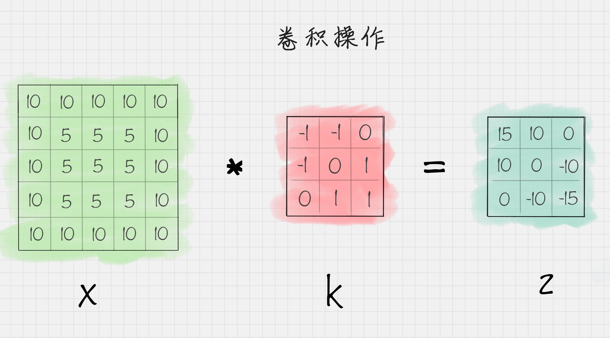
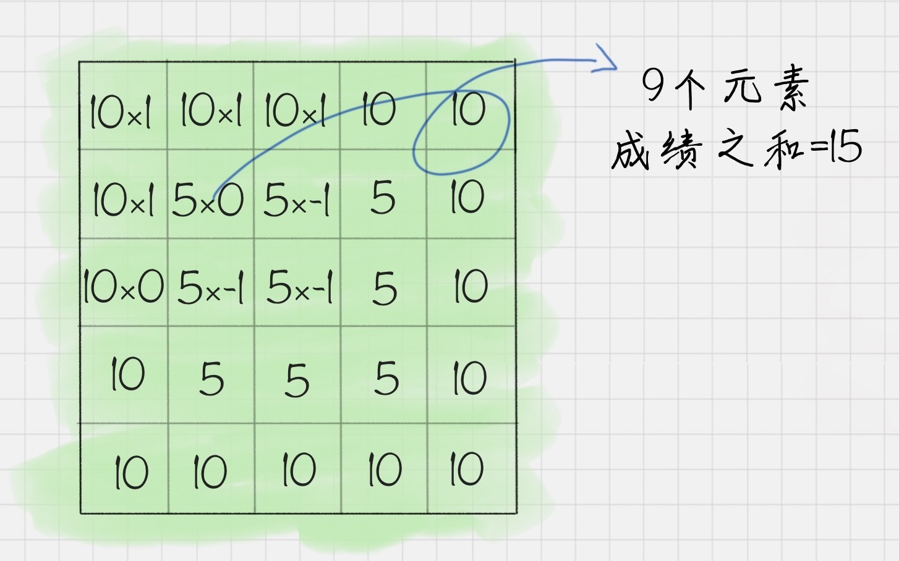
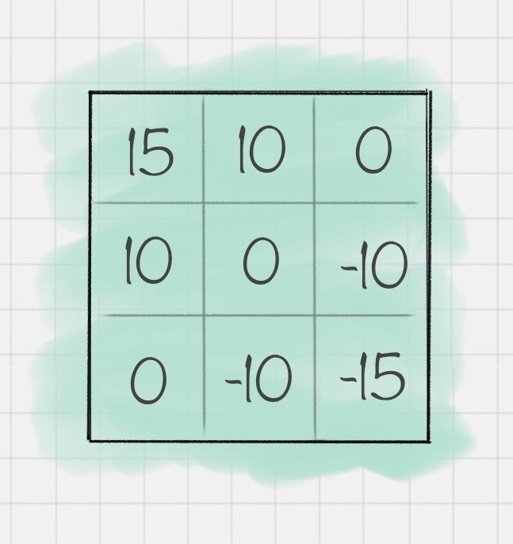
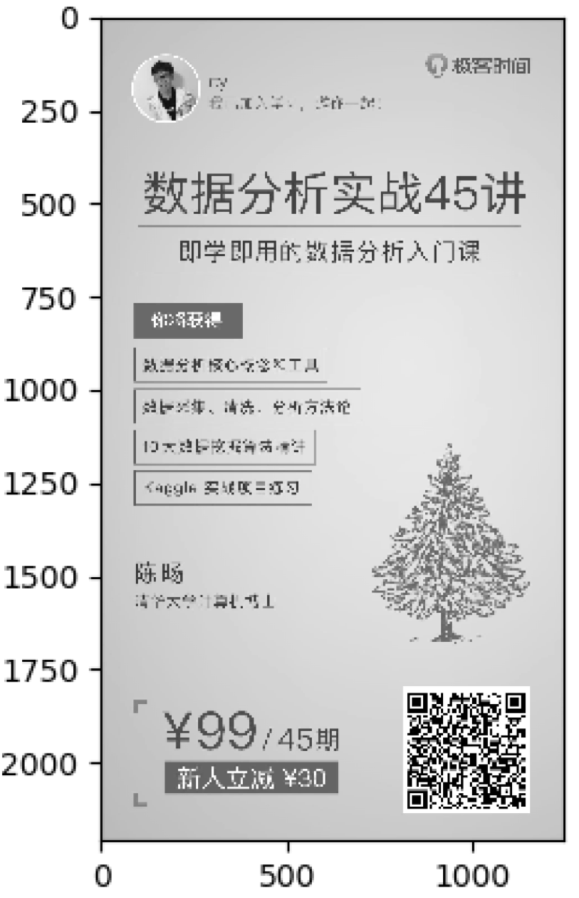
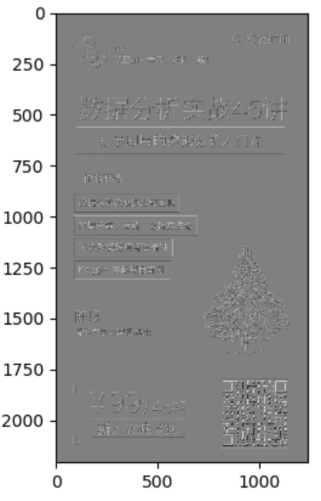
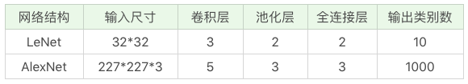
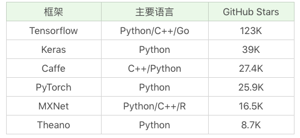
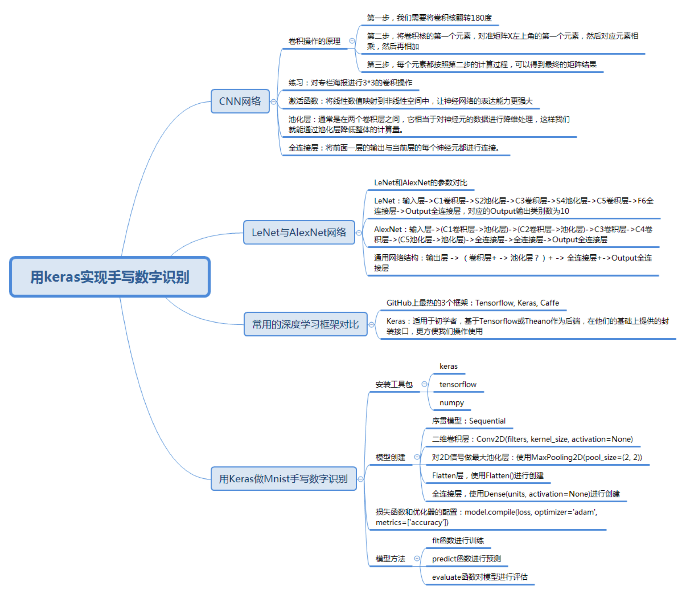

# 43丨深度学习（下）：如何用Keras搭建深度学习网络做手写数字识别？

通过上节课的讲解，我们已经对神经网络和深度学习有了基本的了解。这节课我就用 Keras 这个深度学习框架做一个识别手写数字的练习。

你也许还有印象，在 KNN 算法那节中，我讲到过 Mnist 手写数字识别这个数据集，当时我们采用的是 mini 版的手写数字数据集。实际上完整版的 Mnist 一共有 60000 个训练样本和 10000 个测试样本，这么庞大的数据量更适合用深度学习框架完成训练。

今天的学习目标主要有以下的几个方面：

进一步了解 CNN 网络。CNN 网络在深度学习网络中应用很广，很多网络都是基于 CNN 网络构建的，你有必要进一步了解 CNN 的网络层次，尤其是关于卷积的原理。初步了解 LeNet 和 AlexNet。它们都是经典的 CNN 网络，我们今天的任务就是认识这些经典的 CNN 网络，这样在接触更深度的 CNN 网络的时候，比如 VGG、GoogleNet 和 ResNet 这些网络的时候，就会更容易理解和使用。对常用的深度学习框架进行对比，包括 Tensorflow、Keras、Caffe、PyTorch、 MXnet 和 Theano。当选择深度学习框架的时候到底该选择哪个？使用 Keras 这个深度学习框架编写代码，完成第一个深度学习任务，也就是 Mnist 手写数字识别。

## 如何理解 CNN 网络中的卷积作用

CNN 的网络结构由三种层组成，它们分别是卷积层、池化层和全连接层。

在上篇文章中，我讲到卷积层相当于滤镜的作用，它可以把图像分块，对每一块的图像进行卷积操作。

卷积本身是一种矩阵运算，那什么是卷积呢？

假设我有一个二维的图像 X，和卷积 K，把二维矩阵 X 进行卷积 K 操作之后，可以得到矩阵 Z，如下图所示：



我简单说下计算的原理。

第一步，我们需要将卷积核翻转 180 度（只有翻转之后才能做矩阵运算），也就是变成：


第二步，将卷积核的第一个元素，对准矩阵 X 左上角的第一个元素，对应元素相乘，然后再相加可以就可以得到 10*1+10*1+10*0+10*1+5*0+5*-1+10*0+5*-1+5*-1=15。



第三步，每个元素都重复第二步的计算过程，可以得到如下的矩阵结果 Z：



这样我们就完成了一个卷积的操作。如果编写代码的话，你可以这样写：

```
import pylab
import numpy as np
from scipy import signal
# 设置原图像
img = np.array([[10, 10, 10, 10, 10],
                     [10, 5, 5, 5, 10],
                     [10, 5, 5, 5, 10],
                     [10, 5, 5, 5, 10],
                     [10, 10, 10, 10, 10]])
# 设置卷积核
fil = np.array([[ -1,-1, 0],
                [ -1, 0, 1],
                [  0, 1, 1]])
# 对原图像进行卷积操作
res = signal.convolve2d(img, fil, mode='valid')
# 输出卷积后的结果
print(res)
```

运行结果：

```
[[ 15  10   0]
 [ 10   0 -10]
 [  0 -10 -15]]
```

这里我用到了 convolve2d 函数对图像 img 和卷积核 fil 做卷积运算，最后输出结果 res。你可能还是会问，为什么我们要对图像进行卷积操作呢？你可以看看下面一段代码：

```
import matplotlib.pyplot as plt
import pylab
import cv2
import numpy as np
from scipy import signal
# 读取灰度图像
img = cv2.imread("haibao.jpg", 0)
# 显示灰度图像
plt.imshow(img,cmap="gray")
pylab.show()
# 设置卷积核
fil = np.array([[ -1,-1, 0],
                [ -1, 0, 1],
                [  0, 1, 1]])
# 卷积操作
res = signal.convolve2d(img, fil, mode='valid')
print(res)
#显示卷积后的图片
plt.imshow(res,cmap="gray")
pylab.show()
```

运行结果：





这里我对专栏的海报做了卷积的操作，你能看到卷积操作是对图像进行了特征的提取。实际上每个卷积核都是一种滤波器，它们把图像中符合条件的部分筛选出来，也就相当于做了某种特征提取。

在 CNN 的卷积层中可以有多个卷积核，以 LeNet 为例，它的第一层卷积核有 6 个，因此可以帮我们提取出图像的 6 个特征，从而得到 6 个特征图（feature maps）。

### 激活函数的作用

做完卷积操作之后，通常还需要使用激活函数对图像进一步处理。在逻辑回归中，我提到过 Sigmoid 函数，它在深度学习中有广泛的应用，除了 Sigmoid 函数作为激活函数以外，tanh、ReLU 都是常用的激活函数。

这些激活函数通常都是非线性的函数，使用它们的目的是把线性数值映射到非线性空间中。卷积操作实际上是两个矩阵之间的乘法，得到的结果也是线性的。只有经过非线性的激活函数运算之后，才能映射到非线性空间中，这样也可以让神经网络的表达能力更强大。

### 池化层的作用

池化层通常在两个卷积层之间，它的作用相当于对神经元的数据做降维处理，这样就能降低整体计算量。

假设池化的窗大小是 2x2，就相当于用一个 2x2 的窗口对输出数据进行计算，将原图中 2x2 矩阵的 4 个点变成一个点。常用的池化操作是平均池化和最大池化。平均池化是对特征点求平均值，也就是用 4 个点的平均值来做代表。最大池化则是对特征点求最大值，也就是用 4 个点的最大值来做代表。

在神经网络中，我们可以叠加多个卷积层和池化层来提取更抽象的特征。经过几次卷积和池化之后，通常会有一个或多个全连接层。

### 全连接层的作用

全连接层将前面一层的输出结果与当前层的每个神经元都进行了连接。

这样就可以把前面计算出来的所有特征，通过全连接层将输出值输送给分类器，比如 Softmax 分类器。在深度学习中，Softmax 是个很有用的分类器，通过它可以把输入值映射到 0-1 之间，而且所有输出结果相加等于 1。其实你可以换种方式理解这个概念，假设我们想要识别一个数字，从 0 到 9 都有可能。那么通过 Softmax 层，对应输出 10 种分类结果，每个结果都有一个概率值，这些概率相加为 1，我们就可以知道这个数字是 0 的概率是多少，是 1 的概率是多少……是 9 的概率又是多少，从而也就帮我们完成了数字识别的任务。

## LeNet 和 AlexNet 网络

你能看出 CNN 网络结构中每一层的作用：它通过卷积层提取特征，通过激活函数让结果映射到非线性空间，增强了结果的表达能力，再通过池化层压缩特征图，降低了网络复杂度，最后通过全连接层归一化，然后连接 Softmax 分类器进行计算每个类别的概率。

通常我们可以使用多个卷积层和池化层，最后再连接一个或者多个全连接层，这样也就产生了不同的网络结构，比如 LeNet 和 AlexNet。

我将 LeNet 和 AlexNet 的参数特征整理如下：



LeNet 提出于 1986 年，是最早用于数字识别的 CNN 网络，输入尺寸是 32*32。它输入的是灰度的图像，整个的网络结构是：输入层→C1 卷积层→S2 池化层→C3 卷积层→S4 池化层→C5 卷积层→F6 全连接层→Output 全连接层，对应的 Output 输出类别数为 10。

AlexNet 在 LeNet 的基础上做了改进，提出了更深的 CNN 网络模型，输入尺寸是 227*227*3，可以输入 RGB 三通道的图像，整个网络的结构是：输入层→(C1 卷积层→池化层)→(C2 卷积层→池化层)→C3 卷积层→C4 卷积层→(C5 池化层→池化层)→全连接层→全连接层→Output 全连接层。

实际上后面提出来的深度模型，比如 VGG、GoogleNet 和 ResNet 都是基于下面的这种结构方式改进的：输出层→（卷积层 + -> 池化层？）+ → 全连接层 +→Output 全连接层。

其中“+”代表 1 个或多个，“？”代表 0 个或 1 个。

你能看出卷积层后面可以有一个池化层，也可以没有池化层，“卷积层 + → 池化层？”这样的结构算是一组卷积层，在多组卷积层之后，可以连接多个全连接层，最后再接 Output 全连接层。

## 常用的深度学习框架对比

了解了 CNN 的网络结构之后，我们来看下常用的深度学习框架都有哪些。

下面这张图是常用框架的简单对比。



从 GitHub 上的热门程序排序来看，Tensorflow、Keras 和 Caffe 是三个排名最高的深度学习框架，其中 Tensorflow 是 Google 出品，也是深度学习最常用的库。关于 Keras，你可以理解成是把 Tensorflow 或 Theano 作为后端，基于它们提供的封装接口，这样更方便我们操作使用。Caffe、PyTorch、MXNet 和 Theano 也是常用的深度学习库，你在接触深度学习的时候可能也会遇到，这里不做介绍。

如果你刚进入深度学习这个领域，我更建议你直接使用 Keras，因为它使用方便，更加友好，可以方便我们快速构建网络模型，不需要过多关注底层细节。

## 用 Keras 做 Mnist 手写数字识别

Keras 也是基于 Python 语言的。在使用 Keras 之前，我们需要安装相应的工具包：

```
pip install keras
pip install tensorflow
```

这里需要注明的是 Keras 需要用 tensorflow 或者 theano 作为后端，因此我们也需要引入相关的工具。同时你还需要注意 NumPy 版本是否为最新的版本，我们需要采用最新的 NumPy 版本才能正常运行 keras，更新 NumPy 工具的方法：

```
pip install -U numpy
```

安装好 Keras 工具包之后，就可以创建一个 Sequential 序贯模型，它的作用是将多个网络层线性堆叠起来，使用方法：

```
from keras.models import Sequential
model = Sequential()
```

然后就可以在网络中添加各种层了。

### 创建二维卷积层

使用 Conv2D(filters, kernel_size, activation=None) 进行创建, 其中 filters 代表卷积核的数量，kernel_size 代表卷积核的宽度和长度，activation 代表激活函数。如果创建的二维卷积层是第一个卷积层，我们还需要提供 input_shape 参数，比如：input_shape=(28, 28, 1) 代表的就是 28*28 的灰度图像。

### 对 2D 信号做最大池化层

使用 MaxPooling2D(pool_size=(2, 2)) 进行创建，其中 pool_size 代表下采样因子，比如 pool_size=(2,2) 的时候相当于将原来 22 的矩阵变成一个点，即用 22 矩阵中的最大值代替，输出的图像在长度和宽度上均为原图的一半。

### 创建 Flatten 层

使用 Flatten() 创建，常用于将多维的输入扁平化，也就是展开为一维的向量。一般用在卷积层与全连接层之间，方便后面进行全连接层的操作。

### 创建全连接层

使用 Dense(units, activation=None) 进行创建，其中 units 代表的是输出的空间维度，activation 代表的激活函数。

我这里只列举了部分常用的层，这些层在今天手写数字识别的项目中会用到。当我们把层创建好之后，可以加入到模型中，使用 model.add() 函数即可。

添加好网络模型中的层之后，我们可以使用 model.compile(loss, optimizer=‘adam’, metrics=[‘accuracy’]) 来完成损失函数和优化器的配置，其中 loss 代表损失函数的配置，optimizer 代表优化器，metrics 代表评估模型所采用的指标。

然后我们可以使用 fit 函数进行训练，使用 predict 函数进行预测，使用 evaluate 函数对模型评估。

针对 Mnist 手写数字识别，用 keras 的实现代码如下：

```
# 使用LeNet模型对Mnist手写数字进行识别
import keras
from keras.datasets import mnist
from keras.layers import Conv2D, MaxPooling2D
from keras.layers import Dense, Flatten
from keras.models import Sequential
# 数据加载
(train_x, train_y), (test_x, test_y) = mnist.load_data()
# 输入数据为 mnist 数据集
train_x = train_x.reshape(train_x.shape[0], 28, 28, 1)
test_x = test_x.reshape(test_x.shape[0], 28, 28, 1)
train_x = train_x / 255
test_x = test_x / 255
train_y = keras.utils.to_categorical(train_y, 10)
test_y = keras.utils.to_categorical(test_y, 10)
# 创建序贯模型
model = Sequential()
# 第一层卷积层：6个卷积核，大小为5∗5, relu激活函数
model.add(Conv2D(6, kernel_size=(5, 5), activation='relu', input_shape=(28, 28, 1)))
# 第二层池化层：最大池化
model.add(MaxPooling2D(pool_size=(2, 2)))
# 第三层卷积层：16个卷积核，大小为5*5，relu激活函数
model.add(Conv2D(16, kernel_size=(5, 5), activation='relu'))
# 第二层池化层：最大池化
model.add(MaxPooling2D(pool_size=(2, 2)))
# 将参数进行扁平化，在LeNet5中称之为卷积层，实际上这一层是一维向量，和全连接层一样
model.add(Flatten())
model.add(Dense(120, activation='relu'))
# 全连接层，输出节点个数为84个
model.add(Dense(84, activation='relu'))
# 输出层 用softmax 激活函数计算分类概率
model.add(Dense(10, activation='softmax'))
# 设置损失函数和优化器配置
model.compile(loss=keras.metrics.categorical_crossentropy, optimizer=keras.optimizers.Adam(), metrics=['accuracy'])
# 传入训练数据进行训练
model.fit(train_x, train_y, batch_size=128, epochs=2, verbose=1, validation_data=(test_x, test_y))
# 对结果进行评估
score = model.evaluate(test_x, test_y)
print('误差:%0.4lf' %score[0])
print('准确率:', score[1])
```

运行结果：

```
……（省略中间迭代的结算结果，即显示每次迭代的误差loss和准确率acc）
误差:0.0699
准确率: 0.9776
```

我用 epochs 控制了训练的次数，当训练 2 遍的时候，准确率达到 97.76%，还是很高的。

## 总结

今天我们用 keras 对手写数字进行了识别，具体的代码部分讲解的不多，其中涉及到 API，你可以参考下 Keras 中文手册。

在这个过程里，我们只是使用了 LeNet 的网络模型，实际上 AlexNet、VGG、GoogleNet 和 ResNet 都是基于 CNN 的网络结构。在 CNN 网络中包括了卷积层、池化层和全连接层。一个基于 CNN 的深度学习网络通常是几组卷积层之后，再连接多个全连接层，最后再接 Output 全连接层，而每组的卷积层都是“卷积层 + →池化层？”的结构。

另外，通过今天的学习你应该能体会到卷积在图像领域中的应用。今天我对专栏的海报进行了一个 3*3 的卷积核操作，可以看到卷积之后得到的图像是原图像某种特征的提取。在实际的卷积层中，会包括多个卷积核，对原图像在不同特征上进行提取。通过多个卷积层的操作，可以在更高的维度上对图像特征进一步提取，这样可以让机器在不同层次、不同维度理解图像特征。

另外在 Keras 使用中，你能看到与 sklearn 中的机器学习算法使用不同。我们需要对网络模型中的层进行配置，将创建好的层添加到模型中，然后对模型中使用的损失函数和优化器进行配置，最后就可以对它进行训练和预测了。



今天讲的知识点比较多，其中我讲到了卷积、卷积核和卷积层，你能说一下对这三者的理解吗？你之前有使用 Keras 或 Tensorflow 的经验么，你能否谈谈你的使用感受？

欢迎你在评论区与我分享你的答案，也欢迎点击“请朋友读”，把这篇文章分享给你的朋友或者同事。

---
来源：极客时间
链接：https://time.geekbang.org/column/article/87071
日期：2026-05-12
