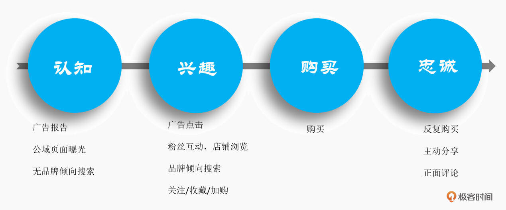
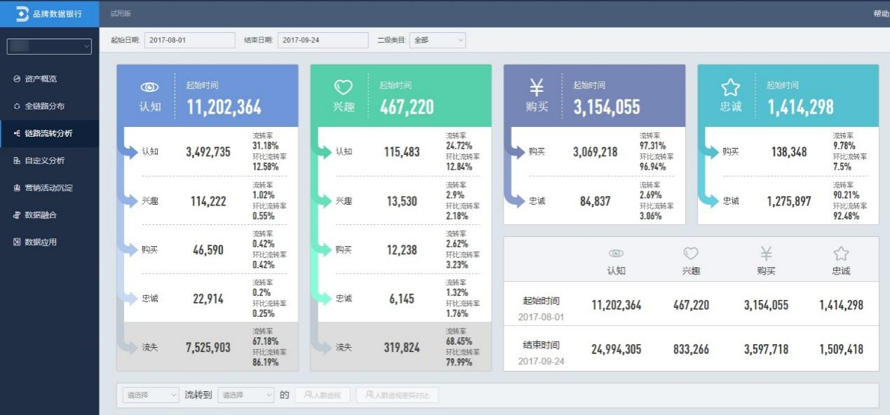
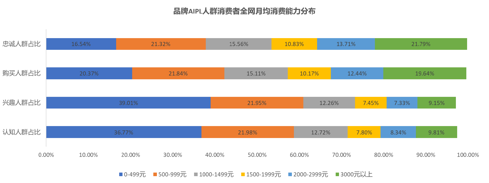
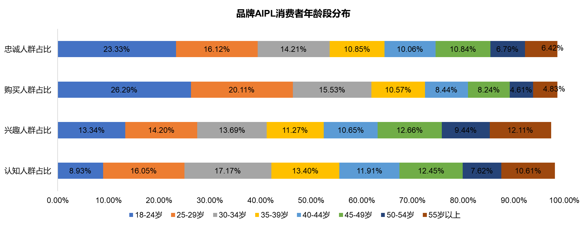

# 加餐04｜AIIPL模型：可口可乐的品牌资产是多少？

你好，我是陈博士。

我们知道，可口可乐的品牌资产大于元气森林，这是一个定性的结论，但很难对可口可乐的品牌资产进行量化。如果我们有 AIPL 模型，而且能获取用户行为的完整路径，就可以计算出来可口可乐的品牌资产。比如这里我们可以假设：一个品牌的品牌资产 = 未来 3 年该品牌的消费金额。

## **AIPL 模型**

那什么是 AIPL 模型？AIPL 模型就是品牌营销中常用的一种用户行为路径模型，它描述了消费者从认知到购买再到忠诚的全过程。AIPL 代表了四个阶段：

- A：Attention（注意）
- I：Interest（兴趣）
- P：Purchase（购买）
- L：Loyalty（忠诚）

你可以看到每个阶段都有自己的定义，比如认知是被动的广告曝光，而兴趣是因为主动的广告点击或者带有品牌倾向的搜索。

为什么说淘宝的广告收入会比中国所有 4A 广告公司总和还要多。这里有一个广告圈里的名言： “我的广告费有一半是浪费的，但是我不知道是哪一半”。品牌主很希望 4A 公司能按照效果来收费，但是广告公司真的很难做到。

而对于淘宝来说，他们有强大的网络可以对用户行为进行检测。如果你想推广 SKII 的化妆品，从微博、优酷上的广告开始，我们就可以知道哪些是你的认知用户。对于点击了广告，或者主动在天猫上进行检索的用户就是你的“兴趣用户”。然后是购买用户，以及 180 天内二次购买的复购用户。

这样通过用户行为的跟踪，品牌主就可以了解到哪些广告费是值得的。

## 做个练习

看下面这张数据图表，**请思考：如果你是品牌经理，你会把广告费投给哪个人群？**是 0-1000 元的低消费人群，还是 2000 元以上的高消费人群？

不难发现，0-1000 元的低消费人群，在认知和兴趣人群比例较高，但是在购买和忠诚人群占比较低，即 ROI 低。而相反，2000 元以上的高消费人群，在认知和兴趣人群比例较低，但是在购买和忠诚人群占比较高，即 ROI 高。所以很明显，把钱投给高消费人群的是明智的。

我们再看下面这个“AIPL 消费者年龄段分布”图，**请思考：如果你是品牌经理，你会把广告费投给哪个人群？**是 18-30 岁的年轻人，还是 50 岁以上的老年人？

同样，不难看出 18-30 岁的年轻人，在认知和兴趣人群比例较低，但是在购买和忠诚人群占比较高，即 ROI 高。而相反，50 岁以上的老年人，认知和兴趣比例 / 购买和忠诚的比例较低，即 ROI 低。所以很明显，把钱投给年轻人群的是明智的。

你能看到，这种数据分析并不难？那难的是什么？

**难的是如何获取到这些数据。**

所以你会发现，大厂会热衷于做产品布局，并从衣食住行的各个产品中将用户体系打通，这样就可以对用户的行为进行有效跟踪，从而识别出用户针对某个品牌的 AIIPL 阶段。

从上面这个例子中可以看到， AIPL 模型将散落的用户行为串联了起来，形成了从意识到忠诚的完整链路。如果你开通了品牌数据引擎（[https://databank.tmall.com/]()），你也可以在后台看到自己品牌店铺的用户画像，以及完整的 AIPL 链路分析。

想要统计品牌的资产，光有 AIPL 模型还不行，你在做的过程中，还会发现缺少用户行为的数据埋点。这里大厂可以发挥它整合产品的优势，将收购过来的产品加上用户的唯一标识。由于这些产品覆盖了 AIPL 的全生命周期，也就相当于获取了完整的用户链路行为。

所以说很多时候，目标很重要，有了目标再来观察缺少什么数据，再来补充什么数据，可以创造更大的价值。

我今天给你分析了 AIPL X 消费分布、AIPL X 年龄分布，你觉得还有哪些 AIPL 阶段和用户特征相结合的分析思维？不妨罗列出来，思考它会带给你怎样的启发。

---
来源：极客时间
链接：https://time.geekbang.org/column/article/838523
日期：2026-05-12
