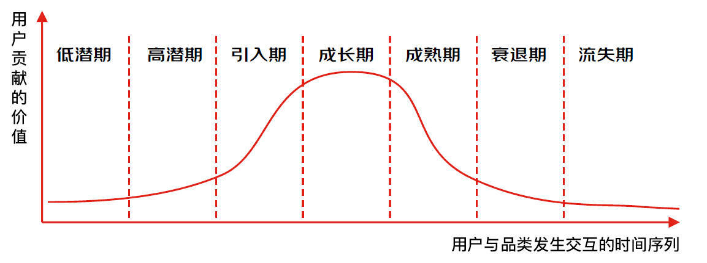
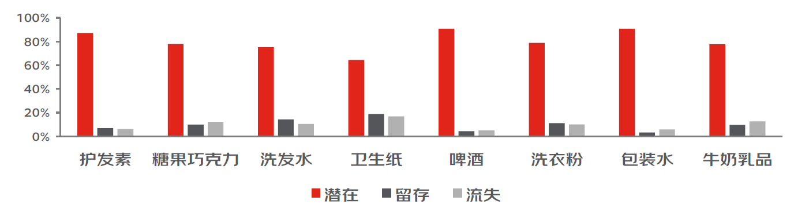
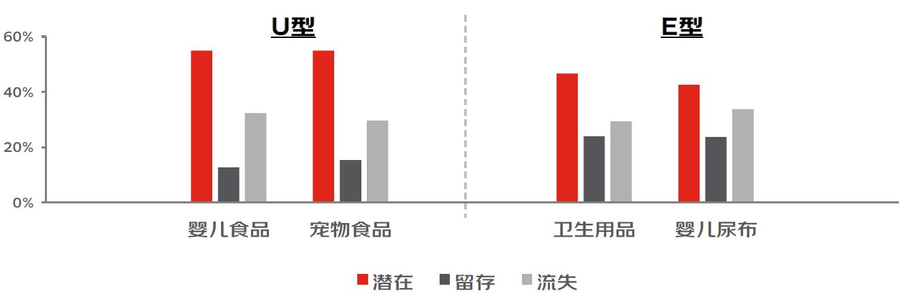
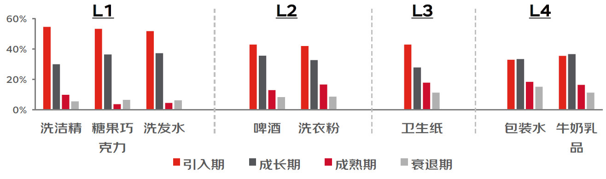
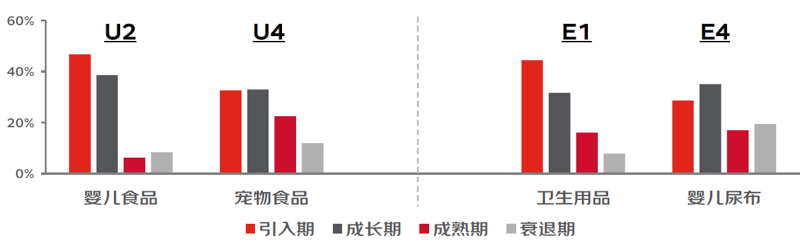

# 加餐06｜客户生命周期管理：你的产品客户结构是怎样的？

你好，我是陈博士。

你是否注意到，不同品类的客户生命周期呈现出不同的特征？有些品类的客户容易持续购买，忠诚度高，而另一些品类的用户则表现出较高的流失率。如何通过分析品类间的用户结构差异，制定更有针对性的运营策略，以实现不同品类的用户增长和优化？

今天给你讲解客户生命周期管理（Customer Lifecycle Management，CLM），它可以更好地帮助品牌理解客户在不同生命周期阶段的需求、行为和价值。

## **客户生命周期管理**

生命周期是深挖用户的有效抓手，根据用户近期购买的行为表现，对比历史购买的趋势变化，将用户划分为：低潜期、高潜期、引入期、成长期、成熟期、衰退期、流失期。有了这些阶段的划分，我们就可以针对不同阶段用户特点，匹配不同的营销策略 ，最终提升运营的精准度和成功率。

这里我们可以将客户的生命周期划分为 3 大阶段或 7 小阶段。

**1.  获客阶段（潜在用户）**

- 低潜期：品类潜在用户，平台站内发生过购买，没有品类相关行为。
- 高潜期：品类潜在用户，平台站内发生过购买，近期开始浏览品类。

**2.  升值阶段（留存用户）**

- 引入期：品类新用户，近期刚完成购买。
- 成长期：品类老用户，发生持续购买但没有到达稳定复购状态，趋势是越买越多。
- 成熟期：品类老用户，发生持续购买且到达稳定复购状态。
- 衰退期：品类老用户，发生持续购买，但没有处于稳定复购状态，趋势是越买越少。

**3.  挽回阶段（挽留用户）**

- 流失期：品类老用户，之前发生过购买，但近期都没有下单。

有了阶段的定性描述，我们还需要对各个阶段进行定量计算，比如计算规则如下：

## **客户生命周期的应用**

计算不是目的，应用才是我们的目标。

如何构建客户生命周期的运营方法论，我们可以观察品类中的用户结构都有哪些类型？

这里我们根据潜在用户、留存用户、流失用户在总用户中的比例，将品类的用户结构划分为 3 种类型（L 型、U 型、E 型），并给出具体的计算方式。

每种用户结构类型都有它的特征，结合这些特征我们可以指定对应的运营策略。

这里我们按照计算规则，得出每个品类的用户结构类型，下面是结果示意：

L 型：

U 型和 E 型：

**那么基于不同的用户结构，应该采用怎样的运营策略？**

- **针对 L 型：**因为大部分用户都在站外，同时站内用户的流失比例尚可，所以站内外拉新是品类用户运营的重点，即引到池子里来。
- **针对 U 型：**虽然大部分用户在站外，但是站内来的用户流失比例较高（大于 20%），因此流失挽回是品类用户运营的重点，攘外必须安内。
- **针对 E 型：**大部分用户已经来到了池子里，同时很多用户都已不需要该产品了，因此存量用户的 ARPU 值提升了该品类用户运营的重点，目标是提升当前用户的价值变现。

## **基于留存用户分布特征的运营方法**

这里我们还可以针对关键的阶段——留存阶段，进行进一步的细分。

重点考虑 ARPU 指标，在快消品中，成熟期用户的 ARPU 值最高，是引入期、成长期、衰退期的 3 倍。

我们可以判断留存用户处于哪一个时期，分布是如何的，来计算不同的类型，执行对应的运营策略。

L 型品类：

U 型和 E 型品类：

**那么基于留存用户的分布，应该采用怎样的运营策略？**

- 引入期用户较多 → 重点关注新晋用户的二次购买。
- 引入期、成长期用户较多 → 提升整体用户的稳定复购。
- 引入期、衰退期用户较多 → 关注新晋用户的二次购买，同时避免高价值用户流失。
- 引入期、成长期、衰退期用户都较多 → 综合多种用户运营策略。

通过对留存阶段的细分，我们可以得出以下的用户运营地图和重点运营人群。

好，这节课就到这里，期待你的转发，我们下节课再见！

---
来源：极客时间
链接：https://time.geekbang.org/column/article/839393
日期：2026-05-12
