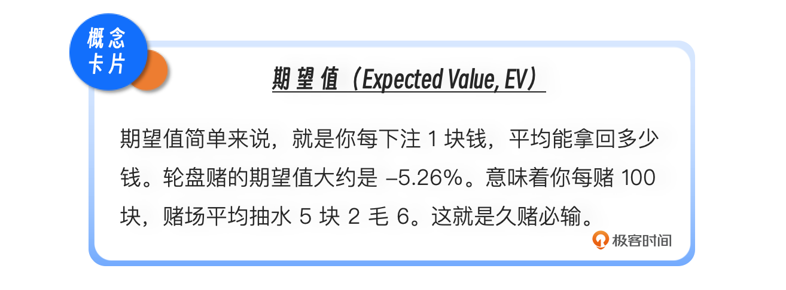
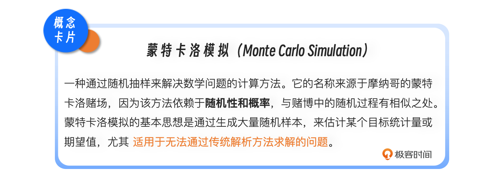
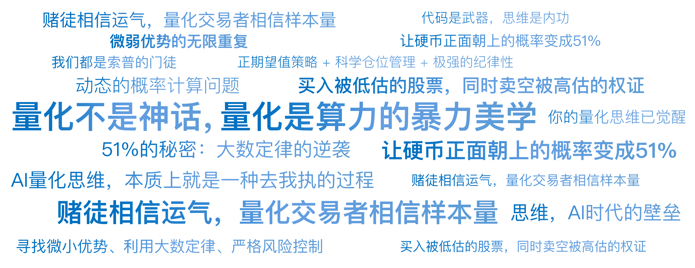

# 01｜拉斯维加斯的幽灵：索普的量化思维起源

你好，我是陈旸，欢迎来到《人人都用得上的 AI 量化思维课》。

在正式开始之前，我想请你闭上眼睛，想象这样一个场景：

那是 1961 年的冬天，美国内华达州的雷诺。一位穿着廉价西装、戴着厚底眼镜的大学教授，手里攥着一万美元——那是当时两个富裕家庭一年的总收入，他颤颤巍巍地走进了一家赌场。赌场的经理们站在暗处，嘴角挂着嘲讽的微笑。在他们眼里，这又是一只待宰的肥羊。毕竟，自赌场诞生以来，只有一种人能从这里带走财富，那就是开赌场的人。

然而，在这个夜晚结束时，赌场经理们的笑容凝固了。这位教授并没有像其他赌徒一样祈祷好运。他只是机械地盯着桌面上的牌，嘴里念念有词，然后像机器人一样下注。几个小时后，他面前的筹码堆积如山。两天后，他被这家赌场列入黑名单。一周后，整个拉斯维加斯的赌场都在流传着同一个恐怖的传说：有一个人，带着一种看不见的幽灵，击败了数学定律。

这个人，叫做爱德华·索普。

他不是赌神，他是麻省理工学院（MIT）的数学讲师。他带来的那个幽灵，后来有了一个震惊世界的名字——**量化交易（Quantitative Trading）**。

今天，我们的第一讲，不讲股市，不讲 K 线，我们只讲索普在那个冬夜里究竟悟透了什么。因为这，就是量化思维的创世纪。

## **两个世界的碰撞：当牛顿遇到上帝**

在索普之前，无论是赌博还是股票投资，都被视为一种艺术或者运气的游戏。那时候的华尔街，是格雷厄姆这种捡烟蒂的价值投资者，或者是杰西·利弗莫尔这种凭天赋的盘感大师的天下。大家相信的是内幕消息、企业调研、宏观经济，或者是某种玄之又玄的直觉。

但在索普眼里，这个世界只有两种东西：确定性事件和概率性事件。如果你把苹果扔向空中，它一定会掉下来，这是物理学的确定性。但如果你扔一枚硬币，它正面朝上的概率是 50%，这是数学的概率性。

索普思考的问题是：**如果我能找到一种方法，让硬币正面朝上的概率变成 51%，会发生什么？**

在当时的常识里，这被认为是不可能的。赌场里最流行的游戏是轮盘赌和 21 点（Blackjack）。数学家早就证明了，这些游戏的设计都是**负期望值**游戏。

所有的数学家都告诉索普：“别傻了，没人能战胜庄家的大数定律。”但索普是个叛逆者。他敏锐地发现了一个被所有人忽略的盲点：独立事件 vs 关联事件。

轮盘赌是独立事件。上一把开出红，不会影响下一把开出黑的概率。小球没有记忆。但 21 点不一样。21 点用的是一副或几副牌，发出去的牌不会放回牌堆。这就意味着：**上一张牌是什么，直接决定了剩余牌堆的结构，进而改变了下一张牌的概率。**

如果发出的全是小牌（2, 3, 4, 5, 6），那么剩下的牌堆里，大牌（10, J, Q, K, A）的比例就会急剧升高。在 21 点规则里，大牌多，对玩家有利（更容易拿到 Blackjack 获得 1.5 倍赔付，或者让庄家爆牌）；小牌多，对庄家有利。

索普意识到：这根本不是赌博，这是一个**动态的概率计算问题**！ 只要我能记住发了什么牌，我就能算出现在的胜率是对我有利，还是对庄家有利。

这不仅是量化交易的起源，更是 AI 思维的雏形——利用历史数据（发出的牌），预测未来概率（下一张牌），并据此做出决策（下注）。

## **那个时代的 AlphaGo：IBM 704**

原理听起来简单——记牌。但实际操作极难。一副牌有 52 张，排列组合是个天文数字。在那个没有个人电脑的年代，如何计算出每一种残局下的最优打法？

索普做了一件在当时看来极其疯狂的事。他是 MIT 的讲师，拥有使用学校里那台庞然大物——IBM 704 大型计算机的权限。这台计算机占据了整整一个房间，运算能力甚至不如你现在手里拿着的智能手机的万分之一。但在 1960 年，它是人类最顶尖的智慧结晶。

索普白天教书，晚上就躲进机房，把 21 点的规则写成 Fortran 代码，让这台巨兽不知疲倦地进行蒙特卡洛模拟。他让计算机自己跟自己玩了几亿局 21 点。计算机输出了海量的数据，索普在一张张打孔卡片中，寻找那个能战胜庄家的策略表。

最终，他发现了一套惊人的规律：

**基本策略：**在不记牌的情况下，只要严格按照这套表格打（比如庄家是 6，你是 12，必须停牌），就能把赌场的优势从 5% 压缩到 0.5% 以内。**算牌法：**如果加上记牌，玩家的优势可以由负转正，达到 +1% 甚至 +5%。

这就是人类历史上第一个经过计算机验证的量化策略。

索普把计算机算出来的结果背得滚瓜烂熟，带着这颗硅基大脑走进了拉斯维加斯。于是，就有了开头那一幕。

## **这给我们什么启示？**

在 AI 时代，我们做量化交易，其实就是在重复索普当年的工作：

- IBM 704 就是现在的 GPU 集群；
- 几亿局模拟就是现在的回测；
- 算牌法就是现在的交易策略。

**量化不是神话，量化是算力的暴力美学。**当别人还在靠盘感猜大小时，索普已经用算力穷尽了所有可能性。

## **51% 的秘密：大数定律的逆袭**

索普的成功，揭示了量化思维最核心的秘密：**微弱优势的无限重复。**

很多初学者问我：“老师，量化策略的胜率是不是要 90% 才行？” 甚至有人因为策略胜率只有 55% 而感到沮丧。让我们看看索普的胜率是多少。通过复杂的算牌，索普对赌场的优势，大部分时候只有 1% 到 2%。也就是说，在大多数时候，他和赌场的胜负是五五开的。他也会连续输钱，也会遭遇连败。

但索普从不慌张。因为他信仰大数定律。

如果你的优势只有 1%，你玩 10 把，你可能输得很惨，那是运气；你玩 100 把，你可能小输小赢，那是波动；但如果你玩 10,000 把，根据数学定律，你的收益将不可避免地、极其精准地收敛于那 1% 的正收益。

**赌徒相信运气，量化交易者相信样本量。**

在索普眼里，每一把牌局的输赢都不重要，重要的是继续留在牌桌上，直到大数定律显灵。为了解决如何不被波动清洗出局的问题，索普引入了另一个数学天才凯利的研究成果——**凯利公式**。

凯利公式告诉索普：既然你的优势只有 1%，你就不能全仓梭哈。你应该根据优势的大小，动态调整下注比例。优势大时（大牌多），下重注；优势小时（小牌多），下最小注甚至不下注。这成为了后来量化交易仓位管理的圣经。

索普在赌场里的胜利，本质上是 “正期望值策略 + 科学仓位管理 + 极强的纪律性”的胜利。这也回答了那个终极问题：赌博和投资的区别是什么？

- 赌博是参与一个期望值为负的游戏（如彩票、轮盘赌），玩得越久，输得越光。
- 量化投资是寻找一个期望值为正的微弱优势（如算牌、套利），然后通过风险控制，把这个优势无限放大。

## **幽灵飘向华尔街：从赌场到对冲基金**

拉斯维加斯的赌场老板们虽然不懂数学，但他们懂生意。当他们发现无论如何都赢不了索普时，他们采取了最原始的手段：掀桌子。索普被下了迷药，汽车刹车线被剪断，全美赌场将他列入黑名单。既然赌场不让玩了，索普把目光投向了世界上最大的赌场——华尔街。

1960 年代的华尔街，比拉斯维加斯还要原始。那时候的基金经理还在靠常春藤校友会的消息炒股。索普发现，华尔街充满了错误的定价。比如，有些公司的权证（Warrants）价格高得离谱，而对应的股票价格却很低。在普通人眼里，这只是两个数字。在索普眼里，这是一个必须回归的数学等式。他成立了人类历史上第一家真正意义上的量化对冲基金——普林斯顿 - 纽波特合伙公司（Princeton Newport Partners）。

他的策略非常简单（从现在的视角看）：**买入被低估的股票，同时卖空被高估的权证**。无论股市大盘涨还是跌，只要这两个价格最终回归到数学上的合理关系，他就能赚钱。这就是著名的统计套利的雏形，也是后来 Delta Neutral（德尔塔中性）策略的鼻祖。

结果如何？在这一策略运行的 19 年里（1969-1988），索普的基金没有任何一年是亏损的。即使在标普 500 指数下跌 20% 的熊市里，他也依然赚钱。他把在赌场里对付庄家的那套逻辑——**寻找微小优势、利用大数定律、严格风险控制**——完美复制到了金融市场。

索普用亲身经历证明了：**华尔街不过是一个更体面、赔率更好，而且不会打断你腿的赌场。**

## **对 AI 时代的启示：我们都是索普的门徒**

故事讲到这里，我想你应该明白了，为什么我们的课程要从索普讲起。在今天，当你打开电脑，准备学习 Python，准备使用 AI 工具（DeepSeek、Cursor、QMT）来辅助交易时，你其实正站在索普的肩膀上。

现在的市场环境比索普时代复杂了一万倍：

- 简单的算牌早已失效；
- 简单的价差套利已经被高频交易机器人吃干抹净。

但是，量化交易的灵魂从未改变：

**数据是燃料**：索普用的是发出的扑克牌数据，我们用的是 K 线、成交量、财报、新闻舆情数据。**算力是引擎**：索普用的是 IBM 704，我们用的是本地电脑和云端的 AI 大模型。**概率是信仰**：我们不再预测明天的茅台是涨是跌（那是算命），我们只计算在当前因子组合下，茅台上涨的概率是 55% 还是 45%。

**AI 量化思维，本质上就是一种去我执的过程。**

它要求你像索普一样，承认自己的直觉是不可靠的，承认市场是充满噪音的。它要求你把自己变成一个冷酷的执行者，只听命于数据和概率。

- 当你能够坦然接受连续 10 次的止损，因为你知道你的策略长期期望值是正的。
- 当你不再因为错过一只妖股而拍大腿，因为你知道那不符合你的模型逻辑。
- 当你开始用“胜率、赔率、最大回撤”这些词来描述交易，而不是用“感觉、应该、好像”时。

恭喜你，你的量化思维已经觉醒了。

## 本讲金句弹幕

## **课后思考**

索普当年之所以能赢，是因为他发现了 21 点是一个非独立事件游戏（记忆发出的牌可以改变胜率）。那么，请你思考一下：

- 股票市场是一个独立事件游戏，还是一个非独立事件游戏？
- 今天的 K 线走势，会影响明天的走势吗？
- 如果是随机的独立事件，量化为什么还能赚钱？
- 如果不是随机的，为什么大家都说股市很难预测？

这些问题，是所有量化策略的起点。我们将在后续的课程中，通过随机漫步理论与有效市场假说带你来寻找答案。下一节课，我们将去拜访另外两位大神——格雷厄姆和巴菲特，看看在量化投资者的显微镜下，所谓的价值投资，究竟是一场怎样的数学游戏。

欢迎你在留言区留下自己的想法和思考，如果你身边有对 AI 量化思维感兴趣的朋友，可以邀请他一起来学习，我们下节课再见！

---
来源：极客时间
链接：https://time.geekbang.org/column/article/943491
日期：2026-05-18
