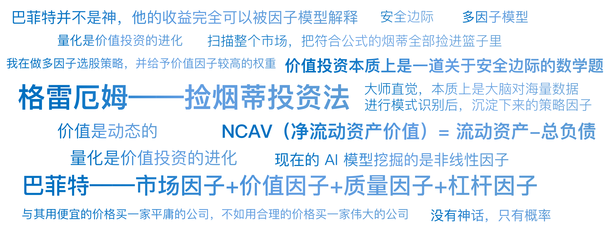

# 02｜格雷厄姆到巴菲特：捡烟蒂的数学题

你好，我是陈旸。

上一讲，我们见证了索普用大数定律把赌场变成提款机。今天，我们要离开纸醉金迷的拉斯维加斯，来到大萧条时代的华尔街。

我们要聊两个人。一个是股神沃伦·巴菲特，另一个是他的老师，本杰明·格雷厄姆。提起这两人，你脑海里浮现的词汇可能是“长期主义、时间的玫瑰、护城河”这些充满诗意的概念。但在量化交易分析师眼里，他们并不是诗人，而是顶级的算法工程师。

如果我告诉你，巴菲特其实是一个深度学习模型，而格雷厄姆是一个手工执行的量化脚本，你会不会觉得不可思议？听完这节课的讲解，你会发现，所谓的价值投资，本质上就是一道关于**安全边际**的数学题。

## **华尔街的收尸人**

时间来到了美国的 20 世纪 30 年代。美国刚刚经历了 1929 年的大崩盘，道琼斯指数跌去了 89%。满大街都是失业者，华尔街的股票像废纸一样没人要。这时候，有一个叫本杰明·格雷厄姆的人，开始在废墟里翻翻找找。他不管这家公司是做什么的——是造铁路的、挖煤的、还是卖纺织品的——他根本不在乎公司的愿景，也不听 CEO 画的大饼。他只看一样东西：**清算价值**。

格雷厄姆发明了一种极其冷血的策略，后来被形象地称为捡烟蒂投资法。

想象一下，你走在街上，看到地上有一个被丢弃的烟蒂。它很脏，没人要，但里面还剩最后一口烟。如果你把它捡起来抽一口，那是免费的，是纯赚的。在股市里，这种烟蒂就是那些股价跌破了流动资产价值的公司。格雷厄姆给自己定下了一个极其严格的数学公式，这个公式是量化历史上最早的选股因子：

> NCAV（净流动资产价值）=流动资产−总负债

<br />

**格雷厄姆的算法：**

计算一家公司的 NCAV。如果市值 < NCAV × 66%，买入。如果不满足，就不看，不管它有多好的故事。分散买入 30-100 只这样的股票。当股价涨回到 NCAV，或者持有满两年，卖出。

你看，这哪里是炒股，这就是一套硬编码的量化策略！在这个策略里：

- **因子**：低市净率（PB）、低流动资产折扣。
- **阈值**：0.66 的安全边际。
- **风控**：极度分散（因为烂公司可能真的会破产，必须靠大数定律对冲个股风险）。

格雷厄姆根本不需要去拜访管理层，他只需要一张资产负债表和一个计算器。他就像一个机器人，扫描整个市场，把符合公式的烟蒂全部捡进篮子里。

结果如何呢？在 1936 年到 1956 年这 20 年间，格雷厄姆的年化收益率约为 20%，远远跑赢了大盘。

\*\*量化思维的第一次顿悟：\*\*所有的基本面分析，如果能被标准化为一套 “如果…那么…”的规则，它就是量化。格雷厄姆可以说是世界上第一个量化交易员。

## **从捡破烂到买皇冠：因子的迭代**

格雷厄姆的烟蒂策略非常完美，直到——它失效。随着经济复苏，市场变得越来越有效，那些跌破清算价值的便宜货越来越少。到了 1960 年代，格雷厄姆的徒弟沃伦·巴菲特发现，如果不改变算法，他将无股可买。

更糟糕的是，巴菲特买了一家叫伯克希尔·哈撒韦的纺织厂，这原本是一个标准的烟蒂。但巴菲特发现，这个烟蒂不仅最后一口没抽到，反而因为纺织业的衰退，烫了自己的嘴。这时候，巴菲特的算法发生了一次重大的迭代。这要归功于他的合伙人——查理·芒格。

芒格告诉巴菲特：“与其用便宜的价格买一家平庸的公司，不如用合理的价格买一家伟大的公司。”这句话翻译成量化语言是什么意思？

这意味着巴菲特在格雷厄姆的价值因子基础上，增加了一个新的因子——**质量因子**。

- **格雷厄姆的模型：** Score = - Price （越便宜越好）
- **巴菲特的模型：** Score = - Price + Quality + Growth （便宜 + 高 ROE + 高护城河）

巴菲特开始寻找那些具有**高净资产收益率（ROE）**、**稳定现金流**、**强大品牌护城河**的公司（如可口可乐、喜诗糖果）。如果你去翻看 AQR（全球顶尖量化对冲基金）那篇著名的论文《巴菲特的阿尔法》（Buffett’s Alpha），你会发现一个惊人的结论：**巴菲特并不是神，他的收益完全可以被因子模型解释。**

论文指出，巴菲特的成功可以归结为四个量化因子的长期暴露：

\*\*市场因子（Market）：\*\*长期做多美国国运。\*\*价值因子（Value）：\*\*喜欢买低市盈率（PE）、低市净率（PB）的股票。\*\*质量因子（Quality）：\*\*喜欢高利润率、低波动率的公司。\*\*杠杆因子（Leverage）：\*\*利用保险浮存金进行低成本加杠杆。

这就好比巴菲特发现了一组黄金参数，持之以恒地执行了 50 年。这给了我们什么启示呢？

**所谓的大师直觉，本质上是大脑对海量数据进行模式识别后，沉淀下来的策略因子。** 巴菲特就是那个时代算力最强、算法最优的生物神经网络。

## **为什么你学巴菲特会亏钱？**

现在问题来了。既然巴菲特的逻辑可以被量化公式拆解，为什么无数人学巴菲特价值投资，最后却亏得一塌糊涂？在量化思维看来，散户的价值投资通常犯了两个致命的数学错误。

### **错误一：陷入价值陷阱**

很多散户只学了格雷厄姆的皮毛，看到 PE（市盈率）低就买。比如，某只股票跌到了 5 倍 PE，你觉得很便宜。但量化模型会告诉你，它之所以便宜，是因为市场预测它明年的利润会腰斩。如果明年的利润真的腰斩了，现在的 5 倍 PE，到明年就变成了 10 倍 PE。它根本不便宜。

**AI 量化怎么做？**

AI 不仅仅看静态的 PE，它会引入动量因子和另类数据。如果一只股票 PE 很低，但最近的分析师集体下调了这支股票的投资评级，或者供应链数据在暴跌，AI 会判定这是价值陷阱，直接剔除。

### **错误二：缺乏大数定律的保护**

巴菲特早期持仓非常分散，后期是因为资金量太大才不得不集中。但很多散户只有 10 万块钱，却敢全仓买入一只低估的股票。这就违背了概率论。即便你有 80% 的胜率，如果只下注一次，你依然有 20% 的概率归零。

**AI 量化怎么做？**

量化投资基金（如达里奥的桥水、西蒙斯的大奖章）往往同时持有几百甚至几千只股票。它们不追求在某一只股票上赚 10 倍，而是追求在整个组合上获得稳定的阿尔法（Alpha）。

## **现代视角的翻译：多因子模型**

讲到这里，我们可以把价值投资这层神秘的面纱彻底揭开了。在现代量化交易中，我们可以把“我在做价值投资”换成\*\*“我在做多因子选股策略，并给予价值因子较高的权重。”\*\*这就引出了量化领域最著名的 Fama-French 三因子模型。1992 年，尤金·法玛和肯尼斯·弗伦奇提出，股票的超额收益主要来源于三个地方：

**市场风险（Market）：** 大盘涨你也涨。**规模因子（Size）：** 炒小盘股通常比大盘股收益高（流动性补偿）。**价值因子（Value）：** 炒便宜股（高账面市值比）通常比炒热门股收益高。

后来，这个模型又进化为五因子、六因子，加入了盈利因子和投资风格因子。

比如你在 QMT 实战训练营里写一个 Python 策略：

```
# 伪代码示例
选股条件 = (市盈率 < 20) & (ROE > 15%) & (市值 < 500亿)
```

这其实就是巴菲特和格雷厄姆思想的代码化。但是，AI 时代的量化，不仅仅是这几个因子了。现在的 AI 模型（如 XGBoost, Transformer）挖掘的是非线性因子。比如，以前我们认为 PE 越低越好。但 AI 可能会发现：

- 在牛市初期，PE 越低越好（价值回归）。
- 在牛市末期，PE 越高越好（泡沫疯狂）。
- 当通胀率大于 5% 时，低 PE 策略失效。

AI 能够捕捉到这些人类大脑无法处理的复杂逻辑。它依然是在捡烟蒂，但它捡的是数据海洋里的金子。

## **AI 量化策略建议**

通过拆解格雷厄姆和巴菲特，我们可以明白三个道理：

**没有神话，只有概率**：巴菲特之所以伟大，是因为他找到了正期望值的因子，并且利用保险资金（低成本杠杆）坚持了 60 年。**价值是动态的**：格雷厄姆的净流动资产因子在今天已经失效了，因为市场变了。任何因子都有生命周期，这就要求我们要不断寻找新的因子。这也解释了为什么你需要学习 AI，因为 AI 是挖掘新因子的挖掘机。**量化是价值投资的进化**：不要把量化看作是只有极客才玩的高频交易。当你用任何一套固定的标准去筛选股票时，你就是在做量化。

## 本讲金句弹幕



## **课后思考题**

如果你是格雷厄姆，活在今天的 A 股市场，你会用什么指标来定义便宜？是单纯的看 PE（市盈率）还是 PE+ 股息率，还是看这支股票含有几个热门的概念？欢迎你在留言区留下自己的想法，如果你身边有对 AI 量化思维感兴趣的朋友，可以邀请他一起来学习。

下节课，我们将进入一个更疯狂的世界。如果说格雷厄姆和巴菲特是试图寻找市场理性一面的数学家，那么接下来我们要讲的这个人，他是利用市场非理性赚钱的顶尖猎手。他就是——西蒙斯。我们将看看，为什么一群完全不懂金融的物理学家和数学家，能把华尔街那群老练的交易员按在地上摩擦？期待一下吧！

***

来源：极客时间
链接：<https://time.geekbang.org/column/article/943805>
日期：2026-05-18
