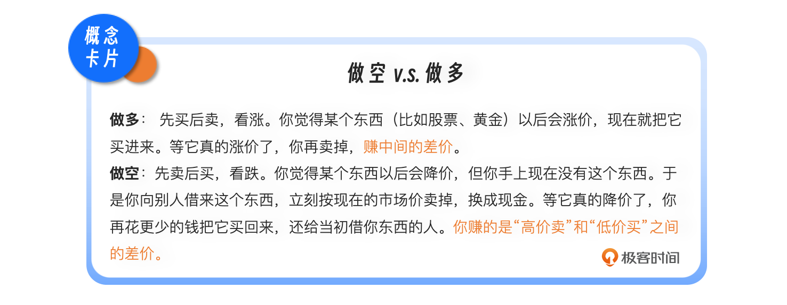
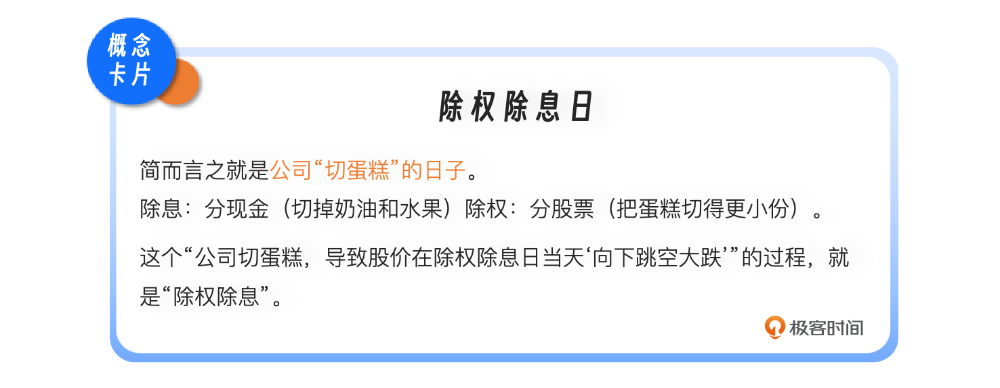
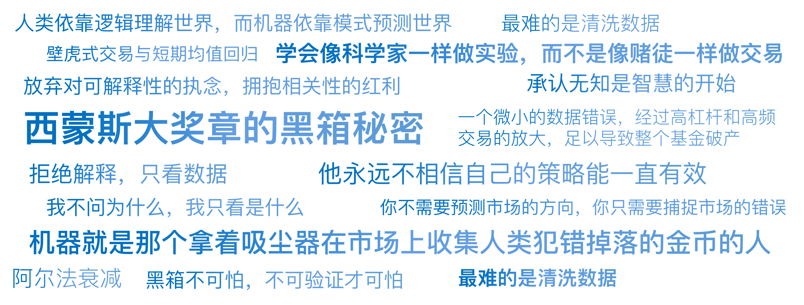

# 03｜只有偏执狂才能生存：西蒙斯大奖章的黑箱秘密

你好，我是陈旸。

如果让你列举世界上最赚钱的基金，你可能会想到桥水，想到索罗斯的量子基金。但在这一讲的主角面前，他们都得往后放一放。

有一支基金，从 1988 年成立到 2018 年，30 年间的平均年化回报率高达 66%。哪怕是扣除了极其昂贵的管理费（5% 管理费 +44% 业绩提成）之后，它的年化净回报依然达到 39%。这意味着，如果你在 1988 年投入 1 美元，到 2018 年，它会变成 20,000 美元。而同期的巴菲特，大约是 100 美元。

这支基金就是大奖章基金。它的掌门人詹姆斯·西蒙斯，不是金融科班出身，而是一位顶级的数学家（陈 - 西蒙斯定理的共同发现者）。他不招华尔街的精英，他的公司文艺复兴科技（Renaissance Technologies）里，充满了研究黑洞的天文学家、研究语音识别的计算机专家、以及破译密码的数学家。

为什么这群书呆子能把那群老练的华尔街交易员按在地上摩擦呢**？答案藏在一种全新的思维方式里：拒绝解释，只看数据。**

## **我不在乎为什么，我只知道它发生了**

传统的投资思维，无论是技术面还是基本面，都讲究一个因果逻辑。比如油价上涨，是因为中东局势紧张；股价下跌，是因为这家公司业绩暴雷。人类的大脑天生渴望故事，渴望解释。如果你不能给涨跌找出一个合理的理由，你就不敢下单。

但西蒙斯不仅不需要理由，他甚至鄙视理由。在西蒙斯的量化思维里，世界太过复杂，充满了蝴蝶效应。一个股价的波动，可能是因为美联储的政策，可能是因为某个基金经理手滑了，也可能是因为那天纽约下了暴雨导致交易员心情不好。

试图寻找为什么，往往是徒劳的，甚至是自欺欺人的叙事谬误。西蒙斯的哲学是：**我不问为什么，我只看是什么。**

他发现，市场中存在着无数微小的、难以察觉的模式（Patterns）。这些模式可能没有任何经济学解释。举个虚构的例子：文艺复兴的计算机可能会发现一个规律：“每当东京时间上午 10 点下雨，且伦敦金价下跌 0.5% 时，纽约市场的某个科技股在开盘后 5 分钟内上涨的概率是 52%。”

这个规律听起来荒谬吗？毫无逻辑吗？是的。任何一个经济学家都会告诉你这是伪相关。但西蒙斯不在乎。只要统计数据显示这个规律在过去 20 年里反复出现，且具有统计显著性，他就敢下注。**这就是 AI 量化思维的极致：放弃对可解释性的执念，拥抱相关性的红利。**

在这个维度上，西蒙斯其实是机器学习在金融领域的先驱。现在的 AI 大模型其实也是一样：它不知道什么是语法，也不知道什么是逻辑，它只需要通过海量数据训练，知道当这几个词出现后，下一个词大概率是哪个。

**人类依靠逻辑理解世界，而机器依靠模式预测世界**。在金融这个充满噪音的混沌系统中，机器的模式识别能力，远胜于人类的逻辑推理能力。

## **像气象局一样做交易**

如果大奖章基金是一个黑箱，那这个黑箱里装的到底是什么策略呢？虽然他们的代码从未公开，但通过公开的论文和员工的只言片语，我们可以拼凑出一个核心逻辑：**壁虎式交易与短期均值回归。**

西蒙斯曾用天气预报来比喻他的交易哲学。我们要预测明年夏天的平均气温（长期趋势），这很难，因为变数太多。但是，我们要预测未来 15 分钟内会不会刮一阵风，这相对容易，因为云层的移动是有轨迹的。大奖章基金不做长期预测（那是巴菲特的事）。它专注于极短期的预测。它在几天、甚至几分钟、几秒钟的尺度上，寻找价格的异常波动。

- **套利模型**：如果 A 股票和 B 股票过去一直是同步涨跌的，突然 A 涨了，B 没动，模型就会瞬间做空 A，做多 B，赌它们会回归同步。
- **均值回归**：如果某只股票在短时间内被散户的情绪非理性地买高了（超买），模型就会识别出这种不可持续的动量，反手做空，等待价格回落。

这些机会的利润极薄。每一笔交易可能只赚几分钱。但是，文艺复兴的计算机每天进行成千上万次交易。这就好比你在赌场里，虽然你算不出下一把是庄赢还是闲赢，但如果你发现荷官洗牌的手法有一个微小的漏洞，每 1000 把牌里会多出一张 A。普通人看不出这个漏洞，但机器能看到。于是，机器就在这 1000 把牌里疯狂下注，积少成多。

西蒙斯的成功证明了：**你不需要预测市场的方向，你只需要捕捉市场的错误。**只要市场是由人参与的，人就会犯错（恐惧、贪婪、过度反应）。机器就是那个拿着吸尘器，在市场上收集人类犯错掉落的金币的人。

## **只有偏执狂才能生存：数据的洁癖**

如果说西蒙斯的成功有一半归功于天才的算法，那么另一半，绝对归功于他那近乎变态的数据偏执。这就要提到英特尔前 CEO 安迪·格鲁夫的名言：只有偏执狂才能生存。这句话也是大奖章基金的真实写照。

你可能认为做量化，最难的是写出高深的数学模型。其实不是，**最难的是清洗数据**。在西蒙斯刚开始做量化时，互联网还没普及。为了获取最准确的历史数据，他派人去美联储的地下室，去图书馆的旧纸堆里，把 100 年前的棉花价格、大豆库存、国债收益率，通过人工手抄、拍照的方式记录下来。

回来之后，还要进行炼狱般的数据清洗。

- 这一天的数据缺失了，是因为交易所放假，还是因为记录员漏写了？
- 这一天的价格暴跌，是因为真实的崩盘，还是因为股票拆股（1 股拆成 2 股，价格自然减半）？
- 这个收盘价，是下午 3 点的价格，还是 4 点的价格？

对于普通人来说，这只是一个小误差。但对于量化模型来说就是 Garbage In, Garbage Out（垃圾进，垃圾出）。一个微小的数据错误，经过高杠杆和高频交易的放大，足以导致整个基金破产。

文艺复兴科技公司有几十名博士，哪怕是拥有斯坦福物理学学位的顶级人才，刚进去的前六个月，可能都在干一件事：洗数据。他们要确保喂给机器的每一口饲料，都是清洗验证过的。这种对基础数据的极度偏执，构成了大奖章基金最坚硬的护城河。后来者即便拿到了同样的算法，但因为使用的是充满了噪点和错误的公开数据，跑出来的结果就是天壤之别。

## **给 AI 时代投资者的启示**

当你现在的 Cursor 写 QMT 代码时，你是否关注过你的数据源？你的回测数据是否包含退市的股票（幸存者偏差）？是否处理了除权除息（前复权）？如果你的态度是差不多就行，那你永远成不了西蒙斯，你只能成为韭菜。

### **永不停歇的军备竞赛**

西蒙斯的另一个偏执之处在于：**他永远不相信自己的策略能一直有效。**在量化界，有一个残酷的定律叫阿尔法衰减。一个赚钱的策略，就像一个露天金矿。一开始只有你挖，满地是金子。但慢慢地，别人也发现了，大家都来挖，金矿很快就会枯竭。比如第一讲提到的 21 点算牌法，后来赌场引入了自动洗牌机，那个策略就彻底失效了。

大奖章基金的内部，永远处于一种自我革命的状态。他们不断地寻找新的信号，哪怕这个信号只能提升 0.01% 的胜率。一旦发现旧的信号失效，立刻无情抛弃。

西蒙斯曾说：**“我们就像一只在前面跑的兔子，后面有一群猎狗（其他对冲基金）在追。如果我们停下来，就会被吃掉。”**

这也是为什么大奖章基金从不对外募资，甚至把内部员工之外的所有资金都退回去了。因为策略容量有限，资金太大，就会惊动市场，导致策略失效。这就是量化的动态博弈。没有一本万利的圣杯，只有永不停止的军备竞赛。

### **人机结合的终极形态**

2010 年，西蒙斯退休了。但他创造的这台机器，依然在高速运转，为他源源不断地赚取数十亿美金。西蒙斯的故事，给身处 AI 时代的我们留下了什么？

**承认无知是智慧的开始**。在这个复杂系统中，人类的直觉是渺小的。与其试图用宏大叙事去解释市场（比如预测国运），不如低头用数据去验证每一个微小的假设。**黑箱不可怕，不可验证才可怕**。很多人批评量化是黑箱。但西蒙斯的黑箱是建立在严苛的科学验证基础上的。他不懂经济学，但他懂统计显著性。如果一个策略在样本外测试中有效，那它就是真理，不需要经济学家的背书。**偏执是核心竞争力**。在 AI 工具盛行的今天，你可以容易地编写出量化交易代码，但你能否像西蒙斯一样，对数据质量有洁癖？能否像他一样，日复一日地打磨每一个参数？

技术可以复制，但精神很难复制。在后续的课程中，我们会不断回到这个主题：如何建立一套像大奖章基金一样严谨的研发流程？我们不需要成为数学博士，但我们需要学会像科学家一样做实验，而不是像赌徒一样做交易。

## 本讲金句弹幕

## **课后思考**

西蒙斯利用的是市场的无效性（错误定价）来赚钱。但是，随着现在量化基金越来越多，AI 越来越强，市场上的烟蒂和漏洞被挖掘得越来越干净，市场变得越来越有效。**你认为，在 AI 高度发达的未来，散户还有机会战胜机构吗**？这是一个开放性问题，没有标准答案。但我希望你能带着这个问题，走进下一讲。

下一讲，我们将迎来一位与西蒙斯截然相反的大神——乔治·索罗斯。西蒙斯相信数学模型，而索罗斯却说：“世界经济史是一部基于假象和谎言的连续剧。” 他将教给我们量化思维的另一面：既然市场永远是错的，那我们如何利用这个巨大的错误来赚大钱？

欢迎你在留言区留下自己的想法和思考，如果你身边有对 AI 量化思维感兴趣的朋友，可以邀请他一起来学习，我们下节课再见！

---
来源：极客时间
链接：https://time.geekbang.org/column/article/944781
日期：2026-05-18
